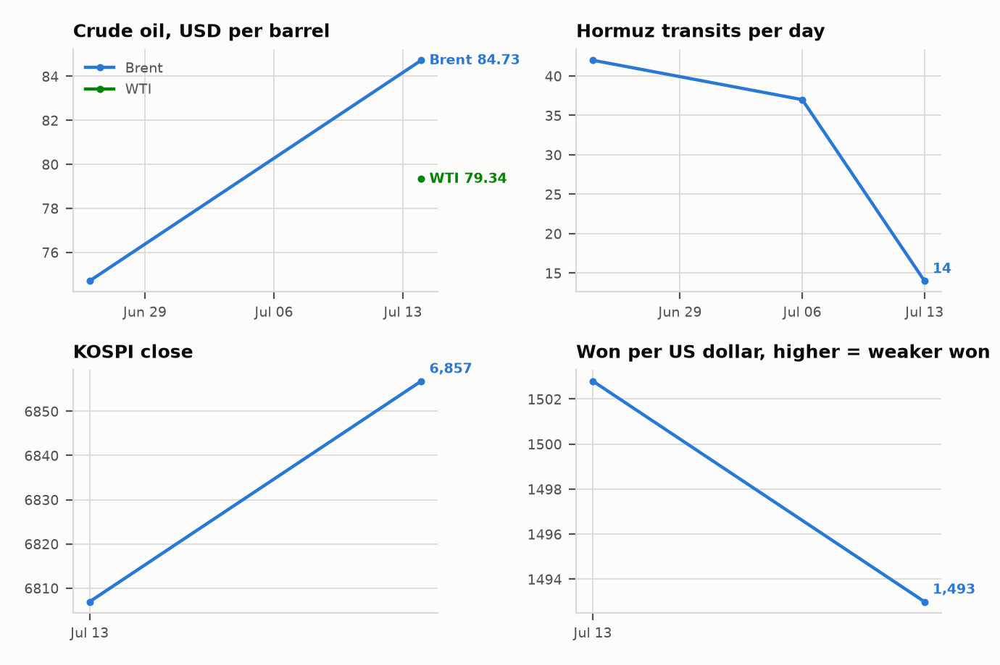

# Middle East Daily Briefing

**July 20, 2026**

- **Reporting window:** 약 24시간, 7월 19일 08:00 ~ 7월 20일 08:00 (한국시간)
- **Overall assessment:** Washington's answer to its first combat deaths arrived — and it was calibrated, not the class break the "1,000 missiles" post threatened. The retaliatory wave (completed 03:30 GMT Sunday) stayed on coastal surveillance, air defense, maritime and missile storage targets and the IRGC units behind the Jordan strike, leaving the power grid untouched and the Houthi trigger unpulled — but one munition found a target no wave had touched this round: the under construction Darkhovin nuclear power plant in Khuzestan, which the IAEA says held no nuclear material. Iran called it an attack on a safeguarded facility and the UN is investigating, while Trump's first words on his dead soldiers — "a very sad thing," plus "we're never allowing Iran to have a nuclear weapon" — quietly re-framed the war's rationale toward the nuclear file. The US toll rose anyway: a service member killed in northern Iraq disposing of a downed Iranian drone, and remains found at Muwaffaq Salti that may close the MIA case. Iran kept its own campaign inside its established classes — Kuwait's power and desalination infrastructure burned for a third straight day, and a missile toward Aqaba drew the war's first joint Israeli–Jordanian interception and an Israeli promise to hit back "without any dependence or conditions." The structural move of the window was at sea: the IRGC says it fired on and stopped ships attempting to exit Hormuz outside its designated route — the blockade hardening into a licensing regime enforced with munitions. Seoul, silent through the weekend, finally moved: an emergency MOFA session urged Korean nationals to leave the Middle East, even as the 15th crude tanker cleared the Red Sea workaround. Monday's Seoul open now prices a three shock weekend with Brent's Friday $88.10 still the standing number.

---

## 1. What Happened

### 1.1 The Retaliation Wave Reaches a Nuclear Site at Darkhovin

The US retaliatory wave for the Jordan deaths ran from 18:00 to 23:30 ET Saturday (completed 03:30 GMT Sunday), hitting what CENTCOM described as "Iranian military coastal surveillance and air defense facilities, maritime capabilities, and missile and drone storage sites," plus the IRGC forces that launched the Jordan attack — strikes officials framed as punishment of the IRGC and further degradation of Iran's ability to threaten shipping in Hormuz; Iranian media reported explosions at Bandar Abbas, Qeshm Island and near Sirik ([Al Jazeera](https://www.aljazeera.com/news/2026/7/19/us-launches-eighth-consecutive-night-of-attacks-on-iran), [OANN](https://www.oann.com/newsroom/centcom-announces-new-airstrikes-to-punish-irgc-after-deaths-of-2-u-s-service-members/), [The Hill](https://thehill.com/homenews/5976478-us-strikes-iran-retaliation/), [NPR](https://www.npr.org/2026/07/18/nx-s1-5899039/us-troops-killed-missing-iran-jordan)). Inside the same wave, at 3:39 a.m. local time, US projectiles struck the construction site of the Darkhovin nuclear power plant in Khuzestan province — Iran's Atomic Energy Organization called it "an aggressive and barbaric act in violation of international law" against "a peaceful nuclear facility under international safeguards," while the IAEA said the facility "is in the very early stages of construction and contained no nuclear material when last visited," posing no radiological risk; the UN is investigating ([TASS](https://tass.com/world/2162155), [CGTN](https://news.cgtn.com/news/2026-07-19/Iran-says-planned-nuclear-plant-attacked-by-US-Hormuz-vessels-stopped-1OUwNE66j9m/p.html), [ANI](https://aninews.in/news/world/middle-east/us-attacked-under-construction-darkhovin-nuclear-power-plant-says-irans-atomic-energy-organisation20260719184902/), [UPI](https://www.upi.com/Top_News/World-News/2026/07/19/iran-us-nuclear-power-plant-strikes/7371784468010/), [Middle East Eye](https://www.middleeasteye.net/news/iran-accuses-us-violating-international-law-after-strike-nuclear-plant)). Power generation plants and the grid proper remain unstruck. **Confidence: High** on the wave, its target classes and the Darkhovin hit (CENTCOM statement plus AEOI acknowledgment, multi outlet); **Medium** on whether Darkhovin was deliberately targeted rather than struck as part of a broader target sheet (no US confirmation naming it).

### 1.2 The American Toll Rises: a Death in Iraq and Remains Found at Muwaffaq Salti

A US service member was killed Saturday in northern Iraq during the controlled detonation of unexploded ordnance from a downed Iranian one way attack drone, with a second wounded — and CENTCOM said personnel found unidentified remains Sunday at the site of Friday's attack in Jordan, with an examination under way to determine whether they belong to the missing service member ([Forbes](https://www.forbes.com/sites/saradorn/2026/07/19/us-service-member-killed-in-iraq-after-2-deaths-in-jordan/), [Army Times](https://www.armytimes.com/news/your-military/2026/07/19/us-service-member-killed-in-northern-iraq-us-central-command-says/), [NBC](https://www.nbcnews.com/world/middle-east/us-service-member-killed-in-iraq-rcna588275), [Axios](https://www.axios.com/2026/07/19/us-military-finds-service-member-remains-jordan), [Fortune](https://fortune.com/2026/07/19/us-military-death-service-member-controlled-detonation-iranian-drone-iraq/)). The disclosures bring the war's US service member toll to 18 by RFE/RL's count ([RFE/RL](https://www.rferl.org/a/centcom-deaths-iraq-jordan-remains-attacks/33806990.html)). Trump, speaking for the first time about the Jordan deaths — from his golf weekend, which drew heavy criticism — called them "a very sad thing" and added: "we're never allowing Iran to have a nuclear weapon" ([The Hill](https://thehill.com/homenews/administration/5976615-trump-reacts-jordan-deaths-iran-strikes/), [NewsNation](https://www.newsnationnow.com/us-news/military/2-us-service-members-killed-in-action-in-jordan/), [Salon](https://www.salon.com/2026/07/19/hate-to-see-it-happen-trump-uses-troop-deaths-to-defend-nuclear-iran-narrative/), [Daily Beast](https://www.thedailybeast.com/donald-trump-breaks-silence-on-american-troops-killed-in-iran/)). **Confidence: High** on the Iraq death and the remains (CENTCOM statements, multi outlet); **Medium** on the 18 total (counting bases differ across outlets — some carry 17).

### 1.3 Kuwait Hit a Third Straight Day as a Missile Flies Toward Aqaba

Iran fired fresh waves of missiles and drones at Kuwait and Bahrain on Sunday, with Kuwaiti authorities saying one attack set a power generation and water desalination plant ablaze — the third consecutive day Kuwait's power and water infrastructure has been struck ([Al Jazeera](https://www.aljazeera.com/news/2026/7/19/kuwaiti-power-plant-ablaze-as-iran-hits-us-gulf-allies), [RFE/RL via GlobalSecurity](https://www.globalsecurity.org/wmd/library/news/iran/2026/07/iran-260719-rferl01.htm)). Iran's army said it targeted a US Navy facility in Kuwait and American depots at Camp Udairi and Ali Al Salem Air Base with one way attack drones, framing the strikes as response to US attacks on civilian infrastructure ([CGTN](https://news.cgtn.com/news/2026-07-19/Iran-says-planned-nuclear-plant-attacked-by-US-Hormuz-vessels-stopped-1OUwNE66j9m/p.html), [ABC](https://abcnews.com/International/live-updates/iran-live-updates-kuwait-reports-attacks-after-latest/?id=134704698)). Jordan said its defenses intercepted three Iranian missiles Sunday afternoon with a fourth landing in a remote area, and Israel's military said an Iranian missile fired toward the Jordanian Red Sea city of Aqaba — on Israel's Eilat doorstep — was intercepted jointly by Israeli and Jordanian forces; Defense Minister Israel Katz warned: "If Iran attacks Israel, Israel will respond and strike back without any dependence or conditions" ([CNN](https://www.cnn.com/2026/07/19/world/live-news/iran-war-trump), [JPost](https://www.jpost.com/middle-east/iran-news/2026-07-19/live-updates-902897)). **Confidence: High** on the Kuwait plant fire and the Aqaba interception (government statements, multi outlet); **Medium** on the specific US facilities Iran claims to have hit (Iranian statements without US damage confirmation).

### 1.4 The IRGC Fires on Ships Exiting Hormuz and Claims Full Transit Control

The IRGC Navy said four "violating vessels" — which it claimed acted "with the malicious intent and support of American terrorists" — switched off navigation systems and attempted to exit the Strait of Hormuz outside Iran's designated route; in an operation the force said involved missiles and drones, two ships "were involved in an incident in the unsafe waters" and were brought to a halt, and two turned back ([Anadolu](https://www.aa.com.tr/en/us-israel-iran-war/iran-says-irgc-navy-intercepted-4-violating-ships-in-strait-of-hormuz/4001887), [Tasnim](https://www.tasnimnews.ir/en/news/2026/07/19/3651003/irgc-navy-reports-incidents-involving-4-vessels-in-strait-of-hormuz), [Press TV](https://www.presstv.ir/Detail/2026/07/19/772573/IRGC-Navy-Two-vessels-suffer-accidents-after-trying-unsafe-Hormuz-route), [TASS](https://tass.com/world/2161873), [WION](https://www.wionews.com/world/irgc-strait-of-hormuz-ships-halted-us-iran-tensions-1784465816239)). The statement declared the only authorized passage is the Iranian designated safe route, warned that unsafe routes are mined, and repeated that "not a single drop of oil, gas, or chemical fertilizer" will transit without prior coordination ([Marine Insight](https://www.marineinsight.com/irans-islamic-revolutionary-guard-corps-navy-intercepts-detains-4-ships-in-strait-of-hormuz/), [Caliber](https://caliber.az/en/post/irgc-says-four-vessels-detained-in-strait-of-hormuz-warns-of-mined-routes)). The vessels' identities, flags and conditions were not disclosed, and no UKMTO or Kpler corroboration of the incident had surfaced by the window close. No fresh Hormuz transit count was published in the window (last confirmed print: 8 on July 16), and no laden LNG carrier has exited since July 11 ([CNBC](https://www.cnbc.com/2026/07/17/iran-war-oil-tanker-strait-hormuz-traffic-attacks-trump.html), [LNG Prime](https://lngprime.com/vessels/report-no-lng-carriers-passed-through-hormuz-since-july-11/192222/)). **Confidence: Medium** on the interception event (single party claim, consistent across Iranian outlets, no independent verification); **High** on the standing transit and LNG freeze data.

### 1.5 Seoul Breaks Its Silence: Departure Advisory and a 15th Tanker Through the Red Sea

South Korea's foreign ministry convened an emergency headquarters and missions meeting Sunday, chaired by Second Vice Minister Kim Jina with 17 Middle East missions participating, and urged Korean nationals in the region without urgent business to depart quickly — Kim said the week long resumption of US–Iran hostilities over Hormuz now sees "civilian facilities under attack and numerous casualties," making residents' safety a concern; Level 3 (departure recommendation) advisories have been in force for most Middle East states since March 8 ([Edaily](https://edaily.co.kr/News/Read?mediaCodeNo=257&newsId=01968006645516160), [Aju Business Daily](https://www.ajunews.com/view/20260719205025824)). The same day the oceans ministry said the 15th Korean crude tanker since the war began had passed through the Red Sea en route to Korea — the Yanbu loading workaround that now carries the marginal Korean barrel — while Seoul press flagged that the Houthis' broken truce puts this alternative route itself at risk ([MBC](https://imnews.imbc.com/replay/2026/nwtoday/article/6816176_37012.html), [Seoul Shinmun](https://www.seoul.co.kr/news/international/2026/07/19/20260719500068)). Korean markets reopen Monday 09:00 KST against the accumulated weekend: Thursday's −6.37% chip rout close, Friday's Brent spike to $88.10, and a weekend of first US combat deaths, a nuclear site strike and a third Kuwait infrastructure day, none of it yet priced in Seoul ([CNBC](https://www.cnbc.com/2026/07/19/us-says-it-targeted-iran-forces-after-deaths-of-two-american-troops.html)). **Confidence: High** on the MOFA meeting, advisory and tanker count (government statements via Korean Tier 1/2 press).

---

## 2. Deep Dive: Incentives and Motives

### 2.1 Why did Washington answer its first combat deaths at sea rather than at the grid?

Because the retaliation had to be seen to punish without obligating the next escalation. The target sheet CENTCOM published — coastal surveillance, air defense, maritime capabilities, missile and drone storage, plus the specific IRGC units behind the Jordan strike — is a lawyer's answer to dead soldiers: proportionate, attributable, and confined to the classes the campaign was already striking. It conspicuously excludes the two classes that would change the war: the power grid, whose striking is the declared trigger for a Houthi closure of Bab el-Mandeb, and leadership targets, which would foreclose what remains of mediation. That choice tells you the "1,000 missiles locked and loaded" post was rhetoric management for a domestic audience — the administration took the political cover of a named punishment wave while keeping the escalation ladder's next rungs unclimbed. The restraint is information: a president under fire for golfing through his soldiers' deaths still did not reach for the grid. IND-20260719-1 (class break by ~July 22) is trending toward the falsification side, and with it, near term Bab el-Mandeb activation risk eases — but does not close, because the toll is still rising (1.2) and each new death re-runs the same decision with less patience.

### 2.2 Was the Darkhovin strike nuclear signaling or target drift?

The evidence leans signaling, and the signal is aimed at the war's legal and narrative frame, not its physics. Darkhovin is the cheapest possible way to touch Iran's nuclear file: a construction site with no nuclear material, no radiological consequence, and no operating reactor — the IAEA said as much within hours. Militarily it is nearly worthless; symbolically it is the first safeguarded nuclear facility hit in the July round, and it landed the same weekend Trump answered questions about his dead soldiers with "we're never allowing Iran to have a nuclear weapon." Read together, that is a rationale shift under way: as US casualties mount and the Hormuz campaign grinds without visible victory, counterproliferation is a more durable justification for an open ended war than shipping lanes. For Tehran, the strike is a diplomatic gift — an attack on a safeguarded site puts the IAEA board and the UN in play on Iranian terms for the first time this round — which is precisely why Iran amplified it within hours while saying little about the military targets hit in the same wave. The tail risk to watch is class contagion: Darkhovin cost nothing, but Bushehr — operating, Russian fueled, radiologically live — sits in the same nominal category, and IND-20260720-1 tests whether the category now has momentum.

### 2.3 What changes if the IRGC is firing on ships rather than taxing them?

The blockade becomes a licensing regime, and enforcement risk shifts from policy to physics. Since the toll episode, Iran's position has been that transit requires its coordination; what changed Sunday is the claim of kinetic enforcement against noncompliant vessels — missiles and drones fired, two ships stopped, exit denied to vessels leaving without permission. Note the direction: these were outbound ships. Iran is not merely deterring entries; it claims the authority to hold cargo inside the Gulf, which converts every loading at a Gulf terminal into a hostage of Iranian goodwill even after the cargo is aboard. The claim is unverified — no UKMTO bulletin, no named vessels, and Iranian maritime claims have inflated before — but in Hormuz the claim alone does work: insurers price the stated regime, not the verified incident count, and the 7 of 8 transits already using the Iranian route show masters have internalized whose permission matters. The economic logic is coherent from Tehran's seat: with its own exports frozen and its infrastructure burning, transit control is the one asset that appreciates as everything else degrades — and unlike the toll, enforcement in kind cannot be withdrawn by a Truth Social post. IND-20260720-2 tests whether the regime is real (independent corroboration or repetition) or claim inflation.

### 2.4 Why does Iran keep hitting Kuwait, and what is the Aqaba missile probing?

Kuwait is the demonstration ground because it is the host state whose pain prices fastest: a small, utility dependent city state where each desalination and power strike produces immediate, photographable civilian consequence — rationing appeals, a burning plant — without crossing the US grid line that would force maximum response. Three consecutive days converts a warning into a policy: Gulf capitals hosting US forces now face a standing utility war for the duration, which is Tehran's lever to make them press Washington toward restraint through the Doha channels that still function. The Aqaba missile is a different experiment. Whether errant or aimed, a ballistic missile terminating at the Jordanian–Israeli seam produced the war's first joint Israeli–Jordanian interception and an explicit Israeli counterstrike doctrine from Katz — "without any dependence or conditions." Israel has so far been a supporting actor in the July round; a missile that lands in Eilat rather than Aqaba would collapse the distinction between the US war and an Israeli one, and hand Netanyahu — mid election campaign after the Knesset's dissolution — a war he could not politically decline. IND-20260720-3's Israel leg watches that seam.

### 2.5 What does Seoul's Sunday posture shift actually price?

Duration. The substance of the MOFA meeting — urging all short stay nationals out of the region, 17 missions convened on a Sunday — is a government moving from episodic crisis response to sustained conflict footing, and Kim Jina's language ("civilian facilities under attack, numerous casualties") tracks exactly the week's escalation into utility and infrastructure war. The two day silence this briefing flagged is now explained: the answer was operational, not declaratory, and it arrived alongside the 15th Red Sea tanker — the corridor that now defines Korea's crude access as much as Hormuz does. But the pairing is the point: the same Sunday Seoul told its citizens the region is too dangerous to stay in, its energy lifeline advanced one more tanker through a strait whose closure order sits pre-positioned with the Houthis awaiting a US grid strike. Korea's physical supply position remains genuinely strong — July–August fully covered, September 76%, reserves in hand — but its resilience is now concentrated in a single alternative artery whose risk correlates with the same escalation that would close the primary one. That correlation, not any single day's price, is the structural Korea story of the week.

### 2.6 What must Monday actually price, and in what order?

Three markets reprice in sequence, each conditioning the next. First Brent's electronic reopen (~07:00 KST, at this window's edge): Friday's $88.10 settle predates the US deaths announcement, the Darkhovin strike, the third Kuwait day and the IRGC's firing on ships — IND-20260719-2 tests whether Monday's settle clears $92.50 (Gulf infrastructure war priced) or fades below $88.10 (weekend already embedded). Second, the won at 09:00: the BOK's tightening bias and ₩1,480.4 close give it the strongest anchor of the three; a jump through ₩1,490 despite the rate differential would say the crisis channel is reopening (feeds IND-20260715-4's July 24 close test). Third, the KOSPI, carrying the compound gap — an unhealed −6.37% chip rout plus the weekend — where IND-20260718-3's test is explicit: better than −4% with the won at or below ₩1,490 and no intervention confirms the decoupling thesis; worse than −4% or a won break reopens the financial transmission channel. The honest prior: the oil leg has the strongest case for confirmation (three days of unpriced supply side news), the FX leg the strongest case for holding (policy anchored), and the equity leg is genuinely uncertain because the chip rout was never about the Gulf. Both tests resolve at Monday's closes and will be scored in tomorrow's brief.

---

## 3. Policy Implications for South Korea

Korea's structural exposure baselines are in `instructions/korea-exposure.md` (~70% of crude and ~36% of LNG through Hormuz; ~273m non Hormuz barrels secured; ~26 day reserve estimate; September procurement 76% secured; KOGAS Atlantic swaps in progress). One constant updated this window: the Red Sea detour row moves from 14 to **15 tankers** (15th passage confirmed by the oceans ministry July 19; file updated). The MOFA departure advisory posture (urging short stay nationals out region wide) is new context for the corporate exposure rows: Korean E&C and O&M staff across Gulf utility and energy sites — the asset classes now being struck daily — are inside the advisory's scope. **Confidence: High** on the baselines.

**Implications by development:**

1. **Calibrated US retaliation (1.1):** The measured target sheet keeps the Houthi trigger unpulled, which preserves — for now — the Red Sea corridor that carried Korea's 15th tanker this weekend. But the coupling is explicit: Korea's crude workaround survives exactly as long as Washington withholds grid strikes. Procurement planning should treat Red Sea corridor risk and US escalation policy as one variable, not two.
2. **Darkhovin and the nuclear frame (1.1, 2.2):** A war re-rationalized around nonproliferation is a longer war — counterproliferation objectives do not resolve with a ceasefire at sea. For Korea this lengthens the planning horizon for every mitigation currently framed as temporary (naphtha export ban, reserve drawdown, Atlantic swaps), and it puts the region's civil nuclear assets — including Barakah, KEPCO operated with Korean staff — into a war narrative they had sat outside. Barakah contingency planning should assume nuclear facilities region wide are now referenced targets, even while unstruck.
3. **IRGC transit licensing (1.4):** If outbound cargo can be stopped by force after loading, Korean liftings inside the Gulf carry seizure risk between berth and open water — a risk war risk premia will price even on an unverified claim. Cargo insurance and charter party review for Gulf liftings should precede the market's repricing, and the 7 of 8 Iranian route concentration means Korea's remaining Hormuz cargo is already de facto operating under Iranian coordination.
4. **Kuwait's third day and the utility war (1.3):** Kuwaiti crude terms supply and Korean built Gulf utilities are both now inside a demonstrated, repeating target class (IND-20260719-3 confirmed in one day). August–September Kuwaiti laycans need alternatives lined up, and E&C force majeure and staff drawdown reviews flagged yesterday move from prudent to urgent with the MOFA advisory now explicitly urging departures.
5. **Seoul's own posture (1.5):** The departure advisory is a leading indicator of Seoul's internal assessment — governments do not urge region wide departures for a war they expect to end in days. Read alongside the July 14 cabinet supply report, the government position is now: physical supply defended, human presence reduced, duration assumed. Corporate Korea should calibrate to the same triple.

**Testable indicators:**

1. **IND-20260720-1: Nuclear facilities become a target class or Darkhovin stays a one off.** Confirmation: a further verified strike on any Iranian nuclear program facility (Bushehr, Natanz, Fordow, Isfahan, or Darkhovin again) by ~July 27 — the war has acquired a counterproliferation target class with radiological tail risk; reprice duration, oil, and regional civil nuclear exposure (Barakah). Falsification: no further nuclear linked strike through July 27 — Darkhovin was a boundary probe on a zero material site, and the nuclear rhetoric stays rhetorical.
2. **IND-20260720-2: The Hormuz licensing regime is verified or deflates.** Confirmation: by ~July 26, independent corroboration (UKMTO/JMIC bulletin, Kpler vessel identification, owner or flag state statement) of the July 19 interceptions, or a second kinetic interception of a noncompliant vessel — transit is a licensed privilege enforced by force; Gulf loading war risk and Korean charter terms reprice categorically. Falsification: no independent confirmation and no repeat incident through July 26 — the claim was enforcement theater atop an already collapsed transit count, and pricing should key to the count, not the claim.
3. **IND-20260720-3: The war's edges hold or a fourth front opens.** Confirmation: by ~July 27, either a verified Iranian munition landing on Israeli territory (or a declared Israeli strike wave on Iran under Katz's doctrine) or a verified attack on shipping in Bab el-Mandeb or the southern Red Sea — the bilateral war acquires a third state front or second chokepoint, and Korea's remaining workarounds (Red Sea corridor, Israeli tech supply chains) come under direct threat. Falsification: through July 27, the Aqaba style incidents stay intercepted or errant, and the Red Sea stays incident free — the war remains bounded to the US–Iran dyad and Gulf host states, and Korea's corridor risk stays conditional on the unpulled grid trigger.

Resolution announced today: **IND-20260719-3 confirmed** — water systems are a standing target class. The indicator opened yesterday on the Bonji and Kuwait desalination strikes; within a day, Kuwait's power and water desalination infrastructure was verifiably struck again (plant ablaze, third consecutive day; Kuwaiti government statements, multi outlet). The humanitarian spiral scenario — compounding civilian utility emergencies in 40°C+ heat on both Gulf shores — is now the base case, not the tail.

Open indicator status from the ledger: IND-20260714-4 (no weekly loading figure; export freeze unchanged — open), IND-20260715-1 (no fresh transit count; recovery branch effectively dead at ~July 21 deadline absent a >30/day print — open), IND-20260715-2 (no named Gulf package — open), IND-20260715-3 (no new UAE corroboration — open), IND-20260715-4 (July 24 weekly close test now prices the full weekend — open), IND-20260716-2 (no verified Red Sea incident; the Asana seizure off Mukalla is piracy attributed and outside this indicator's geography — open), IND-20260716-3 (no withdrawal; ~July 23 meeting approaches the ~July 26 deadline — open), IND-20260717-1 (no meeting, no gesture; falsification near certain at ~July 23 — open), IND-20260717-2 (freeze at day 9 of no laden Hormuz exit; trending falsification at ~July 24 — open), IND-20260717-3 (August BOK meeting — open), IND-20260718-1 (retaliation wave stayed off the grid; Darkhovin is a non generating construction site, short of the confirmation bar — open to ~July 24), IND-20260718-3 (test lands at Monday's Seoul close — open), IND-20260719-1 (the retaliation wave stayed inside existing classes; Darkhovin noted as an unenumerated class expansion but not grid or leadership — open to ~July 22, trending falsification), IND-20260719-2 (Monday's Brent settle — open, resolves today).

---

## 4. Watch List

- **Monday's twin resolutions.** IND-20260718-3 (KOSPI/won) and IND-20260719-2 (Brent settle) both resolve at today's closes — the single most information dense session since the July 13 circuit breaker day. **Confidence: High** that both tests score cleanly.
- **A second retaliation wave.** CENTCOM's pattern is nightly; a Sunday evening ET wave would land 07:00–12:00 KST Monday, at or past this window's edge. Its target classes score IND-20260719-1 (deadline ~July 22). **Confidence: High** that strikes continue; the class is the open question.
- **The remains at Muwaffaq Salti.** If identified as the missing service member, the MIA case closes without a captivity scenario — removing the highest leverage hostage dynamic from the board. If not, the capture question reopens harder. **Confidence: High** on the examination underway.
- **Somali piracy resurgence at the war's edge.** The chemical tanker Asana was boarded ~65 nm south of Mukalla July 17, suspected Somali pirates, Bosaso designated as next port — outside IND-20260716-2's geography but a reminder that naval coverage diverted to the Gulf leaves the Gulf of Aden policed thin ([Al Jazeera](https://www.aljazeera.com/news/2026/7/17/suspected-somali-pirates-seize-tanker-near-yemen-amid-wave-of-hijackings)). **Confidence: Medium.**
- **Lebanon's ~July 23 meeting.** No movement in the window; the rescheduled military meeting on pilot zone lists now sits one day before IND-20260717-1's falsification deadline and three days before IND-20260716-3's. A war week with US casualties argues against Washington bandwidth for either. **Confidence: Medium.**
- **Qatar's force majeure decision and the LNG freeze.** Day 9 with no laden Hormuz exit; IND-20260717-2 resolves ~July 24. The contractual decision on Asian cargoes remains the binary that determines whether Korea's Q4 gap is shipping or supply. **Confidence: Medium.**
- **Gaza attrition.** No major new strike reporting surfaced in the weekend window; the post truce toll stands above 1,123 with strikes near daily ([PBS](https://www.pbs.org/newshour/world/israels-latest-strikes-kill-at-least-a-dozen-people-in-gaza-including-police-officers)). **Confidence: Medium** on the quiet (thin weekend coverage, not verified absence).

---

## 5. Source Quality Summary

| Claim | Sources | Confidence |
|---|---|---|
| Retaliation wave 18:00–23:30 ET Saturday; coastal surveillance, air defense, maritime, missile/drone storage targets; IRGC units hit | CENTCOM statement; Al Jazeera, OANN, The Hill, NPR | High |
| Explosions at Bandar Abbas, Qeshm, Sirik | Iranian media via Al Jazeera | Medium-High |
| Darkhovin under construction nuclear plant struck 3:39 a.m. local | AEOI statement; TASS, CGTN, ANI, UPI, MEE | High |
| IAEA: early construction, no nuclear material, no radiological risk; UN investigating | IAEA statement; UPI | High |
| Whether Darkhovin was deliberately targeted | No US confirmation naming it | Medium |
| US service member killed in northern Iraq (drone ordnance detonation); one wounded | CENTCOM; Forbes, Army Times, Fortune, NBC | High |
| Unidentified remains found at Muwaffaq Salti; examination underway | CENTCOM; Axios, NBC, KVIA | High |
| War's US toll now 18 | RFE/RL count; other outlets carry 17 | Medium |
| Trump: "a very sad thing"; "never allowing Iran to have a nuclear weapon" | On record remarks; The Hill, NewsNation, Mediaite, Salon | High |
| Kuwait power/desalination plant ablaze, third consecutive day | Kuwaiti authorities; Al Jazeera, RFE/RL | High |
| Iran claims strikes on US Navy facility Kuwait, Camp Udairi, Ali Al Salem depots | Iranian army statements; CGTN, ABC live coverage | Medium |
| Jordan intercepted 3 missiles Sunday, fourth landed remote; Aqaba missile jointly intercepted by Israel and Jordan | Jordanian military, IDF; CNN, JPost | High |
| Katz: Israel will "respond and strike back without any dependence or conditions" | On record; CNN | High |
| IRGC fired on/stopped 4 vessels exiting Hormuz; missiles and drones; mined route warnings; "not a single drop" | IRGC statement only; Anadolu, Tasnim, Press TV, TASS, Marine Insight, Caliber; no UKMTO/Kpler corroboration | Medium |
| No fresh Hormuz transit count in window (last: 8 on July 16); LNG freeze at day 9 | Kpler via CNBC; LNG Prime | High |
| MOFA emergency meeting (Kim Jina, 17 missions); departure urged for short stay nationals | MOFA via Edaily, Aju Business Daily | High |
| 15th Korean tanker through Red Sea (oceans ministry, July 19) | MOF via MBC, Seoul Shinmun, Korean Center | High |
| Asana tanker boarded 65nm S of Mukalla; suspected Somali piracy; Bosaso next port | UKMTO report; Al Jazeera, Voice of Emirates | High (event) / Medium (attribution) |
| Brent standing at Friday's $88.10 settle into Monday | CNBC, Trading Economics | High |

_Generated 2026-07-20 (KST) from web research across 25+ outlets (US, Qatari, Turkish, Emirati, Israeli, Iranian state, Russian state, Azerbaijani, Korean, European, specialist maritime and energy press)._
