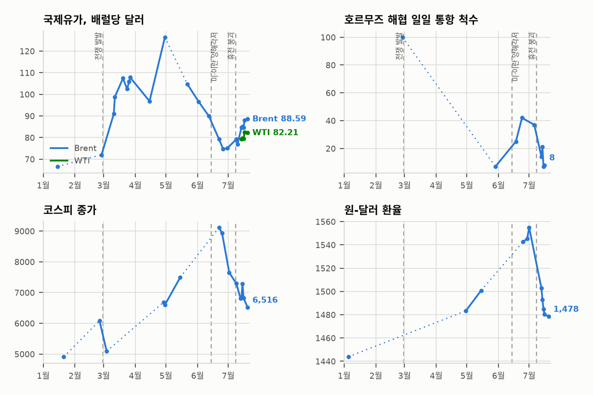

# 중동 일일 브리핑

**2026년 7월 21일**

- **보고 기간:** 약 22시간, 7월 20일 08:00 ~ 7월 21일 06:00 (한국시간)
- **종합 평가:** 개전 열흘째, 전쟁은 세 갈래로 동시에 움직였고 — MOU 파기 이후 처음으로 그중 하나가 아래쪽을 가리켰다. 군사 트랙은 확대됐다. 9번째 연속 공습은 지리적으로 최대 범위였다 — 타브리즈에서 차바하르까지 지휘부, 통신망, 연안 표적을 때렸고 부셰르 시내에서도 폭발이 보고됐다. 국방부는 요르단에서 전사한 두 병사의 신원을 공개했고, 월드컵 결승에서 돌아온 트럼프는 이번 공습을 전사자들에 대한 "예우(in honor)"의 보복이라 불렀다. 이란은 아카바 공항에 이틀 연속 미사일을 쐈고, 바레인은 민간 항공관제 시스템이 드론 공격을 받았다고 밝혔으며, 시리아 내 미군 자산 타격을 주장했고, IRGC는 승인되지 않은 항로로 호르무즈를 빠져나가려던 유조선 2척이 추가로 "폭발했다"고 발표했다 — 여전히 독립적으로 확인된 선박은 단 한 척도 없다. 새 전선은 전쟁의 가장자리에서 열렸다. 후티가 사우디아라비아에 대한 해상 봉쇄를 선언한 것이다. 지난주 사나 공항 공습에 대한 "눈에는 눈" — 한국의 우회 유조선 15척 전부가 선적한 얀부 회랑에 대한 직접 위협이다. 그런데 외교 트랙이 마침내 실체를 냈다. 이란은 미국의 공습 중단과 호르무즈 항로 2개 재개를 맞바꾸는 10일 휴전안을 골자로 한 중재안 수령을 확인했고, 페제시키안은 이란 국민에게 지금은 경제가 주전장인 "전면전"이라고 말했으며, 레바논에서는 시범 구역 철군이 실제로 시작되어 아운 대통령이 워싱턴에 앉아 있는 동안 레바논군이 남부 3개 마을을 인수했다. 서울의 월요일 시험은 지저분하게 끝났다. 코스피 −4.46% 마감으로 탈동조화 지표는 정의대로 반증됐지만, 분해해 보면 — 외국인 순매수, 원-달러 환율 1,478.4원 보합, 브렌트유는 91달러 위에서 중재 헤드라인에 밀려 88.59달러 보합 종가 — 매도는 전쟁이 아니라 반도체에 가격이 매겨진 것이었다.

---

## 1. 무슨 일이 있었나

### 1.1 9번째 공습의 밤, 최대 범위로 확대되고 전사자 3명 확정

미국은 9번째 연속 야간 공습을 완료했다. 미 중부사령부(CENTCOM)는 호르무즈 통항 선박 공격 능력을 계속 저하시키기 위해 "이란군 지휘부, 방공 및 연안 감시 시설, 해상 전력, 미사일·드론 발사 시설, 통신망"을 타격했다고 밝혔고, 폭발은 이번 전역에서 가장 넓은 범위 — 반다르아바스와 케슘, 자스크와 시리크, 반다르 마샤흐르와 반다르 이맘 호메이니, 차바하르와 코나라크, 북서부 도시 타브리즈, 항구도시 부셰르 — 에서 보고됐다 ([Al Jazeera](https://www.aljazeera.com/news/2026/7/20/us-bombs-iran-for-ninth-consecutive-night-as-hormuz-tensions-escalate), [US News](https://www.usnews.com/news/world/articles/2026-07-15/us-military-says-it-completed-latest-strikes-on-iran-targets-included-bandar-abbas), [CBS](https://www.cbsnews.com/live-updates/iran-war-trump-strait-of-hormuz-attacks-persian-gulf/), [Outlook India](https://www.outlookindia.com/international/us-launches-ninth-night-of-strikes-on-iran-as-trump-says-attacks-were-in-honour-of-fallen-troops)). 금요일 이후 미군 전사자는 3명으로 확정됐다. 국방부는 무와파크 살티 전사자를 하와이 에와비치 출신 타일러 제임스 피핸 중위(25)와 텍사스 캐럴턴 출신 이사벨라 곤잘레스 이병(19)으로 공개했고, 토요일 이라크 사망자가 세 번째다. 요르단 기지에서 발견된 유해의 감식은 계속 중이며 1명은 여전히 작전 중 실종(MIA) 상태다 ([NPR](https://www.npr.org/2026/07/20/nx-s1-5900601/us-iran-updates), [Washington Times](https://www.washingtontimes.com/news/2026/jul/20/pentagon-identifies-two-us-soldiers-killed-iranian-attack-jordan-base/), [Military Times](https://www.militarytimes.com/flashpoints/middle-east/2026/07/20/pentagon-identifies-american-soliders-killed-in-iranian-attack-in-jordan/), [CBS](https://www.cbsnews.com/news/iran-strike-jordan-us-troops-killed/)). 월드컵 결승에서 돌아온 트럼프는 "오늘 밤에도 그들을 아주 세게 때렸다"며 공습이 전사자들에 대한 "예우"라고 했고, 이란은 "그 살해의 대가를 몇 배로 치르게 될 것"이라고 경고했다. 민주당 의원들은 종전을 요구했고, Time은 이 전쟁의 미군 누적 전사자를 17명으로 집계했다 ([NPR](https://www.npr.org/2026/07/20/nx-s1-5900601/us-iran-updates), [ABC](https://abcnews.com/International/live-updates/iran-live-updates-kuwait-attacked-bahrain-sounds-sirens/?id=134907987), [Time](https://time.com/article/2026/07/20/iran-war-us-service-members-killed-trump-democrat-lawmakers-response/), [Time 집계](https://time.com/article/2026/07/20/us-service-members-killed-wounded-iran-war-casualties/)). **신뢰도: 높음** — 공습, 표적 유형, 신원 공개(CENTCOM/국방부 발표, 복수 매체); **신뢰도: 중간** — 누적 전사자 수(Time 17명, RFE/RL은 전일 18명 — 집계 기준 상이).

### 1.2 중재국들의 10일 휴전안과 페제시키안의 전면전 선언

이란 외무부 대변인 에스마일 바가이는 월요일 정례 브리핑에서 카타르와 파키스탄 채널을 통해 확전 중단을 겨냥한 중재안을 수령했음을 확인하며 "외교는 국방을 부정하지 않고, 국방은 외교와 양립 불가능하지 않다"고 말했다. Reuters는 제안의 골자가 10일 휴전 — 미국의 공습 중단과 이란의 호르무즈 항로 2개 재개의 맞교환 — 이라고 보도했다. 양측이 전면전 아래 수준에서 역내 경제를 무기한 교란하는 패턴에 정착할 것을 두려워한 중재국들이 띄운 안이다 ([Press TV](https://www.presstv.ir/Detail/2026/07/20/772641/Iran-US-Baghaei-proposals), [Xinhua](https://english.news.cn/20260720/bb23cadfa7e747538ec516606e50fb9e/c.html), [NEWS.am/Reuters](https://news.am/en/news/1050755), [JPost](https://www.jpost.com/middle-east/iran-news/article-903074), [IranWire](https://iranwire.com/en/news/155223-tehran-receives-qatari-pakistani-mediation-offers/), [Bloomberg](https://www.bloomberg.com/news/articles/2026-07-20/us-bombs-iran-for-ninth-day-as-standoff-over-hormuz-deepens)). 미검증 보도들은 고위 협상위원 모하마드 마란디가 "생각도 하지 말라"며 거부했다고 전하고, 보고 기간 마감까지 어느 정부의 수용 발표도 없었다. 같은 날 이란 내무장관은 중재국 파키스탄을 방문했다 ([ZeroHedge](https://www.zerohedge.com/markets/mediators-float-10-day-ceasefire-pezeshkian-tells-citizens-iran-engaged-full-scale-war), [Inquirer/AP](https://www.inquirer.com/news/nation-world/iran-us-war-strikes-kuwait-jordan-bahrain-deaths-ceasefire-strait-hormuz-20260720.html)). 페제시키안 대통령은 사법최고회의 연설에서 "이란 이슬람공화국은 전면전을 치르고 있다"며 적이 군사 공격으로 항복을 강제할 수 없다는 결론에 이르렀고, 이제 경제와 민생이 대결의 주전장이라고 말했다 ([WION](https://www.wionews.com/world/in-a-full-scale-war-with-united-states-says-iran-s-pezeshkian-amid-us-strikes-1784554479717), [Xinhua](https://english.news.cn/20260720/800474844f7a49fe80b70c4e105481db/c.html), [Business Recorder](https://www.brecorder.com/news/40430913/iran-president-says-country-in-full-scale-war-with-us)). **신뢰도: 높음** — 바가이 확인 및 페제시키안 연설(공식 발언, 복수 매체); **신뢰도: 중간** — 10일 휴전안 세부 조건(Reuters 소스, 공식 미공개); **신뢰도: 낮음** — 마란디 거부 발언(애그리게이터·소셜 소스만).

### 1.3 후티, 사우디아라비아 해상 봉쇄 선언

후티 군 대변인 야히야 사리아는 "범죄적 사우디 적성국에 대한 해상 금수 조치를 '눈에는 눈' 등식에 따라 이 성명 발표 즉시 발효"한다고 선언했다. 지난주 사우디 주도 연합군의 사나 국제공항 공습과 후티 항만·공항 봉쇄에 대한 대응으로 홍해와 아덴만 사이의 사우디 선박 통항을 차단하겠다는 것이며, "무모한 사우디 적성국의 어리석은 행동"에는 왕국 본토에 대한 드론·미사일 공격을 포함한 "전면적이고 결정적인 확전"으로 답하겠다고 경고했다 ([Al Jazeera](https://www.aljazeera.com/news/2026/7/20/yemens-houthis-declare-naval-blockade-of-saudi-arabia-what-to-know), [NBC](https://www.nbcnews.com/world/middle-east/yemen-houthis-maritime-embargo-saudi-arabia-oil-rcna588345), [Times of Israel](https://www.timesofisrael.com/yemens-iran-backed-houthis-announce-maritime-blockade-of-saudi-arabia/), [AP/KSAT](https://www.ksat.com/news/world/2026/07/20/yemens-iranian-backed-houthis-say-they-will-block-saudi-shipping-at-red-sea-gateway/), [Middle East Eye](https://www.middleeasteye.net/news/yemens-houthis-declare-blockade-saudi-arabia-rising-red-sea-tensions)). 이 선언은 2022년 휴전 이래 동면 상태였던 사우디–후티 전선을 다시 열었고, 호르무즈가 이란의 통항 체제 아래 있는 동안 두 번째 걸프 산유국의 홍해 수송로를 선언된 차단 대상에 올려놨다. 보고 기간 내 검증된 집행 행위 — 공격, 승선, 나포 — 는 없었다. **신뢰도: 높음** — 봉쇄 선언 자체(사리아 영상 성명, 복수 매체); 집행 능력과 의지는 미검증.

### 1.4 이란의 월요일 공격: 아카바 이틀 연속, 바레인 항공관제, 그리고 유조선 2척 폭발 주장

IRGC는 요르단 아카바 공항의 미군 항공기를 이틀 연속 탄도미사일로 겨냥했고, 쿠웨이트 캠프 우다이리(알아디리)와 알리 알살렘 공군기지의 미군 자산, 시리아 내 미군 자산도 타격했다고 밝혔다. 요르단은 미사일 4발 중 3발을 요격했다고 밝혔고, 미군 방공망도 다수를 요격했으며, 이스라엘 아이언돔은 에일라트 상공에서 요격 잔해에 대응했고 라몬 공항 운영이 한때 차질을 빚었다. 아카바 공항·항만이 "구체적이고 신뢰할 만한 위협"으로 대피했다는 미국 대사관 발표는 요르단 정부 대변인이 "정상 운영 중"이라며 부인했다 ([Just Security](https://www.justsecurity.org/148333/early-edition-july-20-2026/), [Haaretz](https://www.haaretz.com/israel-news/israel-security/2026-07-19/ty-article/u-s-embassy-jordan-evacuates-aqaba-airport-seaport-over-credible-threat/0000019f-79d6-d130-a1ff-f9feb6490000), [Iran International](https://www.iranintl.com/en/202607196476), [Prokerala/IANS](https://www.prokerala.com/news/articles/a1790001.html)). 바레인 외무부는 이란 드론이 자국 항공관제 시스템을 겨냥해 민간 항공을 위험에 빠뜨렸다고 규탄했다 — 이번 라운드에서 민간 항공 기반시설이 명시적 표적이 된 첫 사례다 ([Inquirer/AP](https://www.inquirer.com/news/nation-world/iran-us-war-strikes-kuwait-jordan-bahrain-deaths-ceasefire-strait-hormuz-20260720.html)). 해상에서는 IRGC가 승인되지 않은 항로로 "규정을 위반"한 유조선 2척이 일요일 밤늦게 "폭발해 항행을 중단했다"고 발표했다 — 이틀 새 두 번째 무력 집행 주장이지만, 이번에도 선명, 선적국, 선주 성명, UKMTO 확인은 전무하다 ([Press TV](https://www.presstv.ir/Detail/2026/07/20/772613/IRGC--Two-US-coerced-deviant-tankers-explode-in-unsafe-Strait-of-Hormuz-route), [Maritime Executive](https://maritime-executive.com/article/two-more-tankers-struck-as-irgc-asserts-that-it-controls-hormuz), [Aaj](https://english.aaj.tv/news/330464043/iran-says-irgc-intercepted-four-vessels-in-strait-of-hormuz)). 사우디아라비아는 쿠웨이트·바레인에 대한 반복 공격에 "가장 강력한 규탄"을 표명했다 ([Arab News](https://www.arabnews.com/node/2650065/middle-east)). **신뢰도: 높음** — 아카바 요격, 에일라트 잔해, 바레인 성명(정부 발표, 복수 매체); **신뢰도: 중간** — 시리아 타격 주장(이란 측 발표만); **신뢰도: 낮음~중간** — 유조선 폭발(당사자 단독 주장, 이틀 연속 독립 검증 부재).

### 1.5 레바논 시범 구역 철군 실제 개시, 아운은 워싱턴에

미 국무부는 레바논 남부 이스라엘군 철군을 위한 시범 구역 이행이 프룬, 스리파, 자우타르 알가르비예 3개 마을에서 시작됐고 레바논군이 치안 인수를 개시했다고 밝혔다 — 6월 26일 기본합의의 첫 현장 이행이다 ([The National](https://www.thenationalnews.com/news/mena/2026/07/20/us-says-israeli-withdrawal-from-south-lebanon-pilot-zones-has-begun/), [Arab News](https://www.arabnews.com/node/2651619/middle-east)). 시점은 정치적이다. 조제프 아운 대통령이 17년 만에 백악관을 찾는 첫 레바논 정상으로 워싱턴에 있다. 일요일 루비오 국무장관을 만났고 화요일 트럼프를 만난다. 헤즈볼라 무장해제 계획과, 이스라엘의 기본합의 이행을 워싱턴이 압박해 달라는 요청을 들고 갔다 ([The National](https://www.thenationalnews.com/news/us/2026/07/20/donald-trump-aoun-lebanon-israel/), [Times of Israel](https://www.timesofisrael.com/lebanons-president-departs-for-washington-to-meet-trump/), [Al-Monitor](https://www.al-monitor.com/originals/2026/07/israel-withdraw-lebanons-pilot-zones-ahead-aoun-trump-meeting)). 채점 주의: 앞선 현지 보도는 이스라엘군의 물리적 진지가 3개 마을이 아닌 자우타르 알샤르키예에 있다고 전했으므로, 실제 이스라엘군 철수(무점령지로의 레바논군 전개가 아니라)가 발생했는지는 아직 독립적으로 확인되지 않았다. **신뢰도: 높음** — 국무부 발표와 레바논군 전개; **신뢰도: 중간** — 점령 진지로부터의 검증된 철군 여부.

---

## 2. 심층 분석: 유인과 동기

### 2.1 "예우" 명분의 보복전은 확전 사다리를 어떻게 바꾸나?

보복을 정책 수단에서 추모 의례로 바꾼다 — 그리고 추모 의례는 끝이 열려 있다. 9번째 공습의 표적 목록은 기존 유형(지휘, 방공, 연안, 해상, 발사 시설) 안에 머물며 통신망을 추가했지만 전력망과 지도부는 여전히 아껴뒀다 — IND-20260719-1의 반증 분기(~7월 22일까지 유형 파괴 없음)는 조용한 하룻밤이면 해소된다. 그러나 프레임이 바뀌었다. 이름과 고향과, 공항 활주로에서 그들을 호명하는 대통령을 가진 전사자들을 "예우"하는 공습은 쉽게 멈출 수 없는 공습이다. 멈추는 것이 곧 그들을 욕보이는 것으로 읽히기 때문이다. 이것이 신원 공개가 만든 래칫이고, 군사 논리와 독립적으로 작동한다. 반대 방향의 힘도 이제 가시적이다. 종전을 요구하는 민주당은 이미 상하원을 통과하고 거부권이 행사된 전쟁권한 결의를 갖고 있고, 이름이 하나 늘 때마다 "왜 우리가 거기 있나"라는 질문도 "대가를 치르게 하라"만큼 강해진다. 이 창의 진짜 정보는 두 동학이 동시에 가속했다는 것 — 바로 그 조건에서 중재국들이 움직이기로 했다(2.2).

### 2.2 왜 지금 중재가 떠올랐고, 휴전은 항로와 공습을 맞바꿀 수 있나?

모든 중재자의 악몽은 큰 전쟁이 아니라 영구적인 작은 전쟁이기 때문이다. 중재국들의 두려움에 대한 Reuters의 표현 — 양측이 "전면전 아래 수준에서 역내 경제를 무기한 교란하는 패턴에 정착"하는 것 — 은 이 창에서 분석적으로 가장 중요한 문장이다. 열흘의 공습은 호르무즈를 다시 열지 못했다. 이란의 집행 체제는 매주 굳어지고, 쿠웨이트의 전력·수도는 불타고, 카타르 LNG는 10일째 동결이다. 도하와 이슬라마바드에게 현상 유지는 대기 상태가 아니라 복리로 불어나는 손실이고, 미군 전사자와 다르호빈 타격은 회랑이 더 나빠질 신호였다. 제안의 구조 — 10일, 공습 중단 대 항로 2개 재개 — 는 작아서 영리하다. 각자가 전쟁을 양보하지 않고도 거래할 수 있는 유일한 자산을 화폐화하고(미국: 재개 가능한 전역의 일시정지, 이란: 어차피 통제한다고 주장하는 통항의 허가), MOU의 대타협을 검증 가능한 파일럿으로 전환한다. 장애물은 대칭적이다. 트럼프는 전사자 예우로 프레임된 전역을 멈춰야 하고(2.1), 이란은 유일하게 가치가 오르는 자산 — 통항 거부권 — 을 제재와 공습이 재개 가능한 일시정지와 바꿔야 한다. 페제시키안의 "전면전" 연설은 자세히 읽으면 최대주의가 아니라 바로 이 거래를 위한 기대 관리다. 전쟁의 주전장이 경제라고 말하는 것은 순교가 아니라 (제재) 완화를 위한 논거다. IND-20260721-1이 이번 라운드가 수용된 틀을 낳는지, 통행료 철회처럼 떠돌다 사라진 출구전략의 무덤에 합류하는지를 검증한다.

### 2.3 후티는 왜 지금 사우디 전선을 열었고, 누구의 이익인가?

직접적 논리는 상호주의 — 사나 공항 공습에 "봉쇄에는 봉쇄" — 지만, 구조적 논리는 지렛대 시장이다. 후티의 유일한 수익성 수출품은 초크포인트 리스크이고, 그 가격이 지금보다 높았던 적이 없다. 호르무즈가 이란의 허가제 아래 있는 지금 홍해는 걸프 원유의 유일한 대체 동맥이고, 사우디 선박에 대한 차단 선언의 위협 단가는 2022년 이후 최고다. 이 선언이 아닌 것에 주목하라. 이것은 IND-20260716-2가 추적하는 테헤란 조율의 바브엘만데브 봉쇄가 아니다 — 인용된 방아쇠는 미국이 아니라 사우디이고, 표적 집합은 전체 통항이 아니라 사우디 선박이다. 이 구분은 테헤란에 공짜 옵션을 준다. 자신의 선언된 방아쇠를 소모하지 않고, 부인 가능하게, 자체 명분으로 움직이는 동맹을 통해 리야드의 수출과 우회 회랑(한국의 얀부 선적 포함)을 압박하는 것이다. 리야드의 셈법은 양방향 모두 흉하다 — 예멘 봉쇄를 집행하면 홍해 터미널에 대한 금수 집행을 부르고, 풀면 위협에 보상하는 꼴이다. 미지수는 능력이다. 후티는 2024~25년 선박을 격침했지만, 한 국가의 해상 무역 전체를 지속적으로 차단하는 것은 산발적 공격과는 다른 문제다. IND-20260721-2가 선언 대 집행을 검증한다.

### 2.4 두 번째 유조선 폭발 주장은 체제의 증거인가, 연극의 증거인가?

이틀에 두 건의 주장, 검증된 선박 0척 — 이 패턴은 이제 양쪽으로 벤다. 집행으로 읽으면: IRGC는 7월 19일 허가제 선언에 이빨이 있음을 시장에 알리는 중이고, 반복은 해군이 준수 규범을 세우는 방식이다. 보험사와 선장들은 항로를 바꾸기 전에 UKMTO의 확인을 기다리지 않는다. 연극으로 읽으면: 48시간 안에 실제로 선박 6척을 무력화한 해군이라면 지금쯤 최소한 하나의 선명, 선적국, 조난 신호, 구난 작업, 선주 성명이 나왔어야 한다 — 현대 해운은 유령 피해 6척이 나오기엔 너무 계측되어 있다 — 그리고 두 건의 연속 주장에 걸친 UKMTO·JMIC·Kpler의 침묵 자체가 증거가 되어 가고 있다. 정직한 독해는 주장이 어느 쪽이든 제 몫을 하고 있다는 것이다. 통항이 이미 한 자릿수이고 8척 중 7척이 이란 항로를 쓰는 상황에서, 지어낸 사건의 한계 억지 가치는 실제 사건과 거의 같고 비용은 훨씬 싸다. 이를 판가름할 것 — 선박 식별, 선주 확인, 공식 공지 — 이 정확히 IND-20260720-2가 ~7월 26일까지 요구하는 것이고, 두 번째 주장 사건까지 그것이 부재하다는 사실은 지표를 연극 분기 쪽으로 기울인다. 어느 쪽이든 한국 용선주에게 운영상 결론은 동일하다. 이제 어떤 선장도 비승인 항로를 시험하지 않을 것이므로, 집행이 허구여도 효과에서 허가제는 실재한다.

### 2.5 왜 모든 것이 확전되는 동안 레바논만 긴장 완화되나?

레바논은 네 당사자 전원이 동시에 성공을 필요로 하는 유일한 파일이기 때문이다. 아운은 헤즈볼라 무장해제를 정치적으로 생존 가능하게 만들 미국의 대이스라엘 압박과 주권 성과가 필요하다. 트럼프는 전쟁에 지친 국내 청중에게 내놓을 중동 성과물이 필요하다 — 자국 병사들이 성조기에 덮여 돌아온 이틀 뒤 17년 만에 백악관에 온 레바논 대통령이 정확히 그것이다. 선거전 중의 이스라엘은 방공망이 아카바 접점 쪽 남쪽으로 쏠린 동안 북부 국경의 정적이 필요하다. 그리고 헤즈볼라의 후원자는 제2전선을 지원하기엔 미국과의 전쟁에 너무 소모되어 있다. 아운–트럼프 회담 전날의 시범 구역 개시는 따라서 안무로 읽는 것이 최선이다 — 선물로 시점이 맞춰진 이행. 유보 사항은 원장이 며칠째 담아온 그것이다. 명명된 3개 마을이 이스라엘군이 물리적으로 점유한 적 없는 땅이라면, 이 "철군"은 진공으로의 레바논군 전개다 — 국가 건설로는 실재하나 IND-20260716-3이 요구하는 검증된 이스라엘 철수는 아직 아니다. 판별점은 자우타르 알샤르키예와 ~7월 23일 군사회의다. 이스라엘이 실제 점유한 진지로부터의, 레바논군 주둔으로 검증된 철수는 틀의 견인력을 확인하고, 상징적 마을 셋과 사진 촬영 뒤의 지연은 ~7월 26일 기한에 반증한다.

### 2.6 월요일 시장은 실제로 무엇을, 누구에게 말했나?

시장마다 하나씩 세 개의 답이 있고, 합치면 헤드라인보다 안심되는 그림이다. 코스피의 −4.46% 마감은 IND-20260718-3을 정의대로 반증했다 — 그러나 구성이 독해를 뒤집는다. 외국인이 4,430억 원, 개인이 5,970억 원을 순매수하는 동안 국내 기관이 1조 1,470억 원을 순매도했다. 이 지표가 탐지하도록 설계된 자본 도피 시그니처의 정확히 반대다. 전쟁 리프라이싱이라면 외국인이 한국을 판다. 월요일은 호르무즈가 아니라 필라델피아에서 시작된 반도체 급락의 저점을 외국인이 사는 모습을 보여줬다. 원-달러 환율은 같은 이야기를 더 깨끗하게 했다. 1,478.4원, 0.1원 움직임, 개입 없음 — 첫 미군 전사자와 원전 부지 타격의 주말을 지나고도 위기 채널은 닫혀 있었다. 한국은행 앵커에 기반한 탈동조화 명제에 지금까지 나온 가장 강한 단일 데이터 포인트다(IND-20260715-4의 금요일 종가 시험은 이제 반증 쪽으로 기울어 보인다). 그리고 브렌트유의 왕복 — 주말의 누적 확전에 91달러 위로, 바가이의 중재 확인에 88.59달러(+0.5%) 종가로 — 은 IND-20260719-2를 두 임계값 사이에서 해소했다. 시장은 걸프 기반시설 전쟁의 가격 반영도, 주말 프리미엄의 소거도 거부하고, 대신 출구전략 확률을 실시간으로 가격에 반영하는 쪽을 택했다. 종합: 금융 한국은 현재 전쟁을 정확히 하나의 변수 — 유가 — 로 전달받고 있고, 그 유가는 현재 외교 헤드라인을 거래하고 있다. 7월 13일 서킷브레이커 주간이 시사한 것보다 훨씬 좁은 전달 경로이고, 검증 가능하다(IND-20260721-3).

---

## 3. 한국에 대한 정책적 함의

한국의 구조적 익스포저 기준선은 `instructions/korea-exposure.md` 참조(원유 약 70%, LNG 약 36%가 호르무즈 경유; 비호르무즈 원유 약 2억 7,300만 배럴 확보; 비축유 약 26일분 추정; 9월 조달 76% 확보; 홍해 우회 유조선 15척; 외교부 출국 권고 발효 중). 이번 창에서 상수 변경은 없지만, 후티 선언(1.3)은 홍해 우회 항목의 기존 주석을 직접 압박한다. 우회 루트는 사우디 홍해 터미널인 얀부에서 선적해 바브엘만데브 해협을 통과하는데, 이 루트의 양끝이 이제 사우디 선박에 대한 선언된 금수 범위 안에 있다. **신뢰도: 높음** — 기준선.

**사안별 함의:**

1. **9번째 공습과 호명된 전사자들 (1.1):** 추모 프레임(2.1)은 전력망 방아쇠를 당기지 않은 채 기대 전쟁 지속 기간을 늘린다 — 한국 수급 계획자들이 기본 시나리오로 삼아야 할 배열이다. 바브엘만데브 방아쇠를 끝내 당기지 않되 끝나지도 않는 긴 전역. 이제 하반기 조달과 운임 예산의 지배 변수는 충격 리스크가 아니라 지속 기간 리스크다.
2. **10일 휴전안 (1.2):** 한국에는 이번 창에서 기대값이 가장 큰 사안이다. 휴전 하의 호르무즈 항로 2개 재개는 원유 수입 약 70%의 물리적 흐름을 재가동하고, 실패한 라운드조차 중재가 계속되는 한 유가 리스크 프리미엄을 누른다(월요일의 반락이 보여줬듯). 다만 계획이 앞서가서는 안 된다 — 이란의 거부 기류와 추모 래칫은 1라운드 실패를 시사한다 — 석유공사와 정유사들은 항로 재개를 정상화가 아니라 선적 가속의 창으로 취급해야 한다.
3. **후티의 사우디 봉쇄 (1.3):** 이번 주 가장 날카로운 한국 특정 리스크다. 우회 유조선 15척 전부가 사우디 용선 계약으로 얀부에서 선적했다. 사우디 선박에 대한 금수 선언은 향후 모든 선적을 위협 범위에 넣고, 사우디 홍해 터미널의 전쟁위험 보험료는 실제 공격 전에 먼저 오른다. 즉시 조치: 얀부 선적분 용선계약·보험 재검토, 비사우디 홍해 대안 식별(이집트·수단 항만은 비현실적, SUMED 파이프라인 용량은 현실적), 예정된 선적의 가속 — 회랑은 금수의 첫 집행 시험(IND-20260721-2) 전에 가장 쓸 만하다.
4. **유조선 폭발 주장과 바레인 항공관제 타격 (1.4):** 허가제는 검증과 무관하게 효과에서 실재한다(2.4) — 한국 선사들은 이란 측 조율 없는 걸프 출항은 없다고 가정하고 가격을 매겨야 한다. 민간 항공 기반시설이 표적 집합에 들어온 것은 전력·수도 전쟁의 템플릿을 새 자산군으로 확장한다. 한국 항공사의 걸프 노선과 걸프 허브 공항 경유 한국인 직원 로테이션의 재검토가 필요하다.
5. **레바논 시범 구역과 서울의 월요일 (1.5, 2.6):** 레바논은 단계적·검증된 긴장 완화 틀이 확전 한가운데서도 움직일 수 있다는 이 전쟁의 개념 증명이다 — 호르무즈 휴전이 필요로 할 바로 그 템플릿. 월요일 시장 분해(외국인 매수, 환율 보합)는 한국의 금융 채널이 헤드라인보다 건강하다는 뜻이다. 실행 가능한 결론: 정책 여력(한국은행 금리 여지, 외환보유고, 시장안정 기금)은 반도체 사이클 방어에 소모되지 않고, 진짜 충격 시나리오를 위해 미사용 상태로 남아 있다.

**검증 가능한 지표:**

1. **IND-20260721-1: 10일 휴전 라운드는 수용된 틀을 낳거나 무덤에 합류한다.** 확인 조건: ~7월 27일까지 어느 한 정부의 휴전/일시정지 틀 공개 수용, 또는 중재 발표와 겹치는 48시간 이상의 사실상 공습 중단 — 출구전략은 실재한다. 통항 회복, 브렌트유 85달러 하회, 코스피 안도 랠리 쪽으로 재조정. 반증 조건: 7월 27일까지 야간 공습이 계속되고 이란의 거부가 유지되며 수용 발표가 없음 — 중재는 다시 내러티브 관리이고, 전면전 아래의 소모전이 상시 체제이며 지속 기간 리스크가 지배한다.
2. **IND-20260721-2: 후티의 사우디 선박 금수는 집행되거나 선언에 그친다.** 확인 조건: ~7월 27일까지 홍해·아덴만에서 사우디 연계 또는 사우디 기항 상선에 대한 UKMTO/JMIC 검증 공격·승선·나포, 또는 얀부/제다 선적 중단 — 금수는 작동 중이다. 한국의 우회 회랑은 범주적으로 리프라이싱되고 16번째 유조선이 시험 사례가 된다. 반증 조건: 7월 27일까지 사우디 연계 선박에 대한 검증된 집행 없음 — 2022년 휴전 가장자리의 억지 연극이며, 회랑 리스크는 여전히 당겨지지 않은 테헤란 방아쇠(IND-20260716-2)에 조건부다.
3. **IND-20260721-3: 서울의 전달 경로는 변수 하나인가 셋인가.** 지표: 7월 21~23일 장. 좁은 경로 독해의 확인 조건: 코스피 외국인 누적 순매수 유지, 원-달러 환율 매 장 1,490원 이하 무개입 마감, 코스피가 걸프 헤드라인이 아닌 반도체/AI 뉴스를 추종(7월 23일 종가 기준 약 6,300선 위 안정). 반증 조건: 외국인 누적 순매도 전환과 1,490원 상향 돌파, 또는 걸프 헤드라인의 날에 코스피가 SOX보다 크게 움직임 — 전쟁 채널이 유가 너머로 재개방됐다. 금융 전달 명제와 IND-20260715-4의 주간 시험을 재조정하라.

오늘 발표하는 해소: **IND-20260718-3 반증** — 코스피 −4.46% 마감이 −4% 선을 뚫어, 월요일은 지표의 정의된 범위 안에서 3중 충격 갭을 흡수하지 못했다(환율 레그는 지켜졌다: 1,478.4원, 무개입). 반증은 정직하게 기록하되 2.6의 구성 유보를 함께 남긴다. 돌파는 외국인 순매수 속의 반도체 주도였으므로, 기저의 탈동조화 명제는 IND-20260721-3과 IND-20260715-4로 재검증된다. **IND-20260719-2 기한 만료** — 브렌트유 88.59달러 종가는 반증선 88.10달러와 확인선 92.50달러 사이에 착지했다. 시장은 걸프 기반시설 전쟁을 가격에 반영하지도, 주말 프리미엄을 소거하지도 않고 중재 헤드라인을 장중 거래했다(바가이 브리핑 전 91달러 위, 후 보합). 방향상 프리미엄 안정화로 반증 분기에 가깝지만, 기한까지 어느 임계값도 발동하지 않았다.

원장의 미해결 지표 현황: IND-20260714-4(주간 선적 수치 없음, 동결 10일째 — 미해결), IND-20260715-1(회복 분기는 ~7월 21일 기한에 공식 소멸, 7월 16일의 8척 이후 한 자릿수 넘는 집계 없음; 체제 시험은 ~7월 28일까지 — 미해결), IND-20260715-2(명명된 걸프 패키지 없음 — 미해결), IND-20260715-3(신규 UAE 교차 확인 없음 — 미해결), IND-20260715-4(월요일 1,478.4원 마감으로 반증 트랙 강화, 주간 시험은 금요일 7월 24일 — 미해결), IND-20260716-2(검증된 바브엘만데브 사건 없음; 후티 선언은 사우디 방아쇠·사우디 선박 대상으로 본 지표의 테헤란 조율 조건 밖 — 미해결), IND-20260716-3(3개 마을에서 시범 구역 이행 개시·레바논군 전개; 점유 진지로부터의 검증된 철수는 미확립 — 미해결, 확인 쪽 추세, 기한 ~7월 26일), IND-20260717-1(발표된 회담 없음; 중재 급증은 실질적 대체물이나 발표된 회담 분기는 미충족 — 미해결, ~7월 23일 반증 거의 확실), IND-20260717-2(적재 출항 없음, 동결 10일째 — 미해결, ~7월 24일 반증 추세), IND-20260717-3(8월 금통위 — 미해결), IND-20260718-1(9번째 공습도 발전·전력망 회피, ~7월 24일까지 반증 분기 강화 — 미해결), IND-20260719-1(9번째 공습은 기존 유형 안 + 통신망, 전력망·지도부 없음 — 미해결, ~7월 22일 해소), IND-20260720-1(부셰르 시내 폭발 보고되나 원전 타격 주장·증거 없음, 신규 핵시설 타격 없음 — 미해결), IND-20260720-2(두 번째 무력 주장, 두 사건 모두 독립 확인 전무 — 미해결, 연극 분기 쪽 기움), IND-20260720-3(아카바 이틀째 요격, 에일라트에는 요격 잔해만, 이스라엘 영토 착탄 없음, 이스라엘 공습 없음, 홍해 공격 없음 — 미해결).

---

## 4. 관찰 목록

- **10번째 공습의 밤과 IND-20260719-1의 기한.** 10번째 공습은 이 창의 가장자리 이후에 떨어진다. 다시 전력망과 지도부를 아낀다면 유형 파괴 지표는 ~7월 22일 반증된다 — "미사일 1,000발" 위협이 캘리브레이션된 전역으로 완전히 해소되는 것이다. **신뢰도: 높음** — 공습 지속.
- **화요일 아운–트럼프 회담.** 기본합의 시간표에 대한 백악관 성명과 미국의 보증 언어를 주시하라. 트럼프의 공개 약속은 ~7월 23일 군사회의 전에 IND-20260716-3의 확인 확률을 크게 높인다. **신뢰도: 높음** — 회담 개최.
- **중재 라운드의 첫 48시간.** 공습 일시정지, 제안에 대한 미국의 공식 반응, 이란의 공식 거부 중 무엇이든 IND-20260721-1의 방향을 조기에 결정한다. Truth Social이 아니라 카타르·파키스탄 외무부 채널을 주시하라. **신뢰도: 중간** — 금주 내 가시적 움직임.
- **바브엘만데브에서 금수의 첫 시험.** 다음 사우디 연계 통항 — 그리고 예정되어 있다면 한국의 16번째 우회 유조선 — 이 IND-20260721-2의 시험 사례다. UKMTO 공지가 인계철선이다. **신뢰도: 높음** — 수일 내 질문이 강제됨.
- **무와파크 살티의 유해.** 신원 확인은 MIA 사건을 종결하고 억류 시나리오를 제거한다. 침묵이 계속되면 인질 동학은 잠재 상태로 유지된다. **신뢰도: 높음** — 감식 계속.
- **카타르 LNG 동결 10일째.** IND-20260717-2는 ~7월 24일 해소된다. 7월 11일 이후 적재 출항 전무, IRGC의 집행 주장으로 승인된 출항 가능성은 더 줄었다. 한국의 4분기 조달 갭 질문은 매일 굳어진다. **신뢰도: 높음** — 휴전 없는 한 동결 지속.
- **부셰르의 모호성.** 다르호빈을 건드린 전역에서 부셰르 시내의 폭발은 하루 더 정밀 주시할 가치가 있다. AEOI나 IAEA가 원전을 명명하는 성명은 방사능 리스크와 함께 IND-20260720-1을 확인한다. **신뢰도: 중간** — 이란 국영매체의 시내 폭발 보도, 양측 모두 시설 주장 없음.
- **가자 소모전.** 팔레스타인 매체발로 가자지구 남부 차량 공습으로 3명 사망 — 휴전 후 누적 사망자는 1,123명 이상으로 거의 매일 증가 중이다 ([Haaretz](https://www.haaretz.com/israel-news/israel-security/2026-07-20/ty-article-live/rubio-and-lebanese-president-meet-in-washington-discuss-deal-with-israel/0000019f-7c5d-d316-a9df-7e5f088f0006)). **신뢰도: 중간.**

---

## 5. 출처 신뢰도 요약

| 주장 | 출처 | 신뢰도 |
|---|---|---|
| 9번째 연속 공습; 지휘부, 방공, 연안 감시, 해상, 발사 시설, 통신망 | CENTCOM 성명; Al Jazeera, US News, CBS, Outlook India | 높음 |
| 반다르아바스, 케슘, 자스크, 시리크, 반다르 마샤흐르, 반다르 이맘 호메이니, 차바하르, 코나라크, 타브리즈, 부셰르 폭발 | IRGC/이란 국영매체 경유 Al Jazeera, CBS | 중간~높음 |
| 요르단 전사자 신원: 피핸 중위, 곤잘레스 이병; 금요일 이후 3명; 1명 실종 지속 | 국방부 발표; NPR, Washington Times, Military Times, CBS | 높음 |
| 트럼프: "오늘 밤에도 아주 세게 때렸다"; "예우" 공습; "몇 배로 대가" | 공식 발언; NPR, ABC, Fox | 높음 |
| 미군 누적 전사자 17명 | Time 집계; RFE/RL은 7월 19일 18명 | 중간 |
| 바가이: 카타르·파키스탄 경유 중재안 수령; "외교는 국방을 부정하지 않는다" | 공식 브리핑; Press TV, Xinhua, IranWire, Armenpress | 높음 |
| 10일 휴전안: 공습 중단 대 호르무즈 항로 2개 재개 | Reuters 경유 NEWS.am; JPost; Bloomberg 프레임 | 중간 |
| 마란디 거부: "생각도 하지 말라" | ZeroHedge, 소셜미디어 애그리게이션만 | 낮음 |
| 페제시키안: "전면전"; 경제가 주전장 | ISNA; WION, Xinhua, Tribune, Business Recorder | 높음 |
| 후티의 대사우디 해상 금수 즉시 발효; 사리아 성명; 사나 공항 방아쇠 | 사리아 영상 성명; Al Jazeera, NBC, ToI, AP, MEE, JNS | 높음 |
| IRGC: 비승인 항로 유조선 2척 "폭발" | IRGC 성명만; Press TV, Maritime Executive, Aaj; UKMTO/Kpler 확인 없음 | 낮음~중간 |
| 아카바 이틀째 표적; 요르단 4발 중 3발 요격; 에일라트 상공 잔해 대응; 라몬 공항 차질 | IDF, 요르단군; Haaretz, Iran International, Just Security | 높음 |
| 미 대사관의 아카바 대피 주장 대 요르단의 부인 | 미 대사관 성명; 요르단 대변인 알모마니(AFP) | 중간 (상충) |
| 바레인: 이란 드론이 항공관제 시스템 표적 | 바레인 외무부 성명; AP 경유 Inquirer | 높음 |
| IRGC의 시리아·캠프 우다이리·알리 알살렘 타격 주장 | 이란 측 발표; Just Security, AP | 중간 |
| 레바논 시범 구역 프룬·스리파·자우타르 알가르비예 개시; 레바논군 치안 인수 | 미 국무부; The National, Arab News | 높음 |
| 이스라엘군이 실점유 진지에서 철수했는지 여부 | 현지 보도는 IDF 진지를 자우타르 알샤르키예에 위치시킴 | 중간 |
| 아운 워싱턴 방문; 일요일 루비오, 화요일 트럼프 | The National, Times of Israel, Al-Monitor | 높음 |
| 코스피 6,516.27 마감(−4.46%); 외국인 +4,430억, 개인 +5,970억, 기관 −1조 1,470억 | KRX 데이터 경유 Newspim, FNnews | 높음 |
| 원-달러 환율 1,478.4원 마감(−0.1원), 무개입 | Newspim, Businesskorea | 높음 |
| 브렌트유 종가 88.59달러(+0.5%), 장중 91달러 상회; WTI 82.21달러(−0.3%) | Forbes Advisor 집계; Yahoo Finance, Trading Economics | 중간~높음 |
| 가자: 남부 차량 공습으로 3명 사망 | 팔레스타인 매체 경유 Haaretz | 중간 |

_2026년 7월 21일(한국시간), 미국·카타르·이스라엘·이란 국영·UAE·사우디·파키스탄·중국 국영·한국·유럽·해운/에너지 전문지 등 30여 개 매체 웹 리서치 기반 작성._
