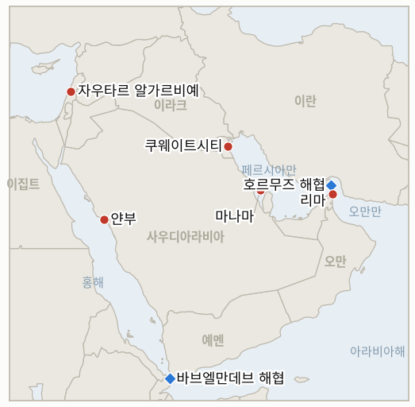

# 중동 일일 브리핑

**2026년 7월 22일**

- **보고 기간:** 약 24시간, 7월 21일 06:00 ~ 7월 22일 06:00 (한국시간)
- **종합 평가:** 개전 11일째는 전쟁의 '주장'들이 양방향으로 '검증된 사실'로 바뀌기 시작한 날이었다. 바다에서는 통항 허가제가 실체가 됐다. 쿠웨이트 국적 석유제품 유조선 카이판호가 호르무즈 해협 인근에서 피격됐고 — 영국 해사무역기구(UKMTO)가 확인했으며, 승조원 2명이 다치고 선원들이 퇴선했다 — 이는 이란의 검증되지 않은 주장 6건 이후 처음으로 독립적으로 확인된 선박 피해다. 쿠웨이트는 이란 대사를 초치해 항의했는데, 이번 국면에서 걸프 국가가 유조선 공격의 책임을 테헤란에 공식적으로 돌린 첫 사례다. 사우디 해운에 대한 후티의 해상 금수 조치는 한 발도 쏘지 않고 첫 가시적 효과를 냈다. 사우디 원유를 싣고 아시아로 향하던 유조선 2척 — 그중 초대형 유조선(VLCC) 1척은 한국의 우회 수송 15척 전부가 선적한 항구 얀부에서 200만 배럴을 실었다 — 이 회항했고, 유가는 약 2% 올라 5주 최고치로 마감했다(브렌트유 약 91달러). 공중에서는 10번째 연속 미군 공습이 기존 표적 유형 안에 머물러 표적 등급 파괴 지표가 공식 반증됐다. 전사자 3명으로도 전력망과 지도부 표적은 등장하지 않았다. 이란의 응수 — 쿠웨이트 전력·담수 시설 4일 연속 타격, 아마존 바레인 데이터 허브 파괴 주장 — 도 똑같이 절제됐지만 한 가지 선례를 남겼다. 국가 행위자가 하이퍼스케일러 클라우드 인프라에 대한 타격을 주장한 첫 사례다. 외교 트랙에서는 10일 휴전안이 카타르·이집트·파키스탄·오만의 실질 제안으로 굳어졌다 — 7월 9일 이전 위치로의 복귀, 호르무즈 양대 항로 재개 — 트럼프 행정부는 이를 검토하면서 동시에 확전 분기를 위한 전투기 편대를 증파하고 있고, 트럼프는 이란이 대화에 "필사적"이라고 조롱하면서 픽액스 마운틴 핵 시설을 "곧" 폭격하겠다고 위협했다. 그리고 레바논에서는 프레임워크가 첫 검증된 이스라엘 철군을 만들어냈다. 이스라엘군이 빠져나간 자우타르 알가르비예에 레바논군이 진입했고 — 시범 구역 지표가 마감 닷새 전에 확증됐다 — 몇 시간 뒤 아운은 백악관에서 트럼프에게 레바논이 이스라엘과의 적대를 "영원히" 끝내겠다고 말했다. 한편 서울은 전쟁 이후 가장 선명한 탈동조화의 하루를 보여줬다. 걸프 리스크가 상향 재평가되는 동안 코스피는 외국인 순매수 속에 3.56% 반등했다 — 좁은 전달 경로 명제가 첫 시험을 만점으로 통과했다.

---

## 1. 무슨 일이 있었나

<figure style="float:right; width:46%; margin:2pt 0 8pt 14pt;">

<figcaption style="font-size:8pt; color:#666; text-align:center; margin-top:3pt; font-style:italic;">오늘 사안의 주요 지점</figcaption>
</figure>

### 1.1 전쟁 최초의 검증된 유조선 피해, 쿠웨이트는 테헤란에 공식 항의

쿠웨이트 국영 쿠웨이트유조선회사(KOTC) 소속 쿠웨이트 국적 석유제품 유조선 카이판호가 월요일 밤 호르무즈 해협 남부, 오만 리마 북동쪽 약 8해리 지점에서 발사체에 피격됐다. UKMTO는 복수의 보고를 받고 공격을 확인했으며, 선박 간 무선 교신 녹음에는 연료 탱크 화재와 주기관 정지가 기록됐고, 승조원 2명이 경상을 입었으며 선원들은 구명정으로 퇴선했다 ([Xinhua](https://english.news.cn/europe/20260721/a93561653f6940b6a453da2bc564afb4/c.html), [Ship & Bunker](https://shipandbunker.com/news/world/714603-ukmto-reports-new-ship-attack-in-strait-of-hormuz), [Maritime Executive](https://maritime-executive.com/article/report-kuwaiti-owned-tanker-hit-in-the-strait-of-hormuz), [Bloomberg](https://www.bloomberg.com/news/articles/2026-07-21/another-tanker-hit-in-hormuz-as-houthis-add-to-regional-risks)). 이란이 통항 허가제를 선언한 이후 — 검증 없는 이란 혁명수비대(IRGC)의 차단 주장 6건을 거쳐 — 처음으로 독립적으로 검증된 선박 피격이며, 피격 지점은 테헤란이 "안전하지 않다"며 무단 항로로 규정해 온 남쪽 오만 측 항로다. 쿠웨이트는 이란 대사 모하마드 토톤치를 초치해 주권 침해이자 국제 항행의 자유에 대한 위협이라고 규탄하는 공식 항의 각서를 전달했다 — 이번 국면에서 걸프 국가가 유조선 공격을 이란에 공식 귀속시킨 첫 사례다 ([Maritime Executive](https://maritime-executive.com/article/report-kuwaiti-owned-tanker-hit-in-the-strait-of-hormuz), [Gulf News](https://gulfnews.com/world/mena/us-launches-10th-night-of-iran-strikes-as-irgc-claims-attacks-on-bahrain-kuwait-1.500614721)). **신뢰도: 높음** — 피격, 피해, 퇴선(UKMTO 공지, 복수 매체, 무선 녹음); **신뢰도: 중상** — 이란 귀속(쿠웨이트 정부 항의와 해당 항로에 대한 혁명수비대의 기존 주장, 다만 카이판호를 지명한 혁명수비대 성명은 보고 기간 내 미확인).

### 1.2 후티 금수 조치, 한 발도 쏘지 않고 사우디 원유 유조선들을 돌려세우다

사우디 원유를 싣고 아시아로 향하던 유조선 2척이 화요일 후티의 위협에 홍해에서 회항했다 — 월요일 선언된 해상 금수 조치 아래 공개 확인된 첫 항로 변경이다. 전날 얀부에서 200만 배럴을 선적하고 중국으로 향하던 초대형 유조선(VLCC) 신룽양호와 역시 얀부에서 출항한 아프라막스급 1척이 바브엘만데브 해협 방향 남하를 포기하고 수에즈 운하 쪽으로 뱃머리를 돌렸다. 항해 기간이 수 주 늘어날 수 있는 우회다. 소식통들은 얀부항 자체는 정상 운영 중이라고 전했다 ([Reuters via Cyprus Mail](https://cyprus-mail.com/2026/07/21/saudi-crude-tankers-turn-back-as-houthis-open-new-front-in-us-iran-war), [Al-Monitor](https://www.al-monitor.com/originals/2026/07/tankers-saudi-crude-turn-back-houthis-open-new-front-us-iran-war), [Bloomberg](https://www.bloomberg.com/news/articles/2026-07-21/chinese-oil-tanker-u-turns-in-red-sea-after-houthi-attack-threat), [Splash247](https://splash247.com/tankers-turn-back-after-houthi-threat-to-saudi-shipping/), [Maritime Executive](https://maritime-executive.com/article/houthi-blockade-of-saudi-shipping-begins-to-bite)). 공격, 승선, 나포는 확인되지 않았다 — 금수 조치는 억지력만으로 효과를 내고 있다. 석유 시장은 두 초크포인트를 동시에 가격에 반영했다. 브렌트유는 약 2% 올라 5주 최고치를 기록하며 장 막판 91.05달러(+2.1%)에 거래됐고 WTI는 85.15달러(+2.3%)였다 ([Reuters via BNN Bloomberg](https://www.bnnbloomberg.ca/markets/oil/2026/07/21/oil-prices-rise-nearly-2-on-fresh-attacks-by-us-and-iran/), [CNBC](https://www.cnbc.com/2026/07/21/oil-prices-dip-as-mediation-efforts-offset-us-iran-strikes.html)). **신뢰도: 높음** — 회항과 가격 변동(Reuters/Bloomberg 선박 추적 데이터, 복수 매체); 금수 조치의 실제 집행 능력은 여전히 미검증(IND-20260721-2).

### 1.3 10번째 공습의 밤도 절제 유지, 이란은 아마존 바레인 데이터 허브 파괴 주장

미국은 10번째 연속 야간 공습을 완료했다. 미 중부사령부(CENTCOM)는 다시 "이란군 지휘부, 해상 전력, 미사일·드론 발사 시설, 방공 체계"를 지목했고, 이란 매체들은 시리크, 반다르아바스, 케슘섬, 시라즈, 이스파한에서 폭발을 보도했다 — 전력 생산, 전력망, 지도부 표적은 이번에도 제외된, 기존 표적 유형 내부의 공습이다 ([Al Jazeera](https://www.aljazeera.com/news/2026/7/21/us-launches-tenth-consecutive-night-of-attacks-on-iran), [Just Security](https://www.justsecurity.org/148592/early-edition-july-21-2026/), [Democracy Now](https://www.democracynow.org/2026/7/21/headlines/us_bombs_iran_for_10th_consecutive_night)). 이란의 응수 — 나스르 작전 24번째 파상 공격으로 명명 — 는 쿠웨이트, 바레인, 요르단의 미군 진지를 겨냥했다. 쿠웨이트는 전력·해수담수화 플랜트가 4일 연속 이란의 공격을 받았다고 발표했고(화재 진압, 일부 발전 설비 예방적 가동 중단), 혁명수비대는 바레인 무하라크·리파의 미군 방공·레이더 타격, 요르단에서의 F-15 파괴(미확인), 그리고 — 처음으로 — 다르호빈에 대한 보복이라며 순항미사일로 아마존의 바레인 중앙 데이터 인프라(AWS ME-South-1 리전)를 "파괴"했다고 주장했다. 바레인, 미국, 아마존 측은 응답하지 않았고 독립적 확인은 없다 ([IranWire](https://iranwire.com/en/news/155256-irgc-attacks-us-bases-in-bahrain-kuwait-and-jordan/), [anews](https://www.anews.com.tr/world/2026/07/21/kuwait-reports-iranian-strikes-on-power-water-desalination-plants-for-4th-consecutive-day), [Gulf News](https://gulfnews.com/world/gulf/kuwait/kuwait-says-iran-strikes-damaged-power-and-water-desalination-plant-1.500611118), [Euronews](https://www.euronews.com/2026/07/21/irans-irgc-claims-attack-on-amazons-main-data-hub-in-bahrain), [DCD](https://www.datacenterdynamics.com/en/news/irans-islamic-revolutionary-guard-corps-claims-fresh-hit-on-aws-data-center-in-bahrain/), [Tom's Hardware](https://www.tomshardware.com/tech-industry/data-centers/amazon-data-center-in-bahrain-struck-and-destroyed-by-iranian-cruise-missiles-state-media-claims-attacks-launched-against-aws-site-in-response-to-alleged-us-strikes-on-an-under-construction-nuclear-plant)). **신뢰도: 높음** — 10번째 공습과 쿠웨이트의 4일 연속 기반시설 피해(CENTCOM·쿠웨이트 정부 발표, 복수 매체); **신뢰도: 낮음** — 아마존·F-15 주장(단일 당사자 주장, 독립 확인 없음, 같은 AWS 시설에 대한 3월 이후 최소 세 번째 타격 주장).

### 1.4 중재국들 10일 휴전안 압박, 트럼프는 검토하며 전투기 증파

중재 라운드는 구체적 제안으로 다듬어졌다. 카타르, 이집트, 파키스탄, 오만은 워싱턴과 테헤란에 첫 단계로 7월 9일 이전 위치로의 복귀를 촉구하고 있다 — 10일간의 휴전 동안 미국의 공습이 멈추고, 호르무즈 양대 항로(이란의 공격이 없는 남쪽 오만 항로, 미국의 봉쇄가 없는 북쪽 이란 항로)가 모두 재개되며, 양측이 붕괴된 MOU를 되살릴 장기 통항 체제를 협상한다는 내용이다 ([The New Arab](https://www.newarab.com/news/qatar-and-pakistan-propose-10-day-iran-us-ceasefire), [Axios](https://www.axios.com/2026/07/21/iran-war-ceasefire-proposal-trump-troops), [Middle East Monitor](https://www.middleeastmonitor.com/20260721-iranian-official-says-mediators-proposed-10-day-ceasefire-to-revive-us-agreement/)). 트럼프 행정부는 제안을 검토하면서 이스라엘에는 외교의 창을 닫을 수 있는 조치를 피하라고 요청했다 — 동시에 슈팡달렘의 F-16, 레이큰히스의 F-35를 포함한 전투기 수십 대와 공중급유기를 역내로 이동시키며 협상 결렬 시의 대규모 확전에 필요한 전력 패키지를 조립하고 있다 ([Axios](https://www.axios.com/2026/07/21/iran-war-ceasefire-proposal-trump-troops), [Aero News Journal](https://www.aeronewsjournal.com/2026/07/us-deploys-f-35-and-f-16-fighters-to.html), [Ynet](https://www.ynetnews.com/article/s1cf00z5nfl)). 트럼프는 이란이 만나서 대화하는 데 "필사적(desperate)"이라며, 나탄즈 인근 깊은 지하의 핵 연계 시설 픽액스 마운틴을 "아주 세게", "곧" 공격하겠다고, 이란이 "할 수 있는 일은 아무것도 없다"고 위협했다 ([Al Jazeera 라이브블로그](https://www.aljazeera.com/news/liveblog/2026/7/21/iran-war-live-us-launches-10th-night-of-strikes-tehran-attacks-kuwait), [Forbes](https://www.forbes.com/sites/saradorn/2026/07/21/what-is-irans-pickaxe-mountain-trump-threatens-bombing-there-pretty-soon/), [The Hill](https://thehill.com/policy/defense/5966603-trump-threatens-pickaxe-mountain-iran/)). Jerusalem Post는 소식통을 인용해 이 제안이 폭격을 받는 와중의 테헤란 자신이 조용히 제출한 것이라고 보도했다 ([JPost](https://www.jpost.com/middle-east/iran-news/article-903154)). **신뢰도: 높음** — 제안 조건과 중재국 구성(복수 매체, 이란의 수령 확인); **신뢰도: 중간** — 미국의 "검토하며 준비" 태세(관측된 전개와 부합하는 Axios 취재); **신뢰도: 중하** — 이란의 제안 작성설(단일 매체 단독 보도).

### 1.5 이스라엘, 첫 시범 구역 인계, 아운은 트럼프와 회담

레바논군은 화요일 이스라엘군이 철수한 자우타르 알가르비예에 진입했다 — 시범 구역 체제 아래 이스라엘군에서 레바논군으로 통제가 이양된 첫 마을이자, 프레임워크의 첫 검증된 이스라엘 철군이다. 지뢰 제거팀이 주민 복귀에 앞서 도로와 건물 조사를 시작했다 ([Reuters via US News](https://www.usnews.com/news/world/articles/2026-07-21/lebanese-army-deploys-in-southern-town-after-israeli-withdrawal-official-says), [Times of Israel](https://www.timesofisrael.com/in-first-lebanese-army-deploys-in-southern-pilot-zone-after-israeli-withdrawal/), [The National](https://www.thenationalnews.com/news/mena/2026/07/21/lebanese-army-enters-zawtar-al-gharbieh-after-israeli-withdrawal-under-pilot-scheme/)). 인계가 매끄럽기만 한 것은 아니었다. 레바논군 병력이 공병 차량과 함께 인접한 자우타르 알샤르키예 부근, 이스라엘이 안보 구역이라 부르는 지대 안쪽으로 약 150m 진입하자 이스라엘군이 경고 사격을 했다 ([Times of Israel](https://www.timesofisrael.com/in-first-lebanese-army-deploys-in-southern-pilot-zone-after-israeli-withdrawal/)). 몇 시간 뒤 아운은 백악관에서 트럼프를 만났다 — 약 20년 만의 레바논 국가원수 백악관 방문이다. 아운은 헤즈볼라 무장해제 계획을 제시하고, 레바논이 이스라엘과의 적대 행위를 "영원히" 끝내겠다고 선언했으며, 철군 일정 준수를 위한 미국의 대이스라엘 압박을 요청했다. 트럼프는 레바논을 "많이" 돕겠다고 약속했고 베이루트가 요청하면 헤즈볼라와 직접 대화할 용의도 있다고 말했다 ([Washington Post](https://www.washingtonpost.com/world/2026/07/21/lebanon-president-hezbollah-trump-aoun-israel/945ae628-84c1-11f1-9cec-0fb26676f07e_story.html), [Times of Israel](https://www.timesofisrael.com/meeting-trump-in-dc-aoun-says-lebanon-will-end-hostility-with-israel-forever/), [JPost](https://www.jpost.com/middle-east/article-903213), [PBS](https://www.pbs.org/newshour/world/watch-live-trump-meets-with-lebanese-president-joseph-aoun-in-the-oval-office)). **신뢰도: 높음** — 사안 전반(Reuters, 레바논·이스라엘 공식 발표, 백악관 공개 회담).

---

## 2. 심층 분석: 유인과 동기

### 2.1 검증된 유조선 피해 1건이 검증 안 된 주장 6건보다 왜 더 중요한가?

시장, 보험사, 해군은 성명이 아니라 증거에 가격을 매기기 때문이다. 이틀 동안 혁명수비대의 통항 허가제는 계측화된 현대 해운이 눈에 띄게 확인해 주지 않는 주장들 위에 서 있었고 — 그 침묵은 원장의 검증 지표를 '연출' 쪽으로 기울이고 있었다. 카이판호는 그 질문을 허가제 쪽에 유리하게, 그것도 더 나쁜 방식으로 해소했다. 피격이 남쪽 오만 측 항로 — 테헤란이 무단이라 규정한 바로 그 항로 — 에서 일어났다는 것은, 이 허가제가 이제 무선 경고가 아니라 발사체로 집행된다는 사실이 입증됐다는 뜻이다. 표적 선택이 전달하는 메시지에 주목해야 한다. 쿠웨이트는 이미 매일 밤 전력·수도 시설을 얻어맞고 있는데, 이제 국영 유조선사가 바다에서도 피격됐다. 테헤란은 모든 걸프 미군 주둔국에게 숨을 곳으로서의 해상 중립은 더 이상 없다고 — 육지와 바다에서 같은 메시지를 — 말하고 있는 것이다. 그리고 이란이 여기서도 지킨 경계선도 주목할 만하다. 석유제품 유조선, 경상, 침몰 없음, 미국 국적 없음. 집행은 실재하되, 미 해군의 대응을 강제하기보다 강압하도록 여전히 조율되어 있다. 작전상의 결과는 확인 전에 이미 가격에 반영돼 있었다(어떤 선장도 그 항로를 시험하지 않고 있었다). 새로운 것은 정치적 결과다 — 쿠웨이트의 공식 항의 각서는 걸프 국가가 유조선 공격을 이란에 귀속시킨 첫 문서이고, 향후 걸프협력회의(GCC) 차원의 집단 대응이 조립된다면 그 토대가 될 서류다(IND-20260722-2).

### 2.2 후티 금수 조치는 총 한 발 안 쏘고 무엇을 달성하나?

선언을 탄약 비용 0의 가격 신호로 바꿔 놓는다. 얀부발 유조선 2척 — 그중 1척은 중국행 200만 배럴 적재 — 이 위협만으로 회항했고, 홍해 항해를 계획하는 모든 용선주는 이제 자신이 집행의 첫 시험 사례가 될 가능성을 가격에 넣어야 한다. 이것은 가장 값싼 형태의 봉쇄다. 후티는 아무것도 소모하지 않고, 확전 옵션을 온전히 보유한 채, 상업적 위험 회피가 차단을 대행하게 한다. 미묘한 점은 집행 없는 성공이 금수 조치의 반증도 미룬다는 것이다 — IND-20260721-2는 ~7월 27일까지 검증된 공격 또는 선적 중단을 요구하는데, 얀부가 정상 운영되는 가운데 선박들이 항해 중 U턴하는 상황은 어느 분기도 충족하지 않는다. 리야드의 셈법은 하룻밤 새 악화됐다. 홍해 항로는 사우디 자신의 호르무즈 문제에 대한 우회로였는데, 그 우회로에 이제 우회 프리미엄이 붙었다. 한국에 대한 함의는 직접적이고 불쾌하다 — 유조선 15척의 얀부 회랑은 홍해가 안전한 동맥이라는 전제 위에 세워졌는데, 금수 조치의 첫 확인된 상업적 피해자가 바로 아시아행 얀부 선적분이다. 회랑은 폐쇄되지 않았다. 재평가됐을 뿐이다. 서울에 중요한 질문은 16번째 한국 선적이 이뤄지기는 하는가다(IND-20260722-1).

### 2.3 워싱턴은 협상 중인가, 장전 중인가?

둘 다이며, 의도적이고, 두 트랙은 같은 정책이다. 행정부는 체면을 세워 주는 출구(공습의 명분은 언제나 호르무즈 재개였고, 제안은 호르무즈를 재개한다)를 담은 휴전안을 검토하면서, 동시에 확전 분기용 편대를 들여오고 픽액스 마운틴 — 지도부를 제외하면 가장 확전적인 단(재래식 벙커버스터로도 닿지 않을 핵 시설)이자, 협상 테이블 위에 올려놓기에 가장 유용한 위협 — 을 위협하고 있다. 트럼프의 "이란은 필사적"이라는 말이 단서다. 상대의 항복으로 포장해 자기 지지층에 휴전을 파는 것은, 거부할 생각이 아니라 받을 생각이 있는 지도자의 행동이다. 테헤란 자신이 제안을 작성했다는 JPost 보도는 — 미검증이지만 페제시키안의 "경제가 주전장" 프레임 및 하루 만의 이란 수령 확인과 부합한다 — 대칭 구도를 완성한다. 양측 모두 멈추고 싶어 하고, 양측 모두 먼저 원하는 것으로 보이지 않으려 확전하고 있다. 익숙하고 위험한 배열이다. 며칠 안에 휴전을 낳을 수도 있고, 오판된 일격 하나 — 픽액스 공격, 쿠웨이트에서의 미군 사망, 유조선 침몰 — 가 라운드를 증발시킬 수도 있다. '협상을 위한 확전' 해석은 곧 시험대에 오른다. IND-20260721-1은 ~7월 27일까지 해소되고, 조립 중인 전력 패키지에는 그 자체의 관성이 있다.

### 2.4 10번째 공습의 밤은 전역의 형태에 대해 무엇을 확정했나?

원장이 7월 19일에 던진 질문이 확정됐다. 대통령이 이름을 부르며 예우한 미군 전사자 3명도 표적 등급의 파괴를 사지 못했다. 10번째 파상 공습은 9번째와 같은 범주 — 지휘부, 방공, 해상, 발사대 — 를 때렸고, IND-20260719-1은 마감일에 반증됐다. "미사일 1,000발" 위협과 추모 프레임은 전력망과 지도부를 여느 때처럼 의도적으로 남겨두는 절제된 전역으로 귀결됐다. 같은 등급 안에서의 10일 연속 밤은 더 이상 도발 아래의 자제가 아니라 독트린이다. 이란의 거울상도 마찬가지로 독트린적이다 — 쿠웨이트 유틸리티 4일째, 바레인 이틀째 — 다만 이번 기간의 혁신은 상징 쪽이었다. 아마존 바레인 클라우드 리전의 파괴를 주장하는 것은 이란이 무엇을 미국 인프라로 간주하는지에 대한 성명이며, (어떤 증거로도 실제 파괴는 확인되지 않은 채) 전쟁의 표적 분류를 기지와 유틸리티에서 디지털 경제로 확장한다. 국가 행위자가 하이퍼스케일러 리전을 군사 목표로 지명한 선례는 미사일이 실제로 떨어졌는지와 무관하게 사이버 보험과 클라우드 복원력 업계가 소화하게 될 것이다. 두 절제 — 전력망을 아끼는 미국, 화려한 타격을 달성하는 대신 주장하는 이란 — 는 중재국들이 일하는 동안 두 수도 모두 확전 사다리를 붙들어 두고 있다는 물리적 증거다(2.3).

### 2.5 자우타르는 템플릿인가, 시늉인가?

어제의 유보 — 시범 구역이 이스라엘이 애초에 점유하지 않은 땅으로의 레바논군 배치일 수 있다는 — 는 가장 좋은 방식으로 소멸했다. Reuters와 양측 군은 자우타르 알가르비예에서의 실제 이스라엘 철군과 뒤이은 레바논군 통제를 확인했고, IND-20260716-3은 마감 나흘 전에 확증됐다. 150m 떨어진 자우타르 알샤르키예에서의 경고 사격은 이야기의 흠집이 아니라 이야기 그 자체다 — 프레임워크는 이제 인계된 마을과 아직 인계되지 않은 마을의 차이가 소총 사격 한 번인 정밀도에서 작동하고 있으며, 검증된 단계적 긴장 완화란 실제로 그런 모습이다. 백악관의 연출은 유인 구조를 완성했다. 아운의 "영원히"와 무장해제 계획은 트럼프에게 성과물을 주고, 트럼프의 "헤즈볼라와도 대화하겠다"는 베이루트에게 민병대를 분쇄하는 대신 프로세스로 끌어들일 명분을 주며, 같은 날 아침의 이스라엘 철군은 아운에게 프레임워크가 보상한다는 증거를 준다. 모든 당사자가 같은 날, 각자 필요한 통화로 지불받았다 — 작동하는 합의란 그런 모습이고, 이것이 이제 호르무즈 중재국들이 암묵적으로 팔고 있는 개념 증명이다. 작고 검증 가능한 거래를 일정대로 집행하고, 마찰을 견뎌내는 것. 다음 시험은 ~7월 23일 군사 회의와 두 번째 구역이다.

### 2.6 서울의 탈동조화의 하루는 무엇을 입증했나?

실험실 조건에서의 좁은 전달 경로 명제에 가까운 것. 화요일의 입력값: 검증된 유조선 피격, 물기 시작한 금수 조치, 5주 최고치로 2% 오른 유가. 화요일 서울의 출력값: 외국인 5,960억 원 순매수 속에 코스피 3.56% 반등한 6,747.95, 그리고 개입 없이 5.0원 강세인 1,473.4원 — 위기 국면 들어 가장 강한 원-달러 환율 종가 ([Asia Business Daily](https://www.asiae.co.kr/en/article/market-overview/2026072115593790170), [Businesskorea](https://www.businesskorea.co.kr/news/articleView.html?idxno=273350)). 걸프 리스크는 상향 재평가됐는데 한국 자산은 더 세게 상향 재평가됐다. 코스피가 거래한 것은 전쟁이 아니라 반도체 사이클(월요일 급락 이후 대형 반도체주 저평가 매수)이었기 때문이다. IND-20260721-3의 세 다리 모두 확증 방향이며 한 세션이 남았다. 누적 외국인 순매수 플러스, 1,490원 아래에서 개입 없는 원화, 반도체 뉴스를 따라가는 지수. 정직한 유보 조항은 이 명제의 유일한 경로 — 유가 — 가 이번 기간 실제로 한국에 불리하게 움직였다는 점이다. 브렌트유 91달러는 코스피가 얼마나 잘 탈동조화하든 실질적인 교역조건 악화이고, 그것이 흘러드는 두 신규 지표(구조적 프리미엄 시험 IND-20260722-3, 얀부 회랑 시험 IND-20260722-1)가 금융 경로와 실물 경로가 다시 만나는 지점이다. 탈동조화된 주식과 재평가되는 수입 비용은 공존할 수 있다. 경상수지에 나타나는 것은 그중 하나뿐이다.

---

## 3. 한국에 대한 정책적 함의

한국의 구조적 익스포저 기준선은 `instructions/korea-exposure.md`에 있다. **이번 기간, 산업통상자원부의 7월 21일 발표로 상수 2개가 수정됐다.** 7~8월 원유 조달은 전년 물량의 110% 이상 확보로, 9월 조달은 76%에서 약 90% 확보로 상향됐다. 정부는 9월까지 수급이 안정적이라면서도 홍해 봉쇄 리스크를 명시적으로 지적하고 대체 항로를 검토 중이다 ([헤럴드경제](https://biz.heraldcorp.com/article/10814912), [청년일보](https://www.youthdaily.co.kr/news/article.html?no=223381)). 수정 사항은 오늘 `korea-exposure.md`에 기록했다. 그 외 기준선은 불변(원유 약 70%·LNG 약 36% 호르무즈 경유; 비축유 약 26일분 추정; 얀부 경유 홍해 우회 유조선 15척; 외교부 출국 권고 유지). **신뢰도: 높음** (산업통상자원부 공식 발표).

**사안별 함의:**

1. **카이판호 피격 (1.1):** 통항 허가제는 이제 '효과적'일 뿐 아니라 '검증'됐다 — 이란과의 조율 없는 걸프 통항의 전쟁위험 보험료에는 이제 가격 산정의 준거가 될 확인된 피해 사례가 생겼고, 걸프 국적선이 중립을 누린다는 픽션은 사라졌다. 한국 선사들에게 실무 규칙은 굳어진다. 이란의 항로 조율 없는 호르무즈 통항은 없으며, 조율된 통항조차 이제 검증된 군사적 리스크를 안는다. 한국석유공사(KNOC)와 정유사들은 MOU 하에서 통과한 한국행 유조선 6척을 저위험 코호트의 마지막으로 간주해야 한다. 이후 일정은 모두 카이판 선례를 가격에 반영해야 한다.
2. **금수 조치의 첫 효과 (1.2):** 얀부발 2척의 회항은 사실상 남의 배로 실행된 한국 우회 회랑의 스트레스 테스트다. 회랑의 경제성은 이미 움직였다. 수에즈/SUMED 우회는 수 주의 시간과 비용을 더하고, 홍해 사우디 선적분의 전쟁위험 보험료는 급등할 것이며, 용선주들이 얀부 화물 자체를 거부하기 시작할 수 있다. 어제 제시한 즉시 조치(용선 계약·보험 검토, SUMED 용량 평가)에 더해 한 가지 추가: 16번째 선적이 일정대로 이뤄지는지에 대한 산업통상자원부/KNOC의 판단을 확보할 것 — 그 데이터 포인트 하나가 지금 회랑 생존성의 가장 좋은 실시간 지표다(IND-20260722-1).
3. **절제된 교전과 AWS 주장 (1.3):** 양측의 10일째 표적 등급 절제는 한국의 진짜 위기 시나리오(전력망 타격 → 바브엘만데브 폐쇄)를 강제할 기반시설 전쟁을 어느 수도도 원하지 않는다는 최선의 가용 증거다. AWS 주장은 검증 여부와 무관하게 새 익스포저 파일을 연다. 한국 기업들은 걸프 클라우드 리전(AWS 바레인, Azure UAE)에서 상당한 워크로드를 운영하고, 걸프의 한국 데이터센터·해저케이블 투자도 이제 선언된 표적 분류 안에 있다. 한국 기업의 걸프 리전 클라우드 의존성과 페일오버 구성에 대한 예방적 점검은 값싼 보험이다.
4. **휴전 라운드와 전력 증강 (1.4):** 제안 조건 — 양대 항로 재개, 7월 9일 이전 복귀 — 은 한국의 MOU 시기 유조선 6척이 안전하게 통과했던 바로 그 배열을 복원한다. 계획 태세는 어제와 동일: 어떤 재개도 정상화가 아니라 선적 가속의 창으로 취급할 것. 다만 실패 모드가 날카로워졌다 — 픽액스 마운틴 공격은 핵 표적 등급을 확증하고(IND-20260720-1) 유가에 방사능 차원을 한 번에 더할 가능성이 크다.
5. **자우타르와 서울의 탈동조화 (1.5, 2.6):** 레바논은 이제 단계적·검증형 긴장 완화의 작동하는 템플릿을 공급한다 — 중재국들의 호르무즈 제안이 구조적으로 해협판 시범 구역 체제라는 점에서 직접적으로 유의미하다. 서울의 깨끗한 탈동조화(걸프 확전일에 주식과 원화가 동반 강세)는 정책 여력이 온전히 미사용 상태로 남아 있다는 뜻이다. 한국은행의 8월 결정(IND-20260717-3)은 환율이나 지수 방어가 아니라 유가에 집중할 수 있다.

**검증 가능한 지표:**

1. **IND-20260722-1: 한국의 얀부 회랑은 계속 쓸 수 있는가, 재평가로 닫히는가.** 지표: 16번째 한국 우회 선적(기획재정부/산업통상자원부 발표, Kpler 성약, 업계 언론). 확증: ~7월 29일까지 16번째 한국 용선 유조선이 얀부에서 선적하고 바브엘만데브로 빠져나가거나(또는 산업통상자원부가 항로의 계속 사용을 확인) — 회랑이 금수 조치의 억지 국면을 견뎌낸다. 반증: 한국 용선주들의 얀부 선적 중단 또는 우회(수에즈/SUMED 경로, 성약 취소, 산업통상자원부의 대체 경로 지정) — 금수 조치가 총 한 발 없이 한국의 주된 우회로를 닫은 것이며, 약 2억 7,300만 배럴의 비호르무즈 쿠션이 구속 제약이 된다.
2. **IND-20260722-2: 쿠웨이트는 항의를 넘어서는가, 피해자 역할에 머무는가.** 지표: 쿠웨이트·GCC의 외교·군사 조치(단교 또는 관계 격하, GCC 공동 방위 발동, 미군 공습 참여 또는 기지 사용 확대). 확증: ~8월 4일까지 그중 어느 것이든 — 걸프 국가가 처음으로 전쟁을 흡수하는 쪽에서 참여하는 쪽으로 넘어가고, 전쟁의 국가 집합이 확장되며 GCC 전역의 한국 교민·프로젝트·조달이 재평가된다. 반증: 8월 4일까지 항의와 복구 태세 지속 — 걸프 국가들은 직접 공격을 받으면서도 중립이 교전보다 싸다고 계속 가격을 매기고, 전쟁은 미국-이란 양자 구도로 남는다.
3. **IND-20260722-3: 두 초크포인트 프리미엄은 구조적인가, 이벤트성인가.** 지표: 브렌트유 종가. 확증: ~7월 28일까지 이틀 연속 92.50달러 이상 종가 — 시장이 이중 초크포인트 교란을 상시 체제로 가격에 반영하는 것이며, 한국의 하반기 수입 비용 기본 시나리오를 브렌트유 90달러 이상으로 옮기고 경상수지·소비자물가 전가 추정을 다시 돌려야 한다. 반증: 같은 기간 내 89.00달러 아래 종가 — 카이판/금수 프리미엄은 이벤트성이었고 중재가 여전히 가격을 고정하고 있다. 기본 시나리오를 80달러대 후반에 유지하되 확전 옵션가치를 병기한다.

오늘 발표하는 해소: **IND-20260716-3 확증** — 이스라엘군이 자우타르 알가르비예에서 철수하고 레바논군이 뒤이어 배치된 사실이 양측 군과 Reuters로 검증됐다. ~7월 26일 마감을 나흘 앞둔 확증으로, 프레임워크는 이행 견인력을 갖고 있고 테헤란은 헤즈볼라를 가동하지 않고 있다. **IND-20260719-1 반증** — 10번째 공습의 밤이 ~7월 22일 마감일에 기존 표적 유형 안에 머물렀다. 첫 미군 전사자에 대한 대응은 등급 파괴 없이 죽음을 흡수했고, 전역의 절제는 이제 독트린이다(잔여 전력망 리스크는 IND-20260718-1로 ~7월 24일까지, 핵 등급 리스크는 IND-20260720-1로 ~7월 27일까지 추적). **IND-20260720-2 확증** — 카이판호 피격은 이란이 무단이라 규정한 항로를 쓰던 선박에 대한 UKMTO 검증 군사적 공격이며, 기국(旗國)의 서면 귀속까지 갖췄다. 통항은 무력으로 집행되는 허가된 특권이고, 걸프 선적 전쟁위험과 한국 용선 조건은 범주적으로 재평가되어야 한다.

원장의 미해소 지표 현황: IND-20260714-4(주간 선적 수치 없음; 동결 11일째 — 미해소), IND-20260715-1(신규 통항 집계 없음; 체제 시험 ~7월 28일로 진행 — 미해소), IND-20260715-2(명명된 걸프 패키지 없음 — 미해소), IND-20260715-3(UAE 신규 교차 확인 없음 — 미해소), IND-20260715-4(원화 1,473.4원, 이번 주 두 번째 1,490원 이하 세션, 개입 없음; 주간 종가 시험 7월 24일 금요일 — 미해소, 반증 방향), IND-20260716-2(검증된 바브엘만데브 사건 없음; 얀부 회항은 공격이 아닌 상업적 회피이고 테헤란 조율 조건 미충족 — 미해소), IND-20260717-1(발표된 회담·2차 제스처 없음; 마감 ~7월 23일 — 미해소, 사실상 내일 반증), IND-20260717-2(적재 출항 없음; 동결 11일째 — 미해소, ~7월 24일 반증 방향), IND-20260717-3(8월 금통위 — 미해소), IND-20260718-1(10번째 파상 공습도 발전·전력망 제외; ~7월 24일 반증 분기 임박 — 미해소), IND-20260720-1(신규 핵 시설 타격 없음; 트럼프의 픽액스 마운틴 위협으로 확증 시나리오 첨예화 — 미해소, 마감 ~7월 27일), IND-20260720-3(이스라엘 영토 내 이란 탄착 없음, 이스라엘 공습 없음, 홍해 공격 없음 — 미해소), IND-20260721-1(양국 모두 수용 없음; 미국은 검토 중, 조건은 공개적으로 구체화 — 미해소, 마감 ~7월 27일), IND-20260721-2(검증된 집행 조치 없음; 억지 효과만, 얀부는 정상 선적 — 미해소, 마감 ~7월 27일), IND-20260721-3(시험 1일차 세 다리 모두 충족: 외국인 +5,960억 원, 원화 1,473.4원 개입 없음, 코스피는 6,300 위에서 반도체 뉴스 추종 — 미해소, 7월 23일 종가에 해소).

---

## 4. 관찰 목록

- **휴전안에 대한 이란의 공식 답변.** 바가이가 월요일 수령을 확인했고 제안 조건은 이제 공개됐으며 JPost는 테헤란 작성설을 보도했다. 수용 신호나 공습 중지는 카타르·이집트·파키스탄·오만 외교 채널을 주시할 것. IND-20260721-1은 ~7월 27일까지 해소. **신뢰도: 중간** — 수일 내 가시적 움직임.
- **픽액스 마운틴.** 트럼프의 "곧"은 휴전안이 테이블에 있는 동안 가장 확전적인 재래식 표적에 시계를 걸어 놓았다 — 실행되면 IND-20260720-1이 확증되고 같은 밤 중재 라운드도 죽을 가능성이 크다. B-2 이동과 IAEA 성명을 주시. **신뢰도: 중하** — 이번 주 실행 가능성(위협의 협상 가치는 사용하는 순간 증발한다).
- **IND-20260717-1 마감이 내일이다.** ~7월 23일까지 발표된 미국-이란 회담도 2차 선의 제스처도 없으면 "그들이 만나고 싶어 한다"는 주장은 내러티브 관리로 반증된다 — 거의 확실시. 중재 라운드가 기능적 후속(IND-20260721-1)으로 계속된다. **신뢰도: 높음** — 반증.
- **얀부에서의 16번째 한국 선적.** 이번 주 가장 한국 관련성 높은 데이터 포인트(IND-20260722-1). 기획재정부/산업통상자원부 발표와 Kpler 성약을 주시. **신뢰도: 높음** — 수일 내 질문이 강제된다.
- **서울의 수·목요일 세션.** IND-20260721-3은 7월 23일 종가에 해소된다. 걸프 헤드라인이 반도체 뉴스보다 지수를 크게 움직이는 날, 또는 외국인 자금 반전이 반증 신호다. **신뢰도: 높음** — 일정대로 해소.
- **~7월 23일 레바논 군사 회의와 두 번째 시범 구역.** 경고 사격이 떨어진 자우타르 알샤르키예가 다음 인계 후보다. 수일 내 두 번째 검증된 철군이 나오면 시범이 프로그램이 된다. **신뢰도: 중상** — 회의 개최.
- **11일째인 카타르 LNG 동결.** IND-20260717-2는 ~7월 24일 해소되며 7월 11일 이후 적재 출항이 없다. 이제 마감 안에 재개될 현실적 경로는 휴전 수용뿐이다. 한국의 4분기 조달 갭이 단단해진다. **신뢰도: 높음** — 휴전 없는 한 동결 지속.
- **원화의 금요일 종가.** 1,490원 아래 두 번째 주간 종가(IND-20260715-4)는 금융 위기 경로를 공식 반증한다. 1,473.4원에서 두 세션을 남긴 지금, 대형 확전 쇼크만이 이를 뒤집는다. **신뢰도: 중상** — 금요일 반증.
- **가자 소모전.** 가자 민방위에 따르면 화요일 이스라엘 공습으로 가자시티의 일가족 6명을 포함해 12명이 숨졌고, 유엔은 7월 13~20일 팔레스타인인 최소 57명 사망으로 집계했다. 휴전 이후 사망자의 증가는 외교적 관심을 전혀 받지 못한 채 계속된다. **신뢰도: 중간.**
- **무와파크 살티의 유해.** 보고 기간 내 신원 확인 소식 없음. 작전 중 실종(MIA) 건과 잠재적 인질 역학은 열려 있다. **신뢰도: 높음** — 감식 계속.

---

## 5. 출처 신뢰도 요약

| 주장 | 출처 | 신뢰도 |
|---|---|---|
| 카이판호, 리마 북동 8해리에서 피격; 연료 탱크 화재·주기관 정지; 경상 2명; 퇴선 | UKMTO 공지; Xinhua(무선 녹음), Ship & Bunker, Maritime Executive, Bloomberg | 높음 |
| 쿠웨이트, 이란 대사 토톤치 초치·공식 항의 각서 | 쿠웨이트 정부 발표; Maritime Executive, Gulf News | 높음 |
| 공격의 혁명수비대 항로 집행 귀속 | 쿠웨이트 항의; 혁명수비대의 기존 "위험 항로" 주장; 선박을 지명한 성명은 없음 | 중상 |
| 사우디 원유 유조선 2척(VLCC 신룽양호 외 아프라막스 1척) 얀부발 회항; 얀부는 정상 운영 | Reuters·Bloomberg 선박 추적; Al-Monitor, Splash247, Maritime Executive | 높음 |
| 브렌트유 +2.1% 91.05달러, WTI +2.3% 85.15달러, 5주 최고 | Reuters 장 막판 시세(13:26 EDT); BNN Bloomberg, CNBC | 중상 (공식 종가 아닌 근사 시세) |
| 10번째 연속 공습; 지휘부·해상·발사 시설·방공; 시리크, 반다르아바스, 케슘, 시라즈, 이스파한 폭발 | CENTCOM 성명; Al Jazeera, Just Security, Democracy Now | 높음 |
| 쿠웨이트: 전력·담수 플랜트 4일 연속 피격; 화재 진압, 예방적 가동 중단 | 쿠웨이트 전력수전화에너지부 발표; anews, Gulf News, Washington Times, Iran International | 높음 |
| 혁명수비대의 아마존 바레인 데이터 허브(AWS ME-South-1) 순항미사일 파괴 주장; 요르단 F-15 파괴 주장 | 혁명수비대/이란 국영 매체 단독; Euronews, DCD, Tom's Hardware, IranWire; 미국·바레인·아마존 무응답 | 낮음 |
| 10일 휴전안 조건: 7월 9일 이전 위치, 양대 항로 재개, 장기 협상; 중재국 카타르·이집트·파키스탄·오만 | The New Arab, Axios, Middle East Monitor; 바가이의 공개 수령 확인 | 높음 |
| 미국, 제안 검토와 동시에 F-16/F-35·급유기 증파 | Axios 취재; Aero News Journal, Ynet 전개 보도 | 중간 |
| 트럼프: 이란은 대화에 "필사적"; 픽액스 마운틴을 "아주 세게"/"곧" 타격 | 공개 발언; Al Jazeera 라이브블로그, Forbes, The Hill, ABC | 높음 |
| 10일 제안의 이란 작성설 | JPost 단독, 소식통 인용 | 중하 |
| 자우타르 알가르비예 이스라엘 철군; 레바논군 배치; 첫 시범 구역 이양 | Reuters, 레바논 당국자, 이스라엘군; US News, Times of Israel, The National | 높음 |
| 자우타르 알샤르키예 부근 경고 사격(레바논군 150m 진입) | 레바논군·이스라엘군 발표; Times of Israel | 높음 |
| 아운 백악관: 적대 "영원히" 종식, 무장해제 계획; 트럼프: "많이" 돕겠다, 헤즈볼라와 대화 용의 | 공개 회담; Washington Post, Times of Israel, JPost, PBS | 높음 |
| 코스피 6,747.95 종가(+3.56%); 외국인 +5,960억 원; 원-달러 환율 1,473.4원 종가, 개입 없음 | KRX 데이터; Asia Business Daily, Businesskorea | 높음 |
| 산업통상자원부: 7~8월 원유 110% 이상, 9월 약 90% 확보 | 산업통상자원부 7월 21일 발표; 헤럴드경제, 청년일보 | 높음 |
| 가자: 화요일 일가족 6명 포함 12명 사망; 유엔: 7월 13~20일 57명 사망 | 가자 민방위, 유엔; RTE, Ground News, Democracy Now | 중간 |

_2026년 7월 22일(한국시간), 30여 개 매체(미국·카타르·이스라엘·이란 국영·UAE·사우디·쿠웨이트·레바논·중국 국영·한국·유럽·해운/에너지/데이터센터 전문지) 웹 리서치 기반 작성._
