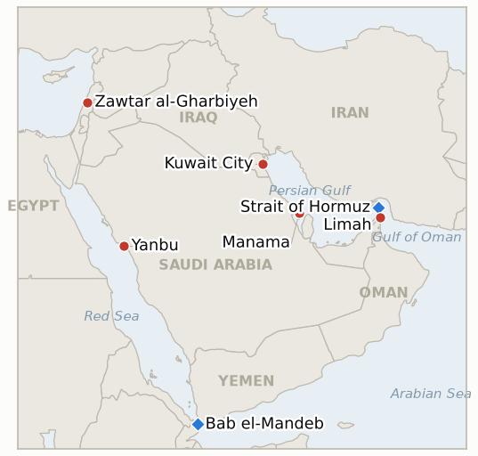

# Middle East Daily Briefing

**July 22, 2026**

- **Reporting window:** ~24 hours, July 21, 06:00 to July 22, 06:00 KST
- **Overall assessment:** Day eleven was the day the war's claims started resolving into verified facts, in both directions. At sea, the regime became real: a Kuwaiti products tanker, the Kaifan, was struck near the Strait of Hormuz with UKMTO confirmation, two crew injured and the crew abandoning ship — the first independently verified vessel casualty after six unverified Iranian claims — and Kuwait summoned Iran's ambassador in protest, the first time a Gulf state has formally attributed a tanker attack to Tehran this round. The Houthi embargo on Saudi shipping produced its first observable effect without a shot: two tankers carrying Saudi crude to Asia, including a VLCC that loaded 2 million barrels at Yanbu — the port behind all fifteen of Korea's workaround liftings — reversed course, and oil settled up about 2% at a five week high (Brent ~$91). In the air, the tenth consecutive US strike night stayed inside its established target classes, formally falsifying the class break indicator: three dead soldiers did not buy the grid or leadership targets, and Iran's answering wave — Kuwait's utilities a fourth day, claimed destruction of Amazon's Bahrain data hub — stayed equally calibrated, though it planted a first: a state actor claiming a kinetic kill on hyperscaler cloud infrastructure. On the diplomatic track, the 10 day truce hardened into a real proposal from Qatar, Egypt, Pakistan and Oman — return to pre July 9 positions, both Hormuz lanes reopened — with the Trump administration exploring it while flying in fighter squadrons for the escalation branch, Trump taunting that Iran is "desperate" to talk while threatening to bomb the Pickaxe Mountain nuclear site "pretty soon." And in Lebanon, the framework produced its first verified Israeli withdrawal: the Lebanese army entered Zawtar al-Gharbiyeh after the IDF pulled out — confirming the pilot zone indicator five days before deadline — hours before Aoun told Trump at the White House that Lebanon would end hostility with Israel "forever." Seoul, meanwhile, delivered the cleanest divergence day of the war: the KOSPI rebounded 3.56% on foreign buying while Gulf risk repriced upward — the narrow channel thesis passing its first test at full marks.

---

## 1. What Happened

<figure style="float:right; width:46%; margin:2pt 0 8pt 14pt;">

<figcaption style="font-size:8pt; color:#666; text-align:center; margin-top:3pt; font-style:italic;">Major places of discussion</figcaption>
</figure>

### 1.1 The War Gets Its First Verified Tanker Casualty as Kuwait Protests to Tehran

The Kaifan, a Kuwait flagged products tanker owned by state run Kuwait Oil Tanker Co., was struck by a projectile about 8 nautical miles northeast of Limah, Oman, in the southern Strait of Hormuz late Monday; UKMTO confirmed the attack after receiving multiple reports, ship to ship radio traffic recorded the bunker tank on fire and the main engine disabled, two crew members sustained minor injuries and the crew abandoned ship into lifeboats ([Xinhua](https://english.news.cn/europe/20260721/a93561653f6940b6a453da2bc564afb4/c.html), [Ship & Bunker](https://shipandbunker.com/news/world/714603-ukmto-reports-new-ship-attack-in-strait-of-hormuz), [Maritime Executive](https://maritime-executive.com/article/report-kuwaiti-owned-tanker-hit-in-the-strait-of-hormuz), [Bloomberg](https://www.bloomberg.com/news/articles/2026-07-21/another-tanker-hit-in-hormuz-as-houthis-add-to-regional-risks)). This is the first independently verified vessel strike since Iran declared its transit licensing regime — after six claimed IRGC interceptions with no corroboration — and the location sits on the southern, Omani side route that Tehran brands "unsafe" and unauthorized. Kuwait summoned Iran's ambassador Mohammad Totonchi and handed him a formal protest note condemning the attack as a violation of its sovereignty and a threat to freedom of navigation — the first formal state attribution of a tanker attack to Iran in this round ([Maritime Executive](https://maritime-executive.com/article/report-kuwaiti-owned-tanker-hit-in-the-strait-of-hormuz), [Gulf News](https://gulfnews.com/world/mena/us-launches-10th-night-of-iran-strikes-as-irgc-claims-attacks-on-bahrain-kuwait-1.500614721)). **Confidence: High** on the attack, damage and crew abandonment (UKMTO bulletin, multi outlet, radio recording); **Medium-High** on Iranian attribution (Kuwaiti government protest and IRGC's standing claims about the route, but no IRGC statement naming the Kaifan found in the window).

### 1.2 The Houthi Embargo Turns Saudi Crude Tankers Around Without Firing a Shot

Two tankers carrying Saudi crude to Asia reversed course in the Red Sea on Tuesday after Houthi threats — the first publicly confirmed route changes under the maritime embargo declared Monday. The VLCC Shin Long Yang, which had loaded 2 million barrels at Yanbu the previous day bound for China, and an Aframax also out of Yanbu turned back toward the Suez Canal rather than continue south toward Bab el-Mandeb, a diversion that could add weeks to voyage times; sources said Yanbu itself was operating normally ([Reuters via Cyprus Mail](https://cyprus-mail.com/2026/07/21/saudi-crude-tankers-turn-back-as-houthis-open-new-front-in-us-iran-war), [Al-Monitor](https://www.al-monitor.com/originals/2026/07/tankers-saudi-crude-turn-back-houthis-open-new-front-us-iran-war), [Bloomberg](https://www.bloomberg.com/news/articles/2026-07-21/chinese-oil-tanker-u-turns-in-red-sea-after-houthi-attack-threat), [Splash247](https://splash247.com/tankers-turn-back-after-houthi-threat-to-saudi-shipping/), [Maritime Executive](https://maritime-executive.com/article/houthi-blockade-of-saudi-shipping-begins-to-bite)). No attack, boarding or seizure was verified — the embargo is biting through deterrence alone. Oil priced both chokepoints at once: Brent rose about 2% to a five week high, trading at $91.05 (+2.1%) in the last hour of the session, with WTI at $85.15 (+2.3%) ([Reuters via BNN Bloomberg](https://www.bnnbloomberg.ca/markets/oil/2026/07/21/oil-prices-rise-nearly-2-on-fresh-attacks-by-us-and-iran/), [CNBC](https://www.cnbc.com/2026/07/21/oil-prices-dip-as-mediation-efforts-offset-us-iran-strikes.html)). **Confidence: High** on the turn backs and price move (Reuters/Bloomberg tracking data, multi outlet); the embargo's enforcement capacity remains untested (IND-20260721-2).

### 1.3 The Tenth Strike Night Stays Calibrated as Iran Claims Amazon's Bahrain Data Hub

The US completed its tenth consecutive night of strikes, with CENTCOM again naming "Iranian military command centers, maritime capabilities, missile and drone launch sites and air defense systems" and Iranian media reporting explosions in Sirik, Bandar Abbas, Qeshm Island, Shiraz and Isfahan — inside the campaign's established target classes, with power generation, the grid and leadership targets again withheld ([Al Jazeera](https://www.aljazeera.com/news/2026/7/21/us-launches-tenth-consecutive-night-of-attacks-on-iran), [Just Security](https://www.justsecurity.org/148592/early-edition-july-21-2026/), [Democracy Now](https://www.democracynow.org/2026/7/21/headlines/us_bombs_iran_for_10th_consecutive_night)). Iran's answering wave — framed as the 24th wave of Operation Nasr — targeted US positions in Kuwait, Bahrain and Jordan: Kuwait reported Iranian strikes on power generation and desalination plants for a fourth consecutive day, with fires contained and generating units precautionately shut down; the IRGC claimed hits on US air defense and radar in Bahrain's Muharraq and Riffa, a destroyed F-15 in Jordan (unconfirmed), and — a first — the "destruction" of Amazon's central data infrastructure in Bahrain (the AWS ME-South-1 region) with cruise missiles, framed as retaliation for Darkhovin; Bahraini, US and Amazon officials did not respond and no independent confirmation exists ([IranWire](https://iranwire.com/en/news/155256-irgc-attacks-us-bases-in-bahrain-kuwait-and-jordan/), [anews](https://www.anews.com.tr/world/2026/07/21/kuwait-reports-iranian-strikes-on-power-water-desalination-plants-for-4th-consecutive-day), [Gulf News](https://gulfnews.com/world/gulf/kuwait/kuwait-says-iran-strikes-damaged-power-and-water-desalination-plant-1.500611118), [Euronews](https://www.euronews.com/2026/07/21/irans-irgc-claims-attack-on-amazons-main-data-hub-in-bahrain), [DCD](https://www.datacenterdynamics.com/en/news/irans-islamic-revolutionary-guard-corps-claims-fresh-hit-on-aws-data-center-in-bahrain/), [Tom's Hardware](https://www.tomshardware.com/tech-industry/data-centers/amazon-data-center-in-bahrain-struck-and-destroyed-by-iranian-cruise-missiles-state-media-claims-attacks-launched-against-aws-site-in-response-to-alleged-us-strikes-on-an-under-construction-nuclear-plant)). **Confidence: High** on the tenth wave and Kuwait's fourth infrastructure day (CENTCOM and Kuwaiti government statements, multi outlet); **Low** on the Amazon and F-15 claims (single party, no independent confirmation, at least the third claimed action against the same AWS site since March).

### 1.4 Mediators Push the 10 Day Truce as Trump Explores It While Massing Aircraft

The mediation round sharpened into a concrete proposal: Qatar, Egypt, Pakistan and Oman are urging Washington and Tehran to return to their pre July 9 positions as a first step — a 10 day ceasefire during which US strikes halt, both Hormuz shipping lanes reopen (the southern Omani route free of Iranian attacks, the northern Iranian route free of the US blockade), and the two sides negotiate a longer term transit arrangement to revive the collapsed MOU ([The New Arab](https://www.newarab.com/news/qatar-and-pakistan-propose-10-day-iran-us-ceasefire), [Axios](https://www.axios.com/2026/07/21/iran-war-ceasefire-proposal-trump-troops), [Middle East Monitor](https://www.middleeastmonitor.com/20260721-iranian-official-says-mediators-proposed-10-day-ceasefire-to-revive-us-agreement/)). The Trump administration is exploring the proposal and has urged Israel to avoid steps that could close the diplomatic window — while simultaneously flying dozens of fighter jets and refueling aircraft into the region, including F-16s from Spangdahlem and F-35s from Lakenheath, assembling the force package for a major escalation if talks fail ([Axios](https://www.axios.com/2026/07/21/iran-war-ceasefire-proposal-trump-troops), [Aero News Journal](https://www.aeronewsjournal.com/2026/07/us-deploys-f-35-and-f-16-fighters-to.html), [Ynet](https://www.ynetnews.com/article/s1cf00z5nfl)). Trump said Iran is "desperate" to meet and talk, and threatened to attack the deeply buried Pickaxe Mountain nuclear linked site near Natanz "very heavily" and "pretty soon," saying there is "nothing" Iran can do about it ([Al Jazeera liveblog](https://www.aljazeera.com/news/liveblog/2026/7/21/iran-war-live-us-launches-10th-night-of-strikes-tehran-attacks-kuwait), [Forbes](https://www.forbes.com/sites/saradorn/2026/07/21/what-is-irans-pickaxe-mountain-trump-threatens-bombing-there-pretty-soon/), [The Hill](https://thehill.com/policy/defense/5966603-trump-threatens-pickaxe-mountain-iran/)). The Jerusalem Post reported, citing sources, that the proposal originated with Tehran itself, quietly submitted while under bombardment ([JPost](https://www.jpost.com/middle-east/iran-news/article-903154)). **Confidence: High** on the proposal's terms and mediator identities (multiple outlets, Iranian confirmation of receipt); **Medium** on the US "exploring while preparing" posture (Axios sourcing consistent with observed deployments); **Low-Medium** on Iranian authorship of the proposal (single outlet exclusive).

### 1.5 Israel Hands Over Its First Pilot Zone as Aoun Meets Trump

Lebanese army troops deployed into Zawtar al-Gharbiyeh on Tuesday after Israeli forces withdrew from the area — the first town transferred from Israeli to Lebanese military control under the pilot zone scheme, and the first verified Israeli withdrawal of the framework; demining teams began surveying roads and buildings before residents return ([Reuters via US News](https://www.usnews.com/news/world/articles/2026-07-21/lebanese-army-deploys-in-southern-town-after-israeli-withdrawal-official-says), [Times of Israel](https://www.timesofisrael.com/in-first-lebanese-army-deploys-in-southern-pilot-zone-after-israeli-withdrawal/), [The National](https://www.thenationalnews.com/news/mena/2026/07/21/lebanese-army-enters-zawtar-al-gharbieh-after-israeli-withdrawal-under-pilot-scheme/)). The handover was not frictionless: Israeli troops fired warning shots when LAF personnel with an engineering vehicle crossed about 150 meters into what Israel calls its security zone near neighboring Zawtar al-Sharqiyeh ([Times of Israel](https://www.timesofisrael.com/in-first-lebanese-army-deploys-in-southern-pilot-zone-after-israeli-withdrawal/)). Hours later, Aoun met Trump at the White House — the first Lebanese head of state there in nearly two decades — presented his Hezbollah disarmament plan, declared Lebanon would end hostilities with Israel "forever," and asked for US pressure on Israel to keep the withdrawals on schedule; Trump pledged to help Lebanon "a lot" and said he would speak directly with Hezbollah if Beirut asked ([Washington Post](https://www.washingtonpost.com/world/2026/07/21/lebanon-president-hezbollah-trump-aoun-israel/945ae628-84c1-11f1-9cec-0fb26676f07e_story.html), [Times of Israel](https://www.timesofisrael.com/meeting-trump-in-dc-aoun-says-lebanon-will-end-hostility-with-israel-forever/), [JPost](https://www.jpost.com/middle-east/article-903213), [PBS](https://www.pbs.org/newshour/world/watch-live-trump-meets-with-lebanese-president-joseph-aoun-in-the-oval-office)). **Confidence: High** across the development (Reuters, Lebanese and Israeli official statements, on camera White House meeting).

---

## 2. Deep Dive: Incentives and Motives

### 2.1 Why does one verified tanker casualty matter more than six unverified claims?

Because markets, insurers and navies price evidence, not statements. For two days the IRGC's licensing regime rested on claims that instrumented modern shipping conspicuously failed to corroborate — a silence that was tilting the ledger's verification indicator toward "theater." The Kaifan resolves that question in the regime's favor, and worse: the strike landed on the southern, Omani side route — the lane Tehran brands unauthorized — meaning the regime is now demonstrably enforced by projectile, not just by radio warning. Note what the target choice communicates. Kuwait is already absorbing nightly strikes on its power and water; its state tanker company has now been hit at sea. Tehran is telling every Gulf host state that there is no maritime neutrality left to hide in — the same message ashore and afloat. And note the boundary Iran kept even here: a products tanker, minor injuries, no sinking, no US flag. The enforcement is real but still calibrated to coerce rather than to force the US Navy's hand. The operational consequence was already priced before the confirmation (no master was testing the route); the political consequence is new — Kuwait's formal protest note is the first document by which a Gulf state attributes a tanker attack to Iran, and that is the paper trail on which any future GCC collective response would be built (IND-20260722-2).

### 2.2 What does the Houthi embargo achieve without firing a shot?

It converts a declaration into a price signal at zero munition cost. Two tankers out of Yanbu — one carrying 2 million barrels for China — turned around on threat alone, and every charterer scheduling a Red Sea voyage now must price the possibility of being the enforcement test case. This is the cheapest kind of blockade: the Houthis spend nothing, retain full escalatory optionality, and let commercial risk aversion do the interdiction. The subtlety is that the embargo's success without enforcement also postpones its falsification — IND-20260721-2 requires a verified attack or a loading suspension by ~July 27, and Yanbu operating normally while ships U-turn mid voyage meets neither branch. For Riyadh the calculus worsened overnight: its Red Sea route was the workaround for its own Hormuz problem, and the workaround now has a workaround premium. For Korea the implication is direct and unpleasant — the fifteen tanker Yanbu corridor was built precisely on the assumption that the Red Sea was the safe artery, and the first confirmed commercial casualties of the embargo are Yanbu liftings bound for Asia. The corridor has not closed; it has repriced, and the question that matters for Seoul is whether the 16th Korean lifting loads at all (IND-20260722-1).

### 2.3 Is Washington negotiating or loading the gun?

Both, deliberately, and the two tracks are the same policy. The administration is exploring a truce whose terms would hand it a face saving exit (strikes were always framed as reopening Hormuz; the proposal reopens Hormuz) while flying in the squadrons for the escalation branch and threatening Pickaxe Mountain — a target that is simultaneously the most escalatory rung short of leadership (a nuclear site likely beyond conventional bunker busters) and the most useful threat to hold over a negotiation. Trump's "Iran is desperate to talk" is the tell: he is marketing the truce to his own base as surrender by the other side, which is what a leader does when he intends to take a deal, not when he intends to refuse one. The JPost report that Tehran itself authored the proposal — unverified, but consistent with Pezeshkian's "the economy is the main arena" framing and with Iran confirming receipt within a day — would complete the symmetry: both sides want the pause, and both are escalating to avoid being seen to want it first. That is a familiar and dangerous configuration: it can produce a truce in days, or one miscalculated strike — a Pickaxe attack, an American death in Kuwait, a sunk tanker — can vaporize the round. The escalate to negotiate read gets its test fast: IND-20260721-1 resolves by ~July 27, and the force package being assembled has its own momentum.

### 2.4 What did the tenth strike night settle about the campaign's shape?

It settled the question the ledger asked on July 19: three dead American soldiers, named and honored by the president, did not buy a class break. The tenth wave hit the same categories as the ninth — command, air defense, maritime, launchers — and IND-20260719-1 is falsified at its deadline: the "1,000 missiles" threat and the memorial framing resolved into a calibrated campaign that spares the grid and the leadership as deliberately as ever. Ten consecutive nights inside the same classes is no longer restraint under provocation; it is doctrine. Iran's mirror is equally doctrinal — fourth night on Kuwait's utilities, second on Bahrain — but its innovation this window was symbolic: claiming the destruction of Amazon's Bahrain cloud region is a statement about what Iran considers American infrastructure, extending the war's target taxonomy from bases and utilities to the digital economy, without (so far as any evidence shows) actually destroying anything. A state actor naming a hyperscaler region as a military objective is a precedent the cyber insurance and cloud resilience worlds will metabolize regardless of whether a missile landed. The two calibrations — US sparing the grid, Iran claiming rather than achieving spectacular hits — are the physical evidence that both capitals are holding the escalation ladder still while the mediators work (2.3).

### 2.5 Is Zawtar a template or a token?

Yesterday's caution — that the pilot zones might be Lebanese deployments into ground Israel never held — died in the best possible way: Reuters and both militaries confirm an actual Israeli withdrawal from Zawtar al-Gharbiyeh followed by LAF control, and IND-20260716-3 confirms five days inside its deadline. The warning shots at Zawtar al-Sharqiyeh, 150 meters away, are not a blemish on the story; they are the story — the framework now operates at a granularity where the difference between the village handed over and the village not yet handed over is a rifle shot, which is what verified, phased de-escalation actually looks like. The White House choreography completed the incentive structure: Aoun's "forever" line and disarmament plan give Trump a deliverable, Trump's "I'd talk to Hezbollah" gives Beirut cover to bring the militia into the process rather than crush it, and Israel's withdrawal the same morning gives Aoun proof the framework pays. Every principal was paid in the currency they needed on the same day — that is what a working agreement looks like, and it is now the proof of concept the Hormuz mediators are implicitly selling: small verified trades, executed on schedule, surviving friction. The next test is the ~July 23 military meeting and the second zone.

### 2.6 What did Seoul's divergence day prove?

Something close to the narrow channel thesis in laboratory conditions. Tuesday's inputs: a verified tanker attack, a new embargo biting, oil up 2% to a five week high. Tuesday's outputs in Seoul: KOSPI +3.56% to 6,747.95 on foreign net buying of ₩596bn, and the won strengthening 5 won to ₩1,473.4 — its strongest close of the crisis — without intervention ([Asia Business Daily](https://www.asiae.co.kr/en/article/market-overview/2026072115593790170), [Businesskorea](https://www.businesskorea.co.kr/news/articleView.html?idxno=273350)). Gulf risk repriced up; Korean assets repriced up harder, because the KOSPI was trading the chip cycle (undervaluation buying in large cap semiconductors after Monday's rout) and not the war. All three legs of IND-20260721-3 are tracking confirmation with one session left: cumulative foreign flows positive, won below ₩1,490 with no intervention, index moving on chip news. The honest caveat is that the thesis's one channel — oil — genuinely moved against Korea this window: Brent at $91 is a real term of trade deterioration regardless of how well the KOSPI decouples, and the two new indicators it feeds (the structural premium test IND-20260722-3, the Yanbu corridor test IND-20260722-1) are where the financial and physical channels reconverge. Decoupled equities and a repricing import bill can coexist; only one of them shows up in the current account.

---

## 3. Policy Implications for South Korea

Korea's structural exposure baselines are in `instructions/korea-exposure.md`. **Two constants were revised this window on MOTIE's July 21 announcement:** July–August crude procurement is now secured at 110%+ of prior year volumes, and September procurement has risen from 76% to approximately 90% secured; the government states supply is stable through September while explicitly flagging the Red Sea blockade risk and reviewing alternative routings ([Herald Business](https://biz.heraldcorp.com/article/10814912), [Youth Daily](https://www.youthdaily.co.kr/news/article.html?no=223381)). The revision is recorded in `korea-exposure.md` today. Standing baselines otherwise unchanged (~70% of crude and ~36% of LNG through Hormuz; ~26 day reserve estimate; 15 Red Sea detour tankers via Yanbu; MOFA departure advisory in force). **Confidence: High** (MOTIE on record).

**Implications by development:**

1. **The Kaifan strike (1.1):** The licensing regime is now verified, not just effective — war risk premia for any Gulf transit outside Iranian coordination have a confirmed casualty to price against, and the fiction that Gulf flagged vessels enjoy neutrality is gone. For Korean operators the practical rule hardens: no Hormuz transit without Iranian route coordination, and even coordinated transits now carry verified kinetic risk. KNOC and refiners should treat the six Korea bound tankers that crossed under the MOU as the last of the low risk cohort; anything scheduled after must price the Kaifan precedent.
2. **The embargo's first bite (1.2):** The two Yanbu turn backs are functionally a stress test of Korea's workaround corridor, run on someone else's ships. The corridor's economics just moved: Suez/SUMED diversion adds weeks and cost, war risk premia for Red Sea Saudi liftings will spike, and charterers may begin declining Yanbu cargoes outright. Immediate actions stand from yesterday (charter party and insurance review, SUMED capacity assessment) plus one new one: get a MOTIE/KNOC read on whether the 16th lifting loads on schedule — that single data point is now the best live indicator of corridor viability (IND-20260722-1).
3. **The calibrated exchange and the AWS claim (1.3):** Ten nights of class discipline on both sides is the best available evidence that neither capital wants the infrastructure war that would force Korea's genuine crisis scenarios (grid strikes → Bab el-Mandeb closure). The AWS claim, even unverified, opens a new exposure file: Korean firms run substantial workloads on Gulf cloud regions (AWS Bahrain, Azure UAE), and Korean data center and subsea cable investments in the Gulf now sit inside a declared target taxonomy. A precautionary review of Gulf region cloud dependencies and failover configurations for Korean corporates is cheap insurance.
4. **The truce round and the force buildup (1.4):** The proposal's terms — both lanes open, return to pre July 9 — would restore the exact configuration under which Korea's six MOU era tankers crossed safely. Planning posture unchanged from yesterday: treat any reopening as a lifting acceleration window, not normalization, and note that the failure mode has sharpened — a Pickaxe Mountain strike would confirm the nuclear target class (IND-20260720-1) and likely add a radiological dimension to the oil price in one move.
5. **Zawtar and Seoul's divergence day (1.5, 2.6):** Lebanon now supplies the working template for phased verified de-escalation — directly relevant as the mediators' Hormuz proposal is structurally a pilot zone scheme for a strait. Seoul's clean divergence (equities and won strengthening through a Gulf escalation day) means policy capacity remains fully unspent; the BOK's August decision (IND-20260717-3) can stay oil focused rather than defending the currency or the index.

**Testable indicators:**

1. **IND-20260722-1: Korea's Yanbu corridor stays usable or reprices away.** Metric: the 16th Korean workaround lifting (MOF/MOTIE announcements, Kpler, trade press). Confirmation: by ~July 29, a 16th Korean chartered tanker loads at Yanbu and exits via Bab el-Mandeb (or MOTIE confirms the route remains in active use) — the corridor survives the embargo's deterrence phase. Falsification: Korean charterers suspend or divert Yanbu loadings (Suez/SUMED routing, cancelled fixtures, or a MOTIE statement naming an alternative) — the embargo has closed Korea's main workaround without a shot, and the ~273m barrel non Hormuz cushion becomes the binding constraint.
2. **IND-20260722-2: Kuwait moves beyond protest or stays in the victim role.** Metric: Kuwaiti and GCC diplomatic/military actions (severing or downgrading ties with Tehran, GCC joint defense invocation, Kuwaiti participation in or basing expansion for US strikes). Confirmation: any of these by ~August 4 — the first Gulf state crosses from absorbing the war to joining it, and the war's state set expands with direct consequences for Korean expatriates, projects and procurement across the GCC. Falsification: protest and repair posture persists through August 4 — the Gulf states continue to price neutrality as cheaper than belligerence even under direct attack, and the war stays a US–Iran dyad fought on their soil.
3. **IND-20260722-3: The two chokepoint premium is structural or event driven.** Metric: Brent settles. Confirmation: two consecutive settles at or above $92.50 by ~July 28 — the market has moved to pricing dual chokepoint disruption as the standing regime; shift Korea's H2 import bill base case to $90+ Brent and re-run the current account and CPI passthrough estimates. Falsification: a settle back below $89.00 within the window — the Kaifan/embargo premium was event driven and mediation still anchors the price; keep the base case at high $80s with escalation optionality.

Resolutions announced today: **IND-20260716-3 confirmed** — Israeli forces withdrew from Zawtar al-Gharbiyeh with LAF deployment following, verified by both militaries and Reuters, five days inside the ~July 26 deadline; the framework has implementation traction and Tehran is not activating Hezbollah. **IND-20260719-1 falsified** — the tenth strike night stayed inside existing target classes at the ~July 22 deadline; the response to the first US combat deaths absorbed the deaths without a class break, and the campaign's calibration is now doctrine (residual grid risk tracked by IND-20260718-1 to ~July 24). **IND-20260720-2 confirmed** — the Kaifan strike is a UKMTO verified kinetic attack on a vessel using the route Iran brands unauthorized, with a flag state attribution on paper; transit is a licensed privilege enforced by force, and Gulf loading war risk and Korean charter terms should reprice categorically.

Open indicator status from the ledger: IND-20260714-4 (no weekly loading figure; freeze at day 11 — open), IND-20260715-1 (no fresh transit print; regime test toward ~July 28 — open), IND-20260715-2 (no named Gulf package — open), IND-20260715-3 (no new UAE corroboration — open), IND-20260715-4 (won ₩1,473.4, second sub 1,490 session this week without intervention; weekly close test Friday July 24 — open, trending falsification), IND-20260716-2 (no verified Bab el-Mandeb incident; the Yanbu turn backs are commercial avoidance, not attacks, and the Tehran coordination condition stays unmet — open), IND-20260717-1 (no announced meeting or second gesture; deadline ~July 23 — open, falsification effectively tomorrow), IND-20260717-2 (no laden departures; freeze at day 11 — open, trending falsification at ~July 24), IND-20260717-3 (August BOK meeting — open), IND-20260718-1 (tenth wave again spared generation and grid; falsification branch near resolution at ~July 24 — open), IND-20260720-1 (no new nuclear facility strike; Trump's Pickaxe Mountain threat sharpens the confirmation scenario — open, deadline ~July 27), IND-20260720-3 (no Iranian munition impact on Israeli territory, no Israeli strike wave, no Red Sea attack — open), IND-20260721-1 (no acceptance by either government; US exploring, terms hardened — open, deadline ~July 27), IND-20260721-2 (no verified enforcement action; deterrence effects only, Yanbu loading normally — open, deadline ~July 27), IND-20260721-3 (day one of the test met all three legs: foreigners +₩596bn, won ₩1,473.4 no intervention, KOSPI tracking chip news above 6,300 — open, resolves at the July 23 close).

---

## 4. Watch List

- **Iran's formal answer to the truce.** Baghaei confirmed receipt Monday; the proposal's terms are now public and the JPost claims Tehran authored it. Watch Qatari, Egyptian, Pakistani and Omani foreign ministry channels for an acceptance signal or a strike pause; IND-20260721-1 resolves by ~July 27. **Confidence: Medium** on visible movement within days.
- **Pickaxe Mountain.** Trump's "pretty soon" puts the most escalatory conventional target on a clock while the truce is on the table — execution would confirm IND-20260720-1 and likely kill the mediation round in the same night. Watch for B-2 movements and IAEA statements. **Confidence: Low-Medium** on execution this week (the threat's negotiating value evaporates once used).
- **IND-20260717-1's deadline lands tomorrow.** No announced US–Iran meeting and no second goodwill gesture by ~July 23 falsifies the "they want to meet" claim as narrative management — all but certain; the mediation surge continues as its functional successor (IND-20260721-1). **Confidence: High** on falsification.
- **The 16th Korean lifting at Yanbu.** The single most Korea relevant data point of the week (IND-20260722-1); watch MOF/MOTIE announcements and Kpler fixtures. **Confidence: High** that the question is forced within days.
- **Seoul's Wednesday and Thursday sessions.** IND-20260721-3 resolves at the July 23 close; a Gulf headline day that outmoves chip news, or a foreign flow reversal, is the falsification signature to watch. **Confidence: High** on resolution on schedule.
- **The ~July 23 Lebanon military meeting and the second pilot zone.** Zawtar al-Sharqiyeh — where the warning shots landed — is the next handover candidate; a second verified withdrawal within days would convert the pilot into a program. **Confidence: Medium-High** on the meeting proceeding.
- **Qatar's LNG freeze at day 11.** IND-20260717-2 resolves ~July 24 with no laden exit since July 11; a truce acceptance is now the only realistic path to a resumption inside the deadline. The Q4 Korean procurement gap hardens. **Confidence: High** on the freeze continuing absent a truce.
- **The won's Friday close.** Second weekly close below ₩1,490 (IND-20260715-4) would formally falsify the financial crisis channel; at ₩1,473.4 with two sessions left, only a major escalation shock reverses it. **Confidence: Medium-High** on falsification Friday.
- **Gaza attrition.** Israeli strikes killed 12 including a family of six in Gaza City Tuesday per civil defence; the UN counts at least 57 Palestinians killed July 13–20. The post truce toll's climb continues drawing zero diplomatic bandwidth. **Confidence: Medium.**
- **The Muwaffaq Salti remains.** No identification update in the window; the MIA case and its latent hostage dynamic stay open. **Confidence: High** on the examination continuing.

---

## 5. Source Quality Summary

| Claim | Sources | Confidence |
|---|---|---|
| Kaifan struck 8nm NE of Limah; bunker tank fire, main engine disabled; two minor injuries; crew abandoned ship | UKMTO bulletin; Xinhua (radio recording), Ship & Bunker, Maritime Executive, Bloomberg | High |
| Kuwait summoned Iran's ambassador Totonchi with formal protest over the Kaifan | Kuwaiti government statement; Maritime Executive, Gulf News | High |
| Attack attributable to IRGC route enforcement | Kuwaiti protest; IRGC standing "unsafe route" claims; no IRGC statement naming the vessel | Medium-High |
| Two Saudi crude tankers (VLCC Shin Long Yang +1 Aframax) reversed course from Yanbu after Houthi threats; Yanbu operating normally | Reuters, Bloomberg tanker tracking; Al-Monitor, Splash247, Maritime Executive | High |
| Brent +2.1% to $91.05, WTI +2.3% to $85.15, five week high | Reuters late session print (13:26 EDT); BNN Bloomberg, CNBC | Medium-High (near settle print, not official settle) |
| Tenth consecutive US strike night; command centers, maritime, launch sites, air defense; explosions Sirik, Bandar Abbas, Qeshm, Shiraz, Isfahan | CENTCOM statement; Al Jazeera, Just Security, Democracy Now | High |
| Kuwait: power and desalination plants struck fourth consecutive day; fires contained, precautionary shutdowns | Kuwaiti Ministry of Electricity and Water statement; anews, Gulf News, Washington Times, Iran International | High |
| IRGC claims destruction of Amazon Bahrain data hub (AWS ME-South-1) with cruise missiles; claims F-15 destroyed in Jordan | IRGC/Iranian state media only; Euronews, DCD, Tom's Hardware, IranWire; no US/Bahraini/Amazon response | Low |
| 10 day truce terms: pre July 9 positions, both lanes reopen, longer term negotiation; mediators Qatar, Egypt, Pakistan, Oman | The New Arab, Axios, Middle East Monitor; Baghaei confirmed receipt on record | High |
| US exploring proposal while deploying F-16s/F-35s and tankers for escalation branch | Axios sourced reporting; Aero News Journal, Ynet deployment reporting | Medium |
| Trump: Iran "desperate" to talk; will hit Pickaxe Mountain "very heavily"/"pretty soon" | On record remarks; Al Jazeera liveblog, Forbes, The Hill, ABC | High |
| Iran authored the 10 day proposal | JPost exclusive, sourced | Low-Medium |
| Israeli withdrawal from Zawtar al-Gharbiyeh; LAF deployment; first pilot zone transfer | Reuters, Lebanese official, IDF; US News, Times of Israel, The National | High |
| Warning shots near Zawtar al-Sharqiyeh (LAF 150m crossing) | LAF and IDF statements; Times of Israel | High |
| Aoun at White House: "end hostility forever," disarmament plan; Trump: help "a lot," would talk to Hezbollah | On camera; Washington Post, Times of Israel, JPost, PBS | High |
| KOSPI 6,747.95 close (+3.56%); foreigners +₩596bn; won ₩1,473.4 close, no intervention | KRX data; Asia Business Daily, Businesskorea | High |
| MOTIE: July–August crude 110%+ secured, September ~90% secured | MOTIE announcement July 21; Herald Business, Youth Daily | High |
| Gaza: 12 killed Tuesday incl. family of six; UN: 57 killed July 13–20 | Gaza civil defence, UN; RTE, Ground News, Democracy Now | Medium |

_Generated 2026-07-22 (KST) from web research across 30+ outlets (US, Qatari, Israeli, Iranian state, Emirati, Saudi, Kuwaiti, Lebanese, Chinese state, Korean, European, specialist maritime, energy and data center press)._
