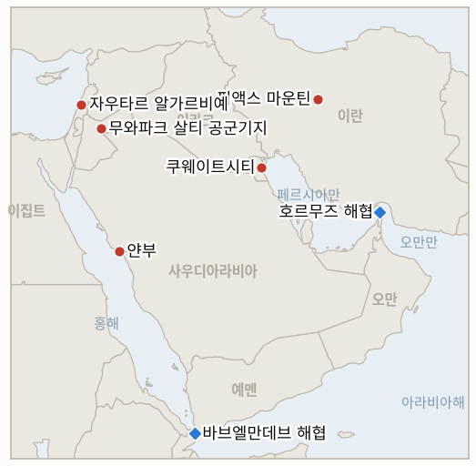

# 중동 일일 브리핑

**2026년 7월 23일**

- **보고 기간:** 약 24시간, 7월 22일 06:00 ~ 7월 23일 06:00 (한국시간)
- **종합 평가:** 개전 12일째는 두 개의 시계가 동시에 돌아갔다. 전장의 시계는 빨라졌다. 미국은 11번째 연속 공습의 밤을 완료해 항공기 격납고와 드론 저장 시설을 타격하면서도 전력망과 지도부는 12일째 제외했고, 이란은 걸프와 요르단의 미군 진지에 또 한 차례 나스르 작전 파상 공격으로 응수했으며, 후티는 홍해를 '선언'에서 '장전된 총'으로 옮겨 바브엘만데브 해협 인근에 미사일과 드론을 배치했다. 합동해양정보센터(JMIC)는 이들이 "공격 준비를 마쳤다"고 평가했고 더 많은 사우디 화물이 회항했다. 유가가 이 가속을 반영했다. 브렌트유는 3.4% 올라 6주 최고치인 94.07달러에 마감했고 장중 잠시 95달러를 넘었으며, 어제 개설된 두 초크포인트 프리미엄 지표가 첫 확증 종가를 기록했다. 긴장 완화의 시계는 반대 이야기를 했고, 이날의 새로운 사실은 그 시계가 이제 테헤란만큼이나 워싱턴 안에서도 돌아가고 있다는 점이다. 국방장관 피트 헤그세스는 의회에서 전쟁 비용이 이미 375억 달러에 달했다며 최대 700억 달러의 추가 예산을 요청했고, 여야 양쪽의 반발과 "어떻게 끝나는지에 대한 답이 없다"는 CNN의 진단을 불렀다. 7월 22일 갱신된 국방부 사상자 분석 시스템(DCAS)은 2월 28일 개전 이후 누적 미군 전사자를 18명, 부상자를 약 482명(그중 약 100명은 7월 7일 이후, 96%는 복귀)으로 집계했다. 이 청구서를 마주하고도 트럼프는 완화가 아니라 강경으로 돌아섰다. 근시일 협상 가능성을 일축하고 픽액스 마운틴 핵 연계 시설을 "곧" 타격하겠다는 위협을 반복했다 — 이란 내무장관 에스칸다르 모메니가 이슬라마바드에서 파키스탄 채널을 가동하고 카타르·파키스탄 중재국들이 7월 9일 이전 위치 복귀안을 유지하는 와중에도. 레바논은 유일하게 명백한 호재를 냈다. 나와프 살람 총리가 새로 반환된 자우타르 알가르비예를 시찰하며 이를 "이스라엘 철군의 시작"이라 불렀고, 당국은 시범 구역 목록을 나쿠라 방향으로 확대할 금요일 군사 회담을 잡았다. 서울은 탈동조화를 둘째 날에도 유지했다. 코스피는 외국인의 사상 최대 순매수(2조 6,000억 원) 속에 장중 7,150을 찍은 뒤 0.74% 오른 6,797.70에 마감했고, 원-달러 환율은 1,480.1원으로 소폭 밀렸을 뿐 여전히 1,490 미만 국면 안에 머물렀다 — 유가 경로가 전쟁 이래 어느 날보다 한국에 더 불리하게 움직였는데도.

---

## 1. 무슨 일이 있었나

<figure style="float:right; width:46%; margin:2pt 0 8pt 14pt;">

<figcaption style="font-size:8pt; color:#666; text-align:center; margin-top:3pt; font-style:italic;">주요 논의 지점</figcaption>
</figure>

### 1.1 11번째 공습의 밤도 표적 유형 안에 머물고, 이란은 걸프와 요르단을 계속 타격

미국은 수요일 새벽 11번째 연속 공습의 밤을 완료했다. 미 중부사령부(CENTCOM)는 표적에 항공기 격납고와 드론 저장 시설이 포함됐다고 밝혔고, 이번에도 전력 생산, 국가 전력망, 지도부 표적은 12일째 제외됐다 ([Washington Post](https://www.washingtonpost.com/business/2026/07/21/iran-us-hormuz-strait-war-july-20-2026/92883244-84d8-11f1-9cec-0fb26676f07e_story.html), [NW Arkansas Democrat-Gazette](https://www.nwaonline.com/news/2026/jul/22/us-finishes-11th-night-of-strikes-against-iran/), [NPR](https://www.npr.org/2026/07/22/nx-s1-5902843/us-iran-updates), [Just Security](https://www.justsecurity.org/148692/early-edition-july-22-2026/)). 이란은 걸프와 요르단의 미군 진지에 또 한 차례 나스르 작전 파상 공격으로 응수했다. 쿠웨이트, 바레인, 요르단이 다시 미사일·드론 활동을 보고했고 바레인은 종일 사이렌 속에 있었으며, 이란의 발사체는 이스라엘 영토에 도달하지 않았다 ([NPR](https://www.npr.org/2026/07/22/nx-s1-5902843/us-iran-updates), [Times of Israel](https://www.timesofisrael.com/kuwait-says-iran-hit-power-and-water-plants-as-tehran-steps-up-attacks-across-region/)). 교전은 이제 이 전쟁의 표준이 된 절제된 형태를 유지했다. 높은 템포와 넓은 지리, 그러나 양측 모두 새로운 표적 유형은 없었다. **신뢰도: 높음** — 11번째 공습과 표적 유형(CENTCOM 발표, 복수 매체); **신뢰도: 중간** — 7월 22일 이란 파상 공격의 구체적 구성(이란 매체 프레이밍, 독립적 피해 확인 부족).

### 1.2 전쟁 청구서가 미국 의회에 도달하고, 트럼프는 휴전에 냉담해지다

전쟁 비용이 처음으로 국내 정치적 사실로 부상했다. 국방장관 피트 헤그세스는 의회에서 이 분쟁이 이미 375억 달러가 들었다며 긴급·현대화 예산으로 최대 700억 달러를 요청했고, 여야 양쪽 의원들의 반발과 "375억 달러 청구서, 그런데 어떻게 끝나는지에 대한 답은 없다"는 CNN의 진단을 불렀다 ([CNN live](https://www.cnn.com/2026/07/21/world/live-news/iran-war-trump), [CNN politics](https://www.cnn.com/2026/07/22/politics/iran-price-tag-no-answers-how-it-ends), [AOL/Reuters](https://www.aol.com/articles/huge-trump-iran-war-funding-193052715.html)). 7월 22일 갱신된 국방부 사상자 분석 시스템(DCAS)은 2월 28일 개전 이후 누적 미군 전사자를 18명, 부상자를 약 482명(그중 약 100명은 7월 7일 이후 발생, 96%는 복귀)으로 집계했다. 7월 17일 무와파크 살티에서 전사한 병사 2명은 타일러 피핸 소위와 이사벨라 곤잘레스 이등병으로 확인됐고, 실종된 세 번째 병사로 추정되는 유해가 기지에서 수습돼 신원 확인이 진행 중이다 ([Stars and Stripes](https://www.stripes.com/theaters/middle_east/2026-07-21/iran-casualty-system-updates-pentagon-22324452.html), [Washington Post](https://www.washingtonpost.com/world/2026/07/20/iran-retaliates-against-us-strikes-gas-returns-4-gallon/), [Time](https://time.com/article/2026/07/20/us-service-members-killed-wounded-iran-war-casualties/)). 이 청구서를 마주하고도 트럼프는 완화가 아니라 강경으로 돌아섰다. 근시일 협상을 일축하고 더 넓은 군사 행동을 경고했으며, 요새화된 지하의 픽액스 마운틴 핵 연계 시설을 "곧" 타격하겠다는 위협을 반복했다 ([Fox News](https://www.foxnews.com/live-news/iran-war-trump-israel-hormuz-oil-july-21-2026), [Just Security](https://www.justsecurity.org/148692/early-edition-july-22-2026/), [CNBC](https://www.cnbc.com/2026/07/21/us-iran-war-trump-hormuz-houthis.html)). **신뢰도: 높음** — 예산 요청, 비용 수치, 사상자 집계(헤그세스 증언, DCAS, 복수 매체); **신뢰도: 중상** — "협상에 냉담" 판단(중재가 계속되는 가운데 나온 트럼프 발언의 일관된 보도).

### 1.3 워싱턴이 강경해지는 와중에도 이슬라마바드에서 외교는 계속 움직이다

중재 트랙은 워싱턴에서 그 조건이 동력을 잃는 와중에도 현장에서는 살아 있었다. 이란 내무장관 에스칸다르 모메니는 이슬라마바드에서 셰바즈 샤리프 총리, 아심 무니르 육군참모총장(원수)과 고위급 회담을 열어 파키스탄의 미·이란 분쟁 중재와 이슬라마바드 양해각서 부활에 초점을 맞췄다. 파키스탄과 카타르는 양측이 7월 9일 이전 위치로 복귀해 중단된 협상을 재개하자는 공동 제안을 재확인했다 ([Pakistan Today](https://www.pakistantoday.com.pk/2026/07/22/pm-army-chief-reaffirm-pakistans-mediation-role-as-iranian-minister-holds-key-talks), [Express Tribune](https://tribune.com.pk/story/2619315/iranian-interior-minister-iskandar-momeni-arrives-in-islamabad-amid-fresh-mideast-tensions), [Washington Times](https://www.washingtontimes.com/news/2026/jul/21/iranian-official-meets-mediators-pakistan-iran-us-keep-attacks/)). 두 트랙 사이의 간극이 핵심이다. 중재국들이 구체적 프레임워크를 진전시키는 동안 두 당사국은 매일 밤 서로를 타격하고 트럼프는 임박한 협상을 공개적으로 평가절하하면서, 제안은 살아 있으되 어느 정부도 수용하지 않은 상태로 남았다 ([The National](https://www.thenationalnews.com/news/mena/2026/07/21/mediators-seek-to-salvage-us-iran-ceasefire-with-10-day-truce-proposal/), [Axios](https://www.axios.com/2026/07/21/iran-war-ceasefire-proposal-trump-troops)). **신뢰도: 높음** — 모메니의 방문과 중재국 제안(파키스탄 정부 발표, 복수 매체); **신뢰도: 중간** — 동력의 균형(상충하는 신호의 해석).

### 1.4 후티 금수 조치가 장전된 총이 되고, 유가는 6주 최고치로 마감

사우디 해운에 대한 후티의 금수 조치는 아직 발사 없이 '선언'에서 '집행'으로 이동했다. 합동해양정보센터(JMIC)는 후티가 준비를 마치고 바브엘만데브 해협 인근 홍해 남부를 통항하는 선박을 공격하기 위해 미사일과 드론을 배치했다고 밝혔고, Bloomberg는 이들이 "이제 공격 준비를 마쳤다"고 보도했으며, 점점 더 많은 선박이 해협을 우회했다. 보고 기간 마감 시점까지 선박이나 항만이 피격되지는 않았다 ([CNBC](https://www.cnbc.com/2026/07/22/houthis-red-sea-bab-el-mandeb-saudi-oil-iran.html), [Bloomberg](https://www.bloomberg.com/news/articles/2026-07-22/iran-backed-houthis-now-ready-attack-ships-naval-group), [Forbes](https://www.forbes.com/sites/zacharyfolk/2026/07/22/could-bab-al-mandeb-be-the-next-strait-of-hormuz-ships-begin-turning-around-in-red-sea/), [FDD](https://www.fdd.org/analysis/2026/07/22/houthis-announce-blockade-of-saudi-arabia-ships-reroute-to-avoid-bab-al-mandeb-strait/)). 이해관계는 크다. 리야드는 원유를 파이프라인으로 얀부로 보내는데, 얀부의 바브엘만데브 경유 홍해 수출은 6월 일일 약 350만 배럴로 급증했고, 얀부는 한국의 호르무즈 우회 수송 15척 전부의 선적항이다. 유가는 두 초크포인트를 동시에 반영했다. 브렌트유는 3.4% 올라 94.07달러에 마감하며 장중 잠시 95달러를 넘어 6월 8일 이후 최고치를 기록했고, WTI는 약 3% 올라 86.85달러 안팎에 마감했다 ([Trading Economics Brent](https://tradingeconomics.com/commodity/brent-crude-oil), [Trading Economics WTI](https://tradingeconomics.com/commodity/crude-oil), [Rigzone](https://www.rigzone.com/news/wire/mounting_mideast_threats_deepen_oil_shipping_disruptions-22-jul-2026-184182-article/)). **신뢰도: 높음** — 배치 평가, 회항, 유가 종가(JMIC, Bloomberg 선박 추적, 거래소 종가); 금수 조치의 실제 집행 능력은 여전히 미검증(IND-20260721-2)이며 아직 피격된 선박은 없다.

### 1.5 레바논 총리, 인계된 구역을 시찰하며 프레임워크가 확대되다

나와프 살람 레바논 총리는 시범 구역 체제 아래 레바논군 통제로 반환된 첫 마을 자우타르 알가르비예를 시찰하며 인계를 "이스라엘 철군의 시작"이라 부르고 프레임워크의 일정 준수를 촉구했다 ([The National](https://www.thenationalnews.com/news/mena/2026/07/22/lebanese-pm-hails-beginning-of-israeli-withdrawal-from-country-in-visit-to-pilot-zone/), [Times of Israel](https://www.timesofisrael.com/us-says-lebanese-army-deploying-to-pilot-zones-including-one-idf-will-withdraw-from/)). 레바논·이스라엘 군 당국자들은 최근 로마 라운드에 이어 금요일 미국 주관 화상 회담을 열어 확대된 시범 구역 목록과 철군 일정을 확정할 예정이다. 레바논은 자우타르 알샤르키예, 아르눈, 보포르 성, 카프르 테브니트, 유흐무르를 포함하는 구역과 알바야다에서 나쿠라 방향으로의 이스라엘 철수를 제안할 것으로 예상되며, 군은 남부 배치를 확대한다 ([Arab News](https://www.arabnews.com/node/2651160/middle-east), [The National](https://www.thenationalnews.com/news/mena/2026/07/22/lebanese-pm-hails-beginning-of-israeli-withdrawal-from-country-in-visit-to-pilot-zone/)). **신뢰도: 높음** — 총리 시찰과 금요일 회담(레바논 공식 발표, 복수 매체); **신뢰도: 중간** — 구체적 확대 구역 목록(레바논 제안, 회담에서 아직 미합의).

---

## 2. 심층 분석: 유인과 동기

### 2.1 11번째 밤이 왜 확전 대신 격납고와 드론 저장 시설을 쳤나?

표적 목록 자체가 이제 메시지이고, 그 메시지는 외교 창을 앞둔 의도된 절제이기 때문이다. 격납고와 드론 저장 시설은 군사·발사 역량·병참이라는 이 전쟁의 기존 표적 유형 정중앙에 있다. 전력망과 지도부를 12일째 건드리지 않고 트럼프가 동시에 픽액스 마운틴을 위협하는 가운데 11번째 밤에 이를 택한 것은, 워싱턴이 가장 확전적인 사다리 단을 크레이터로 소비하기보다 협상 카드로 예비하고 있음을 테헤란에 알린다. IND-20260719-1이 7월 22일 독트린으로 확증한 패턴이 12일째 유지됐다. 미군 전사자 2명과 375억 달러 청구서도 표적 등급 파괴를 사지 못했다. 이는 약함이 아니라 순서 짓기다. 건드리지 않은 표적 — 전력망과 핵 시설 — 은 협상 위에서 위협으로 걸어둘 때가 크레이터일 때보다 더 값지며, 트럼프가 픽액스를 실행하지 않고 서사화하는 이유가 바로 그것이다. 이 패턴의 위험은, 절제된 템포의 독트린이 충분히 오래 지속되면 절제로 보이기를 멈추고 어느 쪽도 빠져나올 수 없는 끝없는 소모전으로 보이기 시작한다는 점이며, 그 불안이 지금 의회에서 부상하고 있다(2.2).

### 2.2 375억 달러 청구서와 700억 달러 요청은 이 전쟁이 어떻게 끝날지에 대해 무엇을 말하나?

이 분쟁이 직면한 첫 강력한 국내 제약을 도입하며, "절제된 소모전은 무한히 지속될 수 있다"는 독법을 반박한다. 12일간 전쟁 비용은 피격된 유틸리티로 걸프 주둔국이, 전쟁위험 보험료로 해운사가 짊어졌다. 헤그세스의 증언은 그 일부를 미국 예산으로, 그와 함께 의회 일정으로 옮긴다. 이미 초당적 회의론과 "어떻게 끝나는지 답이 없다"는 프레이밍을 부른 700억 달러 요청은, 끝없는 공중전이 내부 시계를 얻는 지점이다. 세출 예산은 정당화돼야 하는데, 같은 청문회가 전사 18명·부상 약 482명을 집계하는 마당에 "우리는 무기한 작전의 11번째 밤에 있다"는 설득은 어렵다. 전략적 함의는 미묘하다. 협상을 일축하고 픽액스를 위협하는 트럼프의 공개 강경은 off-ramp의 거부라기보다, 두 청중을 상대로 동시에 운용하는 협상 태세일 수 있다. 테헤란에는 압박을 최대로 유지하기 위해, 의회에는 작전이 이기고 있으며 예산을 들일 가치가 있다고 주장하기 위해. 그러나 예산 다툼은 이란에 기다릴 이유도 준다. 워싱턴 자신의 입법부가 전쟁을 조일 수 있다면, 미국식 조건의 휴전을 수용할 테헤란의 유인은 약해진다. 다시 말해 청구서는 출구를 앞당기거나(의회가 강제) 교착을 굳힐(이란이 의회를 기다림) 수 있고, 어느 쪽으로 기우는지가 이제 전쟁 지속 기간의, 따라서 유가 프리미엄의 1차적 동인이다(IND-20260723-1).

### 2.3 이슬라마바드의 외교가 워싱턴의 냉각을 버텨낼 수 있나?

지속될 수는 있으나, 두 당사국 중 하나가 움직이지 않으면 결말을 낼 수 없고, 이날의 신호는 그와 반대를 가리킨다. 모메니의 샤리프·무니르 회담은 파키스탄 채널을 데워 두고, 테헤란에 폭격을 받는 와중에도 건설적으로 보일 수 있는 무대를 준다 — 그 자체로 어떤 합의와 무관한 가치가 있다. 중재국의 환심을 사고, 외교의 광학을 전장에서 분리하며, 체면을 세울 프레임워크를 선반에 얹어둔다. 그러나 제안의 핵심인 7월 9일 이전 위치로의 상호 복귀는 워싱턴이 타격을 멈추고 이란이 차단을 멈출 것을 요구하는데, 트럼프는 이날 바로 그것을 평가절하하는 데 시간을 썼다. 따라서 이번 주 이슬라마바드 트랙의 현실적 기능은 휴전을 만들어내는 것이 아니라 그 선택지를 보존하는 것이다 — 전장이나 예산이 중단을 강제할 때, 사전 협상된 구조가 이미 존재하도록. IND-20260717-1의 "발표된 회담" 분기가 off-ramp를 죽이지 않은 채 오늘 반증되는 이유가 그것이다. 회담은 오지 않았으나 그것을 열 기계장치는 유지되고 있고, IND-20260721-1이 살아 있는 휴전 시험을 7월 27일까지 이어간다.

### 2.4 후티 금수 조치가 위협에서 장전된 총으로 바뀌면 무엇이 달라지나?

리스크가 확률적이기를 멈추고 위치적이 된다. 이번 보고 기간까지 금수 조치는 전적으로 억지력으로 작동했다 — 선언에 배가 돌아섰다. JMIC가 미사일과 드론이 배치됐고 후티가 "공격 준비를 마쳤다"고 평가한다는 것은 집행 역량이 물리적으로 갖춰졌다는 뜻이며, 이제 남은 변수는 발사 결정뿐이다. 석유 시장에는 이것이 꼬리 리스크의 단계 변화다. 회항으로 집행되는 선언된 금수는 운임·보험 프리미엄으로 가격이 매겨지지만, 바브엘만데브 인근의 장전된 발사대는 수 분 안에 행사될 수 있는 공급 차질 옵션으로 가격이 매겨진다 — 브렌트유가 80달러대 후반에 머물지 않고 94달러를 넘어선 이유의 일부다. 한국에는 지리가 가혹하다. 얀부 회랑은 홍해가 호르무즈를 우회하는 안전한 동맥이라는 전제 위에 설계됐다. 그 남쪽 관문의 장전된 총은, 한국의 대체 원유 항로의 양 끝 — 회피하려 만든 호르무즈 기점과 의존하는 바브엘만데브 통항 — 이 모두 무장 사정권 안에 들어왔음을 뜻한다. 회랑은 닫히지 않았으나 그 리스크는 "미래 결정에 조건부"에서 "명령 하나 거리"로 이동했고, 16번째 한국 선적분은 용선주들이 그 안으로 여전히 실을지의 살아 있는 시험이다(IND-20260722-1).

### 2.5 레바논 프레임워크가 프로그램이 되고 있나?

되려 하고 있고, 살람의 시찰은 토큰을 실시간으로 프로그램으로 전환하는 방식이다. 한 번의 검증된 철군(자우타르 알가르비예, 7월 22일 확증)은 기제가 한 번 작동함을 증명한다. 정부 수반이 반환된 마을에 서서 이를 철군의 "시작"이라 명명하고 다음 구역을 확정할 군사 회담을 잡는 것은, 하나의 데이터 포인트를 약속된 연쇄로 바꾸는 수다. 제안된 확대 — 자우타르 알샤르키예(이틀 전 경고 사격이 떨어진 곳), 아르눈, 보포르 성, 카프르 테브니트, 유흐무르, 그리고 나쿠라 방향 철수 — 는 의도적으로 점진적이고 검증 가능하며, 이것이 바로 첫 인계를 신뢰할 만하게 만든 속성이다. 레바논 너머의 함의는, 호르무즈 중재국들이 같은 설계 — 일정대로 실행돼 마찰을 견디는 작은 상호 거래 — 를 암묵적으로 팔고 있다는 점이다. 따라서 깨끗이 이양되는 레바논 구역 하나하나가 단계적·검증 가능한 긴장 완화가 실제 전역에서 유지될 수 있다는 실증이다. 반증 리스크도 똑같이 분명하다. 금요일 회담이 다시 연기되거나(한 번 워싱턴 요청으로 연기됨) 두 번째 구역이 정체되면, 그 설득력을 만드는 동력을 잃는다(IND-20260723-2).

### 2.6 서울은 유가가 더 강하게 불리해졌는데도 왜 둘째 날에도 탈동조화했나?

주식 시장이 여전히 반도체 사이클을 거래하고 통화가 여전히 금리 차를 거래하며, 어느 쪽도 유가를 통하지 않고는 아직 전쟁을 거래하지 않기 때문이다. 수요일 장은 좁은 전달 경로 명제의 거의 희화화였다. 코스피는 외국인 매수로 장중 7,150까지 달린 뒤 알파벳 실적을 앞둔 차익 실현과 오르는 유가 부담에 상승분을 대부분 반납하며 0.74% 오른 6,797.70에 마감했고, 외국인은 2조 6,000억 원의 사상 최대 순매수를 기록했으며, 원-달러 환율은 6.7원 밀린 1,480.1원으로 여전히 1,490 미만 국면 안에서 개입 없이 마감했다. IND-20260721-3의 세 가지 조건이 둘째 날에도 모두 유지됐다. 누적 외국인 자금 강한 순유입, 개입 없는 1,490 미만 원화, 걸프 헤드라인이 아니라 반도체·AI 뉴스에 움직인 지수. 정직한 비대칭은, 실제로 전달되는 한 채널 — 유가 — 이 전쟁 이래 어느 날보다 한국에 더 불리하게 움직였다는 점이다. 홍해에 장전된 총이 있는 상태의 94달러 브렌트유는 지난주 88~91달러 밴드보다 실질적으로 더 나쁜 교역 조건이며, 회랑 시험(IND-20260722-1), 프리미엄 시험(IND-20260722-3), 그리고 결국 수입 비용으로 곧장 들어간다. 탈동조화된 주식과 재평가되는 에너지 비용은 오래 공존할 수 있으나, 경상수지에 나타나는 것은 둘 중 하나뿐이고, 이번 보고 기간은 그 둘 사이의 간극을 넓혔다.

---

## 3. 한국에 대한 정책적 함의

한국의 구조적 익스포저 기준값은 `instructions/korea-exposure.md`에 있으며, 이번 보고 기간에 실질적으로 개정된 상수는 없다. 기준값 유지: 원유의 약 70%·LNG의 약 36%가 호르무즈 경유, 7~8월 원유 110% 이상·9월 약 90% 확보(산업통상자원부, 7월 21일), 비호르무즈 완충 약 2억 7,300만 배럴, 비축유 약 26일분 추정, 얀부 선적 홍해 우회 유조선 15척, 외교부 출국 권고 발효 중. **신뢰도: 높음** — 기준값(산업통상자원부/기획재정부 공식). 이번 보고 기간의 살아 있는 변화는 유가다. 브렌트유 94.07달러 종가는 이 파일의 하반기 수입 비용 가정이 기대는 80달러대 후반 기준선을 크게 웃돌며, 유지되면 개정을 강제한다(IND-20260722-3, 아래 IND-20260723-3).

**사안별 함의:**

1. **11번째 밤과 절제된 교전(1.1):** 양측이 12일간 전력망과 지도부를 모두 아낀 것은, 어느 수도도 한국의 진짜 위기 시나리오(전력망 타격이 후티의 바브엘만데브 트리거를 결합)를 촉발하는 기반시설·핵 전쟁을 원치 않는다는 가장 강력한 증거다. 계획 측면에서 이 절제는 회랑·프리미엄 리스크를 상승했으되 경계 지어진, 아직 파국적이지 않은 것으로 다룰 근거다. 아낀 두 표적 유형(전력망은 IND-20260718-1, ~7월 24일; 핵은 IND-20260720-1, ~7월 27일)을 그 독법을 깰 방아쇠선으로 주시한다.
2. **전쟁 청구서와 워싱턴의 냉각(1.2):** 예산 다툼은 미국 측에서 전쟁을 단축할 수 있는 첫 변수이며, 지속 기간은 한국 누적 에너지 비용의 최대 동인이다. 예산이 통과된 끝없는 전역은 90달러 초과 프리미엄이 하반기 내내 기준선이 됨을 뜻하고, 요청을 조이거나 조건 붙이는 의회는 off-ramp 확률을 높여 현 급등을 정점으로 볼 근거를 준다. 세출 경로를 직접 추적한다(IND-20260723-1). 이제 이는 어떤 전장 사건 못지않게 한국의 수입 비용에 중요하다.
3. **이슬라마바드 외교(1.3):** 중재 기계장치가 결말이 아니라 보존되고 있다는 것은, 한국이 휴전을 살아 있으되 가격에 반영되지 않은 시나리오로 유지해야 함을 뜻한다. 48시간 이상 타격 중단이나 공개 수용(IND-20260721-1)은 선적 가속 창이지 정상화가 아니다. 당사국들이 중재국보다 더 멀리 떨어져 있으므로, 포지셔닝은 하지 말되 대비는 한다.
4. **홍해의 장전된 총과 94달러 유가(1.4):** 이번 보고 기간에 한국에 가장 직접적인 타격이다. 회랑 리스크가 조건부에서 임박으로 이동했고, 지난날의 실무 조치가 굳는다. 용선계약·전쟁위험·SUMED 용량 검토를 마무리하고, 16번째 얀부 선적이 일정대로 이뤄지는지 산업통상자원부/한국석유공사 판단을 받는다(IND-20260722-1). 94달러 브렌트유에서 비축유 방출과 110%/90% 조달 완충은 설계대로 작동하지만, 이는 가격 완충이 아니라 비용 완충이다. 물리적 가용성과 무관하게 수입 비용은 지금 재평가되고 있다.
5. **레바논과 서울의 둘째 날 탈동조화(1.5, 2.6):** 레바논의 확대되는 템플릿은 단계적·검증 가능한 긴장 완화가 유지될 수 있다는 상시 증거이며, 호르무즈 제안의 구조와 직접 연관된다. 서울의 둘째 날 깨끗한 탈동조화는 정책 여력이 여전히 소진되지 않았음을 뜻하므로, 한국은행의 8월 결정(IND-20260717-3)은 유가에 집중할 수 있다. 주시할 리스크는 지수나 원화가 아니라 하반기 물가로의 유가 전가다.

**검증 가능한 지표:**

1. **IND-20260723-1: 워싱턴의 전쟁이 예산 활주로를 얻는가, 의회의 벽에 부딪히는가.** 지표: 헤그세스의 약 700억 달러 긴급·현대화 요청의 처리(세출 심의, 본회의 표결, 전쟁권한·조건 부가 조항). 확증: ~2026년 8월 22일까지 의회가 작전에 구속적 제약 없이 요청의 대부분을 세출·계속결의로 조달 — 전쟁이 끝없는 지속의 활주로를 얻고, 한국은 하반기 90달러 초과 브렌트유 기준선을 유지해야 한다. 반증: ~2026년 8월 22일까지 의회가 예산을 차단·실질적으로 조건화하거나, 전쟁권한·철수 조항으로 이를 축소하는 본회의 표결을 강제 — 첫 국내 제약이 물리며, off-ramp 확률이 높아지고 현 프리미엄을 고원이 아니라 정점으로 다뤄야 한다.
2. **IND-20260723-2: 레바논 시범이 프로그램으로 확대되는가, 한 구역에서 정체되는가.** 지표: 두 번째 시범 구역(자우타르 알샤르키예, 아르눈, 보포르 성, 카프르 테브니트, 유흐무르, 또는 알바야다/나쿠라 선)에서의 검증된 이스라엘군 철군과 레바논군 배치(레바논·이스라엘 군 발표 및 독립 확인). 확증: ~2026년 8월 6일까지 두 번째 검증된 철군 — 단계적 긴장 완화는 프로그램이며, 중재국의 호르무즈 템플릿이 살아 있는 실증을 얻는다. 반증: ~2026년 8월 6일까지 두 번째 검증된 철군 없음(금요일 회담 재연기 또는 두 번째 구역 정체) — 자우타르는 일회성 제스처였지 기제가 아니었다.
3. **IND-20260723-3: 94달러 돌파가 한국의 거시 기준선으로 들어가는가, 헤드라인에 그치는가.** 지표: 90달러 초과 유가를 고정하는 한국 공식 신호(산업통상자원부/한국석유공사의 하반기 수입 비용 개정, 유가 수준을 인용한 한국은행 성명, KOSIS 수입물가 지수). 확증: 한국은행 8월 회의(~2026년 8월 31일)까지 90달러 초과 유가를 고정하는 공식 신호 — 유가 채널이 시장 가격에서 거시 가정으로 이동했으며, 경상수지·CPI 전가 추정을 90달러 초과로 재계산해야 한다(IND-20260717-3에 연결). 반증: ~2026년 8월 31일까지 당국이 급등을 일시적으로 다루고 수입 비용·금리 가이던스를 유지 — 프리미엄은 가격에 반영됐으되 아직 내재화되지 않았다.

오늘 발표된 판정: **IND-20260717-1 반증** — ~7월 23일 마감까지 발표된 미·이란 회담도, 두 번째 비용 있는 선의의 표시도 나타나지 않았다. 트럼프는 오히려 근시일 협상을 일축했고 이란 내무장관 모메니는 이슬라마바드에서 파키스탄 채널을 가동했다. "그들이 만나고 싶어 한다"는 주장은 예정된 접촉이 아니라 서사 관리로 판명됐다. off-ramp 자체가 죽은 것은 아니다. 이슬라마바드 중재 급증이 그 기능적 후계이며 IND-20260721-1(~7월 27일)로 살아 있다.

원장 상의 미결 지표 현황: IND-20260714-4(주간 선적 수치 없음, 12일째 동결 — 미결), IND-20260715-1(신규 통항 수치 없음, 회복 분기 소멸, 체제 시험 ~7월 28일 — 미결), IND-20260715-2(지명된 걸프 패키지 없음 — 미결), IND-20260715-3(신규 UAE 확증 없음 — 미결), IND-20260715-4(원화 1,480.1원, 이번 주 세 번째 1,490 미만 세션, 개입 없음, 주간 종가 시험 내일 금요일 7월 24일 — 미결, 반증 추세), IND-20260716-2(검증된 바브엘만데브 공격 없음, 후티 발사대는 배치됐으나 테헤란 조율 조건 미충족 — 미결, ~7월 29일), IND-20260717-2(적재 라스라판 출항 없음, 12일째 동결 — 미결, ~7월 24일 반증 추세), IND-20260717-3(8월 한국은행 회의 — 미결), IND-20260718-1(11번째 파상 공격도 전력 생산·전력망 제외 — 미결, ~7월 24일 판정 임박), IND-20260720-1(핵 시설 타격 없음, 트럼프의 픽액스 마운틴 위협 반복하되 미실행 — 미결, ~7월 27일), IND-20260720-3(이란 발사체의 이스라엘 영토 도달 없음, 이스라엘 공습 파상 없음, 검증된 홍해 공격 없음 — 미결, ~7월 27일), IND-20260721-1(어느 정부도 미수용, 이슬라마바드에서 중재 보존·당사국 강경화 — 미결, ~7월 27일), IND-20260721-2(검증된 집행 행동 없음, 발사대 배치·"공격 준비 완료"이나 피격 선박 없음 — 미결, ~7월 27일), IND-20260721-3(둘째 날 세 조건 모두 충족: 외국인 누적 +2조 6,000억 원, 원화 1,480.1원 개입 없음, 코스피 반도체·AI 뉴스에 연동 — 미결, 7월 23일 종가에 판정), IND-20260722-1(16번째 선적 수치 없음, 회랑 리스크 조건부→임박 — 미결, ~7월 29일), IND-20260722-2(쿠웨이트 재차 피격되나 항의 태세 유지, GCC 확전 없음 — 미결, ~8월 4일), IND-20260722-3(첫 확증 종가: 브렌트유 94.07달러 ≥ 92.50달러, ~7월 28일까지 두 번째 연속 종가 필요 — 미결, 확증 추세).

---

## 4. 관찰 목록

- **700억 달러 예산 다툼.** 헤그세스의 요청과 초당적 반발이 전쟁을 의회 일정에 올렸다. 첫 심의, 본회의 발언, 또는 전쟁권한 움직임이 주시 신호이며, 이제 이는 어떤 타격 못지않게 한국의 유가 프리미엄에 직접 영향을 준다(IND-20260723-1). **신뢰도: 높음** — 다툼이 시작됨; **신뢰도: 중간** — 그 속도.
- **홍해의 첫 선체.** JMIC는 발사대가 배치됐고 후티가 "공격 준비를 마쳤다"고 한다. 다음 확전 단은 사우디 연계·사우디행 선박에 대한 실제 타격이며, 이는 IND-20260721-2를 확증으로 전환하고 바브엘만데브를 억지가 아닌 살아 있는 차질로 재평가한다. UKMTO·JMIC 공지를 주시. **신뢰도: 중상** — 며칠 내 임계선 시험.
- **얀부의 16번째 한국 선적.** 여전히 이번 주 가장 한국 관련성이 높은 데이터 포인트(IND-20260722-1). 회랑의 남쪽 관문에 장전된 총이 놓인 지금, 용선주가 싣는지 우회하는지를 기획재정부/산업통상자원부 발표와 Kpler 용선 정보에서 주시. **신뢰도: 높음** — 며칠 내 답이 강제됨.
- **브렌트유의 두 번째 종가.** 92.50달러 초과 종가 한 번이 들어왔다. ~7월 28일까지 두 번째 연속 종가는 두 초크포인트 프리미엄을 상시 체제로 확증하고 한국의 하반기 수입 비용 기준선을 90달러 초과로 옮긴다(IND-20260722-3). 휴전 헤드라인에 89달러 미만으로 되밀리는 종가가 반증 신호. **신뢰도: 중상** — 보고 기간 내 판정.
- **서울의 목요일 종가.** IND-20260721-3이 오늘 7월 23일 세션 종가에 판정된다. 걸프 헤드라인이 반도체 뉴스를 압도하는 날, 또는 외국인 자금 반전이 이틀의 깨끗한 날 뒤의 반증 신호. **신뢰도: 높음** — 일정대로 판정.
- **픽액스 마운틴.** 트럼프의 반복된 "곧"은 미수용 상태의 휴전 프레임워크가 놓인 가운데 가장 확전적인 재래식 표적을 시계 위에 둔다. 실행은 IND-20260720-1을 확증하고 같은 밤 중재 라운드를 끝낼 공산이 크다. B-2 이동과 IAEA 성명을 주시. **신뢰도: 중하** — 금주 실행.
- **금요일 레바논 군사 회담.** 미국 주관 화상 회담은 확대 구역 목록과 일정을 확정할 예정이다. 두 번째 검증된 철군은 시범을 프로그램으로 전환하고(IND-20260723-2), 또 한 번의 연기(이전에 한 번 연기됨)는 이를 정체시킨다. **신뢰도: 중상** — 회담 진행.
- **12일째 카타르 LNG 동결.** IND-20260717-2가 ~7월 24일 판정되며, 7월 11일 이후 적재 라스라판 출항이 없다. 휴전 수용이 이제 마감 내 재개의 유일한 현실적 경로이고, 4분기 한국 조달 공백이 굳는다. **신뢰도: 높음** — 휴전 부재 시 동결 지속.
- **원화의 금요일 종가.** 내일 1,490 미만 두 번째 연속 주간 종가(IND-20260715-4)는 금융위기 채널을 공식 반증한다. 강한 외국인 유입과 함께 1,480.1원인 지금, 대규모 확전 충격만이 이를 뒤집는다. **신뢰도: 중상** — 금요일 반증.
- **가자 소모.** 이란, 홍해, 예산 다툼이 지배하는 동안 휴전 이후 사상자는 미미한 외교적 관심 속에 계속 오른다. 관심을 되찾을 만큼 큰 사건이 있는지 주시. **신뢰도: 중간.**

---

## 5. 출처 신뢰도 요약

| 주장 | 출처 | 신뢰도 |
|---|---|---|
| 11번째 연속 미군 공습, 항공기 격납고·드론 저장 시설 포함, 전력망·지도부 재차 제외 | CENTCOM 발표; Washington Post, NW Arkansas Democrat-Gazette, NPR, Just Security | 높음 |
| 이란, 걸프와 요르단 미군 진지에 나스르 파상 공격 응수, 이스라엘 영토 도달 없음 | 이란 매체; NPR, Times of Israel | 중간 (7월 22일 파상 공격 구성) |
| 헤그세스: 전쟁 비용 375억 달러, 최대 700억 달러 요청, 초당적 반발 | 헤그세스 의회 증언; CNN, AOL/Reuters | 높음 |
| DCAS: 2월 28일 이후 미군 전사 18명·부상 약 482명(7월 7일 이후 약 100명, 96% 복귀) | 국방부 DCAS; Stars and Stripes, Washington Post, Time | 높음 |
| 무와파크 살티 전사자 신원(피핸, 곤잘레스), 세 번째 실종자 유해 기지에서 수습·신원 확인 중 | 국방부; Stars and Stripes, Al Jazeera | 높음 |
| 트럼프, 근시일 협상 일축·더 넓은 행동 경고·픽액스 마운틴 "곧" 반복 | 공개 발언; Fox News, CNBC, Just Security | 중상 |
| 모메니, 이슬라마바드에서 샤리프·무니르 회담, 파키스탄/카타르 7월 9일 이전 복귀안 재확인 | 파키스탄 정부 발표; Pakistan Today, Express Tribune, Washington Times | 높음 |
| 중재 제안은 살아 있으되 어느 정부도 미수용, 당사국 야간 타격 지속 | The National, Axios, Washington Times | 중간 |
| JMIC: 후티 미사일·드론 바브엘만데브 인근 배치 "공격 준비 완료", 사우디 화물 회항 증가, 피격 선박 없음 | JMIC 평가; CNBC, Bloomberg, Forbes, FDD | 높음 |
| 얀부 홍해 수출 6월 일일 약 350만 배럴, 한국 우회 수송 15척 전부의 선적항 | CNBC/언론; korea-exposure.md | 중상 |
| 브렌트유 94.07달러 마감(+3.4%, 장중 95달러 초과, 6월 8일 이후 최고), WTI 약 86.85달러(+3%) | 거래소 종가; Trading Economics, Rigzone | 높음 |
| 살람 총리 자우타르 알가르비예 시찰 "이스라엘 철군의 시작", 금요일 군사 회담, 나쿠라 방향 확대 구역 목록 | 레바논 공식 발표; The National, Arab News, Times of Israel | 높음 (시찰/회담); 중간 (제안된 구역 목록) |
| 코스피 6,797.70 마감(+0.74%, 장중 7,150), 외국인 사상 최대 순매수 +2조 6,000억 원, 원화 1,480.1원 마감(+6.7), 개입 없음 | KRX 데이터; Seoul Economic Daily, Businesskorea, Bloomberg | 높음 |

_2026년 7월 23일(한국시간), 30개 이상의 매체(미국·카타르·파키스탄·이스라엘·이란 국영·에미리트·사우디·쿠웨이트·레바논·한국·유럽·해양 및 에너지 전문지)에 대한 웹 리서치를 바탕으로 작성._
