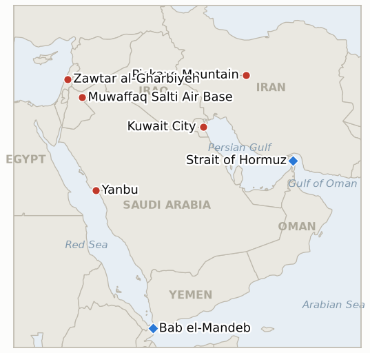

# Middle East Daily Briefing

**July 23, 2026**

- **Reporting window:** ~24 hours, July 22, 06:00 to July 23, 06:00 KST
- **Overall assessment:** Day twelve ran two clocks at once. The battlefield clock sped up: the US completed an eleventh consecutive strike night, hitting aircraft hangars and drone storage sites while withholding the grid and leadership for a twelfth day, Iran answered with another Nasr wave on US positions in the Gulf and Jordan, and the Houthis moved the Red Sea from declaration to loaded gun, deploying missiles and drones near Bab el-Mandeb with the Joint Maritime Information Center assessing them "ready to attack" as more Saudi cargoes turned back. Oil priced the acceleration: Brent settled $94.07, up 3.4% to a six week high after briefly topping $95, and the two chokepoint premium indicator opened yesterday took its first confirming settle. The off-ramp clock told the opposite story, and the day's new fact is that it is now ticking inside Washington as much as inside Tehran: Defense Secretary Hegseth told Congress the war has already cost $37.5 billion and asked for up to $70 billion more, drew bipartisan pushback and a CNN headline of "no answers on how it ends," and the Pentagon's casualty system put the cumulative toll at 18 American dead since February 28 and roughly 482 wounded, about 100 of them since July 7. Against that domestic bill Trump hardened rather than softened, dismissing near term negotiations and repeating that he will hit the Pickaxe Mountain nuclear linked site "pretty soon" even as Iran's interior minister Eskandar Momeni worked the Pakistan channel in Islamabad and the Qatar and Pakistan mediators kept the pre July 9 return proposal alive. Lebanon supplied the one unambiguous piece of good news: Prime Minister Nawaf Salam toured newly handed back Zawtar al-Gharbiyeh, calling it the "beginning of Israeli withdrawal," while officials set Friday's military talks to widen the pilot zone list toward Naqoura. Seoul held its divergence a second session, the KOSPI closing up 0.74% at 6,797.70 on record foreign buying of ₩2.6 trillion after touching 7,150 intraday, the won easing only to ₩1,480.1, still inside the sub 1,490 regime, even as the oil channel moved harder against Korea than on any prior day of the war.

---

## 1. What Happened

<figure style="float:right; width:46%; margin:2pt 0 8pt 14pt;">

<figcaption style="font-size:8pt; color:#666; text-align:center; margin-top:3pt; font-style:italic;">Major places of discussion</figcaption>
</figure>

### 1.1 The Eleventh Strike Night Stays Inside Its Classes as Iran Keeps Hitting the Gulf and Jordan

The US completed its eleventh consecutive night of strikes on Iran early Wednesday, with CENTCOM naming aircraft hangars and drone storage sites among the targets and the campaign again withholding power generation, the national grid and leadership targets for a twelfth day ([Washington Post](https://www.washingtonpost.com/business/2026/07/21/iran-us-hormuz-strait-war-july-20-2026/92883244-84d8-11f1-9cec-0fb26676f07e_story.html), [NW Arkansas Democrat-Gazette](https://www.nwaonline.com/news/2026/jul/22/us-finishes-11th-night-of-strikes-against-iran/), [NPR](https://www.npr.org/2026/07/22/nx-s1-5902843/us-iran-updates), [Just Security](https://www.justsecurity.org/148692/early-edition-july-22-2026/)). Iran answered with a further Nasr wave against US positions in the Gulf and Jordan; Kuwait, Bahrain and Jordan again reported missile and drone activity, with Bahrain waking to sirens through the day, and no Iranian munition reached Israeli territory ([NPR](https://www.npr.org/2026/07/22/nx-s1-5902843/us-iran-updates), [Times of Israel](https://www.timesofisrael.com/kuwait-says-iran-hit-power-and-water-plants-as-tehran-steps-up-attacks-across-region/)). The exchange held the calibrated shape now standard to the campaign: high tempo, wide geography, but no new target class on either side. **Confidence: High** on the eleventh wave and the target classes (CENTCOM statements, multi outlet); **Medium** on the composition of Iran's specific July 22 wave (state media framing, few independent battle damage confirmations).

### 1.2 The War's Bill Reaches Congress as Trump Cools on the Truce

The war's cost surfaced as a domestic political fact for the first time. Defense Secretary Pete Hegseth told Congress the conflict has already cost $37.5 billion and requested up to $70 billion in emergency and modernization funding, drawing pushback from lawmakers of both parties and a CNN assessment headlined "a $37 billion price tag and no answers on how it ends" ([CNN live](https://www.cnn.com/2026/07/21/world/live-news/iran-war-trump), [CNN politics](https://www.cnn.com/2026/07/22/politics/iran-price-tag-no-answers-how-it-ends), [AOL/Reuters](https://www.aol.com/articles/huge-trump-iran-war-funding-193052715.html)). The Pentagon's Defense Casualty Analysis System, updated July 22, put the cumulative American toll at 18 killed since the war began February 28 and about 482 wounded, with roughly 100 injured since July 7 and 96% of those returned to duty; the two soldiers killed at Muwaffaq Salti on July 17 were named as 1st Lt. Tyler Feehan and Pvt. Isabella Gonzales, and remains believed to be the missing third service member were recovered at the base, identification pending ([Stars and Stripes](https://www.stripes.com/theaters/middle_east/2026-07-21/iran-casualty-system-updates-pentagon-22324452.html), [Washington Post](https://www.washingtonpost.com/world/2026/07/20/iran-retaliates-against-us-strikes-gas-returns-4-gallon/), [Time](https://time.com/article/2026/07/20/us-service-members-killed-wounded-iran-war-casualties/)). Against that bill Trump hardened rather than eased, dismissing near term negotiations, warning of broader action, and repeating that the US will strike the fortified Pickaxe Mountain nuclear linked site "pretty soon" ([Fox News](https://www.foxnews.com/live-news/iran-war-trump-israel-hormuz-oil-july-21-2026), [Just Security](https://www.justsecurity.org/148692/early-edition-july-22-2026/), [CNBC](https://www.cnbc.com/2026/07/21/us-iran-war-trump-hormuz-houthis.html)). **Confidence: High** on the funding request, the cost figure and the casualty tally (Hegseth testimony, Pentagon DCAS, multi outlet); **Medium-High** on the "cooling on talks" read (consistent reporting of Trump's remarks against continuing mediation).

### 1.3 Diplomacy Keeps Moving in Islamabad Even as Washington Hardens

The mediation track stayed alive on the ground even as its terms lost momentum in Washington. Iran's interior minister Eskandar Momeni held high level talks in Islamabad with Prime Minister Shehbaz Sharif and army chief Field Marshal Asim Munir, centered on Pakistan's mediation of the US Iran conflict and on reviving the Islamabad memorandum of understanding; Pakistan and Qatar reaffirmed their joint proposal that both sides return to their pre July 9 positions so stalled talks can resume ([Pakistan Today](https://www.pakistantoday.com.pk/2026/07/22/pm-army-chief-reaffirm-pakistans-mediation-role-as-iranian-minister-holds-key-talks), [Express Tribune](https://tribune.com.pk/story/2619315/iranian-interior-minister-iskandar-momeni-arrives-in-islamabad-amid-fresh-mideast-tensions), [Washington Times](https://www.washingtontimes.com/news/2026/jul/21/iranian-official-meets-mediators-pakistan-iran-us-keep-attacks/)). The gap between the two tracks is the story: mediators are advancing a concrete framework while the two principals keep striking nightly and Trump publicly discounts imminent talks, leaving the proposal live but unaccepted by either government ([The National](https://www.thenationalnews.com/news/mena/2026/07/21/mediators-seek-to-salvage-us-iran-ceasefire-with-10-day-truce-proposal/), [Axios](https://www.axios.com/2026/07/21/iran-war-ceasefire-proposal-trump-troops)). **Confidence: High** on Momeni's visit and the mediators' proposal (Pakistani government readouts, multi outlet); **Medium** on the balance of momentum (interpretation of competing signals).

### 1.4 The Houthi Embargo Becomes a Loaded Gun as Oil Settles at a Six Week High

The Houthi embargo on Saudi shipping moved from declaration toward enforcement without yet firing. The Joint Maritime Information Center said the Houthis have completed preparations and deployed missiles and drones to attack ships transiting the southern Red Sea near Bab el-Mandeb, and Bloomberg reported the group is "now ready to attack," as a growing number of vessels rerouted away from the strait; no vessel or port had been struck as of the window's close ([CNBC](https://www.cnbc.com/2026/07/22/houthis-red-sea-bab-el-mandeb-saudi-oil-iran.html), [Bloomberg](https://www.bloomberg.com/news/articles/2026-07-22/iran-backed-houthis-now-ready-attack-ships-naval-group), [Forbes](https://www.forbes.com/sites/zacharyfolk/2026/07/22/could-bab-al-mandeb-be-the-next-strait-of-hormuz-ships-begin-turning-around-in-red-sea/), [FDD](https://www.fdd.org/analysis/2026/07/22/houthis-announce-blockade-of-saudi-arabia-ships-reroute-to-avoid-bab-al-mandeb-strait/)). The stakes are large: Riyadh routes crude by pipeline to Yanbu, whose Red Sea exports through Bab el-Mandeb surged to about 3.5 million barrels per day in June, and Yanbu is the loading port for all fifteen of Korea's Hormuz workaround liftings. Oil priced both chokepoints at once: Brent settled $94.07, up 3.4% and briefly above $95, its highest since June 8, with WTI settling about $86.85, up roughly 3% ([Trading Economics Brent](https://tradingeconomics.com/commodity/brent-crude-oil), [Trading Economics WTI](https://tradingeconomics.com/commodity/crude-oil), [Rigzone](https://www.rigzone.com/news/wire/mounting_mideast_threats_deepen_oil_shipping_disruptions-22-jul-2026-184182-article/)). **Confidence: High** on the deployment assessment, the reroutes and the oil settle (JMIC, Bloomberg tracking, exchange settles); the embargo's enforcement capacity remains untested (IND-20260721-2), and no vessel has yet been attacked.

### 1.5 Lebanon's Prime Minister Tours the Handed Over Zone as the Framework Widens

Lebanese Prime Minister Nawaf Salam toured Zawtar al-Gharbiyeh, the first town returned to Lebanese army control under the pilot scheme, calling the handover the "beginning of Israeli withdrawal" and pressing for the framework to hold to schedule ([The National](https://www.thenationalnews.com/news/mena/2026/07/22/lebanese-pm-hails-beginning-of-israeli-withdrawal-from-country-in-visit-to-pilot-zone/), [Times of Israel](https://www.timesofisrael.com/us-says-lebanese-army-deploying-to-pilot-zones-including-one-idf-will-withdraw-from/)). Lebanese and Israeli military officials are set to meet virtually Friday under US sponsorship to finalize an expanded pilot zone list and a withdrawal timetable, following the latest Rome round; Lebanon is expected to propose zones covering Zawtar al-Sharqiyeh, Arnoun, Beaufort Castle, Kfar Tebnit and Yuhmor, plus an Israeli pullback from Al-Bayada toward Naqoura, while the army expands its southern deployment ([Arab News](https://www.arabnews.com/node/2651160/middle-east), [The National](https://www.thenationalnews.com/news/mena/2026/07/22/lebanese-pm-hails-beginning-of-israeli-withdrawal-from-country-in-visit-to-pilot-zone/)). **Confidence: High** on the PM's visit and the Friday meeting (Lebanese official statements, multi outlet); **Medium** on the specific expanded zone list (Lebanese proposal, not yet agreed at the table).

---

## 2. Deep Dive: Incentives and Motives

### 2.1 Why did the eleventh night hit hangars and drone storage rather than escalate?

Because the target list is now the message, and the message is deliberate restraint under a diplomatic window. Hangars and drone storage sit squarely inside the campaign's established classes: military, launch capacity, logistics. Choosing them on the eleventh night, with the grid and leadership again untouched and Trump simultaneously threatening Pickaxe Mountain, tells Tehran that Washington is holding its most escalatory rungs in reserve as bargaining chips rather than spending them. The pattern that IND-20260719-1 confirmed as doctrine on July 22 held for a twelfth day: two American deaths and a $37.5 billion bill have not bought a class break. This is not weakness, it is sequencing. The unstruck targets, the grid and the nuclear site, are worth more as threats over a negotiation than as craters, which is precisely why Trump narrates Pickaxe rather than executes it. The risk in the pattern is that a doctrine of calibrated tempo, sustained long enough, stops looking like restraint and starts looking like an open ended grind neither side can exit, which is the anxiety now surfacing in Congress (2.2).

### 2.2 What does a $37.5 billion bill and a $70 billion ask tell us about how the war ends?

It introduces the first hard domestic constraint the conflict has faced, and it cuts against the "calibrated grind can run indefinitely" read. For twelve days the war's cost has been borne by Gulf host states in struck utilities and by shippers in war risk premia; Hegseth's testimony moves a share of it onto the US budget and, with it, onto the congressional calendar. A $70 billion request that already draws bipartisan skepticism and a "no answers on how it ends" framing is the point at which an open ended air campaign acquires an internal clock: appropriations must be justified, and "we are on night eleven of an indefinite campaign" is a hard sell when the same hearing tallies 18 dead and roughly 482 wounded. The strategic implication is subtle. Trump's public hardening, dismissing talks, threatening Pickaxe, may be less a rejection of the off-ramp than a negotiating posture run for two audiences at once: Tehran, to keep the pressure maximal, and Congress, to argue the campaign is winning and worth funding. But the funding fight also hands Iran a reason to wait: if Washington's own legislature may throttle the war, Tehran's incentive to accept a truce on American terms weakens. The bill, in other words, can either accelerate an exit (Congress forces one) or entrench the stalemate (Iran waits Congress out), and which way it breaks is now a first order driver of duration, and therefore of the oil premium (IND-20260723-1).

### 2.3 Can diplomacy in Islamabad survive Washington's cooling?

It can persist, but it cannot conclude without one of the two principals moving, and the day's signals point away from that. Momeni's meetings with Sharif and Munir keep the Pakistan channel warm and give Tehran a venue to look constructive while under bombardment, which has value independent of any deal: it courts the mediators, splits the diplomatic optics from the battlefield, and keeps a face saving framework on the shelf. But the proposal's core, a mutual return to pre July 9 positions, requires Washington to stop striking and Iran to stop interdicting, and Trump spent the day discounting exactly that. The realistic function of the Islamabad track this week is therefore not to produce a ceasefire but to preserve the option of one, so that when the battlefield or the budget forces a pause, a pre negotiated structure already exists. That is why IND-20260717-1's "announced meeting" branch falsifies today without killing the off-ramp: the meeting did not come, but the machinery that would host it is being maintained, and IND-20260721-1 still carries the live truce test to July 27.

### 2.4 What changes when the Houthi embargo goes from threat to loaded gun?

The risk stops being probabilistic and becomes positional. Until this window the embargo worked entirely through deterrence, ships turning around on a declaration; the JMIC assessment that missiles and drones are now deployed and the group is "ready to attack" means the enforcement capability is physically in place, so the only remaining variable is the decision to fire. For the oil market that is a step change in the tail: a declared embargo enforced by reroutes prices as a freight and insurance premium, but a loaded launcher near Bab el-Mandeb prices as a supply disruption option that can be exercised in minutes, which is part of why Brent cleared $94 rather than holding the high $80s. For Korea the geography is unforgiving. The Yanbu corridor was engineered on the premise that the Red Sea was the safe artery around Hormuz; a loaded gun at its southern gate means both ends of Korea's alternative crude route, the Hormuz origin it was built to avoid and the Bab el-Mandeb transit it depends on, now sit inside armed envelopes. The corridor has not closed, but its risk has migrated from "conditional on a future decision" to "one order away," and the 16th Korean lifting is the live test of whether charterers will still load into it (IND-20260722-1).

### 2.5 Is the Lebanon framework becoming a program?

It is trying to, and Salam's visit is how a token is converted into a program in real time. A single verified withdrawal (Zawtar al-Gharbiyeh, confirmed July 22) proves the mechanism works once; a head of government standing in the returned town and naming it the "beginning" of a withdrawal, then scheduling a military meeting to fix the next zones, is the move that turns one data point into a committed sequence. The proposed expansion, Zawtar al-Sharqiyeh (where warning shots landed two days ago), Arnoun, Beaufort Castle, Kfar Tebnit, Yuhmor, and a pullback toward Naqoura, is deliberately incremental and verifiable, which is exactly the property that made the first handover credible. The relevance beyond Lebanon is that the Hormuz mediators are implicitly selling the same design, small reciprocal trades executed on schedule and surviving friction, so every additional Lebanese zone that transfers cleanly is a working demonstration that phased, verified de-escalation can hold in a live theater. The falsification risk is equally clear: if Friday's meeting slips again (it was postponed once at Washington's request) or the second zone stalls, the template loses the momentum that makes it persuasive (IND-20260723-2).

### 2.6 Why did Seoul diverge a second day even as oil moved harder against Korea?

Because the equity market is still trading the chip cycle and the currency is still trading rate differentials, and neither is yet trading the war except through oil. Wednesday's session was almost a caricature of the narrow channel thesis: the KOSPI ran to 7,150 intraday on foreign buying, then gave back most of it on profit taking ahead of Alphabet's earnings and on the rising oil bill, closing up just 0.74% at 6,797.70, while foreigners logged record net buying of ₩2.6 trillion and the won eased only 6.7 won to ₩1,480.1, still comfortably inside the sub 1,490 regime with no intervention. All three legs of IND-20260721-3 held again on day two: cumulative foreign flows strongly positive, won below ₩1,490 without intervention, and the index moving on chip and AI news rather than Gulf headlines. The honest asymmetry is that the one channel that does transmit, oil, moved against Korea more than on any prior day of the war: Brent at $94 with a loaded gun on the Red Sea is a materially worse term of trade than the $88 to $91 band of the prior week, and it feeds directly into the corridor test (IND-20260722-1), the premium test (IND-20260722-3) and, eventually, the import bill. Decoupled equities and a repricing energy bill can coexist for a long time, but only one of them shows up in the current account, and this window widened the gap between them.

---

## 3. Policy Implications for South Korea

Korea's structural exposure baselines are in `instructions/korea-exposure.md`; no constant was materially revised this window. Standing figures hold: ~70% of crude and ~36% of LNG through Hormuz; July–August crude secured at 110%+ and September at ~90% of prior year volumes (MOTIE, July 21); ~273 million barrel non Hormuz cushion; ~26 day reserve estimate; 15 Red Sea detour tankers loading at Yanbu; MOFA departure advisory in force. **Confidence: High** on the baselines (MOTIE/MOF on record). The oil move this window is the live change: Brent's $94.07 settle sits well above the high $80s base case the file's H2 import bill assumptions rest on, and if it holds it forces a revision (IND-20260722-3, IND-20260723-3 below).

**Implications by development:**

1. **The eleventh night and the calibrated exchange (1.1):** Twelve days of both sides sparing the grid and leadership is still the strongest evidence that neither capital wants the infrastructure or nuclear war that triggers Korea's genuine crisis scenarios (grid strikes coupling the Houthi Bab el-Mandeb trigger). For planning, the calibration remains a reason to treat the corridor and premium risks as elevated but bounded, not yet catastrophic. Watch the two withheld classes (grid via IND-20260718-1 to ~July 24, nuclear via IND-20260720-1 to ~July 27) as the tripwires that would break that read.
2. **The war's bill and Washington's cooling (1.2):** The funding fight is the first variable that could shorten the war from the American side, and duration is the single biggest driver of Korea's cumulative energy cost. A funded, open ended campaign means the $90+ premium becomes the base case for the rest of H2; a Congress that throttles or conditions the request raises off-ramp probability and argues for treating the current spike as a peak. Track the appropriations path directly (IND-20260723-1); it now matters to Korea's import bill as much as any battlefield event.
3. **Islamabad diplomacy (1.3):** The mediation machinery being preserved rather than concluded means Korea should keep the truce as a live but unpriced scenario. Any 48h+ strike halt or public acceptance (IND-20260721-1) is a lifting acceleration window, not normalization; plan for it without positioning for it, because the principals are further apart today than the mediators.
4. **The Red Sea loaded gun and $94 oil (1.4):** This is the window's most direct hit to Korea. The corridor's risk has migrated from conditional to imminent, and the practical actions from prior days harden: complete the charter party, war risk and SUMED capacity review, and get a MOTIE/KNOC read on whether the 16th Yanbu lifting loads on schedule (IND-20260722-1). At $94 Brent the strategic reserve release and the 110%/90% procurement buffers are working as designed, but they are cost buffers, not price buffers; the import bill is repricing now regardless of physical availability.
5. **Lebanon and Seoul's second divergence (1.5, 2.6):** Lebanon's widening template is the standing proof that phased verified de-escalation can hold, directly relevant to the Hormuz proposal's structure. Seoul's clean divergence on day two means policy capacity stays unspent, so the BOK's August decision (IND-20260717-3) can remain oil focused; the risk to monitor is not the equity index or the won but the oil pass through into H2 inflation.

**Testable indicators:**

1. **IND-20260723-1: Washington's war gets budgetary runway or hits a Congressional wall.** Metric: disposition of Hegseth's ~$70 billion emergency and modernization request (appropriations markups, floor votes, war powers or conditioning riders). Confirmation: Congress appropriates or continuing resolution funds the bulk of the request by ~August 22 with no binding constraint on the campaign — the war has runway for open ended continuation and Korea should hold a $90+ Brent base case for H2. Falsification: Congress blocks, materially conditions, or attaches a war powers or withdrawal rider, or forces a floor vote curtailing the funding, by ~August 22 — the first domestic constraint bites, off-ramp probability rises and the current premium should be treated as a peak rather than a plateau.
2. **IND-20260723-2: The Lebanon pilot scales to a program or stalls at one zone.** Metric: verified IDF withdrawal plus LAF deployment in a second pilot zone (Zawtar al-Sharqiyeh, Arnoun, Beaufort Castle, Kfar Tebnit, Yuhmor, or the Al-Bayada/Naqoura line), Lebanese and Israeli military statements plus independent confirmation. Confirmation: a second verified withdrawal by ~August 6 — phased de-escalation is a program, and the mediators' Hormuz template gains a live proof of concept. Falsification: no second verified withdrawal through ~August 6 (Friday's meeting slips again or the second zone stalls) — Zawtar was a one off gesture, not a mechanism.
3. **IND-20260723-3: The $94 breakout passes into Korea's macro base case or stays a headline.** Metric: an official Korean signal anchoring $90+ oil, a MOTIE or KNOC H2 import bill revision, a BOK statement citing the new oil level, or a KOSIS import price print. Confirmation: any such official anchoring by the BOK August meeting (~August 31) — the oil channel has moved from market print to macro assumption, and the current account and CPI pass through estimates should be re-run on $90+ (feeds IND-20260717-3). Falsification: authorities continue to treat the spike as transitory and leave import bill and rate guidance unchanged through ~August 31 — the premium is priced but not yet embedded.

Resolutions announced today: **IND-20260717-1 falsified** — no announced US Iran meeting and no second costly goodwill gesture materialized by the ~July 23 deadline; Trump instead dismissed near term negotiations, confirming the "they want to meet" claim as narrative management rather than a scheduled contact. The off-ramp itself is not dead: the Islamabad mediation surge is its functional successor and remains live under IND-20260721-1 (~July 27).

Open indicator status from the ledger: IND-20260714-4 (no weekly loading figure; freeze at day 12 — open), IND-20260715-1 (no fresh transit print; recovery branch dead, regime test toward ~July 28 — open), IND-20260715-2 (no named Gulf package — open), IND-20260715-3 (no new UAE corroboration — open), IND-20260715-4 (won ₩1,480.1, third sub 1,490 session this week without intervention; weekly close test tomorrow, Friday July 24 — open, trending falsification), IND-20260716-2 (no verified Bab el-Mandeb attack; Houthi launchers now deployed but the Tehran coordination condition stays unmet — open, deadline ~July 29), IND-20260717-2 (no laden Ras Laffan departures; freeze at day 12 — open, trending falsification at ~July 24), IND-20260717-3 (August BOK meeting — open), IND-20260718-1 (eleventh wave again spared generation and grid; falsification branch near resolution at ~July 24 — open), IND-20260720-1 (no nuclear facility strike; Trump's Pickaxe Mountain threat repeated but unexecuted — open, deadline ~July 27), IND-20260720-3 (no Iranian munition impact on Israeli territory, no Israeli strike wave, no verified Red Sea attack — open, deadline ~July 27), IND-20260721-1 (no acceptance by either government; mediation preserved in Islamabad, principals hardened — open, deadline ~July 27), IND-20260721-2 (no verified enforcement action; launchers deployed and "ready to attack" but no vessel struck — open, deadline ~July 27), IND-20260721-3 (day two met all three legs: foreigners +₩2.6tn cumulative positive, won ₩1,480.1 no intervention, KOSPI tracking chip/AI news — open, resolves at the July 23 close), IND-20260722-1 (no 16th lifting print; corridor risk migrated conditional to imminent — open, deadline ~July 29), IND-20260722-2 (Kuwait struck again but response stays protest posture; no GCC escalation — open, deadline ~August 4), IND-20260722-3 (first confirming settle: Brent $94.07 ≥ $92.50; need a second consecutive settle by ~July 28 — open, trending confirmation).

---

## 4. Watch List

- **The $70 billion funding fight.** Hegseth's request and the bipartisan pushback put the war on the congressional calendar; the first markups, floor statements or a war powers move are the signals to watch, and they now bear on Korea's oil premium as directly as any strike (IND-20260723-1). **Confidence: High** that the fight is joined; **Medium** on its speed.
- **The Red Sea's first hull.** JMIC says the launchers are deployed and the Houthis are "ready to attack"; the next escalation rung is an actual strike on a Saudi linked or Saudi bound vessel, which would flip IND-20260721-2 to confirmation and reprice Bab el-Mandeb as a live disruption, not a deterrent. Watch UKMTO and JMIC bulletins. **Confidence: Medium-High** that the threshold is tested within days.
- **The 16th Korean lifting at Yanbu.** Still the single most Korea relevant data point of the week (IND-20260722-1); with a loaded gun now at the corridor's southern gate, watch MOF/MOTIE announcements and Kpler fixtures for whether charterers load or divert. **Confidence: High** that the question is forced within days.
- **Brent's second settle.** One settle above $92.50 is in; a second consecutive settle by ~July 28 confirms the two chokepoint premium as the standing regime and shifts Korea's H2 import bill base case to $90+ (IND-20260722-3). A settle back below $89 on a truce headline is the falsification signature. **Confidence: Medium-High** on resolution within the window.
- **Seoul's Thursday close.** IND-20260721-3 resolves at today's July 23 session close; a Gulf headline day that outmoves chip news, or a foreign flow reversal, is the falsification signature after two clean days. **Confidence: High** on resolution on schedule.
- **Pickaxe Mountain.** Trump's repeated "pretty soon" keeps the most escalatory conventional target on a clock while the truce framework sits unaccepted; execution would confirm IND-20260720-1 and likely end the mediation round in the same night. Watch B-2 movements and IAEA statements. **Confidence: Low-Medium** on execution this week.
- **Friday's Lebanon military meeting.** The virtual US sponsored talks are meant to fix the expanded zone list and timetable; a second verified withdrawal would convert the pilot into a program (IND-20260723-2), while another postponement (it slipped once before) would stall it. **Confidence: Medium-High** on the meeting proceeding.
- **Qatar's LNG freeze at day 12.** IND-20260717-2 resolves ~July 24 with no laden Ras Laffan exit since July 11; a truce acceptance is now the only realistic path to a resumption inside the deadline, and the Q4 Korean procurement gap hardens. **Confidence: High** on the freeze continuing absent a truce.
- **The won's Friday close.** A second consecutive weekly close below ₩1,490 (IND-20260715-4) tomorrow would formally falsify the financial crisis channel; at ₩1,480.1 with strong foreign inflows, only a major escalation shock reverses it. **Confidence: Medium-High** on falsification Friday.
- **Gaza attrition.** The post truce toll continues to climb with negligible diplomatic bandwidth while Iran, the Red Sea and the funding fight dominate; watch for any incident large enough to reclaim attention. **Confidence: Medium.**

---

## 5. Source Quality Summary

| Claim | Sources | Confidence |
|---|---|---|
| Eleventh consecutive US strike night; aircraft hangars, drone storage among targets; grid and leadership again withheld | CENTCOM statements; Washington Post, NW Arkansas Democrat-Gazette, NPR, Just Security | High |
| Iran answered with a further Nasr wave on US positions in the Gulf and Jordan; no munition on Israeli territory | Iranian state media; NPR, Times of Israel | Medium (specific July 22 wave composition) |
| Hegseth: war has cost $37.5bn; requested up to $70bn; bipartisan pushback | Hegseth congressional testimony; CNN, AOL/Reuters | High |
| Pentagon DCAS: 18 US killed since Feb 28, ~482 wounded, ~100 injured since July 7 (96% returned to duty) | Pentagon Defense Casualty Analysis System; Stars and Stripes, Washington Post, Time | High |
| Muwaffaq Salti dead named (Feehan, Gonzales); third MIA remains recovered at base, ID pending | Pentagon; Stars and Stripes, Al Jazeera | High |
| Trump dismisses near term talks, warns of broader action, repeats Pickaxe Mountain "pretty soon" | On record remarks; Fox News, CNBC, Just Security | Medium-High |
| Momeni meets Sharif and Munir in Islamabad; Pakistan/Qatar pre July 9 return proposal reaffirmed | Pakistani government readouts; Pakistan Today, Express Tribune, Washington Times | High |
| Mediation proposal live but unaccepted by either government; principals continue nightly strikes | The National, Axios, Washington Times | Medium |
| JMIC: Houthis deployed missiles and drones near Bab el-Mandeb, "ready to attack"; more Saudi cargoes reroute; no vessel struck | JMIC assessment; CNBC, Bloomberg, Forbes, FDD | High |
| Yanbu Red Sea exports ~3.5m bpd in June; loading port for all 15 Korean workaround liftings | CNBC/press; korea-exposure.md | Medium-High |
| Brent settled $94.07 (+3.4%, briefly >$95, highest since June 8); WTI ~$86.85 (+3%) | Exchange settles; Trading Economics, Rigzone | High |
| PM Salam tours Zawtar al-Gharbiyeh, calls it "beginning of Israeli withdrawal"; Friday military talks set; expanded zone list toward Naqoura | Lebanese official statements; The National, Arab News, Times of Israel | High (visit/meeting); Medium (proposed zone list) |
| KOSPI 6,797.70 close (+0.74%), intraday 7,150; foreigners record net +₩2.6tn; won ₩1,480.1 close (+6.7), no intervention | KRX data; Seoul Economic Daily, Businesskorea, Bloomberg | High |

_Generated 2026-07-23 (KST) from web research across 30+ outlets (US, Qatari, Pakistani, Israeli, Iranian state, Emirati, Saudi, Kuwaiti, Lebanese, Korean, European, specialist maritime and energy press)._
