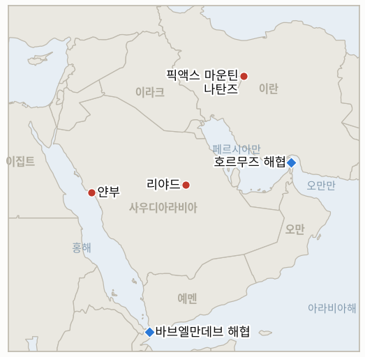

# 중동 일일 브리핑

**2026년 7월 24일**

- **보고 기간:** 약 24시간, 7월 23일 06:00 ~ 7월 24일 06:00 (한국시간)
- **종합 평가:** 개전 13일째는 장전된 총이 발사된 날이다. 후티는 홍해를 위협에서 공격으로 옮겨 사우디 유조선 두 척, 석유제품 운반선 엔셀리아호와 후티가 라일라호라 지칭한 선박을 바브엘만데브 해협으로 접근하는 항로에서 타격했다. 엔셀리아호는 7월 20일 얀부에서 선적한 배로, 얀부는 한국의 호르무즈 우회 선적 15척 전부를 실어 나르는 바로 그 항구다. 엔셀리아호는 발사체에 맞아 화재가 났으나 선원 전원은 안전한 것으로 보고됐다. 유가는 이 집행을 단번에 반영했다. 브렌트유는 6% 넘게 급등해 5월 이후 처음으로 배럴당 100달러를 돌파했고 101달러 부근에서 거래돼 전쟁 이래 최고치를 기록했다. 이 공격은 이번 주의 미해결 질문 세 개를 동시에 전환한다. 금수 조치가 선언이 아니라 실제 작동 중임을 확증하고, 두 초크포인트 프리미엄을 구조적 국면으로 확정하는 둘째 연속 종가를 제공하며, 한국의 유일한 원유 우회로 남쪽 관문에 실탄 사격장을 갖다 놓았다. 워싱턴은 두 갈래로 응수했다. 군사적으로는 이란의 상선 위협 능력을 "추가로 약화"하려는 노력으로 재규정된 12번째 연속 공습의 밤으로, 외교적으로는 이 지역의 더 긴 궤적을 다시 그리는 수로 응했다. 트럼프는 30년 기한의 미·사우디 민간 원자력 협력 협정에 서명하고 그 안에서 우라늄 농축을 금지시킨 뒤, 하루 만에 이 협정 전체가 "사우디아라비아의 아브라함 협정 가입에 전적으로 달려 있다"고 선언했으며 네타냐후는 이를 역사적 진전이라며 환영했다. 픽액스 마운틴은 트럼프가 곧 온다고 반복하는 와중에도 13일째 공격이 아닌 위협에 머물렀다. 이 모든 것을 마주하고 서울은 무너지는 대신 정반대로 움직였다. 코스피는 반도체 수출이 이끈 2분기 성장률 서프라이즈와 반도체 정점 우려 완화 속에 외국인이 약 2조 원을 순매수하며 4.40% 오른 7,096.89로 다섯 거래일 만에 7,000선을 회복했고, 원-달러 환율은 1,466.8원으로 5월 8일 이후 가장 강했다. 결국 전쟁 이래 가장 깨끗한 유가·주가 탈동조화의 하루가 브렌트유가 100달러를 넘긴 바로 그날 찾아왔다.

---

## 1. 무슨 일이 있었나

<figure style="float:right; width:46%; margin:2pt 0 8pt 14pt;">

<figcaption style="font-size:8pt; color:#666; text-align:center; margin-top:3pt; font-style:italic;">주요 논의 지점</figcaption>
</figure>

### 1.1 후티 금수 조치가 발사되며 사우디 유조선 두 척이 얀부 앞바다에서 피격되다

사우디아라비아에 대한 후티 해상 금수 조치가 억지에서 집행으로 넘어갔다. 후티는 "봉쇄를 위반한" 사우디 유조선 두 척에 미사일·드론 공격을 가했다고 주장했고, 사우디 선적 석유제품 운반선 엔셀리아호는 7월 20일 얀부를 출항한 뒤 사우디 해안에서 약 70~130킬로미터 떨어진 바브엘만데브 접근 항로에서 발사체에 맞아 화재가 났으며, 교통총국(Transport General Authority)은 선원 전원의 안전을 확인했다. 후티가 라일라호라 지칭한 두 번째 선박에 대한 명중 주장은 보고 기간 종료 시점까지 독립적으로 확인되지 않았다 ([Al Jazeera](https://www.aljazeera.com/news/2026/7/22/yemens-houthis-claim-attack-on-two-saudi-oil-tankers), [CNBC](https://www.cnbc.com/2026/07/23/iran-war-us-trump-houthis-red-sea-oil.html), [Seatrade Maritime](https://www.seatrade-maritime.com/security/saudi-tanker-on-fire-after-houthi-strike-in-red-sea), [PortNews](https://en.portnews.ru/news/394582/)). 사우디아라비아는 사우디 국영통신(SPA)을 통해 이번 공격을 "상선과 선원의 안전을 보장하는 국제법과 협약의 위반"이라고 규탄했고, 트럼프는 공개적으로 테헤란에 책임을 돌리며 후티 공격을 두고 이란을 직접 위협했다 ([Foreign Policy](https://foreignpolicy.com/2026/07/23/houthi-rebels-saudi-arabia-shipping-red-sea-iran-war/), [Maritime Executive](https://maritime-executive.com/article/video-houthi-forces-claim-strikes-on-two-saudi-tankers)). 이는 금수 조치가 7월 20일 이후 위협만 하던 집행 행위이며, 정확히 한국이 의존하는 동맥 위에 떨어졌다. **신뢰도: 높음** — 엔셀리아호 피격, 얀부 출항, 사우디 규탄(SPA, 교통총국, 복수 매체); **신뢰도: 중간** — 라일라호로 지칭된 두 번째 유조선(후티 주장, 독립 미확인)과 구체적 거리.

### 1.2 브렌트유가 5월 이후 처음으로 100달러를 돌파하다

유가는 이 집행을 단일 세션에 반영했다. 브렌트유는 6% 넘게 급등해 5월 이후 처음으로 배럴당 100달러를 돌파하고 101달러 부근에서 거래돼 전쟁 이래 최고치를 기록했다. 첫 공격 보도가 들어오며 약 95달러까지 뛴 초기 반응은, 라일라호 주장과 회항 보도가 쌓이면서 하루 내내 이어진 추가 상승에 자리를 내줬다 ([The National](https://www.thenationalnews.com/business/energy/2026/07/23/oil-hits-100-for-the-first-time-since-may-after-houthi-attacks-on-saudi-ships-in-red-sea/), [OilPrice](https://oilprice.com/Energy/Oil-Prices/Oil-Prices-Climb-Toward-100-as-Red-Sea-Risks-Rise.html), [Cryptobriefing](https://cryptobriefing.com/saudi-tanker-attack-red-sea-crypto-impact/), [Bloomberg](https://www.bloomberg.com/news/articles/2026-07-22/latest-oil-market-news-and-analysis-for-july-23)). 이 움직임은 두 초크포인트 프리미엄 지표가 시험하던 92.50달러 선 위의 둘째 연속 종가를 제공했고, 골드만삭스는 교란이 지속되면 4분기 120달러 경로를 경고한 것으로 인용됐다 ([The National](https://www.thenationalnews.com/business/energy/2026/07/23/oil-rises-above-96-per-barrel-after-houthi-attacks-on-saudi-ships-in-red-sea/), [Bloomberg](https://www.bloomberg.com/news/articles/2026-07-22/iran-backed-houthis-now-ready-attack-ships-naval-group)). **신뢰도: 높음** — 100달러 돌파와 움직임의 방향(복수 매체, 거래소 호가); **신뢰도: 중간** — 정확한 종가 수준(초기 약 95달러 종가에서 후반 약 101.10달러까지 매체별로 상이)과 "5월 이후 처음" 비교(단일 매체 프레이밍).

### 1.3 워싱턴이 서명한 사우디 민간 원자력 협정을 아브라함 협정 가입에 연계하다

미국은 수요일 사우디아라비아와 30년 기한의 민간 원자력 협력 협정에 공식 서명했다. 크리스 라이트 에너지장관과 압둘아지즈 빈 살만 사우디 에너지장관이 서명한 이 협정에는 미국 기업이 참여하며, 행정부에 따르면 사우디 영토 내 우라늄 농축은 금지된다 ([WSET/Sinclair](https://wset.com/news/nation-world/trump-announces-civil-nuclear-deal-with-saudi-arabia-if-country-joins-abraham-accords-energy-department-palestine-israel-benjamin-netanyahu), [Axios](https://www.axios.com/2026/07/23/url-slug-trump-saudi-nuclear-deal-enrichment-israel)). 서명 하루 뒤 트럼프는 이 협정이 "승인될 것"이지만 "사우디아라비아가 매우 존경받고 성공적인 아브라함 협정에 가입하는 데 전적으로 달려 있다"고 적어, 이미 문서화된 협정에 이스라엘과의 관계 정상화를 조건으로 붙였다. 네타냐후 총리실은 사우디의 가입을 "중동 평화를 향한 역사적 도약"이라 불렀다 ([CNN](https://www.cnn.com/2026/07/23/politics/saudi-arabia-nuclear-deal-trump), [NPR](https://www.npr.org/2026/07/23/nx-s1-5904327/us-saudi-arabia-iran), [Fortune](https://fortune.com/2026/07/23/trump-saudi-nuclear-deal-abraham-accords-condition/)). 이 수는 이 지역의 가장 큰 구조적 상품인 사우디·이스라엘 관계 정상화를 진행 중인 전쟁 한복판에, 그리고 지금 리야드가 움직이는 국내적 비용을 높이는 알아크사 긴장과 가자 사망자 증가를 배경으로 던져 넣었다. **신뢰도: 높음** — 서명, 농축 금지 조항, 추가된 조건(에너지부, 트럼프 본인 게시물, 복수 매체); **신뢰도: 중간** — 이 조건이 협상 지렛대가 아니라 얼마나 구속력을 갖는지.

### 1.4 12번째 공습의 밤이 해운 보호로 재규정되고 픽액스 마운틴은 여전히 시한 위에 있다

미국은 이란에 대한 12번째 연속 공습의 밤을 수행했고, 군은 이 작전을 이란의 역내 상선 위협 능력을 "추가로 약화"하려는 것으로 규정해 처음으로 공중 작전을 유조선 전쟁에 명시적으로 연결했다 ([CNBC](https://www.cnbc.com/2026/07/23/iran-war-us-trump-houthis-red-sea-oil.html), [Times of Israel](https://www.timesofisrael.com/trump-claims-us-will-strike-irans-pickaxe-mountain-probably-pretty-soon/)). 이스라엘 정보 평가가 이제 고성능 원심분리기를 보관하고 있을 수 있다고 보는 나탄즈 인근 요새화 시설 픽액스 마운틴은, 트럼프가 미국이 "곧" 그리고 "매우 강하게" 타격할 것이라 반복하고 이란이 워싱턴이 이 시설을 더 넓은 공격의 구실로 쓴다고 비난하는 와중에도 13일째 표적이 아닌 위협에 머물렀다 ([Xinhua](https://english.news.cn/20260723/f04f332307b84a7a9073b59e21355609/c.html), [ABC News](https://abcnews.com/Politics/pickaxe-mountain-trump-us-hit-iranian-nuclear-site/story?id=134957036), [Al Jazeera](https://www.aljazeera.com/news/2026/7/14/what-is-irans-pickaxe-mountain-the-mystery-site-trump-warns-hell-attack)). 이날 밤도 이 작전의 절제된 형태를 유지했다. 넓은 템포, 새로운 표적 유형 없음, 전력망과 핵 시설은 다시 제외. **신뢰도: 높음** — 12번째 공습과 해운 보호 명분(미군 발표, 복수 매체); **신뢰도: 중간** — 원심분리기 이전 주장(언론을 거친 이스라엘 정보 평가).

### 1.5 서울의 탈동조화가 셋째 날로 확대되고 원화는 두 달 만의 최고치를 찍다

한국 시장은 유가 충격에서 물러나는 대신 그 안으로 강하게 반등했다. 코스피는 반도체 수출이 이끈 예상 상회 2분기 성장률과 반도체 정점 우려 완화 속에 외국인이 약 2조 원을 순매수하며 4.40% 오른 7,096.89에 마감해, 다섯 거래일 만에 처음으로 7,000선을 회복했다 ([Seoul Economic Daily](https://en.sedaily.com/finance/2026/07/23/kospi-closes-up-440-percent-at-709689-gaining-29919-points), [Asia Business Daily](https://www.asiae.co.kr/en/article/market-overview/2026072315340902969)). 원화는 같은 성장 지표에 힘입어 달러 대비 1,466.8원으로 13.3원 오르며 5월 8일 이후 가장 강했다 ([Korea Times](https://www.koreatimes.co.kr/economy/20260723/korean-won-advances-on-better-than-expected-q2-growth)). 이 세션은 전쟁 이래 가장 깨끗한 유가·주가 탈동조화이며, 브렌트유가 100달러를 넘긴 바로 그날 찾아와 7월 21일 개설된 3세션 탈동조화 검증을 해소한다. **신뢰도: 높음** — 코스피·원화 종가와 성장 동력(한국거래소 데이터, Korea Times, Seoul Economic Daily); **신뢰도: 중간** — 지속적 100달러 국면에서 탈동조화의 지속성.

---

## 2. 심층 분석: 유인과 동기

### 2.1 후티는 왜 지금, 그리고 왜 얀부에서 나온 유조선을 겨냥해 발사했나?

집행이 없는 선언된 금수 조치는 허세로 부패하고, 표적은 최소 비용으로 신호를 극대화하도록 선택됐기 때문이다. 후티는 7월 20일 사우디 금수 조치를 선언했고, 7월 22일 위협만으로 얀부 선적 두 건을 회항시켰으며, 바브엘만데브 인근에 발사대를 배치했으므로, 이제 이 수단 전체의 신뢰성은 입증된 공격에 달려 있었다. 무작위 선체가 아니라 얀부에서 선적한 유조선을 때린 것은 요점을 정확히 찍는다. 후티는 리야드가 호르무즈 우회를 위해 지은 바로 그 수출 노드에 도달할 수 있으며, 사우디가 쉽게 방어할 수 없는 홍해 항로에서 그렇게 할 수 있다. 침몰과 인명 피해가 아니라 화재와 안전한 선원을 택한 것 역시 절제된 것으로, 결정적 사우디·미국 지상 대응을 강제할 대량 인명 사태에는 못 미치는 도달 시위다. 이란 연계 행위자에게 이 공격은 테헤란 자신의 수출이 이미 동결된 시점에 전쟁 비용을 세계 유가로 외부화하는 것이므로, 그 교란은 거의 순수한 상방이다.

### 2.2 유가는 왜 마침내 100달러를 뚫었고, 그 프리미엄은 이제 구조적인가?

시장이 그동안 집행될 수도 있는 금수 조치를 가격에 반영해 왔는데, 이번 공격이 확률을 사실로 바꿨기 때문이다. 지난주 내내 브렌트유는 전쟁 리스크와 첫 쿠웨이트 유조선 피격에 힘입어 70달러대 후반에서 90달러대 중반으로 올랐지만, 홍해 프리미엄은 후티 위협이 실재하는지에 일부 조건부로 머물렀다. 엔셀리아호 피격이 그 조건을 제거했고, 가격은 진짜로 다투어지는 둘째 초크포인트가 요구하는 수준으로 갭 상승했다. 구조적 질문은 이제 시장 측면에서 대체로 답이 나왔다. 92.50달러를 넘는 둘째 연속 종가, 그것도 100달러를 넘는 종가는 두 초크포인트 프리미엄 지표가 사건성 급등이 아니라 상시 국면으로 정의한 신호다. 남은 것은 지속 기간이며, 그것은 시장 변수가 아닌 두 지렛대, 즉 이 작전이 얼마나 오래 갈지를 결정하는 미국 예산 다툼과 그것을 멈출 수 있는 중재 트랙을 지난다. 그래서 가격은 세 자릿수에서도 신뢰할 만한 휴전 헤드라인에 왕복할 수 있다.

### 2.3 트럼프는 왜 사우디 원자력 협정에 서명하고 하루 뒤 아브라함 협정 조건을 붙였나?

그 순서가 곧 지렛대이기 때문이다. 먼저 서명하는 것은 성과를 확보하고 리야드의 상대방들을 묶으며, 나중에 조건을 붙이는 것은 비용이 들지 않으면서 양자 에너지 협정을 이 지역 최대의 미실현 상품에 대한 지렛대로 바꾼다. 민간 원자력 협정은 사우디아라비아가 수년간 원해 온 것, 즉 이스라엘과 비확산 반대를 답하는 방식으로 농축 문을 닫은 미국의 제재 예외 원자력 협력을 준다. 따라서 워싱턴은 이란에 핵 경로를 주는 것처럼 보이지 않으면서 그것을 관계 정상화에 인질로 잡을 수 있다. 트럼프에게 이 수는 네타냐후를 만족시키고 진행 중인 전쟁을 평화 서사로 재구성하며 책임을 리야드에 지운다. 구속은 반대 방향으로 작동한다. 무함마드 빈 살만은 가자 사망자가 오르고 알아크사 긴장이 타오르며 사우디 유조선이 홍해에서 불타는 동안 이스라엘과 관계를 정상화하는 것으로 비칠 수 없다. 그래서 이 조건은 근시일 합의라기보다 더 잔잔한 순간을 위해 박아 둔 표지일 수 있으며, 이는 시장과 한국의 기획자가 함께 안고 가야 할 모호함이다.

### 2.4 왜 12번째 밤을 해운 보호로 규정하고, 픽액스 마운틴을 공격이 아닌 위협으로 유지하나?

그 프레이밍이 공세적 작전에 방어적 명분을 제조하고, 유보된 표적은 위협으로 더 값지기 때문이다. 공습을 이란의 상선 위협 능력 약화로 재규정하는 것은 사우디 유조선이 불타는 바로 그 순간에 나이트 폭격을 항행의 자유라는 세계적으로 공감받는 명분에 묶는데, 이는 의회에서 예산 다툼이 열리는 시점에 "출구 없는 전쟁의 12번째 밤"보다 정치적으로 싸다. 픽액스 마운틴을 13일째 미타격으로 두는 것은 이 작전이 내내 따라온 논리와 같다. 전력망과 핵 시설은 소진되는 것이 아니라 가용한 상태로 남을 때 가치가 있는 두 단계이므로, 트럼프는 실행하지 않는 타격을 서술한다. 실행하면 같은 밤 중재 라운드가 끝나고 가장 강한 카드가 사라질 것이므로, 그 위협은 정확히 사용되지 않기 때문에 반복된다.

### 2.5 유가 충격이 심화되는데도 왜 서울은 더 강하게 탈동조화하나?

이번 주 한국 시장을 움직이는 변수가 전쟁이 아니라 반도체 사이클이며, 이 세션이 그것을 최대 스트레스 아래서 입증했기 때문이다. 반도체 수출이 이끈 2분기 성장률 서프라이즈는 코스피와 원화에 걸프와 직교하는 국내적 상승 이유를 줬고, 외국인은 한국 주식을 위협받는 원유 수입국이 아니라 경기순환형 반도체 플레이로 다뤘다. 원화가 브렌트유가 100달러를 넘긴 바로 그날 두 달 만의 최고치를 찍은 것은 거의 통제된 실험에 가깝다. 금융 전달 경로가 전쟁을 통해 흘렀다면 그것이 드러날 날이 바로 이날이었는데, 드러나지 않았다. 경제학자를 위한 단서는 탈동조화가 주식·통화 경로에 관한 진술이지 실물경제에 관한 것이 아니라는 점이다. 수입 비용은 코스피가 어디서 거래되든 실시간으로 재가격되고 있으며, 하반기 물가로의 유가 전가는 살아남는 전달이다. 그래서 정책 질문은 원화에서 한국은행의 8월 반응함수로 이동한다.

---

## 3. 한국에 대한 정책적 함의

한국의 구조적 익스포저 기준선은 `instructions/korea-exposure.md`에 있으며, 이번 기간 중 실질적으로 개정된 상수는 없다. 표준 수치는 유지된다. 원유의 약 70%와 LNG의 약 36%가 호르무즈 경유; 7~8월 원유는 전년 대비 110%+, 9월은 약 90% 확보(산업통상자원부, 7월 21일); 비호르무즈 완충 약 2억 7,300만 배럴; 약 26일 비축 추정; 얀부에서 선적하는 홍해 우회 유조선 15척; 외교부 출국 권고 발효 중. **신뢰도: 높음** — 기준선(산업통상자원부·기획재정부 공식). 이번 기간의 실질적 변화는 유가 경로가 이탈했고 우회로가 첫 타격을 받았다는 점이다. 100달러를 넘는 브렌트유는 이 파일의 하반기 수입 비용이 기반한 80달러대 후반 기본 시나리오를 넘어서고, 엔셀리아호 피격은 얀부 경로를 위협이 아니라 실사격 아래 놓는다.

**사안별 함의:**

1. **금수 조치의 발사와 얀부 우회로 피격(1.1):** 이번 기간 한국에 가장 직접적인 타격이다. 얀부에서 선적한 선체를 때린 것은 후티가 한국 호르무즈 우회로의 바로 그 노드에 도달할 수 있음을 입증하며, 16번째 한국 선적 문제(IND-20260722-1)는 이제 위협이 아니라 실사격 아래의 결정이다. 실무 조치는 검토에서 실행으로 굳는다. 다음 한국 용선이 선적하는지 회항하는지 확인하고, 수에즈 우회를 위한 전쟁위험 보험료와 SUMED 용량을 산정하며, 우회로가 닫힐 경우 약 2억 7,300만 배럴 비호르무즈 완충을 구속 제약으로 다뤄야 한다. 전략비축유와 110%/90% 조달 완충은 물리적 가용성을 덮지만 가격은 덮지 못한다.
2. **100달러를 넘는 브렌트유(1.2):** 프리미엄은 이제 시장 측면에서 구조적이며, 하반기 나머지 기본 시나리오는 80달러대 후반이 아니라 100달러로 옮겨야 하고, 골드만삭스의 4분기 120달러 경로가 스트레스할 확전 시나리오다. 지속 기간을 결정하는 질문은 유가 시장이 아니라 워싱턴의 예산 다툼(IND-20260723-1)과 중재 트랙(IND-20260721-1)에 있다. 한국은 그 두 지렛대의 왕복을 주시하면서 100달러 기본 시나리오를 유지해야 한다.
3. **사우디 원자력 협정과 그 조건(1.3):** 관계 정상화는 근시일 가격 변수가 아니라 느린 구조적 변수지만, 미국 기업과 정확히 이런 30년 걸프 원자력·인프라 프로그램을 두고 직접 경쟁하는 한국의 건설·방산·원자력 공급망에는 중요하다. 리야드가 아브라함 협정으로 움직이는지 아니면 조건을 방치하는지 주시해야 한다(IND-20260724-1). 어느 쪽이든 미·사우디 원자력 템플릿은 이제 한국 입찰자가 견주어지는 기준선이다.
4. **12번째 밤과 픽액스 마운틴(1.4):** 전력망과 핵 시설이 13일째 제외된 것은 어느 수도도 한국의 진짜 위기 시나리오를 촉발하는 기반시설·핵 전쟁을 원치 않는다는 가장 강한 증거로 남는다. 공습의 해운 명분은 새로우며 주시할 가치가 있다. 공중 작전을 유조선 전쟁에 묶어 추가 홍해 타격이 더 무거운 미국 대응을 부를 확률을 높이기 때문이다. 픽액스 실행(IND-20260720-1)은 여전히 발화선이다.
5. **서울의 세 번째 탈동조화(1.5):** 깨끗한 탈동조화는 한국의 정책 여력이 소진되지 않고 금융 위기 경로가 닫힌 채 유지됨을 뜻하므로, 한국은행의 8월 결정(IND-20260717-3)은 방어적이기보다 유가 중심으로 남을 수 있다. 주시할 리스크는 지수나 원화가 아니라 이제 100달러 위에 고정되고 IND-20260723-3로 공식 지침에 추적되는 하반기 물가로의 유가 전가다.

**검증 가능한 지표:**

1. **IND-20260724-1: 사우디 정상화 도박이 움직이는가 방치되는가.** 지표: 아브라함 협정 조건에 대한 사우디 공식 대응 — 구체적 정상화 조치(이스라엘 관계 발표, 무함마드 빈 살만의 공개 수용, 정상화 로드맵) 대 팔레스타인 국가 수립 조건화 또는 거부. 확증: ~8월 24일까지 사우디의 정상화 방향 조치나 조건 공개 수용은 원자력·정상화 교환이 살아 있고 한국 기업이 입찰하는 걸프 재편이 가속됨을 시사한다. 반증: 리야드가 협정을 팔레스타인 국가 수립에 조건화하거나 답하지 않고 두거나 ~8월 24일까지 연계를 거부하면, 그 조건은 잔잔한 순간을 위한 표지이고 원자력 협정은 사실상 동결된다.
2. **IND-20260724-2: 홍해 공격이 캠페인인가 일회성인가.** 지표: 엔셀리아호 이후 홍해나 바브엘만데브에서 사우디 연계 또는 사우디 항구 목적지 선박에 대한 UKMTO/JMIC 확인 추가 공격·승선·나포. 확증: ~8월 7일까지 최소 한 건의 추가 확인 공격은 지속적 차단을 입증하며 — 한국의 얀부 우회로가 지속 사격 아래 놓이고 수에즈 우회가 기본 시나리오가 된다(IND-20260722-1에 반영). 반증: ~8월 7일까지 추가 확인 공격이 없으면 엔셀리아호는 시위성 사격이었고, 우회로는 억지세 아래 사용 가능한 채로 남으며 용선사는 더 높은 전쟁위험 보험료로 선적을 이어간다.
3. **IND-20260724-3: 100달러 돌파가 유지되는가 왕복하는가.** 지표: 브렌트유 종가. 확증: ~8월 1일까지 98달러 이상 둘째 연속 종가는 세 자릿수 국면을 고착시키고 한국의 하반기 수입 비용과 경상수지를 100달러 기본 시나리오로 강제한다(IND-20260722-3 확대, IND-20260723-3에 반영). 반증: 휴전 헤드라인이나 억제된 홍해에 이 기간 내 92달러 아래로 종가가 되돌아가면 100달러 돌파는 고원이 아니라 급등으로 표시되고, 90달러대 후반이 작동 수준으로 유지된다.

오늘 발표된 해소: **IND-20260721-2 확증** — 후티 금수 조치는 얀부 앞바다 엔셀리아호에 대한 확인 공격으로 선언에서 집행으로 넘어갔고, 따라서 우회로는 범주적으로 재가격되며 16번째 한국 선적은 실사격 아래의 결정이 된다. **IND-20260721-3 확증** — 셋째 날 세 다리 모두 충족됐다. 외국인 약 2조 원 순매수(누적 강한 순매수), 원화 1,466.8원으로 1,490 훨씬 아래에서 개입 없이 오히려 강세, 코스피 4.40% 상승이 어떤 걸프 헤드라인이 아니라 2분기 성장과 반도체 사이클을 추종. 금융 전달 경로는 전쟁이 아니라 유가에 국한된다. **IND-20260722-3 확증** — 92.50달러를 넘는 둘째 연속 종가, 그것도 100달러를 넘는 종가는 두 초크포인트 프리미엄을 사건성 급등이 아니라 상시 시장 국면으로 표시한다. 한국의 하반기 수입 비용 기본 시나리오는 100달러로 이동한다.

원장 기준 미해결 지표 현황: IND-20260714-4(신규 주간 카타르 선적 수치 없음; 수출 동결 13일째 — 미해결), IND-20260715-1(신규 통항 수치 없음; ~7월 28일 국면 검증 — 미해결), IND-20260715-2(명명된 걸프 안보 패키지 없음 — 미해결), IND-20260715-3(신규 UAE 태세 확증 없음 — 미해결), IND-20260715-4(원화 1,466.8원, 넷째 1,490 미만 세션이자 강세; 오늘 금요일 7월 24일 세션이 주간 종가 검증, 내일 브리핑에서 해소 — 미해결, 반증 추세), IND-20260716-2(엔셀리아호가 바브엘만데브 접근로에서 피격됐으나 사우디 금수 트리거이지 테헤란 조율이 아님; 조율 조건 미충족 — 미해결, 기한 ~7월 29일), IND-20260717-2(적재 상태 라스라판 출항 없음; 동결 13일째 — 미해결, 반증 추세), IND-20260717-3(한국은행 8월 회의 — 미해결), IND-20260718-1(12번째 밤도 발전·전력망 제외 — 미해결, 반증 가지 근접), IND-20260720-1(핵 시설 타격 없음; 픽액스 마운틴 위협 반복됐으나 13일째 미실행 — 미해결, 기한 ~7월 27일), IND-20260720-3(이란 발사체의 이스라엘 영토 명중 없음, 이스라엘 공습 파상 없음 — 미해결, 기한 ~7월 27일), IND-20260721-1(휴전 수용 없음, 48시간+ 공습 중단 없음; 트럼프가 협상 대신 사우디 협정을 조건화 — 미해결, 기한 ~7월 27일), IND-20260722-1(16번째 선적 기록 없음; 우회로가 위협이 아니라 사격 아래 — 미해결, 기한 ~7월 29일), IND-20260722-2(GCC 확전 없음; 사우디가 쿠웨이트의 카이판호 때와 같이 항의 태세 안에서 엔셀리아호를 규탄 — 미해결, 기한 ~8월 4일), IND-20260723-1(~700억 달러 요청에 대한 예산 조치 아직 없음 — 미해결, 기한 ~8월 22일), IND-20260723-2(레바논 둘째 확인 철군 없음; 금요일 군사 회담 대기 — 미해결, 기한 ~8월 6일), IND-20260723-3(90달러+ 유가의 한국 공식 고정 아직 없음; 100달러 돌파가 전가 질문을 키움 — 미해결, 기한 ~8월 31일).

---

## 4. 관찰 목록

- **홍해의 다음 선체.** 엔셀리아호는 금수 조치를 집행으로 뒤집었다. 이제 질문은 며칠 안에 둘째 확인 공격이 뒤따라 시위성 사격이 아닌 지속적 차단을 확립하는지다(IND-20260724-2). UKMTO·JMIC 게시와 사우디 목적지 또는 한국 용선 선박이 다음이 되는지 주시. **신뢰도: 중상** — 이번 주 내 임계값 재검증.
- **얀부의 16번째 한국 선적.** 여전히 이번 주 가장 한국 관련성 높은 데이터 포인트이자 이제 실사격 아래의 결정이다(IND-20260722-1). 다음 한국 용선이 얀부에서 선적하는지 수에즈로 우회하는지 기획재정부·산업통상자원부 발표와 Kpler 픽스처를 주시. **신뢰도: 높음** — 며칠 안에 질문이 강제됨.
- **브렌트유의 100달러 유지.** 98달러 이상 둘째 종가는 세 자릿수 국면을 고착시키고 한국의 하반기 기본 시나리오를 100달러로 옮긴다(IND-20260724-3); 휴전 헤드라인에 92달러 아래로의 되돌림이 반증 신호. **신뢰도: 중상** — 기간 내 해소.
- **정상화에 대한 리야드의 답.** 사우디가 아브라함 협정으로 움직이는지 원자력 협정을 팔레스타인 국가 수립에 조건화하는지가 한국 기업이 입찰하는 걸프 재편의 궤적을 정한다(IND-20260724-1). SPA 성명과 무함마드 빈 살만 발언 주시. **신뢰도: 중하** — 가자·알아크사 배경을 감안할 때 수주 내 실질적 사우디 움직임.
- **픽액스 마운틴.** 트럼프의 반복되는 "곧"은 휴전 프레임워크가 미수용인 채로 가장 확전적인 재래식 표적을 시한 위에 둔다. 실행은 IND-20260720-1을 확증하고 같은 밤 중재 라운드를 끝낼 가능성이 크다. B-2 이동과 IAEA 성명 주시. **신뢰도: 중하** — 이번 주 실행.
- **700억 달러 예산 다툼.** 헤그세스의 요청과 여야 반발은 한국의 누적 에너지 비용을 좌우하는 단일 최대 변수인 전쟁 지속 기간을 의회 일정에 올렸다(IND-20260723-1). 첫 심사나 전쟁권한 관련 움직임이 신호. **신뢰도: 높음** — 다툼이 시작됨; **신뢰도: 중간** — 그 속도.
- **원화의 금요일 종가.** 오늘 7월 24일 세션에서 1,490 미만의 둘째 연속 주간 종가(IND-20260715-4)는 금융 위기 경로를 공식 반증한다. 강한 유입 속 1,466.8원에서는 대형 확전 충격만이 이를 되돌린다. **신뢰도: 높음** — 금요일 종가 반증.
- **카타르 LNG 동결 13일째.** 7월 11일 이후 적재 상태 라스라판 출항 없음(IND-20260717-2); 휴전 수용이 이제 기한 내 재개의 유일한 현실 경로이며 4분기 한국 조달 공백이 굳는다. **신뢰도: 높음** — 휴전 없이는 동결 지속.
- **알아크사와 가자.** 알아크사 대규모 정착민 진입 보도가 오르는 휴전 후 가자 사망자와 겹쳐 지금 리야드가 정상화하는 국내적 비용을 높이고 역내 주목을 되찾을 수 있다. 정상화 계산을 움직일 만큼 큰 사건 주시. **신뢰도: 중간.**

---

## 5. 출처 신뢰도 요약

| 주장 | 출처 | 신뢰도 |
|---|---|---|
| 후티가 "봉쇄 위반" 사우디 유조선 두 척 공격 주장; 엔셀리아호가 7월 20일 얀부 출항 후 발사체에 화재, 선원 안전 | 후티 주장; 교통총국; Al Jazeera, CNBC, Seatrade Maritime, PortNews | 높음(엔셀리아호); 중간(라일라호, 미확인) |
| 공격은 사우디 해안에서 약 70~130km 떨어진 바브엘만데브 접근로에서 발생 | 해운 전문 매체 | 중간 |
| 사우디가 SPA 통해 공격 규탄; 트럼프는 테헤란에 책임 돌리며 이란 직접 위협 | 사우디 국영통신(SPA); Foreign Policy, Maritime Executive | 높음 |
| 브렌트유 5월 이후 처음 100달러 돌파, 6%+ 급등해 101달러 부근(초기 약 95달러 종가, 이후 상승) | 거래소 호가; The National, OilPrice, Cryptobriefing, Bloomberg | 높음(돌파·방향); 중간(정확한 종가, "5월 이후") |
| 골드만삭스, 교란 지속 시 4분기 120달러 경로 경고 | Bloomberg, The National | 중간 |
| 미국이 30년 사우디 민간 원자력 협정 서명(라이트, 압둘아지즈 왕자), 농축 금지; 미국 기업 참여 | 에너지부; WSET/Sinclair, Axios | 높음 |
| 트럼프가 협정을 사우디의 아브라함 협정 가입에 조건화; 네타냐후 환영 | 트럼프 게시물; CNN, NPR, Fortune | 높음 |
| 12번째 연속 미국 공습의 밤을 이란의 상선 위협 능력 약화로 규정 | 미군 발표; CNBC, Times of Israel | 높음 |
| 픽액스 마운틴(나탄즈 인근) 13일째 미타격; 트럼프 "곧" 반복; 원심분리기 이전에 대한 이스라엘 평가 | 공개 발언; 언론을 거친 이스라엘 정보; Xinhua, ABC News, Al Jazeera | 높음(위협); 중간(원심분리기 주장) |
| 코스피 4.40% 상승 7,096.89로 7,000선 회복; 외국인 약 2조 원 순매수; 2분기 성장·반도체 동력 | 한국거래소 데이터; Seoul Economic Daily, Asia Business Daily | 높음 |
| 원화 1,466.8원 마감(+13.3), 5월 8일 이후 최강, 2분기 성장 서프라이즈 | 서울 외환 종가; Korea Times | 높음 |
| 알아크사 대규모 정착민 진입 보도 | 역내 매체 | 중하 |

_2026년 7월 24일(한국시간) 생성. 미국·카타르·사우디·이스라엘·이란 국영·예멘·한국·유럽 및 해양·에너지 전문 매체 웹 리서치 기반. 일부 주요 매체(Al Jazeera, CNN)는 자동 수집을 차단하며, 위 주장은 검색 인덱스를 통한 복수 매체 교차 확인에 기반한다._
