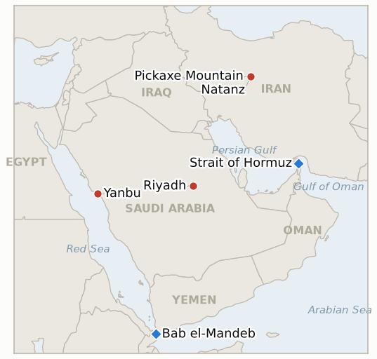

# Middle East Daily Briefing

**July 24, 2026**

- **Reporting window:** ~24 hours, July 23, 06:00 to July 24, 06:00 KST
- **Overall assessment:** Day thirteen is the day the loaded gun fired. The Houthis moved the Red Sea from threat to attack, striking two Saudi tankers, the product carrier Encelia and a vessel they named Layla, in the corridor approaching Bab el-Mandeb; Encelia had loaded at Yanbu on July 20, the exact port that carries all fifteen of Korea's Hormuz workaround liftings, and caught fire from a projectile with all crew reported safe. Oil priced the enforcement in a single leap: Brent surged more than six percent to cross $100 for the first time since May, trading near $101, its highest of the war. The strike converts three of the week's open questions at once, confirming that the embargo is operational rather than declaratory, delivering the second consecutive settle that marks the two chokepoint premium as structural, and putting a live shooting gallery at the southern gate of Korea's only crude workaround. Washington answered on two tracks: militarily with a twelfth consecutive strike night recast as an effort to "further degrade" Iran's ability to threaten commercial shipping, and diplomatically with a maneuver that reshapes the region's longer arc, as Trump signed a thirty year US Saudi civil nuclear cooperation agreement, barred uranium enrichment under it, and a day later declared the whole deal "totally subject to Saudi Arabia joining the Abraham Accords," which Netanyahu welcomed as a historic step. Pickaxe Mountain stayed a threat rather than a strike for a thirteenth day even as Trump repeated it is coming. Against all of it Seoul did the opposite of buckle: the KOSPI closed up 4.40% back above 7,000 at 7,096.89 on a second quarter growth beat and easing chip fears with foreigners net buying about ₩2 trillion, and the won strengthened to ₩1,466.8, its firmest since May 8, so the cleanest single day of oil equity decoupling in the war arrived on the same day Brent crossed $100.

---

## 1. What Happened

<figure style="float:right; width:46%; margin:2pt 0 8pt 14pt;">

<figcaption style="font-size:8pt; color:#666; text-align:center; margin-top:3pt; font-style:italic;">Major places of discussion</figcaption>
</figure>

### 1.1 The Houthi Embargo Fires as Two Saudi Tankers Are Struck off Yanbu

The Houthi maritime embargo on Saudi Arabia crossed from deterrence to enforcement. The group claimed missile and drone strikes on two Saudi tankers it said had "violated the blockade," and the Saudi flagged product carrier Encelia caught fire from a projectile after departing Yanbu on July 20, roughly 70 to 130 kilometers off the Saudi coast in the corridor approaching Bab el-Mandeb, with the Transport General Authority confirming all crew safe; a claimed second hit on a vessel the Houthis named Layla was not independently verified as of the window's close ([Al Jazeera](https://www.aljazeera.com/news/2026/7/22/yemens-houthis-claim-attack-on-two-saudi-oil-tankers), [CNBC](https://www.cnbc.com/2026/07/23/iran-war-us-trump-houthis-red-sea-oil.html), [Seatrade Maritime](https://www.seatrade-maritime.com/security/saudi-tanker-on-fire-after-houthi-strike-in-red-sea), [PortNews](https://en.portnews.ru/news/394582/)). Saudi Arabia condemned the attacks through the Saudi Press Agency as "a violation of international laws and conventions that guarantee the safety of commercial vessels and their crews," while Trump publicly blamed Tehran and threatened Iran directly over the Houthi strikes ([Foreign Policy](https://foreignpolicy.com/2026/07/23/houthi-rebels-saudi-arabia-shipping-red-sea-iran-war/), [Maritime Executive](https://maritime-executive.com/article/video-houthi-forces-claim-strikes-on-two-saudi-tankers)). This is the enforcement action the embargo had only threatened since July 20, and it lands on the precise artery Korea depends on. **Confidence: High** on the Encelia strike, its Yanbu origin and the Saudi condemnation (SPA, Transport General Authority, multi outlet); **Medium** on the claimed second tanker Layla (Houthi claim, not independently verified) and on the specific standoff distances.

### 1.2 Brent Crosses $100 for the First Time Since May

Oil repriced the enforcement in a single session. Brent surged more than six percent, crossing $100 a barrel for the first time since May and trading near $101, the highest level of the war, after an initial jump to roughly $95 as the first strike reports landed gave way to a further climb through the day as the Layla claim and reroute reports accumulated ([The National](https://www.thenationalnews.com/business/energy/2026/07/23/oil-hits-100-for-the-first-time-since-may-after-houthi-attacks-on-saudi-ships-in-red-sea/), [OilPrice](https://oilprice.com/Energy/Oil-Prices/Oil-Prices-Climb-Toward-100-as-Red-Sea-Risks-Rise.html), [Cryptobriefing](https://cryptobriefing.com/saudi-tanker-attack-red-sea-crypto-impact/), [Bloomberg](https://www.bloomberg.com/news/articles/2026-07-22/latest-oil-market-news-and-analysis-for-july-23)). The move delivers the second consecutive settle above the $92.50 line that the two chokepoint premium indicator was testing, and Goldman was cited flagging a path toward $120 by the fourth quarter if the disruption persists ([The National](https://www.thenationalnews.com/business/energy/2026/07/23/oil-rises-above-96-per-barrel-after-houthi-attacks-on-saudi-ships-in-red-sea/), [Bloomberg](https://www.bloomberg.com/news/articles/2026-07-22/iran-backed-houthis-now-ready-attack-ships-naval-group)). **Confidence: High** on the $100 crossing and the direction of the move (multi outlet, exchange quotes); **Medium** on the precise closing level, which sources put anywhere from a ~$95 initial settle to ~$101.10 late, and on the "first time since May" comparison (single outlet framing).

### 1.3 Washington Conditions the Signed Saudi Civil Nuclear Deal on the Abraham Accords

The United States formally signed a thirty year civil nuclear cooperation agreement with Saudi Arabia on Wednesday, with Energy Secretary Chris Wright and Saudi Energy Minister Prince Abdulaziz bin Salman putting names to a deal that involves US firms and, per the administration, bars uranium enrichment on Saudi soil ([WSET/Sinclair](https://wset.com/news/nation-world/trump-announces-civil-nuclear-deal-with-saudi-arabia-if-country-joins-abraham-accords-energy-department-palestine-israel-benjamin-netanyahu), [Axios](https://www.axios.com/2026/07/23/url-slug-trump-saudi-nuclear-deal-enrichment-israel)). A day after signing, Trump wrote that the deal "will be approved" but is "totally subject to Saudi Arabia joining the very respected and successful Abraham Accords," attaching Israeli normalization as a condition to an agreement already on paper; Netanyahu's office called Saudi accession "a historic leap forward for peace in the Middle East" ([CNN](https://www.cnn.com/2026/07/23/politics/saudi-arabia-nuclear-deal-trump), [NPR](https://www.npr.org/2026/07/23/nx-s1-5904327/us-saudi-arabia-iran), [Fortune](https://fortune.com/2026/07/23/trump-saudi-nuclear-deal-abraham-accords-condition/)). The move injects the region's biggest structural prize, Saudi Israeli normalization, into the middle of an active war and against a backdrop of Al Aqsa tensions and a rising Gaza toll that raise the domestic cost to Riyadh of moving now. **Confidence: High** on the signing, the no enrichment provision and the added condition (Energy Department, Trump's own post, multi outlet); **Medium** on how binding the condition proves versus negotiating leverage.

### 1.4 A Twelfth Strike Night Is Recast as Protecting Shipping While Pickaxe Mountain Stays on the Clock

The US carried out a twelfth consecutive night of strikes on Iran, with the military framing the campaign as meant to "further degrade" Iran's ability to threaten commercial vessels in regional waters, explicitly tying the air campaign to the tanker war for the first time ([CNBC](https://www.cnbc.com/2026/07/23/iran-war-us-trump-houthis-red-sea-oil.html), [Times of Israel](https://www.timesofisrael.com/trump-claims-us-will-strike-irans-pickaxe-mountain-probably-pretty-soon/)). Pickaxe Mountain, the fortified site near Natanz that Israeli intelligence assessments say may now hold advanced centrifuges, stayed a threat rather than a target for a thirteenth day even as Trump repeated the US will hit it "probably pretty soon" and "very heavily," while Iran accused Washington of using the site as a pretext for wider attacks ([Xinhua](https://english.news.cn/20260723/f04f332307b84a7a9073b59e21355609/c.html), [ABC News](https://abcnews.com/Politics/pickaxe-mountain-trump-us-hit-iranian-nuclear-site/story?id=134957036), [Al Jazeera](https://www.aljazeera.com/news/2026/7/14/what-is-irans-pickaxe-mountain-the-mystery-site-trump-warns-hell-attack)). The night held the campaign's calibrated shape, wide tempo, no new target class, grid and nuclear sites again spared. **Confidence: High** on the twelfth night and the shipping rationale (US military statements, multi outlet); **Medium** on the centrifuge relocation claim (Israeli intelligence assessment relayed through press).

### 1.5 Seoul's Divergence Widens to a Third Session as the Won Hits a Two Month High

Korean markets rallied hard into the oil shock rather than away from it. The KOSPI closed up 4.40% at 7,096.89, back above 7,000 for the first time in five sessions, on a better than expected second quarter growth print driven by semiconductor exports and easing chip peak out fears, with foreign investors net buying about ₩2 trillion ([Seoul Economic Daily](https://en.sedaily.com/finance/2026/07/23/kospi-closes-up-440-percent-at-709689-gaining-29919-points), [Asia Business Daily](https://www.asiae.co.kr/en/article/market-overview/2026072315340902969)). The won strengthened to ₩1,466.8 against the dollar, up 13.3 won and its firmest since May 8, on the same growth data ([Korea Times](https://www.koreatimes.co.kr/economy/20260723/korean-won-advances-on-better-than-expected-q2-growth)). The session is the cleanest oil equity decoupling of the war, arriving on the very day Brent crossed $100, and it resolves the three session divergence test opened on July 21. **Confidence: High** on the KOSPI and won closes and the growth driver (KRX data, Korea Times, Seoul Economic Daily); **Medium** on the durability of the decoupling under a sustained $100 regime.

---

## 2. Deep Dive: Incentives and Motives

### 2.1 Why did the Houthis fire now, and why at tankers out of Yanbu?

Because a declared embargo that never enforces decays into bluff, and the target was chosen to maximize signal at minimal cost. The Houthis had declared the Saudi embargo on July 20, turned two Yanbu liftings around on threat alone on July 22, and deployed launchers near Bab el-Mandeb, so the credibility of the whole instrument now depended on a demonstrated strike. Hitting a tanker that had loaded at Yanbu, rather than a random hull, makes the point precisely: the group can reach the specific export node Riyadh built to bypass Hormuz, and it can do so in the Red Sea corridor Saudi Arabia cannot easily defend. The choice of a fire and a safe crew rather than a sinking and casualties is itself calibrated, a demonstration of reach that stops short of the mass casualty event that would force a decisive Saudi or US ground response. For an Iranian aligned actor, the strike also externalizes the war's cost onto the global oil price at a moment when Tehran's own exports are already frozen, so the disruption is close to pure upside.

### 2.2 Why did oil finally break $100, and is the premium now structural?

Because the market had been pricing an embargo that might enforce, and the strike replaced probability with fact. Through the prior week Brent climbed from the high $70s to the mid $90s on the war risk and the first Kuwaiti tanker strike, but the Red Sea premium stayed partly conditional on whether the Houthi threat was real. The Encelia hit removed the condition, and price gapped to the level that a genuinely contested second chokepoint commands. The structural question is now largely answered on the market side: two consecutive settles above $92.50, the second one above $100, is the signature the two chokepoint premium indicator defined for a standing regime rather than an event spike. What remains open is duration, and that runs through two levers neither of which is a market variable, the US funding fight that determines how long the campaign lasts and the mediation track that could halt it, which is why the price can still round trip on a credible truce headline even from three figures.

### 2.3 Why did Trump sign the Saudi nuclear deal and then attach the Abraham Accords condition a day later?

Because the sequence is the leverage. Signing first banks the achievement and commits Riyadh's counterparties, and conditioning second costs nothing while converting a bilateral energy deal into a lever on the region's largest unrealized prize. The civil nuclear agreement gives Saudi Arabia something it has wanted for years, US sanctioned nuclear cooperation with the enrichment door closed in a way that answers Israeli and nonproliferation objections, so Washington can credibly hold it hostage to normalization without appearing to give Iran a nuclear pathway. For Trump the move pleases Netanyahu, reframes an active war around a peace narrative, and puts the onus on Riyadh. The binding constraint runs the other way: MBS cannot be seen normalizing with Israel while the Gaza toll climbs, Al Aqsa tensions flare and a Saudi tanker burns in the Red Sea, so the condition may be less a near term deal than a marker planted for a calmer moment, which is the ambiguity the market and Korean planners both have to hold.

### 2.4 Why frame the twelfth night as protecting shipping, and why keep Pickaxe Mountain a threat rather than a strike?

Because the framing manufactures a defensive justification for an offensive campaign, and the withheld target is worth more as a threat. Recasting the strikes as degrading Iran's ability to threaten commercial vessels ties the nightly bombing to a globally sympathetic cause, freedom of navigation, at the exact moment a Saudi tanker is on fire, which is cheaper politically than "twelfth night of a war with no exit" as the funding fight opens in Congress. Holding Pickaxe Mountain unstruck for a thirteenth day fits the same logic the campaign has followed throughout: the grid and the nuclear site are the two rungs whose value lies in being available, not spent, so Trump narrates the strike he does not execute. Executing it would likely end the mediation round in the same night and remove the strongest card, so the threat is repeated precisely because it is not used.

### 2.5 Why is Seoul decoupling harder even as the oil shock intensifies?

Because the variable driving Korean markets this week is not the war but the semiconductor cycle, and this session proved it under maximum stress. A second quarter growth beat led by chip exports gave both the KOSPI and the won a domestic reason to rally that was orthogonal to the Gulf, and foreign investors treated Korean equities as a cyclical chip play rather than an oil importer under threat. That the won hit a two month high on the same day Brent crossed $100 is close to a controlled experiment: if the financial transmission channel ran through the war, this is the day it would have shown, and it did not. The caveat for an economist is that decoupling is a statement about the equity and currency channels, not the real economy: the import bill is repricing in real time regardless of where the KOSPI trades, and the oil pass through into second half inflation is the transmission that survives, which is why the policy question migrates from the won to the BOK's August reaction function.

---

## 3. Policy Implications for South Korea

Korea's structural exposure baselines are in `instructions/korea-exposure.md`; no constant was materially revised this window. Standing figures hold: ~70% of crude and ~36% of LNG through Hormuz; July–August crude secured at 110%+ and September at ~90% of prior year volumes (MOTIE, July 21); ~273 million barrel non Hormuz cushion; ~26 day reserve estimate; 15 Red Sea detour tankers loading at Yanbu; MOFA departure advisory in force. **Confidence: High** on the baselines (MOTIE/MOF on record). The live change this window is that the oil channel broke out and the workaround corridor took its first hit: Brent above $100 clears the high $80s base case the file's second half import bill rests on, and the Encelia strike puts the Yanbu route under fire rather than merely under threat.

**Implications by development:**

1. **The embargo fires and the Yanbu corridor is hit (1.1):** This is the window's most direct blow to Korea. The strike on a hull that loaded at Yanbu proves the Houthis can reach the specific node of Korea's Hormuz workaround, and the 16th Korean lifting question (IND-20260722-1) is now a decision under fire, not under threat. The practical actions harden from review to execution: confirm whether the next Korean charter loads or diverts, price war risk and SUMED capacity for a Suez reroute, and treat the ~273 million barrel non Hormuz cushion as the binding constraint if the corridor closes. The strategic reserve and the 110%/90% procurement buffers cover physical availability, not price.
2. **Brent above $100 (1.2):** The premium is now structural on the market side, and the base case for the rest of the second half should move to $100 rather than the high $80s, with Goldman's $120 fourth quarter path the escalation scenario to stress. The question that decides duration is not in the oil market but in Washington's funding fight (IND-20260723-1) and the mediation track (IND-20260721-1); Korea should hold the $100 base case while watching those two levers for the round trip.
3. **The Saudi nuclear deal and its condition (1.3):** Normalization is a slow structural variable, not a near term price mover, but it matters to Korea's construction, defense and nuclear supply chains, which compete directly with US firms for exactly the kind of thirty year Gulf nuclear and infrastructure programs this deal seeds. Watch whether Riyadh moves toward the Abraham Accords or lets the condition sit (IND-20260724-1); either way the US Saudi nuclear template is now the benchmark Korean bidders are measured against.
4. **The twelfth night and Pickaxe Mountain (1.4):** Thirteen days of the grid and nuclear site spared remains the strongest evidence that neither capital wants the infrastructure or nuclear war that triggers Korea's genuine crisis scenarios. The shipping rationale for the strikes is new and worth watching, because it couples the air campaign to the tanker war and raises the odds that a further Red Sea strike draws a heavier US response. Pickaxe execution (IND-20260720-1) stays the tripwire.
5. **Seoul's third divergence (1.5):** The clean decoupling means Korea's policy capacity stays unspent and the financial crisis channel stays shut, so the BOK's August decision (IND-20260717-3) can remain oil focused rather than defensive. The risk to monitor is not the index or the won but the oil pass through into second half inflation, now anchored above $100 and tracked into official guidance by IND-20260723-3.

**Testable indicators:**

1. **IND-20260724-1: The Saudi normalization gambit moves or sits.** Metric: Saudi official response to the Abraham Accords condition, any concrete normalization step (announced Israel ties, a public MBS acceptance, a normalization roadmap) versus an explicit conditioning on Palestinian statehood or a rejection. Confirmation: any Saudi step toward normalization or public acceptance of the condition by ~August 24 signals the nuclear-for-normalization bargain is live and the Gulf realignment Korean firms bid into is accelerating. Falsification: Riyadh conditions the deal on Palestinian statehood, lets it sit unanswered, or rejects the linkage through ~August 24, meaning the condition is a marker for a calmer moment and the nuclear deal is effectively frozen.
2. **IND-20260724-2: The Red Sea strike is a campaign or a one off.** Metric: additional UKMTO/JMIC-verified strikes, boardings or seizures of Saudi-linked or Saudi-port-bound vessels in the Red Sea or Bab el-Mandeb after the Encelia. Confirmation: at least one further verified attack by ~August 7 establishes sustained interdiction, Korea's Yanbu corridor is under continuous fire and the reroute to Suez becomes the base case (feeds IND-20260722-1). Falsification: no further verified strike through ~August 7 means the Encelia was a demonstration shot, the corridor stays usable under a deterrence tax and charterers keep loading with higher war risk premiums.
3. **IND-20260724-3: The $100 crossing holds or round trips.** Metric: Brent settles. Confirmation: two consecutive settles at or above $98 by ~August 1 embed a three figure regime and force Korea's second half import bill and current account onto a $100 base case (escalates IND-20260722-3, feeds IND-20260723-3). Falsification: a settle back below $92 within the window on a truce headline or a contained Red Sea marks the $100 crossing as a spike, not a plateau, and keeps the high $90s as the working level.

Resolutions announced today: **IND-20260721-2 confirmed** — the Houthi embargo moved from declaratory to enforced with the verified strike on the Encelia off Yanbu, so the corridor reprices categorically and the 16th Korean lifting becomes a decision under fire. **IND-20260721-3 confirmed** — day three met all three legs, foreigners net buying about ₩2tn (cumulative strongly positive), the won at ₩1,466.8 well below ₩1,490 and strengthening without intervention, and the KOSPI's +4.40% rally tracking the second quarter growth and chip cycle rather than any Gulf headline; the financial transmission channel is confined to the oil price, not the war. **IND-20260722-3 confirmed** — Brent's second consecutive settle above $92.50, this one above $100, marks the two chokepoint premium as the standing market regime rather than an event spike; Korea's second half import bill base case shifts to $100.

Open indicator status from the ledger: IND-20260714-4 (no fresh weekly Qatari loading figure; export freeze at day 13 — open), IND-20260715-1 (no fresh transit print; regime test toward ~July 28 — open), IND-20260715-2 (no named Gulf security package — open), IND-20260715-3 (no new UAE posture corroboration — open), IND-20260715-4 (won ₩1,466.8, fourth sub 1,490 session strengthening; weekly close test at today's Friday July 24 session, resolves in tomorrow's brief — open, trending falsification), IND-20260716-2 (Encelia struck in the Bab el-Mandeb approach but on the Saudi embargo trigger, not Tehran coordination; the coordination condition stays unmet — open, deadline ~July 29), IND-20260717-2 (no laden Ras Laffan departures; freeze at day 13 — open, trending falsification), IND-20260717-3 (BOK August meeting — open), IND-20260718-1 (twelfth night again spared generation and the grid — open, falsification branch near), IND-20260720-1 (no nuclear facility strike; Pickaxe Mountain threat repeated but unexecuted for a thirteenth day — open, deadline ~July 27), IND-20260720-3 (no Iranian munition on Israeli territory, no Israeli strike wave — open, deadline ~July 27), IND-20260721-1 (no truce acceptance and no 48h+ strike halt; Trump conditioning the Saudi deal rather than pursuing talks — open, deadline ~July 27), IND-20260722-1 (no 16th lifting print; corridor now under fire not just threat — open, deadline ~July 29), IND-20260722-2 (no GCC escalation; Saudi condemned the Encelia strike within the protest posture as Kuwait did the Kaifan — open, deadline ~August 4), IND-20260723-1 (no appropriations action yet on the ~$70bn request — open, deadline ~August 22), IND-20260723-2 (no second verified Lebanon withdrawal; Friday military talks pending — open, deadline ~August 6), IND-20260723-3 (no official Korean anchoring of $90+ oil yet; Brent above $100 raises the passthrough question — open, deadline ~August 31).

---

## 4. Watch List

- **The Red Sea's next hull.** The Encelia flips the embargo to enforced; the question now is whether a second verified strike follows within days, which would establish sustained interdiction rather than a demonstration shot (IND-20260724-2). Watch UKMTO and JMIC bulletins and whether any Saudi bound or Korean chartered vessel is next. **Confidence: Medium-High** that the threshold is retested within the week.
- **The 16th Korean lifting at Yanbu.** Still the single most Korea relevant data point of the week, now a decision under fire (IND-20260722-1); watch MOF/MOTIE announcements and Kpler fixtures for whether the next Korean charter loads at Yanbu or diverts to a Suez routing. **Confidence: High** that the question is forced within days.
- **Brent's hold above $100.** Two settles at or above $98 embed a three figure regime and move Korea's second half base case to $100 (IND-20260724-3); a retrace below $92 on a truce headline is the falsification signature. **Confidence: Medium-High** on resolution within the window.
- **Riyadh's answer on normalization.** Whether Saudi Arabia moves toward the Abraham Accords or conditions the nuclear deal on Palestinian statehood sets the trajectory of the Gulf realignment Korean firms bid into (IND-20260724-1); watch SPA statements and any MBS remarks. **Confidence: Low-Medium** on a substantive Saudi move within weeks given the Gaza and Al Aqsa backdrop.
- **Pickaxe Mountain.** Trump's repeated "pretty soon" keeps the most escalatory conventional target on a clock while the truce framework sits unaccepted; execution would confirm IND-20260720-1 and likely end the mediation round the same night. Watch B-2 movements and IAEA statements. **Confidence: Low-Medium** on execution this week.
- **The $70 billion funding fight.** Hegseth's request and the bipartisan pushback put war duration, the single biggest driver of Korea's cumulative energy cost, on the congressional calendar (IND-20260723-1); the first markups or a war powers move are the signals. **Confidence: High** that the fight is joined; **Medium** on its speed.
- **The won's Friday close.** A second consecutive weekly close below ₩1,490 (IND-20260715-4) at today's July 24 session would formally falsify the financial crisis channel; at ₩1,466.8 with strong inflows, only a major escalation shock reverses it. **Confidence: High** on falsification at Friday's close.
- **Qatar's LNG freeze at day 13.** No laden Ras Laffan exit since July 11 (IND-20260717-2); a truce acceptance is now the only realistic path to resumption inside the deadline, and the fourth quarter Korean procurement gap hardens. **Confidence: High** on the freeze continuing absent a truce.
- **Al Aqsa and Gaza.** Reports of large scale settler entries at Al Aqsa alongside a climbing post truce Gaza toll raise the domestic cost to Riyadh of normalizing now and could reclaim regional attention; watch for any incident large enough to move the normalization calculus. **Confidence: Medium.**

---

## 5. Source Quality Summary

| Claim | Sources | Confidence |
|---|---|---|
| Houthis claim strikes on two Saudi tankers "violating the blockade"; Encelia on fire from a projectile after departing Yanbu July 20, crew safe | Houthi claim; Transport General Authority; Al Jazeera, CNBC, Seatrade Maritime, PortNews | High (Encelia); Medium (Layla, unverified) |
| Strike occurred ~70–130 km off the Saudi coast in the Bab el-Mandeb approach | Maritime press | Medium |
| Saudi Arabia condemns the attacks via SPA; Trump blames Tehran and threatens Iran directly | Saudi Press Agency; Foreign Policy, Maritime Executive | High |
| Brent crosses $100 for the first time since May, up >6% near $101 (initial ~$95 settle, later climb) | Exchange quotes; The National, OilPrice, Cryptobriefing, Bloomberg | High (crossing/direction); Medium (precise settle, "since May") |
| Goldman flags a path to $120 by Q4 if disruption persists | Bloomberg, The National | Medium |
| US signs 30 year Saudi civil nuclear deal (Wright, Prince Abdulaziz), bars enrichment; US firms involved | Energy Department; WSET/Sinclair, Axios | High |
| Trump conditions the deal on Saudi joining the Abraham Accords; Netanyahu welcomes it | Trump social post; CNN, NPR, Fortune | High |
| Twelfth consecutive US strike night framed as degrading Iran's ability to threaten commercial vessels | US military statements; CNBC, Times of Israel | High |
| Pickaxe Mountain (near Natanz) unstruck for a 13th day; Trump repeats "pretty soon"; Israeli assessment of centrifuge relocation | On record remarks; Israeli intelligence via press; Xinhua, ABC News, Al Jazeera | High (threat); Medium (centrifuge claim) |
| KOSPI +4.40% close to 7,096.89 back above 7,000; foreigners net ~₩2tn; Q2 growth and chip driver | KRX data; Seoul Economic Daily, Asia Business Daily | High |
| Won ₩1,466.8 close (+13.3), strongest since May 8, on Q2 growth beat | Seoul FX close; Korea Times | High |
| Large scale settler entries reported at Al Aqsa | Regional press | Low-Medium |

_Generated 2026-07-24 (KST) from web research across US, Qatari, Saudi, Israeli, Iranian state, Yemeni, Korean, European and specialist maritime and energy outlets. Several primary outlets (Al Jazeera, CNN) block automated fetch; claims above rest on multi outlet corroboration through the search index._
