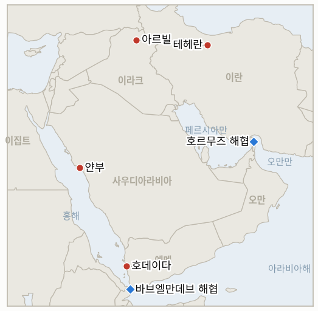

# 중동 일일 브리핑

**2026년 7월 25일**

- **보고 기간:** 약 24시간, 7월 24일 06:00 ~ 7월 25일 06:00 (한국시간)
- **종합 평가:** 개전 14일째는 전쟁이 두 번째 교전 당사자를 얻은 날이다. 사우디아라비아는 흡수를 멈추고 싸우기 시작했다. 엔셀리아호를 두고 하루 동안 규탄만 하던 사우디 주도 연합군은 금요일 늦게 호데이다 상공에 전투기를 띄워 후티의 해상 작전 능력과 연결된 군사 시설, 통신 시설, 카마란섬을 타격하면서도 호데이다·라스이사·살리프 항구는 상업 해운에 계속 열려 있다고 못 박았다. 후티는 "확전에는 확전으로" 대응하겠다고 예고했다. 6개월 동안 이 전쟁은 걸프 국가들을 표적으로 삼은 미국·이란 양자 구도였으나, 이제는 걸프 국가가 직접 출격하는 두 개의 전선을 가진 전쟁이 됐다. 외교 트랙은 반대 방향으로 갔다가 일부 되돌아왔다. 이란은 이라크 총리 알리 알제이디가 테헤란에 전달한 미국 측 휴전안을 거부하며 호르무즈 해협 문제를 다루지 않는 한시적 합의에는 관심이 없다고 밝혔고, 트럼프는 참모들을 소집해 "이제까지보다 더 큰" 대규모 공격을 검토한 뒤 기자들에게는 테헤란이 "날이 갈수록 점점 더 진지해지고 있어" 그 공격이 필요하지 않을 수도 있다고 말했다. 파키스탄은 별도로 재개 경로를 타진하고 있다. 13번째 연속 공습의 밤은 후제스탄을 때려 최소 4명이 숨졌고, 이란은 바레인·쿠웨이트·요르단의 미군 표적에 응수했으며 아르빌 상공에서는 드론이 격추됐다. 시장은 전선의 확대가 아니라 중재 신호를 읽었다. 브렌트유는 목요일 확정 종가 100.69달러에서 3.3% 내린 97.39달러로 마감했으나 주간으로는 여전히 두 자릿수 상승이고, 호르무즈 통항은 하루 세 척으로 떨어져 23일에는 유조선이 단 한 척만 지나 5월 7일 이후 가장 적었다. 서울은 마침내 균열을 보였으나 채널은 하나뿐이었다. 코스피는 외국인이 3조 3,000억 원을 팔아치우고 삼성전자와 SK하이닉스가 8% 급락하며 5.72% 내린 6,690.62로 마감한 반면, 원-달러 환율은 오히려 1,461.3원으로 강세를 보이며 1,490원을 밑도는 둘째 주간 종가를 만들어냈다. 탈동조화의 주식 다리는 AI 지출 우려에 유가가 겹치며 부러졌으나, 통화 다리는 부러지지 않았다.

**정정 및 업데이트:** 7월 24일 브리핑에서 두 가지를 바로잡는다. 첫째, 해당 브리핑은 브렌트유의 7월 23일 수준을 약 101.10달러로 기록하며 종가가 불확실하다고 표기했으나, 확정 종가는 **100.69달러**였다. 5월 이후 첫 100달러 상회 종가라는 사실은 그대로이며 `data/observations.csv`와 `data/series.csv`를 정정했다. 둘째, 7월 24일 브리핑은 IND-20260720-3("전쟁의 가장자리가 유지되는가, 제4의 전선이 열리는가")을 홍해에 공격이 없었다는 근거로 Open으로 채점했다. 이는 오류다. 이 지표의 세 번째 분기 조건은 "확인된 바브엘만데브 또는 남부 홍해 해운 공격"이며, 알슈카이크 남서쪽 약 70해리에서 발생한 엔셀리아호 피격이 7월 23일 이 조건을 충족했다. 해당 지표는 7월 23일자로 **확증(Confirmed)**이며 오늘 공표한다.

---

## 1. 무슨 일이 있었나

<figure style="float:right; width:46%; margin:2pt 0 8pt 14pt;">

<figcaption style="font-size:8pt; color:#666; text-align:center; margin-top:3pt; font-style:italic;">주요 논의 지점</figcaption>
</figure>

### 1.1 사우디아라비아가 호데이다 공습으로 참전하다

사우디 주도 연합군이 금요일 늦게 예멘 홍해 연안 호데이다주의 후티 통제 표적을 타격했다. 이번 라운드 들어 사우디의 첫 군사 행동으로, 사우디 당국은 7월 25일 이른 시각 이를 상선에 대한 후티 공격에 대한 대응이라고 발표했다 ([Xinhua](https://english.news.cn/20260725/1403391ddf57453da70249555c9b07fc/c.html), [The National](https://www.thenationalnews.com/news/2026/07/24/houthi-official-says-saudi-strike-targets-hodeidah-port-after-attack-on-saudi-vessel/), [Jerusalem Post](https://www.jpost.com/middle-east/article-903581)). 주민들은 여러 차례의 폭발을 보고했다. 연합군은 민간 인프라를 피하면서 후티의 해상 작전 능력과 연결된 군사 시설을 타격했다고 밝혔으며, 보도된 표적에는 통신 시설과 카마란섬이 포함됐다. 연합군은 호데이다·라스이사·살리프 항구가 상업 해운에 계속 개방돼 있다고 명시했다 ([The New Arab](https://www.newarab.com/news/saudi-arabia-strikes-houthi-sites-yemen-conflict-flares)). 후티는 "확전에는 확전으로" 보복하겠다고 선언하며 리야드가 자신들이 통제하는 지역에 대한 봉쇄 해제 대신 무력을 택했다고 비난했다 ([Xinhua](https://english.news.cn/20260725/1403391ddf57453da70249555c9b07fc/c.html)). 이는 걸프 국가가 전쟁을 흡수하는 위치에서 수행하는 위치로 넘어간 첫 사례다. **신뢰도: 높음** — 공습 사실, 호데이다 위치, 제시된 명분, 후티의 보복 예고(사우디 연합군 성명, 후티 성명, 복수 매체); **신뢰도: 중간** — 구체적 표적 목록과 상업 항만 운영이 실제로 영향받지 않았다는 주장.

### 1.2 이란이 이라크가 전달한 휴전안을 호르무즈를 이유로 거부하고 트럼프는 대규모 공격을 저울질하다

이란은 이라크 총리 알리 알제이디가 테헤란에 전달한 미국 지지 휴전안을 거부했다. 이란 당국자들은 호르무즈 해협 문제를 다루지 않는 한시적 합의에는 관심이 없다고 밝혔으며, 테헤란은 이 해협을 모든 긴장 완화 틀의 핵심 요소로 취급한다 ([Haaretz](https://www.haaretz.com/middle-east-news/iran/2026-07-24/ty-article/iran-rejects-reported-trump-truce-as-u-s-completes-13th-night-of-strikes/0000019f-936e-d1a3-adff-f3ff9a1d0000), [i24NEWS](https://www.i24news.tv/en/news/middle-east/artc-iran-rejects-us-ceasefire-proposal-delivered-by-iraqi-prime-minister-report), [Jerusalem Post](https://www.jpost.com/middle-east/iran-news/article-903531)). 트럼프는 금요일 고위 참모와 각료들을 소집해 작전 확대를 검토하며 미국은 "이제까지보다 더 큰" 공격을 위해 "장전 완료" 상태라고 말한 뒤, 기자들에게는 아직 결정하지 않았고 테헤란이 "날이 갈수록 점점 더 진지해지고 있어" 그 공격이 필요하지 않을 수도 있다고 밝혔다. 그는 이란과 대화 중인 인사로 밴스 부통령과 루비오 국무장관을 거론했다. 파키스탄은 별도로 교착된 트랙의 재개 경로를 타진하고 있다 ([Time](https://time.com/article/2026/07/24/us-iran-ceasefire-attack-energy-prices-oil-hormuz-strait/), [CNN](https://www.cnn.com/2026/07/24/world/live-news/iran-war-trump), [France 24](https://www.france24.com/en/live-news/20260724-trump-says-hasn-t-decided-on-big-iran-strikes-tehran-getting-serious), [CNBC](https://www.cnbc.com/2026/07/24/us-iran-war-trump-hormuz-houthis.html)). 한편 13번째 연속 미군 공습의 밤은 후제스탄주 일대를 타격해 최소 4명이 숨졌고, 이란은 바레인·쿠웨이트·요르단의 미군 표적에 보복했다 ([Al Jazeera](https://www.aljazeera.com/news/liveblog/2026/7/24/iran-war-live-trump-weighs-massive-attack-on-iran), [Just Security](https://www.justsecurity.org/149344/early-edition-july-24-2026/)). **신뢰도: 높음** — 거부 사실, 호르무즈 논거, 트럼프 발언, 13번째 공습(복수 매체, 공개 발언, 미 중부사령부); **신뢰도: 중간** — 익명 소식통을 통해 전해진 내부 논의와 파키스탄 채널의 실질 내용.

### 1.3 브렌트유가 100달러에서 물러섰으나 수개월 만의 최대 주간 상승폭을 기록하다

브렌트유는 목요일 100.69달러로 마감해 5월 이후 첫 100달러 상회 종가를 기록한 뒤, 금요일 3.3% 내린 97.39달러로 6월 말 이후 최대 일일 낙폭을 보였고 WTI도 2.6% 내린 89.78달러로 마감했다 ([Rigzone](https://www.rigzone.com/news/wire/brent_pulls_back_from_100-24-jul-2026-184215-article/), [Yahoo Finance](https://finance.yahoo.com/energy/articles/oil-futures-dip-surge-week-141544870.html), [Bloomberg](https://www.bloomberg.com/news/articles/2026-07-23/latest-oil-market-news-and-analysis-for-july-24)). 이번 후퇴는 파키스탄이 미·이란 대화 재개를 타진 중이라는 보도와 공격에도 홍해 물동량이 계속됐다는 보도를 시장이 소화하는 가운데 나왔으며, 모멘텀 지표들도 과열 후 조정 신호를 보내고 있었다. 트럼프의 확전 검토에 관한 뉴욕타임스 보도는 반대 방향으로 작용했으나 흐름을 되돌리지는 못했다 ([Invezz](https://invezz.com/news/2026/07/24/brent-crude-retreats-but-a-14-weekly-jump-says-the-danger-is-not-fading/), [Tradingpedia](https://www.tradingpedia.com/2026/07/24/crude-oil-holds-strong-weekly-gain-despite-friday-pullback/)). 후퇴 이후에도 브렌트유는 측정 기준에 따라 주간 약 9~13.5% 상승으로 마감해 3주 연속 오름세이자 수개월 만의 최대 폭을 기록했다. **신뢰도: 높음** — 목요일 종가, 금요일 방향성, 주간 상승(거래소 호가, 복수 매체); **신뢰도: 중간** — 매체별로 97.39달러에서 98.38달러 사이로 갈리는 금요일 정확한 종가와 후퇴 원인을 파키스탄 보도로 특정하는 해석.

### 1.4 호르무즈 통항이 하루 세 척으로 무너지다

호르무즈 해협 통항이 두 달여 만의 최저 수준으로 떨어졌다. Kpler 자료에 따르면 7월 22일부터 24일까지 하루 세 척이 통항했고, 7월 23일에는 유조선이 단 한 척만 지나 5월 7일 이후 가장 적었다. 전날은 유조선 세 척이었다 ([The National](https://www.thenationalnews.com/news/mena/2026/07/24/hormuz-tanker-crossings-fall-to-lowest-level-in-more-than-two-months-data-shows/), [Kpler](https://www.kpler.com/blog/strait-of-hormuz-crossings-drop-70-as-tanker-traffic-shifts-almost-entirely-to-the-iranian-route)). Kpler의 별도 분석은 통항이 약 70% 감소했으며 남은 물동량이 거의 전부 이란이 지정하고 단속하는 항로로 옮겨갔다고 본다. 이 항로는 7월 22일 무력에 의한 집행이 확증된 바로 그 허가 체제의 항로다 ([Kpler](https://www.kpler.com/blog/strait-of-hormuz-crossings-drop-70-as-tanker-traffic-shifts-almost-entirely-to-the-iranian-route), [CNBC](https://www.cnbc.com/2026/07/21/strait-of-hormuz-traffic-renewed-us-iran-conflict-chokes-hormuz.html)). 전쟁 이전 하루 100척에 가깝던 기준선에 견주면 세 척은 소량의 통과를 허용한 사실상의 폐쇄다. **신뢰도: 높음** — 세 척 통항 수치와 유조선 한 척의 날(Kpler, The National); **신뢰도: 중간** — 정확한 비교 기준. Kpler의 선박 척수와 유조선 척수가 이번 전쟁 내내 일관되지 않은 기준으로 인용돼 왔으며, 70% 수치의 기준 시점도 불분명하다.

### 1.5 서울의 탈동조화가 주식 쪽에서 깨지고 환율은 버티다

코스피는 406.27포인트, 5.72% 내린 6,690.62로 마감해 전 거래일 상승분을 모두 반납하고도 더 내렸다. 외국인은 약 3조 3,000억 원을 순매도했고 매도 사이드카가 5월 27일 이후 23번째로 발동됐으며, 삼성전자와 SK하이닉스는 각각 8%가량 급락했다 ([Seoul Economic Daily](https://en.sedaily.com/finance/2026/07/24/kospi-closes-down-40627-points-at-669062), [Asia Business Daily](https://www.asiae.co.kr/en/article/market-overview/2026072410042602036), [Korea JoongAng Daily](https://www.koreajoongangdaily.com/business/kospi-kosdaq-trigger-sellside-curbs-as-stock-market-plunge-continues/12790200)). 직접적 원인은 미국 기술 기업의 자본지출 지속 가능성에 대한 의구심에서 비롯된 아시아 전반의 AI 관련주 매도세였고, 여기에 100달러를 넘긴 유가가 물가 우려를 되살리며 낙폭을 키웠다 ([Business Recorder](https://www.brecorder.com/news/40431606/south-korean-shares-sink-6-on-ai-spending-concerns-oil-spike)). 원-달러 환율은 반대로 움직여 목요일보다 강한 1,461.3원으로 마감했고, 개입 없이 1,490원을 밑도는 둘째 연속 금요일 종가를 만들었다 ([Trading Economics](https://tradingeconomics.com/south-korea/currency)). **신뢰도: 높음** — 코스피 종가, 외국인 순매도, 사이드카(한국거래소 자료, 복수 매체); **신뢰도: 중간** — 환율의 정확한 종가와 변동 폭. 인용된 변동률이 전 거래일 수준과 정합하지 않으며, AI 요인과 유가 요인의 기여도 분해도 불확실하다.

---

## 2. 심층 분석: 유인과 동기

### 2.1 사우디아라비아는 왜 이제야 타격했고, 왜 이란이 아니라 호데이다인가?

엔셀리아호 피격이 무대응을 지탱할 수 없게 만들었고, 호데이다는 더 큰 전쟁에 합류하지 않으면서 공격에 답할 수 있는 표적이기 때문이다. 리야드는 사흘 동안 쿠웨이트가 카이판호 사태에서 개척한 항의·복구 태세 안에 머물렀는데, 이 태세는 피해를 남의 전쟁으로 돌릴 수 있을 때만 작동한다. 사우디 항구에서 선적한 사우디 선적 선박이, 그것도 이란의 압박을 우회하려고 리야드가 직접 만든 항로에서 불타는 장면은 흡수를 가시적 무능으로 바꿔놓는다. 호데이다에서 후티의 해상 능력을 타격하는 것은 실제로 발사한 행위자를 상대로 억지력을 복원하되, 사우디가 과거에 폭격해봤고 때리는 법을 아는 표적군을 쓰면서 이란 영토에는 탄약 한 발도 떨어뜨리지 않는 선택이다. 항구가 상업 물동량에 계속 열려 있다는 발표가 전략 전체를 한 문장으로 요약한다. 이는 발사대를 겨눈 조정된 보복이지 리야드에 수년간 평판 비용을 안긴 봉쇄 시대로의 회귀가 아니며, 테헤란을 향한 선전포고도 아니다. 리야드가 감수한 위험은 후티가 조정이 아니라 확전만 읽는다는 것이며, "확전에는 확전으로"라는 답은 후티가 후자로 값을 매길 것임을 시사한다.

### 2.2 이란은 원하는 듯 보이던 휴전을 왜 거부했고, 왜 호르무즈가 그것을 결정하는가?

호르무즈를 다루지 않는 휴전은, 이미 2주를 견뎌낸 폭격의 중단과 맞바꿔 테헤란에게 유일하게 작동하는 수단을 내놓으라는 요구이기 때문이다. 이 전쟁에서 이란의 지렛대는 방공망이나 미사일 재고가 아니다. 둘 다 밤마다 갈려나가고 있다. 지렛대는 초크포인트이며, 더 정확히는 그곳에 부과한 허가 체제다. 이 체제가 통항을 하루 세 척으로 잘라내고 유가 밑에 100달러 매수 호가를 깔아놓았다. 한시적 휴전은 공습을 멈추지만 동시에 그 수단의 명분도 얼려버리며, 테헤란은 지렛대를 소진한 채 구조적으로 얻은 것 없이 나오게 된다. 따라서 호르무즈 요구는 합의의 걸림돌이 아니라 합의 그 자체다. 이란은 해협의 지위가 기본값으로 복원되는 것이 아니라 협상 대상이 되어야 한다고 요구하고 있다. 이는 트럼프가 이란이 "더 진지해지고 있다"고 보고하면서도 제안이 거부되는 상황을 동시에 설명한다. 거부된 것은 트랙이 아니라 조건이며, 양측은 무엇을 논의해야 하는지에는 수렴하면서 무엇을 양보할지에서는 여전히 멀리 떨어져 있다.

### 2.3 전쟁이 확대된 날 유가는 왜 100달러에서 물러섰나?

시장은 드라마가 아니라 지속 기간에 값을 매기는데, 금요일은 그 기간이 짧아질 수도 있다는 신뢰할 만한 신호를 두 개 내놓았기 때문이다. 사우디의 예멘 전역 참전은 정치적 의미에서는 확전이지만 배럴의 의미에서는 아니다. 사우디 수출 시설은 타격되지 않았고 얀부는 계속 선적했으며 연합군은 호데이다·라스이사·살리프를 명시적으로 열어뒀다. 그에 맞서 파키스탄 중재 보도와 트럼프 본인의 "대규모 공격" 발언 완화는 엔셀리아호 이후 처음으로 트레이더들에게 출구 서사를 제공했다. 움직임에는 기계적 측면도 있다. 네 거래일 만에 80달러 후반에서 100달러 위로 달려온 뒤 모멘텀은 늘어질 대로 늘어나 있었고 되돌림에는 구실만 필요했다. 한국에 중요한 것은 한 세션의 방향이 아니라 시장이 방어한 수준이다. 브렌트유는 3달러를 반납하고 90달러 후반에서 멈췄으며 3주 연속 상승을 기록했다. 이는 세 자릿수 국면을 포기하는 시장이 아니라 굳히는 시장이다. 진짜 되돌림에는 수용된 휴전이 필요한데, 테헤란은 이번 주 그것을 거부했다.

### 2.4 호르무즈 통항은 왜 하루 세 척으로 무너졌고, 이란 항로는 실제로 무엇을 뜻하는가?

해협이 이란의 조건으로 통항할 의사가 없는 누구에게도 사실상 닫혀 있고, 그 조건을 충족하는 배가 거의 없기 때문이다. 전쟁 전 하루 100척에 가깝던 기준선 대비 세 척은 교란이 아니라 허가된 예외를 낀 폐쇄이며, 7월 23일 유조선 한 척 통항은 그 예외가 얼마나 얇은지를 보여준다. 물동량이 "거의 전부 이란 항로로 옮겨갔다"는 사실의 의미는 통항이 권리에서 허가로 바뀌었다는 데 있다. 움직이는 것은 테헤란이 허용하기 때문에 움직이며, 그 항로는 이란이 지정하고 카이판호 피격이 확인했듯 탄약으로 집행한다. 이는 기뢰 부설이나 폐쇄보다 내구성이 높은 형태의 통제다. 유지 비용이 들지 않고, 항행의 자유를 명분으로 한 연합 형성을 유발하지 않으며, 협상의 다이얼처럼 조이고 풀 수 있기 때문이다. 이는 2.2도 설명한다. 이 항로야말로 이란이 한시적 중단과 맞바꾸지 않을 자산이며, 하루 세 척이라는 숫자는 그 자산이 작동하고 있다는 일일 증거다.

### 2.5 한국 증시는 무너졌는데 원화는 왜 버텼나?

두 채널이 서로 다른 변수에 의해 움직이고 있고, 이번 세션이 그 둘을 깨끗하게 분리했기 때문이다. 삼성전자와 SK하이닉스가 8% 빠지며 나온 코스피의 5.72% 하락은 걸프가 아니라 월가에서 건너온 반도체·AI 자본지출 이야기다. 미국 기술 기업의 자본지출 지속 가능성에 대한 같은 의구심이 아시아 전역의 AI 관련주를 때렸고, 한국 지수는 이 지역에서 그 거래를 가장 집약적으로 표현한다. 100달러 위의 유가는 장기 성장주를 비싸게 만드는 물가·금리 불안을 되살리며 낙폭을 키웠지만, 유가 채널은 증폭기였지 진원은 아니었다. 나머지 절반은 환율이 말해준다. 진짜 전쟁발 자본 이탈은 주식 매도와 통화 약세를 함께 낳는다. 그런데 이번 세션은 외국인 주식 3조 3,000억 원 순매도와 함께 원화가 1,461.3원으로 *강해지는* 결과를 냈고, 이는 한 나라에 대한 뱅크런이 아니라 포트폴리오 재배분의 모습이다. 경제학적 함의는 구체적이다. 금융위기 채널은 여전히 닫혀 있으며, 이번 주식 급락은 전쟁이 마침내 서울에 도달한 것이 아니라 글로벌 AI 리프라이싱에 대한 한국의 반도체 베타로 읽어야 한다. 이 해석은 검증 대상을 가진 가설이며, 그것이 IND-20260725-2가 존재하는 이유다.

---

## 3. 한국에 대한 정책적 함의

한국의 구조적 익스포저 기준값은 `instructions/korea-exposure.md`에 있으며, 이번 보고 기간에 실질적으로 개정된 상수는 없다. 고정 수치는 그대로다. 원유의 약 70%와 LNG의 약 36%가 호르무즈를 통과하고, 7~8월 원유는 전년 대비 110% 이상, 9월은 약 90% 물량으로 확보됐으며(산업통상자원부, 7월 21일), 비호르무즈 완충 물량은 약 2억 7,300만 배럴, 비축 추정치는 약 26일분, 얀부에서 선적하는 홍해 우회 유조선은 15척이고 공개 확인된 가장 최근 통항은 7월 17일의 14번째다. 외교부 철수 권고는 유효하다. **신뢰도: 높음** — 기준값(산업통상자원부·해양수산부 공식 발표). 이번 보고 기간의 실질적 변화는 두 가지다. 홍해 항로에 이제 무장 교전 당사자가 하나가 아니라 둘 있고, 호르무즈가 하루 세 척으로 떨어지면서 얀부 항로의 존속 가능성이 여러 선택지 중 하나가 아니라 한국 원유 물류의 지배 변수가 됐다.

**사안별 함의:**

1. **사우디아라비아의 참전 (1.1):** 이는 한국에 양방향으로 작용하며 순부호가 정말로 불분명하다는 것 자체가 이번 발견이다. 후티의 해상 능력을 약화시키는 것은 얀부 항로를 지속 가능하게 재개할 유일한 경로이므로 작전이 성공한다면 건설적 시나리오다. 그러나 사우디 해운을 겨눈 "확전에는 확전으로" 식 후티 대응은 한국의 우회 선적 15척이 쓰는 바로 그 항로의 단기 위험을 높이며, 한국 용선주들은 이제 양방향 교전이 벌어지는 항로를 마주한다. 실무적으로는 향후 7~10일을 전쟁 기간 중 얀부 항로에 대한 최고 위험 구간으로 취급하고, 전쟁 위험료를 그에 맞게 반영하며, 수에즈·SUMED 우회 경로를 검토 수준이 아니라 원가 산정을 마치고 대기시켜야 한다 (IND-20260725-1, IND-20260722-1로 연결).
2. **거부된 휴전과 호르무즈 요구 (1.2):** 이번 보고 기간에 한국 정책 담당자에게 가장 중요한 문장은 이란이 한시적 중단과 호르무즈를 맞바꾸지 않는다는 것이다. 이는 기본 시나리오에서 빠른 출구를 제거한다. 한국의 주력 원유 동맥을 복원하는 어떤 합의든 해협의 지위에 대한 협상을 요구하며, 이는 며칠이 아니라 몇 달의 문제다. 하반기는 호르무즈가 가을까지 이란의 허가 체제 아래 남는다는 전제로 계획하고, 110%/90% 조달 완충과 약 2억 7,300만 배럴 쿠션이 물리적 공급을 감당하게 하며, 트럼프의 발언 완화는 전환이 아니라 꼬리 확률로 취급해야 한다 (IND-20260721-1).
3. **브렌트유의 100달러 이탈 (1.3):** 한 번의 하락 세션이 국면을 되돌리지는 않는다. 어제 채택한 100달러 기본 시나리오는 유지하되 90달러 후반을 작업 수준으로 삼아야 한다. 이번 후퇴를 이끈 중재 헤드라인을 이란의 거부가 대체로 반박했기 때문이다. 98달러 2회 연속 종가 검증(IND-20260724-3)은 이번 주 둘째 다리에서 실패했으므로, 정직한 규정은 아직 고원으로 확증되지 않은 세 자릿수 국면이다. 한국의 하반기 수입액과 경상수지 작업은 80달러 후반이 아니라 95~100달러에서, 120달러 확전 시나리오를 함께 두고 돌려야 한다.
4. **하루 세 척의 호르무즈 (1.4):** 가장 중요한데 가장 조용한 숫자가 이것이다. 이란의 허가 예외를 낀 사실상의 폐쇄가 뜻하는 바는, 한국의 호르무즈 원유 약 70%와 LNG 약 36% 비중이 점진적 정상화로 충족되지 않으리라는 것이다. 그것은 우회 항로로 충족되거나 아예 충족되지 않는다. 14일째인 카타르 LNG 동결도 같은 그림 안에 있다. 비축과 완충 물량은 여름을 감당한다. 이 숫자가 한 자릿수에 머무는 주가 쌓일수록 굳어지는 익스포저는 4분기 조달 공백이다.
5. **환율이 버틴 주식 급락 (1.5):** 이를 전쟁이 서울에 도달한 것으로 취급해서는 안 된다. 전쟁발 위기의 특징은 주식과 통화의 동반 스트레스인데, 원화는 외국인 3조 3,000억 원 순매도를 뚫고 강세를 보이며 1,490원을 밑도는 둘째 연속 주간 종가를 만들어 IND-20260715-4를 공식 반증했다. 정책 여력은 소진되지 않은 채 남아 있고 한국은행의 8월 결정(IND-20260717-3)은 유가에 초점을 맞춘 채로 갈 수 있다. 지수와 무관하게 살아남는 진짜 위험은 하반기 물가로의 유가 전가다 (IND-20260723-3).

**검증 가능한 지표:**

1. **IND-20260725-1: 사우디의 예멘 작전은 한 라운드인가 전쟁인가.** 관측 지표: 7월 24일 호데이다 라운드 이후 예멘 내 후티 표적에 대한 사우디 주도 연합군의 추가 공습, 또는 사우디 영토·인프라·해운에 대한 후티 공격. 확증 조건: 8월 8일경까지 사흘 이상 별개의 날에 교전이 이어지거나 사우디 영토에 대한 후티 공격이 발생하면 미·이란 전쟁 위에 사우디·후티 전쟁이 겹쳐진 상시 구도가 성립하며, 한국의 얀부 항로는 양방향 활성 전역 안에 놓이고 수에즈 우회가 기본 시나리오가 된다. 반증 조건: 8월 8일경까지 연합군의 추가 공습도, 사우디 영토·해운에 대한 후티 공격도 없으면 호데이다는 억지력 복원을 위한 단발 라운드였으며 항로는 전쟁 위험료를 얹은 채 안정된다.
2. **IND-20260725-2: 한국 증시의 급락은 반도체 사이클인가 전쟁인가.** 관측 지표: 7월 27일~31일 주간의 코스피 일간 등락률과 필라델피아 반도체 지수(SOX) 대비 흐름, 외국인 누적 순매수, 원-달러 종가. 확증 조건(전쟁 채널 개방): 주중 외국인 누적 순매도가 이어지는 *동시에* 개입 없이 어느 세션이든 원화가 1,490원을 넘겨 마감하면 금융 전이 채널이 유가를 넘어 확대된 것이며 한국의 정책 여력이 소진되기 시작한다. 반증 조건: 코스피가 SOX와 수 퍼센트포인트 이내에서 동행하고 원화가 주 내내 1,490원 이하를 유지하면 이번 급락은 글로벌 AI 리프라이싱에 대한 한국의 반도체 베타였으며 전쟁 채널은 여전히 유가에 국한된다.
3. **IND-20260725-3: 호르무즈의 바닥은 유지되는가, 해협은 0으로 가는가.** 관측 지표: Kpler의 호르무즈 해협 일일 통항 및 유조선 척수. 확증 조건: 8월 8일경까지 상품 유조선 통항이 0인 날이 하루라도 나오면 해협은 허가제가 아니라 완전 폐쇄로 규정되며, 한국의 원유·LNG 물류 전체가 우회 항로와 비축으로 넘어가고 4분기 조달 공백은 가격 문제가 아니라 공급 문제로 격상된다. 반증 조건: 8월 8일경까지 통항이 하루 세 척 이상을 유지하면 이란의 허가 체제는 테헤란이 협상 다이얼로 열어두려는 통제된 소량 통과다.

오늘 공표하는 판정: **IND-20260715-4 반증** — 7월 24일 금요일 원화 종가 1,461.3원은 개입(구두·실개입 모두) 없이 1,490원을 밑도는 둘째 연속 주간 종가이며, 그것도 외국인 3조 3,000억 원 순매도를 동반한 5.72% 주식 급락을 뚫고 나왔다는 점에서 가능한 가장 강한 형태의 검증이다. 금융위기 채널은 당분간 반증됐고, 탈동조화의 주식 다리는 부러졌으나 통화 다리는 살아남았다. **IND-20260720-3 확증** (7월 23일자 발효, 정정 블록에 따라 오늘 공표) — 이 지표의 세 번째 분기 조건인 확인된 바브엘만데브 또는 남부 홍해 해운 공격이 엔셀리아호 피격으로 충족됐다. 전쟁은 두 번째 초크포인트 전선을 얻었고, 오늘 사우디의 예멘 전역 참전이 같은 분기 조건을 한 번 더 충족한다. **IND-20260722-2 확증** — 걸프협력회의(GCC) 회원국이 호데이다에 대한 사우디 주도 공습으로 항의를 넘어 군사 행동으로 이동해, "걸프 국가가 전쟁을 흡수하는 위치에서 참전하는 위치로 넘어가는 첫 사례"라는 확증 조건을 충족했다. 이 채점에는 정직한 단서 두 가지가 붙는다. 관측 지표에 열거된 예시는 쿠웨이트에 특정된 항목(단교, GCC 집단방위 발동, 쿠웨이트 기지 확대)이었고 그중 어느 것도 발생하지 않았으며, 사우디의 공습은 이란이 아니라 후티를 겨눈 것이므로 이는 걸프 국가가 전쟁의 예멘 전선에 합류한 것이지 미·이란 전선에 합류한 것은 아니다. 후속 질문은 IND-20260725-1이 이어받는다.

지표 원장의 미결 현황: IND-20260714-4(카타르 주간 선적 신규 수치 없음, 수출 동결 14일째 — 미결), IND-20260715-1(통항 하루 세 척, 7월 28일경 체제 검증이 사실상 폐쇄 수준의 수치와 함께 마감 임박 — 미결), IND-20260715-2(명명된 걸프 안보 패키지 없음, 다만 사우디의 연합군 행동이 일방적 대체물 — 미결), IND-20260715-3(UAE 태세에 대한 신규 확인 없음 — 미결), IND-20260716-2(엔셀리아호 이후 홍해 항목은 무의미해졌으나 테헤란 조율 조건은 여전히 미충족 — 미결, 시한 7월 29일경), IND-20260717-2(라스라판 적재 출항 없음, 동결 14일째 — 미결, 반증 방향), IND-20260717-3(한국은행 8월 회의 — 미결), IND-20260718-1(13번째 밤도 발전과 전력망을 비켜감 — 미결, 반증 분기 임박), IND-20260720-1(핵시설 타격 없음, 이번 보고 기간 보도에 픽액스 마운틴 언급 없음 — 미결, 시한 7월 27일경), IND-20260721-1(이란이 이라크 전달 제안을 명시적으로 거부했고 13번째 공습의 밤이 진행됨. 트럼프의 "더 진지해지고 있다" 발언과 파키스탄 채널이 트랙을 살려둠 — 미결, 시한 7월 27일경, 반증 방향), IND-20260722-1(16번째 선적 수치 없음, 항로에 이제 교전 당사자 둘 — 미결, 시한 7월 29일경), IND-20260723-1(약 700억 달러 요청에 대한 예산 조치 없음 — 미결, 시한 8월 22일경), IND-20260723-2(자우타르 알가르비예 배치를 위한 레바논군 협조가 진행 중이나 두 번째 확인된 철수는 없음 — 미결, 시한 8월 6일경), IND-20260723-3(90달러 이상 유가에 대한 한국 공식 반영 없음 — 미결, 시한 8월 31일경), IND-20260724-1(사우디아라비아는 아브라함 협정 조건에 공개 대응하지 않았고 주미 대사관은 논평을 거부 — 미결, 시한 8월 24일경), IND-20260724-2(엔셀리아호 이후 사우디 연계 해운에 대한 추가 확인 공격 없음. 사우디의 반격은 역학을 바꾸지만 관측 지표를 충족하지는 않음 — 미결, 시한 8월 7일경), IND-20260724-3(목요일 100.69달러 종가는 98달러 선을 넘겼으나 금요일 97.39달러가 연속 요건을 깨뜨림. 92달러 미만 종가도 없음 — 미결, 시한 8월 1일경).

---

## 4. 관찰 목록

- **호데이다에 대한 후티의 답.** "확전에는 확전으로"는 도화선이 짧은 약속이며, 가용 표적은 사우디 해운, 사우디 영토, 그리고 한국이 쓰는 홍해 항로다. 다가올 한 주에서 가장 파급력이 큰 미지수다 (IND-20260725-1, IND-20260724-2). **신뢰도: 중간~높음** — 어떤 형태로든 후티의 대응이 며칠 내 발생할 가능성.
- **얀부의 16번째 한국 선적.** 여전히 미결이며 이제는 양방향 교전 지역 안에서의 결정이다 (IND-20260722-1). 해양수산부·산업통상자원부 발표와 Kpler 용선 자료에서 다음 한국 용선이 선적하는지 수에즈로 우회하는지 주시한다. **신뢰도: 높음** — 이번 주 안에 질문이 강제될 가능성.
- **트럼프의 완화가 주말을 넘기는지.** "장전 완료"와 "필요하지 않을 수도"가 몇 시간 간격으로 나왔다. 월요일까지 어느 쪽이 지배하느냐가 7월 27일 IND-20260721-1 시한 전에 중재 트랙에 맥박이 있는지를 결정한다. **신뢰도: 낮음~중간** — 실질적 전환 가능성.
- **브렌트유의 90달러 후반 방어.** 국면 질문은 이제 97달러가 바닥인지 하락 경유지인지다 (IND-20260724-3). 98달러 이상 2회 연속 종가는 세 자릿수 국면을 확증하고, 92달러 아래로의 이탈은 이번 돌파 전체를 일시적 급등으로 규정한다. **신뢰도: 중간** — 기간 내 판정 가능성.
- **세 척의 호르무즈, 그리고 0으로 갈지 여부.** 이 수치는 전쟁이 한국 에너지 물류에 미치는 영향을 재는 가장 깨끗한 단일 척도다 (IND-20260725-3, IND-20260715-1). 유조선 0척의 날은 해협 허가제 시작 이후 가장 파급력이 큰 데이터가 된다. **신뢰도: 중간** — 바닥이 유지될 가능성.
- **월요일의 서울.** 코스피가 SOX와 함께 안정되는지, 아니면 계속 빠지면서 원화가 1,490원을 뚫는지가 금요일이 반도체 베타였는지 전쟁의 도달이었는지를 가른다 (IND-20260725-2). **신뢰도: 중간~높음** — 반도체 해석이 유지될 가능성.
- **14일째인 카타르 LNG 동결.** 7월 11일 이후 라스라판 적재 출항이 없고(IND-20260717-2), 이란이 호르무즈를 뺀 휴전을 거부하면서 재개 경로는 더 좁아졌다. 한국의 4분기 조달 공백이 또 한 주 굳어진다. **신뢰도: 높음** — 동결 지속.
- **아브라함 협정 조건에 대한 리야드의 침묵.** 사우디아라비아는 트럼프에게 공개적으로 답하지 않았고 주미 대사관은 논평을 거부했다. 예멘을 타격하면서 이스라엘과의 관계 정상화를 요구받는 상황이 답을 더 쉽게 만들지는 않는다 (IND-20260724-1). **신뢰도: 중간~높음** — 단기적으로 침묵이 이어질 가능성.
- **아르빌과 이라크 전선.** 7월 24일 아르빌 상공에서 드론 6기가 교전돼 5기가 공항 인근에서 격추되고 1기가 부근에 추락했으며, 항공편이 잠시 중단됐으나 사상자는 없었다. Al Jazeera는 이란 소행으로 지목했으나 책임 주체는 독립적으로 확인되지 않았다. 이라크 쿠르디스탄에서 지속적 작전이 벌어지면 한국의 건설·에너지 이해가 직접 걸린 전선이 열린다. **신뢰도: 낮음~중간** — 귀속; **신뢰도: 중간** — 재발 가능성.

---

## 5. 출처 신뢰도 요약

| 주장 | 출처 | 신뢰도 |
|---|---|---|
| 사우디 주도 연합군이 7월 24일 늦게 호데이다의 후티 군사 시설을 타격, 7월 25일 이른 시각 발표, 홍해 해운 공격에 대한 대응으로 규정 | 사우디 연합군 성명; Xinhua, The National, Jerusalem Post, The New Arab | 높음 |
| 표적에 통신 시설과 카마란섬 포함, 호데이다·라스이사·살리프는 상업 해운에 계속 개방 | 연합군 성명; 지역 매체를 통한 주민 증언 | 중간 |
| 후티가 "확전에는 확전으로" 보복 예고 | 후티 성명; Xinhua | 높음 |
| 이란이 이라크 총리 알제이디가 전달한 미국 휴전안 거부, 호르무즈를 다루지 않는 한시적 합의 거부 | 뉴욕타임스 보도 인용; Haaretz, i24NEWS, Jerusalem Post | 높음(거부); 중간(채널 세부) |
| 트럼프가 확전 논의로 참모 소집, "장전 완료" 발언 후 대규모 공격이 필요하지 않을 수도 있으며 이란이 "더 진지해지고 있다"고 발언 | 공개 발언; Time, CNN, France 24, CNBC, RFE/RL | 높음 |
| 파키스탄이 미·이란 대화 재개 경로 타진 | CNBC를 통한 Reuters | 중간 |
| 13번째 연속 미군 공습의 밤, 후제스탄 일대, 최소 4명 사망; 이란은 바레인·쿠웨이트·요르단 미군 표적에 보복 | 미 중부사령부; 이란 국영매체; Al Jazeera, Just Security | 높음 |
| 브렌트유 목요일 100.69달러 종가(5월 이후 첫 100달러 상회), 금요일 3.3% 내린 97.39달러, WTI 89.78달러 | 거래소 호가; Rigzone, Yahoo Finance, Bloomberg | 높음(방향, 목요일 종가); 중간(금요일 종가, 97.39~98.38달러 범위) |
| 브렌트유 주간 약 9~13.5% 상승, 3주 연속 오름세 | Rigzone, Invezz, Tradingpedia | 높음(방향); 중간(폭, 측정 기준 상이) |
| 호르무즈 통항 7월 22~24일 하루 세 척, 7월 23일 유조선 한 척으로 5월 7일 이후 최저, 통항 약 70% 감소하며 이란 항로로 이동 | Kpler; The National, CNBC | 높음(척수); 중간(비교 기준) |
| 코스피 5.72% 내린 6,690.62, 외국인 3조 3,000억 원 순매도, 5월 27일 이후 23번째 사이드카, 삼성전자·SK하이닉스 8% 급락 | 한국거래소 자료; Seoul Economic Daily, Asia Business Daily, Korea JoongAng Daily | 높음 |
| 매도세의 원인은 아시아 전반의 AI 자본지출 의구심에 100달러 위 유가가 겹친 것 | Business Recorder, Seoul Economic Daily | 중간~높음 |
| 원화 1,461.3원 마감 강세, 1,490원 미만 둘째 연속 주간 종가, 개입 없음 | Trading Economics | 중간(수준); 높음(1,490원 미만 여부) |
| 7월 24일 아르빌 상공 드론 6기 교전, 5기 공항 인근 격추, 항공편 일시 중단, 사상자 없음 | Al Jazeera, Just Security | 중간(사건); 낮음~중간(이란 귀속) |

_2026년 7월 25일(한국시간) 미국·사우디·예멘·이스라엘·이란·중국 국영, 이라크, 한국, 유럽 매체 및 해운·에너지 전문 매체에 대한 웹 조사를 바탕으로 작성. 일부 주요 매체(Al Jazeera, CNN, Bloomberg)는 자동 수집을 차단하므로, 위 주장들은 검색 색인을 통한 복수 매체 교차 확인에 근거한다._
