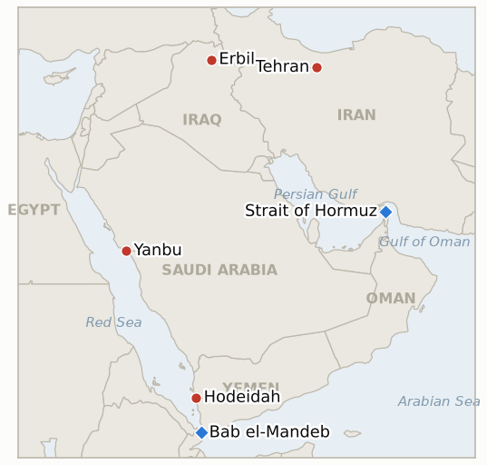
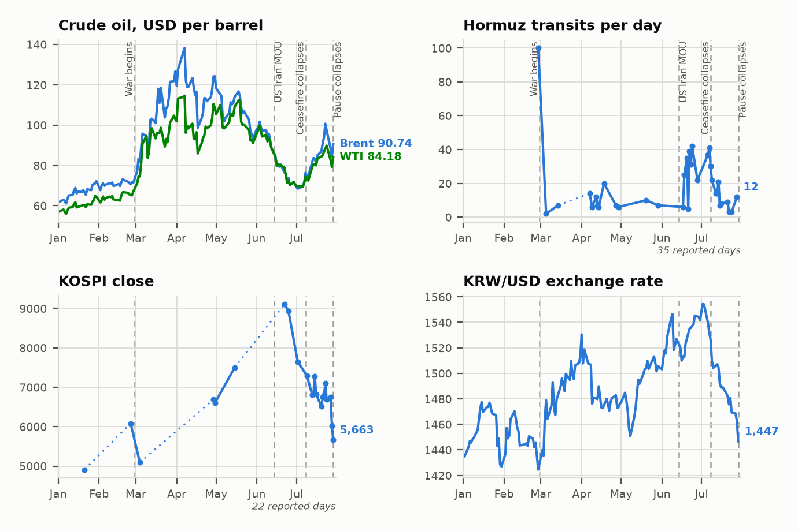

# Middle East Daily Briefing

**July 25, 2026**

- **Reporting window:** ~24 hours, July 24, 06:00 to July 25, 06:00 KST
- **Overall assessment:** Day fourteen is the day the war acquired a second belligerent. Saudi Arabia stopped absorbing and started fighting: after a day of condemnation over the Encelia, the Saudi led coalition put warplanes over Hodeidah late Friday, striking Houthi military sites tied to the group's maritime capabilities along with telecommunications facilities and Kamaran Island, while pointedly announcing that Hodeidah, Ras Issa and Salif stay open to commercial shipping. The Houthis promised "escalation for escalation." For six months this was a US Iran dyad with Gulf states as targets; it is now a two front war with a Gulf state flying missions. The diplomatic track moved the opposite way and then partly back: Iran rejected a US ceasefire proposal carried to Tehran by Iraqi Prime Minister Ali al-Zeidi, refusing a temporary deal that leaves the Strait of Hormuz unaddressed, and Trump convened his advisers to weigh a "massive attack; bigger than ever before" before telling reporters the strike may not be necessary because Tehran is getting "more and more serious," with Pakistan separately probing a restart. The thirteenth consecutive strike night hit Khuzestan and killed at least four; Iran answered against US positions in Bahrain, Kuwait and Jordan, and drones were downed over Erbil. Markets read the mediation noise rather than the widening: Brent fell 3.3% to $97.39 after Thursday's confirmed $100.69 settle, still up double digits on the week, and Hormuz traffic fell to three vessels a day with a single tanker crossing on the 23rd, the fewest since May 7. Seoul finally cracked, but only on one channel: the KOSPI fell 5.72% to 6,690.62 with foreigners dumping ₩3.3 trillion and Samsung and SK hynix down 8%, while the won *strengthened* to ₩1,461.3 and delivered a second consecutive weekly close below ₩1,490. The equity leg of the decoupling broke on AI spending fears compounded by oil; the currency leg did not.

**Corrections and updates:** Two items from the July 24 brief. First, that brief recorded Brent's July 23 level as approximately $101.10 with the settle flagged as uncertain; the confirmed settle was **$100.69**, still the first close above $100 since May, and `data/observations.csv` and `data/series.csv` have been corrected. Second, the July 24 brief scored IND-20260720-3 ("the war's edges hold or a fourth front opens") as Open on the grounds that the Red Sea stayed attack free. That was wrong: the indicator's third branch is "verified Bab el-Mandeb/southern Red Sea shipping attack," and the Encelia strike roughly 70 nautical miles southwest of Al Shuqaiq met it on July 23. The indicator is **Confirmed** as of July 23 and is announced today.

---

## 1. What Happened

<figure style="float:right; width:46%; margin:2pt 0 8pt 14pt;">

<figcaption style="font-size:8pt; color:#666; text-align:center; margin-top:3pt; font-style:italic;">Major places of discussion</figcaption>
</figure>

### 1.1 Saudi Arabia Enters the War with Coalition Airstrikes on Hodeidah

The Saudi led coalition struck Houthi controlled targets in Yemen's Red Sea province of Hodeidah late Friday, its first kinetic action of this round, announced by Saudi authorities early on July 25 as a response to the Houthi attacks on commercial shipping ([Xinhua](https://english.news.cn/20260725/1403391ddf57453da70249555c9b07fc/c.html), [The National](https://www.thenationalnews.com/news/2026/07/24/houthi-official-says-saudi-strike-targets-hodeidah-port-after-attack-on-saudi-vessel/), [Jerusalem Post](https://www.jpost.com/middle-east/article-903581)). Residents reported multiple explosions; the coalition said it hit military sites linked to the group's maritime capabilities while avoiding civilian infrastructure, with reported targets including telecommunications facilities and Kamaran Island, and stated that the ports of Hodeidah, Ras Issa and Salif remain open to commercial shipping ([The New Arab](https://www.newarab.com/news/saudi-arabia-strikes-houthi-sites-yemen-conflict-flares)). The Houthis vowed to retaliate on an "escalation for escalation" basis, accusing Riyadh of choosing force over lifting the blockade on areas it controls ([Xinhua](https://english.news.cn/20260725/1403391ddf57453da70249555c9b07fc/c.html)). This is the first Gulf state to cross from absorbing the war to prosecuting it. **Confidence: High** on the strikes, the Hodeidah location, the stated rationale and the Houthi vow (Saudi coalition statements, Houthi statement, multi outlet); **Medium** on the specific target list and on the claim that commercial port operations are genuinely unaffected.

### 1.2 Iran Rejects the Iraqi Delivered Ceasefire over Hormuz as Trump Weighs a Massive Attack

Iran rejected a US backed ceasefire proposal delivered to Tehran by Iraqi Prime Minister Ali al-Zeidi, with officials saying they were not interested in a temporary arrangement that failed to address the Strait of Hormuz, which Tehran treats as the central element of any de-escalation framework ([Haaretz](https://www.haaretz.com/middle-east-news/iran/2026-07-24/ty-article/iran-rejects-reported-trump-truce-as-u-s-completes-13th-night-of-strikes/0000019f-936e-d1a3-adff-f3ff9a1d0000), [i24NEWS](https://www.i24news.tv/en/news/middle-east/artc-iran-rejects-us-ceasefire-proposal-delivered-by-iraqi-prime-minister-report), [Jerusalem Post](https://www.jpost.com/middle-east/iran-news/article-903531)). Trump convened senior advisers and cabinet members on Friday to weigh escalating the campaign, saying the US is "locked and loaded" for an attack "bigger than ever before," then told reporters he had not decided and that it may not be necessary because Tehran is "getting more and more serious as the days go by," naming Vance and Rubio among those talking to Iran; Pakistan is separately exploring a path to restarting the stalled track ([Time](https://time.com/article/2026/07/24/us-iran-ceasefire-attack-energy-prices-oil-hormuz-strait/), [CNN](https://www.cnn.com/2026/07/24/world/live-news/iran-war-trump), [France 24](https://www.france24.com/en/live-news/20260724-trump-says-hasn-t-decided-on-big-iran-strikes-tehran-getting-serious), [CNBC](https://www.cnbc.com/2026/07/24/us-iran-war-trump-hormuz-houthis.html)). Meanwhile the thirteenth consecutive night of US strikes hit locations around Khuzestan province, killing at least four, and Iran retaliated against US military targets in Bahrain, Kuwait and Jordan ([Al Jazeera](https://www.aljazeera.com/news/liveblog/2026/7/24/iran-war-live-trump-weighs-massive-attack-on-iran), [Just Security](https://www.justsecurity.org/149344/early-edition-july-24-2026/)). **Confidence: High** on the rejection, the Hormuz rationale, Trump's remarks and the thirteenth night (multi outlet, on record remarks, CENTCOM); **Medium** on the internal deliberations reported via unnamed sources and on the Pakistani channel's substance.

### 1.3 Brent Pulls Back from $100 but Books Its Biggest Weekly Gain in Months

Brent settled at $100.69 on Thursday, its first close above $100 since May, then fell 3.3% on Friday to $97.39, its biggest one day drop since late June, with WTI down 2.6% to $89.78 ([Rigzone](https://www.rigzone.com/news/wire/brent_pulls_back_from_100-24-jul-2026-184215-article/), [Yahoo Finance](https://finance.yahoo.com/energy/articles/oil-futures-dip-surge-week-141544870.html), [Bloomberg](https://www.bloomberg.com/news/articles/2026-07-23/latest-oil-market-news-and-analysis-for-july-24)). The retreat came as traders digested reports that Pakistan is exploring a restart of US Iran talks and that Red Sea flows continued despite the attacks, with momentum indicators signalling an overdue pause; the New York Times reporting on Trump's escalation deliberations cut the other way without reversing the move ([Invezz](https://invezz.com/news/2026/07/24/brent-crude-retreats-but-a-14-weekly-jump-says-the-danger-is-not-fading/), [Tradingpedia](https://www.tradingpedia.com/2026/07/24/crude-oil-holds-strong-weekly-gain-despite-friday-pullback/)). Even after the pullback Brent finished up roughly 9% to 13.5% on the week depending on the measure used, a third consecutive weekly advance and the largest in months. **Confidence: High** on the Thursday settle, the Friday direction and the weekly gain (exchange quotes, multi outlet); **Medium** on the precise Friday settle, which sources put between $97.39 and $98.38, and on the attribution of the pullback to the Pakistani reports specifically.

### 1.4 Hormuz Transits Collapse to Three Vessels a Day

Traffic through the Strait of Hormuz fell to its lowest level in more than two months. Kpler data show three vessels a day transiting from July 22 through July 24, and on July 23 only a single tanker crossed, the fewest since May 7, against three tankers the day before ([The National](https://www.thenationalnews.com/news/mena/2026/07/24/hormuz-tanker-crossings-fall-to-lowest-level-in-more-than-two-months-data-shows/), [Kpler](https://www.kpler.com/blog/strait-of-hormuz-crossings-drop-70-as-tanker-traffic-shifts-almost-entirely-to-the-iranian-route)). Kpler's separate assessment puts crossings down about 70% with the remaining traffic shifted almost entirely into the corridor Iran has designated and polices, the same route whose licensing regime was confirmed as enforced by force on July 22 ([Kpler](https://www.kpler.com/blog/strait-of-hormuz-crossings-drop-70-as-tanker-traffic-shifts-almost-entirely-to-the-iranian-route), [CNBC](https://www.cnbc.com/2026/07/21/strait-of-hormuz-traffic-renewed-us-iran-conflict-chokes-hormuz.html)). Against a pre-war baseline near 100 vessels a day, three is functional closure with a permitted trickle. **Confidence: High** on the three vessel counts and the single tanker day (Kpler, The National); **Medium** on the exact comparison basis, since Kpler's vessel counts and tanker counts have been quoted on inconsistent bases through this war, and on the 70% figure's reference period.

### 1.5 Seoul's Decoupling Breaks on the Equity Side While the Won Holds Firm

The KOSPI fell 406.27 points, or 5.72%, to close at 6,690.62, giving back the previous session's rally and more, with foreign investors selling about ₩3.3 trillion and a sell side sidecar triggered for the 23rd time since May 27; Samsung Electronics and SK hynix each dropped about 8% ([Seoul Economic Daily](https://en.sedaily.com/finance/2026/07/24/kospi-closes-down-40627-points-at-669062), [Asia Business Daily](https://www.asiae.co.kr/en/article/market-overview/2026072410042602036), [Korea JoongAng Daily](https://www.koreajoongangdaily.com/business/kospi-kosdaq-trigger-sellside-curbs-as-stock-market-plunge-continues/12790200)). The proximate driver was a regional selloff in AI related shares on doubts about the sustainability of US technology capital spending, compounded by the oil spike above $100 rekindling inflation fears ([Business Recorder](https://www.brecorder.com/news/40431606/south-korean-shares-sink-6-on-ai-spending-concerns-oil-spike)). The won moved the other way, closing at ₩1,461.3, stronger than Thursday and the second consecutive Friday close below ₩1,490 with no intervention ([Trading Economics](https://tradingeconomics.com/south-korea/currency)). **Confidence: High** on the KOSPI close, the foreign selling and the sidecar (KRX data, multi outlet); **Medium** on the won's exact close and the size of its move, since the quoted percentage change is inconsistent with the prior session's level, and on the decomposition between AI and oil as drivers.

---

## 2. Deep Dive: Incentives and Motives

### 2.1 Why did Saudi Arabia finally strike, and why at Hodeidah rather than at Iran?

Because the Encelia made non-response untenable, and Hodeidah is the target that answers the attack without joining the larger war. Riyadh had spent three days inside the protest-and-repair posture that Kuwait pioneered over the Kaifan, and that posture works only while the damage is deniable as someone else's war. A Saudi flagged hull burning after loading at a Saudi port, in a corridor Riyadh built specifically to bypass Iranian pressure, converts absorption into visible impotence. Striking Houthi maritime capability at Hodeidah restores deterrence against the actor that actually fired, on a target set Saudi Arabia has bombed before and knows how to hit, without putting a single munition on Iranian soil. The announcement that the ports stay open to commercial traffic is the whole strategy in one sentence: this is calibrated retaliation aimed at the launchers, not a return to the blockade era that cost Riyadh years of reputational damage, and not a declaration against Tehran. The risk Riyadh has accepted is that the Houthis do not read calibration, only escalation, and their "escalation for escalation" answer suggests they will price it as the latter.

### 2.2 Why did Iran reject a ceasefire it appears to want, and why does Hormuz decide it?

Because a truce that leaves Hormuz unaddressed asks Tehran to surrender its only functioning instrument in exchange for a pause in a bombing campaign it has already absorbed for two weeks. Iran's leverage in this war is not its air defense or its missile inventory, both of which are being ground down nightly; it is the chokepoint, and specifically the licensing regime it has imposed there, which has cut traffic to three vessels a day and put a hundred dollar bid under crude. A temporary ceasefire freezes the strikes but also freezes that instrument's justification, and Tehran would emerge with its leverage spent and nothing structural won. The Hormuz demand is therefore not an obstacle to the deal, it is the deal: Iran is insisting the strait's status be negotiated rather than restored by default. That also explains why Trump can simultaneously report Iran getting "more serious" and see the proposal rejected. The rejection is of the terms, not the track, and the two sides are converging on what must be discussed while remaining far apart on what either will concede.

### 2.3 Why did oil retreat from $100 on the day the war widened?

Because the market prices duration, not drama, and Friday delivered two credible signals that duration might shorten. A Saudi entry into the Yemen theater is escalation in the political sense but not in the barrel sense: no Saudi export facility was hit, Yanbu kept loading, and the coalition explicitly kept Hodeidah, Ras Issa and Salif open. Against that, the Pakistani mediation reports and Trump's own softening on the "massive attack" gave traders an off-ramp narrative for the first time since the Encelia. The move is also mechanical: after a run from the high $80s to above $100 in four sessions, momentum was stretched and a pullback needed only a pretext. What matters for Korea is the level the market defended, not the direction of one session. Brent gave back three dollars and stopped in the high $90s, a third consecutive weekly advance, which is a market consolidating a three figure regime rather than abandoning it. A genuine round trip requires an accepted truce, and Tehran rejected one this week.

### 2.4 Why has Hormuz traffic collapsed to three ships a day, and what does the Iranian corridor actually mean?

Because the strait is now functionally closed to anyone unwilling to transit on Iran's terms, and almost nobody qualifies. Three vessels a day against a pre-war baseline near a hundred is not a disruption, it is closure with a licensed exception, and the single tanker crossing on July 23 shows how thin the exception is. The significance of the traffic having "shifted almost entirely to the Iranian route" is that transit has been converted from a right into a permission: what moves, moves because Tehran allows it, on a corridor Iran designates and, as the Kaifan strike verified, enforces with munitions. That is a more durable form of control than mining or closure, because it costs Iran nothing to maintain, generates no freedom-of-navigation coalition against it, and can be tightened or loosened as a negotiating dial. It also explains 2.2: the corridor is the asset Iran will not trade for a temporary pause, and the three-a-day count is the daily proof that the asset is working.

### 2.5 Why did Korean equities break down while the won held firm?

Because the two channels are being driven by different variables, and this session separated them cleanly. The KOSPI's 5.72% loss with Samsung and SK hynix down 8% is a semiconductor and AI-capex story that arrived from Wall Street, not from the Gulf: the same doubts about US technology capital spending hit AI-related shares across Asia, and Korea's index is the most concentrated expression of that trade in the region. Oil above $100 sharpened it by reviving the inflation and rate anxiety that makes long duration growth names expensive, but the oil channel was the amplifier, not the origin. The won tells the other half of the story. A genuine war-driven capital flight produces equity selling *and* currency weakness; this session produced ₩3.3 trillion of foreign equity selling with the won *strengthening* to ₩1,461.3, which is what a portfolio rotation looks like, not a run on the country. For an economist the implication is specific: the financial crisis channel stays shut, and the equity break should be read as Korea's chip beta to a global AI repricing rather than as the war finally reaching Seoul. That reading is a hypothesis with a test, which is what IND-20260725-2 is for.

---

## 3. Policy Implications for South Korea

Korea's structural exposure baselines are in `instructions/korea-exposure.md`; no constant was materially revised this window. Standing figures hold: ~70% of crude and ~36% of LNG through Hormuz; July–August crude secured at 110%+ and September at ~90% of prior year volumes (MOTIE, July 21); ~273 million barrel non Hormuz cushion; ~26 day reserve estimate; 15 Red Sea detour tankers loading at Yanbu, the most recent publicly confirmed transit being the 14th on July 17; MOFA departure advisory in force. **Confidence: High** on the baselines (MOTIE/MOF on record). The live changes this window are that the Red Sea corridor now has two armed belligerents operating in it rather than one, and that Hormuz has fallen to three transits a day, making the Yanbu route's viability the dominant variable in Korea's crude logistics rather than one option among several.

**Implications by development:**

1. **Saudi Arabia enters the war (1.1):** This cuts both ways for Korea and the net sign is genuinely unclear, which is itself the finding. Degrading Houthi maritime capability is the only path to reopening the Yanbu corridor on a durable basis, so a successful campaign is the constructive case. But an "escalation for escalation" Houthi response aimed at Saudi shipping raises near-term risk on exactly the route Korea's 15 detour liftings use, and Korean charterers now face a corridor with active two-way hostilities. The practical action is to treat the next 7 to 10 days as the highest-risk window of the war for the Yanbu route, price war risk accordingly, and have the Suez/SUMED reroute costed and ready rather than merely reviewed (IND-20260725-1, feeds IND-20260722-1).
2. **The rejected ceasefire and the Hormuz demand (1.2):** The most important sentence for Korean planners this window is that Iran will not trade Hormuz for a pause. That removes the fast off-ramp from the base case: any settlement that restores Korea's primary crude artery requires a negotiation over the strait's status, which is a matter of months, not days. Plan the second half on the assumption that Hormuz stays under Iranian licensing through the autumn, with the 110%/90% procurement buffers and the ~273 million barrel cushion carrying physical supply, and treat Trump's softening as a tail probability rather than a turn (IND-20260721-1).
3. **Brent's pullback from $100 (1.3):** One down session does not undo the regime. The $100 base case adopted yesterday should stand, with the high $90s as the working level, because the pullback was driven by mediation headlines that Iran's rejection largely contradicts. The two-settle test at $98 (IND-20260724-3) failed on its second leg this week, so the honest characterisation is a three figure regime that is not yet confirmed as a plateau. Korea's second half import bill and current account work should be run at $95 to $100 with a $120 escalation case, not at the high $80s.
4. **Hormuz at three transits a day (1.4):** This is the quiet number that matters most. Functional closure with an Iranian licensing exception means Korea's ~70% Hormuz crude share and ~36% LNG share are not going to be served by a gradual normalisation; they will be served by the workaround routes or not at all. The Qatari LNG freeze at day 14 sits inside this same picture. The reserve and buffer position covers the summer; the fourth quarter procurement gap is the exposure that hardens every week this count stays in single digits.
5. **The equity break with a firm won (1.5):** Do not treat this as the war reaching Seoul. The signature of a war-driven crisis is joint equity and currency stress, and the won strengthened through ₩3.3 trillion of foreign equity selling to a second consecutive sub-₩1,490 weekly close, formally falsifying IND-20260715-4. Policy capacity stays unspent and the BOK's August decision (IND-20260717-3) can remain oil focused. The genuine risk to monitor is the one that survives regardless of the index: oil pass through into second half inflation (IND-20260723-3).

**Testable indicators:**

1. **IND-20260725-1: The Saudi Yemen campaign is a round or a war.** Metric: further Saudi led coalition strikes on Houthi targets in Yemen, or Houthi strikes on Saudi territory, infrastructure or shipping, after the July 24 Hodeidah round. Confirmation: continued exchanges on three or more separate days, or any Houthi strike on Saudi soil, by ~August 8 establishes a standing Saudi Houthi war layered on the US Iran war, putting Korea's Yanbu corridor inside a two-way active theatre and making the Suez reroute the base case. Falsification: no further coalition strikes and no Houthi attack on Saudi territory or shipping through ~August 8 marks Hodeidah as a one round deterrence restoration, after which the corridor stabilises under a war risk premium.
2. **IND-20260725-2: Korea's equity break is the chip cycle or the war.** Metric: KOSPI daily moves versus the Philadelphia Semiconductor Index, cumulative foreign net flows, and USD/KRW closes over the July 27 to July 31 week. Confirmation (war channel opened): cumulative foreign net selling continues through the week *and* the won closes above ₩1,490 on any session without intervention, meaning the financial transmission channel has widened beyond oil and Korea's policy capacity starts being spent. Falsification: the KOSPI tracks the SOX within a few percentage points while the won stays at or below ₩1,490 all week, confirming the break was Korea's chip beta to a global AI repricing and the war channel remains confined to the oil price.
3. **IND-20260725-3: The Hormuz floor holds or the strait goes to zero.** Metric: Kpler daily transit and tanker counts through the Strait of Hormuz. Confirmation: any day with zero commodity tanker transits by ~August 8 marks the strait as fully closed rather than licensed, forcing Korea's entire crude and LNG logistics onto workaround routes and reserves and escalating the fourth quarter procurement gap to a supply problem rather than a price problem. Falsification: transits hold at three or more vessels a day through ~August 8, meaning the Iranian licensing regime is a controlled trickle Tehran intends to keep open as a negotiating dial rather than close.

Resolutions announced today: **IND-20260715-4 falsified** — the won's Friday July 24 close at ₩1,461.3 is the second consecutive weekly close below ₩1,490 with no intervention, verbal or actual, and it was delivered through a 5.72% equity break with ₩3.3 trillion of foreign selling, which is the strongest possible form of the test; the financial crisis channel is falsified for now, and the currency leg of the decoupling survives even though the equity leg broke. **IND-20260720-3 confirmed** (effective July 23, announced today per the corrections block) — the indicator's third branch, a verified Bab el-Mandeb or southern Red Sea shipping attack, was met by the strike on the Encelia; the war has acquired its second chokepoint front, and today's Saudi entry into the Yemen theatre confirms the branch a second time over. **IND-20260722-2 confirmed** — a GCC state has moved beyond protest to kinetic action with the Saudi led strikes on Hodeidah, meeting the indicator's stated confirmation of "the first Gulf state crossing from absorbing the war to joining it." Two honest caveats on this scoring: the metric's enumerated examples were Kuwait specific (severed ties, GCC joint defence invocation, Kuwaiti basing expansion) and none of those occurred, and the Saudi strikes target the Houthis rather than Iran directly, so this is a Gulf state joining the war's Yemen front, not the US Iran front. The successor question is carried by IND-20260725-1.

Open indicator status from the ledger: IND-20260714-4 (no fresh weekly Qatari loading figure; export freeze at day 14 — open), IND-20260715-1 (transits at three a day, the regime test toward ~July 28 now near its deadline with the count at functional closure — open), IND-20260715-2 (no named Gulf security package, though the Saudi coalition action is a unilateral substitute — open), IND-20260715-3 (no new UAE posture corroboration — open), IND-20260716-2 (the Red Sea leg is now moot after the Encelia, but the Tehran coordination condition stays unmet — open, deadline ~July 29), IND-20260717-2 (no laden Ras Laffan departures; freeze at day 14 — open, trending falsification), IND-20260717-3 (BOK August meeting — open), IND-20260718-1 (thirteenth night again spared generation and the grid — open, falsification branch near), IND-20260720-1 (no nuclear facility strike; Pickaxe Mountain not mentioned in this window's reporting — open, deadline ~July 27), IND-20260721-1 (Iran explicitly rejected the Iraqi delivered proposal and the thirteenth strike night ran; Trump's "more serious" remark and the Pakistani channel keep the track alive — open, deadline ~July 27, trending falsification), IND-20260722-1 (no 16th lifting print; the corridor now has two belligerents in it — open, deadline ~July 29), IND-20260723-1 (no appropriations action yet on the ~$70bn request — open, deadline ~August 22), IND-20260723-2 (LAF coordination underway for Zawtar al-Gharbiyeh deployment but no second verified withdrawal — open, deadline ~August 6), IND-20260723-3 (no official Korean anchoring of $90+ oil yet — open, deadline ~August 31), IND-20260724-1 (Saudi Arabia has not responded publicly to the Abraham Accords condition; the embassy declined comment — open, deadline ~August 24), IND-20260724-2 (no further verified strike on Saudi linked shipping after the Encelia; the Saudi counter-strike changes the dynamic without meeting the metric — open, deadline ~August 7), IND-20260724-3 (Thursday's $100.69 settle cleared the $98 line but Friday's $97.39 broke the consecutive requirement; no settle below $92 either — open, deadline ~August 1).

---

## 4. Watch List

- **The Houthi answer to Hodeidah.** "Escalation for escalation" is a promise with a short fuse, and the available targets are Saudi shipping, Saudi territory and the Red Sea corridor Korea uses. This is the single most consequential unknown of the coming week (IND-20260725-1, IND-20260724-2). **Confidence: Medium-High** that a Houthi response of some kind lands within days.
- **The 16th Korean lifting at Yanbu.** Still unresolved and now a decision inside a two-way shooting theatre (IND-20260722-1); watch MOF/MOTIE announcements and Kpler fixtures for whether the next Korean charter loads or diverts to Suez. **Confidence: High** that the question is forced within the week.
- **Whether Trump's softening survives the weekend.** "Locked and loaded" and "may not be necessary" were said within hours of each other; which one governs by Monday determines whether the mediation track has a pulse before the July 27 deadline on IND-20260721-1. **Confidence: Low-Medium** on a genuine turn.
- **Brent's defence of the high $90s.** The regime question is now whether $97 is a floor or a way station down (IND-20260724-3); two settles at or above $98 confirm the three figure regime, a break below $92 marks the whole crossing as a spike. **Confidence: Medium** on resolution within the window.
- **Hormuz at three, and whether it goes to zero.** The count is the cleanest single measure of the war's effect on Korea's energy logistics (IND-20260725-3, IND-20260715-1). A zero-tanker day would be the most consequential data point since the strait's licensing began. **Confidence: Medium** that the floor holds.
- **Monday in Seoul.** Whether the KOSPI stabilises with the SOX or keeps falling while the won breaks ₩1,490 decides whether Friday was chip beta or the war finally arriving (IND-20260725-2). **Confidence: Medium-High** that the chip reading holds.
- **Qatar's LNG freeze at day 14.** No laden Ras Laffan departures since July 11 (IND-20260717-2), and with Iran refusing a Hormuz-free truce the resumption path has narrowed further; the fourth quarter Korean procurement gap hardens another week. **Confidence: High** on the freeze continuing.
- **Riyadh's silence on the Abraham Accords condition.** Saudi Arabia has not answered Trump publicly and its Washington embassy declined comment; striking Yemen while being asked to normalise with Israel does not make the answer easier (IND-20260724-1). **Confidence: Medium-High** that the silence persists near term.
- **Erbil and the Iraqi front.** Six drones were engaged over Erbil on July 24, five downed near the airport and one crashed nearby, briefly pausing flights with no casualties; Al Jazeera attributed them to Iran with no independent confirmation of responsibility. A sustained Iraqi Kurdistan campaign would open a front that touches Korean construction and energy interests directly. **Confidence: Low-Medium** on attribution; **Medium** on recurrence.

---

## 5. Source Quality Summary

| Claim | Sources | Confidence |
|---|---|---|
| Saudi led coalition strikes Houthi military sites in Hodeidah late July 24, announced early July 25, framed as a response to Red Sea shipping attacks | Saudi coalition statements; Xinhua, The National, Jerusalem Post, The New Arab | High |
| Targets included telecommunications facilities and Kamaran Island; Hodeidah, Ras Issa and Salif said to remain open to commercial shipping | Coalition statement; local residents via regional press | Medium |
| Houthis vow retaliation on an "escalation for escalation" basis | Houthi statement; Xinhua | High |
| Iran rejects US ceasefire proposal delivered by Iraqi PM al-Zeidi; refuses a temporary deal not addressing Hormuz | NYT reporting relayed; Haaretz, i24NEWS, Jerusalem Post | High (rejection); Medium (channel detail) |
| Trump convenes advisers on escalation, says "locked and loaded" then that a massive attack may not be necessary and Iran is "getting more serious" | On record remarks; Time, CNN, France 24, CNBC, RFE/RL | High |
| Pakistan exploring a restart of stalled US Iran talks | Reuters via CNBC | Medium |
| Thirteenth consecutive US strike night around Khuzestan, at least four killed; Iran retaliates against US targets in Bahrain, Kuwait, Jordan | CENTCOM; Iranian state media; Al Jazeera, Just Security | High |
| Brent settled $100.69 Thursday (first close above $100 since May); fell 3.3% to $97.39 Friday, WTI $89.78 | Exchange quotes; Rigzone, Yahoo Finance, Bloomberg | High (direction, Thursday settle); Medium (Friday settle, $97.39–$98.38 range) |
| Brent up roughly 9–13.5% on the week, third consecutive weekly advance | Rigzone, Invezz, Tradingpedia | High (direction); Medium (magnitude, measures differ) |
| Hormuz transits at three vessels/day July 22–24; only one tanker on July 23, fewest since May 7; crossings down ~70% into the Iranian corridor | Kpler; The National, CNBC | High (counts); Medium (comparison basis) |
| KOSPI −5.72% to 6,690.62; foreigners net −₩3.3tn; sidecar 23rd time since May 27; Samsung and SK hynix −8% | KRX data; Seoul Economic Daily, Asia Business Daily, Korea JoongAng Daily | High |
| Selloff driven by AI capex doubts across Asia compounded by oil above $100 | Business Recorder, Seoul Economic Daily | Medium-High |
| Won closes ₩1,461.3, stronger, second consecutive weekly close below ₩1,490, no intervention | Trading Economics | Medium (level); High (below the ₩1,490 line) |
| Six drones engaged over Erbil July 24, five downed near the airport, flights briefly paused, no casualties | Al Jazeera, Just Security | Medium (event); Low-Medium (attribution to Iran) |

_Generated 2026-07-25 (KST) from web research across US, Saudi, Yemeni, Israeli, Iranian and Chinese state, Iraqi, Korean, European and specialist maritime and energy outlets. Several primary outlets (Al Jazeera, CNN, Bloomberg) block automated fetch; claims above rest on multi outlet corroboration through the search index._
