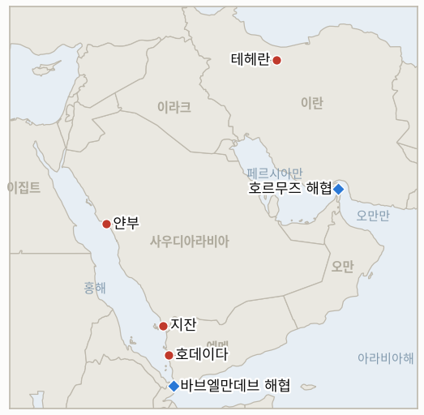

# 중동 일일 브리핑

**2026년 7월 26일**

- **보고 기간:** 약 24시간, 7월 25일 06:00 ~ 7월 26일 06:00 (한국시간)
- **종합 평가:** 같은 24시간 안에 두 가지 일이 벌어졌고, 둘은 정반대 방향을 가리킨다. 후티는 토요일 새벽 사우디 아람코의 지잔·얀부 시설에 탄도미사일과 드론을 발사해 지잔 정유공장에 화재를 일으켰고, 드론 공격으로 얀부 아람코 시노펙 정유공장의 생산이 "일시적으로 감소"했다는 사우디 에너지부의 인정을 이끌어냈다. 2022년 이후 후티가 사우디 석유 인프라를 직접 공격한 첫 사례이며, 하필 지금 한국에 가장 중요한 지점 위에 떨어졌다. 얀부는 호르무즈가 무너진 이후 한국의 우회 유조선 15척이 예외 없이 선적해온 항구다. 동시에, 아무런 발표도 설명도 없이, 미 중부사령부는 약 2주 만에 처음으로 이란 내부에 대한 야간 공습을 보고하지 않았고 역내 미군 진지에 대한 이란의 공격도 보고되지 않았다. 이 전쟁의 가장 오래된 전선이 조용해진 바로 그날 밤, 가장 새로운 전선은 사우디 영토 위로 확대됐다. 시장은 양쪽 모두에 대해 닫혀 있었다. 금요일 브렌트유 종가 97.39달러가 마지막으로 검증된 가격이며, 여러 매체가 주말 중 100달러를 다시 넘긴 호가를 보도했으나 이는 확정된 어떤 세션에도 대응하지 않는다. 이 브리핑은 토요일 종가를 기록하지 않으며 월요일 개장을 첫 실질 시험으로 취급한다. 오늘 세 개의 지표가 판정된다. 사우디·예멘 전역은 한 라운드가 아니라 전쟁이고(IND-20260725-1, 개설 하루 만에 확증), 홍해에서의 선박 차단은 단발이 아니라 전역이며(IND-20260724-2, NCC 마사호로 확증), 전력망 분기 조건은 시한이 지나도록 당겨지지 않았다(IND-20260718-1, 반증).

**정정 및 업데이트:** 7월 25일 브리핑에 대한 업데이트 한 건이다. 해당 브리핑은 사우디 주도 연합군의 호데이다 공습을 "상선에 대한 후티 공격"에 대한 대응으로 기술하며 엔셀리아호를 대표 사례로 다뤘다. 그 사이 직접적 도화선이 특정됐다. 사우디가 운항하는 **NCC 마사호**가 7월 24일 금요일 홍해에서 공격받아 선체에 경미한 손상을 입었으나 안전하게 목적지까지 항해를 이어갔다 ([Asharq Al-Awsat](https://english.aawsat.com/gulf/5299821-saudi-arabia-vessel-attacked-red-sea), [Xinhua](https://english.news.cn/20260725/0d6b6ae141ec4aacaee44dfd5d7375f6/c.html)). 7월 25일의 서술이 틀린 것은 아니었으나 당시에는 특정 선박이 확인되지 않았다. NCC 마사호는 엔셀리아호와 구별되는 별개의 공격이며 오늘 IND-20260724-2에 반영해 채점한다.

---

## 1. 무슨 일이 있었나

<figure style="float:right; width:46%; margin:2pt 0 8pt 14pt;">

<figcaption style="font-size:8pt; color:#666; text-align:center; margin-top:3pt; font-style:italic;">주요 논의 지점</figcaption>
</figure>

### 1.1 후티가 지잔과 얀부의 아람코를 타격하며 2022년 이후 사우디 석유 인프라에 대한 첫 직접 피격이 발생하다

후티 군사대변인 야히야 사리아 준장은 토요일 새벽 홍해 연안 도시 지잔과 얀부의 사우디 아람코 시설에 탄도미사일과 드론을 발사했다고 밝히며, 전날 밤 사우디 주도 연합군이 호데이다와 카마란섬을 타격한 데 대한 보복으로 규정했다 ([The National](https://www.thenationalnews.com/news/mena/2026/07/25/houthis-attack-saudi-aramco-sites-with-yemen-at-risk-of-renewed-war/), [Times of Israel](https://www.timesofisrael.com/liveblog_entry/yemens-houthis-say-they-carried-out-operations-against-aramco-facilities-in-saudis-jizan-and-yanbu/), [Maritime Executive](https://maritime-executive.com/article/houthi-rebels-claim-missile-strike-on-giant-saudi-refinery-at-jazan)). 일산 약 40만 배럴 규모의 통합 정유단지인 지잔 정유공장에서는 협정세계시 01:17경 화재가 발생했고, NASA의 FIRMS 위성 화재 탐지 시스템이 해당 지점에서 다수의 상당한 열 이상 신호를 포착했다 ([Türkiye Today](https://www.turkiyetoday.com/region/aramco-refinery-in-jazan-burns-after-houthi-missile-and-drone-strike-3224596)). 얀부의 그림은 더 엇갈린다. 사우디 방공망이 날아든 탄도미사일 두 발을 요격했으나, 에너지부는 얀부 아람코 시노펙 정유회사에 대한 드론 공격으로 "해당 정유공장의 생산이 일시적으로 감소"했다고 인정했다. 보고 기간 안에 아람코의 종합 피해 평가는 공표되지 않았다. **신뢰도: 높음** — 공격 사실, 후티의 주장, 지잔 화재, 보복이라는 명분(후티 성명, 독립적 위성 화재 탐지, 복수 매체); **신뢰도: 중간** — 요격 횟수와 얀부 피해에 대한 에너지부의 표현. 단일 출처이거나 교차 확인이 얕다; **신뢰도: 낮음** — 정제 설비와 구별되는 원유 수출 인프라의 피해 정도. 보고 기간 내 어떤 출처도 이를 규명하지 못했다.

### 1.2 워싱턴이 2주 만에 처음으로 이란에 대한 야간 공습을 중단하다

약 2주 만에 처음으로 미 중부사령부는 이란 내부에 대한 새로운 야간 공습을 발표하지 않았고, 역내 미군 진지에 대한 이란의 새로운 공격도 보고되지 않았다 ([Bloomberg](https://www.bloomberg.com/news/articles/2026-07-25/us-pauses-nightly-strikes-on-iran-as-houthis-clash-with-saudis), [CNN](https://www.cnn.com/2026/07/25/world/live-news/iran-war-trump), [South China Morning Post](https://www.scmp.com/news/world/middle-east/article/3361857/us-pauses-nightly-iran-strikes-houthis-clash-saudis), [Fortune](https://fortune.com/2026/07/25/us-military-silent-iran-airstrikes-houthi-rebels-saudi-arabia-battle-red-sea-shipping/)). 이 공습 중단은 아무런 발표도, 설명도 없이 찾아왔으며, 6월 양해각서(MOU) 붕괴와 함께 시작된 13일 연속의 공습을 끊었다. 이는 트럼프가 금요일 참모들을 소집해 "대규모 공격"을 검토한 뒤 기자들에게 테헤란이 "날이 갈수록 점점 더 진지해지고 있어" 그 공격이 필요하지 않을 수도 있다고 말한 흐름에 뒤이은 것이다. 이것이 출구인지, 전력 재정비를 위한 작전상 휴지인지, 네타냐후의 방문 시점에 맞춘 의도적 공백인지는 현재 보도만으로는 판별되지 않는다. **신뢰도: 높음** — 보고 기간 내 양측 모두 공표된 공습이 없었다는 사실(독립적인 네 개 매체에서 일관되며, 미 중부사령부의 일일 발표 관행 덕에 부재 자체가 이례적으로 관측 가능하다); **신뢰도: 낮음** — 의도에 대한 모든 해석. 보고 기간 내 어떤 출처도 귀속 가능한 근거를 제시하지 않는다.

### 1.3 두 번째 사우디 선박이 피격되며 사우디·후티 교전이 양방향 전쟁이 되다

연합군의 금요일 호데이다 공습으로 시작된 교전이 이제 연이은 날에 걸쳐 양방향으로 진행되고 있다. 그 공습의 직접적 도화선은 금요일 홍해에서 사우디가 운항하는 **NCC 마사호**가 공격받아 선체에 경미한 손상을 입고도 항해를 멈추지 않은 사건이었다 ([Asharq Al-Awsat](https://english.aawsat.com/gulf/5299821-saudi-arabia-vessel-attacked-red-sea), [Xinhua](https://english.news.cn/20260725/0d6b6ae141ec4aacaee44dfd5d7375f6/c.html)). 연합군은 자신들의 대응을 "호데이다주 내 후티 테러 민병대에 속한 합법적 군사 표적에 대한 비례적 군사 대응"이라고 규정했다. 아람코 공격 이후 연합군은 토요일 늦게 후티 군사 진지를 다시 타격했다 ([CNN](https://www.cnn.com/2026/07/25/world/live-news/iran-war-trump), [KFGO/Reuters](https://kfgo.com/2026/07/24/saudi-strikes-target-yemens-hodeidah-says-houthi-run-al-masirah-tv/)). 주예멘 사우디 대사 모하메드 알자베르는 인도적 트랙의 문은 열어뒀다. 그는 "민간 상선에 대한 비겁한 공격"을 규탄하면서도 왕국이 "사나 공항 개방을 목표로 하는 모든 구상을 계속 지지할 것"이라고 밝혔다. 예멘 전문가 바라 알샤이반은 "특히 후티가 홍해 공격을 계속하기로 하거나 사나 공항에 관한 현재 제안을 거부한다면 분쟁 재개가 가능하다"고 경고했다. **신뢰도: 높음** — NCC 마사호 피격, 연합군의 후속 공습, 인용된 발언들(사우디 국영매체, 연합군 성명, 복수 매체); **신뢰도: 중간** — 두 번째 라운드의 표적에 대한 서술. 대부분 후티가 운영하는 Al Masirah 보도에 기대고 있다.

### 1.4 네타냐후가 안보내각을 소집하고 핵 정보를 들고 워싱턴으로 향하다

베냐민 네타냐후 총리는 워싱턴 방문에 앞서 이스라엘 안보내각을 소집했다. 그는 월요일 출국해 화요일 트럼프와 회담하고 린지 그레이엄 상원의원 추도식에 참석한 뒤 수요일 귀국한다 ([Times of Israel](https://www.timesofisrael.com/liveblog-july-25-2026/), [Al Jazeera](https://www.aljazeera.com/news/2026/7/24/netanyahu-to-meet-trump-at-white-house-next-week-amid-iran-war-escalation), [Washington Times](https://www.washingtontimes.com/news/2026/jul/24/netanyahu-travel-washington-trump-meeting-lindsey-graham-funeral/)). 이스라엘 당국자들은 이란의 군사·핵 능력 복구에 관한 새로운 정보를 제시할 계획이며, 여기에는 전시에 선출된 최고지도자 모즈타바 하메네이 아래에서 무기화 지향 작업이 가속되고 있다는 자체 평가가 포함된다. 이는 외교에 더 여지를 주려 한다고 전해지는 백악관의 선호와 맞부딪힌다 ([Times of Israel](https://www.timesofisrael.com/liveblog_entry/netanyahu-planning-to-present-trump-with-intelligence-on-irans-nuclear-recovery-at-white-house-meeting-report/)). 이 방문은 이제 공습 중단 국면 한복판에 떨어지며, 그로 인해 화요일은 의례적 회담이 아니라 결정의 시점이 된다. **신뢰도: 높음** — 방문 사실, 일정, 안보내각 회의(총리실 발표, 복수 매체); **신뢰도: 중간** — 이스라엘이 제시하려는 정보의 내용과 미국이 외교를 선호한다는 서술. 둘 다 단일 매체 계열의 익명 소식통 보도에 기대고 있다.

### 1.5 닫힌 시장이 열린 채로 남은 공급 질문과 마주하다

두 공격 모두 토요일에 발생했고, 원유 선물과 서울 증시, 서울 외환시장은 모두 휴장이었다. 마지막으로 검증된 가격은 금요일 것이다. 브렌트유 97.39달러, WTI 89.78달러, 코스피 6,690.62, 원-달러 환율 1,461.3원이다. 여러 매체가 "토요일 이른 거래에서" 브렌트유가 100달러를 다시 넘겼다고 보도하며 이를 7월 한 달간 약 40% 상승으로 규정했다 ([HNGN](https://www.hngn.com/articles/272350/20260725/houthi-rebels-strike-saudi-aramco-refineries-jizan-yanbu-oil-prices-surge-past-100.htm), [TechTimes](https://www.techtimes.com/articles/321583/20260725/houthi-strike-burns-jizan-aramco-refinery-yanbu-attack-seals-saudi-arabias-oil-trap.htm)). 이 호가들은 확정된 어떤 세션에도 대응하지 않고, 이 브리핑의 1·2티어 로테이션 바깥 매체에서 나왔으므로 보도됐으나 미검증으로 기록한다. **7월 25일자 데이터 계열에는 종가를 입력하지 않으며**, 해당 날짜에 대한 Kpler의 신규 통항 수치도 공표되지 않았다. 진짜로 열려 있는 질문은 주말 호가가 아니라, 월요일 아람코의 피해 평가가 정제 손실과 수출 능력을 구분해줄 것인가다. **신뢰도: 높음** — 금요일 종가 수준과 토요일 종가의 부재; **신뢰도: 낮음** — 보도된 주말 가격 호가. 이 브리핑은 이를 데이터로 취급하지 않는다.

---

## 2. 심층 분석: 유인과 동기

### 2.1 후티는 4년간 하지 않던 아람코 공격을 왜 지금 감행했나?

리야드가 먼저 판을 바꿨고, 후티에게는 규모가 아니라 성격에서 비례하는 대응이 필요했기 때문이다. 2022년 이후 후티·사우디 관계는 양측 모두 상대의 핵심 자산을 건드리지 않는 휴전 논리 위에서 돌아갔다. 후티는 사우디 석유를 비켜갔고, 리야드는 호데이다 상공에서 손을 뗐다. 금요일 연합군의 공습이 사우디 쪽에서 그 합의를 깼다. 아람코를 때리는 것은 호데이다를 때리는 것의 정확한 거울상이다. 양쪽 모두 수익을 낳고 국제적으로 눈에 띄는 인프라이며, 이 대응은 휴전이 딛고 있던 대칭을 넘어서는 것이 아니라 복원한다. 아브카이크나 라스타누라가 아니라 지잔과 얀부를 고른 것이 이 해석을 뒷받침한다. 이들은 홍해 연안 시설, 곧 후티가 자기 것이라고 주장해온 전역 안에 있으며, 이곳을 때리는 것은 걸프 연안을 새로 여는 대신 전쟁을 홍해 축에 묶어둔다. 사리아의 "확전에는 확전으로"라는 공식은 위협인 만큼이나 천장이기도 하다.

### 2.2 리야드는 불타는 정유공장과 열린 수출 회랑을 놓고 실제로 무엇을 하는가?

리야드의 문제는 명백해 보이는 두 대응이 정반대를 가리킨다는 데 있다. 예멘에서 확전하는 것 — 사나 공항, 지도부 표적, 2015년식 전역으로의 회귀 — 은 억지력을 복원하지만, 호르무즈가 닫힌 동안 왕국에 남은 유일한 수출 회랑에 계속 불이 떨어지는 것을 보장한다. 긴장을 완화하면 회랑은 지켜지지만, 후티가 아람코를 때리고도 협상으로 빠져나갈 수 있다는 명제를 승인하게 된다. 대사가 규탄과 사나 공항 구상 재확인을 동시에 내놓은 것이 그 증거다. 리야드는 처벌 트랙과 인도적 출구를 동시에 굴리려 하고 있으며, 이는 이번 분기에 감당할 수 없는 전쟁 없이 억지력만 되찾고 싶은 국가가 하는 행동이다. 기본 시나리오는 호데이다주 내 군사 표적에 대한 조정된 한두 라운드가 더 이어지고, 공항 문제에 대한 가시적 추진이 병행되는 것이다.

### 2.3 워싱턴은 왜 말하지 않고 폭격을 멈췄을까?

발표 없는 중단은 값싼 옵션이며 바로 그 점이 핵심이다. 선언된 휴전에는 조건이 필요한데, 양해각서(MOU) 붕괴 이후 조건을 만들려던 모든 시도는 호르무즈 해협에서 죽었다. 이틀 전 이란이 이라크가 전달한 제안을 거부한 이유도 정확히 그것이 해협을 다루지 않았기 때문이다. 그냥 출격하지 않는 것은 워싱턴에 아무 비용도 들지 않고, 단 한 번의 뉴스 사이클 안에 되돌릴 수 있으며, 누구도 서명하거나 호르무즈 문제를 양보하지 않은 채 테헤란이 자제를 관측하게 해준다. 여기에는 국내 정치적 차원도 있다. 헤그세스의 약 700억 달러 요청은 이 전역이 어떻게 끝나느냐를 계속 묻고 있는 의회 앞에 놓여 있고, 조용한 한 주는 14번째 공습의 밤보다 그 대화에 더 나은 배경이다. 경쟁 가설 — 13일 연속의 밤 이후 탄약 보충과 전투 피해 평가를 위한 작전상 휴지 — 도 증거와 똑같이 정합적이며, 가용한 보도만으로는 둘을 가릴 수 없다. 이 중단을 의미 있게 만드는 것은 이란이 여기에 맞췄다는 사실이다. 미국의 일방적 중단은 신호이지만, 상호 중단은 사실상의 휴전을 이룰 원재료다. IND-20260726-1을 누군가의 선언된 의도가 아니라 재개 여부에 걸어 쓴 이유가 여기에 있다.

### 2.4 네타냐후는 무엇을 막으려 하는가?

보도된 의제가 직접 답한다. 이스라엘은 공습 중단 사흘째에, 외교에 여지를 주는 쪽으로 기울고 있다고 전해지는 백악관에 핵 능력 복구 정보를 들고 간다. 예루살렘의 우려는 이번 주의 표적이 아니라 어떤 합의든 그것이 갖게 될 형태다. 구체적으로는 호르무즈를 중심에 둔 거래가 이란의 무기 관련 작업은 손대지 않은 채, 그리고 그 프로그램을 전역 개시 이전보다 더 분산된 상태로 남겨둔 채 군사적 상황만 동결하는 시나리오다. 모즈타바 하메네이 아래에서 작업이 가속됐다는 증거를 제시하는 것은 계속하자는 논거이자, 핵 문제를 해상 접근권과 맞바꾸지 말고 어떤 틀 안에든 넣어두자는 논거다. 이는 중재자들의 설계와 충돌한다. 그 설계는 일관되게 거래적이고 해협 중심이었다. 따라서 화요일은 이번 주 예정된 사건 중 지렛대가 가장 큰 날이다. 그날 공습 중단은 이스라엘 정보와의 접촉을 견뎌낼 논리를 얻거나, 얻지 못한다.

### 2.5 사우디 수출 능력은 실제로 얼마나 위험에 놓였고, 우리는 그것을 어떻게 알 수 있나?

결정적 구분이자 보도가 아직 깔끔하게 해내지 못한 구분은 정제와 수출 사이에 있다. 지잔과 얀부 아람코 시노펙 시설은 정유공장이며, 원유를 제품으로 바꾸는 곳이다. 얀부 **원유 수출 터미널**은 같은 해안선 위의 다른 자산이고, 그곳에서 원유를 선적하는 나라에게 중요한 것은 이쪽이다. 에너지부의 인정은 명시적으로 정유공장 생산에 관한 것이었고, 얀부를 겨눈 탄도미사일은 요격됐다고 보도됐다. 이는 정제가 실질적이되 제한된 타격을 입고 원유 선적은 건드려지지 않은 시나리오와 정합한다. 반대 방향으로는, 2차 보도가 6월 기준 사우디 해상 원유 수출의 약 92%를 얀부가 차지했다고 보고 7월 13일 전후 일산 470만 배럴에 가까운 사상 최대 선적을 인용한다. 두 수치 모두 이 브리핑의 1·2티어 로테이션 바깥 매체에서 나왔으므로 확립된 사실이 아니라 방향성 참고로 다뤄야 한다. 이 문제를 매듭짓는 관측치는 성명이 아니라 숫자다. 향후 한 주간 Kpler 용선 자료에 잡히는 얀부 원유 인수 선적량이 그것이다. IND-20260726-2는 그 숫자에 걸어 쓴다.

### 2.6 한국에게는 가격과 항로 중 무엇이 먼저 깨지는가?

넉 달 동안 한국의 익스포저는 압도적으로 가격 문제였고, 7월 24일 세션은 거의 그 증명에 가까웠다. 코스피가 5.72% 빠지는 동안 원화는 오히려 *강해졌다*. 이는 자본 이탈이 아니라 포트폴리오 재배분의 지문이며, 금융위기 채널을 반증하고(IND-20260715-4) 유가 단일 전이 해석을 확증한(IND-20260721-3) 근거다. 토요일은 호르무즈 붕괴 이후 처음으로 신뢰할 만한 항로 문제를 들여왔다. 한국의 우회로는 분산돼 있지 않다. 확인된 한국 우회 선적 15건이 전부 얀부에서 이뤄졌고, 그 회랑은 이제 두 교전 당사자가 실제로 포화를 주고받는 바브엘만데브 해협을 빠져나간다. 한국 대체 원유 동맥의 양 끝이 모두 살아 있는 표적군 안에 들어왔으며, 산업통상자원부가 기대온 약 2억 7,300만 배럴의 비호르무즈 완충 물량도 상당 부분 사우디 경유다. 이것이 아직 공급 부족을 뜻하지는 않는다. 7~8월 조달은 전년 대비 110% 이상, 9월은 74% 수준으로 확보돼 있다. 그러나 위험의 성격이 바뀌며, 그 뒤를 받치는 완충재는 표면 물량이 시사하는 것보다 얇다. `korea-exposure.md`는 전략비축 잔여분을 **실제 소비 기준 약 26일분**으로 기록하고 있고, 이는 6~7월 IEA 공조로 2,250만 배럴을 이미 방출한 뒤의 수치다. 가격 충격은 경상수지와 소비자물가로 흡수되지만, 항로 충격은 재고로 흡수되며 이 수치대로라면 그 재고는 개월이 아니라 주 단위로 측정된다. 정직한 판단은 이렇다. 이번 달을 구속하는 것은 여전히 가격 문제이고, 이번 분기에 지켜봐야 할 것은 항로 문제다.

---

## 3. 한국에 대한 정책적 함의

차트는 의도적으로 금요일과 동일하다. 7월 25일은 토요일이어서 어떤 시장도 마감하지 않았고 신규 통항 수치도 공표되지 않았으므로 관측치를 추가하지 않았다. 끝점 라벨은 여전히 금요일 수준을 가리킨다.

**익스포저 현황:**

| 채널 | 기존 상태 | 토요일이 바꾼 것 |
|---|---|---|
| 원유 가격 | 브렌트유 마지막 종가 97.39달러(금); 하반기 기본 시나리오는 7월 24일 100달러로 상향 | 검증된 변화 없음. 아람코 공격이 프리미엄을 더하는지는 월요일 개장이 첫 시험 |
| 원유 항로 | 한국 우회 선적 15건 전부 얀부에서 선적, 바브엘만데브 해협으로 출구 | 회랑의 양 끝이 모두 활성 표적군 안에 들어왔고, 선적항 자체가 처음으로 피격 |
| 확보 물량 | 7~8월 전년 대비 110% 이상, 9월 74%; 비호르무즈 약 2억 7,300만 배럴 확보 | 변화 없음. 다만 비호르무즈 완충 물량이 사우디 경유에 편중돼 얀부와 상관관계가 높다 |
| 전략비축 | 실제 소비 기준 잔여 약 26일분 (CSIS 추정, 신뢰도 중간); IEA 공조로 2,250만 배럴 기방출 | 변화 없음. 항로 충격이 끌어다 쓰는 완충재가 바로 이것이다. 표면 비축 물량이 시사하는 것보다 실질적으로 얇다 |
| LNG | 라스라판 수출 동결 15일째; 7월 11일 이후 적재 호르무즈 출항 없음 | 변화 없음. 해협을 뺀 휴전에 대한 이란의 거부가 재개 경로를 계속 닫아둔다 |
| 환율·증시 | 원화 1,461.3원, 코스피 6,690.62(금); 7월 25일 금융위기 채널 반증 | 주말 동안 검증되지 않음. IND-20260725-2는 이번 주 세션들에서 진행 중 |

**사안별 함의:**

**아람코 공습에 대하여 (1.1).** 산업통상자원부와 한국석유공사는 이번 주 아람코의 공개 성명이 아니라 얀부 원유 인수 선적 자료를 실질 신호로 취급해야 한다. 한국 정유사들에게 구체적인 질문은 16번째 우회 선적이 얀부에서 진행되는지, 다른 선적항으로 전환되는지, 아니면 중단되는지다. 아람코의 평가가 정유공장 피해와 터미널 능력을 구분하고 선적이 유지된다면 회랑은 더 높은 전쟁위험 보험료를 안고 살아남는다. 인수 선적이 유의미하게 줄어든다면 약 2억 7,300만 배럴의 비호르무즈 쿠션이 계획보다 몇 주 앞서 구속 조건이 되며, 9월 조달 공백(74%)은 더 이상 편안한 숫자가 아니게 된다.

**공습 중단에 대하여 (1.2).** 진짜 긴장 완화는 100달러 기본 시나리오에 대한 단일 최대 하방 위험이며, 이 방향으로 틀렸을 때 한국이 지는 비용은 비대칭적이다. 100달러에서 내린 헤지·조달 결정은 80달러에서 되돌리기가 비싸다. 공습 중단의 향방이 정리되지 않은 상태에서, 이틀 된 가격 수준을 근거로 100달러를 공식 지침에 박아 넣는 일은 피해야 한다. 이는 IND-20260723-3이 이미 추적하고 있는 바로 그 전가 문제다.

**양방향 예멘 전쟁에 대하여 (1.3).** 바브엘만데브 해협을 지나는 한국 국적선과 한국 용선 선박은 이제 선언된 금수 조치를 집행하는 하나의 비국가 행위자가 아니라, 서로를 실제로 타격하는 두 국가가 있는 회랑을 통과한다. 전쟁위험 보험료와 용선 조건은 그 전제로 재산정해야 하며, 해양수산부의 권고 체계도 두 교전 당사자가 있는 전역을 기준으로 재검토해야 한다.

**네타냐후의 워싱턴 방문에 대하여 (1.4).** 화요일은 예정된 변동성 이벤트다. 한국 트레이딩 데스크는 이 회담을 배경 외교가 아니라 이후 한 주의 유가 경로에 대한 이항 입력으로 취급해야 한다.

**검증 가능한 지표:**

- **IND-20260726-1 — 공습 중단은 출구인가 작전상 공백인가.** *관측 지표:* 미 중부사령부의 공습 발표와 이란의 보복 보도. *확증 조건:* 상호 중단이 96시간(2026년 7월 29일경까지)에 도달하거나 공개적으로 발표된 어떤 틀이 나오면 이 중단이 진짜 출구임이 확증된다 — 통항 회복과 브렌트유 80달러대 쪽으로 가중치를 옮긴다. *반증 조건:* 2026년 7월 29일경까지 미국의 대이란 공습이 재개되거나 이란이 미군 진지를 타격하면 반증된다 — 이 중단은 작전상 공백이었고 준전시 소모전이 상시 구도다. *시한:* 2026년 7월 29일경.
- **IND-20260726-2 — 얀부 원유 수출이 유지되는가, 회랑이 닫히는가.** *관측 지표:* Kpler 및 무역 전문지의 얀부 원유 선적·인수 자료, 그리고 정제와 수출 능력을 구분하는 아람코의 피해 평가. *확증 조건:* 2026년 8월 9일경까지 얀부 원유 인수 선적이 최근 운영 수준 대비 유의미하게 떨어지거나 아람코가 원유 수출 인프라 피해를 확인하면, 한국의 우회 회랑이 단지 비싼 것이 아니라 공급 제약 상태임이 확증된다 — 비축유 방출 계획 트랙으로 격상한다. *반증 조건:* 2026년 8월 9일경까지 인수 선적이 최근 수준을 유지하고 피해가 정제에 국한되면 반증된다 — 이번 공격은 정제 사건이었고 회랑은 더 높은 프리미엄을 안고 계속 쓸 수 있다. *시한:* 2026년 8월 9일경.
- **IND-20260726-3 — 리야드는 예멘에서 확전하는가, 공항 출구를 사들이는가.** *관측 지표:* 사우디 주도 연합군의 표적군과 사나 공항 협상 트랙. *확증 조건:* 2026년 8월 9일경까지 연합군 공습이 사나, 지도부 표적, 또는 호데이다주 밖 표적으로 확대되면 2022년 이전 전역으로의 회귀가 확증된다 — 한국의 홍해 회랑은 수개월짜리 양방향 전쟁을 가격에 반영해야 한다. *반증 조건:* 2026년 8월 9일경까지 공습이 호데이다주 내 군사 표적에 국한되고 사나 공항 합의가 진전되면 반증된다 — 리야드는 억지력을 싸게 되사고 있으며 회랑은 안정된다. *시한:* 2026년 8월 9일경.

**오늘 판정:** IND-20260725-1 **확증** (사우디 영토와 인프라에 대한 후티 공습이 개설 하루 만에 확증 조건을 충족했다); IND-20260724-2 **확증** (NCC 마사호는 엔셀리아호에 이은 사우디 연계 선박에 대한 추가 검증 공격이다); IND-20260718-1 **반증** (이 전역은 7월 24일경 시한을 넘겼고 발전 설비와 전력망 자체는 끝내 타격되지 않았다).

---

## 4. 관찰 목록

- **아람코의 피해 평가.** 월요일 개장과 함께 나올 것으로 예상되며, 특히 정제와 원유 수출 능력을 구분하는지가 관건이다. 이번 주 한국에 가장 파급력이 큰 단일 문건이다.
- **공습 중단이 월요일 밤을 넘기는지.** 14번째 밤이 재개되면 IND-20260726-1은 단 한 번의 뉴스 사이클에 판정된다.
- **16번째 한국 우회 선적** (IND-20260722-1, 시한 7월 29일경). 이제는 피격된 항구에서 선적할 것인가라는 결정이다.
- **라스라판.** 동결 15일째이며 7월 11일 이후 적재 호르무즈 출항이 없다. 어떤 휴전이든 해협을 다뤄야 한다는 이란의 고집이 이 문을 계속 닫아둔다.
- **호르무즈의 바닥** (IND-20260725-3). 통항은 하루 세 척이며, 유조선 0척의 날이 확증 방아쇠다.
- **헤그세스의 약 700억 달러 요청** (IND-20260723-1)이 세출 예산 심사와 만나는 국면. 이제는 더 조용해진 군사적 배경 위에서다.
- **레바논의 두 번째 시범 구역** (IND-20260723-2). 3자 군사조정그룹과의 조율이 보도됐으나 두 번째 확인된 철군은 아직 없다.
- **아브라함 협정 조건** (IND-20260724-1). 리야드는 여전히 공개적으로 답하지 않았고, 후티와 싸우며 보낸 한 주는 이스라엘과 관계를 정상화하며 보낸 한 주가 아니다.

---

## 5. 출처 신뢰도 요약

| 주장 | 출처 | 신뢰도 |
|---|---|---|
| 후티가 지잔과 얀부의 아람코 시설에 미사일과 드론 발사, 사리아가 호데이다에 대한 보복으로 주장 | The National, Times of Israel, Maritime Executive, Washington Post (헤드라인만 확인, 본문 접근 불가) | **높음** |
| 협정세계시 01:17경 지잔 정유공장 화재, NASA FIRMS 열 이상 신호로 교차 확인 | Türkiye Today, Maritime Executive, 위성 화재 탐지 자료 | **높음** |
| 사우디 에너지부가 드론 공격으로 얀부 아람코 시노펙 생산이 일시 감소했다고 인정 | Türkiye Today, HNGN | **중간** |
| 얀부 상공에서 탄도미사일 두 발 요격 | 2차 매체를 통해 전해진 그리스 보안 소식통 보도 | **중간** |
| 사우디 원유 *수출* 능력에 대한 피해 | 보고 기간 내 어느 쪽으로도 규명하는 출처 없음 | **낮음** (미규명) |
| 미 중부사령부가 이란에 대한 야간 공습을 발표하지 않았고, 미군 진지에 대한 이란 공격도 보고되지 않음 | Bloomberg, CNN, SCMP, Fortune | **높음** |
| 공습 중단을 출구로 볼 것인가 작전상 공백으로 볼 것인가에 대한 해석 | 보고 기간 내 귀속 가능한 근거 없음 | **낮음** |
| NCC 마사호가 금요일 홍해에서 공격받아 선체에 경미한 손상 | Asharq Al-Awsat, Xinhua, 사우디 국영매체 | **높음** |
| 사우디 주도 연합군이 토요일 후티 진지를 다시 타격 | CNN, KFGO/Reuters, Al Masirah (후티 운영) | **중간** |
| 알자베르의 사나 공항 관련 발언과 "비겁한 공격" 규탄 | The National | **높음** |
| 네타냐후의 안보내각 회의와 워싱턴 방문 일정 | Times of Israel, Al Jazeera, Washington Times, 총리실 | **높음** |
| 이스라엘이 핵 능력 복구 정보를 제시하려는 의도, 미국이 외교를 선호한다는 보도 | Times of Israel (익명 소식통) | **중간** |
| 금요일 종가 수준 (브렌트유 97.39달러, WTI 89.78달러, 코스피 6,690.62, 원화 1,461.3원) | 직전 브리핑의 검증 데이터, Reuters/Yahoo, Seoul Economic Daily | **높음** |
| 주말 거래에서 브렌트유 100달러 상회 | HNGN, TechTimes (1·2티어 로테이션 바깥, 확정 세션 없음) | **낮음** — 보도됐으나 데이터로 기록하지 않음 |
| 사우디 해상 원유 수출의 약 92%가 얀부, 7월 13일경 일산 약 470만 배럴 사상 최대 선적 | TechTimes, DiscoveryAlert (1·2티어 로테이션 바깥) | **낮음~중간** — 방향성 참고 |
| 한국의 조달 현황 (7~8월 110% 이상, 9월 74%, 비호르무즈 약 2억 7,300만 배럴) | 산업통상자원부(Herald Business 및 Asia Business Daily 경유), S&P Global, UPI, korea-exposure.md | **높음** |
| 전략비축 잔여 실제 소비 기준 약 26일분 | korea-exposure.md 경유 CSIS (해당 파일에 추정치로 표기) | **중간** |
