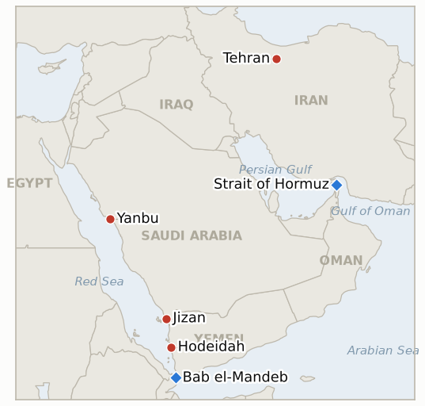

# Middle East Daily Briefing

**July 26, 2026**

- **Reporting window:** ~24 hours, July 25, 06:00 to July 26, 06:00 KST
- **Overall assessment:** Two things happened in the same twenty four hours and they point in opposite directions. The Houthis fired ballistic missiles and drones at Saudi Aramco facilities at Jizan and Yanbu before dawn Saturday, setting the Jizan refinery alight and drawing an acknowledgement from the Saudi energy ministry that a drone strike caused "a temporary reduction" in production at the Yanbu Aramco Sinopec refinery. It is the first direct Houthi attack on Saudi oil infrastructure since 2022, and it lands on the one piece of geography that matters most to Korea right now: Yanbu is where all fifteen Korean workaround tankers have loaded since the Hormuz collapse. Simultaneously, and without announcement or explanation, United States Central Command did not report overnight strikes on Iran for the first time in roughly two weeks, and no Iranian strikes on US positions were reported either. The war's oldest front went quiet on the same night its newest front escalated onto Saudi soil. Markets were closed for both. Friday's Brent settle of $97.39 is the last verified price, and several outlets reported weekend prints back above $100 that correspond to no settled session; this brief records no Saturday settle and treats Monday's open as the first real test. Three indicators resolve today: the Saudi Yemen campaign is a war rather than a round (IND-20260725-1, confirmed one day after opening), the Red Sea interdiction is a campaign rather than a one off (IND-20260724-2, confirmed on the NCC Masa), and the grid trigger stayed unpulled through its deadline (IND-20260718-1, falsified).

**Corrections and updates:** One update to the July 25 brief. That brief attributed the Saudi led coalition's Hodeidah strikes to "the Houthi attacks on commercial shipping" and discussed the Encelia as the salient case. The proximate trigger has since been named: the Saudi operated **NCC Masa** was attacked in the Red Sea on Friday July 24, sustaining minor hull damage and continuing safely to its destination ([Asharq Al-Awsat](https://english.aawsat.com/gulf/5299821-saudi-arabia-vessel-attacked-red-sea), [Xinhua](https://english.news.cn/20260725/0d6b6ae141ec4aacaee44dfd5d7375f6/c.html)). The July 25 characterisation was not wrong, but the specific vessel was unavailable at the time; the NCC Masa is a distinct attack from the Encelia and is scored today against IND-20260724-2.

---

## 1. What Happened

<figure style="float:right; width:46%; margin:2pt 0 8pt 14pt;">

<figcaption style="font-size:8pt; color:#666; text-align:center; margin-top:3pt; font-style:italic;">Major places of discussion</figcaption>
</figure>

### 1.1 Houthis Strike Aramco at Jizan and Yanbu, the First Direct Hit on Saudi Oil Infrastructure Since 2022

Houthi military spokesman Brigadier General Yahya Saree said the group fired ballistic missiles and drones at Saudi Aramco facilities in the Red Sea towns of Jizan and Yanbu before dawn on Saturday, framing the attacks as retaliation for the Saudi led coalition's strikes on Hodeidah and Kamaran Island the previous night ([The National](https://www.thenationalnews.com/news/mena/2026/07/25/houthis-attack-saudi-aramco-sites-with-yemen-at-risk-of-renewed-war/), [Times of Israel](https://www.timesofisrael.com/liveblog_entry/yemens-houthis-say-they-carried-out-operations-against-aramco-facilities-in-saudis-jizan-and-yanbu/), [Maritime Executive](https://maritime-executive.com/article/houthi-rebels-claim-missile-strike-on-giant-saudi-refinery-at-jazan)). A fire broke out at the Jizan refinery, a roughly 400,000 barrel per day integrated complex, at approximately 01:17 UTC, and NASA's FIRMS satellite fire detection system registered multiple substantial thermal anomalies at the site ([Türkiye Today](https://www.turkiyetoday.com/region/aramco-refinery-in-jazan-burns-after-houthi-missile-and-drone-strike-3224596)). At Yanbu the picture is more mixed: Saudi air defences intercepted two incoming ballistic missiles, but the energy ministry acknowledged that a drone strike on the Yanbu Aramco Sinopec Refining Company caused "a temporary reduction in the refinery's production." No comprehensive Aramco damage assessment had been published inside the window. **Confidence: High** on the attacks, the Houthi claim, the Jizan fire and the retaliation framing (Houthi statement, independent satellite fire detection, multi outlet); **Medium** on the interception count and the energy ministry's characterisation of the Yanbu damage, which rest on single or lightly corroborated sourcing; **Low** on the extent of any damage to crude export infrastructure as distinct from refining, which no source in the window establishes.

### 1.2 Washington Pauses the Nightly Strikes on Iran for the First Time in Two Weeks

For the first time in roughly two weeks, US Central Command did not announce new overnight strikes inside Iran, and no new Iranian strikes on American positions in the region were reported either ([Bloomberg](https://www.bloomberg.com/news/articles/2026-07-25/us-pauses-nightly-strikes-on-iran-as-houthis-clash-with-saudis), [CNN](https://www.cnn.com/2026/07/25/world/live-news/iran-war-trump), [South China Morning Post](https://www.scmp.com/news/world/middle-east/article/3361857/us-pauses-nightly-iran-strikes-houthis-clash-saudis), [Fortune](https://fortune.com/2026/07/25/us-military-silent-iran-airstrikes-houthi-rebels-saudi-arabia-battle-red-sea-shipping/)). The halt arrived with no announcement and no stated explanation, ending a run of thirteen consecutive nights that began when the June memorandum of understanding collapsed. It follows Trump's Friday sequence of convening advisers over a "massive attack" and then telling reporters it might not be necessary because Tehran was getting "more and more serious." Whether this is an off-ramp, an operational pause for reconstitution, or a deliberate gap timed to Netanyahu's arrival is not determinable from the reporting. **Confidence: High** on the absence of announced strikes by either side in the window (consistent across four independent outlets, and an absence CENTCOM's own daily announcements make unusually observable); **Low** on any reading of intent, which no source in the window supports with attributable evidence.

### 1.3 The Saudi Houthi Exchange Becomes a Two Way War as a Second Saudi Vessel Is Struck

The exchange that began with the coalition's Friday strikes on Hodeidah has now run in both directions across consecutive days. The proximate trigger for those strikes was an attack on the Saudi operated **NCC Masa** in the Red Sea on Friday, which caused minor hull damage and did not stop the voyage ([Asharq Al-Awsat](https://english.aawsat.com/gulf/5299821-saudi-arabia-vessel-attacked-red-sea), [Xinhua](https://english.news.cn/20260725/0d6b6ae141ec4aacaee44dfd5d7375f6/c.html)); the coalition described its response as "a proportionate military response against legitimate military targets belonging to the Houthi terrorist militia in Hodeidah governorate." After the Aramco attacks, the coalition struck Houthi military positions again later on Saturday ([CNN](https://www.cnn.com/2026/07/25/world/live-news/iran-war-trump), [KFGO/Reuters](https://kfgo.com/2026/07/24/saudi-strikes-target-yemens-hodeidah-says-houthi-run-al-masirah-tv/)). Saudi Arabia's ambassador to Yemen, Mohammed Al Jaber, held the door open on the humanitarian track, saying the kingdom would "continue to support all initiatives aimed at opening Sanaa airport" while condemning "cowardly attacks on civilian commercial ships." Yemen analyst Baraa Al Shaiban warned that "a renewed conflict is possible, especially if the Houthis decide to continue attacks in the Red Sea or if they reject the current proposals regarding Sanaa airport." **Confidence: High** on the NCC Masa attack, the coalition's follow-up strikes and the quoted statements (Saudi state media, coalition statements, multi outlet); **Medium** on the characterisation of the second round's targets, which rests largely on Houthi-run Al Masirah reporting.

### 1.4 Netanyahu Convenes the Security Cabinet and Flies to Washington with Nuclear Intelligence

Prime Minister Benjamin Netanyahu convened Israel's security cabinet ahead of a Washington trip, flying Monday for a Tuesday meeting with Trump and the memorial service for Senator Lindsey Graham, returning Wednesday ([Times of Israel](https://www.timesofisrael.com/liveblog-july-25-2026/), [Al Jazeera](https://www.aljazeera.com/news/2026/7/24/netanyahu-to-meet-trump-at-white-house-next-week-amid-iran-war-escalation), [Washington Times](https://www.washingtontimes.com/news/2026/jul/24/netanyahu-travel-washington-trump-meeting-lindsey-graham-funeral/)). Israeli officials plan to present fresh intelligence on Iran's military and nuclear recovery, including what they assess to be accelerated weapons-directed work under wartime-elected Supreme Leader Mojtaba Khamenei, against a reported White House preference to give diplomacy more room ([Times of Israel](https://www.timesofisrael.com/liveblog_entry/netanyahu-planning-to-present-trump-with-intelligence-on-irans-nuclear-recovery-at-white-house-meeting-report/)). The trip now lands squarely inside the strike pause, which makes Tuesday a decision point rather than a courtesy call. **Confidence: High** on the trip, its dates and the security cabinet meeting (PMO statements, multi outlet); **Medium** on the intelligence Israel intends to present and the characterisation of a US preference for diplomacy, both of which rest on unnamed-source reporting in a single outlet family.

### 1.5 A Closed Market Meets an Open Ended Supply Question

Both attacks landed on a Saturday, with oil futures, Seoul equities and the Seoul won market all closed. The last verified prices are Friday's: Brent $97.39, WTI $89.78, KOSPI 6,690.62, and the won at ₩1,461.3. Several outlets reported Brent trading back above $100 "in early Saturday trading" and framed it as a roughly 40% climb across July ([HNGN](https://www.hngn.com/articles/272350/20260725/houthi-rebels-strike-saudi-aramco-refineries-jizan-yanbu-oil-prices-surge-past-100.htm), [TechTimes](https://www.techtimes.com/articles/321583/20260725/houthi-strike-burns-jizan-aramco-refinery-yanbu-attack-seals-saudi-arabias-oil-trap.htm)). Those prints correspond to no settled session, come from outlets outside this briefing's Tier 1/2 rotation, and are recorded here as reported but unverified; **no settle is entered in the data series for July 25**, and no fresh Kpler transit count was published for the date either. The genuinely open question is not the weekend tape but whether Aramco's Monday damage assessment separates refining losses from export capacity. **Confidence: High** on Friday's closing levels and on the absence of a Saturday settle; **Low** on the reported weekend price prints, which this brief does not treat as data.

---

## 2. Deep Dive: Incentives and Motives

### 2.1 Why did the Houthis go after Aramco now, after four years of not doing so?

Because Riyadh changed the terms first, and the Houthis needed a response that was proportionate in kind rather than in scale. From 2022 the Houthi-Saudi relationship ran on a truce logic in which neither side hit the other's core assets: the Houthis kept off Saudi oil, and Riyadh stayed out of the air over Hodeidah. Friday's coalition strikes broke that arrangement from the Saudi side. Hitting Aramco is the exact mirror of hitting Hodeidah — each side's revenue-bearing, internationally visible infrastructure — and it restores the symmetry the truce rested on rather than escalating past it. The choice of Jizan and Yanbu rather than Abqaiq or Ras Tanura reinforces the reading: these are Red Sea facilities, inside the theatre the Houthis have claimed as their own, and striking them keeps the war on the Red Sea axis instead of opening the Gulf coast. Saree's "escalation with escalation" formula is a ceiling as much as a threat.

### 2.2 What does Riyadh actually do with a burning refinery and an open export corridor?

Riyadh's problem is that its two obvious responses point in opposite directions. Escalating in Yemen — the Sanaa airport, leadership targets, a return to the 2015 campaign — restores deterrence but guarantees continued fire on the one export corridor the kingdom has left while Hormuz is closed. De-escalating protects the corridor but ratifies the proposition that the Houthis can strike Aramco and trade their way out of it. The ambassador's simultaneous condemnation and reaffirmation of the Sanaa airport initiative is the tell: Riyadh is trying to run a punishment track and a humanitarian off-ramp at the same time, which is what a state does when it wants deterrence restored without a war it cannot afford this quarter. The base case is a further calibrated round or two on military targets in Hodeidah governorate, paired with a visible push on the airport file.

### 2.3 Why would Washington stop bombing without saying so?

An unannounced pause is a cheap option and that is the point. A declared ceasefire requires terms, and every attempt at terms since the MOU collapsed has died on the Strait of Hormuz — Iran refused the Iraqi-delivered proposal two days ago precisely because it left the strait unaddressed. Simply not flying costs Washington nothing, is fully reversible within a single news cycle, and lets Tehran observe restraint without anyone signing anything or conceding the Hormuz question. It also has a domestic dimension: Hegseth's roughly $70 billion request is sitting in front of a Congress that has been asking how the campaign ends, and a quiet week is a better backdrop for that conversation than a fourteenth strike night. The competing explanation — an operational pause for munitions and battle damage assessment after thirteen consecutive nights — is equally consistent with the evidence and cannot be distinguished from the reporting available. What makes the pause meaningful is that Iran matched it. A unilateral American halt is a signal; a mutual one is the raw material of a de facto truce, which is why IND-20260726-1 is written on the resumption question rather than on anyone's stated intent.

### 2.4 What is Netanyahu trying to prevent?

The reported agenda answers this directly: Israel is bringing nuclear-recovery intelligence to a White House that is reportedly leaning toward giving diplomacy room, three days into a strike pause. The concern in Jerusalem is not this week's targets but the shape of any settlement — specifically, that a Hormuz-centred bargain freezes the military situation while leaving Iran's weapons-relevant work intact and its programme better dispersed than before the campaign began. Presenting evidence of accelerated work under Mojtaba Khamenei is an argument for continuing, and for keeping the nuclear file inside any framework rather than trading it away for maritime access. That collides with the mediators' architecture, which has consistently been transactional and strait-focused. Tuesday is therefore the week's highest-leverage scheduled event: it is where the pause either acquires a rationale that can survive contact with Israeli intelligence, or does not.

### 2.5 How much of Saudi export capacity is genuinely at risk, and how would we know?

The critical distinction, and the one the reporting has not yet made cleanly, is between refining and export. Jizan and the Yanbu Aramco Sinopec facility are refineries; they turn crude into products. The Yanbu **crude export terminal** is a different asset on the same stretch of coast, and it is the one that matters for a country loading crude cargoes there. The energy ministry's acknowledgement was explicitly about refinery production, and the ballistic missiles aimed at Yanbu were reportedly intercepted — which is consistent with a scenario where refining took a real but bounded hit and crude loadings were untouched. Working against that, secondary reporting puts Yanbu at roughly 92% of Saudi seaborne crude exports in June and cites record loadings near 4.7 million barrels per day around July 13; both figures come from outlets outside this briefing's Tier 1/2 rotation and should be treated as directionally indicative rather than established. The observable that settles it is not a statement but a number: Yanbu crude liftings in Kpler fixture data over the coming week. IND-20260726-2 is written on that number.

### 2.6 What breaks first for Korea, the price or the route?

For four months Korea's exposure has been overwhelmingly a price problem, and the July 24 session was close to proof: the KOSPI fell 5.72% while the won *strengthened*, a portfolio-rotation signature rather than capital flight, which is what falsified the financial-crisis channel (IND-20260715-4) and confirmed the oil-only transmission read (IND-20260721-3). Saturday introduces the first credible route problem since the Hormuz collapse. Korea's workaround is not diversified: all fifteen confirmed Korean workaround liftings loaded at Yanbu, and the corridor then runs out through Bab el-Mandeb, where two belligerents are now actively exchanging fire. The two ends of Korea's alternative crude artery are now both inside live target sets, and the ~273 million barrel non-Hormuz cushion that MOTIE has been leaning on is substantially Saudi-routed. This does not yet constitute a supply shortfall — July-August procurement is secured at 110%+ of prior-year volume and September at 74% — but it changes the character of the risk, and the buffer behind it is thinner than the headline volumes suggest. `korea-exposure.md` carries strategic reserve coverage at roughly **26 days of actual consumption**, after 22.5 million barrels were already released through IEA coordination in June and July. A price shock is absorbed through the current account and CPI; a route shock is absorbed through inventory, and on that number the inventory is measured in weeks, not months. The honest read is that the price problem is still the binding one this month and the route problem is the one to watch this quarter.

---

## 3. Policy Implications for South Korea

The chart is unchanged from Friday by design: July 25 was a Saturday, no market settled, and no fresh transit count was published, so no observation was appended. The endpoint labels still read Friday's levels.

**Exposure snapshot:**

| Channel | Standing position | What Saturday changed |
|---|---|---|
| Crude price | Brent last settled $97.39 (Fri); H2 base case moved to $100 on 07-24 | Nothing verified; Monday's open is the first test of whether the Aramco attacks add a premium |
| Crude route | All 15 Korean workaround liftings loaded at Yanbu, exiting via Bab el-Mandeb | Both ends of the corridor now sit inside active target sets; loading port itself struck for the first time |
| Volumes secured | Jul-Aug 110%+ of prior-year volume; September at 74%; ~273m bbl non-Hormuz secured | Unchanged, but the non-Hormuz cushion is disproportionately Saudi-routed and therefore correlated with Yanbu |
| Strategic reserve | ~26 days of actual consumption remaining (CSIS estimate, Medium confidence); 22.5m bbl already released via IEA coordination | Unchanged, and this is the buffer a route shock draws down. Materially thinner than headline reserve-volume figures imply |
| LNG | Ras Laffan export freeze at day 15; no laden Hormuz exit since 07-11 | Unchanged; Iran's refusal of a strait-silent truce keeps the resumption path closed |
| FX and equities | Won ₩1,461.3, KOSPI 6,690.62 (Fri); financial-crisis channel falsified 07-25 | Untested over the weekend; IND-20260725-2 runs on this week's sessions |

**Implications by development:**

**On the Aramco strikes (1.1).** MOTIE and KNOC should treat Yanbu crude lifting data, not Aramco's public statement, as the operative signal this week. The specific question for Korean refiners is whether the sixteenth workaround lifting proceeds from Yanbu, diverts to another loading port, or is suspended. If Aramco's assessment separates refinery damage from terminal capacity and loadings hold, the corridor survives at a higher war-risk premium. If liftings drop materially, the ~273 million barrel non-Hormuz cushion becomes the binding constraint several weeks earlier than planned, the September procurement gap (74%) stops being a comfortable number, and the ~26 day strategic reserve is what stands behind both.

**On the strike pause (1.2).** A genuine de-escalation is the single largest downside risk to the $100 base case, and Korea's exposure to being wrong in that direction is asymmetric: hedging and procurement decisions taken at $100 are expensive to unwind at $80. Authorities should avoid embedding $100 into official guidance on the strength of a two-day-old price level while the pause is unresolved — which is precisely the passthrough question IND-20260723-3 already tracks.

**On the two-way Yemen war (1.3).** Korean-flagged and Korean-chartered transits through Bab el-Mandeb are now routed through a corridor with two states actively striking each other, rather than one non-state actor enforcing a declared embargo. War-risk premiums and charter terms should be repriced on that basis, and the Ministry of Oceans and Fisheries advisory framework should be reviewed against a two-belligerent theatre.

**On Netanyahu's Washington trip (1.4).** Tuesday is a scheduled volatility event. Korean desks should treat the meeting as a binary input to the oil path for the following week rather than background diplomacy.

**Testable indicators:**

- **IND-20260726-1 — The pause is an off-ramp or an operational gap.** *Metric:* CENTCOM strike announcements and Iranian retaliation reporting. *Confirmation:* a mutual halt reaching 96 hours (through ~2026-07-29) or any publicly announced framework, confirms the pause is a genuine off-ramp — reweight toward transit recovery and Brent in the $80s. *Falsification:* resumption of US strikes on Iran, or Iranian strikes on US positions, by ~2026-07-29 falsifies — the pause was an operational gap and the sub-war grind is the standing regime. *Deadline:* ~2026-07-29.
- **IND-20260726-2 — Yanbu crude exports hold or the corridor closes.** *Metric:* Kpler/trade-press Yanbu crude loading and lifting data, plus any Aramco damage assessment separating refining from export capacity. *Confirmation:* Yanbu crude liftings falling materially below their recent run rate, or Aramco confirming damage to crude export infrastructure, by ~2026-08-09 confirms Korea's workaround corridor is supply-constrained rather than merely expensive — escalate to the reserve-release planning track. *Falsification:* liftings holding near recent levels with damage confined to refining through ~2026-08-09 falsifies — the attack was a refining event and the corridor stays usable at a higher premium. *Deadline:* ~2026-08-09.
- **IND-20260726-3 — Riyadh escalates in Yemen or buys the airport off-ramp.** *Metric:* Saudi-led coalition target sets and the Sanaa airport negotiation track. *Confirmation:* coalition strikes extending to Sanaa, leadership targets, or targets outside Hodeidah governorate by ~2026-08-09 confirms a return to the pre-2022 campaign — Korea's Red Sea corridor prices a multi-month two-way war. *Falsification:* strikes remaining confined to Hodeidah-governorate military targets and a Sanaa airport arrangement advancing through ~2026-08-09 falsifies — Riyadh is buying deterrence back cheaply and the corridor stabilises. *Deadline:* ~2026-08-09.

**Resolved today:** IND-20260725-1 **Confirmed** (Houthi strikes on Saudi territory and infrastructure met the confirmation condition one day after opening); IND-20260724-2 **Confirmed** (the NCC Masa is a further verified attack on a Saudi-linked vessel after the Encelia); IND-20260718-1 **Falsified** (the campaign ran past its ~07-24 deadline with energy generation and the grid proper never struck).

---

## 4. Watch List

- **Aramco's damage assessment**, expected with Monday's market open, and specifically whether it distinguishes refining from crude export capacity. This is the week's single most consequential document for Korea.
- **Whether the strike pause survives Monday night.** A fourteenth night resuming would resolve IND-20260726-1 in a single news cycle.
- **The sixteenth Korean workaround lifting** (IND-20260722-1, deadline ~07-29), now a decision to load at a port that has been struck.
- **Ras Laffan**, frozen at day 15 with no laden Hormuz exit since July 11. Iran's insistence that any truce address the strait keeps this closed.
- **The Hormuz floor** (IND-20260725-3): transits at three vessels a day, with a zero-tanker day the confirmation trigger.
- **Hegseth's ~$70bn request** (IND-20260723-1) as it meets appropriations markups, now against a quieter military backdrop.
- **Lebanon's second pilot zone** (IND-20260723-2): coordination reported with the trilateral Military Coordination Group, no second verified withdrawal yet.
- **The Abraham Accords condition** (IND-20260724-1): Riyadh has still not responded publicly, and a week spent fighting the Houthis is not a week spent normalising with Israel.

---

## 5. Source Quality Summary

| Claim | Sources | Confidence |
|---|---|---|
| Houthis fired missiles and drones at Aramco facilities at Jizan and Yanbu; Saree claimed them as retaliation for Hodeidah | The National, Times of Israel, Maritime Executive, Washington Post (headline only; full text inaccessible) | **High** |
| Fire at the Jizan refinery ~01:17 UTC, corroborated by NASA FIRMS thermal anomalies | Türkiye Today, Maritime Executive, satellite fire-detection data | **High** |
| Saudi energy ministry acknowledged a drone strike caused a temporary production reduction at Yanbu Aramco Sinopec | Türkiye Today, HNGN | **Medium** |
| Two ballistic missiles intercepted over Yanbu | Reporting attributed to Greek security sources via secondary outlets | **Medium** |
| Damage to Saudi crude *export* capacity | No source establishes this either way in the window | **Low** (unestablished) |
| CENTCOM announced no overnight strikes on Iran; no Iranian strikes on US positions reported | Bloomberg, CNN, SCMP, Fortune | **High** |
| Interpretation of the pause as an off-ramp versus an operational gap | No attributable evidence in the window | **Low** |
| NCC Masa attacked in the Red Sea Friday with minor hull damage | Asharq Al-Awsat, Xinhua, Saudi state media | **High** |
| Saudi-led coalition struck Houthi positions again on Saturday | CNN, KFGO/Reuters, Al Masirah (Houthi-run) | **Medium** |
| Al Jaber's Sanaa airport statement and "cowardly attacks" condemnation | The National | **High** |
| Netanyahu security cabinet and Washington trip dates | Times of Israel, Al Jazeera, Washington Times, PMO | **High** |
| Israeli intent to present nuclear-recovery intelligence; reported US preference for diplomacy | Times of Israel (unnamed sources) | **Medium** |
| Friday closing levels (Brent $97.39, WTI $89.78, KOSPI 6,690.62, won ₩1,461.3) | Prior brief's verified data, Reuters/Yahoo, Seoul Economic Daily | **High** |
| Brent above $100 in weekend trade | HNGN, TechTimes (outside Tier 1/2 rotation; no settled session) | **Low** — reported, not recorded as data |
| Yanbu at ~92% of Saudi seaborne crude exports; ~4.7m b/d record loadings ~July 13 | TechTimes, DiscoveryAlert (outside Tier 1/2 rotation) | **Low to Medium** — directionally indicative |
| Korean procurement position (Jul-Aug 110%+, September 74%, ~273m bbl non-Hormuz) | MOTIE via Herald Business and Asia Business Daily, S&P Global, UPI, korea-exposure.md | **High** |
| Strategic reserve coverage ~26 days of actual consumption | CSIS via korea-exposure.md (flagged there as an estimate) | **Medium** |
