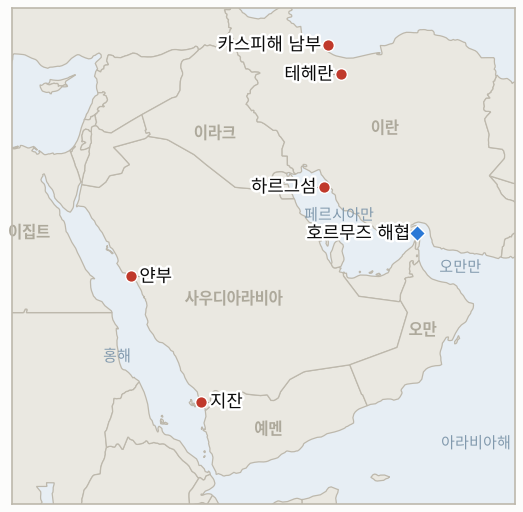

# 중동 일일 브리핑

**2026년 7월 27일**

- **보고 기간:** 약 27시간, 7월 26일 06:00 ~ 7월 27일 09:00 (한국시간)
- **종합 평가:** 전쟁이 멈췄고, 처음으로 그 군사적 이유가 문서화됐다. Axios는 일요일, 브래드 쿠퍼 미 중부사령관이 국방부·합참·백악관에 호르무즈 폭격 전역을 중단하라고 건의했다고 보도했다. 워싱턴이 본격적인 전면 전투로 확대할 준비가 되어 있지 않다면 중단해야 한다는 것이며, 근거는 전역에 지정된 표적의 약 80%가 이미 타격됐고 현 수준의 작전 템포를 유지하는 데 전략적 목적이 없다는 판단이었다. 트럼프는 금요일에 중단을 지시했고, 일요일은 미국의 이란 공습도, 바레인·요르단·쿠웨이트에 대한 이란의 공격도 없는 이틀째 밤이 됐다. 이란 당국자는 로이터에 미국이 사격을 멈추는 한 테헤란도 멈출 것이라고 말했다. 이는 실질적인 상호 중단이지만, 양측 모두 합의가 아니라 "조용함에는 조용함으로"라고 부르고 있으며, 그 근거로 제시된 것은 타결이 아니라 표적 소진과 요격 미사일 부족이다. 시장은 이를 진짜로 받아들였다. 브렌트유는 일요일 전자거래 재개 직후 4.9% 떨어진 92.02달러를 기록했고 월요일 아시아 시간대에는 80달러대 후반까지 밀리며, 한 세션 만에 7월 전쟁 프리미엄의 약 3분의 1을 반납했다. 데탕트 해석에 반하는 두 가지가 있다. 트럼프는 일요일 내내 미국이 탄약 부족을 겪고 있다는 보도를 부인하면서, 이란 원유 수출의 거의 전부를 처리하는 터미널이자 이 전역이 한 번도 건드리지 않은 유일한 표적군인 하르그섬을 미군이 파괴하는 AI 생성 이미지를 올렸다. 그리고 우크라이나가 카스피해에서 이란 연계 선박에 대한 장거리 타격을 주장해 선원 1명이 사망했고, 테헤란은 대사대리를 초치하고 보복을 경고했다. 워싱턴이 통제하지 못하는 두 번째 전선이 이란의 후방 보급선 위에 열린 것이다. 한국에 이번 주의 질문은 휴지 상태가 유지되느냐가 아니라 아람코가 얀부에서 무슨 일이 있었는지 끝내 말하느냐다. 피격 이틀이 지나도록 정유 손상과 원유 수출 능력을 구분한 피해 평가는 나오지 않았고, 얀부는 한국의 우회 선적 15회가 모두 이뤄진 항구다.

**정정 및 업데이트:** 두 건이며 모두 서술이 아니라 데이터에 관한 것이다.

1. **원/달러, 7월 24일.** 7월 25일 브리핑은 금요일 원화 종가를 ₩1,461.3으로 기록했다. Trading Economics 시세였으나 함께 제시된 변동률이 그 수준과 끝내 맞지 않았다. 국내 두 매체는 실제 종가를 **₩1,466.6, 전일 대비 0.2원 하락**으로 전한다 ([Businesskorea](https://www.businesskorea.co.kr/news/articleView.html?idxno=273576), [연합인포맥스 via Nate](https://news.nate.com/view/20260724n23369)). `data/observations.csv`를 직접 수정했다. 이는 반올림 오차 이상의 문제다. 원화는 증시 급락 속에서 5원 강세를 보인 것이 아니라 사실상 보합이었고, 이는 7월 25일과 26일 브리핑이 제시한 것보다 약한 형태의 외환·증시 디커플링이다.
2. **9월 원유 도입 물량.** 7월 26일 노출 현황표는 9월 확보율을 74%로 실었는데, 이는 UPI가 7월 16일에 보도한 7월 14일 기준 수치다. `instructions/korea-exposure.md`에는 이미 최신 수치가 있다. **7월 21일 기준 약 90% 확보**(헤럴드경제 등을 통한 산업통상부 발표)다. 한국의 9월 포지션은 어제 브리핑이 제시한 것보다 실질적으로 여유가 있다.

---

## 1. 무슨 일이 있었나

<figure style="float:right; width:46%; margin:2pt 0 8pt 14pt;">

<figcaption style="font-size:8pt; color:#666; text-align:center; margin-top:3pt; font-style:italic;">주요 논의 지점</figcaption>
</figure>

### 1.1 휴지 상태가 '조용함에는 조용함으로'로 굳어지고, 중부사령부가 먼저 중단을 건의했음이 드러나다

미국의 이란 공습 발표도, 이란의 보복도 없는 이틀째 밤이 지났고, 처음으로 그 이유가 기록에 남았다. Axios는 일요일 그의 입장을 아는 소식통 2명을 인용해, 브래드 쿠퍼 미 중부사령관이 국방부·합참·백악관에 호르무즈 일대 폭격 전역을 중단하라고 촉구했다고 보도했다. 워싱턴이 본격적인 전면 전투로 확대할 준비가 되어 있지 않다면 중단해야 한다는 것으로, 2주간의 공습이 "상선과 군함을 공격할 이란의 능력을 상당히 감소"시켰고, 에픽 퓨리 작전에 지정된 표적의 약 80%가 이미 타격됐으며, 더 넓은 전역 없이 제한적 공습을 이어가는 것은 전략적 목적이 없다는 판단이었다 ([Axios via Ynet](https://www.ynetnews.com/article/sj0copqbgl), [Times of Israel](https://www.timesofisrael.com/liveblog_entry/report-centcom-chief-urged-halt-to-hormuz-campaign-unless-us-prepared-to-escalate/)). 댄 케인 미 합참의장은 별도로 방공 요격 미사일 부족이 미군의 방어 능력을 저해할 수 있다고 비공개로 경고했으며, 뉴욕타임스도 이를 중단의 배경으로 보도했다. 트럼프는 확전 쪽으로 기울었다가 목요일 저녁 입장을 바꿨고 금요일에 공식적으로 중단을 지시했다. 이란의 자세도 이에 대응한다. 모하마드 아크라미니아 이란 육군 대변인은 "우리 전략은 본질적으로 보복적이었다. 우리도 보복 작전을 중단했다"고 말했고, 이란 당국자는 로이터에 미국이 그렇게 하는 한 테헤란도 사격을 멈출 것이라며 "비관보다는 회의"라고 표현했다 ([Al Jazeera](https://www.aljazeera.com/news/2026/7/26/us-and-iran-hit-pause-on-strikes-for-second-day)). 지난 2주간 이란 보복의 대부분을 흡수한 바레인·요르단·쿠웨이트도 밤사이 공격이 없었다고 보고했다. **신뢰도: 높음** — 이틀간의 상호 중단과 인용된 이란·미국 발언(복수 매체, 그리고 중부사령부의 일일 발표 관행 덕분에 부재 자체가 이례적으로 관측 가능하다); **중간** — 쿠퍼의 건의, 80% 수치, 케인의 경고는 Axios의 익명 소식통 2명과 다른 곳의 익명 소식통 보도에 의존한다; **낮음** — 이것이 타결로 이어질지 여부.

### 1.2 일요일 전자거래 재개와 함께 유가가 7월 전쟁 프리미엄의 3분의 1을 반납하다

거래가 재개되는 순간 원유는 전쟁 프리미엄을 반납했다. 9월 인도분 브렌트유는 일요일 전자거래 재개 직후 4.9% 하락한 **92.02달러**, 9월 인도분 WTI는 5.6% 하락한 **84.34달러**, 10월 인도분 브렌트유는 4.6% 하락한 87.48달러를 기록했다 ([AP via ABC News](https://abcnews.com/US/wireStory/oil-prices-ease-after-us-iran-pause-attacks-135106927)). 하락은 월요일 아시아 시간대까지 이어져 브렌트유는 한때 7% 떨어진 90달러 아래까지 밀렸다가 91.95달러 수준으로 낙폭을 줄였다 ([Trading Economics](https://tradingeconomics.com/commodity/brent-crude-oil)). 지난주 5월 이후 최고치였던 장중 102달러에서 약 10달러 낮은 수준이며, 40% 가까이 오른 7월의 약 3분의 1을 되돌린 것이다. 다만 위기 이전 가격으로 돌아간 것은 아니다. 브렌트유는 여전히 월간 약 24%, 전년 대비 약 33% 높고, 미국 일반 휘발유는 7월 26일 갤런당 4.11달러로 한 달 전 3.90달러보다 비싸며, 이번 보고 기간 안에 확정된 정산가는 없다. **신뢰도: 높음** — 제시된 가격과 변동률(AP 통신, 월요일 연장분은 Trading Economics로 교차 확인); **높음** — 보고 기간 내 정산가 부재; **중간** — 이 움직임 전체를 휴지 상태에 돌리는 해석. 금요일의 3.3% 하락이 이미 중재 트랙을 반영하기 시작했기 때문이다.

### 1.3 트럼프가 탄약 부족을 부인하며 하르그섬이 불타는 AI 생성 이미지를 올리다

요격 미사일 부족이 중단을 이끌었다는 보도에 맞서, 트럼프는 트루스 소셜에 "우리는 세계 어느 나라보다, 그리고 필요한 것보다 훨씬 많은 탄약을 갖고 있다"고 썼고, 미군이 **하르그섬**의 이란 석유 인프라를 파괴하는 AI 생성 이미지를 연속으로 올렸다. 일부에는 "이제 우리 유조선이다"라는 문구가 달렸다 ([Times of Israel](https://www.timesofisrael.com/liveblog-july-26-2026/), [Al Jazeera](https://www.aljazeera.com/news/liveblog/2026/7/26/iran-war-live-tehran-summons-ukraine-diplomats-over-caspian-sea-attack)). 하르그섬은 이란 원유 수출의 거의 전부를 처리하며, 5개월의 전쟁 동안 이 전역이 눈에 띄게 한 번도 타격하지 않은 유일한 표적군이다. 이란 측에서 끝까지 유보됐던 발전 시설의 대응물인 셈이다. 군이 요청한 휴지 상태 사흘째에, 실행되지 않은 공격의 합성 이미지를 게시하는 것은 작전 비용이 전혀 들지 않는 위협이며, 협상을 통한 호르무즈 재개방이 이란에 조금이라도 의미를 가지려면 테헤란이 가장 온전히 지켜야 할 자산을 겨냥한다. **신뢰도: 높음** — 게시물, 인용문, 하르그섬이라는 소재(복수 매체, 원 게시물); **높음** — 하르그섬의 이란 수출 내 역할(오랜 공개 기록); **낮음** — 이것이 의도된 표적군을 의미하는지 협상 압박인지 여부.

### 1.4 우크라이나의 카스피해 타격이 이란의 후방 보급선 위로 또 하나의 전쟁을 끌어들이다

이란 외무부는 토요일 카스피해에서 이란 상선을 공격해 폭발로 선원 1명이 사망하고 1명이 부상한 사건을 "적대적이고 범죄적인" 행위로 규정하며 주테헤란 우크라이나 대사대리를 초치했다 ([Al Jazeera](https://www.aljazeera.com/news/2026/7/25/iran-accuses-ukraine-of-deadly-attack-on-caspian-commercial-vessel), [CNBC](https://www.cnbc.com/2026/07/26/ukraine-strikes-iranian-vessels-tehran-accuses-kyiv-of-hostile-act.html), [Military Times](https://www.militarytimes.com/global/mideast-africa/2026/07/26/iran-says-ukrainian-attack-on-vessel-in-caspian-sea-killed-sailor/)). 볼로디미르 젤렌스키 대통령은 카스피해에서의 장거리 타격으로 "매우 강력한 성과"를 거뒀다며 "이란이 관여한 군수 화물 운송에 사용된 선박들과 군함 한 척"을 타격했다고 밝혔고, 주이스라엘 우크라이나 대사는 표적이 된 선박이 이란행 드론·미사일 부품을 싣고 있었다고 말했다 ([The National](https://www.thenationalnews.com/news/europe/2026/07/26/ukraine-claims-caspian-sea-attack-on-ships-carrying-iranian-military-hardware-to-russia/)). 테헤란은 이 공격이 이스라엘의 사주로 이뤄졌다고 규정하며 보복을 경고했고 ([Ynet](https://www.ynetnews.com/article/r1o143qrmg)), 젤렌스키는 별도로 러시아가 걸프 국가들과 미군 시설의 위성 영상을 이란에 넘겨왔다고 주장했다. 카스피해는 이란이 러시아로 이어지는 제재 저항적 후방 통로이며, 물리적으로 미국과 이스라엘의 사정권 밖이고 어떤 호르무즈 합의의 대상도 아니다. 워싱턴이 거래 대상으로 내놓을 수 없고 키이우가 공격을 멈출 이유도 없는 경로라는 뜻이다. **신뢰도: 높음** — 초치, 사망자, 젤렌스키의 주장(이란 외무부 성명, 우크라이나 대통령실 발표, 복수 매체); **중간** — 화물 내용물. 우크라이나 측 진술에만 근거한다; **낮음** — 이스라엘 사주 주장. 독립적 뒷받침이 없는 이란 측 규정이다.

### 1.5 아람코가 지잔과 얀부에 대해 침묵하는 사이 네타냐후가 워싱턴으로 향하다

후티의 미사일·드론 공격 이틀 뒤에도 사우디 아람코와 사우디 정부 어느 쪽도 지잔이나 얀부에 대한 피해 평가, 인명 피해, 생산 영향을 발표하지 않았다. 얀부 아람코 시노펙의 "일시적 생산 감소" 인정이 유일한 공식 입장이며, 그것은 정유에 관한 것이다. 얀부 상공에서 탄도미사일 2발을 요격한 주체는 그리스가 운용하는 패트리엇 포대로 전해진다 ([Al Jazeera](https://www.aljazeera.com/news/2026/7/26/new-front-in-us-iran-war-escalates-as-houthis-fire-at-saudi-oil-facilities)). AFP가 보도한 Kpler 데이터는 6월 기준 얀부가 사우디 해상 원유 수출의 약 92%를 차지한다고 본다. 그렇다면 원유 수출 능력이 조금이라도 손상됐는지라는 미답의 질문이 아시아 수입국들에게 가장 중대한 미결 사안이 된다. 한편 네타냐후 총리는 화요일 백악관 회담에서 이란 핵 프로그램에 대한 "끊임없는, 끊임없는 감시"를 유지하라고 트럼프에게 촉구하겠다고 밝혔다 ([Bloomberg](https://www.bloomberg.com/news/articles/2026-07-26/netanyahu-to-press-trump-to-keep-watch-on-iran-s-nuclear-aims)). 공습 재개가 아니라 감시와 이행 강제를 주장하는 틀이며, 이스라엘이 휴지 상태에 맞서기보다 그 안에 자리를 잡으려 한다는 신호로 읽힌다. **신뢰도: 높음** — 아람코·사우디 피해 평가의 부재와 네타냐후의 발언 취지(복수 매체, 직접 인용); **중간** — 그리스 패트리엇 귀속과 얀부 92% 수출 비중(각각 단일 매체와 통신사 보도); **낮음** — 원유 수출 능력에 관한 모든 추론. 어느 방향으로도 확인되지 않았다.

---

## 2. 심층 분석: 유인과 동기

### 2.1 미군은 왜 중단을 요청했고, 그것은 이 전역이 무엇을 위한 것이었는지에 대해 무엇을 말해주는가?

쿠퍼의 논리가 인상적인 것은 그것이 정치적 논거가 아니기 때문이다. 그는 이 전역이 현명하지 않다거나, 비례적이지 않다거나, 외교적으로 역효과라고 말하지 않았다. 표적이 떨어졌다고 말했다. 에픽 퓨리 작전 표적 목록의 약 80%가 타격됐고, 선박을 공격할 이란의 능력은 상당히 저하됐으며, 남은 20%는 본격적 전투로 확대하겠다는 결정이 없는 한 야간 출격을 계속할 근거가 되지 못한다. 이는 한정된 목표 — 호르무즈 일대 이란의 대선박 능력 제압 — 를 부여받고 그 끝에 도달한 지휘관의 논리다.

그렇다면 이 전역은 애초에 정치적 결과를 강제하려는 시도가 아니었다는 결론이 따른다. 발전 시설과 국가 전력망, 지도부를 의도적으로 비껴간 13일 연속 공습은 목표에 미달한 강압 전역이 아니라, 완료된 제압 전역이었다. 이는 이 브리핑이 열흘 동안 추적하며 반복적으로 '자제'로 채점해온 패턴에 대한 가장 깔끔한 설명이다. 유보된 표적군들은 나중의 확전을 위해 남겨둔 사다리 칸이 아니라 애초에 임무 밖이었다. 어제 전력망에서 반증된 IND-20260718-1과 첫 미군 전사 이후 표적군 이탈에서 반증된 IND-20260719-1은 돌이켜보면 존재하지 않는 확전 사다리를 시험한 지표였던 셈이다.

이 해석에는 불편한 따름정리가 있다. 완료됐기 때문에 끝나는 전역은 거래됐기 때문에 끝나는 전역과 같은 방식으로 지렛대를 만들지 못한다. 워싱턴은 이제 지정 표적을 다 소진한 채, 케인 합참의장이 우려한다고 전해지는 요격 미사일 재고를 안고, 이란의 남은 능력 — 핵 인프라, 지도부, 전력망 — 을 양보로 거래한 것이 아니라 미래의 표적으로 남긴 채 외교에 들어간다. 휴지는 실재하지만, 그것이 만들어낸 지렛대는 투하량이 시사하는 것보다 얇다.

### 2.2 테헤란은 왜 휴지를 이용하지 않고 맞춰주고 있는가?

이란의 프레이밍은 연습된 것처럼 일관돼 왔다. 아크라미니아의 "우리 전략은 본질적으로 보복적이었다"는 7월 중순 이후 모든 이란의 공격을 반응적 틀 안에 놓으며, 미국의 공습이 멈추는 순간 보복을 중단하는 것은 그 이야기의 논리적 완결이다. 사격을 멈춘 적에게 사격을 멈추는 데는 아무 비용이 들지 않고, 2주간 흡수한 피해를 절제된 자제라는 주장으로 전환할 수 있다.

물질적 계산도 같은 방향을 가리킨다. 이란은 방공망이 눈에 띄게 막지 못하는 공습 아래에서 2주를 보냈고, 이 전역이 끝내 건드리지 않은 자산이 하나 있다. 하르그섬과 그 뒤의 수출 능력이다. 교전이 하루 더 이어질 때마다 이란의 입지를 개선하지 못한 채 그 자산이 위험해졌고, 트럼프의 일요일 이미지는 그 위험을 가장 노골적인 방식으로 명시했다. 한편 이란의 지렛대 수단 — 호르무즈 봉쇄 — 은 총성이 멎어 있는 동안 유지 비용이 들지 않는다. 테헤란은 해협을 닫아둔 채, 공습을 흡수하는 일을 멈추고, 5개월째 이어지는 요충지 봉쇄에 대한 세계의 인내가 닳아가는 만큼 재개방의 값을 올릴 수 있다. 싸우는 것보다 엄격히 나은 위치다.

함께 보도된 회의론도 합리적이다. 이란은 6월 중순의 양해각서가 무너지고, 7월 11일 무스카트 라운드가 실패하고, "선의의 제스처"가 아무것도 낳지 못하는 것을 지켜봤다. 바흐가이는 ORF에 과거의 외교적 노력이 "배신당했다"고 말했다. 미국이 멈추는 한 사격을 멈추겠다면서 "비관보다는 회의"라고 표현하는 당국자는, 무기한 유지할 수도 있고 즉시 버릴 수도 있는 자세를 묘사하고 있다. 상대를 신뢰하지 않는 당사자가 취해야 할 바로 그 자세다.

### 2.3 아무도 서명하지 않은 휴지에 시장은 왜 이렇게 크게 움직였는가?

시장이 가격에 반영해온 것은 전쟁이 아니라 수출 능력의 파괴였고, 휴지는 그 파괴가 일어날 경로를 제거하기 때문이다. 7월의 상승은 두 겹으로 지어졌다. 첫 겹은 호르무즈 봉쇄, 즉 물량 문제다. 이란의 집행이 해상 원유의 약 5분의 1을 정상 경로로 움직이지 못하게 한다. 둘째 겹은 지난 열흘 사이 더해진 것으로, 홍해 우회로마저 파괴될 가능성이다. 먼저 후티의 봉쇄 선언으로, 다음에는 사우디 정유공장에 미사일이 떨어지면서다. 브렌트유 100달러는 두 겹이 동시에 살아 있어야 성립하는 가격이었다.

휴지는 호르무즈를 다시 열지 않는다. 다만 이란이 물러서 있다면 사우디·후티 교전이 가장 그럴듯한 확전 후원자를 잃기 때문에, 둘째 겹이 겹쳐 커질 가능성이 낮아진다. 기저 차질은 남긴 채 꼬리 위험만 제거하는 것은 정확히 70달러대로 돌아가는 것이 아니라 90달러 부근에서 멈추는 10달러짜리 움직임이다. 전쟁 이전 대비 남은 20달러는 봉쇄 그 자체이며, 유조선이 실제로 통과하기 전까지는 가격에서 빠지지 않는다.

그 아래에는 한국 정책 담당자가 명시해야 할 재귀적 문제가 있다. 이 휴지는 서명된 문서 없이 "조용함에는 조용함으로"로 지탱되고 있고, 이는 가격 안도가 어느 쪽이든 하룻밤에 무비용으로 끝낼 수 있는 조건에 매여 있다는 뜻이다. 이미 데탕트를 반영해버린 시장은 그만큼 다시 오를 여지가 크다. 비대칭은 소비국에 불리하다. 여기서 하방은 봉쇄가 막고 있지만, 상방을 막는 것은 아무것도 없다.

### 2.4 카스피해는 왜 규모가 시사하는 것보다 중요한가?

카스피해는 워싱턴도 테헤란도 협상 테이블에 올릴 수 없는 이란 입지의 일부다. 내륙해이며 러시아·카자흐스탄·투르크메니스탄·아제르바이잔에 둘러싸여 있고, 모스크바와 테헤란 사이의 군수 교통을 실어 나른다. 드론 관계를 떠받쳐온 것도, 젤렌스키의 주장에 따르면 걸프 국가들과 미군 기지의 위성 영상에까지 이르는 정보 관계를 떠받치는 것도 이 통로다. 우크라이나는 이곳을 계속 공격할 능력과 동기를 모두 갖고 있고, 오만이 무엇을 중재하든 거기에 걸린 이해가 전혀 없다.

이는 어떤 미·이란 합의에도 구조적 누수를 만든다. 중재자들이 이란이 해협을 열고 미국이 봉쇄를 푸는 합의를 만들어낸다고 가정하자. 이란·러시아 항로를 타격할 키이우의 유인은 그 합의로 달라지지 않으며, 우크라이나 드론에 죽은 이란 선원은 여전히 죽은 이란 선원이다. 우크라이나가 이스라엘의 사주로 움직였다는 테헤란의 주장은 — 뒷받침되지 않지만 유용하다 — 제3자의 공격이 얼마나 빠르게 본 분쟁의 서사로 흡수될 수 있는지를 보여준다. 카스피해 사건을 고려하지 않은 어떤 틀도, 어느 서명 당사자도 통제하지 못하는 재개 방아쇠를 내장한 채 출발한다.

한국 독자에게 실질적인 요점은, 휴지의 지속성이 IND-20260726-1이 시험하는 미국과 이란의 의도만의 함수가 아니라는 것이다. 그것은 중동 관찰자에게 보이지 않고 이 문서의 다른 모든 것과 상관관계가 없는 우크라이나의 작전 템포의 함수이기도 하다.

### 2.5 아람코는 왜 아무 말도 하지 않으며, 그 침묵에서 무엇을 추론해야 하는가?

위성 화재 탐지 시스템이 독립적으로 확인한 피격 이후 이틀간의 기관적 침묵은 선택이며, 세 가지 해석이 가능하다.

선의의 해석은 절차적이다. 아람코는 공시 의무가 있는 상장사이고, 일산 40만 배럴 규모의 통합 단지에 대한 피해 평가에는 시간이 걸리며, 나중에 정정해야 하는 부분적 발표는 늦은 발표보다 나쁘다. 2019년 아브카이크 공격 이후 회사의 관행은 신속했지만, 아브카이크는 시장의 질문이 자명한 단일 사건이었고 예멘과의 활발한 양방향 전쟁 중이 아니라 평시에 평가됐다.

둘째 해석은 전략적이다. 사우디는 5개월 동안 동서 파이프라인과 얀부가 호르무즈의 신뢰할 만한 대체재라고 구매자들을 설득해왔고, 현재 해상 원유의 약 92%가 그 경로로 나간다. 그 통로의 손상을 확인해주는 것은 봉쇄에 실효성이 있다는 후티의 주장을 검증해주는 일이며, 사우디가 피하려는 바로 그 배럴 재평가를 자초한다. 선적이 계속되는 한 침묵은 값싸다.

셋째는 수입국이 우려해야 할 해석이다. 평가 결과가 나쁘고 관리되고 있다는 것이다. 이번 보고 기간의 어떤 것도 이 해석을 다른 둘보다 지지하지 않으며, 이 브리핑은 이를 채택하지 않는다. 다만 한국 담당자의 규율은 발표를 기다리기를 멈추는 것이다. 얀부의 선적 데이터는 아람코의 커뮤니케이션 정책과 무관하게 관측 가능하고, 더 빨리 도착하며, 조작될 수 없다. 공식 발표와 선적 일정이 어긋난다면, 사실인 쪽은 선적 일정이다.

### 2.6 서울은 왜 100달러일 때보다 지금 더 조심해야 하는가?

이 위기에서 값비싼 실수는 확전이 아니라 반전에서 나왔기 때문이다. 한국의 제도적 대응은 상승 국면을 잘 다뤘다. 조달을 앞당겼고, 7~8월 물량을 전년 이상으로 확보했고, 9월은 약 90%에 이르렀으며, 나프타 수출 제한을 유지했고, 한국은행은 선제적으로 움직였다. 이 결정들은 하나같이 브렌트유 100달러에서는 방어하기 쉽고 85달러에서는 지키기 곤란하다. 헤지는 비싸고, 선물 화물은 값비싸며, 금리 경로의 근거였던 수입 에너지 충격은 방금 그 3분의 1을 반납했다.

7월 24일 세션이 경고다. 외국인이 3조 3천억 원을 순매도한 날 코스피는 5.72% 떨어졌고, 원화는 — 오늘 ₩1,466.6으로 정정됐듯 5원 강세가 아니라 사실상 보합이었고 — 증시 신호를 확인해주지 않았다. 두 시장은 서로 다른 책을 읽고 있었고, 이 브리핑의 디커플링 서사는 실제로는 움직이지 않은 환율 수치 위에 놓여 있었다. 정정을 반영한 지난주에 대한 정직한 서술은, 통화가 증시 급락에 무관심했다는 것이다. 이는 "원화가 급락을 뚫고 강세를 보였다"보다 약하고 더 조건부적인 주장이다.

여기서 따라 나오는 조언은 대칭적이고 지루하다. 한국은행은 두 세션짜리 10달러 되돌림을 수입 에너지 충격이 끝났다는 증거로 취급해서는 안 된다. 102달러 시세를 영구적 수준으로 취급하지 말았어야 하는 것과 같은 이유다. 8월 성명은 어느 쪽 끝값보다 두 달 평균에 근거하는 편이 낫다. 산업통상부는 서명되지 않은 양해에 기대는 가격 안도를 이유로 조달 속도를 늦춰서는 안 된다. 그리고 지난주에 아무도 100달러를 지침에 못 박지 말았어야 하는 것과 같은 이유로, 이번 주에 아무도 90달러를 못 박아서는 안 된다.

---

## 3. 한국에 대한 정책적 함의

3주 만에 처음으로 유가 패널이 오른쪽 끝에서 아래로 꺾인다. 7월 27일 끝점은 일요일 재개 직후의 장중 시세인 브렌트유 92.02달러와 WTI 84.34달러이며 정산가가 아니다. 코스피와 원화 패널은 여전히 금요일에서 끝나고, 원화 끝점은 오늘 ₩1,466.6으로 정정됐다. 호르무즈 패널은 마지막 검증 수준인 일 3척에서 변화가 없으며, 이번 보고 기간에 새 통항 집계는 발표되지 않았다.

**노출 현황:**

| 채널 | 현재 위치 | 주말이 바꾼 것 |
|---|---|---|
| 원유 가격 | 월요일 장중 브렌트유 92.02달러, 지난주 고점 102달러 대비 하락; 마지막 정산가는 97.39달러(금) | 7월 24일 채택한 하반기 100달러 기준선은 이제 범위의 중심이 아니라 상단이다. 7월 초 대비로는 여전히 약 24% 높다 |
| 원유 경로 | 한국의 우회 선적 15회 전부가 얀부 선적, 바브엘만데브 통과 | 확인된 변화 없음. 이틀이 지나도록 정유와 수출 능력을 구분한 아람코 평가가 없다 |
| 확보 물량 | 7~8월 전년 대비 110% 이상; **9월 약 90%**(오늘 74%에서 정정); 비호르무즈 약 2억 7,300만 배럴 | 변화 없으며, 어제 브리핑이 제시한 것보다 여유가 있다 |
| 전략비축유 | 실사용 기준 잔여 약 26일분(CSIS 추정, 신뢰도 중간); IEA 공조로 2,250만 배럴 이미 방출 | 변화 없음. 가격 하락이 비축유를 다시 채워주지는 않는다 |
| LNG | 라스라판 수출 동결 16일째; 7월 11일 이후 호르무즈 적재 출항 전무 | 휴지 상태에도 변화 없음. IND-20260717-2는 오늘 16일째로 반증된다 |
| 외환·증시 | 원화 **₩1,466.6**(정정), 코스피 6,690.62(금) | 미검증. 월요일 서울 장이 보고 기간 경계에서 열리며, 유가 되돌림이 코스피를 되사는지에 대한 첫 판독이다 |

**발전별 함의:**

**중부사령부 보도에 대해 (1.1).** 표적 소진이라는 설명은 서울이 휴지 지속성뿐 아니라 재개 위험을 모델링하는 방식을 바꿔야 한다. 목록이 소진돼 전역이 멈춘 것이라면, 재개는 기존 템포의 연장이 아니라 *새로운* 표적군 — 핵시설, 전력망, 하르그섬 — 에 대한 *새로운* 결정을 필요로 한다. 주 단위로 보면 재개 가능성은 낮아지지만, 일어난다면 훨씬 나쁘다. 비상 계획은 "휴지가 얼마나 가는가"에서 "두 번째 전역은 어떤 모습인가"로 옮겨가야 한다. 중간 시나리오가 제거됐기 때문이다.

**가격 되돌림에 대해 (1.2).** 한국의 헤지 장부가 아무도 대비하지 않는 방향에서 시험받는 순간이다. 95~100달러에서 잡은 포지션이 서명되지 않은 양해에 의해 움직인 하락으로 손실 구간에 들어갔다. 옳은 대응은 청산도 증량도 아니라, 이 휴지가 타결이 아니라 조건이며 IND-20260727-1이 그 질문을 몇 달이 아니라 며칠 안에 판정한다는 점을 내부적으로 명시하는 것이다. 조달에 대해서는, 속도를 늦추지 말 것. 약 90%까지 쌓은 9월 장부는 가격 하락이 해결해주지 않는 공급 문제를 위해 지어졌다. 호르무즈는 여전히 닫혀 있다.

**하르그섬 이미지에 대해 (1.3).** 하르그섬은 오늘의 가격에서 진짜로 무질서한 가격으로 가는 가장 빠른 경로이며, 이란이 감당할 수 없는 표적이다. 그곳을 때리면 이미 호르무즈 경로가 막힌 시장에서 이란 배럴까지 사라지고, 브렌트유를 7월 고점보다 유의미하게 위로 올릴 몇 안 되는 시나리오 중 하나다. 국내 정유사의 시나리오 세트는 이를 일반적 확전 사례에 묻지 말고 명시적으로 담아야 한다. 구별되는 특징은 통항이 아니라 공급을 때린다는 점이며, 한국이 요충지 문제에 대비해 구축한 비축유 방출과 항로 우회 대응책은 이 문제에 답하지 못한다.

**카스피해에 대해 (1.4).** 양쪽 교전 당사자 어느 쪽도 통제하지 못하는 재개 방아쇠는 모니터링 세트에 들어가야 한다. 실무적으로는 현재 중부사령부 발표를 지켜보는 데스크에 우크라이나의 장거리 타격 보도를 추가한다는 뜻이다. 이례적인 지시지만, 이제 휴지는 키이우에서 깨질 수 있다.

**아람코의 침묵에 대해 (1.5).** 발표를 기다리기를 멈출 것. 산업통상부와 석유공사, 정유업계 합동 태스크포스에 대한 실질적 지시는 얀부 선적 데이터를 신호로, 아람코의 커뮤니케이션을 잡음으로 취급하는 것이며, 구체적으로는 한국의 16번째 우회 선적이 예정대로 얀부에서 이뤄지는지를 확인하는 것이다. 그 한 가지 관측이 어떤 피해 평가보다 많은 것을 답한다.

**검증 가능한 지표:**

- **IND-20260727-1 — '조용함에는 조용함으로'가 네타냐후 회담을 넘기는가 거기서 깨지는가.** *측정:* 7월 28일 화요일 백악관 회담 이후 72시간 동안의 중부사령부 공습 발표와 이란 보복 보도. *확증:* ~2026-07-31까지 미국의 이란 공습도 이란의 미군 진지 공격도 없으면 휴지가 첫 예정된 시험을 통과했고 일시적 소강이 아니라 정책임이 확증된다 — 협상을 통한 호르무즈 재개방과 브렌트유 80달러대 안착 쪽으로 가중치를 옮긴다. *반증:* ~2026-07-31까지 어느 쪽이든 공습을 재개하면 반증된다 — 휴지는 네타냐후 방문을 둘러싼 작전상의 공백이었다. *시한:* ~2026-07-31. *비고:* 원(raw) 96시간 생존을 ~07-29까지 시험하는 IND-20260726-1보다 좁고 늦으며, 이 지표는 특정 예정 사건의 생존을 시험한다.
- **IND-20260727-2 — 가격 되돌림이 되돌아가는가 새 범위를 만드는가.** *측정:* 주간 브렌트유 정산가. *확증:* ~2026-08-03까지 어느 두 세션에서든 브렌트유가 90달러 아래로 정산되면 시장이 전쟁 프리미엄을 호르무즈 봉쇄 기저까지 되돌렸고 90달러가 새로운 '평온의 천장'임이 확증된다 — 한국의 하반기 기준선은 100달러에서 90달러로 되돌아간다. *반증:* ~2026-08-03까지 어느 세션에서든 금요일의 마지막 검증 정산가 97.39달러 위로 정산되면 반증된다 — 되돌림은 이틀짜리 안도 거래였고 확전 프리미엄은 온전하다. *시한:* ~2026-08-03. *비고:* 무엇도 대체하지 않는다. IND-20260724-3은 100달러 돌파의 왕복을 더 긴 시계로 시험하며, 둘은 독립적으로 판정될 수 있다.
- **IND-20260727-3 — 하르그섬이 수사에 머무는가 표적군에 들어가는가.** *측정:* 하르그섬 또는 이란 원유 수출 터미널에 대한 검증된 미국·이스라엘의 타격(중부사령부, NIOC, 에너지 전문지, 복수 매체). *확증:* ~2026-08-10까지 하르그섬 또는 다른 이란 원유 수출 터미널에 대한 검증된 타격이 있으면 전역이 통항 제압에서 공급 파괴로 넘어갔음이 확증된다 — 상한 없는 유가 시나리오이며, 한국의 비축유 방출 계획을 즉시 격상하고 100달러를 기준선이 아니라 하한으로 취급한다. *반증:* ~2026-08-10까지 이란 원유 수출 인프라에 대한 타격이 없으면 반증된다 — 하르그섬 이미지는 협상 압박이었고, 이는 터미널이 한 번도 타격되지 않은 5개월과 일관된다. *시한:* ~2026-08-10.

**오늘 판정된 지표:** IND-20260720-1 **반증** (~07-27 시한에 다르호빈 이후 어떤 이란 핵시설에도 검증된 타격이 없었고 전역 자체가 멈췄다 — 다르호빈은 핵물질이 없는 부지에 대한 경계 탐색이었다); IND-20260721-1 **만료** (~07-27 시한에 수용된 휴전 틀은 없었지만, 반증 분기가 서술한 붕괴도 없었다 — 10일 휴전 라운드는 틀도 무덤도 아닌 서명 없는 "조용함에는 조용함으로"에 추월당했다); IND-20260717-2 **반증** (~07-24 시한을 지나 16일째 라스라판 적재 출항이 전무하다).

---

## 4. 주시 목록

- **화요일 백악관 회담.** 네타냐후는 공습이 아니라 감시를 주장하며 도착한다. 이스라엘이 취할 수 있는 가장 덜 파괴적인 입장이다. 위험은 그가 말하는 요구가 아니라 그가 들고 오는 정보다.
- **아람코의 피해 평가.** 예상보다 이틀 늦어지고 있으며, 특히 정유와 원유 수출 능력을 구분하는지가 관건이다.
- **한국의 16번째 우회 선적** (IND-20260722-1, 시한 ~07-29) — 피해 평가를 대신하는 관측치다.
- **월요일 서울 장.** 10달러짜리 유가 되돌림이 금요일 5.72% 급락분을 되사는지에 대한 첫 시험이자 IND-20260725-2의 첫 데이터다.
- **라스라판.** 오늘 16일째로 반증됐다. 동결은 이제 열린 질문이 아니라 상시 조건이며, 후속 질문은 호르무즈 관련 어떤 틀이 LNG를 다루기는 하느냐다.
- **호르무즈 바닥** (IND-20260725-3): 일 3척, 유조선 0척인 날이 확증 방아쇠다. 닷새째 새 집계가 발표되지 않았다.
- **우크라이나의 장거리 타격 보도.** 카스피해 통로를 통해 중동 위험과 새롭게 연결됐다.
- **헤그세스의 약 700억 달러 요구** (IND-20260723-1). 멈춘 전역과 보도된 요격 미사일 부족을 배경으로 세출 심의에 들어간다 — 어느 방향으로도 방어하기 까다로운 조합이다.
- **아브라함 협정 조건** (IND-20260724-1): 사우디의 공개 응답은 여전히 없고, 리야드는 예멘에서 전쟁 중이다.

---

## 5. 출처 신뢰도 요약

| 주장 | 출처 | 신뢰도 |
|---|---|---|
| 이틀 연속 미국의 이란 공습과 이란의 보복 부재; 바레인·요르단·쿠웨이트 조용 | Al Jazeera, Bloomberg, CNN | **높음** |
| 쿠퍼가 호르무즈 전역 중단 촉구; 에픽 퓨리 표적 약 80% 타격; 확전 없이는 전략적 목적 없음 | Axios(익명 소식통 2명) via Ynet, Times of Israel | **중간** |
| 케인 합참의장의 비공개 요격 미사일 부족 경고; 뉴욕타임스의 재고 우려 보도 | Axios via Ynet; New York Times via Al Jazeera(익명) | **중간** |
| 아크라미니아 "우리도 보복 작전을 중단했다"; 이란 당국자의 로이터 발언 | Al Jazeera, Reuters | **높음** |
| 왈츠 "대화에 약간의 여지를 주고 있다"; 바흐가이의 카타르·파키스탄 중재와 "배신" 발언 | Fox News via Al Jazeera; ORF via Al Jazeera | **높음** |
| 오만 대표단의 테헤란 방문과 호르무즈 재개방 논의; "긍정적 방향" | Axios via Ynet; CBS via Al Jazeera(역내 당국자, 익명) | **중간** |
| 일요일 재개 후 브렌트 9월물 92.02달러(−4.9%), WTI 9월물 84.34달러(−5.6%), 브렌트 10월물 87.48달러(−4.6%) | AP via ABC News | **높음** |
| 월요일 아시아 시간대 브렌트유 한때 −7%로 90달러 하회 후 91.95달러로 회복; 월간 +24% | Trading Economics | **중간~높음** |
| 7월 26일 미국 일반 휘발유 갤런당 4.11달러, 한 달 전 3.90달러 | AP via ABC News | **높음** |
| 트럼프 "세계 어느 나라보다 많은 탄약"; "이제 우리 유조선이다" 문구의 하르그섬 타격 AI 이미지 | Times of Israel, Al Jazeera, 트루스 소셜 게시물 | **높음** |
| 이란의 우크라이나 대사대리 초치; 카스피해 공격으로 선원 1명 사망, 1명 부상 | Al Jazeera, CNBC, Military Times, 이란 외무부 | **높음** |
| 젤렌스키 "매우 강력한 성과", 이란 군수 화물 선박과 군함 타격 | The National, CNBC, 우크라이나 대통령실 | **높음** |
| 화물 내용물(드론·미사일 부품); 러시아의 대이란 위성 영상 제공 | 주이스라엘 우크라이나 대사; 젤렌스키 — 일방의 진술 | **중간~낮음** |
| 우크라이나가 이스라엘의 사주로 움직였다는 이란 주장 | 이란 발표를 전한 Ynet | **낮음** |
| 이틀이 지나도록 지잔·얀부에 대한 아람코·사우디 피해 평가 부재 | Al Jazeera, The National, Türkiye Today, 통신사 보도 전반의 부재 | **높음** |
| 얀부 상공 탄도미사일 2발을 그리스 운용 패트리엇 포대가 요격 | Al Jazeera | **중간** |
| 2026년 6월 기준 얀부가 사우디 해상 원유 수출의 약 92% | Kpler via AFP | **중간** |
| 네타냐후가 화요일 회담에서 이란 핵 "끊임없는 감시" 촉구 예정 | Bloomberg | **높음** |
| 7월 24일 원/달러 종가 ₩1,466.6, 0.2원 하락(₩1,461.3 정정) | Businesskorea, 연합인포맥스 via Nate | **높음** |
| 7월 21일 기준 9월 원유 도입 약 90% 확보(74% 정정) | 헤럴드경제 등을 통한 산업통상부; korea-exposure.md | **높음** |
| 한국의 조달 현황(7~8월 110% 이상, 비호르무즈 약 2억 7,300만 배럴, 얀부 선적 15회) | korea-exposure.md; 헤럴드경제·아시아경제를 통한 산업통상부; MBC를 통한 해양수산부 | **높음** |
| 전략비축유 실사용 기준 약 26일분 | korea-exposure.md의 CSIS(해당 문서에서 추정치로 표기) | **중간** |
| 휴지의 배경에 있는 이란·미국·이스라엘의 의도에 관한 모든 추론 | 이번 보고 기간에 귀속 가능한 증거 없음 | **낮음** |
