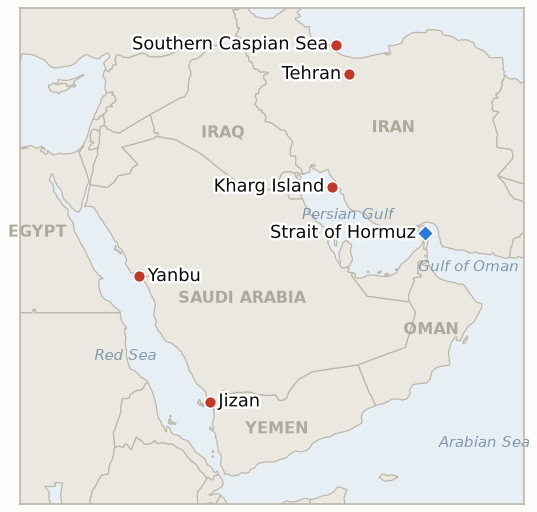

# Middle East Daily Briefing

**July 27, 2026**

- **Reporting window:** ~27 hours, July 26, 06:00 to July 27, 09:00 KST
- **Overall assessment:** The war stopped, and for the first time there is a documented military reason why. Axios reported Sunday that CENTCOM commander Admiral Brad Cooper urged the Pentagon, the Joint Chiefs and the White House to halt the Hormuz bombing campaign unless Washington was prepared to escalate into major combat, on the assessment that roughly 80% of the campaign's designated targets had already been struck and that continuing at the existing tempo had no strategic purpose. Trump ordered the pause Friday; Sunday brought a second consecutive night with no US strikes on Iran and no Iranian strikes on Bahrain, Jordan or Kuwait, and an Iranian official told Reuters Tehran would hold its fire as long as the United States did. This is a genuine mutual halt, but it is being described by both sides as "quiet for quiet" rather than as an agreement, and its stated basis is target exhaustion and interceptor scarcity rather than a settlement. Markets treated it as the real thing: Brent fell 4.9% to $92.02 within minutes of the Sunday electronic reopen and traded as low as the high $80s in Monday Asian hours, handing back roughly a third of July's war premium in a single session. Two things cut against the de-escalation read. Trump spent Sunday denying that the US is short of munitions while posting AI-generated images of American forces destroying Kharg Island, the terminal that handles nearly all Iranian crude exports and the one target class the campaign never touched. And Ukraine claimed long-range strikes on Iran-linked shipping in the Caspian Sea, killing a sailor and drawing a summons and a retaliation warning from Tehran, which opens a second front on Iran's rear supply line that Washington does not control. For Korea the question this week is not whether the pause holds but whether Aramco ever says what happened at Yanbu: two days after the strikes, no damage assessment separating refining from crude export capacity has been published, and Yanbu is the port where every one of Korea's fifteen workaround liftings has loaded.

**Corrections and updates:** Two corrections, both to data rather than narrative.

1. **USD/KRW, July 24.** The July 25 brief recorded Friday's won close at ₩1,461.3 on a Trading Economics quote whose stated percentage change never reconciled with the level. Two Korean outlets put the actual close at **₩1,466.6, down 0.2 won** from Thursday's ₩1,466.8 ([Businesskorea](https://www.businesskorea.co.kr/news/articleView.html?idxno=273576), [Yonhap Infomax via Nate](https://news.nate.com/view/20260724n23369)). `data/observations.csv` has been corrected in place. This matters beyond a rounding error: the won did not strengthen 5 won into the equity break, it was flat, which is a weaker version of the FX-equity decoupling claim than the July 25 and July 26 briefs implied.
2. **September crude procurement.** The July 26 exposure snapshot carried September coverage at 74%, a figure from UPI's July 16 reporting of the July 14 baseline. `instructions/korea-exposure.md` already holds the current number: **~90% secured as of July 21**, per MOTIE via Herald Business. The correct reading of Korea's September position is materially more comfortable than yesterday's brief presented.

---

## 1. What Happened

<figure style="float:right; width:46%; margin:2pt 0 8pt 14pt;">

<figcaption style="font-size:8pt; color:#666; text-align:center; margin-top:3pt; font-style:italic;">Major places of discussion</figcaption>
</figure>

### 1.1 The Pause Hardens Into Quiet for Quiet, and Axios Reveals CENTCOM Asked for It

A second consecutive night passed with no announced US strikes on Iran and no Iranian retaliation, and for the first time the reason is on the record. Axios reported Sunday, citing two sources familiar with his position, that CENTCOM commander Admiral Brad Cooper urged the Pentagon, the Joint Chiefs of Staff and the White House to stop the bombing campaign around the Strait of Hormuz unless Washington was prepared to escalate into major combat operations: two weeks of strikes had "significantly reduced Iran's ability to attack commercial and military vessels," roughly 80% of the targets designated under Operation Epic Fury had already been hit, and continuing limited strikes without a broader campaign lacked strategic purpose ([Axios via Ynet](https://www.ynetnews.com/article/sj0copqbgl), [Times of Israel](https://www.timesofisrael.com/liveblog_entry/report-centcom-chief-urged-halt-to-hormuz-campaign-unless-us-prepared-to-escalate/)). Joint Chiefs chairman General Dan Caine separately warned privately that shortages of air-defence interceptors could compromise US protective capability, a concern the New York Times also reported as a driver of the halt. Trump had leaned toward escalation, shifted Thursday evening, and formally ordered the pause Friday. Iran's posture matches: army spokesman Mohammad Akraminia said "our strategy has essentially been retaliatory. We have also halted our retaliatory operations," and an Iranian official told Reuters Tehran would hold its fire as long as the United States did, expressing "more skepticism than pessimism" ([Al Jazeera](https://www.aljazeera.com/news/2026/7/26/us-and-iran-hit-pause-on-strikes-for-second-day)). Bahrain, Jordan and Kuwait — the three states that absorbed most of the Iranian retaliation over the preceding fortnight — reported no attacks overnight. **Confidence: High** on the two-night mutual halt and the quoted Iranian and US statements (multi-outlet, and an absence that CENTCOM's own daily announcements make unusually observable); **Medium** on Cooper's recommendation, the 80% figure and Caine's warning, which rest on Axios's two unnamed sources and parallel unnamed-source reporting elsewhere; **Low** on whether this becomes a settlement.

### 1.2 Oil Hands Back a Third of the July War Premium on the Sunday Reopen

Crude gave up its war premium the moment trading resumed. Brent for September delivery fell 4.9% to **$92.02** shortly after the Sunday electronic reopen, WTI for September fell 5.6% to **$84.34**, and Brent for October fell 4.6% to $87.48 ([AP via ABC News](https://abcnews.com/US/wireStory/oil-prices-ease-after-us-iran-pause-attacks-135106927)). The slide extended into Monday Asian hours, with Brent down as much as 7% to below $90 before trimming losses to around $91.95 ([Trading Economics](https://tradingeconomics.com/commodity/brent-crude-oil)). That is roughly $10 off the $102 intraday high set last week, the highest since May, and it unwinds about a third of a July that had run up nearly 40%. What it does not do is return the market to pre-crisis pricing: Brent is still up about 24% month to date and about 33% year on year, US regular gasoline averaged $4.11 a gallon on July 26 against $3.90 a month earlier, and no settle has printed inside this window. **Confidence: High** on the quoted prices and percentage moves (AP wire, corroborated by Trading Economics on the Monday extension); **High** on the absence of a settle in the window; **Medium** on the attribution of the entire move to the pause, since Friday's 3.3% decline had already begun pricing the mediation track.

### 1.3 Trump Denies a Munitions Shortage and Posts AI Images of Kharg Island Burning

Against the reporting that interceptor scarcity helped drive the halt, Trump said on Truth Social that "we have far more munitions than anyone in the world, and far more than we need," and posted a series of AI-generated images depicting US forces destroying Iranian oil infrastructure at **Kharg Island**, several captioned "It's Our Oil Tanker now!" ([Times of Israel](https://www.timesofisrael.com/liveblog-july-26-2026/), [Al Jazeera](https://www.aljazeera.com/news/liveblog/2026/7/26/iran-war-live-tehran-summons-ukraine-diplomats-over-caspian-sea-attack)). Kharg handles very close to all of Iran's crude exports, and it is the one target class this campaign has conspicuously never struck across five months of war — the counterpart on the Iranian side to the power generation targets that were withheld throughout. Publishing synthetic imagery of a strike that has not happened, on the third day of a pause the military asked for, is a threat delivered at zero operational cost, and it is aimed at the asset Tehran most needs intact if a negotiated reopening of Hormuz is ever to be worth anything to Iran. **Confidence: High** on the posts, the quote and the Kharg Island subject matter (multi-outlet, primary posts); **High** on Kharg's role in Iranian exports (long-standing public record); **Low** on whether this signals an intended target set as opposed to negotiating pressure.

### 1.4 Ukraine's Caspian Strikes Pull a Second War Onto Iran's Supply Line

Iran's foreign ministry summoned Ukraine's chargé d'affaires in Tehran over what it called a "hostile and criminal" attack on an Iranian commercial vessel in the Caspian Sea on Saturday, in which an explosion killed one sailor and injured another ([Al Jazeera](https://www.aljazeera.com/news/2026/7/25/iran-accuses-ukraine-of-deadly-attack-on-caspian-commercial-vessel), [CNBC](https://www.cnbc.com/2026/07/26/ukraine-strikes-iranian-vessels-tehran-accuses-kyiv-of-hostile-act.html), [Military Times](https://www.militarytimes.com/global/mideast-africa/2026/07/26/iran-says-ukrainian-attack-on-vessel-in-caspian-sea-killed-sailor/)). President Volodymyr Zelenskyy said Kyiv had achieved "very strong results" with long-range strikes in the Caspian, hitting "vessels used in military cargo shipments involving Iran, as well as a warship," and Ukraine's ambassador to Israel said the targeted vessel carried drone and missile components bound for Iran ([The National](https://www.thenationalnews.com/news/europe/2026/07/26/ukraine-claims-caspian-sea-attack-on-ships-carrying-iranian-military-hardware-to-russia/)). Tehran framed the attack as carried out at Israel's behest and warned of retaliation ([Ynet](https://www.ynetnews.com/article/r1o143qrmg)); Zelenskyy separately alleged that Russia has been passing satellite imagery of Gulf states and US military sites to Iran. The Caspian is Iran's sanctions-resistant rear corridor to Russia, physically beyond US and Israeli reach and outside any Hormuz arrangement — which makes it a route Washington cannot trade away and Kyiv has no reason to stop attacking. **Confidence: High** on the summons, the casualty and Zelenskyy's claim (Iranian MFA statement, Ukrainian presidential statement, multi-outlet); **Medium** on the cargo's contents, which rests on the Ukrainian account alone; **Low** on the Israeli-behest allegation, which is an Iranian characterisation with no independent support.

### 1.5 Aramco Stays Silent on Jizan and Yanbu as Netanyahu Flies to Washington

Two days after the Houthi missile and drone strikes, neither Saudi Aramco nor the Saudi government has published a damage assessment, a casualty figure or an output impact for either Jizan or Yanbu; the acknowledgement of a "temporary reduction" at Yanbu Aramco Sinopec remains the only official statement, and it covers refining. The interception of two ballistic missiles over Yanbu is now attributed to a Greek-operated Patriot battery ([Al Jazeera](https://www.aljazeera.com/news/2026/7/26/new-front-in-us-iran-war-escalates-as-houthis-fire-at-saudi-oil-facilities)). Kpler data reported by AFP puts Yanbu at roughly 92% of Saudi seaborne crude exports in June, which makes the unanswered question — whether crude export capacity was touched at all — the single most consequential open item for Asian importers. Separately, Netanyahu said he will press Trump at Tuesday's White House meeting to keep a "constant, constant watch" on Iran's nuclear programme ([Bloomberg](https://www.bloomberg.com/news/articles/2026-07-26/netanyahu-to-press-trump-to-keep-watch-on-iran-s-nuclear-aims)), a framing that argues for surveillance and enforcement rather than for resuming strikes, and that reads as Israel positioning itself inside the pause rather than against it. **Confidence: High** on the absence of any Aramco or Saudi damage assessment and on Netanyahu's stated intent (multi-outlet, direct quotation); **Medium** on the Greek Patriot attribution and the 92% Yanbu export share (single-outlet and agency-reported respectively); **Low** on any inference about crude export capacity, which remains unestablished in either direction.

---

## 2. Deep Dive: Incentives and Motives

### 2.1 Why did the US military ask to stop, and what does that tell us about what the campaign was for?

Cooper's reported argument is striking because it is not a political argument. He did not say the campaign was unwise, disproportionate or diplomatically counterproductive; he said it had run out of targets. Roughly 80% of the Operation Epic Fury target list was struck, Iran's ability to attack shipping was significantly degraded, and the remaining 20% did not justify continued nightly sorties absent a decision to escalate into major combat. That is the reasoning of an officer who was given a bounded objective — suppress Iran's anti-shipping capability around Hormuz — and reached the end of it.

It follows that the campaign was never an attempt to compel a political outcome. Thirteen consecutive nights of strikes that deliberately spared power generation, the national grid and the leadership tier were not a coercion campaign that fell short; they were a suppression campaign that finished. This is the cleanest available explanation for a pattern this briefing has tracked for ten days and repeatedly scored as restraint: the withheld target classes were not rungs held in reserve for a later escalation, they were simply outside the mission. Indicator IND-20260718-1, falsified yesterday on the grid, and IND-20260719-1, falsified on the class break after the first US combat deaths, both look in retrospect like tests of an escalation ladder that the operation did not have.

That reading has an uncomfortable corollary. A campaign that ends because it is complete does not create leverage in the way a campaign that ends because it is traded does. Washington now enters diplomacy having spent its designated targets, with interceptor stocks that General Caine reportedly considers strained, and with Iran's remaining capabilities — nuclear infrastructure, the leadership, the grid — untouched and available as future targets rather than as bargained-away concessions. The pause is real; the leverage it produced is thinner than the tonnage suggests.

### 2.2 Why is Tehran matching the pause instead of exploiting it?

Iran's framing has been consistent to the point of being rehearsed: Akraminia's "our strategy has essentially been retaliatory" places every Iranian strike since mid-July inside a reactive frame, and halting retaliation the moment US strikes stopped is the logical completion of that story. It costs Tehran nothing to stop shooting at an enemy that has stopped shooting, and it converts two weeks of absorbed damage into a claim of disciplined restraint.

The material calculus points the same way. Iran spent the fortnight under strikes that its air defences visibly could not prevent, and it has one asset the campaign never touched: Kharg Island and the export capacity behind it. Every additional day of exchange risked that asset without improving Iran's position, and Trump's Sunday imagery made the risk explicit in the crudest possible register. Meanwhile Iran's leverage instrument — the closure of Hormuz — costs nothing to maintain while the guns are silent. Tehran can hold the strait shut, stop absorbing strikes, and let the price of reopening it rise as the world's tolerance for a five-month chokepoint closure erodes. That is a strictly better position than fighting.

The skepticism reported alongside it is also rational. Iran has now watched a mid-June memorandum of understanding collapse, a July 11 Muscat round fail, and a "goodwill gesture" produce nothing; Baghaei told ORF that past diplomatic efforts were "betrayed." An official who says Tehran will hold fire while expressing "more skepticism than pessimism" is describing a posture that can be maintained indefinitely and abandoned instantly, which is exactly what a party with no confidence in the counterparty should adopt.

### 2.3 Why did the market move so much on a pause nobody has signed?

Because the market was never pricing the war; it was pricing the destruction of export capacity, and the pause removes the mechanism by which that destruction was going to happen. July's rally was built in two layers. The first was the Hormuz closure, which is a volume problem — Iranian enforcement keeps roughly a fifth of seaborne crude from moving on its normal route. The second, added in the last ten days, was the prospect that the Red Sea workaround would be destroyed too, first by the Houthi blockade declaration and then by missiles landing on Saudi refineries. A $100 Brent print required both layers to be live simultaneously.

The pause does not reopen Hormuz. What it does is make the second layer look less likely to compound, because the Saudi-Houthi exchange loses its most plausible escalation sponsor if Iran is standing down. Removing the tail risk while leaving the base disruption intact is precisely a $10 move that stops around $90 rather than a return to the $70s. The residual $20 above pre-war levels is the closure itself, and it will not come out of the price until tankers actually transit.

There is a reflexive problem underneath this that Korean planners should be explicit about. The pause is being sustained by "quiet for quiet" with no signed instrument, which means the price relief is contingent on a condition that either side can end in one night at no cost. A market that has already banked the de-escalation has correspondingly more room to fall back up. The asymmetry runs against consumers: the downside from here is bounded by the closure, the upside is unbounded by anything.

### 2.4 Why does the Caspian matter more than its size suggests?

The Caspian is the part of Iran's position that neither Washington nor Tehran can put on the table. It is landlocked, ringed by Russia, Kazakhstan, Turkmenistan and Azerbaijan, and it carries the military-industrial traffic between Moscow and Tehran that has underwritten both the drone relationship and, per Zelenskyy's allegation, an intelligence relationship extending to satellite imagery of Gulf states and US bases. Ukraine has both the reach and the motive to keep attacking it, and no stake at all in whatever Oman brokers over Hormuz.

That creates a structural leak in any US-Iran arrangement. Suppose the mediators produce a deal in which Iran reopens the strait and the US lifts the blockade. Kyiv's incentive to strike Iran-Russia shipping is unchanged by that deal, and Iranian sailors killed by Ukrainian drones will still be Iranian sailors killed. Tehran's insistence that Ukraine acted at Israel's behest — unsupported, but useful — shows how quickly a third-party attack can be domesticated into the main conflict's narrative. Any framework that does not account for Caspian incidents has a resumption trigger built into it that neither signatory controls.

For a Korean reader the practical point is that the pause's durability is not solely a function of US and Iranian intent, which is what indicator IND-20260726-1 tests. It is also a function of Ukrainian operational tempo, which is invisible to Middle East watchers and uncorrelated with everything else in this file.

### 2.5 Why has Aramco not said anything, and what should be inferred from the silence?

Two days of institutional silence following a strike that a satellite fire-detection system independently corroborated is a choice, and there are three readings.

The benign one is procedural: Aramco is a listed company with disclosure obligations, damage assessments on a 400,000 barrel per day integrated complex take time, and a partial statement that later requires correction is worse than a delayed one. The company's practice after the 2019 Abqaiq attack was to move quickly, but Abqaiq was a single dramatic event with an obvious market question, and it was assessed in a peacetime week rather than during an active two-way war with Yemen.

The second reading is strategic. Saudi Arabia has spent five months persuading buyers that the East-West pipeline and Yanbu are a reliable substitute for Hormuz, and roughly 92% of its seaborne crude now leaves that way. Confirming damage to that corridor validates the Houthi claim that the blockade has teeth, and invites the very repricing of Saudi barrels the kingdom is trying to avoid. Silence is cheap while liftings continue.

The third is the one that should worry importers: the assessment is bad and is being managed. Nothing in the window supports this over the other two, and this briefing does not adopt it. But the discipline for a Korean planner is to stop waiting for the statement. Loading data at Yanbu is observable independently of Aramco's communications policy, arrives faster, and cannot be shaped. Where an official statement and a lifting schedule disagree, the lifting schedule is the fact.

### 2.6 Why should Seoul be more careful now than it was at $100?

Because the expensive mistakes in this crisis have been made on reversals, not on escalations. Korea's institutional machinery handled the run-up well: procurement was pulled forward, July-August volumes were secured above the prior year, September reached roughly 90%, the naphtha export ban held, the BOK moved pre-emptively. Every one of those decisions is easy to defend at $100 Brent and awkward to hold at $85 — the hedges are expensive, the forward cargoes are dear, and the rate path was justified by an imported-energy shock that just gave back a third of itself.

The July 24 session is the warning. The KOSPI fell 5.72% on a day when foreigners sold ₩3.3 trillion, and the won — corrected today to ₩1,466.6, essentially flat rather than 5 won stronger — did not confirm the equity signal. The two markets were reading different books, and the brief's own decoupling narrative was resting on an FX figure that turns out not to have moved. With the correction in hand, the honest description of last week is that the currency was indifferent to an equity rout, which is a weaker and more contingent claim than "the won strengthened through the break."

The counsel that follows is symmetric and boring. The BOK should not treat a two-session, $10 unwind as evidence that the imported-energy shock is over, any more than it should have treated the $102 print as a permanent level; the August statement is better served by the two-month average than by either endpoint. MOTIE should not slow procurement on price relief that rests on an unsigned understanding. And nobody should embed $90 into guidance this week for the same reason nobody should have embedded $100 last week.

---

## 3. Policy Implications for South Korea

The oil panels turn down at the right edge for the first time in three weeks: the July 27 endpoints are the Sunday-reopen intraday prints, $92.02 Brent and $84.34 WTI, not settles. The KOSPI and won panels still end at Friday, with the won endpoint corrected today to ₩1,466.6. The Hormuz panel is unchanged at three vessels a day, its last verified level, and no fresh count was published in this window.

**Exposure snapshot:**

| Channel | Standing position | What the weekend changed |
|---|---|---|
| Crude price | Brent $92.02 intraday Monday, down from a $102 high last week; last settle $97.39 (Fri) | The $100 H2 base case adopted on 07-24 is now the top of a range, not the centre of one. Still ~24% above the start of July |
| Crude route | All 15 Korean workaround liftings loaded at Yanbu, exiting via Bab el-Mandeb | Nothing verified. Two days on, no Aramco assessment separating refining from export capacity |
| Volumes secured | Jul-Aug 110%+ of prior-year volume; **September ~90%** (corrected today from 74%); ~273m bbl non-Hormuz secured | Unchanged, and more comfortable than yesterday's brief stated |
| Strategic reserve | ~26 days of actual consumption remaining (CSIS estimate, Medium confidence); 22.5m bbl already released via IEA coordination | Unchanged. A price fall does not refill it |
| LNG | Ras Laffan export freeze at day 16; no laden Hormuz exit since 07-11 | Unchanged through the pause. IND-20260717-2 is falsified today at day 16 |
| FX and equities | Won **₩1,466.6** (corrected), KOSPI 6,690.62 (Fri) | Untested; Monday's Seoul session opens at the window's edge and is the first read on whether the oil unwind buys the KOSPI back |

**Implications by development:**

**On the CENTCOM disclosure (1.1).** The target-exhaustion explanation should change how Seoul models resumption risk, not just pause durability. If the campaign stopped because its list was spent, then a resumption requires a *new* decision about a *new* target class — nuclear sites, the grid, Kharg — rather than a continuation of the old tempo. That makes resumption less likely week to week and much worse if it happens. Contingency planning should shift from "how long is the pause" to "what does a second campaign look like," because the intermediate case has been removed.

**On the price unwind (1.2).** This is the moment Korea's hedging book gets tested in the direction nobody plans for. Positions taken at $95-100 are now underwater on a move driven by an unsigned understanding. The correct response is neither to unwind them nor to add to them, but to be explicit internally that the pause is a condition rather than a settlement, and that IND-20260727-1 resolves the question in days rather than months. On procurement: do not slow it. The September book at ~90% was built for a supply problem that the price fall does not solve, because Hormuz is still closed.

**On the Kharg imagery (1.3).** Kharg is the fastest available path from today's price to a genuinely disorderly one, and it is the target Iran cannot absorb. A strike there would remove Iranian barrels from a market already short the Hormuz route, and it is one of the few remaining scenarios that puts Brent meaningfully above the July high. Korean refiners' scenario sets should carry it explicitly rather than folding it into a generic escalation case; the distinguishing feature is that it hits supply rather than transit, so the reserve release and route-diversion playbooks that Korea has built for a chokepoint problem do not answer it.

**On the Caspian (1.4).** A resumption trigger outside both belligerents' control belongs in the monitoring set. Practically this means adding Ukrainian long-range strike reporting to whatever desk currently watches CENTCOM announcements — an unusual instruction, but the pause can now be broken from Kyiv.

**On Aramco's silence (1.5).** Stop waiting for the statement. The operative instruction for MOTIE, KNOC and the refiners' joint task force is to treat Yanbu lifting data as the signal and Aramco's communications as noise, and specifically to establish whether the sixteenth Korean workaround lifting loads at Yanbu on schedule. That single observation answers more than any damage assessment will.

**Testable indicators:**

- **IND-20260727-1 — Quiet for quiet survives the Netanyahu meeting or breaks on it.** *Metric:* CENTCOM strike announcements and Iranian retaliation reporting in the 72 hours following the Tuesday July 28 White House meeting. *Confirmation:* no US strikes on Iran and no Iranian strikes on US positions through ~2026-07-31 confirms that the pause survived its first scheduled stress test and is a policy rather than a lull — reweight toward a negotiated Hormuz reopening and Brent settling into the $80s. *Falsification:* any resumption of strikes by either side by ~2026-07-31 falsifies — the pause was an operational gap around Netanyahu's visit. *Deadline:* ~2026-07-31. *Note:* narrower and later than IND-20260726-1, which tests the raw 96-hour survival to ~07-29; this one tests survival of a specific scheduled event.
- **IND-20260727-2 — The price unwind reverses or sets a new range.** *Metric:* Brent settles through the week. *Confirmation:* Brent settling below $90 on any two sessions by ~2026-08-03 confirms the market has repriced the war premium down to the Hormuz-closure base and $90 is the new ceiling-of-calm — Korea's H2 planning base case moves back from $100 to $90. *Falsification:* Brent settling above $97.39, Friday's last verified settle, on any session by ~2026-08-03 falsifies — the unwind was a two-day relief trade and the escalation premium is intact. *Deadline:* ~2026-08-03. *Note:* supersedes nothing; IND-20260724-3 tests the round trip of the $100 crossing on a longer clock and both can resolve independently.
- **IND-20260727-3 — Kharg Island stays rhetorical or enters the target set.** *Metric:* verified US or Israeli strikes on Kharg Island or Iranian crude export terminals (CENTCOM, NIOC, IAEA-adjacent trade press, multi-outlet). *Confirmation:* any verified strike on Kharg or another Iranian crude export terminal by ~2026-08-10 confirms the campaign has crossed from transit suppression to supply destruction — an unbounded oil scenario; escalate Korea's reserve-release planning immediately and treat the $100 base case as a floor. *Falsification:* no strike on Iranian crude export infrastructure through ~2026-08-10 falsifies — the Kharg imagery was negotiating pressure, consistent with five months in which the terminal was never touched. *Deadline:* ~2026-08-10.

**Resolved today:** IND-20260720-1 **Falsified** (its ~07-27 deadline arrives with no verified strike on any Iranian nuclear facility since Darkhovin, and the campaign has now stopped altogether — Darkhovin was a boundary probe on a zero-material site); IND-20260721-1 **Expired** (its ~07-27 deadline arrives with no accepted truce framework, but also without the collapse the falsification branch described — the 10-day truce round was overtaken by an unsigned "quiet for quiet" halt that is neither the framework nor the graveyard); IND-20260717-2 **Falsified** (sixteen days without a laden Ras Laffan departure through Hormuz, well past its ~07-24 deadline).

---

## 4. Watch List

- **Tuesday's White House meeting.** Netanyahu arrives arguing for surveillance rather than strikes, which is the least disruptive Israeli position available. The risk is the intelligence he brings, not the ask he states.
- **Aramco's damage assessment**, now two days overdue against expectations, and specifically whether it separates refining from crude export capacity.
- **The sixteenth Korean workaround lifting** (IND-20260722-1, deadline ~07-29) — the observable that substitutes for the assessment.
- **Monday's Seoul session**, the first test of whether a $10 oil unwind buys back any of Friday's 5.72% break, and the first data point for IND-20260725-2.
- **Ras Laffan**, falsified today at day 16. The freeze is now a standing condition rather than an open question, and the successor test is whether a Hormuz framework addresses LNG at all.
- **The Hormuz floor** (IND-20260725-3): three vessels a day, with a zero-tanker day as the confirmation trigger. No fresh count published in five days.
- **Ukrainian long-range strike reporting**, newly relevant to Middle East risk via the Caspian corridor.
- **Hegseth's ~$70bn request** (IND-20260723-1), now meeting appropriations markups against a stopped campaign and a reported interceptor shortage — an awkward combination to defend in either direction.
- **The Abraham Accords condition** (IND-20260724-1): still no public Saudi response, and Riyadh is fighting a war in Yemen.

---

## 5. Source Quality Summary

| Claim | Sources | Confidence |
|---|---|---|
| Second consecutive night with no US strikes on Iran and no Iranian retaliation; Bahrain, Jordan, Kuwait quiet | Al Jazeera, Bloomberg, CNN | **High** |
| Cooper urged halting the Hormuz campaign; ~80% of Operation Epic Fury targets struck; no strategic purpose absent escalation | Axios (two unnamed sources) via Ynet and Times of Israel | **Medium** |
| Gen. Caine's private interceptor-shortage warning; NYT attribution of the pause to stockpile concerns | Axios via Ynet; New York Times via Al Jazeera (unnamed sources) | **Medium** |
| Akraminia: "we have also halted our retaliatory operations"; Iranian official to Reuters on holding fire | Al Jazeera, Reuters | **High** |
| Waltz: Trump "giving talks a little bit of room"; Baghaei on Qatari and Pakistani mediation and "betrayed" past efforts | Fox News via Al Jazeera; ORF via Al Jazeera | **High** |
| Omani delegation travelled to Tehran on reopening Hormuz; "moving in a positive direction" | Axios via Ynet; CBS via Al Jazeera (regional officials, unnamed) | **Medium** |
| Brent Sept $92.02 (−4.9%), WTI Sept $84.34 (−5.6%), Brent Oct $87.48 (−4.6%) after the Sunday reopen | AP via ABC News | **High** |
| Brent down as much as 7% below $90 in Monday Asian hours, trimming to ~$91.95; MTD +24% | Trading Economics | **Medium to High** |
| US regular gasoline $4.11/gal on July 26 vs $3.90 a month earlier | AP via ABC News | **High** |
| Trump: "far more munitions than anyone in the world"; AI images of strikes on Kharg Island captioned "It's Our Oil Tanker now!" | Times of Israel, Al Jazeera, Truth Social posts | **High** |
| Iran summoned Ukraine's chargé d'affaires; one sailor killed, one injured in the Caspian attack | Al Jazeera, CNBC, Military Times, Iranian MFA | **High** |
| Zelenskyy: "very strong results," vessels carrying Iranian military cargo and a warship hit | The National, CNBC, Ukrainian presidency | **High** |
| Cargo contents (drone and missile components); Russia passing satellite imagery to Iran | Ukrainian ambassador to Israel; Zelenskyy — one side's account only | **Medium to Low** |
| Iranian claim that Ukraine acted at Israel's behest | Ynet reporting Iranian statements | **Low** |
| No Aramco or Saudi damage assessment for Jizan or Yanbu two days on | Absence across Al Jazeera, The National, Türkiye Today, wire coverage | **High** |
| Two ballistic missiles over Yanbu intercepted by a Greek-operated Patriot battery | Al Jazeera | **Medium** |
| Yanbu ~92% of Saudi seaborne crude exports, June 2026 | Kpler via AFP | **Medium** |
| Netanyahu to press for a "constant, constant watch" on Iran's nuclear programme at Tuesday's meeting | Bloomberg | **High** |
| USD/KRW closed ₩1,466.6 on July 24, down 0.2 won (correcting ₩1,461.3) | Businesskorea, Yonhap Infomax via Nate | **High** |
| September crude procurement ~90% secured as of July 21 (correcting 74%) | MOTIE via Herald Business, per korea-exposure.md | **High** |
| Korean procurement position (Jul-Aug 110%+, ~273m bbl non-Hormuz, 15 Yanbu liftings) | korea-exposure.md; MOTIE via Herald Business and Asia Business Daily; MOF via MBC | **High** |
| Strategic reserve coverage ~26 days of actual consumption | CSIS via korea-exposure.md (flagged there as an estimate) | **Medium** |
| Any inference about Iranian, US or Israeli intent behind the pause | No attributable evidence in the window | **Low** |
