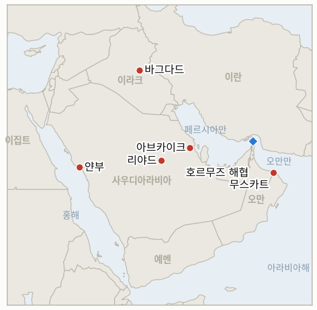

# 중동 데일리 브리핑

**2026년 7월 28일**

- **보고 기간:** 약 24시간, 7월 27일 09:00 ~ 7월 28일 09:00 (한국시간)
- **종합 평가:** 워싱턴과 테헤란 사이의 교전 중단이 사흘째 유지됐고, 시장은 이를 기정사실로 받아들였다. 브렌트유는 8.7% 하락한 88.36달러에 정산됐다. 4월 17일 이후 최대 낙폭으로, 전쟁 프리미엄이 가격에서 빠지고 호르무즈 봉쇄분만 남았다. 그러나 이날 실제 폭력은 이 중단이 포괄하지 않는 당사자들에게로 옮겨갔다. 사우디 방공망은 동부주와 리야드의 석유 시설을 노린 드론을 요격했고, 리야드는 이를 이라크 영토에서 활동하는 이란 지원 민병대의 소행으로 지목했다. 후티는 별도로 사우디 동부와 얀부를 잇는 원유 수송 인프라, 즉 동서 송유관 자체를 타격했다고 주장했다. 이 송유관은 2월 이후 사우디산 원유를 봉쇄된 해협 밖으로 우회시켜 온 대동맥이며, 한국의 우회 선적 15건이 모두 실린 경로다. 트럼프는 이란이 회담을 요청했으며 "지금 이란과 대화하고 있다"고 말했으나, 이란 외무부는 직접 협상은 없고 중재자가 메시지를 전달할 뿐이라고 밝혔다. 두 진술은 동시에 참일 수 있으며, 그 간극이 곧 현재 외교의 전모다. 카타르와 파키스탄 중재자들이 어느 쪽도 공개적으로 인정하지 않는 6월 양해각서를 향해 오가고 있다. 호르무즈 쟁점 자체는 주말 테헤란에서 실질 내용으로 좁혀졌다. 이란은 의무 통항료와 자국 연안에 더 가까운 항로를 요구했고 오만은 자발적 메커니즘을 제시했다. 바가에이는 해협 통항 상황에 아직 아무 변화가 없다고 확인했다. 서울에는 이날의 실질적 사건이 국내에 있었다. 산업통상자원부가 7월 27일 얀부 문제를 이유로 정유·해운업계를 소집해 도입 물량 확보를 재확인하고 비축유 스와프를 즉시 가동 태세에 뒀다. 밤사이 가장 시끄러웠던 소식에 대해서는 한 가지 주의가 필요하다. 아브카이크에 위성으로 확인되는 대규모 피해가 있다는 주장이 널리 퍼졌으나, 이는 전적으로 신뢰도가 낮은 매체와 소셜미디어에 근거하며, 1군 매체 보도는 요격 사실만 전할 뿐 확인된 피해는 없다고 기술한다.

---

## 1. 무슨 일이 있었나

<figure style="float:right; width:46%; margin:2pt 0 8pt 14pt;">

<figcaption style="font-size:8pt; color:#666; text-align:center; margin-top:3pt; font-style:italic;">주요 논의 지점</figcaption>
</figure>

### 1.1 이라크발 드론이 사우디 석유 시설을 노리고 후티는 동서 송유관 타격을 주장

사우디 국방부는 방공망이 동부주와 리야드의 석유 시설을 노린 드론 여러 대를 요격해 파괴했다고 밝혔다. 국방부 대변인 투르키 알말리키 소장은 이를 이라크 영토에서 발사된 테러 행위로 규정하고 왕국은 "적절한 시기와 장소에서" 대응할 권리를 유보한다고 말했으며, 외무부는 바그다드에 이라크 영토가 발사 거점으로 쓰이지 않도록 조치할 것을 촉구했다([알자지라](https://www.aljazeera.com/news/2026/7/27/saudi-arabia-defends-against-drone-strikes-from-iran-backed-groups), [사우디 가제트](https://saudigazette.com.sa/article/663286), [디펜스 포스트](https://thedefensepost.com/2026/07/27/saudi-intercept-iraq-drones/)). 이라크 총리 알리 알자이디는 이라크가 "자국 영토가 이웃국 공격에 사용되도록 허용하지 않겠다"고 밝히고 조사에 착수했다. 이와 별개로, 연관 여부는 불분명하나, 후티 군 대변인 야히아 사리는 사우디 동부와 얀부를 잇는 다수의 민감한 원유 공급·수송 시설을 표적으로 삼았다고 발표하며 이를 사우디의 예멘 영공 드론 침범에 대한 보복으로 규정했다([US뉴스/로이터](https://www.usnews.com/news/world/articles/2026-07-27/houthis-say-they-targeted-saudi-east-west-oil-transport)). 요르단 상공에서도 드론이 격추됐고, 이스라엘군은 사해 인근에서 두 대를 요격했다([타임스오브이스라엘](https://www.timesofisrael.com/israel-saudi-arabia-jordan-iraq-attacked-by-drones-despite-lull-in-us-iran-fighting/)). **신뢰도: 높음** — 사우디의 요격 주장, 알말리키와 알자이디의 발언, 후티의 공격 주장(공식 발표, 복수 매체). **중간** — 이라크발 작전과 후티 작전의 연계 여부로, 알자지라도 이를 열어 둔다. **낮음** — 동서 송유관에 대한 실제 물리적 영향으로, 후티 주장에만 근거하며 사우디나 아람코의 확인이 없다.

### 1.2 브렌트유 8.7% 급락 마감, 4월 이후 최대 낙폭

원유는 재개장 당시의 움직임을 실제 정산가로 확정했다. 브렌트유 9월물은 **8.7% 하락한 88.36달러**, WTI 9월물은 **7.5% 하락한 82.61달러**에 정산돼 4월 17일 이후 최대 일간 낙폭을 기록했다([블룸버그/리그존](https://www.rigzone.com/news/wire/brent_tumbles_nearly_9_on_diplomacy-27-jul-2026-184226-article/), [CNBC](https://www.cnbc.com/2026/07/27/oil-price-wti-brent-slide-as-iran-reportedly-may-halt-attacks.html)). 이는 금요일 브렌트 정산가 97.39달러보다 약 9달러, 7월 23일 종가 100.69달러보다 약 12달러 낮은 수준으로, 홍해 국면에서 쌓인 확전 프리미엄 대부분을 되돌린 것이다. 전쟁 자체를 되돌린 것은 아니다. 해상 원유의 약 5분의 1을 정상 항로에서 이탈시키는 호르무즈 봉쇄는 공습의 쌍무적 중단으로 달라지지 않으며, 브렌트유는 여전히 위기 이전 수준을 크게 웃돈다. 이 정산가는 어제 브리핑이 실었던 **92.02달러와 84.34달러를 대체한다**. 그 수치들은 정산가가 아니라 일요일 전자거래 재개 당시의 장중 시세였다. `data/observations.csv`와 `data/series.csv`는 현재 정산가를 담고 있다. **신뢰도: 높음** — 두 정산가, 변동률, 4월 17일 이후 최대라는 규정(블룸버그 통신, CNBC 교차 확인). **중간** — 이 낙폭 전부를 교전 중단에 귀속시키는 해석으로, 금요일 하락이 이미 중재 국면을 반영하기 시작했다.

### 1.3 트럼프는 이란이 대화를 요청했다고 주장하고 테헤란은 부인

트럼프는 기자들에게 이란이 대리인을 통해 그리고 직접 회담을 요청했다고 말하며 "우리는 지금 이란과 대화하고 있다. 좋은 대화를 나누고 있다"고 밝혔고, 합의가 없으면 공습이 재개될 것이라는 말을 되풀이했다. 그는 또한 미국이 이란 정권의 요청으로 공습을 중단했다고 말했다([알자지라](https://www.aljazeera.com/news/2026/7/27/hopes-of-return-to-diplomacy-as-us-iran-hold-fire-for-third-day), [CNN](https://www.cnn.com/2026/07/27/world/live-news/iran-war-trump)). 이란 외무부 대변인은 테헤란이 대화를 먼저 요청했다는 주장을 일축하며 "중재자들이 미국 측의 메시지를 우리에게 전달할 수는 있다"면서도 직접 협상은 진행되지 않는다고 밝혔다. 유엔 주재 대사 마이크 왈츠는 이번 중단이 외교에 "숨 쉴 공간"을 준 것이라고 표현했다. 트럼프는 요격 미사일 부족 보도에 대해서는 "우리는 여러 종류의 탄약을 많이 갖고 있다"며 패트리엇 증산을 언급했다. 카타르와 파키스탄 중재자들은 6월 중순 양해각서 복원을 향해 계속 오가고 있으며, 미 중부사령부는 봉쇄를 집행하며 상선 17척의 항로를 변경시키고 2척을 추가로 승선 검색했다. 강압 장치는 중단 기간에도 그대로 유지되고 있다. **신뢰도: 높음** — 양측 발언과 중재 활동(직접 인용, 복수 매체). **중간** — 중부사령부의 차단 수치(단일 매체). **낮음** — 직접 협상의 성사 여부.

### 1.4 이란과 오만이 통항료 이견을 좁혔으나 선박은 움직이지 않음

실질 협상은 공습에 관한 것이 아니다. 금요일과 토요일 테헤란에서 열린 외무차관급 회담에서 대변인 에스마일 바가에이가 "생산적"이라고 표현한 논의가 이뤄졌고, 해협의 안전한 선박 통항 관리를 위한 공동 원칙과 운영 메커니즘에서 "일부 진전"이 있었다. 양측은 연안국으로서의 주권적 권리를 함께 언급했다. 오만 대표단은 토요일 저녁 테헤란을 떠났으며 정치·기술법률 차원의 협의는 계속된다([신화](https://english.news.cn/20260726/f7793e1f34d140c3b931bacc1e747577/c.html), [머스캣 데일리](https://www.muscatdaily.com/2026/07/26/oman-iran-hold-talks-on-strait-of-hormuz-shipping-safety/), [마닐라타임스/AFP](https://www.manilatimes.net/2026/07/26/world/iran-says-progress-in-oman-talks-on-hormuz-strait-management/2391598)). 남은 간극은 구체적이다. 이란은 의무 통항료와 자국 연안에 더 가까운 항로를 원하고, 오만은 자발적 통항료 메커니즘을 제안한다. 바가에이는 해협 통항 상황에 **아직 아무 변화가 없다**고 명확히 밝혔다. 마지막으로 확인된 Kpler 집계는 7월 24일까지 하루 3척이며, 이번 기간에 새 집계는 공표되지 않았다. **신뢰도: 높음** — 회담 사실, 바가에이의 규정, 변화 없음 발언(이란 외무부 브리핑, 오만 관영 계열 매체 포함 복수 매체). **중간** — 남은 쟁점을 의무 대 자발의 대립으로 보는 구도(보도된 것이지 공동 발표는 아님). **높음** — 새 통항 집계의 부재.

### 1.5 서울은 정유·해운업계를 불러 얀부 수송로를 점검

산업통상자원부는 7월 27일 양기욱 산업자원안보실장 주재로 정유·해운업계와 원유 수급상황 점검회의를 열었다. 회의는 얀부와 홍해 항로의 위험 확대를 명시적 이유로 소집됐다([한국경제](https://www.hankyung.com/article/2026072781087), [아주경제](https://www.ajunews.com/view/20260727084843555), [ZDNet 코리아](https://zdnet.co.kr/view/?no=20260727123713)). 정부는 7~8월 원유 도입분이 전년 동기 대비 100% 이상, 9월 물량이 90% 이상 확보돼 당장 수급 차질 가능성은 크지 않다고 평가하고 비상 수송과 도입 계획을 점검했다. 양 실장은 위기 상황이 발생하면 "비축유 스와프 제도 즉시 시행 등 가용한 모든 정책역량을 총동원하겠다"고 말했다. 한편 서울 시장은 금요일 급락분을 일부 회복했다. 코스피는 6,806.27로 1.73% 상승 출발한 뒤 상승폭을 줄여 **0.97% 오른 6,755.75**에 마감했고, 원·달러 환율은 1,459.0원에 출발해 데탕트 안도감을 반납하고 월말 수입업체 결제 수요에 밀려 1.9원 오른 **1,468.5원**에 마감했다([머니투데이](https://www.mt.co.kr/stock/2026/07/27/2026072715265826190), [뉴시스](https://www.newsis.com/view/NISX20260727_0003725030), [비즈니스코리아](https://www.businesskorea.co.kr/news/articleView.html?idxno=273624)). **신뢰도: 높음** — 회의 개최, 소집 사유, 도입 비율, 양 실장 발언, 두 시장 종가(복수 한국 매체를 통한 산업부 발표, 시장 데이터 복수 매체). **중간** — 비축유 스와프가 신호 수단이 아니라 실제 규모로 작동 가능한지 여부로, 한 번도 시험된 적이 없다.

---

## 2. 심층 분석: 유인과 동기

### 2.1 왜 폭력은 교전 중단이 포괄하지 않는 당사자들에게로 옮겨가는가?

이번 중단이 서로의 자제를 상호 검증할 수 있는 유일한 두 행위자 사이에서 합의됐고, 나머지 모두의 유인은 손대지 않은 채 남았기 때문이다. 워싱턴과 테헤란은 상대가 간밤에 출격했는지를 각자 관측할 수 있다. 그러나 어느 쪽도 이라크 민병대가 드론으로 무엇을 하는지, 후티가 홍해 상공에서 무엇을 하는지를 관측할 수 없고, 더 중요하게는 그에 대해 책임지지 않는다. 이 중단이 "조용함에는 조용함으로"라는 형식을 취한 것은 바로 어느 쪽도 제3자에 대해 책임을 질 필요가 없도록 하기 위함이었고, 그 형식은 이제 72시간 만에 시험대에 올랐다.

이라크 민병대와 후티는 테헤란의 명령을 거스르며 움직이는 단순한 대리 세력이 아니다. 양측 모두 미국·이란 트랙이 닫아 주지 않는 자기 몫의 셈을 갖고 있다. 사리가 밝힌 명분, 즉 사우디의 예멘 영공 드론 침범에 대한 보복은 7월 25일 리야드의 호데이다 공습으로 시작된 사우디·후티 교전을 가리키며, 이는 자체 확전 시계를 가진 전쟁 속의 전쟁이다. 리야드가 "적절한 시기와 장소"를 언급하며 겨눈 대상은 테헤란이 아니라 바그다드다. 지금 드러나는 것은 중단의 위반이 아니라 중단이 남기는 것의 형태다. 지역 분쟁은 각자의 논리를 가진 여러 개의 양자 대결로 분해됐고, 그중 어느 것도 워싱턴이 이란을 폭격하지 않는다고 해서 끝나지 않는다.

이것이 현재 논의되는 모든 틀에 내재한 상시적 위험이다. 호르무즈를 둘러싼 미국·이란 합의는, 설령 성공하더라도, 후티가 사우디 수출 인프라 공격을 멈추도록 구속하지 못하고, 이라크 민병대를 구속하지 못하며, 어제 브리핑이 카스피해에서 지적했듯 우크라이나를 구속하지 못한다. 이번 중단은 이 전쟁의 얼마나 많은 부분이 더 이상 전쟁을 시작한 두 교전국의 것이 아닌지를 드러냈다.

### 2.2 공급 그림이 거의 변하지 않았는데 시장은 왜 9% 가까이 빼냈는가?

가격이 서로 다른 두 개의 프리미엄을 지고 있었고, 그중 하나만이 애초에 외교 헤드라인에 빠질 수 있는 것이었기 때문이다. 첫째는 호르무즈 봉쇄다. 2월 이후 효력을 유지하고 있으며 이번 주에 일어난 어떤 일로도 달라지지 않은, 물리적이고 측정 가능한 통항 능력의 제거다. 둘째는 확전 위험, 즉 *추가로* 얼마나 많은 수출 능력이 파괴될 것인가에 대한 확률 분포이며, 후티 미사일이 지잔과 얀부에 닿고 트럼프가 카르그섬이 불타는 이미지를 올리면서 홍해 국면 내내 크게 벌어졌다.

사흘간의 쌍무적 중단은 첫째에는 거의 아무 영향이 없고 둘째에는 큰 영향을 미친다. 추가 확전의 가장 유력한 후원자를 제거하며, 그것도 시장이 꼬리 위험의 지속적 확대를 전제로 세 자릿수 가격을 반영한 바로 그 시점에 그렇게 한다. 그래서 비율로는 큰 움직임이 나오면서도 위기 이전 수준으로 돌아가지 않고 88달러 부근에서 멈춘다. 확전 프리미엄은 빠졌고 봉쇄 프리미엄은 남았다. 잔여분이 곧 봉쇄이며, 이는 유조선이 실제로 통항하기 전까지 가격에서 빠지지 않는다. 그리고 바가에이는 방금 통항이 이뤄지지 않고 있음을 확인했다.

이 분해가 앞날에 대해 시사하는 바는 편치 않다. 데탕트를 이미 반영한 시장은 이제 비대칭적 반응 함수를 갖는다. 중단에 관한 추가 호재는 거의 값어치가 없다. 봉쇄가 바닥이기 때문이다. 반면 둘째 프리미엄을 복원해야 할 근거, 즉 사우디 수출 인프라의 확인된 피해, 공습 재개, 실제로 명중한 후티 공격은 큰 값어치를 갖는다. 월요일의 정산가는 한국의 악재 노출을 줄이지 않았다. 그것을 응축시켰다.

### 2.3 왜 동서 송유관 주장이 요격 헤드라인보다 중요한가?

요격 헤드라인은 안심시키는 소식이고 송유관 주장은 그렇지 않으며, 둘은 서로 다른 사안이다. 사우디 방공망이 리야드와 동부주를 겨눈 드론을 요격한 것은 방어가 작동한다는 이야기다. 후티가 "사우디 동부와 얀부를 잇는 민감한 원유 공급·수송 시설"을 타격했다는 주장은, 그 상실이 사우디 국내가 아니라 세계 공급 그림을 바꿔 놓을 유일한 인프라에 관한 주장이다.

지난 다섯 달을 버틸 수 있게 한 것이 동서 송유관이다. 2월 이란이 사실상 호르무즈를 봉쇄했을 때 사우디는 원유를 반도를 가로질러 홍해 터미널로 우회시켰고, 송유관 처리량은 보도된 기록치인 하루 약 700만 배럴까지 올라갔다. 얀부는 6월 기준 사우디 해상 원유 수출의 약 92%가 나가는 출구가 됐다. 해협을 통과하지 않고 아시아에 닿는 모든 배럴이 이 체계를 지나며, 이는 사막을 가로지르는 길고 고정된 지상 배관, 즉 사우디 수출 사슬 전체에서 가장 방어하기 어려우면서 그 용량을 대체할 수 없는 유일한 자산이다.

그래서 이날의 올바른 독해는 "사우디 방어가 버텼다"가 아니다. 미국·이란 중단에 아무 이해관계가 없는 교전 당사자가 이제 공개적으로 송유관을 표적군으로 지목했고, 그것이 공급하는 홍해 터미널까지 도달할 능력을 입증했다는 것이다. 간밤의 작전이 무언가를 달성했는지는 실제로 알 수 없고 아마 미미할 것이다. 그것이 예고하는 표적 교리가 물질적 사실이며, 한국 화물과 가장 직접적으로 연결된 사실이다.

### 2.4 트럼프와 테헤란은 왜 누가 먼저 대화를 요청했는지에 대해 양립 불가능한 이야기를 하는가?

두 진술 모두 비용이 들지 않으면서 각각 다른 청중에게 하중을 지고 있기 때문이다. 트럼프에게는 이번 중단이 그가 받아들인 군의 건의가 아니라 이란의 굴복으로 읽혀야 하며, 이는 중부사령부가 중단을 요청했다는 악시오스 보도와 요격 미사일 부족에 관한 병행 보도 이후 특히 그렇다. "그들이 회담을 요청했다"는 말은 그의 지휘관들이 요청한 중단을 그가 얻어낸 양보로 전환한다. 이란에게는 정반대가 필요하다. 13일 밤의 공습을 견딘 정권이 강화를 청한 것으로 비칠 수는 없으며, 바가에이의 신중한 표현, 즉 중재자가 메시지를 전달할 수는 있으나 직접 협상은 없다는 표현은 테헤란이 접근하는 쪽이 아니라 접근받는 쪽이라는 주장을 지켜낸다.

중요한 점은 두 입장이 실질에서는 사실 모순되지 않는다는 것이다. 카타르와 파키스탄 중재자들이 양방향으로 메시지를 나르는 상황은 트럼프가 이를 "이란과 대화하고 있다"고 표현하는 것과도, 테헤란이 이를 직접 협상이 아니라고 표현하는 것과도 온전히 양립한다. 다툼은 명칭을 두고 벌어지며, 그 명칭은 양쪽 모두 국내용이다.

이것이 기획자에게 시사하는 바는, 외교 트랙이 실재하되 구조적으로 부인 가능하며 그만큼 진행 속도에 상한이 있다는 것이다. 어느 쪽도 현재 방어하고 있는 서사적 지점을 양보하지 않고서는 중재된 메시지를 공표된 틀로 전환할 수 없다. 따라서 가장 유력한 단기 결과는 문서 없는 정적의 지속이며, 이는 어제 브리핑이 아무 비용 없이 하룻밤 만에 뒤집힐 수 있다고 지적한 바로 그 서명 없는 조건이다. 두 갈래 사이에서 만료된 7월 21일 지표가 이 분쟁이 합의 없는 상호 자제를 낳는다는 첫 신호였다면, 이번이 두 번째다.

---

## 3. 한국에 대한 정책적 함의

### 3.1 노출 현황

| 항목 | 현재 수치 | 출처 |
| --- | --- | --- |
| 7~8월 원유 도입 | 전년 동기 대비 100% 이상 확보, 7월 27일 산업부 회의에서 재확인 | 산업부 (한국경제, 아주경제, ZDNet 코리아) |
| 9월 원유 도입 | 90% 이상 확보 (7월 21일 기준, 7월 27일 재확인) | 산업부 (헤럴드경제); `korea-exposure.md` |
| 홍해 우회 항로 | 한국 용선 유조선 15척이 홍해로 우회, 전부 얀부에서 선적 | 해수부 (`korea-exposure.md`) |
| 전략 비축유 | 실소비 기준 약 26일분(추정), 비축유 스와프 즉시 가동 태세 | CSIS; 산업부 7월 27일 |
| 브렌트유 | 88.36달러 정산, -8.7% | 블룸버그/리그존 |
| 코스피 | 6,755.75, +0.97% | 머니투데이 |
| 원·달러 | 1,468.5원, +1.9원 | 뉴시스 |
| 호르무즈 통항 | 하루 3척, 7월 24일 마지막 확인, 이후 변화 보고 없음 | Kpler (베어드 마리타임); 바가에이 |

### 3.2 사안별 함의

**송유관 주장이 중요한 항목이며, 아직 사건은 아니다.** 한국의 호르무즈 우회는 단일 수송로다. 동서 송유관을 거쳐 얀부에서 선적하고 바브엘만데브로 빠져나간다. 이 세 구간 중 둘이 나흘 안에 공격받았다. 7월 25일 얀부 터미널, 7월 27일 그에 공급하는 송유관이며, 공격 주체는 미국·이란 중단 바깥에 명시적으로 있는 교전 당사자다. 도입 물량 수치는 이를 전혀 반영하지 않는다. 도입 물량은 계약된 물량을 재는 것이지 그것을 실어 나르는 경로의 생존성을 재는 것이 아니기 때문이다. 올바른 태도는 수송로 리스크와 물량 확보 리스크를 기획상 별개 항목으로 다루고, 안정적인 9월 90% 수치가 둘 모두를 대신하도록 두지 않는 것이다.

**유가 되돌림을 아직 하반기 전제로 반영해서는 안 된다.** 90달러 아래 정산가 한 번은 국면이 아니다. 2.2의 분해가 시사하는 바는, 여기서의 하방은 누구도 조기 해제를 기대하지 않는 봉쇄로 제한되는 반면 상방은 사우디 수출 능력의 확인된 피해가 나오는 순간 다시 열린다는 것이다. 월요일에 88달러가 찍혔다는 이유로 88달러를 기준으로 기획하는 것은 위험을 거꾸로 놓는 일이다. 90달러 미만 정산가가 두 번째로 나오고 얀부 원유 처리량에 관한 근거가 함께 확보되기 전까지, 작업 기준선은 오른쪽 꼬리가 두터운 구간으로 유지해야 한다.

**비축유 스와프는 약속됐을 뿐 시험된 적이 없다.** 양 실장의 "즉시 시행" 발언은 이번 위기에서 산업부가 내놓은 가장 구체적인 완충 조치이며, 그 수단의 실제 처리 능력, 즉 몇 배럴을 누구에게 얼마의 통보 기간으로 방출하는지를 실제 교란 상황이 아니라 지금 알아 두는 것이 값어치가 있다. 이는 부처가 평온한 날에 답할 수 있는 질문이다.

**주식과 외환의 분리는 지속되며 여전히 전쟁이 원인이 아니다.** 코스피는 글로벌 위험선호 회복으로 올랐고 원화는 월말 수입 결제 수요로 소폭 약해졌다. 지정학이 아니라 외환 수급 이야기다. 7월 24일 정정이 이미 디커플링 주장을 약화시켰고, 월요일의 움직임은 그것을 복원하지 않는다. 한국 증시의 급락이 반도체였는지 전쟁이었는지를 가르는 실질 검증은 IND-20260725-2로 남아 있다.

**검증 가능한 지표:**

- **IND-20260728-1** — 아브카이크 피해 주장이 실체로 판명되는가 루머로 판명되는가. 아람코, 사우디 정부, 또는 자체 영상 분석을 갖춘 1군 매체가 2026-08-04경까지 아브카이크 처리 능력의 물리적 피해를 확인하면 이라크발 공격이 요격 발표가 시사한 것보다 실질적으로 성공적이었음이 확인된다(1.2의 가격 논리를 즉시 재평가). 2026-08-04경까지 그러한 확인이 전혀 없고 1군 보도가 계속 요격만을 기술하면 반증된다. 피해 보도는 소셜미디어 산물이었고 이 사건은 방어의 성공이었다.
- **IND-20260728-2** — 이라크 전선이 전역으로 발전하는가 단발 공격에 그치는가. 2026-08-11경까지 이라크에서 발사된 사우디 영토에 대한 두 번째 드론 또는 미사일 공격, 또는 이라크 내부에 대한 사우디의 무력 대응이 있으면 미국·이란 중단이 봉쇄할 수 없는 새 활성 전선이 확인된다(호르무즈 트랙과 무관하게 수송로 리스크 상향). 2026-08-11경까지 이라크 기원 추가 공격도 사우디 대응도 없으면 반증된다. 이번 공격은 호데이다 교전에 연동된 일회성 신호였다.
- **IND-20260728-3** — 중재된 메시지가 공표된 틀로 전환되는가 부인 가능한 상태로 남는가. 2026-08-11경까지 양측이 함께 인정하는 미국·이란 회담, 또는 6월 양해각서를 복원하는 공개 발표가 있으면 외교 트랙이 2.4에서 기술한 국내 서사 제약을 앞지를 수 있음이 확인된다. 2026-08-11경까지 중단이 이어지면서도 양측이 누가 먼저 접근했는지를 계속 다투고 공표된 문서가 없으면 반증된다. 합의 없는 상호 자제가 상시 국면이며, 한국은 예고 없이 끝날 수 있는 무기한의 서명 없는 정적을 전제로 기획해야 한다.

**이번 회차 해소:**

- **IND-20260724-3 — 반증.** 이 지표는 2026-08-01경까지 98달러 이상 정산가가 두 번 연속 나오면 세 자릿수 국면이 자리 잡는지를 물었고, 휴전 헤드라인에 92달러 아래 정산가가 되돌아오면 100달러 돌파가 고점 스파이크였음을 표시하도록 설계됐다. 브렌트유는 바로 그러한 헤드라인에 7월 27일 88.36달러로 정산됐다. 100달러 돌파는 고원이 아니라 스파이크였고, 90달러 후반은 작업 수준으로 성립하지 않는다.
- **IND-20260722-1 — 확인.** 이 지표는 "산업부가 해당 항로의 실사용을 확인"하는 것을 한국의 얀부 수송로가 봉쇄령의 억지 국면을 넘긴다는 확인 조건으로 인정했다. 7월 27일 수급 점검회의가 정확히 그것을 했다. 얀부 위험을 이유로 소집되어 비상 수송과 도입 계획을 점검하고 도입 물량 확보를 재확인했으며, 7월 29일경 시한을 앞두고 얀부 선적의 중단이나 전환을 발표하지 않았다. 보정을 위해 적어 둔다. 이는 수송로가 *사용 중*임을 확인하는 것이지 *안전함*을 확인하는 것이 아니다. 그 질문에 대한 후속 검증은 IND-20260726-2이며, 1.1의 송유관 주장이 그것이 중요한 이유다.

---

## 4. 관찰 목록

- **아람코의 계속되는 침묵.** 지잔과 얀부 이후 나흘이 지났으나 정제와 원유 수출 능력을 구분하는 피해 평가는 여전히 없고, 이제 동부주 공격에 관한 발표도 없다. 이 침묵 자체가 확보 가능한 가장 유용한 정보다.
- **이라크에 대한 사우디의 보복.** 알말리키의 "적절한 시기와 장소"는 예멘 호데이다 공습에 앞서 나왔던 것과 같은 표현이다. 리야드는 이번 달 이미 그러한 발언을 행동으로 옮긴다는 것을 보여 줬다.
- **CPC와 흑해.** 우크라이나 드론 공격으로 카스피 파이프라인 컨소시엄의 노보로시스크 선적이 이번 달 두 차례 중단됐다. 카자흐스탄산 원유 약 150만 배럴, 세계 공급의 약 1%에 해당한다. 중동 트랙과 무관하면서 그 완화 효과를 상쇄할 능력은 충분하다.
- **네타냐후 회담.** 2월 말 전쟁 발발 이후 처음인 화요일 백악관 회담은 이번 기간 바로 바깥에 있다. 네타냐후는 이란의 위협 첩보가 보고된 가운데 이례적으로 조용한 보안 절차 속에 출국했다.
- **라스라판의 카타르산 LNG.** 여전히 새로운 주간 선적 수치가 없으며, 호르무즈 수출 동결은 지표 원장에서 가장 오래 미해결로 남은 항목이다.
- **바브엘만데브.** 7월 20일 후티의 해상 봉쇄 선언이 유효하며, 이는 한국 수송로 노출의 나머지 절반이다.

---

## 5. 출처 품질 요약

| 주장 | 출처 | 신뢰도 |
| --- | --- | --- |
| 동부주·리야드 석유 시설을 겨눈 드론에 대한 사우디의 요격, 이라크발 이란 지원 세력으로의 귀속 | 사우디 국방부 (알자지라, 사우디 가제트, 디펜스 포스트) — 1~2군, 공식 발표 | 높음 |
| 얀부로 이어지는 동서 원유 수송 시설 타격에 대한 후티의 주장 | 야히아 사리 발표 (로이터/US뉴스) — 1군, 공격 주장 | 주장 사실은 높음, **물리적 영향은 낮음** |
| 아브카이크의 위성 확인 대규모 피해 및 아람코 가동 중단 | 제로헤지, 크립토브리핑, 인디아TV, X 계정 — **1군 매체 미보도**, 알자지라는 확인된 피해 없음으로 보도 | **낮음 — 미확인으로 취급** |
| 브렌트유 88.36달러(-8.7%), WTI 82.61달러(-7.5%) 9월물 정산, 4월 17일 이후 최대 낙폭 | 블룸버그/리그존, CNBC — 1군 | 높음 |
| 트럼프의 "지금 이란과 대화하고 있다", 정권 요청에 따른 공습 중단 | 알자지라, CNN — 1군, 직접 인용 | 높음 |
| 직접 협상에 대한 이란 외무부의 부인 | 바가에이 (알자지라) — 1군, 공식 브리핑 | 높음 |
| 이란·오만 호르무즈 회담 "생산적", 원칙에서 진전, 통항 상황 변화 없음 | 신화, 머스캣 데일리, 마닐라타임스/AFP — 2군, 이란·오만 공식 소스 | 회담은 높음, 통항료 쟁점 구도는 중간 |
| 7월 27일 산업부 수급 점검회의, 7~8월 100% 이상·9월 90% 이상 확보, 비축유 스와프 대기 | 한국경제, 아주경제, ZDNet 코리아 — 1~2군 한국 매체, 부처 발표 | 높음 |
| 코스피 6,755.75(+0.97%), 원·달러 1,468.5원(+1.9원) | 머니투데이, 뉴시스, 비즈니스코리아 — 1~2군 한국 매체 | 높음 |
| 호르무즈 통항 하루 3척 유지, 7월 24일 마지막 확인 | Kpler (베어드 마리타임); 바가에이 발언 | 7월 24일 집계는 높음, 이후 새 집계 없음 |
| 이라크 총리 알자이디의 약속과 조사 착수 | 알자지라 — 1군 | 높음 |
| 중부사령부의 상선 17척 항로 변경, 2척 승선 검색 | 알자지라 — 단일 매체 | 중간 |
