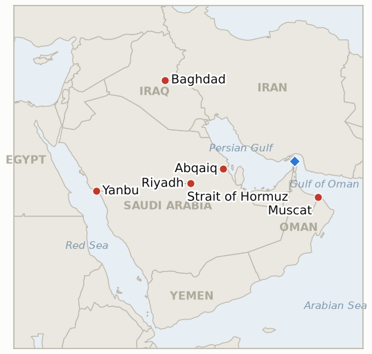

# Middle East Daily Briefing

**July 28, 2026**

- **Reporting window:** ~24 hours, July 27, 09:00 to July 28, 09:00 KST
- **Overall assessment:** The pause between Washington and Tehran held a third day, and the market treated that as settled: Brent settled down 8.7% at $88.36, the biggest one-day fall since April 17, taking the war premium out of the price and leaving only the Hormuz closure behind it. But the day's actual violence moved to the parties the pause does not cover. Saudi air defences intercepted drones aimed at oil facilities in the Eastern Province and Riyadh, which Riyadh blamed on Iran-backed militias operating from Iraqi territory, while the Houthis separately claimed strikes on the crude transport infrastructure linking eastern Saudi Arabia to Yanbu — that is, on the East-West pipeline itself, the artery that has carried Saudi barrels around the closed strait since February and the route on which every one of Korea's fifteen workaround liftings has loaded. Trump said Iran had asked for a meeting and that "we're talking with Iran right now"; Iran's foreign ministry said there are no direct negotiations and that mediators merely carry messages. Both statements can be true, and the gap between them is the whole diplomatic picture: Qatari and Pakistani mediators shuttling toward a June memorandum neither side will publicly own. The Hormuz dispute itself narrowed to its real content in Tehran over the weekend, where Iran pressed for mandatory transit tolls and shipping lanes closer to its shores and Oman offered a voluntary mechanism; Baghaei confirmed that no change has yet occurred in maritime traffic. For Seoul the day's substantive event was domestic: MOTIE convened refiners and shippers on July 27 specifically because of Yanbu, reaffirmed procurement cover, and put the strategic reserve swap on immediate standby. One caution on the loudest story of the night — claims of satellite-visible major damage at Abqaiq are circulating widely, but they rest entirely on low-tier outlets and social media, and Tier 1 reporting describes interception with no confirmed damage.

---

## 1. What Happened

<figure style="float:right; width:46%; margin:2pt 0 8pt 14pt;">

<figcaption style="font-size:8pt; color:#666; text-align:center; margin-top:3pt; font-style:italic;">Major places of discussion</figcaption>
</figure>

### 1.1 Drones From Iraq Hit Saudi Oil Targets and the Houthis Claim the East West Pipeline

Saudi Arabia's defence ministry said its air defences intercepted and destroyed several drones that attempted to strike oil facilities in the Eastern Province and in Riyadh over the preceding hours. Ministry spokesman Major General Turki Al Maliki called the attempts terrorist acts launched from Iraqi territory and said the kingdom reserves the right to respond "at the appropriate time and place," while the foreign ministry called on Baghdad to stop Iraqi territory being used as a launchpad ([Al Jazeera](https://www.aljazeera.com/news/2026/7/27/saudi-arabia-defends-against-drone-strikes-from-iran-backed-groups), [Saudi Gazette](https://saudigazette.com.sa/article/663286), [The Defense Post](https://thedefensepost.com/2026/07/27/saudi-intercept-iraq-drones/)). Iraqi Prime Minister Ali al-Zaidi said Iraq "will not allow its territory to be used to launch attacks against neighbouring countries" and opened an investigation. Separately and possibly unconnected, Houthi military spokesman Yahya Saree said the group had targeted a number of sensitive crude supply and transport sites linking eastern Saudi Arabia to Yanbu, framing it as retaliation for Saudi drone incursions into Yemeni airspace ([US News/Reuters](https://www.usnews.com/news/world/articles/2026-07-27/houthis-say-they-targeted-saudi-east-west-oil-transport)). Drones were also downed over Jordan, and the IDF intercepted two near the Dead Sea ([Times of Israel](https://www.timesofisrael.com/israel-saudi-arabia-jordan-iraq-attacked-by-drones-despite-lull-in-us-iran-fighting/)). **Confidence: High** on the Saudi interception claim, Al Maliki's and al-Zaidi's statements and the Houthi claim of responsibility (official statements, multi-outlet); **Medium** on whether the Iraqi-launched and Houthi operations were coordinated, which Al Jazeera explicitly leaves open; **Low** on any physical effect on the East-West pipeline, which rests on the Houthi claim alone and has no Saudi or Aramco corroboration.

### 1.2 Brent Settles Down 8.7% in the Biggest One Day Fall Since April

Crude confirmed the reopen move with an actual settle. Brent for September settled **8.7% lower at $88.36** and WTI for September **7.5% lower at $82.61**, the largest one-day decline since April 17 ([Bloomberg via Rigzone](https://www.rigzone.com/news/wire/brent_tumbles_nearly_9_on_diplomacy-27-jul-2026-184226-article/), [CNBC](https://www.cnbc.com/2026/07/27/oil-price-wti-brent-slide-as-iran-reportedly-may-halt-attacks.html)). That is roughly $9 below Friday's $97.39 Brent settle and about $12 off the $100.69 close of July 23, and it retraces most of the escalation premium built during the Red Sea phase. It does not retrace the war: Brent is still far above the pre-crisis level, because the Hormuz closure that removes roughly a fifth of seaborne crude from its normal route is untouched by a bilateral halt in air strikes. Note that this settle **supersedes the $92.02 and $84.34 intraday figures** carried in yesterday's brief, which were Sunday electronic-reopen prints rather than settles; `data/observations.csv` and `data/series.csv` now carry the settles. **Confidence: High** on both settlement prices, percentages and the since-April-17 characterisation (Bloomberg wire, corroborated by CNBC); **Medium** on attributing the full move to the pause, since Friday's decline had already begun pricing mediation.

### 1.3 Trump Says Iran Asked to Talk and Tehran Denies It

Trump told reporters that Iran had requested a meeting, through surrogates and directly, and said "We're talking with Iran right now. We are having good talks," while repeating that strikes would resume absent an agreement; he also said the US halted its strikes at the regime's request ([Al Jazeera](https://www.aljazeera.com/news/2026/7/27/hopes-of-return-to-diplomacy-as-us-iran-hold-fire-for-third-day), [CNN](https://www.cnn.com/2026/07/27/world/live-news/iran-war-trump)). An Iranian foreign ministry spokesman rejected the claim that Tehran initiated talks, saying "mediators may convey messages to us from the American side" but that no direct negotiations are under way. UN ambassador Mike Waltz described the pause as giving diplomacy "some space." Trump separately answered the interceptor-shortage reporting by saying "We have a lot of ammunition, different types," citing increased Patriot production. Qatari and Pakistani mediators continued shuttling toward restoring the mid-June memorandum of understanding, and CENTCOM redirected 17 commercial vessels and boarded two more enforcing its blockade — the coercive apparatus stays fully in place through the pause. **Confidence: High** on the quotes from both sides and on the mediator activity (direct quotation, multi-outlet); **Medium** on the CENTCOM interdiction figures (single-outlet); **Low** on whether direct talks materialise.

### 1.4 Iran and Oman Narrow the Hormuz Toll Dispute Without Moving a Ship

The substantive negotiation is not about strikes. Deputy-foreign-minister-level talks in Tehran on Friday and Saturday produced what spokesman Esmaeil Baghaei called "fruitful" discussion with "some progress" on joint principles and operational mechanisms for managing safe shipping traffic through the strait, with both sides invoking their sovereign rights as coastal states; the Omani delegation left Saturday evening and consultations continue at political and technical-legal levels ([Xinhua](https://english.news.cn/20260726/f7793e1f34d140c3b931bacc1e747577/c.html), [Muscat Daily](https://www.muscatdaily.com/2026/07/26/oman-iran-hold-talks-on-strait-of-hormuz-shipping-safety/), [Manila Times/AFP](https://www.manilatimes.net/2026/07/26/world/iran-says-progress-in-oman-talks-on-hormuz-strait-management/2391598)). The residual gap is specific: Iran wants mandatory transit tolls and traffic routed through lanes closer to its shores, Oman proposes a voluntary toll mechanism. Baghaei was explicit that **no change has yet occurred in maritime traffic** through the strait. The last verified Kpler print remains three vessels a day through July 24; no fresh count published in this window. **Confidence: High** on the talks, Baghaei's characterisation and the no-change statement (Iranian MFA briefing, multi-outlet including Omani state-adjacent press); **Medium** on the mandatory-versus-voluntary framing of the remaining gap (reported, not jointly published); **High** on the absence of a new transit count.

### 1.5 Seoul Convenes Refiners and Shippers on the Yanbu Corridor

MOTIE held an emergency crude supply review on July 27, chaired by Industrial Resources Security Officer Yang Ki-wook, with refiners and shipping companies, convened explicitly because of expanding risk at Yanbu and on the Red Sea route ([Hankyung](https://www.hankyung.com/article/2026072781087), [Aju Business Daily](https://www.ajunews.com/view/20260727084843555), [ZDNet Korea](https://zdnet.co.kr/view/?no=20260727123713)). The government assessed that July-August crude intake is secured at over 100% of the year-earlier volume and September at over 90%, so no near-term supply disruption is likely, and reviewed emergency transport and import plans. Yang said that if a crisis materialises the government will "mobilise all available policy capacity, including immediate implementation of the strategic reserve swap." Meanwhile Seoul's markets recovered part of Friday's break: KOSPI closed **+0.97% at 6,755.75** after opening up 1.73% at 6,806.27 and fading, and the won closed at **₩1,468.5**, 1.9 won weaker, after opening at 1,459.0 on de-escalation relief and giving it back to month-end importer demand ([Money Today](https://www.mt.co.kr/stock/2026/07/27/2026072715265826190), [Newsis](https://www.newsis.com/view/NISX20260727_0003725030), [Businesskorea](https://www.businesskorea.co.kr/news/articleView.html?idxno=273624)). **Confidence: High** on the meeting, its stated trigger, the procurement percentages, Yang's quote and both market closes (MOTIE release via multiple Korean outlets; market data multi-outlet); **Medium** on the reserve swap being genuinely deployable at scale rather than a signalling instrument, which has never been tested.

---

## 2. Deep Dive: Incentives and Motives

### 2.1 Why is the violence migrating to the parties the pause does not cover?

Because the pause was negotiated between the only two actors whose restraint was mutually verifiable, and everyone else's incentives were left untouched. Washington and Tehran can each observe whether the other flew a sortie last night. Neither can observe, and more importantly neither is accountable for, what an Iraqi militia does with a drone or what the Houthis do with the airspace over the Red Sea. The halt was framed as "quiet for quiet" precisely so that neither party had to take responsibility for third parties, and that framing has now been tested within seventy-two hours.

The Iraqi militias and the Houthis are not simply proxies executing Tehran's orders in defiance of a pause. Both have their own accounts to settle that the US-Iran track does not close. Saree's stated rationale — retaliation for Saudi drone incursions into Yemeni airspace — refers to the Saudi-Houthi exchange that began with Riyadh's Hodeidah strikes on July 25, a war within the war that has its own escalation clock. Riyadh's threat to respond "at the appropriate time and place" is aimed at Baghdad, not Tehran. What is emerging is not a violation of the pause but the shape of what the pause leaves behind: a regional conflict that has decomposed into several bilateral fights, each with its own logic, none of which Washington can end by not bombing Iran.

This is the standing risk in every framework now under discussion. A US-Iran arrangement over Hormuz, even a successful one, does not bind the Houthis to stop attacking Saudi export infrastructure, does not bind Iraqi militias, and — as yesterday's brief noted on the Caspian — does not bind Ukraine. The pause has revealed how much of this war is no longer about the two belligerents who started it.

### 2.2 Why did the market take out nearly nine percent when the supply picture barely changed?

Because the price was carrying two distinct premia and only one of them was ever going to come out on a diplomatic headline. The first is the Hormuz closure: a physical, measurable removal of transit capacity that has been in force since February and is untouched by anything that happened this week. The second is escalation risk — the probability distribution over how much *additional* export capacity gets destroyed, which widened sharply through the Red Sea phase as Houthi missiles reached Jizan and Yanbu and Trump posted images of Kharg Island burning.

A three-day mutual halt does almost nothing to the first and a great deal to the second. It removes the most plausible sponsor of further escalation, and it does so at the exact moment the market had priced a $100 handle that required the tail to keep fattening. Hence a move that is large in percentage terms and yet stops around $88 rather than returning to pre-crisis levels: the escalation premium came out, the closure premium stayed in. The residual is the closure, and it will not price out until tankers actually transit, which Baghaei has just confirmed they are not doing.

The uncomfortable feature of this decomposition is what it implies about the days ahead. Having banked the de-escalation, the market now has an asymmetric response function: further good news on the pause is worth very little, because the closure is the floor, while any evidence that the second premium should be restored — confirmed damage to Saudi export infrastructure, a resumption of strikes, a Houthi hit that actually lands — is worth a great deal. Monday's settle did not reduce Korea's exposure to bad news. It concentrated it.

### 2.3 Why does the East West pipeline claim matter more than the interception headline?

The interception headline is reassuring and the pipeline claim is not, and they are about different things. Saudi air defences intercepting drones aimed at Riyadh and the Eastern Province is a story about defence working. The Houthi claim to have struck "sensitive crude supply and transport sites linking eastern Saudi Arabia to Yanbu" is a claim about the one piece of infrastructure whose loss would change the global supply picture rather than the Saudi domestic one.

The East-West pipeline is what has made the last five months survivable. When Iran effectively closed Hormuz in February, Saudi Arabia rerouted crude across the peninsula to Red Sea terminals, pushing pipeline throughput to a reported record of around 7 million barrels a day. Yanbu became the outlet for roughly 92% of Saudi seaborne crude exports by June. Every barrel that reaches Asia without transiting the strait moves through that system, and it is a long, fixed, above-ground line across open desert — the least defensible asset in the entire Saudi export chain, and the only one whose capacity cannot be substituted.

This is why the correct reading of the day is not "Saudi defences held." It is that a belligerent with no stake in the US-Iran pause has now publicly named the pipeline as a target set and has demonstrated reach to the Red Sea terminals it feeds. Whether last night's operation achieved anything is genuinely unknown and probably minor. The targeting doctrine it announces is the material fact, and it is the fact most directly connected to Korean cargoes.

### 2.4 Why are Trump and Tehran telling incompatible stories about who asked to talk?

Because both statements are cheap, and each is load-bearing for a different audience. Trump needs the pause to read as Iranian supplication rather than as a military recommendation he accepted, particularly after the Axios reporting that CENTCOM asked him to stop and the parallel reporting on interceptor shortages. "They asked for a meeting" converts a halt that his own commanders requested into a concession he extracted. Iran needs the opposite: a regime that has absorbed thirteen nights of strikes cannot be seen to have sued for terms, and Baghaei's careful formulation — mediators may convey messages, there are no direct negotiations — preserves the claim that Tehran is being approached rather than approaching.

The two positions are also, importantly, not actually contradictory in substance. Qatari and Pakistani mediators carrying messages in both directions is entirely consistent with Trump describing it as "talking with Iran" and with Tehran describing it as no direct negotiation. The dispute is over the label, and the label is domestic on both ends.

What that tells a planner is that the diplomatic track is real but structurally deniable, which caps how fast it can move. Neither party can convert mediated messages into an announced framework without conceding the narrative point it is currently defending, so the most likely near-term outcome is continued quiet with no instrument — the same unsigned condition this briefing flagged yesterday as reversible in one night at no cost. The July 21 indicator that expired between its branches was the first sign that this conflict produces mutual restraint without agreements; this is the second.

---

## 3. Policy Implications for South Korea

### 3.1 Exposure snapshot

| Item | Current reading | Source |
| --- | --- | --- |
| July-August crude procurement | 100%+ of prior-year volume secured; reaffirmed at the July 27 MOTIE meeting | MOTIE via Hankyung, Aju, ZDNet Korea |
| September crude procurement | 90%+ secured (as of July 21, reaffirmed July 27) | MOTIE via Herald Business; `korea-exposure.md` |
| Red Sea detour routing | 15 Korean-chartered tankers routed via the Red Sea, all loading at Yanbu | MOF via `korea-exposure.md` |
| Strategic reserve coverage | ~26 days of actual consumption (estimate); reserve swap on immediate standby | CSIS; MOTIE July 27 |
| Brent | $88.36 settle, -8.7% | Bloomberg via Rigzone |
| KOSPI | 6,755.75, +0.97% | Money Today |
| USD/KRW | ₩1,468.5, +1.9 won | Newsis |
| Hormuz transits | 3/day, last verified July 24; no change reported since | Kpler via Baird Maritime; Baghaei |

### 3.2 Implications by development

**The pipeline claim is the item that matters, and it is not yet an event.** Korea's entire Hormuz workaround is a single corridor: East-West pipeline to Yanbu, load, exit via Bab el-Mandeb. Two of those three segments have now been attacked within four days — the Yanbu terminal on July 25, the pipeline feeding it claimed on July 27 — by a belligerent explicitly outside the US-Iran pause. Nothing in the procurement numbers reflects this, because procurement measures contracted volume, not the survivability of the route that delivers it. The right posture is to treat corridor risk and supply-cover risk as separate lines in the planning, and to stop letting a comfortable 90% September figure stand in for both.

**The oil unwind should not be banked into H2 assumptions yet.** One settle below $90 is not a regime. The decomposition in 2.2 implies that the downside from here is bounded by a closure nobody expects to lift quickly, while the upside reopens on any confirmed damage to Saudi export capacity. Planning off $88 because Monday printed $88 inverts the risk. The working base case should remain a range with a fat right tail until a second sub-$90 settle and some evidence on Yanbu's crude throughput arrive together.

**The reserve swap has been promised but never tested.** Yang's commitment to "immediate implementation" is the most concrete mitigation statement MOTIE has made in this crisis, and it is worth knowing now, not during a disruption, what the instrument's actual throughput is: how many barrels, released to whom, on what notice. This is a question the ministry can answer on a calm day.

**The equity and FX split persists and is still not war-driven.** The KOSPI recovered on a global risk-on move and the won weakened slightly on month-end importer demand — an FX flow story, not a geopolitical one. The July 24 correction already weakened the decoupling claim; Monday's action does nothing to restore it, and IND-20260725-2 remains the live test of whether Korea's equity break was chips or war.

**Testable indicators:**

- **IND-20260728-1** — The Abqaiq damage claim resolves as substance or as rumour. Aramco, the Saudi government, or a Tier 1 outlet with its own imagery analysis confirming physical damage to Abqaiq processing capacity by ~2026-08-04 confirms that the Iraqi-launched raid was materially more successful than the interception statement implied (and re-rates 1.2's price logic immediately); the absence of any such confirmation through ~2026-08-04, with Tier 1 coverage continuing to describe interception only, falsifies — the damage reports were a social-media artefact and the episode was a defensive success.
- **IND-20260728-2** — The Iraqi front becomes a campaign or stays a single raid. A second drone or missile attack on Saudi territory launched from Iraq by ~2026-08-11, or a Saudi kinetic response inside Iraq, confirms a new active front that the US-Iran pause cannot contain (escalate corridor risk regardless of the Hormuz track); no further Iraq-origin attack and no Saudi response through ~2026-08-11 falsifies — the raid was a one-off signal tied to the Hodeidah exchange.
- **IND-20260728-3** — Mediated messages convert into an announced framework or stay deniable. Any jointly acknowledged US-Iran meeting, or a publicly announced framework restoring the June memorandum, by ~2026-08-11 confirms the diplomatic track can outrun the domestic narrative constraints described in 2.4; the pause continuing past ~2026-08-11 with both sides still disputing who approached whom and no announced instrument falsifies — mutual restraint without agreement is the standing regime, and Korea should plan for an indefinite unsigned quiet that can end without notice.

**Resolutions this run:**

- **IND-20260724-3 — Falsified.** The indicator asked whether two consecutive settles at or above $98 by ~2026-08-01 would embed a three-figure regime, with a settle back below $92 on a truce headline marking the $100 crossing as a spike. Brent settled at $88.36 on July 27 on exactly such a headline. The $100 crossing was a spike, not a plateau; the high-$90s do not stand as the working level.
- **IND-20260722-1 — Confirmed.** The indicator accepted "MOTIE confirming the route in active use" as confirmation that Korea's Yanbu corridor survives the embargo's deterrence phase. The July 27 supply review did exactly that: convened on Yanbu risk, reviewed emergency transport and import plans, reaffirmed procurement cover, and announced no suspension or diversion of Yanbu loadings ahead of the ~July 29 deadline. Noting for calibration that this confirms the corridor is *in use*, not that it is *safe* — the successor test on that question is IND-20260726-2, and the pipeline claim in 1.1 is why it matters.

---

## 4. Watch List

- **Aramco's continued silence.** Four days after Jizan and Yanbu, still no damage assessment separating refining from crude export capacity, and now no statement on the Eastern Province raid either. The silence is itself the most informative thing available.
- **Saudi retaliation against Iraq.** Al Maliki's "appropriate time and place" is the same formula that preceded the Hodeidah strikes on Yemen. Riyadh has already shown this month that it will act on such statements.
- **CPC and the Black Sea.** Ukrainian drone attacks suspended Caspian Pipeline Consortium loadings at Novorossiysk twice this month, affecting roughly 1.58 mb/d of Kazakh crude and about 1% of global supply. Unrelated to the Middle East track and entirely capable of offsetting its relief.
- **The Netanyahu meeting.** Tuesday's White House sit-down, the first since the war began in late February, falls just outside this window. Netanyahu departed Israel under an unusually quiet security protocol amid a reported Iranian threat.
- **Qatari LNG at Ras Laffan.** Still no fresh weekly loading figure; the Hormuz export freeze is the longest-running unresolved item in the ledger.
- **Bab el-Mandeb.** The Houthi naval blockade declaration of July 20 remains in force and is the second half of Korea's corridor exposure.

---

## 5. Source Quality Summary

| Claim | Sources | Confidence |
| --- | --- | --- |
| Saudi interception of drones aimed at Eastern Province and Riyadh oil facilities; attribution to Iraq-launched Iran-backed groups | Saudi MoD via Al Jazeera, Saudi Gazette, The Defense Post (Tier 1-2, official statement) | High |
| Houthi claim of strikes on East-West crude transport sites feeding Yanbu | Yahya Saree statement via Reuters/US News (Tier 1, claim of responsibility) | High that the claim was made; **Low** on physical effect |
| Major satellite-visible damage at Abqaiq, Aramco suspending operations | ZeroHedge, cryptobriefing, India TV, an X account; **not carried by any Tier 1 outlet**; Al Jazeera reports no confirmed damage | **Low — treat as unverified** |
| Brent $88.36 (-8.7%) and WTI $82.61 (-7.5%) September settles, biggest fall since April 17 | Bloomberg via Rigzone; CNBC (Tier 1) | High |
| Trump's "we're talking with Iran right now"; strikes halted at the regime's request | Al Jazeera, CNN (Tier 1, direct quotation) | High |
| Iranian MFA denial of direct negotiations | Baghaei via Al Jazeera (Tier 1, official briefing) | High |
| Iran-Oman Hormuz talks "fruitful," progress on principles; no change in maritime traffic | Xinhua, Muscat Daily, Manila Times/AFP (Tier 2, Iranian and Omani official sourcing) | High on the talks; Medium on the toll-mechanism gap |
| MOTIE July 27 supply review; 100%+ July-Aug and 90%+ September cover; reserve swap standby | Hankyung, Aju Business Daily, ZDNet Korea (Tier 1-2 Korean, ministry release) | High |
| KOSPI 6,755.75 (+0.97%); won ₩1,468.5 (+1.9) | Money Today, Newsis, Businesskorea (Tier 1-2 Korean) | High |
| Hormuz transits unchanged at 3/day, last verified July 24 | Kpler via Baird Maritime; Baghaei statement | High on the July 24 print; no newer count published |
| Iraqi PM al-Zaidi pledge and investigation | Al Jazeera (Tier 1) | High |
| CENTCOM redirected 17 vessels, boarded 2 | Al Jazeera (single-outlet) | Medium |
