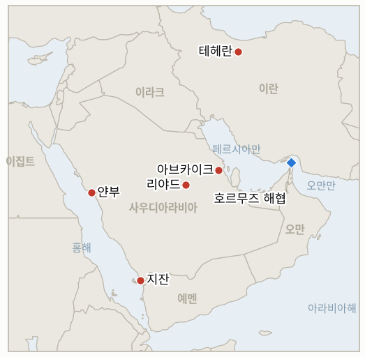

# 중동 데일리 브리핑

**2026년 7월 29일**

- **보고 기간:** 약 24시간, 7월 28일 09:00 ~ 7월 29일 09:00 (한국시간)
- **종합 평가:** 교전 중단은 첫 실질적 시험대, 화요일 트럼프·네타냐후 백악관 회동을 통과했고, 시장은 전쟁의 실제 피해가 아니라 바로 이 사실을 계속 가격에 반영했다. 브렌트유는 4.8% 추가 하락한 84.09달러에 정산돼 이틀 연속 90달러를 밑돌았다. 그러나 피해 자체는 밤사이 훨씬 구체화됐다. 위성사진과 독립적인 열감지 데이터는 사우디산 원유의 대부분을 안정화해 수출하는 아브카이크 시설의 실제 화재 피해를 이제 확인해 주는데, 이는 어제 브리핑이 실었던 요격뿐이라는 그림을 훨씬 넘어선다. 아람코는 하루 40만 배럴 규모의 지잔 정유공장을 아예 가동 중단했으며 복구는 8월 중순 이전에는 어려울 전망이다. 그리고 켑러(Kpler) 기반 자료는 한국의 호르무즈 우회로 전체가 의존하는 얀부의 선적량이 2주 전 대비 3분의 1에서 40%가량 줄었음을 보여준다. 이 가운데 어느 것도 가격을 끌어올리지 못했다. 오히려 가격은 그대로 하락했는데, 한계 거래자가 가격에 반영하는 것은 이미 발생한 피해의 총량이 아니라 교전 중단이라는 사실 자체이기 때문이다. 한편 전쟁 개시 이후 첫 회동인 트럼프·네타냐후 회동은 뚜렷한 이견을 드러냈다. 이스라엘 국방장관은 워싱턴이 더 넓은 전쟁과 실질적인 세계적 석유 위기를 우려해 이란 에너지 시설에 대한 이스라엘의 추가 타격을 막고 있다고 말했고, 이란은 트럼프 자신의 보상 제안을 무기화해 동결자산에서 보상을 받는 선박은 다시는 해협을 통항하지 못하게 하겠다고 위협했다. 서울에는 이날 가장 중요한 숫자가 유가가 아니었다. 코스피는 중동과 무관한 중국발 반도체 장비 충격으로 4월 이후 최악의 하루를 보내며 10.84% 급락한 반면, 원화는 오히려 유가 하락에 힘입어 강세를 보였다. 이는 이 브리핑이 이번 달 내내 분리해 다뤄 온 두 채널이 실제로 갈라진 깔끔한 사례다.

**정정 및 갱신:** 7월 28일 브리핑(1.1)은 아브카이크 피해 주장이 "전적으로 신뢰도가 낮은 매체와 소셜미디어에 근거"하며 1군 매체는 요격 사실만 전한다고 기술했다. 그 판단은 바뀌었다. 블룸버그가 직접 검토한 센티널-2 위성사진은 NASA FIRMS의 열감지 자료로 뒷받침되며, 단순 요격이 아니라 실제 피해와 부합하는 연기와 화염을 보여준다. 다만 6개 구형탱크 중 4개에 화흔이 있고 그중 2개가 파괴됐다는 구체적 주장은 여전히 같은 위성사진을 분석한 OSINT(공개출처정보) 계정에 근거한 것으로, 아람코나 사우디 정부의 확인은 아니며 아래에서는 그만큼 낮은 신뢰도로 다룬다. 1.1과 3장의 IND-20260728-1 해소 내용을 참고.

---

## 1. 무슨 일이 있었나

<figure style="float:right; width:46%; margin:2pt 0 8pt 14pt;">

<figcaption style="font-size:8pt; color:#666; text-align:center; margin-top:3pt; font-style:italic;">주요 논의 지점</figcaption>
</figure>

### 1.1 위성사진과 정유공장 가동 중단이 7월 27일 공습의 실제 피해를 확인

블룸버그는 센티널-2 위성사진이 세계 최대 원유 안정화 시설인 아브카이크에서 연기와 활성 화염을 보여준다고 보도하며, 트레이더들이 차질 여부를 주시하고 있다고 전했다([블룸버그](https://www.bloomberg.com/news/articles/2026-07-27/satellite-shots-of-smoke-at-saudi-oil-sites-keep-traders-on-edge)). 아브카이크는 전 세계 원유 공급량의 약 5~7%를 처리한다. NASA FIRMS는 독립적으로 단지 내 여러 곳의 활성 화재 지점을 포착했다. 같은 센티널-2 촬영분을 분석한 한 OSINT 계정은 한 발 더 나아가 6개 원유 처리 구형탱크 중 4개에 화흔이 있고 그중 2개는 파괴된 것으로 보이며 한 곳에서는 소화 거품이 관측된다고 보도했다. 아람코나 사우디 정부가 직접 밝힌 것은 아니지만 여러 매체가 아람코가 아브카이크 가동을 전면 중단해 하루 약 700만 배럴 규모의 처리 능력이 시장에서 빠졌다고 보도했다([미들이스트아이](https://www.middleeasteye.net/live-blog/live-blog-update/saudi-arabia-halt-operations-major-oil-facility-after-houthi-attack), [칼리버.az](https://caliber.az/en/post/saudi-aramco-halts-operations-at-abqaiq-oil-facility-after-houthi-drone-attack)). 이와 별개로 더 확실히 근거가 뒷받침되는 소식으로, 아람코는 같은 공습 여파로 통합가스화복합발전(IGCC) 설비와 저장탱크 구역이 손상된 하루 40만 배럴 규모의 지잔 정유공장을 가동 중단했으며, 로이터가 인용한 컨설팅업체(IIR) 메모는 잠정 복구 시점을 8월 15일 무렵으로 제시했다([BOE리포트/로이터-IIR](https://boereport.com/2026/07/28/saudi-aramco-shuts-jazan-oil-refinery-after-attack-iir-note-shows/)). 책임 소재는 여전히 다투어진다. 사우디 국방부는 이라크 영토에서 활동하는 이란 지원 민병대를 지목하고, 후티는 얀부로 이어지는 시설 타격을 자신들의 소행이라 주장하며, 이라크 이슬람저항군은 책임을 부인하면서 리야드가 후티에 직접 대응하는 대신 이라크인들을 탓하고 있다고 말한다. **신뢰도: 높음** — 아브카이크에서 실제 화재와 물리적 피해가 발생했다는 점(블룸버그 자체 위성사진 검토, 독립적인 NASA FIRMS 자료로 뒷받침)과 지잔 가동 중단 및 8월 15일 목표 시점(로이터 기반 IIR 메모). **중간** — 아람코가 아브카이크 가동을 전면 중단했다는 주장으로, 정황은 수렴하나 1차 출처는 아니다. **낮음** — 구형탱크 6개 중 4개 화흔, 2개 파괴라는 구체적 서술로, OSINT에만 근거한다.

### 1.2 얀부 원유 선적량이 최근 대비 최대 40% 감소

켑러 기반 무역 자료는 얀부 원유 선적량이 2주 전의 거의 최고 수준에서 크게 미끄러졌음을 보여준다. 7월 13일 무렵 하루 약 470만 배럴에 달했던 선적량은 이번 주 보도에 따르면 후티가 선언한 사우디 항만 해상 봉쇄가 시작된 7월 19일 이후 약 3분의 1에서 40%가량 줄었다([베어드 매리타임](https://www.bairdmaritime.com/shipping/ports/saudi-yanbu-crude-loadings-stumble-following-near-record-export-streak); [프레스TV, 켑러 기반 수치를 보도한 이란 국영매체로 유의해 인용](https://www.presstv.co.uk/Detail/2026/07/27/773191/Saudi-oil-loading-volumes-fall-40--)). 이는 우드매켄지가 별도로 집계한, 이번 달 확전 이전인 6월까지 사우디의 홍해 우회 총물량이 3월 정점 대비 이미 41% 감소했다는 결과와도 궤를 같이한다. 얀부는 6월 사우디 해상 원유 수출의 약 92%를 처리했으며 이란이 사실상 호르무즈를 봉쇄한 이후 가동 중인 유일한 대용량 출구다. 아거스는 아람코의 우회 선적 대안이 제한적이라고 분석했고, 지캡틴(gCaptain)은 아시아 구매자들이 이미 얀부에만 의존하지 않고 아프리카를 우회하는 항로를 초기 논의 중이라고 별도로 보도했다. 이는 한국의 홍해 우회 선박 15척 전량이 실리는 바로 그 경로다. **신뢰도: 높음** — 선적량 감소의 방향과 대략적 규모(켑러 기반, 복수 매체, 우드매켄지·아거스 맥락과 정합). **중간** — 정확한 감소율로, 매체와 측정 구간에 따라 다르다.

### 1.3 브렌트유 이틀 연속 90달러 아래로 마감

브렌트유 9월물은 **4.8% 하락한 84.09달러**, WTI는 **4% 하락한 79.26달러**에 정산돼, 월요일의 88.36달러에 이어 이틀 연속 90달러 아래로 마감했다. 트럼프·네타냐후 회동을 거치며 미이란 교전 중단이 유지된 결과다([CNBC](https://www.cnbc.com/2026/07/28/oil-price-today-wti-brent-us-iran-hormuz.html); [포천](https://fortune.com/article/price-of-oil-07-28-2026/)). 이 움직임이 두드러지는 지점은, 바로 같은 날 위성사진이 아브카이크의 실제 피해를 확인하고 아람코가 지잔 가동 중단을 사실상 확정한 날이라는 것이다. 즉 시장은 기존 시설에 대한 확인된 피해보다 새로운 공습이 없다는 사실을 훨씬 무겁게 반영했다. 보도는 또한 우크라이나의 드론 공격으로 중단됐던 러시아 노보로시스크의 카스피 파이프라인 컨소시엄 터미널 수출 재개도 하락의 보조 요인으로 짚었다. **신뢰도: 높음** — 두 정산가와 변동률(CNBC와 포천이 상호 확인). **중간** — 이 움직임을 얼마나 교전 중단에 귀속시킬지로, 확인된 공급측 피해는 반대 방향을 가리킨다.

### 1.4 트럼프·네타냐후 회동에서 이견 노출, 이스라엘은 워싱턴이 추가 타격을 막고 있다고 주장

전쟁 발발 이후 네타냐후의 첫 백악관 회동은 이란 문제, 레바논 시범구역 체제, 아브라함 협정 확대를 의제로 다뤘다. 두 정상은 이란이 결코 핵무기를 보유해서는 안 된다는 데 합의한 것으로 보도됐으며, 일부 보도는 이를 "중대한 공조의 순간"으로 표현했다([데모크라시 나우](https://www.democracynow.org/2026/7/28/headlines/trump_hosts_netanyahu_at_the_white_house_as_us_weighs_next_steps_against_iran); [알자지라](https://www.aljazeera.com/news/2026/7/28/netanyahu-in-the-white-house-whats-on-the-agenda-and-whats-next)). 그러나 회동 직전 분위기는 뚜렷이 긴장됐다. 트럼프는 네타냐후가 이란의 픽액스 마운틴 핵시설에 관해 준비한 발언 요지가 사전에 유출된 데 불쾌감을 표시하며 "비비가 나한테 그걸 말해줄 필요는 없다. 비비가 그렇게 말하는 건 내가 계속 관여하길 원해서다"라고 말했고, 이스라엘 관계자들은 회동 이후 실제로는 그 주제가 아예 거론되지 않았다고 밝혔다([ABC뉴스](https://abcnews.com/International/live-updates/iran-live-updates-tehran-progress-made-strait-hormuz/?id=135110405); [타임스오브이스라엘](https://www.timesofisrael.com/liveblog_entry/irans-pickaxe-mountain-did-not-come-up-in-netanyahu-trump-meeting-says-israels-public-diplomacy-chief/)). 한편 이스라엘 국방장관 이스라엘 카츠는 현지 방송에서 이스라엘은 이란 에너지 시설을 타격하고 싶어하지만 미국이 이를 승인하지 않고 있다며 "이란이 주변국을 공격해 세계적 석유 위기를 촉발할 것을 우려하기 때문"이라고 말했다([JNS](https://www.jns.org/news/israel-news/katz-israel-wants-to-hit-iranian-energy-targets-us-not-approving); [타스](https://tass.com/world/2166447)). **신뢰도: 높음** — 회동 개최와 의제, 인용된 이견(복수 매체, 직접 인용). **높음** — 카츠의 발언(직접 인용, 복수 매체). **중간** — 이것이 진정한 전략적 이견인지 회동 전 양측의 입지 다지기인지 여부.

### 1.5 이란은 트럼프의 보상 제안을 무기화: 보상 받으면 호르무즈 통항 금지

이란군은 해협을 통항하다 피해를 본 선주들에게 이란의 해외 동결자산 약 1,000억 달러 일부로 보상하겠다는 트럼프의 제안을 거부하고, 이러한 보상을 받는 선박이나 회사는 앞으로 호르무즈 통항을 금지당할 것이라고 경고했다([신화통신](https://english.news.cn/20260728/3dfc9e329bcc4c3f9ff5619ef4211782/c.html); [프레스TV](https://www.presstv.co.uk/Detail/2026/07/28/773245/Iran-IRGC-warning-Hormuz-passage-US-compensation-frozen-assets); [워싱턴타임스](https://www.washingtontimes.com/news/2026/jul/28/iran-country-takes-frozen-funds-cant-use-strait-hormuz/)). 이란 외무장관 아바스 아라그치는 이 보상안을 국제 규범을 훼손하는 "도발적 선례"라고 불렀고, 군 대변인은 피해가 이란의 행동이 아니라 미군 자신의 "불법적이고 안전하지 않은" 해협 남측 항로 운용으로 인한 불안정성 때문에 발생했다고 말했다. **신뢰도: 높음** — 발표 자체와 인용문(이란 공식 소식통, 복수 매체). **낮음** — 이란이 수개월 뒤 지급된 보상과 연계한 통항 금지를 실제로 집행할 수 있는지 또는 집행할 것인지로, 검증된 바 없다.

---

## 2. 심층 분석: 동기와 유인

### 2.1 사우디 최대 처리시설의 피해가 확인된 날 왜 유가는 하락했나?

시장이 가격에 반영하는 것은 수준이 아니라 변화율이기 때문이다. 7월 28일 트레이더에게 중요한 질문은 "현재 얼마나 많은 처리 능력이 멈췄는가"가 아니라 "다음 한 주 동안 얼마나 더 멈출 가능성이 있는가"였고, 두 번째 질문에 대한 답은 첫 번째 질문에 대한 답이 나빠지는 와중에도 오히려 개선됐다. 트럼프·네타냐후 회동이라는 첫 실질 시험대를 미군의 공습 재개도, 이란의 새로운 보복도 없이 통과한 교전 중단은 향후 궤적에 관한 정보다. 이미 7월 27일 공습이 있었다고 알려진 시설의 확인된 피해는 궤적에 관한 새로운 정보가 아니다. 이는 시장이 원래 공습이 실제였을 확률에 이미 어느 정도 할인해 반영했던 사건에 대한, 뒤늦게 도착한 더 정밀한 판독일 뿐이다. 이는 이 브리핑이 한 주 내내 적용해 온 것과 같은 분해다. 즉 미래에 관한 헤드라인에 반응하는 확전 프리미엄과, 현재에 관한 확인된 사실에 반응하는 봉쇄·피해 프리미엄이다. 화요일 장은 지금까지 중 가장 명확한 증거로, 시장이 현재 전자에 훨씬 더 큰 비중을 두고 있음을 보여주며, 이는 그 자체로 전쟁이 확대가 아니라 축소되고 있다는 데 건 베팅이다. 만약 이 베팅이 틀려서 아브카이크 수출이 나중에 축소된 채로 돌아온다면, 재조정은 이미 안도감을 다 써버린 시장 위에서 급격하게 일어날 것이다.

### 2.2 워싱턴은 왜 자신이 함께 시작한 전쟁의 동맹국을 제어하고 있나?

이 전쟁으로 미국을 끌어들인 계산법이 이스라엘의 마무리 여부를 좌우하는 계산법과 같지 않기 때문이다. 카츠의 발언, 즉 미국이 이란 에너지 시설에 대한 이스라엘의 타격을 승인하지 않는 이유가 구체적으로 이란이 주변국에 보복해 "세계적 석유 위기"를 촉발할 것을 우려해서라는 발언은, 아브카이크와 지잔의 피해, 그리고 여전히 살아 있는 얀부 수송로가 이미 추가 확전의 대가를 백악관이 감당하려 하지 않는 수준까지 끌어올렸다는 솔직한 시인이다. 트럼프가 네타냐후의 픽액스 마운틴 경고를 인위적으로 조성된 다급함으로 치부하며 "그가 계속 관여하길 원해서다"라고 한 발언도 같은 맥락으로 읽힌다. 워싱턴은 자신의 전쟁 목표(이란의 핵야망 저지, 대리세력 네트워크 약화)가 상당 부분 달성됐다고 점점 더 판단하는 반면, 이스라엘의 위협 인식은 그에 상응해 좁혀지지 않았다. 화요일 드러난 마찰은 균열이 아니다. 이는 연합의 최강국이 출구를 가격에 반영하기 시작했는데 그 하위 파트너는 아직 그러지 않았을 때 나타나는 모습이다.

### 2.3 이란은 왜 트럼프의 보상 제안을 단순 거부하는 대신 통항 금지 카드를 꺼냈나?

단순 거부는 근본적인 법적 주장, 즉 이란의 해협 봉쇄가 이란이 배상해야 할 책임을 발생시켰다는 주장을 인정하는 셈이 되지만, 조건부 금지는 그렇지 않기 때문이다. 자국의 동결자산에서 보상을 받는 선박은 통항을 금지하겠다고 위협함으로써, 테헤란은 질문 전체를 "이란이 배상 책임이 있는가"에서 "누가 해협 접근을 통제하는가"로 재구성한다. 이는 지난 4월 UAE의 IMO 제안에 맞서, 그리고 최근에는 오만과의 통항료 협상에서 이란이 계속 다투어 온 것과 동일한 법적 영역이다. 또한 이는 오늘까지 이란에 거의 비용이 들지 않는 강압 수단을 만들어 낸다. 아직 어떤 선박도 보상을 받지 않았으므로 위협은 검증되기 전까지는 공짜이며, 동시에 이는 트럼프의 제안을 돕고자 하는 바로 그 선주들에게 수령을 비용이 드는 일로 만들어 제안 자체를 흐린다. 이 전술은 이 브리핑이 이번 달 내내 추적해 온 패턴, 즉 미 해군과 직접 맞설 수 없는 국가가 여전히 양보를 끌어낼 수 있는 무대이기에 이란이 군사적 대응보다 법과 접근권의 무대에서 해상전을 치르길 선호한다는 패턴과 일치한다.

### 2.4 중국발 반도체 뉴스는 왜 다섯 달의 전쟁도 못 한 일을 코스피에 해냈나?

이 전쟁이 한국 경제에 도달하는 두 채널, 주식 채널과 환율 채널이 완전히 다른 메커니즘을 거치기 때문이며, 화요일은 이 둘을 거의 완벽하게 갈라놓았다. 코스피의 10.84% 붕괴는 삼성전자와 SK하이닉스가 중국이 자국산 DUV 노광장비 양산을 시작했다는 보도로 13~15% 급락한 데서 비롯됐고, 여기에 미국 증시의 엔비디아 연계 AI버블 우려가 겹쳤다. 둘 다 중동과는 무관하다. 반면 원화는 1,462.5원으로 강세를 보였는데, 이는 유가가 다시 하락하고 월말 수출기업의 달러 매도가 있던 날 유가 채널이 예측하는 바로 그 결과다. 전쟁과 연계된 환율 개선이, 반도체와 연계된 주식 붕괴와 같은 장에서 나타난 것이다. 이는 한국의 이번 달 주식 변동성이 반도체 사이클인지 전쟁인지를 시험하기 위해 개설된 IND-20260725-2에 거의 깔끔한 자연실험을 제공한다. 화요일 장은 반도체 사이클 쪽을 강하게 뒷받침한다. 주식 움직임은 중동과 무관한 업종 특정 촉매를 따라가는 반면, 전쟁을 더 직접적으로 전달하는 통화는 반대 방향으로 움직였다. 정책 당국이 주의해야 할 위험은 그 반대의 오류다. 실제 전쟁 전이 발생했을 때 이를 반도체 잡음으로 치부하는 오류이며, 그렇기에 두 채널은 하나의 지수로 뭉뚱그려 읽히지 않고 분석적으로 계속 분리돼야 한다.

---

## 3. 한국에 대한 정책적 함의

### 3.1 노출 현황

| 항목 | 현재 수치 | 출처 |
| --- | --- | --- |
| 7~8월 원유 도입 | 전년 동기 대비 100% 이상 확보(산업부, 7월 27일) | 산업부(한경, 아주경제, ZD넷코리아 경유) |
| 9월 원유 도입 | 90% 이상 확보(산업부, 7월 21·27일) | 산업부(헤럴드경제 경유); `korea-exposure.md` |
| 홍해 우회 수송 | 한국 용선 15척, 전량 얀부 선적 | 해수부(`korea-exposure.md`) |
| 얀부 선적률 | 7월 19일 대비 약 3분의 1~40% 감소 | 켑러(베어드 매리타임, 프레스TV 경유) |
| 비축유 여유분 | 실소비 기준 약 26일분(추정); 비축유 스와프 즉시 가동 태세 | CSIS; 산업부 7월 27일 |
| 브렌트유 | 84.09달러 정산, -4.8%(이틀 연속 90달러 하회) | CNBC, 포천 |
| 코스피 | 6,023.66, -10.84%(반도체발, 전쟁과 무관) | 연합/뉴스핌 경유; US뉴스/AP |
| 원/달러 | 1,462.5원, -6.0원(원화 강세) | 머니투데이, 이투데이 |
| 호르무즈 통항 | 마지막 확인 하루 3척(7월 24일); 이번 기간 신규 집계 없음 | 켑러(베어드 매리타임 경유) |

### 3.2 사안별 함의

**이 브리핑이 계속 짚어 온 수송로 리스크는 더 이상 가설이 아니다.** 한국의 3단계 호르무즈 우회로 중 두 구간, 얀부로 이어지는 송유관과 얀부 터미널 자체가 같은 주 안에 측정 가능한 압박을 드러냈다. 상류에서는 확인된 피해를 남긴 아브카이크·지잔 공습이, 하류에서는 얀부의 30~40% 선적 감소가 있었다. 도입 물량 비율은 계약된 물량을 측정할 뿐 그 물량을 실어 나르는 경로의 생존 가능성을 측정하지 않으며, 이 둘 사이의 간극은 방금 더 벌어졌다. 올바른 대응은 산업부가 유지해 온 도입 물량 수치를 수정하는 것이 아니라, 산업부와 석유공사에 얀부의 어느 선적률에서 비축유 스와프가 발동되는지 직접 물어보는 것이다. "최근 대비 대폭 감소"는 이제 가설이 아니라 관측된 조건이기 때문이다.

**이스라엘 타격을 억제하는 워싱턴의 태도는 서울의 관점에서는 얼마나 오래 지속될지 주시할 가치가 있는 안정화 요인이다.** 미국이 더 넓은 전쟁과 세계적 석유 위기를 피하기 위해 구체적으로 이란 에너지 시설에 대한 이스라엘의 타격 승인을 보류하고 있다는 카츠의 발언은, 미국의 정책이 이제 한국이 노출된 하방 위험을 실제로 제한하고 있다는 지금까지 가장 명확한 증거다. 이 억제는 워싱턴의 선택이지 구조적 제약이 아니며 대통령의 결정 하나로 바뀔 수 있다. 이는 계획의 하한선이 아니라 정책 변수로서 감시 목록에 올려야 한다.

**유가를 새로운 범위로 확정해 계획을 짜서는 여전히 안 된다.** 90달러 아래 2회 연속 정산은 IND-20260727-2에 대한 지금까지 가장 강력한 근거이며 오늘 이를 해소한다. 그러나 이는 아브카이크의 확인된 피해가 펀더멘털상 정반대를 가리키는 바로 그날 해소된 것으로, 이 정산가가 회복된 공급에 대한 숙고된 판단보다는 교전 중단에 대한 정서를 더 반영함을 뜻한다. 지잔이 8월 중순까지 멈춰 있고 아브카이크의 가동 상태를 아람코가 직접 확인해 주지 않은 상태에서 84달러를 기준으로 계획을 짜는 것은, 어제 88달러가 그랬던 것과 같은 방식으로 위험을 뒤집는다.

**화요일 코스피 급락은 보이는 그대로, 즉 전쟁 사안이 아니라 반도체 업종 사안으로 다루어야 하며, 산업부와 한국은행은 두 채널이 공개 메시지에서 뒤섞이지 않도록 이를 명시적으로 밝혀야 한다.** 같은 날 반대 방향으로, 그것도 유가 요인으로 움직인 원화는 주식·환율 채널이 현재 분리돼 있다는 가장 명확한 확인이다. 주식 급락을 전쟁 탓으로 과대 귀속시키거나, 주식 채널이 워낙 극적으로 보였다는 이유로 환율 채널에 대해 방심하는 등 지금 이 판단을 잘못 내리면, 한국의 실제 전쟁 노출 감시가 엉뚱한 지표를 겨냥하게 될 것이다.

**검증 가능한 지표:**

- **IND-20260729-1** — 아람코 또는 사우디 정부가 아브카이크의 가동 상태에 대해 1차 출처 발표를 낸다. 아람코나 사우디 에너지부가 8월 5일 무렵까지 아브카이크의 가동 중단 또는 정상 가동 재개를 직접 확인하는 발표를 내면 이 브리핑의 중간 신뢰도 판단이 높음으로 상향되며, 만약 가동 중단이 확인된다면 브렌트유 움직임과 무관하게 원유 공급 전망 전체가 재평가된다. 8월 5일 무렵까지 침묵이 이어지고 처리량 자료 수정도 없다면 가동 전면 중단 주장은 매체 기반 추정 이상이 아니었음이 반증되며, 7월 28일 브리핑이 실었던 요격뿐이라는 판독으로 다시 낮춰야 한다.
- **IND-20260729-2** — 이란의 동결자산 통항 금지가 실제 시험대에 오르거나 수사에 그친다. 8월 12일 무렵까지 어떤 선박이나 기국이 미국 중재 보상을 받고 실제로 호르무즈 통항을 거부당하거나(또는 이란이 실제 도전받았을 때 물러선다면), 이는 이 위협이 협상용 입장이 아니라 실제로 집행 가능한 수단임을 확인한다. 8월 12일 무렵까지 어떤 선박도 보상을 받지 않고 정책이 시험대에 오르지 않는다면, 2.3절의 판독과 일치하게 이는 검증되지 않은 지렛대로 반증된다.
- **IND-20260729-3** — 한국의 주식 급락이 반도체에 국한되거나 한국 자산 전반에 대한 이탈로 번진다. 8월 3일 무렵까지 외국인 순매도가 반도체 종목을 넘어 한국 주식 전반으로 확대되거나, 원화가 개입 없이 다시 1,490원 위로 약해진다면 이는 7월 28일 충격이 업종 특정 성격을 벗어나 전반적 위험 회피로 번지고 있음을 시사한다(IND-20260725-2의 7월 31일 자체 해소에도 중요한 근거가 된다). 8월 3일 무렵까지 반등이나 안정이 반도체 종목에 국한되고 원화가 1,480원 아래를 유지한다면 이는 반도체 사이클 판독과 2.4절에서 논한 채널 분리를 확인한다.

**이번 회차 지표 해소:**

- **IND-20260715-3 — 반증.** UAE가 미군 공습 참여, 집단방위 발동, 이란 외교관 추방 등 헤징에서 호전성으로 전환하는지를 두 주 안에 시험하기 위해 개설됐다. 오늘 마감 시한까지 UAE의 태도는 외교·법적 경로에 머물렀다. 7월 IMO 제출(동맹 8개국과 함께)로 이란의 해협 행위를 문제 삼았고 이란은 이를 정치적 동기라며 거부했지만, 군사적 참여나 집단방위 발동, 신규 외교관 추방은 없었다. 항의와 법적 다툼이, 호전성이 아니라 UAE의 현재 태도다.
- **IND-20260716-2 — 반증.** IRGC가 바브엘만데브를 "모두에게 열려 있거나 아무에게도 열려 있지 않다"고 지목한 후 개설됐다. 오늘 마감까지 두 주 동안 바브엘만데브에서 테헤란이 조율한 것으로 검증된 폐쇄나 공격은 발생하지 않았다. 엔셀리아호 타격을 포함한 더 넓은 홍해 확전은 사우디·후티 봉쇄 트랙(IND-20260721-2)에서 별도로 채점됐고, 사우디는 짧은 중단 이후 바브엘만데브 선적을 재개했다. IRGC의 위협은 이 지표가 반증 시 예상했던 대로, 테헤란이 조율한 폐쇄 정책이 아니라 리야드와 아부다비를 겨냥한 수사로 읽힌다.
- **IND-20260726-1 — 확인.** 미이란 상호 공습 중단은 7월 25일 금요일부터 7월 28일 트럼프·네타냐후 회동까지 약 나흘간 유지됐으며, 이 기간 CENTCOM의 공습 재개나 이란의 보복은 보고되지 않았다. 교전 중단은 첫 예정된 시험대를 통과했고, 서명 없는 것이긴 하나 실제 출구로 읽힌다.
- **IND-20260726-2 — 확인.** 켑러 기반 보도는 얀부 원유 선적량이 7월 19일 대비 약 3분의 1에서 40% 낮은 수준임을 보여주며, 이는 "최근 대비 대폭 감소"라는 이 지표 자체의 기준을 충족한다. 한국의 우회 수송로는 이제 단순히 비싸진 것이 아니라 측정 가능하게 공급 제약을 받고 있다. 3.2절의 함의 참고.
- **IND-20260727-2 — 확인.** 브렌트유는 이제 2회 연속 90달러 아래로 정산됐다(7월 27일 88.36달러, 7월 28일 84.09달러). 금요일 정산가인 97.39달러로의 복귀라는 반증 기준과 대비된다. 시장은 확전 프리미엄을 가격에서 뺐고, 90달러가 아니라 84~88달러 부근을 새로운 "평온 상한선"으로 취급하고 있다. 다만 3.2절에서 지적했듯 이 정산가와 확인된 아브카이크 피해는 서로 긴장 관계에 있다.
- **IND-20260728-1 — 확인, 단 유보 사항 있음.** 블룸버그 자체의 센티널-2 위성사진 검토가 독립적인 NASA FIRMS 열감지 자료로 뒷받침되면서, 이 지표가 요구한 "1군 매체의 위성사진 분석" 기준을 충족해 7월 28일 브리핑의 "루머" 판독을 크게 상향한다. 다만 구체적 피해 규모(구형탱크 6개 중 4개 영향, 2개 파괴)와 전면 가동 중단 여부는 여전히 OSINT 분석과 수렴하는 2차 보도에 근거할 뿐 아람코나 사우디 정부에 근거하지 않으며, 이 잔여 불확실성은 신규 지표 IND-20260729-1로 이어진다.

---

## 4. 주시 목록

- **아브카이크 가동 상태에 대한 아람코의 계속된 침묵.** 공습 이틀 뒤에도 처리 중단 여부를 확인하거나 부인하는 1차 출처 발표가 없으며, 2차 보도는 수렴하고 있다. IND-20260729-1 참고.
- **지잔 복구 일정.** 8월 15일은 아람코의 약속이 아니라 컨설팅업체의 추정치이며, 지연될 경우 정유 능력 공백이 한국의 9월 도입 구간까지 늘어난다.
- **아시아 구매자들의 아프리카 우회 논의가 실제 예약으로 굳어지는지 여부**로, 이는 얀부 수송로가 일시적이 아니라 구조적으로 제약됐다는 가장 명확한 신호가 될 것이다.
- **레바논 두 번째 시범구역.** 자우타르 알샤르키예 인근에서 레바논군 인력이 이스라엘 안보구역으로 잠시 넘어갔다가 부상 없이 철수한 긴장되지만 국한된 사건은 그 자체로는 두 번째 철군이 아니지만, 8월 6일 마감을 향해 가는 IND-20260723-2가 추적하는 흐름을 흔들 수 있는 종류의 마찰이다.
- **아브라함 협정 조건에 대한 사우디의 대응.** 복수 보도에 따르면 트럼프·네타냐후 회동 의제에 올랐으나, 트럼프가 민간 원자력 협정에 결부시킨 조건을 향해 또는 그로부터 멀어지는 사우디 측의 공개적 움직임은 아직 없다.
- **카타르 라스라판 LNG.** 여전히 새로운 주간 선적 수치가 없으며, 대장에서 가장 오래 미해결로 남아 있는 항목이다.

---

## 5. 출처 품질 요약

| 주장 | 출처 | 신뢰도 |
| --- | --- | --- |
| 센티널-2 위성사진으로 확인된 아브카이크의 실제 화재·연기 피해, NASA FIRMS로 뒷받침 | 블룸버그(1군, 자체 위성사진 검토); NASA FIRMS(독립 공개 자료) | 높음 |
| 아브카이크 전면 가동 중단, 하루 700만 배럴 공백; 구형탱크 6개 중 4개 영향, 2개 파괴 | 미들이스트아이, 칼리버.az(2군); 센티널-2 분석 OSINT 계정(아람코·사우디 미확인) | 가동 중단은 중간; 구형탱크 세부는 낮음 |
| 아람코의 지잔 정유공장(하루 40만 배럴) 가동 중단, 8월 15일 잠정 복구 | 로이터 기반 IIR 컨설팅 메모, BOE리포트 등 복수 매체 경유(1~2군) | 높음 |
| 얀부 원유 선적량 7월 19일 대비 약 3분의 1~40% 감소 | 켑러(베어드 매리타임 경유, 2군); 프레스TV 수치는 이란 국영매체로 유의해 인용 | 방향은 높음; 정확한 폭은 중간 |
| 브렌트유 84.09달러(-4.8%), WTI 79.26달러(-4%) 정산 | CNBC, 포천(1군) | 높음 |
| 트럼프·네타냐후 회동, 의제, 픽액스 마운틴 관련 이견 | 데모크라시 나우, 알자지라, ABC뉴스, 타임스오브이스라엘(1~2군, 복수 매체, 직접 인용) | 높음 |
| 카츠: 미국이 이란 에너지 시설 타격 승인을 보류, 석유 위기 우려 때문 | JNS, 타스(2군, 직접 인용) | 높음 |
| 이란, 동결자산 보상 수령 선박의 호르무즈 통항 금지 | 신화통신, 프레스TV, 워싱턴타임스(1~2군, 이란 공식 발표, 복수 매체) | 발표 자체는 높음; 집행 가능성은 낮음 |
| 코스피 10.84% 하락, 6,023.66(반도체발, 삼성전자 -13.4%, SK하이닉스 -14.7%) | 연합/뉴스핌/이투데이, US뉴스/AP(1~2군 한국·국제, 복수 매체) | 높음 |
| 원화 유가 하락과 월말 수출기업 매도로 1,462.5원 강세 | 머니투데이, 이투데이(1~2군 한국) | 높음 |
| 자우타르 알샤르키예 인근 레바논 두 번째 시범구역 사건 | 타임스오브이스라엘(단일 매체) | 중간 |
