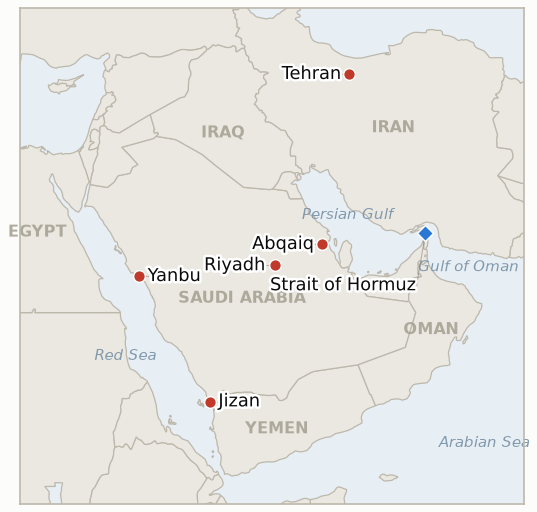

# Middle East Daily Briefing

**July 29, 2026**

- **Reporting window:** ~24 hours, July 28, 09:00 to July 29, 09:00 KST
- **Overall assessment:** The pause held through its first real stress test, Tuesday's White House meeting between Trump and Netanyahu, and the market kept pricing that fact rather than the war's actual toll: Brent settled down another 4.8% at $84.09, a second consecutive close below $90. But the toll got a great deal more concrete overnight. Satellite imagery and independent thermal data now confirm real fire damage at Abqaiq, the facility that stabilizes the bulk of Saudi crude before export, well beyond the interception-only picture this brief carried yesterday; Aramco has shut the 400,000 barrel a day Jazan refinery outright, with repairs not expected before mid-August; and Kpler-sourced data show Yanbu, the sole outlet for Korea's entire Hormuz workaround, loading somewhere between a third and 40% below its run rate of two weeks ago. None of that moved the price down. It moved the price down anyway, because the pause is what the marginal trader is pricing, not the stock of damage already done. Separately, Trump and Netanyahu's first meeting since the war began surfaced open friction, with Israel's defence minister saying Washington is the one blocking further Israeli strikes on Iranian energy targets for fear of touching off a wider war and a genuine global oil crisis, and Iran moved to weaponize Trump's own compensation proposal by threatening to bar any ship that accepts a payout from its frozen assets from ever transiting the strait again. For Seoul, the day's most consequential number was not an oil price: KOSPI suffered its worst session since April, down 10.84% on a China chip-tooling scare that has nothing to do with the Middle East, while the won actually firmed on cheaper oil, a clean decoupling of the two channels this briefing has been trying to keep separate all month.

**Corrections and updates:** The July 28 brief (§1.1) described the Abqaiq damage claim as resting "entirely on low-tier outlets and social media," with Tier 1 reporting describing interception with no confirmed damage. That has changed: Bloomberg's own review of Sentinel-2 satellite imagery, corroborated by NASA FIRMS thermal-anomaly data, now shows genuine smoke, flaring and fire activity at the site consistent with real damage, not a clean interception. The specific claim of four of six processing spheroids burn-scarred and two destroyed remains sourced to an OSINT account analysing the same imagery, not to Aramco or the Saudi government, and is carried below at correspondingly lower confidence; see 1.1 and IND-20260728-1's resolution in §3.

---

## 1. What Happened

<figure style="float:right; width:46%; margin:2pt 0 8pt 14pt;">

<figcaption style="font-size:8pt; color:#666; text-align:center; margin-top:3pt; font-style:italic;">Major places of discussion</figcaption>
</figure>

### 1.1 Satellite Imagery and a Refinery Shutdown Confirm Real Damage From the July 27 Raid

Bloomberg reported that Sentinel-2 satellite imagery shows smoke and active flaring at Abqaiq, the world's largest crude oil stabilization plant, which processes roughly 5 to 7% of global oil supply, and said traders were watching for disruptions ([Bloomberg](https://www.bloomberg.com/news/articles/2026-07-27/satellite-shots-of-smoke-at-saudi-oil-sites-keep-traders-on-edge)). NASA FIRMS independently registered multiple active fire hotspots at the complex. An OSINT account analysing the same Sentinel-2 pass went further, reporting burn scars across four of the plant's six crude-processing spheroids, two of them apparently destroyed, with firefighting foam visible on one; several outlets, though none of them Aramco or the Saudi government directly, reported that Aramco had fully halted operations at the site, removing on the order of 7 million barrels a day of processing capacity ([Middle East Eye](https://www.middleeasteye.net/live-blog/live-blog-update/saudi-arabia-halt-operations-major-oil-facility-after-houthi-attack), [caliber.az](https://caliber.az/en/post/saudi-aramco-halts-operations-at-abqaiq-oil-facility-after-houthi-drone-attack)). Separately and more solidly sourced, Aramco has shut its 400,000 barrel a day Jazan refinery after the same wave of attacks damaged the integrated gasification combined-cycle complex and an oil tank area, with a consultancy note cited by Reuters putting a tentative restart around August 15 ([BOE Report/Reuters-IIR](https://boereport.com/2026/07/28/saudi-aramco-shuts-jazan-oil-refinery-after-attack-iir-note-shows/)). Attribution stays contested: Saudi Arabia's defence ministry blames Iran-backed militias launching from Iraq, the Houthis claim the strikes on Yanbu-feeding infrastructure, and the Islamic Resistance in Iraq denies responsibility and says Riyadh is blaming Iraqis rather than answer the Houthis directly. **Confidence: High** that a real fire and physical damage occurred at Abqaiq (Bloomberg's own imagery review, corroborated by independent NASA FIRMS data) and that Jazan is shut with an August 15 target (Reuters-sourced IIR note); **Medium** on Aramco having fully halted all Abqaiq operations, which rests on convergent but non-primary reporting; **Low** on the specific four-of-six-spheroids, two-destroyed characterization, which is OSINT-sourced only.

### 1.2 Yanbu Crude Loadings Fall Toward 40% Below Their Recent Run Rate

Kpler-sourced trade data show Yanbu crude loadings sliding hard from the near-record pace of two weeks ago: shipments reached roughly 4.7 million barrels a day around July 13, and reporting this week puts the decline at somewhere between roughly a third and about 40% since July 19, coinciding with the start of the Houthis' declared naval blockade of Saudi ports ([Baird Maritime](https://www.bairdmaritime.com/shipping/ports/saudi-yanbu-crude-loadings-stumble-following-near-record-export-streak); [PressTV, cite cautiously as Iranian state media reporting a Kpler-derived figure](https://www.presstv.co.uk/Detail/2026/07/27/773191/Saudi-oil-loading-volumes-fall-40--)). That builds on Wood Mackenzie's separately reported finding that Saudi Arabia's total Red Sea crude bypass volume had already declined 41% from its March peak by June, before this month's escalation. Yanbu handled roughly 92% of Saudi Arabia's seaborne crude exports in June and is the only high-volume outlet functioning since Iran's effective closure of Hormuz, and Argus reports Aramco's rerouting options around the loss are limited; gCaptain separately reports Asian buyers are already in early talks to reroute some cargoes around Africa rather than rely on Yanbu alone. This is the precise corridor carrying all fifteen of Korea's Red Sea workaround tanker liftings. **Confidence: High** on the direction and rough magnitude of the loading decline (Kpler-sourced, multiple outlets, consistent with the Wood Mackenzie and Argus context); **Medium** on the exact percentage, which varies by outlet and measurement window.

### 1.3 Oil Settles Below $90 for a Second Session

Brent for September settled **4.8% lower at $84.09** and WTI **4% lower at $79.26**, the second consecutive settle below $90 after Monday's $88.36, as the US-Iran pause held through the Trump-Netanyahu meeting ([CNBC](https://www.cnbc.com/2026/07/28/oil-price-today-wti-brent-us-iran-hormuz.html); [Fortune](https://fortune.com/article/price-of-oil-07-28-2026/)). The move came on the same day imagery confirmed real damage at Abqaiq and Aramco confirmed the Jazan shutdown, which is the striking feature of the session: the market priced the absence of new strikes far more heavily than the presence of confirmed damage to existing capacity. Reporting also noted a secondary tailwind from Russia's Caspian Pipeline Consortium terminal at Novorossiysk resuming exports after the Ukrainian drone disruptions earlier in the month. **Confidence: High** on both settlement prices and percentages (CNBC and Fortune, corroborating); **Medium** on how much of the move to attribute to the pause specifically, given the confirmed supply-side damage cuts the other way.

### 1.4 Trump and Netanyahu Meet Amid Friction, and Israel Says Washington Is Holding Back Further Strikes

Netanyahu's first White House meeting with Trump since the war began covered Iran, the Lebanon pilot-zone framework and Abraham Accords expansion; the two leaders were reported to agree Iran must never obtain a nuclear weapon, described by some coverage as a "major moment of coordination" ([Democracy Now](https://www.democracynow.org/2026/7/28/headlines/trump_hosts_netanyahu_at_the_white_house_as_us_weighs_next_steps_against_iran); [Al Jazeera](https://www.aljazeera.com/news/2026/7/28/netanyahu-in-the-white-house-whats-on-the-agenda-and-whats-next)). But the run-up was visibly tense: Trump expressed public irritation that Netanyahu's planned talking points on Iran's Pickaxe Mountain nuclear facility had leaked, saying "I don't need Bibi to tell me that. Bibi's telling me that because he wants me to stay involved," and Israeli officials said afterward the subject did not even come up in the actual meeting ([ABC News](https://abcnews.com/International/live-updates/iran-live-updates-tehran-progress-made-strait-hormuz/?id=135110405); [Times of Israel](https://www.timesofisrael.com/liveblog_entry/irans-pickaxe-mountain-did-not-come-up-in-netanyahu-trump-meeting-says-israels-public-diplomacy-chief/)). Separately, Israeli Defence Minister Israel Katz said on Israeli television that Israel wants to strike Iran's energy infrastructure but the United States is not approving it, "because of concerns that Iran would attack neighboring countries and trigger a global oil crisis" ([JNS](https://www.jns.org/news/israel-news/katz-israel-wants-to-hit-iranian-energy-targets-us-not-approving); [TASS](https://tass.com/world/2166447)). **Confidence: High** on the meeting's occurrence, its agenda and the quoted friction (multi-outlet, direct quotation); **High** on Katz's statement (direct quotation, multiple outlets); **Medium** on how much this reflects genuine strategic divergence versus pre-meeting positioning by both sides.

### 1.5 Iran Moves to Weaponize Compensation: Accept a Payout, Lose Hormuz Access

Iran's armed forces rejected Trump's proposal to compensate ship owners for vessels damaged transiting the strait using part of roughly $100 billion in Iran's frozen overseas funds, and warned that any vessel or company accepting such compensation will be barred from ever transiting Hormuz again ([Xinhua](https://english.news.cn/20260728/3dfc9e329bcc4c3f9ff5619ef4211782/c.html); [Press TV](https://www.presstv.co.uk/Detail/2026/07/28/773245/Iran-IRGC-warning-Hormuz-passage-US-compensation-frozen-assets); [Washington Times](https://www.washingtontimes.com/news/2026/jul/28/iran-country-takes-frozen-funds-cant-use-strait-hormuz/)). Iranian Foreign Minister Araghchi called the compensation plan an "incendiary precedent" undermining international norms; a military command spokesman said the damage occurred because of insecurity created by the US military's own "illegal and unsafe" routing south of the strait, not because of Iranian action. **Confidence: High** on the statement itself and the quotes (official Iranian sourcing, multi-outlet); **Low** on whether Iran can or would actually enforce a transit ban tied to a compensation payment years or months after the fact, which is untested.

---

## 2. Deep Dive: Incentives and Motives

### 2.1 Why did oil fall on the day Saudi Arabia's largest processing hub was confirmed hit?

Because the market is pricing a rate of change, not a level. The relevant question for a trader on July 28 was not "how much capacity is currently offline" but "how much more capacity is likely to go offline in the next week," and the answer to the second question improved even as the answer to the first one got worse. A pause that survives its first real stress test, the Trump-Netanyahu meeting, with no resumption of US strikes and no fresh Iranian retaliation, is information about the trajectory. Confirmed damage at a facility already understood to have been attacked on July 27 is not new information about the trajectory; it is a delayed, higher-resolution read on an event the market had already discounted at whatever probability it assigned to the original raid being real. This is the same decomposition this brief has been running for a week: an escalation premium that moves on headlines about the future, and a closure/damage premium that moves on confirmed facts about the present. Tuesday's session is the cleanest evidence yet that the market currently weights the first far more than the second, which is itself a bet that the war is winding down rather than escalating. If that bet is wrong, and Abqaiq's exports come back later and diminished, the repricing would be sharp and would fall on a market that has already spent its relief.

### 2.2 Why is Washington restraining the ally it started this war with?

Because the calculus that got the US into the air campaign is not the calculus that governs whether to let Israel finish it. Katz's statement, that the US is withholding approval for Israeli strikes on Iranian energy infrastructure specifically because Washington fears Iran would retaliate against neighboring states and trigger "a global oil crisis," is a straightforward admission that the Abqaiq and Jazan damage, and the still-live Yanbu corridor, have already raised the price of further escalation to a level the White House is not willing to pay. Trump's dismissal of Netanyahu's Pickaxe Mountain warnings as manufactured urgency, "he wants me to stay involved," reads the same way: Washington increasingly sees its own war aims as substantially met (Iran's nuclear ambitions checked, the network of proxies degraded) while Israel's threat perception has not correspondingly narrowed. The frictions on display Tuesday are not a rupture. They are what it looks like when a coalition's most powerful member starts pricing an exit and its junior partner has not.

### 2.3 Why did Iran reach for a transit ban instead of simply rejecting Trump's compensation offer?

Because a flat rejection concedes the underlying legal claim, that Iran's closure of the strait created a liability Iran should have to pay for, and a conditional ban does not. By threatening to bar any vessel that accepts compensation from its own frozen funds, Tehran reframes the entire question from "does Iran owe damages" to "who controls access to the strait," which is the same legal terrain Iran has been contesting since April against the UAE's IMO proposal and, more recently, in its own transit-toll negotiation with Oman. It also creates a coercive instrument with almost no cost to Iran today: no ship has yet accepted the compensation, so the threat is free until tested, while it simultaneously muddies Washington's proposal by making acceptance costly for exactly the shipowners it is meant to help. The tactic is consistent with a pattern this briefing has tracked all month, that Iran prefers to fight the maritime war on the field of law and access rather than kinetically, because that is the field on which a state that cannot contest the US Navy directly can still extract concessions.

### 2.4 Why did a Chinese chip headline do to Korea's market what five months of war could not?

Because the two channels through which this war reaches Korea's economy, the equity channel and the FX channel, run through entirely different mechanisms, and Tuesday separated them almost perfectly. KOSPI's 10.84% collapse was driven by Samsung and SK hynix falling 13 to 15% on reporting that China had begun mass production of domestic deep ultraviolet chipmaking tools, a competitiveness shock compounded by Nvidia-linked AI-bubble jitters in US trading, neither of which has any Middle East content. The won, meanwhile, firmed to 1,462.5, which is exactly what the oil channel predicts on a day crude fell again and month-end exporters were selling dollars: a war-linked FX improvement arriving in the same session as a chip-linked equity collapse. This is close to a clean natural experiment for IND-20260725-2, which was opened precisely to test whether Korea's equity volatility this month is the semiconductor cycle or the war. Tuesday's session argues strongly for the semiconductor cycle: the equity move tracks a sector-specific, war-unrelated catalyst, and the currency, which is the more direct transmission line for the war, moved the opposite direction. The risk for policymakers is the opposite error, treating a real war-transmission event as chip noise when one actually arrives, which is why the two channels need to stay analytically separate rather than being read off a single index.

---

## 3. Policy Implications for South Korea

### 3.1 Exposure snapshot

| Item | Current reading | Source |
| --- | --- | --- |
| July-August crude procurement | 100%+ of prior-year volume secured (MOTIE, July 27) | MOTIE via Hankyung, Aju, ZDNet Korea |
| September crude procurement | 90%+ secured (MOTIE, July 21/27) | MOTIE via Herald Business; `korea-exposure.md` |
| Red Sea detour routing | 15 Korean-chartered tankers, all loading at Yanbu | MOF via `korea-exposure.md` |
| Yanbu loading rate | Down roughly a third to 40% since July 19 | Kpler via Baird Maritime, PressTV |
| Strategic reserve coverage | ~26 days of actual consumption (estimate); reserve swap on immediate standby | CSIS; MOTIE July 27 |
| Brent | $84.09 settle, -4.8% (second sub-$90 settle) | CNBC, Fortune |
| KOSPI | 6,023.66, -10.84% (chip-driven, not war-linked) | Yonhap/Newspim; US News/AP |
| USD/KRW | ₩1,462.5, -6.0 won (won firmer) | Money Today, eToday |
| Hormuz transits | Last verified 3/day, July 24; no fresh count this window | Kpler via Baird Maritime |

### 3.2 Implications by development

**The corridor risk this briefing has been flagging is no longer theoretical.** Two of Korea's three-segment Hormuz workaround, the pipeline feeding Yanbu and the Yanbu terminal itself, have now shown measurable stress within the same week: a confirmed-damage attack upstream at Abqaiq and Jazan, and a 30 to 40% loading decline downstream at Yanbu. Procurement percentages measure contracted volume, not the survivability of the route delivering it, and the gap between those two numbers just widened. The right response is not to revise the procurement figures, which MOTIE has held steady, but to ask MOTIE and KNOC directly what loading rate at Yanbu would trigger the reserve swap, since "materially below run rate" is now the observed condition, not a hypothetical one.

**Washington's restraint on Israeli strikes is, from Seoul's perspective, a stabilizing fact worth watching for how long it holds.** Katz's statement that the US is withholding approval for strikes on Iranian energy infrastructure specifically to avoid a wider war and a global oil crisis is the clearest evidence yet that US policy is now actively bounding the downside Korea is exposed to. That restraint is a Washington preference, not a structural constraint, and it can change with one presidential decision; it belongs on the watch list as a policy input, not a floor to plan against.

**The oil price should still not be banked as a new range.** Two consecutive sub-$90 settles is the strongest data point yet for IND-20260727-2, and it resolves that indicator today. But it resolves it on a day when confirmed damage at Abqaiq argues the opposite direction on fundamentals, which means the settle reflects sentiment about the pause more than a considered view of restored supply. Planning off $84 while Jazan is offline until mid-August and Abqaiq's operational status is still unconfirmed by Aramco directly inverts the risk in the same way $88 did yesterday.

**Tuesday's KOSPI crash should be treated as exactly what it looks like: a chip-sector event, not a war event, and MOTIE and BOK should say so explicitly rather than let the two channels blur in public messaging.** The won's move the same day, in the opposite direction and for oil-related reasons, is the clearest confirmation available that the equity and FX channels are currently decoupled. Miscalibrating this now, either by over-attributing the equity rout to the war or by growing complacent about the currency channel because the equity channel looked so dramatic, would leave Korea's actual war-exposure monitoring pointed at the wrong indicator.

**Testable indicators:**

- **IND-20260729-1** — Aramco or the Saudi government issue a primary-source statement on Abqaiq's operational status. A direct Aramco or Saudi Energy Ministry statement confirming a processing halt or a resumption of normal operations at Abqaiq by ~2026-08-05 upgrades this brief's Medium-confidence read to High and, if a halt is confirmed, re-rates the entire oil-supply outlook regardless of what Brent is doing; continued silence past ~2026-08-05 with no throughput data revision falsifies the operational-halt claim as anything more than a media-sourced inference, and it should be downgraded back toward the interception-only read this brief carried on July 28.
- **IND-20260729-2** — Iran's frozen-asset transit ban gets tested or stays rhetorical. Any vessel or flag state accepting US-brokered compensation from Iran's frozen funds and then being denied Hormuz transit (or Iran backing down when actually challenged) by ~2026-08-12 confirms the threat is a real, enforceable instrument rather than a negotiating position; no vessel accepting the compensation and no test of the policy through ~2026-08-12 falsifies it as untested leverage, consistent with the reading in §2.3.
- **IND-20260729-3** — Korea's equity rout stays contained to chips or spreads into a broader flight from Korean risk. Cumulative foreign net selling extending beyond semiconductor names into broad Korean equities, or the won weakening back above ₩1,490 without intervention, by ~2026-08-03 would indicate the July 28 shock is bleeding into general risk appetite rather than staying sector-specific (complements and would materially inform IND-20260725-2's own July 31 resolution); a rebound or stabilization concentrated in chip names with the won holding below ₩1,480 through ~2026-08-03 confirms the chip-cycle read and the channel separation argued in §2.4.

**Resolutions this run:**

- **IND-20260715-3 — Falsified.** Opened to test whether the UAE would shift from hedging to belligerence, participating in US strikes, invoking collective defense, or expelling Iranian diplomats, within two weeks. Through today's deadline, UAE posture has stayed on the diplomatic and legal track: a July IMO submission (with eight allied states) contesting Iran's Hormuz conduct, which Iran rejected as politically motivated, but no military participation, no collective-defense invocation and no new diplomat expulsion. Protest and legal argument, not belligerence, is the standing UAE posture.
- **IND-20260716-2 — Falsified.** Opened after the IRGC named Bab el-Mandeb as available "to everyone or to no one." No verified Tehran-coordinated closure or attack on shipping in Bab el-Mandeb materialized in the two weeks to today's deadline; the Encelia strike and the broader Red Sea escalation scored separately under the Saudi-Houthi embargo track (IND-20260721-2), and Saudi Arabia has since resumed Bab al-Mandeb shipments after a brief halt. The IRGC threat reads, as this indicator anticipated on falsification, as rhetoric aimed at Riyadh and Abu Dhabi rather than a coordinated Iranian closure policy.
- **IND-20260726-1 — Confirmed.** The mutual US-Iran halt has now held roughly four days, from Friday July 25 through the Trump-Netanyahu meeting on July 28, with no CENTCOM strike resumption and no Iranian retaliation reported in this window. The pause has passed its first scheduled stress test and reads as a genuine, if unsigned, off-ramp rather than an operational gap.
- **IND-20260726-2 — Confirmed.** Kpler-sourced reporting shows Yanbu crude liftings running roughly a third to 40% below their July 19 rate, a decline this indicator's own bar, "materially below recent run rate," is built to catch. Korea's workaround corridor is now supply-constrained in a measurable way, not merely more expensive; see the implications in §3.2.
- **IND-20260727-2 — Confirmed.** Brent has now settled below $90 on two consecutive sessions, $88.36 on July 27 and $84.09 on July 28, against the falsification bar of a return above Friday's $97.39. The market has repriced the escalation premium out and is treating something near $84 to $88, not $90, as the new working ceiling of calm, with the caveat in §3.2 that this settle and confirmed Abqaiq damage are in tension.
- **IND-20260728-1 — Confirmed, with caveats.** Bloomberg's own Sentinel-2 imagery review, corroborated by independent NASA FIRMS thermal data, meets this indicator's bar of Tier 1 imagery analysis confirming physical damage at Abqaiq, materially upgrading the July 28 brief's "rumor" framing. The specific extent of the damage, four of six spheroids affected, two destroyed, and any full operational halt, remains sourced to OSINT analysis and convergent secondary reporting rather than to Aramco or the Saudi government directly; that residual uncertainty carries forward as new indicator IND-20260729-1.

---

## 4. Watch List

- **Aramco's continued silence on Abqaiq's operational status.** Two days after the raid, still no primary-source statement confirming or denying a processing halt, even as secondary reporting converges on one; see IND-20260729-1.
- **The Jazan restart timeline.** August 15 is a consultancy estimate, not an Aramco commitment; slippage would extend the refining-capacity gap into Korea's September procurement window.
- **Whether Asian buyers' talks to reroute crude around Africa firm up into actual bookings**, which would be the clearest signal yet that the Yanbu corridor is viewed as structurally, not just temporarily, constrained.
- **The second Lebanon pilot zone.** A tense but contained incident near Zawtar al-Sharqiyeh, Lebanese personnel briefly crossing into the Israeli-held security zone before withdrawing without injury, is not itself a second withdrawal but is the kind of friction that could derail the pattern IND-20260723-2 is tracking toward its August 6 deadline.
- **Saudi Arabia's response to the Abraham Accords condition**, on the agenda at the Trump-Netanyahu meeting per multiple reports, with no public Saudi movement yet toward or away from the linkage Trump has attached to the civilian nuclear deal.
- **Qatari LNG at Ras Laffan.** Still no fresh weekly loading figure; the longest-running unresolved item in the ledger.

---

## 5. Source Quality Summary

| Claim | Sources | Confidence |
| --- | --- | --- |
| Abqaiq shows real fire and smoke damage via Sentinel-2 imagery, corroborated by NASA FIRMS | Bloomberg (Tier 1, own imagery review); NASA FIRMS (independent public data) | High |
| Abqaiq fully halted, 7mbd offline; four of six spheroids affected, two destroyed | Middle East Eye, caliber.az (Tier 2); OSINT account analysis of Sentinel-2 (not Aramco/Saudi confirmed) | Medium on halt; Low on spheroid specifics |
| Aramco shut Jazan refinery (400,000 bpd); tentative August 15 restart | Reuters via IIR consultancy note, carried by BOE Report and multiple outlets (Tier 1-2) | High |
| Yanbu crude loadings down ~a third to 40% since July 19 | Kpler via Baird Maritime (Tier 2); PressTV figure treated cautiously as Iranian state media | High on direction; Medium on exact magnitude |
| Brent $84.09 (-4.8%), WTI $79.26 (-4%) settles | CNBC, Fortune (Tier 1) | High |
| Trump-Netanyahu meeting, agenda, Pickaxe Mountain friction | Democracy Now, Al Jazeera, ABC News, Times of Israel (Tier 1-2, multi-outlet, direct quotation) | High |
| Katz: US withholding approval for Israeli strikes on Iranian energy infrastructure over oil-crisis fears | JNS, TASS (Tier 2, direct quotation) | High |
| Iran bars vessels accepting frozen-asset compensation from Hormuz transit | Xinhua, Press TV, Washington Times (Tier 1-2, official Iranian statement, multi-outlet) | High on the statement; Low on enforceability |
| KOSPI -10.84% to 6,023.66, chip-driven (Samsung -13.4%, SK hynix -14.7%) | Yonhap/Newspim/eToday, US News/AP (Tier 1-2 Korean and international, multi-outlet) | High |
| Won firms to ₩1,462.5 on oil decline and month-end exporter selling | Money Today, eToday (Tier 1-2 Korean) | High |
| Second Lebanon pilot zone incident near Zawtar al-Sharqiyeh | Times of Israel (single outlet) | Medium |
