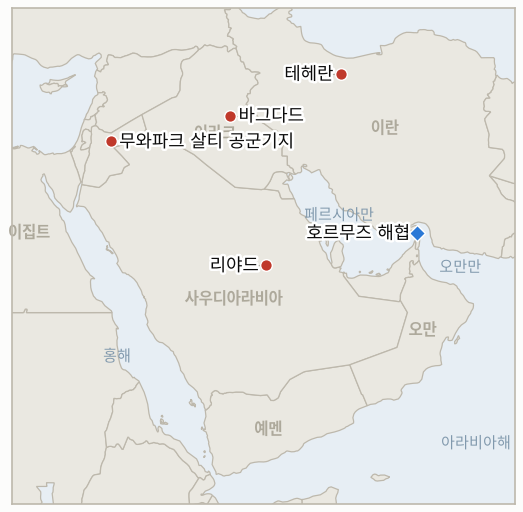

# 중동 일일 브리핑

**2026년 7월 30일**

- **보고 기간:** 약 24시간, 7월 29일 09:00 ~ 7월 30일 09:00 (한국시간)
- **종합 평가:** 어제 이 브리핑이 진정한 나흘간의 출구로 확인했던 휴전은 이틀을 채 넘기지 못했다. 서울 증시가 정반대의 이야기, 즉 트럼프-네타냐후 회담을 '극히 긍정적'으로 평가하며 긴장이 완화됐다는 이야기를 반영한 채 마감한 지 몇 시간 후, 이란 혁명수비대(IRGC)는 요르단 주둔 미군기지를 향해 탄도미사일을 발사하고 별도로 호르무즈 해협을 통과하던 유조선 3척을 공격해 정지시켰다. 요르단은 미사일 5발을 모두 요격해 인명 피해는 없었지만, 미국은 다른 곳에서 응답했다. 미국과 사우디아라비아 공군이 이라크 내에서 이번 전쟁 최초의 합동 공습을 감행해 7월 27일 아브카이크·지잔·얀부 공격의 배후로 지목된 이란 배후 민병대 거점을 타격했고, 최소 20명이 사망했다. 휴전의 힘으로 두 차례 90달러 아래로 마감했던 브렌트유는 단 하루 만에 그 하락분을 모두 되돌려 7.9% 오른 90.74달러로 마감했고, 트럼프는 폭스뉴스에 이란이 "응징을 당할 것"이라며 이란의 교량과 발전소를 파괴하겠다는 위협을 재개했다. 이란은 같은 날 오만의 호르무즈 공동 관리 제안을 정면으로 거부하면서도, 외무장관은 무스카트와 리야드에 전화를 걸어 '안정'을 요청했다. 이 모든 소식은 서울 마감 전까지 전해지지 않았다. 원화는 이제는 무의미해진 낙관론 속에 1,446.7원으로 강세를 보였고, 코스피의 이틀 연속 서킷브레이커, 5.98% 하락한 5,663.24는 여전히 전쟁과 무관한 중국발 반도체 이슈였다. 목요일 장이야말로 시장이 재점화된 전쟁을 실제로 반영해야 하는 첫 세션이다.

---

## 1. 무슨 일이 있었나

<figure style="float:right; width:46%; margin:2pt 0 8pt 14pt;">

<figcaption style="font-size:8pt; color:#666; text-align:center; margin-top:3pt; font-style:italic;">주요 논의 지점</figcaption>
</figure>

### 1.1 휴전 붕괴: 이란, 요르단과 호르무즈 유조선 3척 공격, 미국·사우디 이라크 타격

이란 혁명수비대는 요르단의 무와파크 살티 공군기지와 미 중부사령부(CENTCOM) 연락 거점을 향해 다수의 탄도미사일을 발사했으며, 미 중부사령부는 이를 '기습 공격 시도'로 규정했다. 요르단군은 방공망이 미사일 5발을 모두 요격·격추했으며 인명 피해나 시설 손상은 없었다고 밝혔다 ([Al Jazeera](https://www.aljazeera.com/news/2026/7/29/iran-attacks-us-bases-in-middle-east-as-trump-meets-netanyahu); [Washington Times](https://www.washingtontimes.com/news/2026/jul/29/jordan-intercepts-iranian-missiles-saudi-arabia-us-launch-strikes/)). 이란 혁명수비대 해군은 별도로 호르무즈 해협을 통과하던 유조선 3척이 경고를 무시하고 '위험하고 불법적인 항로'를 계속 항행했다는 이유로 이를 '타격해 정지시켰다'고 밝혔다. 다만 이번 창에서 선박명, 국적, 피해 규모는 독립적으로 확인되지 않았다 ([NPR/Reuters](https://www.npr.org/2026/07/29/g-s1-136063/us-saudi-arabia-iran-iraq)). 두 사건은 트럼프-네타냐후 회담 이후 몇 시간 만에, 이 브리핑이 7월 29일 나흘간의 출구로 확인했던 상호 자제(IND-20260726-1)와 화요일 백악관 회담을 넘긴 듯 보였던 그 흐름을 끝냈고, IND-20260727-1을 반증했다. 미국과 사우디아라비아는 별도로 즉각 대응했다. 미국-사우디 합동 전투기가 이라크 7개 주 전역의 '다수의 테러 조직 병참·무기 거점'을 타격했으며, 목표는 CENTCOM과 사우디 국방부가 7월 27일 아브카이크·지잔·얀부 공격의 배후로 지목한 이란 배후 민병대였다. 이라크 인민동원군(PMF)은 바그다드, 와시트, 니느와, 바스라, 키르쿠크, 카르발라, 디얄라 주 전역에서 최소 20명이 사망하고 32명이 부상했다고 밝히며 이를 '위험한 확전'이자 이라크 주권 침해라고 규정했다 ([Gulf News](https://gulfnews.com/world/mena/iran-fires-missile-at-us-base-in-jordan-us-saudi-forces-strike-iran-backed-militias-in-iraq-1.500623392); [NPR](https://www.npr.org/2026/07/29/g-s1-136063/us-saudi-arabia-iran-iraq)). 이는 이번 전쟁 최초로 미국과 사우디가 이라크 내에서 합동 공습을 감행한 사례로, IND-20260728-2를 마감(8월 11일)보다 크게 앞서 확정한다. **신뢰도: 높음** — 이란-요르단 미사일 공방과 요격 경위 (CENTCOM 및 요르단군 발표, 다수 1급 매체 교차 확인); **높음** — 미국-사우디 이라크 공습 및 PMF 사상자 수치 (사우디 국방부, CENTCOM, PMF 자체 집계, 복수 매체); **중간** — 호르무즈 유조선 공격의 세부사항, 이란 국영 매체 계열 보도에 근거해 선박 신원이나 피해가 독립적으로 확인되지 않음.

### 1.2 브렌트유, 전쟁 재점화로 7.9% 급등하며 90달러 재돌파

9월물 브렌트유는 7.9% 오른 90.74달러, WTI는 6.2% 오른 84.18달러로 마감해, 7월 27일 아브카이크 공격 이후 최저치를 기록했던 이틀간의 하락분을 단 하루 만에 모두 되돌렸다 ([CNBC](https://www.cnbc.com/2026/07/29/oil-prices-today-brent-wti-iran-us-hormuz.html); fxdailyreport.com). 이 움직임은 이 브리핑의 지표 기록부가 불과 하루 전 확정한 '진정 국면의 상한선'을 완전히 무효화했다. IND-20260727-2는 7월 27~28일의 90달러 이하 마감을 근거로 7월 29일 '확정(Confirmed)'으로 종결됐으나, 단 하루 만에 전쟁이 바로 그 지표가 측정하던 채널을 다시 열었다. 신규 지표 IND-20260730-1은 90.74달러가 하루짜리 확전 스파이크로 되돌려질지, 아니면 재점화된 전쟁이 시장의 작동 하한선을 위로 재설정했는지를 검증한다. **신뢰도: 높음** — 정산가와 등락률 (CNBC, 복수 업계 데이터 교차 확인); **중간** — 이번 상승분 중 요르단·호르무즈 공격에 직접 기인하는 비중, 정산가는 개별 헤드라인이 아닌 세션 전체를 반영하기 때문.

### 1.3 트럼프, 이란에 '응징' 경고하며 교량·발전소 타격 위협 재개

트럼프는 폭스뉴스의 트레이 잉스트 기자에게 미국이 이란을 "흠씬 두들겨 패주겠다"고 말했으며, "강하게 타격할 것이다. 그들은 응징을 당할 것"이라고 덧붙였다 ([Al Jazeera](https://www.aljazeera.com/news/2026/7/29/trump-says-us-to-deliver-beating-to-iran-after-bases-again-targeted); [JNS](https://www.jns.org/news/u-s-news/iran-going-to-get-a-beating-trump-tells-fox-news); [CNBC](https://www.cnbc.com/2026/07/29/us-iran-war-hormuz-centcom.html)). 복수 매체는 그가 "그들이 협상 테이블에 나오지 않으면 모든 교량을 파괴하겠다"는 이전 위협도 재개했으며, "에너지 시설은 마지막을 위해 아껴두겠다"고 말했다고 보도했다. 이는 트럼프가 7월 14일 처음 사용한 표현으로, 이번 주 그의 위협 재개 보도에서 다시 등장한 것이다 ([Bloomberg](https://www.bloomberg.com/news/articles/2026-07-29/trump-tells-fox-news-us-will-be-hitting-iran-hard-as-war-resumes)). 이번 창 안에서 CENTCOM의 이란 본토 타격 발표는 없었다. 지금까지 확인된 보복은 발언과 이라크 공습(§1.1)뿐이며, 미국-이란 직접 공중전 재개는 아니다. **신뢰도: 높음** — '응징' 발언 (직접 인용, 복수 매체, 당일 보도); **중간** — 교량·발전소 재위협의 정확한 시점, 일부 매체 보도가 7월 14일 원 발언에서 유래해 독립적으로 확인된 신규 발언인지 불명확.

### 1.4 이란, 오만의 호르무즈 공동 관리 제안 거부

이란 외무차관 카젬 가리브아바디는 제3국이 호르무즈 해협의 기뢰 제거와 통항을 공동 관리하자는 오만의 제안을 이란이 '차단'했다고 밝히며, 특히 통항 항로를 이란과 오만이 균등하게 분할 관리하자는 안을 거부했다. 그는 이란이 자국 측 항로는 직접 관리하고 오만은 반대편 항로의 일부만 관리하게 될 것이라고 말하며, 해협이 "결코 전쟁 이전 상태로 돌아가지 않을 것"이라고 선언했다 ([Al Jazeera](https://www.aljazeera.com/news/2026/7/29/iran-hits-us-in-jordan-us-saudi-strikes-on-iraq-is-war-spreading)). 이 거부는 이란 외무장관이 오만과 사우디 외무장관에게 전화를 걸어 '안정'을 확립하고 해협의 '조성된 불안'을 해소하자고 요청한 바로 그날 이루어졌으나, 양국 정부 어느 쪽에서도 즉각적인 반응은 나오지 않았다. **신뢰도: 높음** — 거부 사실 및 발언 인용 (이란 공식 발표, 복수 매체); **낮음** — 오만·사우디에 대한 병행 접촉이 외교 트랙의 실질적 재개를 의미하는지, 아니면 당일 군사적 충돌을 둘러싼 입지 다지기인지 (§2.3).

### 1.5 코스피 이틀 연속 서킷브레이커, 전쟁 재점화 이전 반도체 요인으로 발동

코스피는 5.98% 하락한 5,663.24로 마감했으며, 장중 5,262.77(-12.63%)까지 떨어졌다가 일부 회복했다. 이로써 코스닥과 함께 이틀 연속 시장 전체 서킷브레이커가 발동됐는데, 두 지수가 이틀 연속 거래를 중단한 것은 이번이 처음이다 (뉴시스; 코리아중앙데일리). 직접적 원인은 다시 반도체 부문이었다. SK하이닉스의 사상 최대 2분기 실적이 시장 예상치에 미달했고, 여기에 엔비디아 관련 AI 설비투자 우려와 중국 CXMT의 대규모 D램 장비 IPO 완료, 자국산 심자외선(DUV) 노광장비 개발 진전 보도가 겹치며 이는 전쟁 리스크가 아닌 경쟁 리스크였다. 삼성전자는 5.23% 내린 20만 8,500원, SK하이닉스는 9.61% 내린 140만 1,000원으로 마감했다 (머니투데이; 뉴시스). 원화는 15.8원 오른 1,446.7원으로 몇 주 만에 가장 강한 수준을 기록했는데, 이는 화요일 트럼프-네타냐후 회담이 이스라엘 당국자들에 의해 '극히 긍정적'이었다고 평가된 데 따른 지정학적 리스크 완화 반영이다 (파이낸셜뉴스). 두 움직임 모두 이란의 요르단 공격과 호르무즈 유조선 공격 소식이 아직 전해지지 않은 시장을 반영한다. 서울 장은 오후 3시 30분(한국시간)에 마감했고, 여러 매체는 전쟁 재점화 시점을 그 마감 이후 몇 시간 뒤로 기록하고 있다 (§2.4). **신뢰도: 높음** — 코스피 수치, 서킷브레이커, 반도체 요인 (한국·해외 복수 매체); **높음** — 원화 마감가; **중간** — 서울 마감과 이란 공격 사이의 정확한 시차, 매체마다 미사일 발사 시점에 대한 보도가 엇갈림.

---

## 2. 심층 분석: 동기와 유인

### 2.1 이 브리핑이 진정한 출구라고 확정한 지 이틀 만에 휴전이 붕괴한 이유는?

휴전이 애초에 서명된 협정이 아니었기 때문이다. 이는 어느 쪽도 협정 위반 없이 일방적으로 종료할 수 있는 암묵적 상호 자제였고, 그것이 바로 7월 25일 빠르게 성립됐던 것만큼 7월 29일 빠르게 폐기될 수 있었던 이유다. 이란 혁명수비대는 이번 달 내내 테헤란의 공식 외교 노선과 상당한 독자성을 보여왔다. 결국 실현되지 않은 바브엘만데브 위협, 사전 경고 없이 발표된 동결자산 통항 금지 조치가 그 예이며, 트럼프-네타냐후 회담 이후 약 하루 만에 공격이 이뤄진 시점은 우연이라기보다 테헤란이 자신이 포위된 것으로 인식하는 현 상태를 받아들이지 않겠다는 의도적 신호로 읽힌다. 이스라엘 국방장관 카츠의 7월 28일 발언, 즉 미국이 확전 우려로 이스라엘의 이란 에너지 시설 타격을 억제하고 있다는 인정은 테헤란에서 미국이 이란보다 확전을 더 두려워한다는 확인으로 받아들여졌을 수 있으며, 이는 정확히 시험을 초래하는 종류의 비대칭 인식이다. 이 브리핑 자체의 방법론에도 하나의 교정 교훈이 있다. IND-20260726-1을 96시간 시점인 7월 29일에 '확정'으로 종결한 것 자체가, 그 판정을 내린 직후 근본 패턴이 바로 그 판정을 위반할 위험을 만들어냈다. 그래서 더 좁고 더 늦은 시점을 검증하는 IND-20260727-1이 별도로 존재했던 것이고, 이미 종결된 지표가 아니라 바로 이 지표가 반증된 것이다.

### 2.2 사우디아라비아가 미국 단독 대응 대신 이라크 공습에 동참한 이유는?

7월 27일 아브카이크·지잔·얀부 공격이 다른 어떤 연합국도 공유하지 않는 방식으로 리야드 자신의 석유 경제에 사활적이었기 때문이다. 미국과 나란히 타격함으로써 사우디아라비아는 며칠 전 이스라엘 측에서 카츠가 불만을 제기했던 바로 그 미국의 자제에 전적으로 의존하기보다 직접 보복한다는 것을 입증할 수 있다. 이라크는 또한 이란 본토를 직접 타격하는 것보다 비용과 확전 위험이 낮은 무대다. 민병대는 부인 가능하고 지리적으로 제한된 목표물이어서, 리야드는 이란 영토 타격이 초래할 종류의 보복을 유발하지 않으면서도 국내 여론과 테헤란 양쪽에 결의를 보일 수 있다. 이번 공습을 미국의 대이란 캠페인 동참이 아니라 '사우디 석유 시설에 대한 공격'에 대한 대응으로 규정하는 것 역시, 리야드가 여전히 종식을 원한다고 말하는 전쟁과 예멘 공항 출구(IND-20260726-3), 아브라함 협정과 연계된 원자력 협정(IND-20260724-1)이라는 두 개의 병행 외교 트랙을 형식적으로 분리해 유지할 수 있게 해준다.

### 2.3 이란이 공격 당일 오만의 호르무즈 타협안을 거부한 이유는?

항로별로 명목상 분할하는 방식이라 해도 공동 관리를 받아들이는 것은, 이란이 4월 UAE의 국제해사기구(IMO) 제안에 맞서 저항해온 바로 그 원칙, 즉 해협 관리가 다자간 문제이지 이란이 부여하거나 보류할 수 있는 일방적 특권이 아니라는 원칙을 인정하는 셈이 되기 때문이다. 이를 군사적 확전과 같은 날 행하는 것은 모순이 아니라 상호 보완적 신호 발신이다. 거부와 동시에 능력과 결의를 과시하는 것은 말로만 하는 것보다 "조건은 우리가 정한다"는 주장을 더 신빙성 있게 만들며, 동시에 오만·사우디 외무장관에 대한 병행 접촉은 실질적 논점을 양보하는 것처럼 보이지 않으면서 체면을 지킬 수 있는 완화 채널을 남겨둔다. 이는 이 브리핑이 이번 달 내내 동결자산 통항 금지(IND-20260729-2)에서 추적해온 것과 같은 패턴이다. 미국 해군을 직접 상대할 수 없는 국가가 여전히 양보를 끌어낼 수 있는 법률·접근권의 장에서 해상전을 벌이는 것을 선호하면서도, 그 법적 주장을 신빙성 있게 만들기 위해 군사적 옵션을 살려두는 것이다.

### 2.4 한국 증시가 이번 전쟁의 다음 국면을 결정할 소식보다 몇 시간 먼저 마감한 이유는?

서울의 거래 시간(한국시간 09:00~15:30)이 걸프 지역의 이른 아침과 워싱턴의 야간 시간대에 거의 전부 포함되기 때문이다. 그래서 미국 오후·저녁 시간대(걸프 지역의 늦은 밤·이른 아침)에 터지는 미국-이란 관련 소식은 서울 증시가 이미 마감해 전날 서사를 반영한 뒤에야 도달한다. 수요일이 정확히 그런 경우였다. 서울 개장 시점에는 여전히 화요일 트럼프-네타냐후 회담에 대한 '극히 긍정적' 평가가 유효한 이야기였고, 휴전 붕괴는 서울의 오후 3시 30분 마감 이후 몇 시간이 지나서야 공개됐다. 이는 일회성 특이 사례가 아니라 한국 리스크 관리자들이 명시적으로 이해해야 할 구조적 시차다. 전쟁 충격이 미국이나 걸프 지역의 오후 시간대에 터지는 날에는, 서울은 사실상 그날 세션 내내 낡은 정보로 거래하는 셈이며, 수요일 코스피와 원화 움직임에 대한 정확한 해석은 "시장이 전쟁을 무관하다고 판단했다"가 아니라 "시장이 아직 소식을 전달받지 못했다"이다. 신규 지표 IND-20260730-2는 실제로 재점화된 전쟁을 앞두고 거래하는 첫 서울 세션인 목요일 개장이 이 정보를 어떻게 반영하는지를 직접 검증한다.

---

## 3. 한국에 대한 정책적 함의

### 3.1 노출 스냅샷

| 항목 | 현재 수치 | 출처 |
| --- | --- | --- |
| 7~8월 원유 도입 | 전년 동기 대비 100%+ 확보 (산업통상자원부, 7월 27일) | 산업통상자원부 (한경, 아주경제, ZDNet Korea 경유) |
| 9월 원유 도입 | 90%+ 확보 (산업통상자원부, 7월 21/27일) | 산업통상자원부 (헤럴드경제 경유); `korea-exposure.md` |
| 홍해 우회 항로 | 한국 용선 탱커 15척, 전량 얀부 선적 | 해양수산부 (`korea-exposure.md` 경유) |
| 얀부 선적률 | 7월 19일 이후 약 3분의 1~40% 감소, 이번 창 신규 수치 없음 | Kpler (Baird Maritime, PressTV 경유) |
| 비축유 대응 여력 | 실제 소비 기준 약 26일분(추정); 비축유 스와프 즉시 시행 대기 | CSIS; 산업통상자원부 7월 27일 |
| 브렌트유 | 90.74달러 마감, +7.9% (하루 만에 90달러 이하 완화 국면 반전) | CNBC |
| 코스피 | 5,663.24, -5.98% (이틀 연속 서킷브레이커; 반도체 요인, 전쟁 재점화 이전 수치) | 뉴시스; 코리아중앙데일리 |
| 원/달러 환율 | 1,446.7원, -15.8원 (원화 강세, 휴전 붕괴 이전 가격 반영) | 파이낸셜뉴스 |
| 호르무즈 통항량 | 7월 28일 확인된 통항 12건 (Kpler), 하루 3건에서 증가 | Kpler |

### 3.2 사안별 함의

**휴전 붕괴는 한국의 도입 물량 수치가 아니라 계획 수립의 시계를 재설정한다.** 산업통상자원부의 7~8월 및 9월 확보율은 여전히 완화될 수 있는 전쟁을 전제로 산정된 수치이며, 그 전제가 휴전 시작 이후 가장 큰 타격을 받았다. 적절한 대응은 계약 물량을 측정할 뿐 항로 생존 가능성을 측정하지 않는 도입률 수치를 수정하는 것이 아니라, 전쟁이 고위급 외교 회담이 성과를 내는 듯 보인 지 48시간 안에 재점화될 수 있음을 방금 입증한 상황에서 '즉시 시행 대기' 상태인 비축유 스와프를 더 짧은 통보 체계로 전환해야 하는지를 명시적으로 검토하는 것이다.

**리야드가 워싱턴과 함께 이라크 내 타격에 나선 결정은 안심 요인이 아니라 위험 확대 신호로 받아들여야 한다.** 이라크 내에서 미국과 최초로 합동 공습을 감행할 의사가 있는 사우디 정부는, 자국 영토 방어에서 자신을 공격했다고 지목한 네트워크를 적극적으로 약화시키는 단계로 이동한 정부다. 이는 한국의 홍해 우회 항로 전체가 의존하는 바로 그 에너지 시설, 아브카이크·지잔·얀부에 대한 추가적인 이라크발 보복 가능성을 낮추기보다 오히려 높인다.

**유가는 어느 방향으로든 전일 마감가에 고정하지 말고, 더 넓은 변동 구간을 전제로 계획해야 한다.** 90달러 이하 이틀 연속 마감은 7월 29일 IND-20260727-2를 진정한 재조정으로 확정했으나, 단 하루 뒤 브렌트유의 7.9% 반등은 근본 전쟁이 재개되는 즉시 그 재조정이 얼마나 취약한지를 보여준다. 한국의 하반기 계획은 IND-20260730-1이 확정될 때까지는 84달러 저점이나 100달러 고점 어느 한쪽을 기준선으로 삼기보다 85~95달러 수준을 현재 작동 구간으로 취급해야 한다.

**한국 금융 당국은 수요일 코스피와 원화 움직임이 전쟁 재점화를 반영하지 않는다는 점을 명시적으로 밝혀야 한다. 이 시차는 이 분쟁이 서울에 전달되는 방식의 실제 특성이지, 조용히 바로잡아야 할 오류가 아니기 때문이다.** 산업통상자원부와 한국은행은 목요일 세션이 반도체와 전쟁이라는 두 채널이 동시에 움직일 가능성에 대비해야 하며, 복합적인 움직임이 단일 신호로 잘못 해석되지 않도록 두 채널을 분리하는 명확한 공식 설명을 미리 준비해야 한다. 이는 7월 29일 이 브리핑이 반대 방향의 오판 위험으로 지적했던 것과 정확히 같은 종류의 오판이다.

**검증 가능한 지표:**

- **IND-20260730-1** — 브렌트유의 90달러 재돌파는 하루짜리 확전 스파이크인가, 새로운 하한선인가. 8월 5일까지 어느 세션에서든 브렌트유가 88달러 아래로 마감하면 90.74달러 마감은 되돌려지는 스파이크였음이 확정되고, 8월 5일까지 92달러 이상 이틀 연속 마감하면 재점화된 전쟁이 시장의 작동 하한선을 위로 재설정했음이 확정되어 IND-20260727-2의 '진정 국면 상한선' 판정이 확정 일주일 만에 뒤집힌다.
- **IND-20260730-2** — 한국 시장은 전쟁을 반영해 개장한 첫 세션에서 실제로 이를 재가격화하는가, 아니면 무시하는가. 7월 30일 또는 31일 서울 세션 중 어느 하루라도 코스피가 반도체 뉴스보다 중동 헤드라인을 더 따라 움직이거나, 원화가 유가 연동 흐름 대신 전쟁 요인으로 약세를 보이면 한국 시장이 실제 전쟁 충격이 거래 시간 내에 발생할 경우 이를 재가격화한다는 것이 확정된다. 두 세션 모두 반도체 관련 재료로만 움직이고 원화가 계속 강세를 보이거나 유지되면, 이는 반증되어 전쟁 채널이 명백한 충격에도 불구하고 유가 수준을 통해서만 가격에 반영됨을 의미한다.
- **IND-20260730-3** — 재점화된 충돌은 여러 밤에 걸쳐 이어지는가, 단발성 교전에 그치는가. 7월 29일 이후 사흘간의 밤 중 어느 하루라도 미국의 대이란 타격이나 이란의 추가적인 미국·동맹 목표물 타격이 8월 2일까지 발생하면, 휴전이 완전히 붕괴해 재개된 캠페인으로 전환됐음이 확정된다. 8월 2일까지 양측 모두 추가 타격이 없고 새로운 상호 자제가 재확립되면, 7월 29일은 양측이 확전 대신 흡수하기로 선택한 단발성 격렬한 교전이었음이 확정된다.

**이번 주 해소된 지표:**

- **IND-20260727-1 — 반증.** 화요일 트럼프-네타냐후 회담 이후 72시간 동안 조용한 휴전이 지속되는지를 검증하기 위해 개설됐다. 지속되지 않았다. 이란 혁명수비대가 그 시간 내에 요르단 내 미군 관련 목표물에 탄도미사일을 발사하고 호르무즈 유조선 3척을 공격했으며, 이는 규모나 결과와 무관하게 이란의 미군 관련 목표물 타격을 재개로 간주한다는 이 지표 자체의 채점 기준을 충족한다. 휴전은 첫 예정된 스트레스 테스트를 통과하지 못했다.
- **IND-20260728-2 — 확정.** 이라크 전선이 단발성 공격에 그칠지 캠페인으로 확대될지를 검증하기 위해 개설됐다. 사우디 국방부는 오늘 미국-사우디 합동 공습(최소 20명 사망, 32명 부상)을 사우디 석유 시설에 대한 민병대 공격과 명시적으로 연결지었으며, 이는 마감(8월 11일)보다 훨씬 앞서 '이라크 내 사우디의 군사적 대응'이라는 이 지표의 조건을 충족한다. 이라크 전선은 이제 미국-이란 전쟁 위에 겹쳐진, 좁지만 활성화된 캠페인이다.

---

## 4. 주시 목록

- **미국이 이라크 대리세력이 아닌 이란 본토를 직접 타격할지 여부.** 트럼프의 발언은 지금까지 확인된 CENTCOM의 실제 행동을 앞서고 있다 (IND-20260730-3).
- **브렌트유의 90달러 재돌파가 이번 주 내내 유지될지, 아니면 즉각적 충격이 흡수된 뒤 80달러 초반대로 되돌아갈지** (IND-20260730-1).
- **아람코와 사우디 정부의 아브카이크 가동 상태에 대한 침묵이 이어지는 상황.** 공격 발생 사흘째인데도 1차 출처 발표가 없다 (IND-20260729-1).
- **미국이 중개한 보상금을 수령하는 선박이 실제로 등장해 이란의 동결자산 통항 금지 위협을 시험하는지 여부** (IND-20260729-2), 여전히 검증되지 않은 위협.
- **레바논 시범구역 체제 내부의 마찰.** 프룬 마을에 주민들이 귀환하기 시작한 반면, 레바논군은 이스라엘이 남부 마을의 완전한 인수인계를 방해하는 계속된 포격과 소탕 작전을 벌이고 있다고 비난했다 (IND-20260723-2).
- **카타르 라스라판 LNG.** 19일째 동결 상태로 신규 주간 선적 수치가 없으며, 지표 기록부에서 가장 오래 미해결로 남은 항목이다.
- **하르그섬.** 여전히 타격받지 않았으나, 트럼프가 '에너지 시설은 마지막을 위해' 아껴두겠다는 위협을 재개하며 IND-20260727-3의 확정 분기가 여전히 살아있다.

---

## 5. 출처 품질 요약

| 주장 | 출처 | 신뢰도 |
| --- | --- | --- |
| 이란 IRGC, 요르단 기지에 미사일 발사, 전량 요격, 인명피해 없음 | CENTCOM·요르단군 발표 경유 Al Jazeera, Washington Times, NPR/Reuters (1급, 복수 매체) | 높음 |
| IRGC, 호르무즈 해협 유조선 3척 타격·정지 | NPR/Reuters (이란 국영매체 인용, 1급 매체 경유 국영 1차 주장) | 중간 |
| 미국·사우디, 이라크 내 이란 배후 민병대 타격, 20명 사망·32명 부상 | Gulf News, NPR, Al Jazeera, 사우디 국방부 발표, PMF 자체 집계 (1~2급, 복수 매체) | 높음 |
| 트럼프: 이란 "응징 당할 것", "흠씬 두들겨 패주겠다" | Al Jazeera, JNS, CNBC (1~2급, 직접 인용, 복수 매체) | 높음 |
| 트럼프, 교량·발전소 타격 위협 재개, "에너지 시설은 마지막을 위해" | Bloomberg, Times of Israel (1~2급; 정확한 재발언 시점 불확실, 7월 14일 원 발언 유래) | 중간 |
| 브렌트유 90.74달러 마감(+7.9%), WTI 84.18달러 마감(+6.2%) | CNBC, fxdailyreport.com/TradingEconomics (1~2급) | 높음 |
| 이란, 오만의 호르무즈 공동 관리 제안 거부 | Al Jazeera (이란 공식 발표, 단일 1차 매체) | 발표 자체는 높음; 대안의 실효성은 낮음 |
| 코스피 -5.98% 5,663.24, 이틀 연속 서킷브레이커, 반도체 요인 | 뉴시스, 코리아중앙데일리, 머니투데이 (1~2급 한국 매체, 복수 매체) | 높음 |
| 원화, 공격 이전 완화 심리 반영해 1,446.7원 강세 | 파이낸셜뉴스 (1~2급 한국 매체) | 높음 |
| Kpler: 7월 28일 호르무즈 확인 통항 12건, 하루 3건에서 증가 | Kpler 공식 계정 (단일 1차 데이터 출처) | 중간 |
