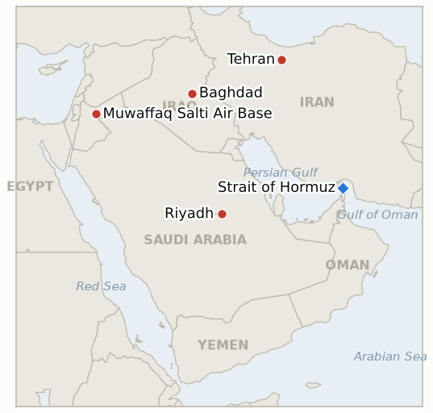

# Middle East Daily Briefing

**July 30, 2026**

- **Reporting window:** ~24 hours, July 29, 09:00 to July 30, 09:00 KST
- **Overall assessment:** The pause this brief confirmed yesterday as a genuine four day off ramp survived barely two more days. Hours after Seoul's markets closed pricing the opposite story, a "extremely positive" Trump Netanyahu meeting and easing tension, Iran's Revolutionary Guard fired ballistic missiles toward a US air base in Jordan and separately struck and halted three tankers transiting the Strait of Hormuz. Jordan intercepted all five missiles with no casualties, but the United States answered elsewhere: US and Saudi aircraft carried out the war's first joint strikes inside Iraq, hitting Iran backed militia sites blamed for the July 27 raid on Abqaiq, Jazan and Yanbu, killing at least 20 fighters. Brent, which had settled twice below $90 on the strength of the pause, reversed the entire move in a single session, up 7.9% to $90.74, while Trump told Fox News Iran is "going to get a beating" and revived his threat to knock out Iranian bridges and power plants. Iran used the same day to reject Oman's proposal for jointly managing Hormuz traffic outright, even as its foreign minister called Muscat and Riyadh seeking "stability." None of this had reached Seoul by the close: the won firmed to 1,446.7 on the now superseded optimism, while KOSPI's second consecutive circuit breaker, down 5.98% to 5,663.24, stayed a China chip story unrelated to the war. Thursday's session is the first the market has to actually price a war that reignited hours after Korea went home.

---

## 1. What Happened

<figure style="float:right; width:46%; margin:2pt 0 8pt 14pt;">

<figcaption style="font-size:8pt; color:#666; text-align:center; margin-top:3pt; font-style:italic;">Major places of discussion</figcaption>
</figure>

### 1.1 The Pause Collapses: Iran Strikes Jordan and Three Hormuz Tankers, US and Saudi Arabia Hit Iraq

Iran's Islamic Revolutionary Guard Corps fired multiple ballistic missiles toward Muwaffaq Salti air base and a CENTCOM liaison center in Jordan, in what US Central Command called an "attempted surprise attack"; Jordan's military said its air defenses intercepted and destroyed all five missiles, with no casualties or damage reported ([Al Jazeera](https://www.aljazeera.com/news/2026/7/29/iran-attacks-us-bases-in-middle-east-as-trump-meets-netanyahu); [Washington Times](https://www.washingtontimes.com/news/2026/jul/29/jordan-intercepts-iranian-missiles-saudi-arabia-us-launch-strikes/)). Iran's Revolutionary Guard navy separately said it "struck and brought to a halt" three oil tankers transiting the Strait of Hormuz for continuing along what it called an "unsafe and illegal route" in defiance of its warnings; no tanker names, flags or damage details were independently confirmed in the window ([NPR/Reuters](https://www.npr.org/2026/07/29/g-s1-136063/us-saudi-arabia-iran-iraq)). The two events ended, within hours of the Trump Netanyahu meeting, the mutual halt this brief confirmed on July 29 as a four day off ramp (IND-20260726-1) and that had appeared to survive Tuesday's White House meeting, falsifying IND-20260727-1. The United States and Saudi Arabia answered separately and immediately: joint US-Saudi fighter aircraft struck "multiple terrorist logistics and weapons sites" across seven Iraqi provinces, targeting Iran backed militias that CENTCOM and Saudi Arabia's Ministry of Defence blame for the July 27 raid on Abqaiq, Jazan and Yanbu; Iraq's Popular Mobilisation Forces said at least 20 of its fighters were killed and 32 wounded across sites in Baghdad, Wasit, Nineveh, Basra, Kirkuk, Karbala and Diyala provinces, calling the strikes a "dangerous escalation" and a violation of Iraqi sovereignty ([Gulf News](https://gulfnews.com/world/mena/iran-fires-missile-at-us-base-in-jordan-us-saudi-forces-strike-iran-backed-militias-in-iraq-1.500623392); [NPR](https://www.npr.org/2026/07/29/g-s1-136063/us-saudi-arabia-iran-iraq)). This is the war's first joint US-Saudi strike inside Iraq, confirming IND-20260728-2 well ahead of its August 11 deadline. **Confidence: High** that the Iran-Jordan missile exchange and interception occurred as described (CENTCOM and Jordanian military statements, corroborated by multiple Tier 1 outlets); **High** on the US-Saudi Iraq strikes and PMF casualty figures (Saudi MoD, CENTCOM, PMF's own count, multi-outlet); **Medium** on the Hormuz tanker strike specifics, which rest on Iranian state-linked reporting without independent confirmation of vessel identity or damage.

### 1.2 Brent Surges 7.9 Percent Back Above $90 as the War Reignites

Brent for September delivery settled 7.9% higher at $90.74 and WTI 6.2% higher at $84.18, reversing in a single session the entire two day decline that had carried both benchmarks to their lowest settles since before the July 27 Abqaiq raid ([CNBC](https://www.cnbc.com/2026/07/29/oil-prices-today-brent-wti-iran-us-hormuz.html); fxdailyreport.com). The move fully erased the "ceiling of calm" this brief's ledger confirmed only one day earlier: IND-20260727-2 resolved Confirmed on July 29 against the July 27 and 28 sub-$90 settles, and a single trading day later the war reopened the exact channel that indicator measured. New indicator IND-20260730-1 tests whether $90.74 is a one day escalation spike that unwinds, or the reignited war has reset the market's working floor upward. **Confidence: High** on the settlement levels and percentage changes (CNBC, corroborating industry data); **Medium** on how much of the move to attribute to the Jordan/Hormuz attack specifically versus a broader unwind of the prior two sessions' relief pricing, since the settle reflects the whole trading session rather than a single headline.

### 1.3 Trump Vows a Beating for Iran and Revives the Bridges and Power Plants Threat

Trump told Fox News's Trey Yingst the US would "beat the f------ s--- out of" Iran, adding "We'll be hitting them hard. They're going to get a beating" ([Al Jazeera](https://www.aljazeera.com/news/2026/7/29/trump-says-us-to-deliver-beating-to-iran-after-bases-again-targeted); [JNS](https://www.jns.org/news/u-s-news/iran-going-to-get-a-beating-trump-tells-fox-news); [CNBC](https://www.cnbc.com/2026/07/29/us-iran-war-hormuz-centcom.html)). Multiple outlets reported he also renewed an earlier threat to "knock out all their bridges" and power plants "unless they get to the table and negotiate," saying he would "save the energy targets for last," language Trump first used on July 14 and that recirculated in Wednesday's coverage of his renewed threats ([Bloomberg](https://www.bloomberg.com/news/articles/2026-07-29/trump-tells-fox-news-us-will-be-hitting-iran-hard-as-war-resumes)). No CENTCOM strike on Iranian territory was announced inside this brief's window; the retaliation confirmed so far is rhetorical plus the Iraq strikes (§1.1), not a resumption of the direct US-Iran air campaign. **Confidence: High** on the "beating" quotes (direct, multi-outlet, same day sourcing); **Medium** on the bridges and power plants restatement, since some carrier reporting of the exact wording traces to the July 14 original threat rather than an independently confirmed new utterance.

### 1.4 Iran Rejects Oman's Plan to Jointly Manage Hormuz Traffic

Iran's Deputy Foreign Minister Kazem Gharibabadi said Tehran "blocked" Oman's proposal for a third country to help de-mine and jointly manage traffic through the Strait of Hormuz, rejecting specifically a plan to split the transit lanes evenly between Iranian and Omani management; he said Iran would instead manage shipping on its own side of the strait while Oman oversees only part of the opposing lane, and declared the strait "will never return to its pre-war state" ([Al Jazeera](https://www.aljazeera.com/news/2026/7/29/iran-hits-us-in-jordan-us-saudi-strikes-on-iraq-is-war-spreading)). The rejection came the same day Iran's foreign minister called his Omani and Saudi counterparts seeking to "establish stability" and address the strait's "imposed insecurity," without an immediate readout from either government. **Confidence: High** on the rejection and quotes (Iranian official statement, multi-outlet); **Low** on whether the parallel outreach to Oman and Saudi Arabia signals a genuine reopening of the diplomatic track or is positioning around the day's military exchange (§2.3).

### 1.5 KOSPI's Second Circuit Breaker Runs on Chips, Hours Before the War Reignited

KOSPI fell 5.98% to 5,663.24, with an intraday low of 5,262.77 (down 12.63%) before a partial recovery, triggering a market-wide circuit breaker for a second consecutive session together with KOSDAQ, the first time both indices have halted trading on consecutive days (Newsis; Korea JoongAng Daily). The proximate driver was again the semiconductor sector: SK hynix's record Q2 profit missed analyst estimates, compounding Nvidia-linked AI-capex jitters and reports that China's CXMT completed a major DRAM-tooling IPO and is advancing domestic deep ultraviolet lithography capacity, a competitive threat rather than a war-risk one; Samsung Electronics fell 5.23% to 208,500 won and SK hynix 9.61% to 1,401,000 won (Money Today; Newsis). The won firmed 15.8 won to 1,446.7, its strongest level in weeks, on reduced geopolitical-risk pricing after Tuesday's Trump Netanyahu meeting was characterized by Israeli officials as "extremely positive" (Financial News/fnnews). Both moves reflect a market that had not yet learned of Iran's attack on Jordan and the Hormuz tankers: Seoul's session closed at 15:30 KST, and outlets place the war's reignition in the hours after that close (§2.4). **Confidence: High** on the KOSPI figures, circuit breaker and chip-sector attribution (multi-outlet Korean and international reporting); **High** on the won close; **Medium** on the precise timing gap between Seoul's close and the Iran attack, since outlets differ on the exact hour of the missile launch.

---

## 2. Deep Dive: Incentives and Motives

### 2.1 Why did the pause collapse two days after this brief confirmed it as a genuine off ramp?

Because the pause was never a signed instrument. It was an unstated mutual restraint that either side could exit unilaterally without violating any agreement, which is exactly what made it fast to establish on July 25 and just as fast to abandon on July 29. Iran's IRGC has repeatedly shown meaningful autonomy from Tehran's stated diplomatic posture this month, the Bab el-Mandeb threat that never materialized, the frozen-asset transit ban announced without warning, and a strike timed to land within roughly a day of the Trump-Netanyahu meeting reads less like coincidence than a deliberate signal that Tehran will not accept a status quo it perceives as encirclement. Israeli Defence Minister Katz's July 28 admission that Washington is restraining Israeli strikes on Iranian energy infrastructure specifically out of fear of a wider war may have been read in Tehran as confirmation that the United States fears escalation more than Iran does, which is precisely the kind of perceived asymmetry that invites a probe. There is also a calibration lesson for this brief's own methodology: resolving IND-20260726-1 as Confirmed at its 96 hour mark on July 29 created exactly the risk that the underlying pattern would immediately violate the reading that had just resolved it, which is why IND-20260727-1 existed as a narrower, later test and why it, not the already-closed indicator, is the one that falsified.

### 2.2 Why did Saudi Arabia join the US in striking Iraq rather than let Washington act alone?

Because the July 27 raid on Abqaiq, Jazan and Yanbu was existential to Riyadh's own oil economy in a way no other coalition member shares, and striking alongside Washington lets Saudi Arabia demonstrate it retaliates directly rather than depending entirely on US restraint, the same restraint Katz complained about days earlier from the Israeli side. Iraq is also a lower cost, lower escalation risk venue than striking Iran itself: the militias are a deniable, geographically contained target set, which lets Riyadh signal resolve to its own domestic audience and to Tehran without provoking the kind of retaliation a strike on Iranian soil would invite. Framing the strikes as a response to attacks on "Saudi oil facilities" rather than as joining a US campaign against Iran also lets Riyadh keep its parallel diplomatic tracks, the Yemen airport off ramp (IND-20260726-3) and the Abraham Accords conditioned nuclear deal (IND-20260724-1), formally separate from a war it still says it wants to see wind down.

### 2.3 Why did Iran reject Oman's Hormuz compromise the same day it attacked?

Because accepting shared management, even nominally divided by lane, concedes the exact principle Iran has resisted since April against the UAE's IMO proposal: that the strait's governance is a multilateral question rather than Iran's unilateral prerogative to grant or withhold. Doing so on the same day as a kinetic escalation is not a contradiction but complementary signaling. Demonstrating capability and resolve at the same moment as the rejection makes the "we set the terms" claim credible in a way words alone would not, while the parallel outreach to Oman's and Saudi Arabia's foreign ministers preserves a face-saving channel for de-escalation without appearing to concede the substantive point. This is the same pattern this brief has tracked all month in the frozen-asset transit ban (IND-20260729-2): Iran prefers to fight the maritime war on the field of law and access, where a state that cannot contest the US Navy directly can still extract concessions, while keeping a kinetic option live to make the legal claims credible.

### 2.4 Why did Korea's market close hours ahead of the story that will define this war's next chapter?

Because Seoul's trading day, 09:00 to 15:30 KST, sits almost entirely within the Gulf's early morning and Washington's overnight, so any US-Iran news that breaks during the US afternoon or evening, which is the Gulf's late night or early morning, reaches Seoul only after its markets have already closed and priced the prior day's narrative. That is exactly what happened Wednesday: Tuesday's "extremely positive" characterization of the Trump-Netanyahu meeting was still the operative story when Seoul opened, and the pause's collapse became public only in the hours after Seoul's 15:30 close. This is not a one-off quirk but a structural lag Korean risk managers should understand explicitly: on days a war shock breaks in US or Gulf afternoon hours, Seoul is functionally trading on stale information for its entire session, and the accurate read of Wednesday's KOSPI and won moves is not that the market judged the war irrelevant, but that the market had not yet been told. New indicator IND-20260730-2 tests directly what Thursday's opening, the first Seoul session to actually trade against a live, reignited war, does with that information.

---

## 3. Policy Implications for South Korea

### 3.1 Exposure snapshot

| Item | Current reading | Source |
| --- | --- | --- |
| July-August crude procurement | 100%+ of prior-year volume secured (MOTIE, July 27) | MOTIE via Hankyung, Aju, ZDNet Korea |
| September crude procurement | 90%+ secured (MOTIE, July 21/27) | MOTIE via Herald Business; `korea-exposure.md` |
| Red Sea detour routing | 15 Korean-chartered tankers, all loading at Yanbu | MOF via `korea-exposure.md` |
| Yanbu loading rate | Down roughly a third to 40% since July 19; no fresh figure in window | Kpler via Baird Maritime, PressTV |
| Strategic reserve coverage | ~26 days of actual consumption (estimate); swap on immediate standby | CSIS; MOTIE July 27 |
| Brent | $90.74 settle, +7.9% (reverses the sub-$90 relief in one session) | CNBC |
| KOSPI | 5,663.24, -5.98% (second straight circuit-breaker day; chip-driven, pre-dates the war reignition) | Newsis; Korea JoongAng Daily |
| USD/KRW | ₩1,446.7, -15.8 won (won firmer, priced before the pause broke) | Financial News (fnnews) |
| Hormuz transits | 12 confirmed crossings, July 28 (Kpler), up from 3/day | Kpler |

### 3.2 Implications by development

**The pause's collapse resets Korea's planning clock, not its procurement numbers.** MOTIE's July-August and September coverage figures were built assuming a war that could still de-escalate; that assumption just took its sharpest hit since the pause began. The right response is not to revise the procurement percentages, which measure contracted volume rather than route survivability, but to ask explicitly whether the "immediate standby" strategic reserve swap should move to a shorter-notice footing given that the war has now demonstrated it can reignite inside 48 hours of a high-level diplomatic meeting that seemed to be working.

**Riyadh's decision to strike inside Iraq alongside Washington is a data point Seoul should treat as widening risk, not reassurance.** A Saudi government willing to conduct its first joint strikes with the US inside Iraq is a Saudi government that has moved from defending its own territory to actively degrading the network it blames for attacking it, which raises rather than lowers the odds of further Iraq-origin retaliation against the exact energy infrastructure, Abqaiq, Jazan, Yanbu, that Korea's entire Red Sea workaround depends on.

**The oil price should be planned as volatile around a wider band, not anchored to yesterday's settle in either direction.** Two consecutive sub-$90 settles resolved IND-20260727-2 as a genuine repricing on July 29; one trading day later, Brent's 7.9% reversal shows how little that repricing can be trusted to hold once the underlying war resumes. Korea's H2 planning should treat something like $85 to $95 as the live range rather than either the $84 low or the $100 high as a working base case, at least until IND-20260730-1 resolves.

**Korea's market authorities should say explicitly that Wednesday's KOSPI and won moves do not reflect the war's reignition, because the timing gap is a real feature of how this conflict reaches Seoul, not an error to be quietly corrected.** MOTIE and the Bank of Korea should be prepared for Thursday's session to move on both channels at once, chips and the war, and should have a clear public framing ready that separates the two rather than let a compound move get read as a single signal, exactly the miscalibration this brief has flagged as the risk in the opposite direction on July 29.

**Testable indicators:**

- **IND-20260730-1** — Brent's return above $90 is a one day escalation spike or a new floor. Brent settling below $88 on any session by ~2026-08-05 marks the 90.74 settle as a spike that unwinds; two consecutive settles at or above $92 by ~2026-08-05 confirms the reignited war has reset the market's working floor upward, reversing IND-20260727-2's "ceiling of calm" read within a week of it resolving.
- **IND-20260730-2** — Korea's markets reprice the war on the first session that opens against it, or shrug it off. A KOSPI move tracking Middle East headlines more than chip-sector news, or the won weakening on the war rather than firming on oil-linked flows, on either the July 30 or July 31 Seoul session confirms Korea's markets do reprice a live war shock once one lands inside trading hours; both sessions moving on chip-specific catalysts with the won continuing to firm or hold falsifies, meaning the war channel stays priced only through the oil level even when the shock is unambiguous.
- **IND-20260730-3** — The reignited campaign runs multiple nights or stays a single exchange. US strikes on Iran, or further Iranian strikes on US or allied positions, on any of the three nights following July 29 by ~2026-08-02 confirms the pause has fully collapsed into a resumed campaign; no further strikes by either side through ~2026-08-02, with a fresh mutual halt re-establishing itself, falsifies, meaning July 29 was a single sharp exchange both sides chose to absorb rather than escalate.

**Resolutions this run:**

- **IND-20260727-1 — Falsified.** Opened to test whether the quiet-for-quiet pause survived the 72 hours following Tuesday's Trump-Netanyahu meeting. It did not: Iran's IRGC fired ballistic missiles toward a US-linked position in Jordan and struck three Hormuz tankers well inside that window, meeting this indicator's own scoring note that any Iranian strike on a US position counts as resumption regardless of scale or outcome. The pause did not survive its first scheduled stress test.
- **IND-20260728-2 — Confirmed.** Opened to test whether the Iraqi front stays a single raid or becomes a campaign. Saudi Arabia's Ministry of Defence explicitly linked today's joint US-Saudi strikes on Iran-backed militia sites in Iraq, killing at least 20 and wounding 32, to militia attacks on Saudi oil facilities, meeting this indicator's "Saudi kinetic response inside Iraq" condition well ahead of its August 11 deadline. The Iraqi front is now an active, if narrow, campaign layered on the US-Iran war.

---

## 4. Watch List

- **Whether the United States actually strikes Iranian territory directly**, rather than only Iraq-based proxies, in response to Wednesday's attack; Trump's rhetoric has outrun any confirmed CENTCOM action so far (IND-20260730-3).
- **Whether Brent's return above $90 holds through the week** or reverts toward the low $80s once the immediate shock is absorbed (IND-20260730-1).
- **Aramco and the Saudi government's continued silence on Abqaiq's operational status**, now three days after the raid with no primary-source statement (IND-20260729-1).
- **Whether any vessel tests Iran's frozen-asset transit ban** by accepting US-brokered compensation (IND-20260729-2), still untested leverage.
- **Friction inside the Lebanon pilot-zone framework**: families began returning to Froun even as the Lebanese army accused Israel of continued shelling and clearance operations obstructing a full handover of southern villages (IND-20260723-2).
- **Qatari LNG at Ras Laffan**, still frozen at day 19 with no fresh weekly loading figure, the longest-running unresolved item in the ledger.
- **Kharg Island**, still untouched, but Trump's renewed threats to hold "energy targets for last" keep the confirmation branch of IND-20260727-3 live.

---

## 5. Source Quality Summary

| Claim | Sources | Confidence |
| --- | --- | --- |
| Iran's IRGC fires missiles at Jordan base, all intercepted, no casualties | CENTCOM and Jordanian military statements via Al Jazeera, Washington Times, NPR/Reuters (Tier 1, multi-outlet) | High |
| IRGC strikes and halts three tankers in the Strait of Hormuz | NPR/Reuters citing Iranian state media (Tier 1 carrier, Iranian-state-linked primary claim) | Medium |
| US and Saudi Arabia strike Iran-backed militias in Iraq; 20 killed, 32 wounded | Gulf News, NPR, Al Jazeera, Saudi MoD statement, PMF's own casualty count (Tier 1-2, multi-outlet) | High |
| Trump: Iran "going to get a beating," "beat the f------ s--- out of them" | Al Jazeera, JNS, CNBC (Tier 1-2, direct quotation, multi-outlet) | High |
| Trump renews bridges and power plants threat, "energy targets for last" | Bloomberg, Times of Israel (Tier 1-2; exact restatement date uncertain, traces to July 14 original) | Medium |
| Brent settle 90.74 (+7.9%), WTI settle 84.18 (+6.2%) | CNBC, fxdailyreport.com/TradingEconomics (Tier 1-2) | High |
| Iran rejects Oman's joint Hormuz management proposal | Al Jazeera (Iranian official statement, single primary outlet) | High on the statement; Low on enforceability of Iran's alternative |
| KOSPI -5.98% to 5,663.24, second circuit-breaker day, chip-driven | Newsis, Korea JoongAng Daily, Money Today (Tier 1-2 Korean, multi-outlet) | High |
| Won firms to ₩1,446.7 on pre-attack de-escalation sentiment | Financial News/fnnews (Tier 1-2 Korean) | High |
| Kpler: 12 confirmed Hormuz crossings on July 28, up from 3/day | Kpler official account (single primary data source) | Medium |
