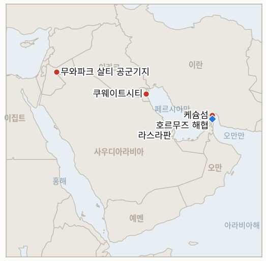

# 중동 일일 브리핑

**2026년 7월 31일**

- **보고 기간:** 약 24시간, 7월 30일 09:00 ~ 7월 31일 09:00 (한국시간)
- **종합 평가:** 어제 이 브리핑의 지표 기록부가 남겨둔 질문, 즉 7월 29일의 공방이 단발성 충돌이었는지 재개된 전면전의 시작이었는지는 하루 만에 답이 나왔다. 미 중부사령부(CENTCOM)는 이란 본토에 '대규모 파상 공습'을 감행해 이전 폭격보다 약 두 배 규모로 이란 혁명수비대(IRGC)의 지휘소, 미사일·드론 시설, 연안 감시·방어 거점, 해상 전력 등 6개 주에 걸친 수십 개 표적을 타격했다. 케슘섬의 한 주택가에서는 이 공습으로 두 살배기 아이를 포함한 일가족 3명이 사망했는데, 이는 휴전 이후 이란 본토 전쟁에서 보고된 가장 뚜렷한 민간인 피해다. 이란은 세 갈래로 동시에 응수했다. 요르단 무와파크 살티 공군기지를 향한 두 번째 미사일 공격은 인명 피해 없이 요격됐고, 쿠웨이트 북부의 한 중국 기업 건물에 대한 공격으로 노동자 1명이 숨졌는데 이는 이번 전쟁에서 중국 측 이해관계가 얽힌 첫 사망자다. 혁명수비대는 성명을 통해 호르무즈 해협을 '완전히 장악'했다고 주장하며 미국을 지원하는 어떤 국가에도 '강경한 대응'을 경고했다. 중부사령부는 이날 이란 측의 자체 주장들, 즉 F-35 3대 격추설과 카르그섬 타격설을 공개적으로 '팩트체크'하며 반박하는 데 하루의 상당 부분을 썼다. 유가는 확전을 따라가지 않았다. 브렌트유는 약 2% 내린 88.93달러, WTI는 1.6% 내린 83.09달러로 마감했는데, 유조선 통항은 계속됐기 때문이다. Kpler는 전날 호르무즈 해협 통과 선박이 14척이라고 집계했고, 카타르는 19일 만에 라스라판 LNG 화물의 첫 호르무즈 통과를 성사시켰다. 서울 증시는 이번 주 들어 처음으로 사후 반영이 아닌 실시간으로 전쟁이 진행 중인 상태에서 개장한 세션이었는데, 코스피는 사흘 연속 하락해 5,593.56으로 마감했다. 한국 언론은 이번 하락의 요인으로 반도체 업황·연준 요인과 함께 재점화된 전쟁을 명시적으로 지목했으며, 반면 원화는 연준의 금리 동결에 힘입어 1,437.4원으로 강세를 보여, 이 브리핑의 지표 기록부가 내일 마감까지 계속 추적할 괴리가 이어졌다.

---

## 1. 무슨 일이 있었나

<figure style="float:right; width:46%; margin:2pt 0 8pt 14pt;">

<figcaption style="font-size:8pt; color:#666; text-align:center; margin-top:3pt; font-style:italic;">주요 논의 지점</figcaption>
</figure>

### 1.1 미국, 휴전 붕괴 이후 처음으로 이란 본토 직접 공습

미 중부사령부는 이란 혁명수비대의 수십 개 표적을 겨냥해 '대규모 파상 공습'을 완료했다고 밝혔다. 표적에는 "군 지휘소, 미사일·드론 시설, 연안 감시·방어 거점, 해상 전력"이 포함됐으며, 약 두 시간에 걸친 작전 규모는 예루살렘포스트에 익명 소식통이 전한 바에 따르면 이전 폭격의 약 두 배였다 ([globalsecurity.org/RFE-RL](https://www.globalsecurity.org/military/library/news/2026/07/mil-260730-rferl01.htm); [Jerusalem Post](https://www.jpost.com/middle-east/iran-news/article-904062)). 케슘섬, 키시섬, 부셰르, 파르스, 후제스탄, 호르모즈간 등의 주에서 폭발음과 정전이 보고됐고, 작전 보고를 받은 트럼프 대통령은 취재진에게 "이전과 크게 다르지 않다... 이제 우리 차례이기 때문에 강하게 타격할 것"이라고 말했다 ([NBC News](https://www.nbcnews.com/world/iran/us-heavy-wave-strikes-iran-war-attack-trump-saudi-egypt-drone-oil-rcna589967)). 이는 7월 29일 휴전이 붕괴한 이후 미국이 이란 본토를 직접 타격했다고 인정한 첫 사례로, 전날 중부사령부와 사우디아라비아가 감행한 이라크 내 대리 세력 공격을 넘어선 조치다. 이로써 IND-20260730-3은 8월 2일 마감보다 훨씬 앞서, 첫 해당 야간에 확정(Confirmed)됐다. **신뢰도: 높음** — 공습 발생과 규모, 표적 범주 (CENTCOM 발표, 복수 매체 교차 확인); **중간** — '두 배 규모'라는 구체적 비교치는 익명의 단일 소식통에 근거.

### 1.2 미군 공습으로 케슘섬 일가족 3명 사망, 중부사령부는 이란 측 다른 주장 반박

이란 매체는 미군 공습이 케슘섬 차탕구 지역의 한 주택을 타격해 부부와 두 살배기 자녀가 사망하고 7세·9세 자녀 2명이 부상했다고 보도했으며, 잔해에 갇힌 것으로 우려되는 다른 이들에 대한 수색·구조가 계속되고 있다고 전했다 ([Middle East Eye](https://www.middleeasteye.net/live-blog/live-blog-update/us-strike-family-home-irans-qeshm-kills-three-including-toddler); [Press TV](https://www.presstv.co.uk/Detail/2026/07/30/773359/Iran-US-Qeshm-strike)). 미국은 이 창 안에서 사상자 보도에 직접 대응하지 않았지만, 중부사령부는 같은 날 이란 국영 매체에서 유포되던 혁명수비대의 다른 세 가지 주장, 즉 F-35 3대 등 항공기 파괴, 미군 인명 손실, 카르그섬 타격을 공개적으로 '팩트체크'해 반박했다. 중부사령부는 "미군 항공기는 파괴되거나 손상되지 않았다"며 카르그섬도 타격받지 않았다고 밝혔다 ([Washington Times](https://www.washingtontimes.com/news/2026/jul/30/centcom-rejects-irgc-claims-destroyed-jets-jordan-strikes/); [X/CENTCOM](https://x.com/CENTCOM/status/2082850478572900753)). 이번 창에서 카르그섬이나 다른 이란 원유 수출 터미널에 대한 검증된 타격은 발생하지 않았으며, 이에 따라 IND-20260727-3은 확정 조건에 이르지 못한 채 미해결로 남았다. **신뢰도: 중간** — 케슘섬 사상자 수치와 위치, 이란 매체 보도에 근거하며 중부사령부나 1급 통신사의 독립 확인은 아직 없음; **높음** — 중부사령부의 팩트체크 성명 자체와 그 내용 (직접 1차 출처, 복수 매체).

### 1.3 이란, 요르단 재공격하고 쿠웨이트 내 중국 기업 건물 타격해 노동자 1명 사망

미국의 이란 공습 몇 시간 후, 요르단군은 무와파크 살티 공군기지를 향해 발사된 이란 미사일 5발을 추가로 요격·격추했다고 밝혔다. 사흘 새 두 번째 요격이며 인명 피해는 없었다 ([ABC7/AP](https://abc7news.com/post/jordan-intercepts-iranian-missiles-us-saudi-arabia-launch-strikes-militias-iraq/19595522/)). 별도로 쿠웨이트 국방부는 '이란의 침공 행위'가 자국 북부의 한 중국 기업 건물을 타격해 노동자 1명이 사망하고 건물이 심하게 파손됐다고 밝혔으며, 해당 기업명이나 희생자 신원은 공개하지 않았고 이 창 안에서 중국 측의 즉각적인 언급은 없었다 ([Al Arabiya](https://english.alarabiya.net/News/gulf/2026/07/30/iranian-attack-hits-chinese-company-building-in-kuwait-killing-one-worker); [Times of Israel](https://www.timesofisrael.com/liveblog_entry/kuwait-says-iranian-strike-hit-chinese-company-building-killing-1/)). 이는 이번 전쟁에서 중국 상업적 이해관계와 관련된 첫 사망 사례이자, 재점화된 전쟁에서 발생한 첫 쿠웨이트 민간인 사망이다. **신뢰도: 높음** — 요르단 재요격과 쿠웨이트 공격·사망 (요르단·쿠웨이트 정부 발표, 복수 매체); **낮음** — 중국 기업 건물이 의도적으로 표적이 됐는지 아니면 광범위한 공격 중 우발적으로 피해를 입었는지, 어떤 출처도 이를 직접 다루지 않음 (§2.2).

### 1.4 이란 혁명수비대, 호르무즈 해협 완전 장악 주장하며 미국 지원국 위협

혁명수비대는 성명에서 "호르무즈 해협은 우리 땅이며, 혁명수비대 해군 병사들이 이를 완전히 장악하고 있다. 수천 킬로미터 떨어진 곳에서 온 이방인이 간섭하는 것은 용납되지 않을 것"이라고 밝혔고, 별도로 미국을 실질적으로 지원하는 어떤 국가도 "강경한 대응을 받게 될 것"이라고 경고했다 ([aninews](https://aninews.in/news/world/middle-east/strait-of-hormuz-is-our-land-irgc-warns-countries-aiding-us-of-harsh-response20260730134944/); [iranwire](https://iranwire.com/en/news/155645-centcom-rejects-irgc-control-over-strait-of-hormuz/)). 이란 매체는 별도로 해협 내에서 화재가 발생해 유조선 2척이 회항했다고 주장했으나, 이 창 안에서 중부사령부, Kpler 등 어떤 독립적 추적 기관도 이를 뒷받침하지 않았다. 중부사령부는 공개적으로 해협이 여전히 국제 항로로서 전 세계 통항에 열려 있다고 반박했으며, 이날의 실제 통항량, 즉 7월 29일 호르무즈 통과 14척과 카타르의 19일 만의 라스라판 LNG 통과(§1.5)는 이란의 수사보다 이 반박을 뒷받침하는 경향을 보였다. **신뢰도: 높음** — 혁명수비대 성명과 그 표현 (직접 인용, 복수 매체); **낮음** — 유조선 '회항' 주장은 전적으로 이란 국영 매체 계열 보도에만 근거.

### 1.5 유가는 확전에도 하락, 카타르는 19일 만의 LNG 통항 재개

브렌트유는 배럴당 약 2% 내린 88.93달러, WTI는 1.6% 내린 83.09달러로 마감해 수요일의 7.9% 급등분 일부를 반납했다. 전쟁이 이란 본토 직접 타격, 쿠웨이트, 요르단 재공격으로 확대됐음에도 유조선 통항이 계속됐기 때문이다. Kpler는 7월 29일 호르무즈 해협 상용 선박 통과가 14척으로 전날의 12척보다 늘었다고 집계했고, 크리스 라이트 에너지장관은 지난 한 주간 하루 약 650만 배럴이 해협을 통해 걸프만을 빠져나갔다고 밝혔다 ([CNBC](https://www.cnbc.com/2026/07/30/oil-prices-us-iran-war.html); [Rigzone](https://www.rigzone.com/news/wire/hormuz_traffic_shows_defiance-30-jul-2026-184249-article/)). 이런 회복력을 가장 뚜렷이 보여준 사례는 LNG 운반선 알아리시호였다. 7월 초 카타르 라스라판 터미널에서 선적한 이 선박은 7월 30일 해협을 통과해 오만만으로 진입했으며 목적지는 파키스탄이다. 이는 7월 11일 이후 라스라판에서 나온 첫 화물 적재 출항이자, 이 브리핑의 지표 기록부가 19일째 추적해온 수출 동결의 종료다. 카타르에너지와 선주사 시피크 모두 이번 화물이 지금 성사된 이유에 대해 언급하지 않았으며, 여전히 십수 척의 유조선이 라스라판 인근에서 대기 중이다 ([The National](https://www.thenationalnews.com/business/energy/2026/07/30/qatar-sends-first-lng-shipment-through-strait-of-hormuz-since-tanker-attack/)). **신뢰도: 높음** — 정산가·등락률 (CNBC) 및 호르무즈 통항량 (Kpler 공식 계정); **중간** — 알아리시호 통과가 카타르 LNG 수출의 실질적 재개를 뜻하는지, 아니면 위험을 감수한 단발성 선박인지는 카타르에너지가 정책 변화를 확인하지 않아 불확실.

---

## 2. 심층 분석: 유인과 동기

### 2.1 워싱턴은 왜 하루 만에 이라크 대리 세력 공습에서 이란 본토 직접 공습으로 확대했나?

7월 29일의 이라크 공습은 사우디의 불만, 즉 아브카이크 공격에 대한 응답이었던 반면, 화요일 밤 요르단을 향한 미사일 발사와 호르무즈 유조선 공격은 미국과 직결된 위치에 대한 공격이었고, 트럼프는 이란이 "응징을 당할 것"이라고 이미 공개적으로 약속한 상태였다. 이라크 민병대를 타격하는 것은 워싱턴과 리야드에 낮은 국내 정치적 비용으로 결의를 과시할 수 있게 해주지만, 이란 본토를 직접 타격하는 것은 더 높은 비용, 더 강한 신호를 보내는 선택지이며 트럼프 자신의 발언이 이미 이를 이행하도록 스스로를 묶어둔 상태였다. 24시간 안에 이를 실행함으로써 테헤란이 요르단·호르무즈 공격에 대해 대리 세력 수준의 대응만 받을 것이라는 오판을 할 여지를 없앴다. 익명 소식통이 전한 '두 배 규모'라는 표현은 이스라엘 국방장관 카츠가 미국이 이란 에너지 시설 타격을 자제시킴으로써 비대칭을 스스로 포기하고 있다고 불평했던 것(브리핑 2026-07-30, §2.1)을 다시 확인시키려는 시도로 읽힌다. 즉 군사 표적군에서 더 세게 타격함으로써 에너지 시설 타격이라는 카드를 소진하지 않고 예비로 남겨두려는 것이다.

### 2.2 이란은 왜 남아있는 몇 안 되는 우호적 경제 파트너인 중국의 기업 건물을 쿠웨이트에서 타격했나?

현재까지의 보도로는 의도를 확정할 수 없으며, 그 불명확성 자체가 시사하는 바가 있다. 만약 의도적이었다면, 이는 이란이 이번 전쟁 내내 자국 최대 원유 고객이자 유엔에서 이란 입장에 공감하는 거부권 보유국인 베이징을 표적군 밖에 두려 애써온 일관된 노력에서 벗어나는 큰 이탈이다. 미국, 사우디아라비아, 요르단, 쿠웨이트를 동시에 상대하는 다중 전선 전쟁을 치르는 국가로서는 중국의 분노까지 그 목록에 추가할 유인이 강하지 않다. 다른 증거가 없는 한 더 개연성 있는 해석은, 쿠웨이트 공격이 미국과 연계된 군사·병참 표적을 겨냥한 것이었고 중국 기업 건물은 정밀도가 떨어지거나 유도되지 않은 공격의 부수적 피해였다는 것이다. 이는 이번 달 혁명수비대의 미사일·드론 공격에서 나타난 민간인 피해 양상, 케슘섬을 포함해(§1.2)과도 일치한다. 이란이 호르무즈나 전황 관련 주장에서 보여온 자기 주장 패턴과 달리 이번 사건에 대해 침묵하고 있다는 점은, 테헤란이 베이징에 굳이 해명하고 싶지 않은 공격이었음을 시사한다(IND-20260731-3).

### 2.3 이란은 왜 통항량과 카타르 LNG 수출이 모두 늘어난 바로 그날 호르무즈 완전 장악이라는 수사를 강화했나?

수사와 실제가 서로 다른 청중을 겨냥하고 있기 때문이다. '완전 장악' 성명과 강경 대응 경고는 이란에 대항하는 연합 형성을 억지하려는 의도이며, 특히 미국 작전을 수용하거나 지원했다고 여겨지는 쿠웨이트 같은 걸프 국가들이 이제 군사적 대가를 치르고 있는 시점에 나온 것이다. 반면 실제 호르무즈 통항 수치, 즉 14척의 통과와 카타르의 19일 만의 첫 LNG 화물 출항은 다른 유인 구조에서 나온다. 미 해군의 호위, 3주간의 거의 전면적 동결 이후 회복되는 선사들 자체의 위험 감내도, 그리고 이 브리핑의 지표 기록부가 7월부터 봉쇄가 아닌 허가 체제로 추적해온 이란의 선별적 단속(IND-20260720-2, 7월 22일 확정)이 그것이다. 이란은 이 두 해석 모두에서 이득을 본다. 수사는 테헤란이 실제로는 미 해군이 순찰하는 해협의 봉쇄를 지속할 수 없을 가능성이 큰데도 억지력을 유지시켜 주고, 막지 않는 소량의 통항은 역내와 중국의 분노를 억제한다.

### 2.4 한국 증시는 오늘 왜 마침내 전쟁을 반영했는데, 원화는 왜 여전히 그러지 않았나?

주식과 원화가 전쟁에 노출되는 경로가 서로 다르고 부분적으로만 겹치기 때문이다. 목요일 코스피 세션은 이번 주 들어 처음으로 휴전이 이미 붕괴한 뒤에 개장한 세션이었고, 삼성전자 실적이 업황 정점 우려로 촉발한 차익실현, 그리고 30년물 미국 국채금리를 2007년 이후 최고치로 밀어올린 연준의 매파적 동결이라는 여러 충격을 동시에 흡수했다. 한국 언론은 이 세 가지를 모두 언급했으며, 전쟁은 휴전 붕괴 이후 처음으로 증시 보도에서 명시적으로 거론되는 요인이 됐다. 원화가 노출되는 경로는 거의 전적으로 유가와 달러 자체의 강세를 통해서인데, 오늘은 두 요인 모두 같은 방향을 가리켰다. 브렌트유는 급등세를 이어가지 않고 하락했고, 연준의 동결은 달러를 전반적으로 약화시켰다. 그 결과 원화는 이번 달 유가가 하락한 모든 날과 마찬가지로, 전쟁의 군사적 강도와 무관하게 계속 강세를 보였다. 두 경로는 같은 명제를 검증하는 것이 아니며, 어느 쪽이든 확정을 허용하는 IND-20260730-2의 설계 자체는 휴전 붕괴 이후 어느 때보다 주식 쪽에서 충족에 가까워졌지만 아직 결론에 이르지는 않았다. 이 브리핑의 창을 아직 벗어나 있는 7월 31일 한국시간 마감이 이 지표의 실제 마감 시점이다.

---

## 3. 한국에 대한 정책적 함의

### 3.1 노출도 스냅샷

| 항목 | 현재 수치 | 출처 |
| --- | --- | --- |
| 7~8월 원유 도입 | 전년 동월 대비 110%+ 확보 (산업통상자원부, 7월 21일) | 산업통상자원부, 헤럴드경제·영남일보 경유; `korea-exposure.md` |
| 9월 원유 도입 | 90%+ 확보 (산업통상자원부, 7월 21일) | 산업통상자원부, 헤럴드경제 경유; `korea-exposure.md` |
| 비축유 보유 여력 | 실제 소비 기준 약 26일 (추정치); 비축유 스와프는 즉각 시행 대기 상태이나 대규모 실행은 미검증 | CSIS; 산업통상자원부 7월 27일 |
| 걸프 지역 한국 국민·선박 | 약 43명 (한국 선박 13명, 외국 선박 30명), 6월 말 기준; 외교부, 17개 공관과 안전 점검 | 외교부; 코리아헤럴드 |
| 브렌트유 | 88.93달러 마감, -2% (이란 본토 직접 공습에도 하락) | CNBC |
| WTI | 83.09달러 마감, -1.6% | CNBC |
| 코스피 | 5,593.56, -1.23% (-69.68p); 사흘 연속 하락, 전쟁이 반도체·연준 요인과 함께 요인으로 지목됨 | 서울경제; Bloomingbit |
| 원/달러 | 1,437.4원, -9.3원 (연준 금리 동결로 원화 강세) | 이투데이 |
| 호르무즈 통항 | 7월 29일 14척 확인 (Kpler), 전날 12척에서 증가 | Kpler; Rigzone |
| 카타르 LNG (라스라판) | 7월 11일 이후 첫 화물 적재 호르무즈 출항; 단일 선박(알아리시호, 파키스탄행)이 19일 동결을 깸 | The National; Bloomberg |

### 3.2 사안별 함의

**이란 본토 직접 공습은 이번 재점화가 얼마나 오래갈지에 대한 한국의 계획 불확실성을 해소하기는커녕 오히려 키운다.** 7월 29일의 이라크 대리 세력 공습은 국지적으로 그칠 수도 있었지만, 이란 본토 혁명수비대 시설을 겨냥한 직접 작전은 이번 전쟁에서 지금까지 빠르게 진정된 적이 없는 성격의 개입이다. 산업통상자원부와 한국석유공사는 7~8월과 9월의 도입 여력을 문제 해결이 아니라 시간을 버는 수단으로 취급해야 하며, 그 시간을 활용해 비축유 스와프의 실제 소요 통보 기간을 위기가 강제하기 전에 미리 점검해야 한다. `korea-exposure.md`에 따르면 이 수단은 대규모 실행이 아직 검증되지 않았다.

**쿠웨이트의 중국 기업 건물 공격은 한국 리스크 담당자가 무관한 사안으로 흘려서는 안 될 대목이다.** 만약 이란이, 의도적이든 아니든, 걸프 주재국에서 활동하는 우호적인 제3국의 상업적 이해관계에까지 대가를 부과하고 있다면, 쿠웨이트·사우디아라비아·UAE에 있는 한국 기업과 인력, 바라카 원전의 한국인 근무자를 포함해, 서울의 전쟁 중립 입장과 무관하게 동일한 노출 범주에 놓인다.

**카타르 라스라판의 이번 돌파구는 3주 만에 처음으로 정전협정 없이도 한국의 호르무즈 경유 LNG 공급선이 재개될 수 있음을 보여주는 구체적 증거지만, 선박 한 척으로 회랑이 복원됐다고 보기는 이르다.** 한국가스공사는 알아리시호 통과를 걸프만 공급 상황이 단순히 '덜 나쁜' 정도가 아니라 실질적으로 개선되고 있는지 대서양-태평양 스와프 비용을 재점검할 신호로 삼되, 카타르에너지가 정책 변화를 확인하기 전까지는 대부분의 화물에 대해 동결이 지속된다는 전제로 계획을 이어가야 한다.

**목요일 코스피 세션은 전쟁이 주식 리스크 프리미엄에 진입했음을 보여주는 지금까지 가장 뚜렷한 증거이며, 한국은행의 8월 회의 투입 요소도 이에 맞춰 갱신돼야 한다.** IND-20260717-3은 한국은행의 반응 함수가 중동 리스크를 유가 문제로만 취급할지 아니면 더 넓은 위험 심리 문제로 취급할지를 물었다. 오늘 세션에서 언론이 반도체 업황·연준 요인과 함께 전쟁을 코스피 하락 요인으로 처음 명시적으로 지목한 것은 더 넓은 해석을 뒷받침하는 증거이며, 다만 원화가 계속 강세를 보인 것은 통화 경로가 아직 이를 따라가지 않았음을 보여준다.

**검증 가능한 지표:**

- **IND-20260731-1** — 이란 본토에 대한 대규모 직접 공습이 지속적 작전으로 이어지는지, 단발성 보복 야간으로 그치는지. 7월 30일 이후 사흘 밤 안에(8월 2일까지) 이란 영토에 대한 추가 검증된 미군 직접 타격(이라크나 대리 세력 표적 제외)이 있으면 대리전에서 이란 본토를 겨냥한 지속적 공중전으로 복귀했음을 확정한다. 8월 2일까지 이란 본토에 대한 추가 직접 타격이 없고, 보복이 있더라도 이라크·요르단·걸프 국가에 국한되면 반증되며, 이는 7월 30일이 새로운 전선을 여는 것이 아니라 단일한 계산된 대응이었음을 뜻한다.
- **IND-20260731-2** — 카타르 라스라판 LNG 동결이 실질적으로 풀리고 있는지, 알아리시호가 일회성 사례였는지. 8월 6일까지 라스라판에서 추가로 2척 이상의 화물 적재 LNG 운반선이 출항하면 한국가스공사가 계획에 반영할 수 있는 실질적 재개를 확정한다. 8월 6일까지 추가 출항이 없고 라스라판 인근 대기 유조선 규모가 그대로면 반증되며, 이는 단일 선박 통과에도 불구하고 동결이 실질적으로 지속되고 있음을 뜻한다.
- **IND-20260731-3** — 케슘섬과 쿠웨이트 민간인 사망이 비례성 대응을 이끌어내는지, 아무 결과 없이 흡수되는지. 8월 6일까지 걸프 국가, 중국, 유엔 기구가 케슘섬이나 쿠웨이트 민간인 사망을 구체적으로 언급하며 공식 항의·규탄·정책 변화를 표명하면, 민간인 피해가 작전 속도나 표적 선정을 제약할 수 있는 외교적 비용을 발생시키고 있음을 확정한다. 8월 6일까지 그런 공식 대응이 없으면 반증되며, 이는 이번 전쟁에서 민간인 피해가 계속 작전 진행에 영향을 주지 않은 채 흡수되고 있음을 뜻한다.

**이번 회차 지표 해소:**

- **IND-20260730-3 — 확정(Confirmed).** 휴전 붕괴가 지속적인 다중 야간 작전으로 이어질지, 단발성 충돌로 그칠지를 검증하기 위해 개설됐다. 중부사령부의 이란 본토 대규모 직접 공습, 휴전 붕괴 이후 첫 사례는 8월 2일 마감보다 훨씬 앞서 첫 해당 야간에 이 지표의 조건을 충족했다. 재점화는 이라크 기반 대리전 공방에 국한되지 않는다.

---

## 4. 관찰 목록

- **이란 본토에 대한 직접 공습이 단발에 그치지 않고 지속되는지** 아니면 대리 세력·걸프 국가 공방으로 되돌아가는지 (IND-20260731-1).
- **카타르 라스라판 LNG 동결이 실질적으로 풀리고 있는지**, 19일 만에 화물 한 척이 통과한 지금 (IND-20260731-2).
- **케슘섬·쿠웨이트 민간인 사망이 공식 외교적 대응을 이끌어내는지**, 특히 이번 전쟁에서 처음으로 상업적 이해관계가 타격받은 중국의 반응 (IND-20260731-3).
- **7월 31일 한국시간 마감 시점의 한국 증시**, IND-20260730-2와 IND-20260725-2의 반도체 업황 대 전쟁 요인 판별의 실제 마감 시점.
- **카르그섬**, 여전히 미타격 상태이며 이란 측 타격 주장을 중부사령부가 직접 반박한 이후 다시 주목받고 있음. 트럼프의 '에너지 표적은 마지막에' 위협이 IND-20260727-3을 계속 살아있게 함.
- **이란의 동결자산 통항 금지 조치가 실제로 시험대에 오르는지** (IND-20260729-2), 여전히 검증되지 않은 위협.
- **아람코와 사우디 정부의 아브카이크 가동 상태에 대한 침묵**, 공격 5일째에도 1차 출처 발표 없음 (IND-20260729-1).
- **레바논 파일럿존 구도 내 마찰**: 프룬 마을에 주민들이 돌아왔지만 레바논군은 이스라엘이 계속된 포격으로 완전한 인수인계를 방해하고 있다고 비난 (IND-20260723-2).

---

## 5. 출처 신뢰도 요약

| 주장 | 출처 | 신뢰도 |
| --- | --- | --- |
| 미국, 이란 내 혁명수비대 수십 개 표적에 '대규모 파상 공습' 감행 | CENTCOM 발표 경유 globalsecurity.org/RFE-RL, Jerusalem Post, NBC News (1~2급, 복수 매체) | 높음 |
| 미군 공습으로 케슘섬 일가족 3명 사망, 자녀 2명 추가 부상 | Middle East Eye, Press TV (이란 국영 매체 계열 및 2급 매체; 중부사령부 독립 확인 없음) | 중간 |
| 중부사령부, F-35 손실·미군 인명 피해·카르그섬 타격 주장 반박 | Washington Times, CENTCOM 공식 계정 (1~2급, 1차 출처) | 높음 |
| 요르단, 무와파크 살티 기지 겨냥 이란 미사일 5발 추가 요격 | ABC7/AP (1급, 요르단군 발표) | 높음 |
| 이란, 쿠웨이트 내 중국 기업 건물 타격해 노동자 1명 사망 | Al Arabiya, Times of Israel, 쿠웨이트 국방부 발표 (1~2급, 복수 매체) | 높음 |
| 이란 혁명수비대, 호르무즈 해협 '완전 장악' 주장하며 미국 지원국 위협 | aninews, iranwire (2급, 직접 인용, 복수 매체) | 성명 자체는 높음; 실효성은 낮음 |
| 브렌트유 마감 88.93달러(-2%), WTI 마감 83.09달러(-1.6%) | CNBC | 높음 |
| 호르무즈 통항: 7월 29일 14척 확인 (Kpler) | Kpler 공식 계정 경유 Rigzone | 중간 |
| 카타르 알아리시 LNG 운반선, 호르무즈 통과 — 7월 11일 이후 첫 라스라판 화물 적재 출항 | The National, Bloomberg (1~2급, 선박 추적 데이터) | 통과 자체는 높음; 정책 변화 여부는 중간 |
| 코스피 -1.23% → 5,593.56, 반도체·연준 요인과 함께 전쟁이 요인으로 지목 | 서울경제, Bloomingbit (1~2급 한국 매체, 복수 매체) | 높음 |
| 원화, 연준 금리 동결로 1,437.4원 강세 | 이투데이 (1~2급 한국 매체) | 높음 |
