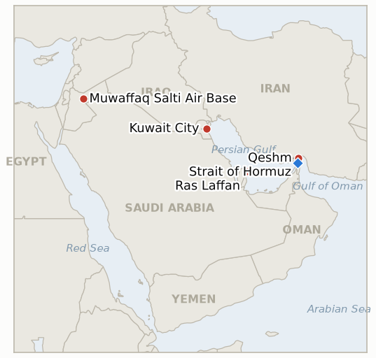

# Middle East Daily Briefing

**July 31, 2026**

- **Reporting window:** ~24 hours, July 30, 09:00 to July 31, 09:00 KST
- **Overall assessment:** The single exchange this brief's ledger flagged yesterday as a live question, whether July 29 was a contained one off or the start of a resumed campaign, resolved within a day. CENTCOM carried out a "heavy wave" of direct strikes on Iranian territory, roughly twice the size of the prior bombardment, hitting dozens of IRGC command centers, missile and drone facilities, coastal surveillance and maritime sites across six provinces; a strike on a residential home on Qeshm Island killed a family of three, including a two year old child, the clearest civilian toll reported inside the war's Iranian homeland since the pause began. Iran answered on three fronts at once: a second missile salvo at Jordan's Muwaffaq Salti base, intercepted without casualties; a strike that killed a worker at a Chinese company's building in northern Kuwait, the first fatality tied to Chinese interests in the war; and an IRGC statement claiming "full control" of the Strait of Hormuz and warning any state assisting Washington of a "harsh response." CENTCOM spent part of the day publicly fact checking Tehran's own claims, denying Iranian reports that three F-35s were destroyed and that Kharg Island was struck. Oil did not follow the escalation: Brent eased about 2% to $88.93 and WTI 1.6% to $83.09 as tankers kept transiting, Kpler counting fourteen Hormuz crossings the day before, and Qatar sent its first Ras Laffan LNG cargo through the strait in nineteen days. Seoul's session, the first this week to open squarely against a live war rather than price it after the fact, fell a third straight day to 5,593.56 on a mix Korean commentary explicitly credited to the reignited conflict alongside chip cycle and Federal Reserve factors, while the won firmed to 1,437.4 on the Fed's rate hold, a divergence this brief's ledger is still tracking into tomorrow's close.

---

## 1. What Happened

<figure style="float:right; width:46%; margin:2pt 0 8pt 14pt;">

<figcaption style="font-size:8pt; color:#666; text-align:center; margin-top:3pt; font-style:italic;">Major places of discussion</figcaption>
</figure>

### 1.1 The United States Strikes Iranian Territory Directly for the First Time Since the Pause Collapsed

US Central Command said it completed a "heavy wave" of strikes against dozens of Islamic Revolutionary Guard Corps targets inside Iran, "including military command centers, missile and drone facilities, coastal surveillance and defense sites, and maritime capabilities," over a roughly two hour operation that a source told the Jerusalem Post was about twice the size of the campaign's previous bombardment ([globalsecurity.org/RFE-RL](https://www.globalsecurity.org/military/library/news/2026/07/mil-260730-rferl01.htm); [Jerusalem Post](https://www.jpost.com/middle-east/iran-news/article-904062)). Explosions and power outages were reported across Qeshm Island, Kish Island, Bushehr, Fars, Khuzestan and Hormozgan provinces, and Trump, briefed on the operation, told reporters "it's a little more of the same... we're going to be hitting them very hard because it's our turn to hit them" ([NBC News](https://www.nbcnews.com/world/iran/us-heavy-wave-strikes-iran-war-attack-trump-saudi-egypt-drone-oil-rcna589967)). This is the war's first acknowledged direct US strike on Iranian soil since the pause collapsed on July 29, a step beyond the Iraq only proxy strikes CENTCOM and Saudi Arabia carried out the previous day, confirming IND-20260730-3 on its first eligible night, well ahead of its August 2 deadline. **Confidence: High** on the strikes occurring, their scale and target categories (CENTCOM statement, multi outlet corroboration); **Medium** on the precise "twice the size" comparison, which traces to a single unnamed source.

### 1.2 A US Strike Kills a Family of Three on Qeshm Island; CENTCOM Disputes Other Iranian Claims

Iranian media reported a US strike hit a residential home in the Chah Tangu neighborhood of Qeshm Island, killing a couple and their two year old child and wounding two more children aged seven and nine, with search and rescue operations continuing for others feared trapped in rubble ([Middle East Eye](https://www.middleeasteye.net/live-blog/live-blog-update/us-strike-family-home-irans-qeshm-kills-three-including-toddler); [Press TV](https://www.presstv.co.uk/Detail/2026/07/30/773359/Iran-US-Qeshm-strike)). The United States had not addressed the casualty reports directly by the window's close, but CENTCOM did post a public "fact check" disputing three other IRGC claims circulating in Iranian state media the same day: that three US F-35s and other aircraft were destroyed, that US personnel were killed, and that US forces struck Kharg Island; CENTCOM stated "no US aircraft were destroyed or damaged" and that Kharg was not hit ([Washington Times](https://www.washingtontimes.com/news/2026/jul/30/centcom-rejects-irgc-claims-destroyed-jets-jordan-strikes/); [X/CENTCOM](https://x.com/CENTCOM/status/2082850478572900753)). No verified strike on Kharg Island or another Iranian crude export terminal occurred in the window, leaving IND-20260727-3 unresolved short of its confirmation branch. **Confidence: Medium** on the Qeshm casualty figures and location, sourced to Iranian outlets and not yet independently verified by CENTCOM or Tier 1 wire services; **High** on CENTCOM's fact check statement itself and its content (direct primary source, multi outlet).

### 1.3 Iran Strikes Jordan Again and Kills a Worker at a Chinese Company's Building in Kuwait

Hours after the US strikes on Iran, Jordan's military said its air defenses intercepted and destroyed five more Iranian missiles fired at Muwaffaq Salti air base, the second such interception in three days with no casualties reported ([ABC7/AP](https://abc7news.com/post/jordan-intercepts-iranian-missiles-us-saudi-arabia-launch-strikes-militias-iraq/19595522/)). Separately, Kuwait's Defence Ministry said an "Iranian aggression" struck a building belonging to a Chinese company in the country's north, killing one worker and causing severe structural damage; the ministry did not name the company or the victim, and there was no immediate comment from Beijing in the window ([Al Arabiya](https://english.alarabiya.net/News/gulf/2026/07/30/iranian-attack-hits-chinese-company-building-in-kuwait-killing-one-worker); [Times of Israel](https://www.timesofisrael.com/liveblog_entry/kuwait-says-iranian-strike-hit-chinese-company-building-killing-1/)). This is the first reported fatality tied to Chinese commercial interests anywhere in the war and the first Kuwaiti civilian death of the reignited campaign. **Confidence: High** on the second Jordan interception and on the Kuwait strike and fatality (Jordanian and Kuwaiti government statements, multi outlet); **Low** on whether the Chinese building was deliberately targeted or an incidental hit in a wider barrage, which no source addressed directly (§2.2).

### 1.4 IRGC Claims Full Control of the Strait of Hormuz and Threatens US Allies

The IRGC said in a statement that "the Strait of Hormuz is our land, and the IRGC's navy sailors have full control over it, and a stranger who has come from thousands of kilometres away will not be allowed to interfere," and separately warned that any country materially assisting the United States "will receive a harsh response" ([aninews](https://aninews.in/news/world/middle-east/strait-of-hormuz-is-our-land-irgc-warns-countries-aiding-us-of-harsh-response20260730134944/); [iranwire](https://iranwire.com/en/news/155645-centcom-rejects-irgc-control-over-strait-of-hormuz/)). Iranian media separately claimed two oil tankers "turned back" after a fire broke out in the strait, a claim not corroborated by CENTCOM, Kpler or any independent tracker in the window. CENTCOM countered publicly that the strait remains an international waterway open to global passage, a claim the day's actual traffic, fourteen Hormuz crossings on July 29 and Qatar's first Ras Laffan LNG transit in nineteen days (§1.5), tends to support more than Iran's rhetoric does. **Confidence: High** on the IRGC statement and its wording (direct quotation, multi outlet); **Low** on the tanker "turned back" claim, which rests solely on Iranian state linked media.

### 1.5 Oil Eases Despite the Escalation as Qatar Breaks a Nineteen Day LNG Freeze

Brent crude fell about 2% to $88.93 a barrel and WTI 1.6% to $83.09, giving back part of Wednesday's 7.9% surge even as the war widened to direct strikes on Iranian soil, Kuwait and a second Jordan attack, because tankers kept moving: Kpler counted fourteen commodity vessel crossings of Hormuz on July 29, up from twelve the day before, and Energy Secretary Chris Wright said roughly 6.5 million barrels a day exited the Gulf via the strait over the preceding week ([CNBC](https://www.cnbc.com/2026/07/30/oil-prices-us-iran-war.html); [Rigzone](https://www.rigzone.com/news/wire/hormuz_traffic_shows_defiance-30-jul-2026-184249-article/)). The clearest sign of that resilience was the LNG carrier Al Areesh, which loaded at Qatar's Ras Laffan terminal in early July and transited the strait into the Gulf of Oman on July 30 bound for Pakistan, the first laden Hormuz departure from Ras Laffan since July 11 and the end of a freeze this brief's ledger has tracked for nineteen days; neither QatarEnergy nor the vessel's owner Seapeak commented on why the shipment proceeded now, and more than a dozen tankers remain idle near the terminal ([The National](https://www.thenationalnews.com/business/energy/2026/07/30/qatar-sends-first-lng-shipment-through-strait-of-hormuz-since-tanker-attack/)). **Confidence: High** on the settle levels and percentage changes (CNBC) and on the Hormuz transit count (Kpler, official account); **Medium** on whether the Al Areesh transit signals a genuine reopening of Qatari LNG exports or a single vessel that judged the risk acceptable, since QatarEnergy has not confirmed a policy change.

---

## 2. Deep Dive: Incentives and Motives

### 2.1 Why did Washington escalate from Iraq only proxy strikes to direct strikes on Iranian soil in a single day?

Because the Iraq strikes on July 29 answered the Abqaiq raid, a Saudi grievance, while Tuesday night's missile launch toward Jordan and the Hormuz tanker strikes were attacks on US aligned positions directly, and Trump had spent the intervening day promising publicly that Iran would "get a beating." Striking Iraqi militias let Washington and Riyadh signal resolve at low domestic political cost; striking Iran itself is the higher cost, higher signal option that Trump's own rhetoric had committed him to deliver, and doing it within 24 hours denies Tehran the read that the Jordan and Hormuz attacks would draw only a proxy scale response. The doubled scale relative to the prior bombardment, per an unnamed source, reads as an attempt to reassert the asymmetry Israeli Defence Minister Katz complained the US was surrendering by restraining strikes on Iranian energy infrastructure (brief 2026-07-30, §2.1): hit harder on the military target set precisely to keep the argument for hitting energy infrastructure in reserve rather than exhausted.

### 2.2 Why would Iran strike a Chinese company's building in Kuwait, one of its few remaining sympathetic economic partners?

The available reporting does not establish intent, and that ambiguity is itself informative. If deliberate, it would be a sharp break from Iran's consistent effort throughout this war to keep Beijing, its largest oil customer and a veto holder sympathetic to Tehran's position at the UN, outside the target set; a state fighting a war on multiple fronts against the United States, Saudi Arabia, Jordan and Kuwait simultaneously has strong incentives not to add China's anger to that list. The more likely reading, absent evidence otherwise, is that the Kuwait strike was aimed at a US linked military or logistics target and the Chinese company's building was an incidental casualty of an unguided or imprecisely targeted barrage, consistent with the pattern of civilian harm from IRGC missile and drone strikes elsewhere this month, Qeshm included (§1.2). Iran's silence on the incident, rather than the claiming pattern it has used for Hormuz and battlefield claims, is consistent with an attack Tehran did not intend to have to explain to Beijing (IND-20260731-3).

### 2.3 Why is Iran escalating its rhetorical claim to Hormuz on the exact day traffic and Qatari LNG exports both rose?

Because the rhetoric and the reality are answering different audiences. The "full control" statement and the harsh response warning are aimed at deterring further coalition building against Iran, specifically at Gulf states like Kuwait now absorbing kinetic costs for hosting or assisting US operations, at a moment when Iran has just demonstrated it will strike a Gulf neighbor over perceived complicity. The actual Hormuz traffic figures, fourteen crossings and Qatar's first laden LNG exit in nineteen days, are shaped by a different set of incentives: US naval escorts, shippers' own risk tolerance recovering after three weeks of near total freeze, and Iran's own selective enforcement, which this brief's ledger has tracked since July as a licensing regime rather than a blockade (IND-20260720-2, confirmed July 22). Iran benefits from both readings simultaneously: the rhetoric preserves deterrent credibility without Tehran having to enforce a closure it likely cannot sustain against a strait patrolled by the US Navy, while the trickle of traffic it does not stop keeps regional and Chinese anger contained.

### 2.4 Why did Korea's equity market finally price the war today, while its currency still did not?

Because equities and the won are exposed to the war through different, only partially overlapping channels. KOSPI's Thursday session, the first this week that opened after the pause had already collapsed rather than before it, absorbed the war as one of several simultaneous shocks, alongside Samsung's earnings triggering profit taking on peak cycle fears and a hawkish Federal Reserve hold that pushed 30 year Treasury yields to their highest since 2007; Korean commentary named all three, with the war becoming an explicit contributing line item in equity coverage for the first time since the pause collapsed. The won's channel runs almost entirely through the oil price and through the dollar's own strength, and both of those pointed the same direction today: Brent eased rather than extended its surge, and the Fed's hold weakened the dollar broadly, so the currency continued firming exactly as it has on every day this month that oil eased, regardless of the war's military intensity. The two legs are not testing the same claim, and IND-20260730-2's own design, which allows either the equity or the currency channel to confirm, is closer to satisfied on the equity side today than at any point since the pause collapsed, though not conclusively; the July 31 KST close, still ahead of this brief's window, is the indicator's actual deadline.

---

## 3. Policy Implications for South Korea

### 3.1 Exposure snapshot

| Item | Current reading | Source |
| --- | --- | --- |
| July-August crude procurement | 110%+ of prior-year volume secured (MOTIE, July 21) | MOTIE via Herald Business, Youth Daily; `korea-exposure.md` |
| September crude procurement | 90%+ secured (MOTIE, July 21) | MOTIE via Herald Business; `korea-exposure.md` |
| Strategic reserve coverage | ~26 days of actual consumption (estimate); swap on immediate standby, untested at scale | CSIS; MOTIE July 27 |
| Korean nationals/vessels in Gulf | ~43 (13 aboard Korean vessels, 30 aboard foreign vessels) as of late June; MOFA reviewed safety with 17 missions | MOFA; Korea Herald |
| Brent | $88.93 settle, -2% (eases despite direct US strikes on Iran) | CNBC |
| WTI | $83.09 settle, -1.6% | CNBC |
| KOSPI | 5,593.56, -1.23% (-69.68pts); third straight decline, war named as a contributing factor alongside chips and the Fed | Seoul Economic Daily; Bloomingbit |
| USD/KRW | ₩1,437.4, -9.3 won (won firmer on the Fed's rate hold) | 이투데이 (Etoday) |
| Hormuz transits | 14 confirmed crossings, July 29 (Kpler), up from 12 on July 28 | Kpler; Rigzone |
| Qatari LNG (Ras Laffan) | First laden Hormuz departure since July 11; 19 day freeze broken by a single vessel (Al Areesh, to Pakistan) | The National; Bloomberg |

### 3.2 Implications by development

**Direct US strikes on Iranian soil raise, rather than resolve, Korea's planning uncertainty about how long this reignition runs.** The Iraq proxy strikes on July 29 could plausibly have stayed contained; a direct campaign against IRGC infrastructure inside Iran is a materially different commitment that historically has not de-escalated quickly in this war. MOTIE and KNOC should treat the July-August and September procurement cushions as buying time rather than solving the problem, and should use that time to pressure test the strategic reserve swap's actual notice period before a crisis forces it, since the instrument remains, per `korea-exposure.md`, untested at scale.

**The Kuwait strike on a Chinese company's building is a data point Korean risk planners should read carefully, not dismiss as unrelated.** If Iran is now imposing costs, deliberately or not, on the commercial interests of even sympathetic third parties operating in Gulf host states, Korean firms and personnel in Kuwait, Saudi Arabia and the UAE, including the Barakah nuclear project's Korean staff, sit inside the same exposure category regardless of Seoul's neutral posture in the war.

**Qatar's Ras Laffan breakthrough is the first concrete evidence in three weeks that Korea's LNG supply line through Hormuz can reopen even without a ceasefire, but one vessel is not a restored corridor.** KOGAS should treat the Al Areesh transit as a signal to re-test Atlantic to Pacific swap costs against a genuinely improving, rather than merely less-bad, Gulf supply picture, while continuing to plan around the freeze persisting for most cargoes until QatarEnergy confirms a policy change rather than a single risk-tolerant shipment.

**Thursday's KOSPI session is Korea's clearest evidence yet that the war has entered the equity risk premium, and the Bank of Korea's August meeting inputs should be updated accordingly.** IND-20260717-3 asked whether the BOK's reaction function would treat Middle East risk as an oil-price question or a broader risk-sentiment one; today's session, where commentary named the war alongside chip cycle and Fed factors as a driver of the KOSPI's move for the first time since the pause collapsed, is evidence for the broader reading, even as the won's continued firming shows the currency channel has not yet followed.

**Testable indicators:**

- **IND-20260731-1** — The heavy wave of direct strikes on Iran opens a sustained campaign or stays a single retaliatory night. A further verified US strike on Iranian territory (not Iraq or proxy targets) within the three nights following July 30, by ~2026-08-02, confirms the campaign has moved from proxy exchanges back to a sustained direct air campaign against Iran itself; no further direct strike on Iranian soil through ~2026-08-02, with retaliation if any confined to Iraq, Jordan or Gulf states, falsifies, meaning July 30 was a single calibrated response rather than a reopened front.
- **IND-20260731-2** — Qatar's Ras Laffan LNG freeze is genuinely breaking or the Al Areesh was a one-off. Two or more additional laden LNG carrier departures from Ras Laffan through the strait by ~2026-08-06 confirms a real resumption Korea's KOGAS can plan around; no further laden departures through ~2026-08-06, with the idle tanker queue at Ras Laffan unchanged, falsifies, meaning the freeze persists in substance despite the single transit.
- **IND-20260731-3** — The Qeshm and Kuwait civilian casualties draw a proportionality response or are absorbed without consequence. Any formal protest, condemnation or policy shift from a Gulf government, China, or a UN body specifically citing the Qeshm or Kuwait civilian deaths by ~2026-08-06 confirms the casualties are generating diplomatic cost that could constrain the campaign's pace or targeting; no such formal response through ~2026-08-06 falsifies, meaning civilian harm in this war continues to be absorbed without altering the campaign's course.

**Resolutions this run:**

- **IND-20260730-3 — Confirmed.** Opened to test whether the pause's collapse produced a sustained multi-night campaign or a single sharp exchange. CENTCOM's heavy wave of direct strikes on Iranian territory, the war's first since the pause broke, met this indicator's condition on the first eligible night, well ahead of its August 2 deadline. The reignition is not confined to Iraq-based proxy exchanges.

---

## 4. Watch List

- **Whether the direct strikes on Iran continue beyond a single night** or the campaign reverts to proxy and Gulf-state exchanges (IND-20260731-1).
- **Whether Qatar's Ras Laffan LNG freeze is genuinely breaking**, now that a single laden cargo has transited after nineteen days (IND-20260731-2).
- **Whether the Qeshm and Kuwait civilian casualties draw any formal diplomatic response**, particularly from China, whose commercial interests were hit for the first time in this war (IND-20260731-3).
- **Korea's markets on the July 31 KST close**, the actual deadline for IND-20260730-2 and IND-20260725-2's chip-cycle-versus-war decomposition.
- **Kharg Island**, still untouched and now the subject of a direct CENTCOM denial after Iranian claims it was struck; Trump's "energy targets for last" threat keeps IND-20260727-3 live.
- **Whether any vessel tests Iran's frozen-asset transit ban** (IND-20260729-2), still untested leverage.
- **Aramco and the Saudi government's continued silence on Abqaiq's operational status**, now five days after the raid with no primary-source statement (IND-20260729-1).
- **Friction inside the Lebanon pilot-zone framework**: families returned to Froun even as the Lebanese army accused Israel of continued shelling obstructing a full handover (IND-20260723-2).

---

## 5. Source Quality Summary

| Claim | Sources | Confidence |
| --- | --- | --- |
| US carries out a "heavy wave" of direct strikes on dozens of IRGC targets inside Iran | CENTCOM statement via globalsecurity.org/RFE-RL, Jerusalem Post, NBC News (Tier 1-2, multi outlet) | High |
| US strike kills a family of three on Qeshm Island; two more children wounded | Middle East Eye, Press TV (Iranian state-linked and Tier 2 outlets; not independently confirmed by CENTCOM) | Medium |
| CENTCOM fact check denies F-35 losses, US casualties and a Kharg Island strike | Washington Times, CENTCOM official account (Tier 1-2, primary source) | High |
| Jordan intercepts a second wave of five Iranian missiles at Muwaffaq Salti | ABC7/AP (Tier 1, Jordanian military statement) | High |
| Iran strikes a Chinese company's building in Kuwait, killing one worker | Al Arabiya, Times of Israel, Kuwait Defence Ministry statement (Tier 1-2, multi outlet) | High |
| IRGC claims "full control" of the Strait of Hormuz, warns US allies | aninews, iranwire (Tier 2, direct quotation, multi outlet) | High on the statement; Low on enforceability |
| Brent settle 88.93 (-2%), WTI settle 83.09 (-1.6%) | CNBC | High |
| Hormuz transits: 14 confirmed crossings, July 29 (Kpler) | Kpler official account via Rigzone | Medium |
| Qatar's Al Areesh LNG carrier transits Hormuz, first laden Ras Laffan departure since July 11 | The National, Bloomberg (Tier 1-2, ship-tracking data) | High on the transit; Medium on whether it signals a policy change |
| KOSPI -1.23% to 5,593.56, war named as a contributing factor alongside chips and the Fed | Seoul Economic Daily, Bloomingbit (Tier 1-2 Korean, multi outlet) | High |
| Won firms to ₩1,437.4 on the Fed's rate hold | 이투데이 (Etoday) (Tier 1-2 Korean) | High |
