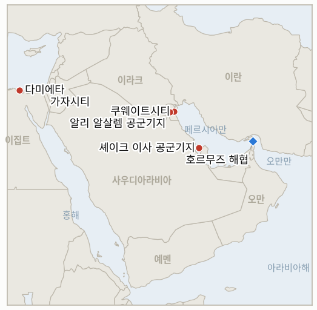

# 중동 일일 브리핑

**2026년 8월 1일**

- **보고 기간:** 약 24시간, 7월 31일 09:00 ~ 8월 1일 09:00 (한국시간)
- **종합 평가:** 이란은 이번 창에서 수요일 케슘섬 사망에 대한 보복을 미국에 직접 응수하는 대신 세 갈래로 동시에 확대했다. 쿠웨이트·바레인 내 미군 연계 기지에 대한 드론 공격 주장, 그리고 이번 전쟁 최초로 미군이 실제 호위하던 유조선 2척에 대한 공격이 그것이다. 이 가운데 어느 것도 중부사령부의 독립적 확인을 받지 못했으며, 중부사령부는 "상선들이 계속 통항하고 있다"는 절차적 반박만 내놓았고, 어느 것도 트럼프가 일주일 전 내놓은, 해협에서 유조선이 공격받을 때마다 이란의 다리나 발전소를 폭격하겠다는 경고를 실제로 촉발하지 않았다. 그 결과 유가는 차분하게 반응해 브렌트유는 1.3% 오른 90.12달러, WTI는 1.9% 오른 84.67달러로 마감했다. 전쟁 자체보다 더 크게 움직인 흐름은 따로 두 가지였다. 중국 외교부는 오랜 침묵을 깨고 쿠웨이트 공격을 "용납할 수 없다"고 규탄했고, 이집트 정부는 시시 대통령이 "지역 확전의 위험"을 경고하는 와중에도 화요일 다미에타 항구에서 발생한 미국 소유 LNG 선박에 대한 드론 공격의 책임을 이란에 돌리려는 시도를 하루 종일 공개적으로 거부했다. 별도로, 레바논 파일럿존 개시 이후 가자지구 관련 가장 중요한 소식으로, 하마스는 워싱턴이 7~8개월이 걸릴 것으로 추산하는 이스라엘 철군과 맞물린 단계적 무장해제를 골자로 한 평화이사회 틀에 합의했다고 밝혔으나, 이스라엘은 아직 조건을 확인하지 않았다. 한국 시장은 이 브리핑이 지금까지 본 것 중 가장 선명한 탈동조화 시험대를 제공했다. 코스피는 사상 최대 일일 상승폭인 17.91% 급등해 6,595.45로 마감했는데, 이는 순전히 반도체·AI발 호재에 따른 것으로 같은 날 확전된 전쟁과는 무관했으며, 이로써 이 브리핑 자체의 지표 두 개가 전쟁 경로가 아닌 반도체 업황 경로 쪽으로 해소됐다.

---

## 1. 무슨 일이 있었나

<figure style="float:right; width:46%; margin:2pt 0 8pt 14pt;">

<figcaption style="font-size:8pt; color:#666; text-align:center; margin-top:3pt; font-style:italic;">주요 논의 지점</figcaption>
</figure>

### 1.1 이란, 케슘 사망에 대한 보복으로 쿠웨이트·바레인 내 미군 연계 기지 타격

이란군은 금요일 쿠웨이트의 아흐마드 알자베르·알리 알살렘 공군기지를 자폭 드론으로 타격해 전투기 격납고, 위성통신 시설, 미군이 사용하는 장비 창고를 겨냥했다고 밝혔으며, 별도로 바레인 셰이크 이사 공군기지를 타격해 발전기, 항법 시설, 지원 건물을 겨냥했다고 밝혔다 ([Mehr News](https://en.mehrnews.com/news/246653/Iran-Army-targets-US-Ahmad-al-Jaber-airbase-in-Kuwait); [Al Jazeera](https://www.aljazeera.com/news/2026/7/31/irgc-strikes-us-targets-in-kuwait-a-day-after-us-hits-iran-latest-events)). 테헤란은 이번 공격을 수요일 미군 공습으로 케슘섬에서 일가족 3명이 사망한 데 대한 명백한 보복이라 규정했으며, 이는 미국의 이란 본토 직접 타격이라는 확전에 미국 영토에 대한 동등한 타격으로 응수하는 대신 걸프 주둔국들을 통해 보복을 우회시켜온 이번 전쟁의 패턴을 이어간 것이다. 중부사령부도 쿠웨이트·바레인 정부도 이 창이 닫힐 때까지 주장된 공격이나 그로 인한 피해를 확인하지 않았다. 별도로 트럼프 대통령은 취재진에게 이란이 협상이 진행 중인 와중에도 요르단 주둔 미군에 미사일을 발사했다는 점을 들어 이란에 대해 "신뢰를 잃어가고 있다"고 말했으나 합의 가능성을 완전히 배제하지는 않았으며, 향후 4주간 미국이 계속 "강하게 타격할 것"이라고 밝혔다 ([Good Morning America/ABC News](https://www.goodmorningamerica.com/International/live-updates/iran-live-updates-tehran-progress-made-strait-hormuz-135110405/houthis-claim-to-have-struck-another-saudi-oil-tanker-135162786)). 이 창에서 이란 본토에 대한 추가 미군 타격은 보고되지 않아, IND-20260731-1은 8월 2일 마감을 이틀 앞두고 여전히 미해결로 남았다. **신뢰도: 중간** — 쿠웨이트·바레인 공격이 주장대로 발생했는지 (이란 군 성명, 복수 매체 경유이나 중부사령부나 주둔국 정부의 독립 확인 없음); **높음** — 트럼프의 발언과 이 창 안에서 이란 본토에 대한 새로운 미군 타격이 없었다는 사실.

### 1.2 혁명수비대, 미군 호위 중인 유조선 2척을 호르무즈에서 처음으로 공격

혁명수비대는 금요일 이른 시간 유조선 2척이 중부사령부의 "묵인 아래" 미군의 실제 공중 호위를 받으며 이란이 승인하지 않은 것으로 간주하는 남쪽 항로를 통해 호르무즈 해협을 통과하려다 공격받아 정지됐다고 밝혔으며, 다른 유조선 4척은 출발항으로 회항했다고 전했다 ([Washington Times](https://www.washingtontimes.com/news/2026/jul/31/irgc-says-struck-two-tankers-strait-hormuz-escorted-us-military/); [Tasnim](https://www.tasnimnews.ir/en/news/2026/07/31/3660664/two-violating-oil-tankers-disabled-in-strait-of-hormuz-irgc); [Times of Israel](https://www.timesofisrael.com/liveblog_entry/iran-claims-to-strike-two-tankers-under-us-air-escort-trying-to-pass-hormuz/)). 이는 이 브리핑이 기록한 것 중 독자적으로 통항하는 선박이 아니라 명시적이고 실제 가동 중인 미군 호위 아래 있던 유조선에 대한 첫 공격이며, 트럼프가 7월 22일 내놓은 상시 경고, 즉 이란이 해협에서 선박을 공격할 때마다 이란 내 "다리나 발전소 하나를 폭격해 파괴하겠다"는 위협을 직접 시험대에 올린다 ([CNBC](https://www.cnbc.com/2026/07/22/us-iran-war-trump-hormuz-.html)). 중부사령부가 이 창에서 내놓은 유일한 공개 반응은 공격 자체를 확인하거나 부인하는 것이 아니라 절차적인 것으로, "오늘 밤에도 상선들이 호르무즈 해협을 계속 드나들고 있다"고만 게시했는데, 이는 해협이 폐쇄됐다는 이란의 별도 주장을 반박할 뿐 유조선 공격 자체는 다루지 않는다. 유가는 급등이 아니라 소폭 상승했다. 브렌트유는 1.3% 오른 90.12달러, WTI는 1.9% 오른 84.67달러로 마감해, 이틀 전 휴전 붕괴 직후 있었던 7.9% 급등보다 훨씬 작은 움직임이었다 ([CNBC](https://www.cnbc.com/2026/07/31/oil-prices-today-brent-wti-hormuz-trump-iran-.html)). **신뢰도: 중간** — 유조선 공격과 4척 회항이 주장대로 발생했는지 (이란 국영·준공식 매체 경유이며 Kpler, 중부사령부, 선주사의 교차 확인 없음); **높음** — 정산가와 중부사령부 성명.

### 1.3 중국 외교부, 쿠웨이트 공격을 용납할 수 없다고 규탄하며 희생자는 중국인이 아닌 네팔인이라 확인

중국 외교부 대변인 마오닝은 금요일 중국은 "무고한 민간인과 비군사 표적에 대한 공격"을 "용납할 수 없다"고 밝히고 쿠웨이트 당국에 중국 국민과 기관 보호를 촉구했는데, 이는 목요일 발생한 쿠웨이트 내 중국 기업 건물에 대한 이란의 공격에 대해 중국 정부가 내놓은 첫 공식 성명이다 ([Anadolu Agency](https://www.aa.com.tr/en/asia-pacific/china-says-attacks-on-non-military-targets-unacceptable-after-iranian-strike-hits-chinese-company-building-in-kuwait/4015099)). 주쿠웨이트 중국대사관은 별도로 사망한 노동자가 중국 국민이 아니라 하청업체에 고용된 네팔인 운전기사였으며 중국 국민 피해는 없었다고 확인했다 ([Arab Times](https://www.arabtimesonline.com/news/chinese-embassy-worker-killed-in-iranian-attack-on-company-building-in-kuwait-was-nepalese/)). 이는 쿠웨이트 사망을 구체적으로 언급한 공식 항의라는 IND-20260731-3의 확정 기준을 충족하지만, 가해자를 특정하지 않고 쿠웨이트 측의 보호 의무에 국한한 성명의 절제된 표현과, 중국 국민이 사망하지 않았다는 정정 모두 그 실질적 파급력을 제한한다. **신뢰도: 높음** — 마오닝의 성명과 네팔인 희생자 확인 (중국·쿠웨이트 정부 공식 출처, 복수 매체 경유).

### 1.4 이집트, 다미에타 드론 공격 책임 전가에 반발하며 시시 대통령은 지역 확전 경고

압델 파타 엘시시 이집트 대통령은 화요일 미국 소유 부유식 LNG 저장 선박과 다른 한 척이 다미에타 항구에서 화재를 겪은 사건, 즉 이번 전쟁에서 이집트 영토에 대한 첫 공격의 드론 잔해를 조사관들이 계속 분석하는 가운데 "지역 확전의 위험"을 경고했다 ([The Defense Post](https://thedefensepost.com/2026/07/31/egypt-investigates-drone-strike-damietta-port/)). 이집트 정보담당 국무장관은 카이로가 내부적으로 이란의 소행이라 믿고 있다는 월스트리트저널 보도를 공개적으로 반박했는데, 이는 이집트 당국이 책임 소재를 확정하기보다 계속 부인하는 패턴의 일환이다 ([cryptobriefing/Al Arabiya](https://cryptobriefing.com/egypt-denies-irans-involvement-in-damietta-drone-attack-al-arabiya/)). 이란의 아라그치 외무장관은 이집트를 "중요한 우방"이라 부르며 대신 이스라엘의 "위장 공작"을 지목했고, 후티 반군도 별도로 관련성을 부인해, 어느 당사자도 이번 공격을 자인하지 않고 있다(§2.2, IND-20260801-3). **신뢰도: 높음** — 공격 발생, 드론 판정, 시시 대통령의 발언 (이집트 정부 출처, 복수 매체); **낮음** — 책임 소재는 거명된 모든 당사자 사이에서 진짜로 다투어지고 있음.

### 1.5 하마스, 단계적 무장해제와 이스라엘 철군을 맞바꾸는 평화이사회 틀에 합의

트럼프 대통령은 하마스가 국제검증위원회의 검증을 받으며 단계적으로 무장을 해제하고, 이에 맞춰 워싱턴이 7~8개월이 걸릴 것으로 추산하는 이스라엘군 철군과 새 팔레스타인 행정부·국제안정화군으로의 인수인계가 뒤따르는 평화이사회 프레임워크에 하마스가 합의했다고 발표했다 ([Al Jazeera](https://www.aljazeera.com/news/2026/7/31/gaza-board-of-peace-announces-hamas-disarmament-agreement-what-we-know); [Euronews](https://www.euronews.com/2026/07/31/trump-announces-historic-deal-for-the-complete-disarmament-of-hamas-and-israeli-withdrawal)). 이 발표에는 중대한 유보 조건이 따른다. 이스라엘은 구체적 조건을 공개적으로 승인하지 않았으며, 하마스는 이스라엘군이 먼저 자신의 상호 철군 의무를 이행하지 않는 한 어떤 무장해제 단계도 이행하지 않겠다고 밝혔는데, 이는 앞선 평화이사회 이정표들을 지연시켜온 것과 같은 순서 다툼이다 ([CNN](https://www.cnn.com/2026/07/31/middleeast/trump-hamas-disarmament-announcement-intl); [The Defense Post](https://thedefensepost.com/2026/07/31/hamas-israel-ceasefire-weapons-withdrawal-gaza/)). 만약 이대로 이행된다면 레바논 파일럿존 인수인계 개시 이후 가자지구 트랙에서 가장 중대한 진전이겠지만, 이번 주 이란 전쟁의 확전이 가자·레바논 두 트랙 모두의 관심을 눈에 띄게 밀어냈다(§2.5, IND-20260801-2, IND-20260723-2). **신뢰도: 중간** — 발표와 그 명시된 조건 (트럼프와 평화이사회 성명, 복수 매체 경유); **낮음** — 이행 여부는 아직 나오지 않은 이스라엘의 확인에 달려 있음.

---

## 2. 심층 분석: 유인과 동기

### 2.1 이란은 왜 워싱턴의 본토 직접 타격 확전에 맞대응하는 대신 쿠웨이트·바레인을 통해 보복을 우회시키나?

이란은 미국 본토를 타격할 현실적 수단이 없고, 5개월간의 전쟁 이후 이스라엘에 대해서도 거리와 재고 소진으로 제약된 옵션만 남아 있어, 미군이 주둔한 걸프 국가들이 테헤란이 대칭적 응수를 감당할 수 없는 상황에서도 워싱턴의 전쟁 수행에 비용을 부과할 수 있는 유일하게 닿는 표적이기 때문이다. 쿠웨이트와 바레인을 타격하는 것은 또한 7월 30일 대규모 파상 공습의 기지·영공 제공국으로 가장 공개적으로 지목된 두 국가를 응징하는 것이어서, 테헤란이 이를 단순 보복이 아니라 응징 서사로 국내에 내세우기 쉽게 한다. 이는 오늘 알자지라가 언급한 "수평적 확전" 패턴, 즉 이란이 강도를 맞대응할 수 없기에 지리를 확대하는 것과 일치한다.

### 2.2 이란은 왜 이집트 영토를 타격할 위험을 감수했으며, 카이로는 왜 테헤란 책임론을 거부하고 있나?

증거의 무게는 이란이 국가로서 이집트를 의도적으로 타격했을 가능성에서 멀어진다. 이란은 이번 전쟁의 거의 모든 다른 공격과 마찬가지로 쿠웨이트·바레인 공격은 몇 시간 안에 자인했지만 다미에타에 대해서는 아무 말도 하지 않았고, 외무장관은 오히려 이스라엘의 위장 공작 서사를 적극적으로 내세우며 자인을 회피하고 있다. 이집트는 쿠웨이트·바레인·요르단이 이미 속한 반이란 연합의 현행 작전 밖에 머물러 왔기에, 테헤란이 그곳을 겨냥할 뚜렷한 명분이 없었다. 카이로가 월스트리트저널의 이란 책임론을 공개적으로 거부한 것 자체가 시사하는 바가 있다. 미국이 주도하는 해상 연합 참여를 향해 나아가는 정부라면 워싱턴이 지목하려는 책임을 받아들일 유인이 충분할 텐데도 이를 거부한다는 것은, 이집트가 지금까지 발을 들이지 않은 전쟁에서 어느 한쪽을 선택하도록 강요당할 수도 있는 확정적 답보다는 미해결 상태가 더 안전하다고 판단하고 있음을 시사한다.

### 2.3 베이징은 왜 마침내 오랜 침묵을 깨고 쿠웨이트 공격을 공식 규탄했나?

네팔인 하청 노동자의 사망 덕분에 중국은 진짜 중국 국민 사망이 초래했을 국내 정치적 부담 없이 사실상 무비용으로 이의를 제기할 수 있었기 때문이다. 이렇게 함으로써 베이징은 이제 군사적 위험을 떠안게 된 걸프 국가들 전반에 걸친 상업적 발판을 보호하는 동시에, 중국 관련 자산에 대한 추가 피해가 그냥 넘어가지 않을 것이라는 신호를 남긴다. 성명의 절제된 표현, 즉 이란을 지목하지 않은 채 "용납할 수 없다"고만 밝힌 것은 중국이 이란의 최대 원유 고객이라는 위치와 이번 전쟁에서 스스로 내세우는 중립적 중재자 역할을 그대로 유지시켜 준다.

### 2.4 한국 코스피는 왜 이란이 걸프 국가 두 곳을 추가로 타격한 바로 그날 사상 최대 일일 상승폭을 기록했나?

금요일 세션이야말로 이 브리핑 자체의 지표(IND-20260725-2, IND-20260730-2)가 설계상 판별하려 했던 결정적 시험이었고, 결과는 반도체 업황 쪽으로 명확히 해소됐기 때문이다. 이번 급등은 전적으로 글로벌 반도체·AI 심리에서 비롯됐다. 마이크로소프트의 실적 호조가 AI 설비투자에 대한 신뢰를 재점화하며 필라델피아 반도체지수를 8% 끌어올렸고, 삼성전자와 SK하이닉스 자체 실적이 이를 27~30%에 이르는 레버리지 일일 상승으로 증폭시켰는데, 이는 동시에 확전 중이던 전쟁과는 아무 관련이 없는 촉매다. 원화가 장중 9개월 만의 최고 강세를 찍은 뒤 1,424.0원으로 마감하며 계속 강세를 보인 것도 다른 경로에서 같은 이야기를 들려준다. 약 7조 원 규모의 외국인 순매수는 전쟁발 한국 자산 이탈이 아니었으며, 여기에 원화·엔화의 과도한 절상 속도를 억제하려는 것으로 보이는, 전쟁발 자본 이탈 방어가 아닌 한일(어쩌면 미국까지 연계된) 공조 달러 매도 개입 정황이 더해졌다(§3.2). 반도체 베타를 탄 주식과 유입발 통화 강세라는 두 경로 모두, 전쟁이 가장 직접적으로 확대되고 한국 시장 개장이 겹친 이번 달의 그 하루에도 전쟁 경로에서 멀어지는 쪽을 가리켰다.

### 2.5 하마스는 왜 무관한 다른 지역 전쟁이 확전되는 와중에 지금 무장해제 프레임워크에 합의했나?

가자지구와 이란 전쟁 두 트랙은 중재자만 공유할 뿐 서로 다른 시계로 돌아가기 때문이다. 트럼프의 평화이사회 기구는 이란 전쟁의 속도와 무관하게 가자지구 사안을 계속 다뤄왔고, 거의 2년간의 전쟁 이후 군사·외교적으로 고립된 하마스의 협상력은 이집트·카타르·튀르키예가 모두 지지하는 프레임워크에 대한 답을 미룰수록 더 약해진다. 상호 이스라엘 철군이 아직 확인되지 않은 상태에서 원칙적 합의를 발표하는 것은 하마스에 별다른 비용을 지우지 않으므로, 금요일의 발표는 실제 이행 약속인 만큼이나 예루살렘을 겨냥한 압박 전술로도 기능한다. 즉 이스라엘로 하여금 워싱턴이 이미 공개적으로 성과라 주장한 합의를 거부하는 모습으로 비치거나, 아니면 무장해제 수사에 맞춰 움직이도록 강요하는 것이다.

---

## 3. 한국에 대한 정책적 함의

### 3.1 노출도 스냅샷

| 항목 | 현재 수치 | 출처 |
| --- | --- | --- |
| 7~8월 원유 도입 | 전년 동월 대비 110%+ 확보 (산업통상자원부, 7월 21일) | 산업통상자원부, 헤럴드경제·영남일보 경유; `korea-exposure.md` |
| 9월 원유 도입 | 90%+ 확보 (산업통상자원부, 7월 21일) | 산업통상자원부, 헤럴드경제 경유; `korea-exposure.md` |
| 비축유 보유 여력 | 실제 소비 기준 약 26일 (추정치); 비축유 스와프는 즉각 시행 대기 상태이나 대규모 실행은 미검증 | CSIS; 산업통상자원부 7월 27일 |
| 걸프 지역 한국 국민·선박 | 약 43명 (한국 선박 13명, 외국 선박 30명), 6월 말 기준; 외교부, 17개 공관과 안전 점검 | 외교부; 코리아헤럴드 |
| 브렌트유 | 90.12달러 마감, +1.3% (호르무즈 유조선 공격에도 완만한 상승) | CNBC |
| WTI | 84.67달러 마감, +1.9% | CNBC |
| 코스피 | 6,595.45, +17.91% (+1,001.89p); 사상 최대 일일 상승폭·상승률, 반도체·AI 발 급등 | KED Global; 서울경제 |
| 원/달러 | 1,424.0원, -13.4원 (약 7조 원 외국인 주식 순매수와 한일 공조 개입 정황으로 장중 9개월 만의 최고 강세인 1,418.0원까지 강세) | 머니투데이; 디지털타임스 |
| 호르무즈 통항 | 7월 29일 14척 확인 (Kpler); 이번 창에서 추가 일일 수치 없음 | Kpler; Rigzone |
| 카타르 LNG (라스라판) | 알아리시호(7월 30일) 이후 추가 화물 적재 출항 없음; 동결 상태 그 외 미해결 | The National; Bloomberg |

### 3.2 사안별 함의

**트럼프의 미검증 '다리 또는 발전소' 위협이 이제 실제 방아쇠 앞에 놓였으며, 한국 에너지 당국은 앞으로 48~72시간을 이 작전의 표적군이 이란 민간 기반시설로 확대될지 결정하는 창으로 취급해야 한다.** 만약 워싱턴이 오늘의 유조선 공격에 대해 실제로 대응한다면, 산업통상자원부와 한국석유공사는 `korea-exposure.md`가 최악 시나리오 수입 비용 모델링에 사용하는 확전 시나리오를 즉시 재검토해야 한다. 이란 발전·교통 기반시설에 대한 타격은 휴전 붕괴 이후 유지돼온 군사 표적 한정 패턴과는 질적으로 다른 작전이기 때문이다.

**베이징의 쿠웨이트 공격 공식 항의는 한국 기업이 안도할 근거로 읽어서는 안 될 대목이다.** 네팔인 하청 노동자의 사망에도 절제되고 온건한 성명이 뒤따랐다면, 쿠웨이트·사우디아라비아·UAE에 있는 한국 인력과 자산, 바라카 원전의 한국인 근무자를 포함해, 서울의 중립 입장과 무관하게 동일한 범주의 부수적 피해에 계속 노출돼 있으며, 한국 국민이 연루된 유사 사건이 발생하면 한국 정부의 공식 항의가 뒤따를 가능성이 크다.

**금요일의 사상 최대 코스피 급등은 한국 주식시장이 이번 전쟁을 거의 전적으로 유가 수준을 통해서만 반영하며, 더 넓은 위험 프리미엄을 통해서는 반영하지 않는다는 지금까지 가장 선명한 증거다. 이는 전쟁이 눈에 띄게 확대된 바로 그날에도 마찬가지였다.** 이는 IND-20260725-2와 IND-20260730-2를 반도체 업황 쪽으로 해소시키며, 한국은행의 8월 반응 함수(IND-20260717-3)에도, 전쟁의 한국 자산가격 전이 경로가 일반화된 위험 회피가 아니라 여전히 좁고 유가 중심적이라는 안도 요인이 될 수 있다. 다만 통화 개입 정황(§2.4)은 한국은행이 8월을 앞두고 별도로 주목해야 할 사안이다.

**검증 가능한 지표:**

- **IND-20260801-1** — 트럼프의 7월 22일 다리·발전소 보복 위협이 오늘의 유조선 공격으로 촉발되는지, 아니면 수사로 남는지. 7월 31일 유조선 공격 이후 닷새 안에(8월 5일까지) 이란의 다리, 발전소 또는 이에 준하는 민간 기반시설에 대한 검증된 미군 타격이 있으면 이 위협이 수사가 아닌 실제 작전 원칙임을 확정하며 작전의 민간 기반시설 리스크를 급격히 높인다. 8월 5일까지 유조선 공격에도 불구하고 그런 타격이 없으면 반증되며, 이는 이번 달 있었던 이전의 모든 이란 유조선 공격이 이 특정 조건에서 응답받지 않은 것과 일치한다.
- **IND-20260801-2** — 평화이사회 가자지구 무장해제 프레임워크가 이스라엘의 공개 답변을 얻는지, 모호한 상태로 정체되는지. 8월 15일까지 이스라엘 정부가 7월 31일 프레임워크를 수용, 지지 또는 이행에 착수한다는 공개 성명을 내면 이번 발표가 실질적으로 수렴되는 합의임을 확정한다. 8월 15일까지 이스라엘이 계속 침묵하거나 명시적으로 거부하고, 하마스의 이행이 오지 않는 상호 조치에 계속 조건부로 묶여 있으면 반증되며, 이는 또 하나의 발표만 되고 실현되지 않은 이정표임을 뜻한다.
- **IND-20260801-3** — 이집트 다미에타 공격의 책임 소재가 밝혀지는지, 영구히 미해결로 남는지. 8월 14일까지 이집트, 미국 또는 독립적인 법의학적 조사가 이란, 이스라엘, 후티 또는 다른 특정 행위자를 책임자로 지목하면 카이로의 모호함이 외교적 신중함이 아니라 조사상의 이유였음을 확정한다. 8월 14일까지 사건이 공식적으로 귀속되지 않은 채로 남고 이집트가 자체 결론 없이 외부의 책임론만 계속 거부하면 반증되며, 이는 이 시한 안에 책임 규명이 불가능함과 카이로가 어느 한쪽을 선택하지 않기 위해 의도적으로 사건을 미해결 상태로 두고 있음을 확정한다.

**이번 회차 지표 해소:**

- **IND-20260731-3 — 확정(Confirmed).** 케슘섬과 쿠웨이트 민간인 사망이 비례성 대응을 이끌어낼지 검증하기 위해 개설됐다. 중국 외교부가 쿠웨이트 공격을 "용납할 수 없다"고 규탄한 것은 쿠웨이트 사망을 구체적으로 언급한 공식 항의라는 기준을 8월 6일 마감보다 훨씬 앞서 충족했으나, 중국대사관이 희생자가 중국인이 아닌 네팔인 하청 노동자였다고 정정했고 마오닝의 발언이 가해자를 지목하지 않은 점 모두 성명의 실질적 파급력을 제한한다. 케슘섬 사망에 대해서는 아직 별도의 공식 대응이 없다.
- **IND-20260725-2 — 반증(Falsified).** 7월 말 한국 증시 급락이 반도체 업황 때문인지 전쟁 때문인지 검증하기 위해 개설됐으며, 자체 마감인 7월 31일 한국시간 마감에서 해소됐다. 이번 주 누적 외국인 자금 흐름은 순매수(7월 31일 하루에만 약 7조 원)로 끝나 확정 조건이 요구한 지속적 순매도와 달랐고, 원화는 어느 세션에서도 1,490원에 근접하지 않은 채 주간 마감을 1,424.0원으로 마쳤다. 사상 최대 일일 상승폭인 +17.91%라는 코스피의 급등폭은 필라델피아 반도체지수의 +8%에 견줘 지표가 예상한 "몇 퍼센트포인트 이내" 반증 문구를 넘어서지만, 이는 다른 설명이 아니라 반도체 업황 해석의 더 높은 베타 버전으로 읽힌다. 전쟁 경로는 이번 주 주식이나 환율로 확산되지 않았다.
- **IND-20260730-2 — 반증(Falsified).** 재점화된 전쟁이 실시간으로 진행 중인 상태에서 처음 개장하는 한국 세션이 전쟁을 반영할지 검증하기 위해 개설됐으며, 자체 마감인 7월 31일 한국시간 마감에서 해소됐다. 이란이 걸프 국가 두 곳과 호위 중인 유조선을 추가로 타격한 바로 그날 열린 금요일 세션은 전적으로 반도체·AI 촉매(마이크로소프트 실적, 필라델피아 반도체지수 8% 상승, 삼성전자·SK하이닉스 실적)로 움직였으며 이번 급등을 전쟁과 연결짓는 보도는 없었고, 원화도 전쟁 리스크로 약세를 보이는 대신 주식 유입과 개입에 힘입어 추가로 강세를 보였다. 이는 반증 조건이 명시한 패턴이지만, 이번에는 유가 자체가 같은 날 상승했기 때문에 '유가 하락 논리'가 그 동인은 아니었다. 한국 시장은 여전히 이 전쟁을 유가 수준을 통해서만 반영하고 있다.

---

## 4. 관찰 목록

- **트럼프의 '다리 또는 발전소' 위협이 오늘의 유조선 공격 이후 실제 미군 타격으로 촉발되는지** (IND-20260801-1).
- **평화이사회 가자지구 프레임워크가 이스라엘의 공개 답변을 얻는지**, 아니면 앞선 이정표들처럼 정체되는지 (IND-20260801-2).
- **다미에타 공격의 책임 소재가 끝내 규명되는지**, 이란·이스라엘·후티 모두 현재 서로에게 책임을 돌리고 있는 가운데 (IND-20260801-3).
- **재점화된 이란 본토 직접 공습 작전이 단발에 그치지 않고 지속되는지** (IND-20260731-1, 8월 2일 마감).
- **카타르 라스라판 LNG 동결이 알아리시호 이후 추가 화물 적재 출항으로 이어지는지** (IND-20260731-2, 8월 6일 마감).
- **아람코와 사우디 정부의 아브카이크 가동 상태에 대한 침묵**, 공격 6일째에도 1차 출처 발표 없음 (IND-20260729-1).
- **카르그섬**, 트럼프의 수사와 이란 측의 미검증 주장에도 불구하고 여전히 미타격 상태 (IND-20260727-3).
- **이란의 동결자산 통항 금지 조치가 실제로 시험대에 오르는지** (IND-20260729-2), 여전히 검증되지 않은 위협.
- **레바논 파일럿존 구도 내 마찰**, 오늘 이란·걸프 확전에 완전히 밀려 보도에서 사라짐 (IND-20260723-2).
- **한일 공조 외환 개입으로 알려진 조치**, 원화·엔화 절상 억제 외의 규모와 이유는 아직 불분명.

---

## 5. 출처 신뢰도 요약

| 주장 | 출처 | 신뢰도 |
| --- | --- | --- |
| 이란, 쿠웨이트 아흐마드 알자베르·알리 알살렘 공군기지와 바레인 셰이크 이사 공군기지 드론 공격 주장 | Mehr News, Al Jazeera (이란 국영 및 1~2급 매체; 중부사령부나 주둔국 정부의 독립 확인 없음) | 중간 |
| 트럼프, 이란에 대해 "신뢰를 잃어가고 있다"면서도 합의 가능성 배제하지 않음 | Good Morning America/ABC News (1급, 직접 인용) | 높음 |
| 혁명수비대, 미군 실제 호위 중인 유조선 2척 공격 주장; 유조선 4척 회항 | Washington Times, Tasnim, Times of Israel (이란 국영·준공식 및 1~2급 매체; Kpler·중부사령부·선주사 교차 확인 없음) | 중간 |
| 중부사령부: "오늘 밤에도 상선들이 호르무즈 해협을 계속 드나들고 있다" | CENTCOM 공식 성명 경유 복수 매체 | 높음 |
| 브렌트유 마감 90.12달러(+1.3%), WTI 마감 84.67달러(+1.9%) | CNBC | 높음 |
| 중국 외교부, 쿠웨이트 공격을 "용납할 수 없다"고 규탄; 희생자는 중국인이 아닌 네팔인 하청 노동자로 확인 | Anadolu Agency, Arab Times (1~2급, 중국·쿠웨이트 정부 공식 출처) | 높음 |
| 이집트, 다미에타 드론 공격 책임을 이란에 돌리는 월스트리트저널 보도 반박; 시시 대통령 지역 확전 경고 | The Defense Post, cryptobriefing/Al Arabiya (1~2급, 이집트 정부 출처) | 성명 자체는 높음; 근본 책임 소재는 낮음 |
| 하마스, 평화이사회 단계적 무장해제·이스라엘 철군 프레임워크에 합의 | Al Jazeera, Euronews, CNN (1급, 트럼프·평화이사회 성명; 이스라엘 미확인) | 중간 |
| 코스피 +17.91% → 6,595.45, 사상 최대 일일 상승폭, 반도체·AI 발 급등 | KED Global, 서울경제, Benzinga (1~2급, 복수 매체) | 높음 |
| 원화, 약 7조 원 외국인 주식 순매수와 한일 공조 개입 정황으로 1,424.0원(-13.4원) 강세, 장중 9개월 만의 최고치인 1,418.0원 기록 | 머니투데이, 디지털타임스 (1~2급 한국 매체) | 수준은 높음; 개입의 공조 여부와 규모는 중간 |
