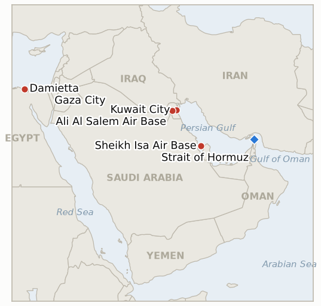

# Middle East Daily Briefing

**August 1, 2026**

- **Reporting window:** ~24 hours, July 31, 09:00 to August 1, 09:00 KST
- **Overall assessment:** Iran spent the window widening its retaliation for Wednesday's Qeshm deaths across three fronts at once rather than answering the US directly: drone strikes it claimed against American linked bases in Kuwait and Bahrain, and, in a first for this war, an attack on two tankers transiting the Strait of Hormuz under an active US military escort. None of it was independently confirmed by CENTCOM, which offered only a procedural rebuttal that "commercial ships are continuing to transit," and none of it triggered Trump's own week-old vow to bomb an Iranian bridge or power plant for every ship struck in the strait, so oil absorbed the day calmly, Brent settling +1.3% at $90.12 and WTI +1.9% at $84.67. Two other threads moved further than the war itself: China's foreign ministry broke its near silence to call the Kuwait strike "unacceptable," and Egypt's government spent the day publicly refusing to blame Iran for Tuesday's drone attack on a US owned LNG vessel at Damietta, even as President Sisi warned of "regional escalation." Separately, in the most significant Gaza news since the Lebanon pilot zones opened, Hamas said it has agreed to a Board of Peace framework for phased disarmament matched with an Israeli withdrawal Washington estimates will take seven to eight months, though Israel has not confirmed the terms. Korea's markets delivered this brief's cleanest decoupling test yet: KOSPI staged the largest single day gain in its history, +17.91% to 6,595.45, on a purely chip and AI driven catalyst that had nothing to do with the war escalating the same day, resolving two of this brief's own indicators toward the chip cycle rather than the war channel.

---

## 1. What Happened

<figure style="float:right; width:46%; margin:2pt 0 8pt 14pt;">

<figcaption style="font-size:8pt; color:#666; text-align:center; margin-top:3pt; font-style:italic;">Major places of discussion</figcaption>
</figure>

### 1.1 Iran Retaliates for the Qeshm Deaths by Striking US Linked Bases in Kuwait and Bahrain

Iran's military said Friday it struck Kuwait's Ahmad al Jaber and Ali Al Salem air bases with kamikaze drones, targeting fighter jet hangars, satellite communication systems and equipment storage used by US forces, and separately struck Bahrain's Sheikh Isa Air Base, targeting power generators, navigation systems and support buildings ([Mehr News](https://en.mehrnews.com/news/246653/Iran-Army-targets-US-Ahmad-al-Jaber-airbase-in-Kuwait); [Al Jazeera](https://www.aljazeera.com/news/2026/7/31/irgc-strikes-us-targets-in-kuwait-a-day-after-us-hits-iran-latest-events)). Tehran framed the attacks explicitly as retaliation for Wednesday's US strike that killed a family of three on Qeshm Island, continuing this war's pattern of routing retaliation through Gulf host states rather than matching Washington's direct-strike escalation with an equivalent hit on US soil. Neither CENTCOM nor Kuwaiti or Bahraini officials had confirmed the claimed strikes or any resulting damage by the window's close. Separately, Trump told reporters he is "losing faith" in Iran, citing its missile fire at US forces in Jordan while nominally in talks, though he stopped short of ruling out a deal, and said the US will keep "hitting them hard" over the next four weeks ([Good Morning America/ABC News](https://www.goodmorningamerica.com/International/live-updates/iran-live-updates-tehran-progress-made-strait-hormuz-135110405/houthis-claim-to-have-struck-another-saudi-oil-tanker-135162786)). No further US strike on Iranian territory itself was reported in the window, leaving IND-20260731-1 open with two nights left before its August 2 deadline. **Confidence: Medium** on the Kuwait and Bahrain strikes occurring as claimed (Iranian military statements via multiple outlets, not yet independently confirmed by CENTCOM or the host governments); **High** on Trump's quotes and the absence of a fresh US strike on Iran in the window.

### 1.2 IRGC Strikes Two Tankers Under Active US Military Escort in the Strait of Hormuz for the First Time

The IRGC said its forces struck and disabled two oil tankers early Friday as they attempted to transit the Strait of Hormuz "encouraged by" CENTCOM and under an active US military air escort via a southern route Iran considers unauthorized, while four other tankers reversed course toward their origin ports ([Washington Times](https://www.washingtontimes.com/news/2026/jul/31/irgc-says-struck-two-tankers-strait-hormuz-escorted-us-military/); [Tasnim](https://www.tasnimnews.ir/en/news/2026/07/31/3660664/two-violating-oil-tankers-disabled-in-strait-of-hormuz-irgc); [Times of Israel](https://www.timesofisrael.com/liveblog_entry/iran-claims-to-strike-two-tankers-under-us-air-escort-trying-to-pass-hormuz/)). This is the first attack this brief has recorded on tankers moving under an explicit, active US military escort rather than transiting independently, and it directly tests the standing threat Trump issued on July 22 to "bomb and destroy ONE BRIDGE OR POWER PLANT" in Iran for every ship Tehran strikes in the strait ([CNBC](https://www.cnbc.com/2026/07/22/us-iran-war-trump-hormuz-.html)). CENTCOM's only public response in the window was procedural rather than a confirmation or denial of the strike itself, posting that "commercial ships are continuing to transit in and out of the Strait of Hormuz tonight," which disputes Iran's separate claim that the strait is closed without addressing the tanker strike directly. Oil ticked up rather than spiking: Brent settled +1.3% at $90.12 and WTI +1.9% at $84.67, a far smaller move than the 7.9% surge that followed the pause's collapse two days earlier ([CNBC](https://www.cnbc.com/2026/07/31/oil-prices-today-brent-wti-hormuz-trump-iran-.html)). **Confidence: Medium** on the tanker strike and the four-tanker reversal occurring as described (Iranian state and semi-official sources, not yet corroborated by Kpler, CENTCOM or the vessels' owners); **High** on the settle prices and CENTCOM's statement.

### 1.3 China's Foreign Ministry Calls the Kuwait Strike Unacceptable, Confirming the Victim Was Nepalese Not Chinese

Chinese foreign ministry spokesperson Mao Ning said Friday that China considers "attacks on innocent civilians and non-military targets… unacceptable" and urged Kuwaiti authorities to protect Chinese citizens and institutions, the first formal Chinese government statement responding to Thursday's Iranian strike on a Chinese company's building in Kuwait ([Anadolu Agency](https://www.aa.com.tr/en/asia-pacific/china-says-attacks-on-non-military-targets-unacceptable-after-iranian-strike-hits-chinese-company-building-in-kuwait/4015099)). The Chinese embassy in Kuwait separately clarified that the worker killed was a Nepalese driver employed by a subcontractor, not a Chinese national, and that no Chinese citizens were harmed ([Arab Times](https://www.arabtimesonline.com/news/chinese-embassy-worker-killed-in-iranian-attack-on-company-building-in-kuwait-was-nepalese/)). This meets IND-20260731-3's confirmation bar, a formal protest specifically citing the Kuwait casualty, though the statement's calibrated language, naming no perpetrator and stopping at Kuwait's protective obligations, and the correction that no Chinese national died, both narrow its practical bite. **Confidence: High** on Mao's statement and the Nepalese victim clarification (official Chinese and Kuwaiti government sources via multiple outlets).

### 1.4 Egypt Resists Blame for the Damietta Drone Attack as Sisi Warns of Regional Escalation

Egyptian President Abdel Fattah el Sisi warned of the "danger of regional escalation" as investigators continued examining drone wreckage recovered from Tuesday's fire aboard a US owned floating LNG storage vessel and a second ship at Damietta port, the war's first attack on Egyptian soil ([The Defense Post](https://thedefensepost.com/2026/07/31/egypt-investigates-drone-strike-damietta-port/)). Egypt's Minister of State for Information publicly rejected a Wall Street Journal report that Cairo privately believes Iran carried out the strike, part of a pattern of Egyptian officials pushing back on attribution rather than confirming it ([cryptobriefing/Al Arabiya](https://cryptobriefing.com/egypt-denies-irans-involvement-in-damietta-drone-attack-al-arabiya/)). Iran's Foreign Minister Araghchi called Egypt "an important friend" and pointed instead at Israeli "false flag operations," while the Houthis separately denied any role; no party has claimed the attack (§2.2, IND-20260801-3). **Confidence: High** on the attack occurring, the drone determination and Sisi's statement (Egyptian government sources, multi outlet); **Low** on attribution, which remains genuinely disputed across every named party.

### 1.5 Hamas Agrees to a Board of Peace Framework for Phased Disarmament and Israeli Withdrawal From Gaza

President Trump announced that Hamas has agreed to a Board of Peace brokered framework under which it disarms in stages, verified by an International Verification Committee, matched with an Israeli withdrawal Washington estimates will take seven to eight months, followed by a handover to a new Palestinian administration and an International Stabilisation Force ([Al Jazeera](https://www.aljazeera.com/news/2026/7/31/gaza-board-of-peace-announces-hamas-disarmament-agreement-what-we-know); [Euronews](https://www.euronews.com/2026/07/31/trump-announces-historic-deal-for-the-complete-disarmament-of-hamas-and-israeli-withdrawal)). The announcement carries major caveats: Israel has not publicly endorsed the specific terms, and Hamas has said it will not implement any disarmament step unless Israeli forces first meet their own reciprocal withdrawal obligations, a sequencing dispute that has stalled prior Board of Peace milestones ([CNN](https://www.cnn.com/2026/07/31/middleeast/trump-hamas-disarmament-announcement-intl); [The Defense Post](https://thedefensepost.com/2026/07/31/hamas-israel-ceasefire-weapons-withdrawal-gaza/)). If it holds, this would be the most significant movement on the Gaza track since the Lebanon pilot zone handovers began, though this week's Iran war escalation has visibly crowded out bandwidth for both the Gaza and Lebanon tracks (§2.5, IND-20260801-2, IND-20260723-2). **Confidence: Medium** on the announcement and its stated terms (Trump and Board of Peace statements via multiple outlets); **Low** on implementation, which depends on an Israeli confirmation not yet given.

---

## 2. Deep Dive: Incentives and Motives

### 2.1 Why is Iran routing its retaliation through Kuwait and Bahrain rather than matching Washington's direct-strike escalation?

Because Iran has no practical way to strike the US homeland and only depleted, distance constrained options against Israel after five months of war, so Gulf states hosting US basing are the only reachable targets that impose a cost on Washington's own war effort without crossing into a symmetrical exchange Tehran cannot sustain. Hitting Kuwait and Bahrain also punishes the two states most publicly tied to the July 30 heavy wave as basing or overflight platforms, letting Tehran sell the strikes domestically as accountability rather than mere retaliation. This is the "horizontal escalation" pattern researchers described to Al Jazeera today: expanding the war's geography because Iran cannot match its intensity, ordnance for ordnance.

### 2.2 Why would Iran risk striking Egyptian soil, and why is Cairo resisting the attempt to pin the blame on Tehran?

The balance of evidence points away from a deliberate Iranian strike on Egypt as a state: Iran claimed the Kuwait and Bahrain strikes within hours, as it has claimed nearly every other attack this war, but has said nothing about Damietta, and its foreign minister is actively deflecting toward an Israeli false flag narrative rather than owning it. Egypt has stayed outside the active anti-Iran coalition Kuwait, Bahrain and Jordan now belong to, so Tehran had little obvious grievance to answer there. Cairo's public resistance to the WSJ's Iran attribution is itself informative: a government building toward a US backed naval coalition would have every incentive to accept the blame Washington was reportedly assigning, and its refusal suggests Egypt judges unresolved ambiguity safer than a definitive answer that could force it to choose a side in a war it has so far sat outside.

### 2.3 Why did Beijing finally break its near total silence to formally condemn the Kuwait strike?

Because a Nepalese contractor's death let China register an objection without the domestic political complication a genuine Chinese national casualty would have created, at essentially no diplomatic cost. Doing so protects Beijing's commercial footprint across Gulf states now absorbing kinetic risk and signals that further hits on Chinese linked property will not go unremarked, while the statement's calibrated language, "unacceptable" without naming Iran, preserves China's position as Iran's largest oil customer and its self styled neutral broker role in the war.

### 2.4 Why did Korea's KOSPI post the largest single day gain in its history on the same day Iran struck two more Gulf states?

Because Friday's session was the decisive test this brief's own indicators (IND-20260725-2, IND-20260730-2) were designed to run, and it resolved cleanly toward the chip cycle. The rally traced entirely to global chip and AI sentiment: Microsoft's earnings beat reignited AI capex confidence and sent the Philadelphia Semiconductor Index up 8%, which Samsung's and SK hynix's own results amplified into a leveraged 27 to 30% single day move, a catalyst with no connection to the war escalating in parallel. The won's continued strengthening, to a nine month high against the dollar intraday before closing at 1,424.0, tells the same story from a different channel: roughly ₩7 trillion in foreign net equity buying, not a war driven flight from Korean assets, compounded by a reportedly coordinated Korea Japan, and possibly US linked, dollar selling intervention aimed at capping an overly rapid won and yen appreciation rather than defending against war driven capital flight (§3.2). Both legs point away from the war channel on the one day this month a live, widening war and Korea's own market open coincided most directly.

### 2.5 Why would Hamas agree to a disarmament framework now, in the middle of an unrelated war escalating elsewhere?

Because the Gaza and Iran war tracks run on separate clocks that share only a mediator. Trump's Board of Peace apparatus has kept working the Gaza file regardless of the Iran war's tempo, and Hamas's leverage, isolated militarily and diplomatically after nearly two years of war, erodes the longer it withholds an answer to a framework Egypt, Qatar and Turkey have all endorsed. Announcing agreement in principle costs Hamas little while the reciprocal Israeli withdrawal remains unconfirmed, so Friday's announcement functions as much as pressure aimed at Jerusalem, forcing Israel to either match the disarmament rhetoric or be seen rejecting a deal Washington has already publicly claimed as a win, as it does a fully operational commitment.

---

## 3. Policy Implications for South Korea

### 3.1 Exposure snapshot

| Item | Current reading | Source |
| --- | --- | --- |
| July-August crude procurement | 110%+ of prior-year volume secured (MOTIE, July 21) | MOTIE via Herald Business, Youth Daily; `korea-exposure.md` |
| September crude procurement | 90%+ secured (MOTIE, July 21) | MOTIE via Herald Business; `korea-exposure.md` |
| Strategic reserve coverage | ~26 days of actual consumption (estimate); swap on immediate standby, untested at scale | CSIS; MOTIE July 27 |
| Korean nationals/vessels in Gulf | ~43 (13 aboard Korean vessels, 30 aboard foreign vessels) as of late June; MOFA reviewed safety with 17 missions | MOFA; Korea Herald |
| Brent | $90.12 settle, +1.3% (ticks up on the Hormuz tanker strike, no spike) | CNBC |
| WTI | $84.67 settle, +1.9% | CNBC |
| KOSPI | 6,595.45, +17.91% (+1,001.89pts); largest single-day gain and percentage move in KOSPI history, chip/AI driven | KED Global; Seoul Economic Daily |
| USD/KRW | ₩1,424.0, -13.4 won (won firms to a 9-month intraday high of ₩1,418.0 on ~₩7tn foreign equity inflows and a reported coordinated Korea-Japan FX intervention) | Money Today; Digital Times |
| Hormuz transits | 14 confirmed crossings, July 29 (Kpler); no fresher daily count published in this window | Kpler; Rigzone |
| Qatari LNG (Ras Laffan) | No further laden departure since the Al Areesh (July 30); freeze otherwise unresolved | The National; Bloomberg |

### 3.2 Implications by development

**Trump's untested "one bridge or power plant" threat is now live against a real trigger, and Korea's energy planners should treat the next 48 to 72 hours as the window that decides whether this campaign's target set expands to Iranian civilian infrastructure.** If Washington follows through on today's tanker strike, MOTIE and KNOC should immediately revisit the escalation scenarios `korea-exposure.md` uses for its worst-case import-bill modeling, since a strike on Iranian power or transport infrastructure would be a materially different campaign than the military-target-only pattern held since the pause collapsed.

**Beijing's formal protest over the Kuwait strike is a data point Korean firms operating in the Gulf should not read as reassurance.** If even a calibrated, mild statement follows a Nepalese contractor's death at a Chinese-linked site, Korean personnel and assets in Kuwait, Saudi Arabia and the UAE, including the Barakah project's Korean staff, remain exposed to the same category of incidental harm regardless of Seoul's neutral posture, and a formal Korean government protest would likely follow a comparable incident involving Korean nationals.

**Friday's record KOSPI rally is the cleanest evidence yet that Korea's equity market prices this war almost exclusively through the oil level, never through a broader risk premium, even on a day the war visibly widened.** This resolves IND-20260725-2 and IND-20260730-2 toward the chip-cycle branch and should reassure the Bank of Korea's August reaction function (IND-20260717-3) that the war's transmission channel into Korean asset prices remains narrow and oil-centric rather than a generalized risk-off force, even as the currency intervention story (§2.4) is itself worth the BOK's separate attention heading into August.

**Testable indicators:**

- **IND-20260801-1** — Trump's July 22 threat to bomb an Iranian bridge or power plant for every ship struck in Hormuz gets triggered by today's tanker attack, or stays rhetorical. A verified US strike on an Iranian bridge, power plant or comparable civilian infrastructure target within five days of the July 31 tanker strikes, by ~2026-08-05, confirms the threat is operative doctrine and sharply raises the campaign's civilian-infrastructure risk; no such strike through ~2026-08-05 despite the tanker attack falsifies it as an unenforced threat, consistent with every prior Iranian tanker strike this month going unanswered on this specific term.
- **IND-20260801-2** — The Board of Peace Gaza disarmament framework gets a public Israeli answer or stalls in ambiguity. A public Israeli government statement accepting, endorsing or beginning to implement the July 31 framework by ~2026-08-15 confirms the announcement reflects a real, converging deal; continued Israeli silence or explicit rejection through ~2026-08-15, with Hamas's implementation conditioned on a reciprocal step that never comes, falsifies it as another announced-but-unrealized milestone.
- **IND-20260801-3** — Egypt's Damietta attribution resolves or stays permanently contested. An official Egyptian, US or independent forensic determination naming Iran, Israel, the Houthis or another specific actor as responsible by ~2026-08-14 confirms Cairo's ambiguity was investigative rather than diplomatic caution; the case remaining formally unattributed through ~2026-08-14, with Egypt continuing to reject external attributions without offering its own, falsifies attribution as achievable in this window and confirms Cairo is deliberately keeping the incident unresolved to avoid choosing sides.

**Resolutions this run:**

- **IND-20260731-3 — Confirmed.** Opened to test whether the Qeshm and Kuwait civilian casualties would draw a formal proportionality response. China's foreign ministry calling the Kuwait strike "unacceptable" meets this indicator's bar, a formal protest specifically citing the Kuwait casualty, well ahead of its August 6 deadline (§1.3).
- **IND-20260725-2 — Falsified.** Opened to test whether Korea's late-July equity break was the chip cycle or the war, resolving at the July 31 KST close. Cumulative foreign flows for the week ended in net buying (~₩7tn on July 31 alone, not the continuing net selling the confirmation branch required), and the won never approached ₩1,490 on any session, closing the week at 1,424.0. The equity leg's magnitude, a chip-driven +17.91% rather than a move "within a few percentage points" of the SOX's +8%, is a higher-beta version of the chip-cycle read than the indicator's design anticipated, not a different explanation; the war channel did not widen into equities or FX this week.
- **IND-20260730-2 — Falsified.** Opened to test whether Korea's markets would reprice the war on the first session that opened against a live, reignited conflict. Friday's session, occurring the same day Iran struck two more Gulf states and an escorted tanker, moved entirely on chip and AI catalysts (Microsoft's earnings, the SOX's 8% jump, Samsung and SK hynix results) with no reporting tying the rally to the war, and the won firmed further on equity inflows and intervention rather than weakening on war risk, the falsification branch's specified pattern, absent this time the "lower-oil logic" driver since oil itself rose the same day. Korea's markets continue to price this war only through the oil level.

---

## 4. Watch List

- **Whether Trump's "one bridge or power plant" threat gets tested by a US strike on Iranian civilian infrastructure** following today's tanker attack (IND-20260801-1).
- **Whether the Board of Peace Gaza framework gets a public Israeli answer**, or stalls the way prior milestones have (IND-20260801-2).
- **Whether the Damietta attack is ever formally attributed**, with Iran, Israel and the Houthis all currently pointing away from themselves (IND-20260801-3).
- **Whether the reignited direct-strike campaign against Iran continues beyond a single night** (IND-20260731-1, deadline August 2).
- **Whether Qatar's Ras Laffan LNG freeze produces further laden departures** beyond the single Al Areesh transit (IND-20260731-2, deadline August 6).
- **Aramco and the Saudi government's continued silence on Abqaiq's operational status**, now six days after the raid with no primary-source statement (IND-20260729-1).
- **Kharg Island**, still untouched despite Trump's rhetoric and Iran's own unverified claims otherwise (IND-20260727-3).
- **Whether any vessel tests Iran's frozen-asset transit ban** (IND-20260729-2), still untested leverage.
- **Friction inside the Lebanon pilot-zone framework**, crowded out of coverage entirely by today's Iran-Gulf escalation (IND-20260723-2).
- **The reportedly coordinated Korea-Japan FX intervention**, whose scale and rationale beyond capping won/yen appreciation remain unclear.

---

## 5. Source Quality Summary

| Claim | Sources | Confidence |
| --- | --- | --- |
| Iran claims drone strikes on Kuwait's Ahmad al-Jaber and Ali Al Salem air bases and Bahrain's Sheikh Isa Air Base | Mehr News, Al Jazeera (Iranian state and Tier 1-2 outlets; not independently confirmed by CENTCOM or host governments) | Medium |
| Trump says he is "losing faith" in Iran but does not rule out a deal | Good Morning America/ABC News (Tier 1, direct quotation) | High |
| IRGC claims strikes on two tankers under active US military escort in the Strait of Hormuz; four tankers reverse course | Washington Times, Tasnim, Times of Israel (Iranian state/semi-official and Tier 1-2 outlets; not corroborated by Kpler, CENTCOM or vessel owners) | Medium |
| CENTCOM: "commercial ships are continuing to transit in and out of the Strait of Hormuz tonight" | CENTCOM official statement via multiple outlets | High |
| Brent settle $90.12 (+1.3%), WTI settle $84.67 (+1.9%) | CNBC | High |
| China's foreign ministry calls the Kuwait strike "unacceptable"; victim was a Nepalese subcontractor, not Chinese | Anadolu Agency, Arab Times (Tier 1-2, official Chinese and Kuwaiti sources) | High |
| Egypt rejects WSJ report blaming Iran for the Damietta drone attack; Sisi warns of regional escalation | The Defense Post, cryptobriefing/Al Arabiya (Tier 1-2, Egyptian government sources) | High on the statements; Low on underlying attribution |
| Hamas agrees to a Board of Peace phased disarmament and Israeli withdrawal framework | Al Jazeera, Euronews, CNN (Tier 1, Trump and Board of Peace statements; Israel has not confirmed) | Medium |
| KOSPI +17.91% to 6,595.45, largest single-day gain in history, chip/AI driven | KED Global, Seoul Economic Daily, Benzinga (Tier 1-2, multi outlet) | High |
| Won firms to ₩1,424.0 (-13.4 won), touching a 9-month high of ₩1,418.0 intraday, on ~₩7tn foreign equity inflows and a reported coordinated Korea-Japan intervention | Money Today, Digital Times (Tier 1-2 Korean) | High on the levels; Medium on the intervention's coordination and scale |
