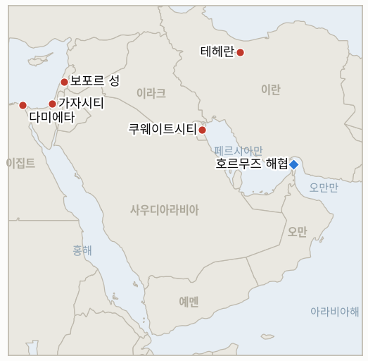

# 중동 일일 브리핑

**2026년 8월 2일**

- **보고 기간:** 약 24시간, 8월 1일 09:00 ~ 8월 2일 09:00 (한국시간)
- **종합 평가:** 이번 창을 규정하는 사실은 실제 타격이 아니라 위협이다. 미국과 이스라엘 당국자들은 복수 매체에, 이란의 발전소·정유시설과 지하에 묻힌 픽액스 마운틴 핵시설을 겨냥한, 이번 전쟁 중 가장 강도 높은 폭격이 될 수도 있는 작전을 검토 중이며 "이번 주말에라도" 개시해 최대 2주간 이어질 수 있다고 밝혔지만, 트럼프 대통령은 이 창이 닫힐 때까지 최종 명령을 내리지 않았다. 위협과 실행 사이의 이 간극은 IND-20260731-1을 공식적으로 falsified(기각)로 확정짓는다 — 7월 30일 대규모 공습 이후 사흘 안에 이란 본토에 대한 추가 직접 타격이 끝내 없었기 때문이다 — 동시에 같은 질문을 더 크게 다시 여는 후속 지표를 연다. 다른 모든 흐름은 이 위협의 그늘 아래에서 움직였다. 이란은 쿠웨이트 부비얀 섬을 또다시 타격했고 오만 인근에서 유조선 2척이 피격되거나 피격 위기를 겪었으나 이란의 명확한 자인은 없었으며, 이스라엘은 하마스가 평화이사회 무장해제 서약을 재확인한 바로 그날에도 가자지구 폭격을 지속해 최소 4명이 숨졌고, 익명의 이스라엘 당국자는 "진정한 무장해제" 전에는 어떠한 철군도 없다고 밝혔으며 벤그비르는 합의 전체를 "받아들일 수 없다"고 규정했다. 그리고 익명의 이란 당국자들은 뉴욕타임스에 다미에타 드론 공격이 이란의 타격 능력을 보여주기 위한 시위성 공격이었다고 언급해, 이란이 공개적으로 자인하지 않은 채 책임 소재를 테헤란 쪽으로 기울였다. 한국과 국제 유가 시장은 주말로 휴장해 아직 이 모든 것이 반영되지 않았으므로, 다음 24시간의 취재와 이번 창에서 열어둔 지표들의 실제 해소는 월요일 한국시간 개장에서 이루어질 것이다.

---

## 1. 무슨 일이 있었나

<figure style="float:right; width:46%; margin:2pt 0 8pt 14pt;">

<figcaption style="font-size:8pt; color:#666; text-align:center; margin-top:3pt; font-style:italic;">주요 논의 지점</figcaption>
</figure>

### 1.1 미국·이스라엘, 이란 에너지·핵 시설에 대한 확대 공습을 검토

복수 매체는 미국과 이스라엘이 이란의 발전소, 정유시설, 석유화학 시설을 겨냥해 이번 전쟁 중 가장 강도 높은 폭격이 될 수도 있는 작전을 계획 중이며, 일부 당국자는 테헤란 일대 전력 공급을 끊는 방안까지 논의했고, 테헤란 남쪽 지하에 묻힌 픽액스 마운틴(쿠헤 콜랑) 핵시설 타격 준비도 최근 며칠 사이 별도로 "속도를 냈다"고 보도했다 ([CBS News](https://www.cbsnews.com/news/us-israel-iran-war-energy-related-targets-trump/); [Times of Israel](https://www.timesofisrael.com/liveblog-august-01-2026/); [ABC News](https://abcnews.com/International/live-updates/iran-live-updates-tehran-progress-made-strait-hormuz/?id=135110405)). 트럼프 대통령은 금요일 캠프 데이비드에서 이란을 "그들이 더는 견딜 수 없을 때까지" 강하게 타격하겠다고 밝혔고, 이후 "우리는 멈추지 않을 것"이라고 덧붙였으나, 당국자들은 최종 명령이 내려지지 않았으며 계획이 바뀔 수 있다고 신중한 입장을 보였다. 경제적 파장을 고려해 월요일 개장 전에 타격을 마무리하자는 논의도 있었다. 국방부 대변인 션 파넬은 "국방부는 대통령의 지시를 실행할 만반의 준비가 돼 있다"고 밝혔고, 이란 전시사령부 사령관 알리 압둘라히 소장은 "미국이 전면적인 지역 전쟁의 불씨를 가속화하고 있다"고 경고하며 미국의 방패 역할을 하는 이슬람권 국가들은 "전쟁의 불길에 타 버릴 것"이라고 위협했다. 국무부는 바레인, 이스라엘, 이라크, 요르단, 쿠웨이트, 레바논, 오만, 카타르, 사우디아라비아, 아랍에미리트 등 10개국에 체류 중인 미국 국민에게 항공편 취소와 영공 폐쇄 가능성을 경고하는 안전 공지를 발령했다. 이 창 내내 이란 본토에 대한 타격은 확인되지 않아 IND-20260731-1의 좁은 시험을 공식적으로 falsified(기각)로 만들었으며(§3.3), 더 큰 위협은 IND-20260802-1로 이어서 추적한다. **신뢰도: 높음** — 위협의 존재와 확인된 타격이 없다는 사실, 인용된 발언들 (복수의 1급 매체, 실명 당국자); **낮음** — 작전이 실제로 언제, 어떻게 개시될지.

### 1.2 이란, 쿠웨이트 부비얀 섬을 재차 타격하고 오만 인근에서 유조선 2척이 피격되거나 피격 위기

쿠웨이트 국방부는 토요일 새벽 이란 드론이 영공을 침범해 북부 부비얀 섬의 정부 시설과 민간 차량을 타격했으며, 방공망이 대부분을 요격해 인명 피해는 없었다고 밝혔다. 쿠웨이트 외교부는 이를 "쿠웨이트 주권에 대한 명백한 침해"라 규정하며 유엔 안전보장이사회 결의 2817호와 국제법을 근거로 들었다 ([Gulf News](https://gulfnews.com/world/gulf/kuwait/kuwait-says-iranian-attack-hit-government-site-vehicles-damaged-1.500627513); [TASS](https://tass.com/world/2167955)). 별도로 영국해양무역기구(UKMTO)는 오만 무산담 반도 인근에서 발생한 두 건의 해상 사건을 보고했다. 리마 북동쪽 11해리 지점에서 정체불명의 발사체에 맞아 기관실이 손상돼 항행이 불가능해진 유조선 한 척과, 하스아브 북동쪽 21해리 지점에서 "큰 물기둥과 폭발"을 목격했다는 두 번째 선박으로, 확인된 피해는 없었다. 두 사건 모두 명확한 이란 측 자인이 없었는데, 이는 7월 31일 혁명수비대가 미군 실제 호위 하의 유조선을 직접 자인했던 공격과는 대조적이다 ([Middle East Eye](https://www.middleeasteye.net/live-blog/live-blog-update/ukmto-says-explosion-near-tanker-oman-reported); [Arab News](https://www.arabnews.com/node/2652982/middle-east)). 중부사령부는 금요일 저녁 호르무즈 해협이 상선에 "완전히 개방돼 있다"고 재차 밝혔다. Kpler의 가장 최근 명확한 일일 수치인 7월 31일 21시(UTC) 기준 24시간 통계는 호르무즈 통항 선박이 단 5척(출항 4척, 입항 1척)에 그쳐, 7월 28~29일의 반등(12척, 14척)에서 크게 줄었다(§3.1, IND-20260725-3). **신뢰도: 높음** — 쿠웨이트 공격과 Kpler 통항 수치 (쿠웨이트 공식 소식통, Kpler); **중간** — 오만 인근 유조선 사건의 원인과 책임 소재 (UKMTO 보고, 어느 당사자도 책임을 주장하지 않음).

### 1.3 하마스 무장해제 서약에도 이스라엘은 가자지구 공습을 지속하고 네타냐후는 침묵

이스라엘군은 금요일 밤과 토요일에 걸쳐 가자지구 중·북부에서 강도 높은 공습을 벌여 현지 보건당국 기준 최소 4명이 숨지고 수십 명이 다쳤으며, 이스라엘군은 하마스 저장시설 5곳을 파괴했다고 밝혔는데, 이는 평화이사회가 하마스가 "며칠 내" 무장해제를 시작할 것이라고 밝힌 바로 그 창에서 벌어졌다 ([Fortune](https://fortune.com/2026/08/01/trump-iran-war-kuwait-hormuz-attacks-israel-gaza-hamas/); [PBS NewsHour](https://www.pbs.org/newshour/world/trump-threatens-more-strikes-on-iran-tensions-from-hormuz-to-kuwait-and-gaza-lead-to-more-warnings)). 이스라엘 정부는 7월 31일 무장해제 틀을 공식 승인하지 않았다. 익명의 당국자는 "하마스의 진정한 무장해제" 전에는 "이스라엘이 가자지구 내 현 위치에서 철수하지 않을 것"이라고 밝혔고, 네타냐후 총리는 공개적으로 침묵을 지키고 있는데, 이는 이스라엘이 이 합의에 "매우 만족한다"는 트럼프의 공개 발언과, 벤그비르 국가안보장관이 합의를 "받아들일 수 없다"고 규정하고 중도 성향의 경쟁자 가디 아이젠코트조차 하마스 완전 소멸에 못 미치는 어떤 합의도 "완전한 실패"라 규정하는 연립정부 사이에 낀 형국이다 ([Al Jazeera](https://www.aljazeera.com/news/2026/8/1/is-israel-really-ready-to-withdraw-from-gaza); [Times of Israel](https://www.timesofisrael.com/liveblog_entry/ben-gvir-says-hamas-disarmament-deal-unacceptable/)). 알자지라가 인용한 분석가들은 10월 총선과 부패 혐의 재판을 앞둔 네타냐후가 진정한 철군보다는 트럼프를 만족시키기 위한 상징적 재배치에 그칠 것으로 전망했다(§2.3, IND-20260801-2). **신뢰도: 높음** — 공습, 사상자 수, 인용된 발언 (복수 매체, 이스라엘·팔레스타인 보건당국 소식통); **낮음** — 이 틀이 실제 이스라엘 철군으로 이어질지.

### 1.4 이란 당국자들, 뉴욕타임스에 다미에타 공격이 시위성 공격이었다고 언급

익명의 이란 당국자 2명은 뉴욕타임스에, 7월 29일 이집트 다미에타 항구에서 미국 소유 부유식 LNG 선박 에네르고스 윈터를 포함한 선박 2척에 화재를 낸 드론 공격이 "이란이 확전을 선택할 경우 세계 에너지 공급망과 해상운송에 훨씬 더 큰 타격을 줄 수 있음을 보여주려는" 의도였다고 언급했으며, 이란 자체나 역내 대리세력 중 누가 실행했는지는 밝히지 않았다 ([Times of Israel](https://www.timesofisrael.com/liveblog_entry/iranian-sources-tell-nyt-that-egypt-drone-strike-was-designed-to-showcase-tehrans-capabilities/); [Ynetnews](https://www.ynetnews.com/article/rkk85pdsml)). 이는 테헤란이 공개적으로 자인하지 않은 공격에 대해 이란 소식통이 내놓은 최초의 귀책성에 근접한 언급으로, 이번 전쟁에서 이란이 몇 시간 안에 거의 모든 다른 공격을 자인해 온 관행과 대비된다. 이는 IND-20260801-3이 요구하는 공식 결정에는 미치지 못하지만, 진짜 미해결 문제라기보다 증거의 무게를 테헤란이나 이란 연계 대리세력 쪽으로 기울인다. 이집트 자체 조사는 수거한 드론 잔해를 근거로 이 창에서도 공개 귀책 없이 계속됐다(§2.4). **신뢰도: 중간** — 익명의 이란 당국자들의 진술과 그 구성 (뉴욕타임스 단독 취재이나 같은 보도를 인용한 복수 매체로 교차 확인); **낮음** — 공식 귀책은 여전히 미해결.

### 1.5 레바논 전선은 이스라엘이 보포르 성 지하 터널을 파괴하며 계속 긴장

이스라엘군은 이 창에서 남부 레바논의 유네스코 지정 유적지인 보포르 성 지하의 터널망을 파괴했으며, 헤즈볼라와의 별도 교전에서 이스라엘군 장교 1명이 경상을 입었다. 전선이 재점화된 이후 레바논에서 숨진 이스라엘군 사망자는 이제 38명에 이른다 ([PBS NewsHour](https://www.pbs.org/newshour/world/trump-threatens-more-strikes-on-iran-tensions-from-hormuz-to-kuwait-and-gaza-lead-to-more-warnings)). 이 창에서 자우타르 알가르비예 첫 시범구역을 넘어선 두 번째 검증된 이스라엘 철군과 레바논군 배치는 보고되지 않아, IND-20260723-2는 약 8월 6일 마감을 나흘 앞두고 여전히 미해결로 남았으며, 단계적 인계보다는 오늘의 실전 교전이 더 두드러진 흐름이다(§2.5). **신뢰도: 높음** — 터널 파괴, 부상당한 장교, 누적 사망자 수 (이스라엘군 소식통, 복수 매체); **중간** — 이것이 시범구역 틀의 단기 전망에 미치는 영향은 보도에서 직접 다뤄지지 않음.

---

## 2. 심층 분석: 동기와 노림수

### 2.1 카르그 섬과 픽액스 마운틴을 수개월간 수사적 지렛대로만 다뤄온 워싱턴이 왜 지금 에너지·핵 시설로 확전하려 하는가?

더 부드러운 수단은 모두 시도됐지만 이란의 보복을 멈추지 못했기 때문이다. 통행료, 동결 자산 보상 위협, 7월 30일 혁명수비대 표적에 대한 대규모 재래식 공습, 외교를 위한 짧은 휴전이 모두 앞서 시도됐지만, 그 뒤 맞이한 주말에 이란은 쿠웨이트를 다시 타격했고 오만 인근에서 유조선 2척이 추가로 피격되거나 피격 위기를 겪었다. 에너지·핵 시설은 이 작전이 5개월 동안 의도적으로 손대지 않은 표적군인데, 바로 그것을 타격하면 확전 완화라는 선택지 자체가 사라지기 때문이다. 따라서 지금 이 위협을 여러 유출 경로를 통해 크고 요란하게 흘리는 것은 돌이킬 수 없는 조치에 앞선 최후통첩 성격이며, 경제적 파장을 통제하기 위해 월요일 개장 전에 타격을 마무리하자는 내부 논의가 보도된 것과도 일치한다.

### 2.2 이란 지휘부가 전면전을 경고하면서도 쿠웨이트와 호르무즈 선박에 대한 공격을 계속하는 이유는 무엇인가?

7월 말 이후 테헤란의 계산법은 바뀌지 않았기 때문이다. 미군을 주둔시킨 걸프 주둔국들과 호르무즈 해상운송은 이란이 감당할 수 없는 대칭적 응수 없이 미국 주도 연합에 실질적 비용을 부과할 수 있는 유일하게 도달 가능한 표적으로 남아 있으며, "전쟁의 불길"을 경고하는 것 자체가 압박의 한 형태로, 정작 중요한 청중인 걸프 국가들과 이슬람권 정부들이 미국의 타격을 유치하거나 돕지 못하도록 하려는 것이지 이란 스스로의 행동을 완화하겠다는 신호가 아니다.

### 2.3 워싱턴이 공개적으로 반기는 무장해제 서약을 하마스가 확인한 바로 그날에도 이스라엘이 가자지구를 계속 타격하는 이유는 무엇인가?

이 틀의 이행 조건이 여전히 협상 중인 바로 지금 군사적 압박을 계속 가할 강력한 유인이 네타냐후 정부에 있기 때문이다. 이는 그 조건을 유리한 위치에서 형성하려는 목적과, 10월 총선을 앞두고 벤그비르의 반발이 상징에 그치지 않고 정부 존속에 실질적 위협이 되는 연립정부를 관리하려는 목적을 동시에 노린다. 공습을 계속하는 것은 네타냐후가 우파 지지층에게는 현장에서 아무것도 바뀌지 않았다고 말하면서 동시에 워싱턴에는 틀이 여전히 살아 있다고 말할 수 있게 해 주는데, 이는 이스라엘이 IND-20260801-2가 주시하는 공개 성명을 피하는 한에서만 지속 가능한 입장이다.

### 2.4 이란 당국자들이 공개적으로는 다미에타를 계속 부인하면서 뉴욕타임스에는 왜 은밀히 언급했는가?

익명의, 부인 가능한 인정이 이란으로 하여금 공개 자인의 외교적·법적 비용을 감수하지 않으면서도, 미국과 연계된 LNG 자산을 이집트 영토 안에서 타격할 수 있음을 걸프와 서방 청중에게 보여주는 억지력 효과를 얻게 해 주기 때문이다. 특히 이란이 전쟁 내내 "중요한 우방"이라 불러 온 이집트를 상대로는 더욱 그렇다. 사적 메시지와 공개 메시지 사이의 이 간극 자체가 테헤란이 이번 전쟁에서 다섯 번째로 발을 들인 국가를 얼마나 신중하게 관리하고 있는지를 보여준다.

### 2.5 시범구역 틀이 확전 완화를 지향한다면서도 남부 레바논 전선이 계속 활발한 이유는 무엇인가?

시범구역 틀은 삼자 협정에 명시된 특정 마을들만 포괄하며, 그 좁은 목록 밖의 지역, 즉 보포르 성처럼 군사적·상징적 가치를 함께 지닌 곳은 이스라엘이 헤즈볼라의 잔존 인프라에 대한 작전을 계속하는 실전 전장으로 남아 있기 때문이다. 지정 구역에서의 단계적 철군과 완충지대 다른 곳에서의 계속된 교전이라는 두 흐름은 이스라엘의 관점에서는 모순이 아니다. 이는 미국이 중개한 메커니즘이 요구하는 곳에서만 땅을 내주면서 그 외 모든 곳에서는 헤즈볼라의 잔존 역량을 철저히 부정하는 정책을 반영한다.

---

## 3. 한국에 대한 정책적 함의

### 3.1 노출도 스냅샷

| 항목 | 현재 수치 | 출처 |
| --- | --- | --- |
| 7~8월 원유 도입 | 전년 동기 대비 110% 이상 확보 (산업통상자원부, 7월 21일) | MOTIE via Herald Business, Youth Daily; `korea-exposure.md` |
| 9월 원유 도입 | 90% 이상 확보 (산업통상자원부, 7월 21일) | MOTIE via Herald Business; `korea-exposure.md` |
| 전략비축유 커버리지 | 실제 소비 기준 약 26일치(추정); 스와프는 즉시 대기 상태이나 대규모 시행은 검증되지 않음 | CSIS; MOTIE 7월 27일 |
| 걸프 지역 한국 국민·선박 | 약 43명(한국 선박 13명, 외국 선박 30명), 6월 말 기준; 외교부가 17개 공관과 안전 점검 | MOFA; Korea Herald |
| 브렌트유 / WTI / 코스피 / 원달러 | 주말 휴장; 마지막 정산은 7월 31일 (브렌트 90.12, WTI 84.67, 코스피 6,595.45, 1,424.0원) | CNBC; KED Global; Money Today |
| 호르무즈 통항량 | 확인된 통항 5척, 7월 31일 21시(UTC) 기준 24시간 (Kpler), 7월 28~29일의 12~14척에서 감소 | Kpler |
| 카타르 LNG(라스라판) | 알아리시호(7월 30일) 이후 추가 만재 출항 없음; 해협 내 보고된 다른 선박(므라웨호)은 아부다비국영석유(ADNOC) 소속 공선으로, 카타르 추가 선적이 아님 | Riviera; The National |

### 3.2 사안별 함의

**이란 에너지·핵 시설에 대한 위협받은 확전 공습은 지금 한국의 하반기 대응 계획에 가장 중요한 변수이며, 아직 실행되지는 않았다.** 산업통상자원부와 한국석유공사는 방금 지나간 주말이 아니라 앞으로 며칠을 실제 결정의 창으로 다뤄야 한다. 이란의 발전·정유·핵 시설에 대한 실제 타격은 지금까지 흡수해 온 어떤 것보다 근본적으로 더 크고 장기적인 작전이 될 것이므로, `korea-exposure.md`의 최악 시나리오 도입 비용 및 비축유 방출 모델링을 이 시나리오에 맞춰 특별히 재점검해야 한다. 시장은 이토록 큰 위협을 아직 가격에 반영할 기회조차 없었기 때문에, 차분했던 주말 가격 흐름을 근거로 판단해서는 안 된다.

**이란이 전면전을 경고하면서도 쿠웨이트와 호르무즈 선박에 대한 공격 의지를 계속 보이는 것은, 7월 말 이후 걸프 국가들이 유지해 온 '항의 후 복구' 균형이 걸프 국가 자신들의 대응에 대한 상한선이지 이란의 행동에 대한 상한선이 아님을 상기시킨다.** 쿠웨이트를 비롯한 걸프협력회의(GCC) 전역의 한국 기업과 국민(§3.1)은 쿠웨이트의 절제된 외교적 대응을 한국 국민·자산에 대한 위험이 줄고 있다는 신호로 읽어서는 안 된다. 오히려 며칠 사이 쿠웨이트 본토에 대한 두 번째 직접 타격이 발생했다는 사실은, 추가 확전이 벌어지기 전에 외교부의 걸프 지역 안전 대책을 선제적으로 재점검해야 한다는 근거가 된다.

**하마스가 무장해제를 확인한 바로 그날에도 이스라엘이 가자지구 공습을 계속한 것은, 평화이사회 틀의 발표와 그 이행이 서로 다른 시간표로 진행되는 별개의 과정임을 보여주는 가장 명확한 증거이며, 서울의 중동 담당 부서도 이 틀에서 나오는 향후 발표들을 읽을 때 같은 원칙을 직접 적용해야 한다.** 향후 가자지구 재건 자금과 관련된 한국의 외교·상업적 기획에 대한 실질적 교훈은, IND-20260801-2가 명시한 구체적 기준, 즉 이스라엘의 공개 수용이나 이행 조치가 실제로 충족되기 전까지는 발표된 틀을 확정된 약속이 아니라 하나의 선택지로 취급하라는 것이다.

**검증 가능한 지표:**

- **IND-20260802-1** — 위협받은 미국·이스라엘의 이란 에너지·핵 시설 공습이 실제로 개시되는지, 아니면 위협으로만 남는지. 약 2026년 8월 5일까지 이란의 발전소, 정유시설, 석유화학 시설 또는 픽액스 마운틴이나 이에 준하는 나탄즈 인접 핵시설에 대해 미국이나 이스라엘의 검증된 타격이 있으면, 워싱턴이 위협받던 지렛대에서 오랫동안 예고돼 온 인프라 공습으로 넘어갔음을 확정하며, 이는 지금까지 흡수한 어떤 것보다 유가와 한국의 도입 비용에 근본적으로 더 크고 중대한 전쟁 국면이 된다. 같은 시점까지 그러한 타격이 없으면, 이는 7월 말 이후 이 작전이 반복해 온 유예 또는 철회 패턴과 일치하는 또 하나의 지연된 위협으로 기각된다.
- **IND-20260802-2** — 일주일 만에 두 번째 직접 타격을 입은 쿠웨이트가 '항의 후 복구' 태도를 넘어선 대응으로 전환하는지, 아니면 세 번째로 같은 패턴이 반복되는지. 약 2026년 8월 15일까지 공식 항의를 넘어선 쿠웨이트나 걸프협력회의의 조치(단교, 공동방위 발동, 주둔 태세 변경)가 있으면 걸프 국가가 반복된 타격을 감내하는 데서 실제 대응으로 전환한 첫 사례가 되며, 같은 시점까지 확전 없이 항의만 계속되면 쿠웨이트의 태도가 걸프 국가들이 자국 영토에 대한 이란의 직접 공격을 다루는 방식의 기준으로 계속 남는다.

**이번 창의 해소:**

- **IND-20260731-1 — Falsified(기각).** 7월 30일 대규모 이란 본토 직접 타격이 지속적인 작전으로 이어질지, 단발성 보복으로 그칠지를 시험하기 위해 개설됐으며, 7월 30일로부터 사흘 뒤인 약 8월 2일을 마감으로 했다. 7월 30일 이후 사흘(7월 31일, 8월 1일, 그리고 8월 2일 이 창까지) 동안 이란 본토에 대한 추가 검증된 미군 타격은 없었으며, 이 창이 닫힐 때까지의 보도는 오히려 에너지·핵 시설을 겨냥한 훨씬 더 큰 예정된 작전을 묘사했지만 트럼프의 최종 명령은 아직 내려지지 않았다. 7월 30일의 공습은 이 지표가 명시한 대로 즉각 재개된 직접 타격 전선이 아니라 단발성 계산된 대응으로 남았다. 더 큰, 여전히 위협 중인 작전은 IND-20260802-1로 이어서 추적한다(§1.1).

---

## 4. 주시할 사안

- **위협받은 미국·이스라엘의 이란 에너지·핵 시설 공습이 실제로 개시될지 여부**(IND-20260802-1), 유가와 한국 도입 비용에 대한 단기 최대 위험 요인.
- **일주일 만에 두 번째 직접 타격을 입은 쿠웨이트가 '항의 후 복구' 태도를 바꿀지 여부**(IND-20260802-2, IND-20260722-2와 병행).
- **평화이사회 가자지구 틀이 이스라엘의 공개 답변을 받을지 여부**, 벤그비르의 거부와 계속된 가자지구 공습이 부정적 신호로 작용(IND-20260801-2).
- **다미에타 공격이 결국 공식적으로 귀책될지 여부**, 익명의 이란 당국자들이 사적으로 시위성 공격이었음을 언급했으나 공식 자인은 없는 상태(IND-20260801-3).
- **이집트, 이스라엘, 이란, 후티가 수거된 드론 잔해 조사가 진행되는 가운데 현재의 부인 입장을 바꿀지 여부.**
- **레바논 시범구역 틀이 약 8월 6일 마감 전에 두 번째 철군으로 확대될지 여부**, 보포르 성 인근의 계속된 교전을 배경으로(IND-20260723-2).
- **카타르 라스라판 LNG 동결이 알아리시호 단발 통항을 넘어 추가 만재 출항으로 이어질지 여부**(IND-20260731-2, 마감 8월 6일).
- **아람코와 사우디 정부가 아브카이크 가동 상태에 대해 계속 침묵할지 여부**, 마감까지 이제 사흘 남음(IND-20260729-1, 마감 8월 5일).
- **주말로 휴장한 한국 시장이 월요일 재개장 시 반도체 업황 해석을 이어갈지, 전쟁 리스크를 재반영할지 여부**(IND-20260729-3, 마감 8월 3일).
- **거래가 재개되면 브렌트유의 다음 정산가가 88~92달러 구간을 지킬지, 어느 방향으로든 이탈할지 여부**(IND-20260730-1, 마감 8월 5일).

---

## 5. 출처 품질 요약

| 주장 | 출처 | 신뢰도 |
| --- | --- | --- |
| 미국·이스라엘이 이란 에너지 시설과 픽액스 마운틴 핵시설에 대한 광범위한 공습을 검토 중이며 최종 명령은 아직 없음 | CBS News, Times of Israel, ABC News (1~2급, 복수의 실명·익명 미국 당국자) | 위협과 확인된 타격 부재는 높음; 시점은 낮음 |
| 트럼프 "우리는 멈추지 않을 것"; 국방부 "만반의 준비"; 이란 압둘라히 "전면적 지역 전쟁" 경고 | ABC News, CBS News (1급, 직접 인용) | 높음 |
| 이란 드론이 쿠웨이트 부비얀 섬을 재차 타격; 쿠웨이트가 유엔 안보리 결의 2817호 인용 | Gulf News, TASS (1~2급, 쿠웨이트 정부 공식 소식통) | 높음 |
| 오만 인근 유조선 2건(리마, 하스아브); 귀책 없음 | Middle East Eye, Arab News (1~2급, UKMTO 공식 보고) | 사건 발생은 높음; 원인은 중간 |
| 중부사령부: 호르무즈 해협은 상선에 "완전히 개방" | 복수 매체, 중부사령부 성명 인용 | 높음 |
| Kpler: 7월 31일 21시(UTC) 기준 24시간 동안 호르무즈 통항 5척 | Kpler (공식 데이터/블로그) | 높음 |
| 하마스 무장해제 서약에도 이스라엘 공습으로 가자지구 최소 4명 사망, 수십 명 부상; 벤그비르 "받아들일 수 없다"; 익명 당국자 "진정한 무장해제" 전 철군 불가 | Fortune, PBS NewsHour, Al Jazeera, Times of Israel (1~2급, 복수 매체, 이스라엘·팔레스타인 보건당국 소식통) | 공습과 발언은 높음; 틀의 최종 이행은 낮음 |
| 익명의 이란 당국자들, 뉴욕타임스에 다미에타 드론 공격이 이란의 타격 능력을 보여주기 위한 시위였다고 언급 | Times of Israel, Ynetnews (뉴욕타임스 원 보도 인용, 1급 원출처이나 익명 소식통) | 중간 |
| 이스라엘이 보포르 성 지하 터널 파괴; 장교 1명 부상; 레바논 전선 재점화 이후 이스라엘군 사망자 38명 | PBS NewsHour (1급, 이스라엘군 소식통) | 높음 |
