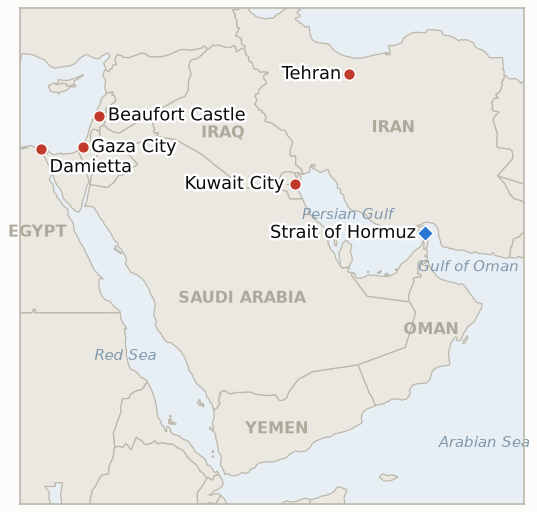

# Middle East Daily Briefing

**August 2, 2026**

- **Reporting window:** ~24 hours, August 1, 09:00 to August 2, 09:00 KST
- **Overall assessment:** The window's defining fact is a threat, not yet a strike: US and Israeli officials told multiple outlets they are weighing what could be the harshest bombing campaign of the war so far, against Iranian power plants, refineries and the buried Pickaxe Mountain nuclear site, possibly launching "as soon as this weekend" and running up to two weeks, but Trump had given no final order through the window's close. That gap between threat and execution formally falsifies IND-20260731-1 (a further direct strike on Iranian soil within three nights of July 30's heavy wave never came) even as it opens a larger, more consequential test of the same question. Everything else moved in its shadow: Iran struck Kuwait's Bubiyan Island a second time and two tankers were hit or nearly hit off Oman without a clean Iranian claim, Israel kept bombing Gaza and killed at least four people the same day Hamas confirmed its Board of Peace disarmament pledge, with an anonymous Israeli official ruling out any withdrawal before "genuine disarmament" and Ben-Gvir calling the whole deal "unacceptable," and anonymous Iranian officials told the New York Times the Damietta drone strike was meant as a demonstration of Iran's reach, edging attribution toward Tehran without Iran claiming it. Korean and oil markets were shut for the weekend, so none of this has been priced yet; Monday's KST open is where the next 24 hours of research, and this window's held-open indicators, will actually resolve.

---

## 1. What Happened

<figure style="float:right; width:46%; margin:2pt 0 8pt 14pt;">

<figcaption style="font-size:8pt; color:#666; text-align:center; margin-top:3pt; font-style:italic;">Major places of discussion</figcaption>
</figure>

### 1.1 The US and Israel Weigh a Broader Campaign Against Iran's Energy and Nuclear Infrastructure

Multiple outlets reported that the US and Israel are planning what could be one of the harshest bombing campaigns of the war to date, targeting Iranian power plants, refineries and petrochemical facilities, with some officials discussing cutting electricity across Tehran, and that preparations to strike the buried Pickaxe Mountain nuclear site south of Tehran have separately "picked up momentum" in recent days ([CBS News](https://www.cbsnews.com/news/us-israel-iran-war-energy-related-targets-trump/); [Times of Israel](https://www.timesofisrael.com/liveblog-august-01-2026/); [ABC News](https://abcnews.com/International/live-updates/iran-live-updates-tehran-progress-made-strait-hormuz/?id=135110405)). Trump said Friday at Camp David the US would hit Iran "very hard" until "they just can't take it anymore," and later added "we're not stopping, either," but officials cautioned no final order had been given and plans could still change; one line of discussion favored concluding strikes before Monday's market open given the economic stakes. Pentagon spokesman Sean Parnell said the department is "locked and loaded, ready to execute the President's directives," while Iran's wartime military command chief, Major General Ali Abdollahi, warned that "the United States is moving at an accelerating pace to fan the flames of a full-scale regional war" and cautioned other Muslim nations they would "burn in the fire of war" if they served as a shield for Washington. The State Department issued security alerts for Americans in ten regional countries (Bahrain, Israel, Iraq, Jordan, Kuwait, Lebanon, Oman, Qatar, Saudi Arabia, UAE) warning of flight cancellations and airspace closures. No strike on Iranian territory was confirmed at any point in the window, formally falsifying IND-20260731-1's narrower test (§3.3); the larger threat is tracked forward as IND-20260802-1. **Confidence: High** on the threat, the lack of a confirmed strike, and the quoted statements (multiple Tier 1 outlets, on-record officials); **Low** on whether or when the campaign actually launches.

### 1.2 Iran Strikes Kuwait's Bubiyan Island Again as Two Tankers Are Hit or Nearly Hit Off Oman

Kuwait's Ministry of Defense said Iranian drones breached its airspace at dawn Saturday and struck a government facility and civilian vehicles on Bubiyan Island in the north, with air defenses intercepting the bulk of the wave and no casualties reported; Kuwait's Foreign Ministry called it "a blatant violation of Kuwait's sovereignty," citing UN Security Council Resolution 2817 and international law ([Gulf News](https://gulfnews.com/world/gulf/kuwait/kuwait-says-iranian-attack-hit-government-site-vehicles-damaged-1.500627513); [TASS](https://tass.com/world/2167955)). Separately, UKMTO reported two maritime incidents off Oman's Musandam Peninsula: a tanker struck by an unknown projectile 11 nautical miles northeast of Lima, damaging its engine room and leaving it not under command, and a second vessel that saw "a large splash and an explosion" in close proximity 21 nautical miles northeast of Khasab, with no confirmed damage; neither incident carried an explicit Iranian claim, unlike the July 31 tanker strikes the IRGC claimed directly under active US escort ([Middle East Eye](https://www.middleeasteye.net/live-blog/live-blog-update/ukmto-says-explosion-near-tanker-oman-reported); [Arab News](https://www.arabnews.com/node/2652982/middle-east)). CENTCOM reiterated Friday evening that the Strait of Hormuz remains "totally open" to commercial shipping. Kpler's most recent clean daily print, for the 24 hours to 21:00 UTC July 31, counted just 5 vessels transiting Hormuz (4 outbound, 1 inbound), down sharply from the 28 to 29 July rebound of 12 and 14 (§3.1, IND-20260725-3). **Confidence: High** on the Kuwait strike and Kpler's transit count (official Kuwaiti and Kpler sources); **Medium** on the Oman tanker incidents' cause and attribution (UKMTO reporting, no claim of responsibility from any party).

### 1.3 Israel Keeps Striking Gaza Despite Hamas's Disarmament Pledge as Netanyahu Stays Silent

Israeli forces carried out heavy strikes across central and northern Gaza Friday night and Saturday, killing at least four people and wounding dozens according to local health officials, with the IDF saying it dismantled five Hamas storage facilities, the same window in which the Board of Peace said Hamas would begin disarming "in coming days" ([Fortune](https://fortune.com/2026/08/01/trump-iran-war-kuwait-hormuz-attacks-israel-gaza-hamas/); [PBS NewsHour](https://www.pbs.org/newshour/world/trump-threatens-more-strikes-on-iran-tensions-from-hormuz-to-kuwait-and-gaza-lead-to-more-warnings)). Israel's government has not formally endorsed the July 31 disarmament framework; one unnamed official said there would be "no withdrawal from Israel's current positions within Gaza" before "genuine disarmament of Hamas," while Prime Minister Netanyahu has stayed publicly silent, caught between Trump's public claim that Israel is "very happy" with the deal and a coalition where National Security Minister Itamar Ben-Gvir called the agreement "unacceptable" and centrist rival Gadi Eisenkot separately called anything short of Hamas's destruction a "total failure" ([Al Jazeera](https://www.aljazeera.com/news/2026/8/1/is-israel-really-ready-to-withdraw-from-gaza); [Times of Israel](https://www.timesofisrael.com/liveblog_entry/ben-gvir-says-hamas-disarmament-deal-unacceptable/)). Analysts cited by Al Jazeera expect Netanyahu, facing October elections and pending corruption charges, to stage symbolic repositioning for Trump's benefit rather than a genuine withdrawal (§2.3, IND-20260801-2). **Confidence: High** on the strikes, casualty figures and quoted officials (multi-outlet, Israeli and Palestinian health-ministry sourcing); **Low** on whether the framework converts into an actual Israeli withdrawal.

### 1.4 Iranian Officials Tell the New York Times the Damietta Strike Was a Demonstration

Two unnamed Iranian officials told the New York Times that the drone strike which set fire to two vessels, including the US-owned floating LNG unit Energos Winter, at Egypt's Damietta port on July 29 was intended "to demonstrate that if Iran chooses to escalate the situation, global energy supplies and shipping could be hit much harder," without saying whether Iran itself or a regional proxy carried it out ([Times of Israel](https://www.timesofisrael.com/liveblog_entry/iranian-sources-tell-nyt-that-egypt-drone-strike-was-designed-to-showcase-tehrans-capabilities/); [Ynetnews](https://www.ynetnews.com/article/rkk85pdsml)). This is the first attribution-adjacent statement from any Iranian source on an attack Tehran has not publicly claimed, in contrast to its practice of claiming nearly every other strike this war within hours; it stops short of the official determination IND-20260801-3 requires, but shifts the weight of evidence toward Tehran or an Iran-linked proxy rather than a genuinely open question. Egypt's own investigation, based on recovered drone debris, continued without a public attribution in the window (§2.4). **Confidence: Medium** on the anonymous Iranian officials' account and its framing (New York Times, single-sourced but corroborated across multiple outlets citing the same report); **Low** on formal attribution, which remains unresolved.

### 1.5 Lebanon's Front Stays Active as Israel Demolishes Beaufort Castle's Tunnels

Israeli forces destroyed underground tunnel networks beneath Beaufort Castle, a UNESCO-designated site in southern Lebanon, in the window, and one Israeli army officer was moderately wounded in a separate encounter with Hezbollah; Israeli military deaths in Lebanon since the front reignited now stand at 38 ([PBS NewsHour](https://www.pbs.org/newshour/world/trump-threatens-more-strikes-on-iran-tensions-from-hormuz-to-kuwait-and-gaza-lead-to-more-warnings)). No second verified Israeli withdrawal and Lebanese Armed Forces deployment beyond the first pilot zone at Zawtar al-Gharbiyeh was reported in the window, leaving IND-20260723-2 open with its ~August 6 deadline four days out and today's active combat, rather than a phased handover, the more visible trend (§2.5). **Confidence: High** on the tunnel demolition, the wounded officer and the cumulative death toll (Israeli military sourcing, multi-outlet); **Medium** on how this affects the pilot-zone framework's near-term prospects, which the reporting does not address directly.

---

## 2. Deep Dive: Incentives and Motives

### 2.1 Why would Washington escalate to energy and nuclear infrastructure now, after weeks of treating Kharg Island and Pickaxe Mountain as rhetorical leverage rather than live targets?

Because every softer instrument has been tried and failed to stop Iran's retaliation: tolls, frozen-asset compensation threats, a heavy conventional wave against IRGC targets on July 30, and a brief pause for diplomacy all preceded a weekend in which Iran struck Kuwait a second time and two more tankers were hit or nearly hit off Oman. Energy and nuclear infrastructure are the targets the campaign has deliberately spared for five months precisely because striking them removes the option of de-escalation, so floating the threat now, loudly and through multiple leaked channels, functions as a final ultimatum before an irreversible step, consistent with the reported internal debate about concluding strikes before markets open Monday to control the economic fallout.

### 2.2 Why would Iran keep striking Kuwait and Hormuz shipping while its own commanders warn against a full regional war?

Because Tehran's calculus has not changed since late July: Gulf host states and Hormuz shipping remain the only targets Iran can reach that impose a real cost on the US-led coalition without a symmetrical exchange it cannot sustain, and warning against "the flames of war" is itself a form of pressure aimed at the audience that matters most, the Gulf states and Muslim-majority governments Iran wants to dissuade from hosting or enabling US strikes, not a signal that Iran intends to de-escalate its own actions in the interim.

### 2.3 Why would Israel keep striking Gaza the same day Hamas confirmed a disarmament pledge Washington is publicly celebrating?

Because Netanyahu's government has strong incentive to keep applying military pressure precisely while the framework's implementation terms are still being negotiated, both to shape those terms from a position of continued strength and to manage a coalition where Ben-Gvir's opposition is not symbolic but a real threat to the government's survival ahead of October elections. Continuing strikes lets Netanyahu tell his right flank nothing has actually changed on the ground while telling Washington the framework is still alive, a position that is only sustainable as long as Israel avoids the public statement IND-20260801-2 is watching for.

### 2.4 Why would Iranian officials quietly tell the New York Times about Damietta while Tehran keeps denying it in public?

Because an anonymous, deniable acknowledgment lets Iran extract the deterrent value of the demonstration, showing Gulf and Western audiences that Iran can reach a US-linked LNG asset on Egyptian soil, without accepting the diplomatic and legal cost of an open claim, particularly against Egypt, a state Iran has taken pains to call "an important friend" throughout the war. The gap between the private and public messaging is itself informative about how carefully Tehran is managing the fifth country now touched by this conflict.

### 2.5 Why does south Lebanon's front stay active while the pilot-zone framework is supposed to be de-escalating?

Because the pilot-zone framework only covers the specific villages named in the trilateral agreement, and the areas outside that narrow list, including sites like Beaufort Castle that carry both military and symbolic value, remain live battlespace where Israel continues operations against Hezbollah's residual infrastructure. The two tracks, phased withdrawal in named zones and continued combat elsewhere in the buffer area, are not in tension from Israel's perspective; they reflect a policy of ceding ground only where a US-brokered mechanism requires it while denying Hezbollah any residual capability everywhere else.

---

## 3. Policy Implications for South Korea

### 3.1 Exposure snapshot

| Item | Current reading | Source |
| --- | --- | --- |
| July-August crude procurement | 110%+ of prior-year volume secured (MOTIE, July 21) | MOTIE via Herald Business, Youth Daily; `korea-exposure.md` |
| September crude procurement | 90%+ secured (MOTIE, July 21) | MOTIE via Herald Business; `korea-exposure.md` |
| Strategic reserve coverage | ~26 days of actual consumption (estimate); swap on immediate standby, untested at scale | CSIS; MOTIE July 27 |
| Korean nationals/vessels in Gulf | ~43 (13 aboard Korean vessels, 30 aboard foreign vessels) as of late June; MOFA reviewed safety with 17 missions | MOFA; Korea Herald |
| Brent / WTI / KOSPI / USD-KRW | Markets closed for the weekend; last settles July 31 (Brent 90.12, WTI 84.67, KOSPI 6,595.45, ₩1,424.0) | CNBC; KED Global; Money Today |
| Hormuz transits | 5 confirmed crossings, 24 hours to 21:00 UTC July 31 (Kpler), down from 12 to 14 on July 28 to 29 | Kpler |
| Qatari LNG (Ras Laffan) | No further laden departure since the Al Areesh (July 30); a second vessel reported in the strait (Mraweh) is an ADNOC/UAE ballast carrier, not a further Qatari loading | Riviera; The National |

### 3.2 Implications by development

**The threatened campaign against Iran's energy and nuclear infrastructure is the single most important input to Korea's H2 planning right now, and it has not yet happened.** MOTIE and KNOC should treat the next several days, not the weekend just past, as the actual decision window: a real strike on Iranian power, refining or nuclear infrastructure would be a materially different and more prolonged campaign than anything absorbed so far, and Korea's worst-case import-bill and reserve-release modeling in `korea-exposure.md` should be checked against this scenario specifically rather than the calmer weekend price action, since markets have had no chance yet to price a threat this large.

**Iran's continuing willingness to strike Kuwait and Hormuz shipping even while warning against a wider war is a reminder that the "protest and repair" equilibrium Gulf states have held since late July is a ceiling on their own response, not a ceiling on Iran's actions.** Korean firms and personnel in Kuwait and across the GCC (§3.1) should not read Kuwait's restrained diplomatic response as evidence the risk to Korean nationals and assets is declining; if anything, a second direct hit on Kuwaiti soil within days argues for reviewing MOFA's Gulf safety posture ahead of, not after, any further escalation.

**Israel continuing to strike Gaza on the same day Hamas confirmed disarmament is the clearest evidence yet that the Board of Peace framework's announcement and its implementation are two separate processes running on different timelines, a pattern Seoul's own Middle East desk should apply directly to how it reads future announcements out of this framework.** The practical lesson for Korean diplomatic and commercial planning tied to any post-war Gaza reconstruction financing is to treat announced frameworks as options, not commitments, until IND-20260801-2's specific bar, a public Israeli acceptance or implementation step, is actually met.

**Testable indicators:**

- **IND-20260802-1** — The threatened US and Israeli campaign against Iranian energy and nuclear infrastructure launches or stays a threat. A verified US or Israeli strike on an Iranian power plant, refinery, petrochemical facility, or nuclear site (Pickaxe Mountain or a comparable Natanz-adjacent facility) by ~2026-08-05 confirms Washington has crossed from threatened leverage into the long-telegraphed infrastructure campaign, a materially larger and more consequential war phase for oil markets and Korea's import bill than anything absorbed to date; no such strike through ~2026-08-05 falsifies it as another deferred threat, consistent with the campaign's repeated pattern of paused or walked-back escalation since late July.
- **IND-20260802-2** — Kuwait's second direct hit in a week draws an escalation beyond its established protest-and-repair posture, or the pattern holds a third time. Any Kuwaiti or GCC action beyond formal protest, severed ties, a joint-defense invocation, or a basing change, by ~2026-08-15, would mark the first Gulf state crossing from absorbing repeated strikes to responding in kind; continued protest without escalation through ~2026-08-15 keeps Kuwait's posture the load-bearing precedent for how Gulf states manage direct Iranian attacks on their soil (parallel test to IND-20260722-2, confirmed on the Saudi branch 2026-07-25).

**Resolutions this run:**

- **IND-20260731-1 — Falsified.** Opened to test whether the July 30 heavy wave of direct US strikes on Iranian territory would open a sustained campaign or stay a single retaliatory night, with a deadline of three nights later, ~August 2. No further verified US strike on Iranian soil occurred in any of the three intervening nights (July 31, August 1, or in this window through August 2), even as reporting through the window's close described a far larger prospective campaign against energy and nuclear infrastructure still awaiting Trump's final order. The July 30 wave stands as this indicator specified: a single calibrated response rather than an immediately reopened direct-strike front. The larger, still-threatened campaign is tracked forward as IND-20260802-1 (§1.1).

---

## 4. Watch List

- **Whether the threatened US and Israeli campaign against Iranian energy and nuclear infrastructure actually launches** (IND-20260802-1), the single largest near-term risk to oil markets and Korea's import bill.
- **Whether Kuwait's second direct hit in a week changes its protest-and-repair posture** (IND-20260802-2, parallel to IND-20260722-2).
- **Whether the Board of Peace Gaza framework gets a public Israeli answer**, with Ben-Gvir's rejection and continued Gaza strikes weighing against it (IND-20260801-2).
- **Whether the Damietta attack is ever formally attributed**, now that anonymous Iranian officials have privately linked it to a demonstration of reach without an official claim (IND-20260801-3).
- **Whether Egypt, Israel, Iran, or the Houthis shift from their current denials** as investigators continue examining the recovered drone wreckage.
- **Whether the Lebanon pilot-zone framework scales to a second withdrawal** before its ~August 6 deadline, against a backdrop of continued combat near Beaufort Castle (IND-20260723-2).
- **Whether Qatar's Ras Laffan LNG freeze produces further laden departures** beyond the single Al Areesh transit (IND-20260731-2, deadline August 6).
- **Aramco and the Saudi government's continued silence on Abqaiq's operational status**, with its own deadline now three days out (IND-20260729-1, deadline August 5).
- **Whether Korea's markets, closed for the weekend, resume the chip-cycle read or reprice the war** when they reopen Monday KST (IND-20260729-3, deadline August 3).
- **Whether Brent's next settle holds the $88 to $92 band or breaks it** in either direction once trading resumes (IND-20260730-1, deadline August 5).

---

## 5. Source Quality Summary

| Claim | Sources | Confidence |
| --- | --- | --- |
| US and Israel weigh a broad campaign against Iranian energy infrastructure and the Pickaxe Mountain nuclear site; no final order given | CBS News, Times of Israel, ABC News (Tier 1-2, multiple on-record and anonymous US officials) | High on the threat and lack of a confirmed strike; Low on timing |
| Trump: "we're not stopping, either"; Pentagon "locked and loaded"; Iran's Abdollahi warns of a "full-scale regional war" | ABC News, CBS News (Tier 1, direct quotation) | High |
| Iranian drones strike Kuwait's Bubiyan Island a second time; Kuwait cites UNSC Resolution 2817 | Gulf News, TASS (Tier 1-2, official Kuwaiti government sources) | High |
| Two tanker incidents off Oman (Lima, Khasab); no attribution given | Middle East Eye, Arab News (Tier 1-2, UKMTO official reporting) | High on the incidents; Medium on cause |
| CENTCOM: Strait of Hormuz "totally open" to commercial shipping | Multiple outlets citing CENTCOM statement | High |
| Kpler: 5 vessels transited Hormuz in the 24 hours to 21:00 UTC July 31 | Kpler (official data/blog) | High |
| Israeli strikes kill at least 4 in Gaza, wound dozens, despite Hamas's disarmament pledge; Ben-Gvir calls the deal "unacceptable"; unnamed official rules out withdrawal before "genuine disarmament" | Fortune, PBS NewsHour, Al Jazeera, Times of Israel (Tier 1-2, multi-outlet, Israeli and Palestinian health-ministry sourcing) | High on the strikes and quotes; Low on the framework's ultimate implementation |
| Anonymous Iranian officials tell the New York Times the Damietta drone strike was a demonstration of Iran's reach | Times of Israel, Ynetnews, citing the New York Times (Tier 1 original source, anonymously sourced) | Medium |
| Israel destroys tunnels beneath Beaufort Castle; one officer wounded; 38 Israeli soldiers dead in Lebanon since the front reignited | PBS NewsHour (Tier 1, Israeli military sourcing) | High |
