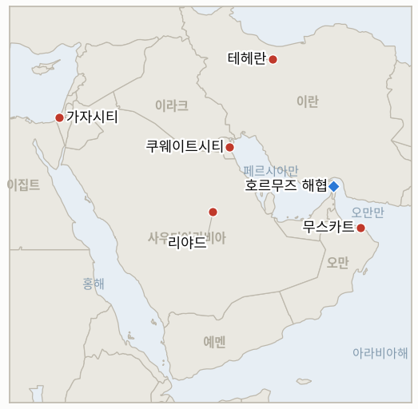

# 중동 일일 브리핑

**2026년 8월 3일**

- **보고 기간:** 약 24시간, 8월 2일 09:00 ~ 8월 3일 09:00 (한국시간)
- **종합 평가:** 이번 보고 기간의 핵심 사실은 확인된 사건이 아니라 하나의 주장이다. 트럼프 대통령은 트루스 소셜을 통해 이란과 여타 중동 국가들이 "공격을 보류해달라"고 요청했고 "합의의 큰 틀이 마련됐다"며, 호르무즈 해협의 전면 재개방과 이란 핵 프로그램 종료를 골자로 한 합의에 따라 이란 에너지·핵시설에 대한 미국·이스라엘의 계획된 공습을 취소한다고 발표했다. 이스라엘도 이 합의에 동참한 것으로 알려졌다. 그러나 이란 반관영 매체들은 즉각적이고 구체적으로 이를 부인했다. 이란 관영에 가까운 메흐르 통신은 이 주장을 "새빨간 거짓말"이라 칭하며 "페르시아만 통치자들을 협박"하려는 의도라고 반박했고, 파르스 통신은 호르무즈 해협의 통항로를 이란과 오만이 나눠 관리한다는 이스라엘 매체 보도 역시 별도로 부인했다. 다만 이란 외무장관 압바스 아라그치는 이란과 오만 간 호르무즈 관리 협상이 "마무리 단계"에 있다고 확인했는데, 이는 트럼프가 언급한 다른 모든 내용에 대한 이란의 부인과 어색하게 병존하는, 검증 가능한 별개의 외교적 사실이다. 이스라엘 국방 당국자들은 채널12에 트럼프의 SNS 게시물을 통해서야 이번 취소 결정을 알게 됐다며 "안갯속에 남겨졌다"고 말했다. 이 같은 외교전은 다른 전선의 긴장을 전혀 누그러뜨리지 못했다. 이스라엘의 공습으로 가자지구에서 수 주 만에 최다인 16~18명이 사망했으며, 엘리 코헨 에너지장관은 공격 중단 합의를 부인하고 가자지구 전면 장악 가능성을 시사했다. 쿠웨이트 외교부는 두 번째 직접 피격을 당한 뒤 이번 전쟁 들어 처음으로 유엔헌장 제51조를 원용했으나, 항의 수준을 넘어서는 대응은 여전히 없었다. 한국과 국제 유가 시장은 이번 보고 기간 내내 휴장이었으며, 월요일 서울 증시는 이번 보고 기간이 끝나는 시점에 개장해 이 모든 소식이 실제로 반영될지 가늠할 실질적 시험대가 될 전망이다.

---

## 1. 무슨 일이 있었나

<figure style="float:right; width:46%; margin:2pt 0 8pt 14pt;">

<figcaption style="font-size:8pt; color:#666; text-align:center; margin-top:3pt; font-style:italic;">주요 논의 지점</figcaption>
</figure>

### 1.1 트럼프, 합의의 큰 틀을 이유로 이란 공격 취소, 이스라엘은 "안갯속에 남겨졌다", 테헤란은 거짓말이라 반박

트럼프 대통령은 토요일 밤 트루스 소셜을 통해, 미국과 이스라엘이 준비해온 이란 에너지·핵시설에 대한 대규모 공습을 취소한다고 밝혔다. 이란과 "여타 중동 국가들"이 "공격을 보류해달라"고 요청했으며 "합의의 큰 틀이 마련됐다"는 이유에서였다. 그는 "호르무즈 해협의 즉각적이고 완전하며 전면적인 개방"과 이란 핵 프로그램 종료를 구체적으로 언급했고, 이스라엘도 이 합의에 동참했다고 전했다([Bloomberg](https://www.bloomberg.com/news/articles/2026-08-02/trump-holds-off-iran-strikes-on-pledge-a-hormuz-deal-is-close); [NPR](https://www.npr.org/2026/08/02/nx-s1-5917113/trump-says-hes-cancelling-iran-strikes-deal-pending); [Benzinga](https://www.benzinga.com/news/politics/26/08/60861664/trump-cancels-iran-strikes-rapid-deal-hormuz)). 이란 반관영 메흐르 통신은 익명의 군 관계자를 인용해 이 주장이 "페르시아만 통치자들을 협박"하려는 "새빨간 거짓말"에 불과하다며, 이란군은 "최고 수준의 대비태세"를 유지하고 있고 "충돌이 불가피해진다면 전장이 결정적일 것"이라고 경고했다. 파르스 통신은 별도로, 호르무즈 해협 진입로는 이란이, 출구는 오만이 각각 통제하는 방식으로 통항을 분할한다는 이스라엘 채널12 보도를 부인했으며, 협상팀 관계자는 파르스 통신에 "미국이 적대 행위를 지속하는 한 호르무즈 해협은 계속 폐쇄될 것"이라고 밝혔다([Times of Israel](https://www.timesofisrael.com/iran-denies-it-asked-trump-not-to-strike-or-agreed-to-deal-to-split-control-of-hormuz/)). 다만 이란 외무장관 압바스 아라그치는 별도로, 기존 보도와 일치하게, 이란과 오만 간 향후 호르무즈 관리 협상이 "마무리 단계"에 있다고 확인했다(§1.2). 이스라엘 국방 당국자들은 채널12에 공식 경로를 통해 통보받지 못했으며 트럼프의 게시물을 통해서야 취소 사실을 알게 됐다고 밝혔다. 한 관계자는 "트럼프 대통령은 우리를 안갯속에 남겨뒀다", "버림받았다는 느낌이었다"고 말했다. 이스라엘 에너지장관 엘리 코헨은 별도로 "이란이 핵 프로그램을 재개하거나 탄도미사일 산업을 발전시키려 한다면 우리가 그곳에 있을 것이다. 우리는 행동에 나설 것이고, 타격할 것"이라고 경고했다. 사우디 왕세자 무함마드 빈 살만은 8월 2일 트럼프와 통화해 추가 공습을 자제하라고 촉구한 것으로 액시오스와 사우디 관영 매체가 전했으며, 이는 트럼프가 공습 보류의 배경으로 꼽은 경로 중 하나다. 이는 IND-20260731-1(2026년 8월 2일 반증)의 후속 시험이며 8월 5일이 시한인 IND-20260802-1, IND-20260801-1과 직접 관련된다(§3). **신뢰도: 높음** — 트럼프의 발표, 이란의 구체적이고 공식적인 부인, MBS 통화(모두 1등급 다수 매체 및 반관영 소식통 확인) 부분. **신뢰도: 낮음** — 트럼프가 설명한 형태의 실제 합의가 존재하는지 여부. 가장 핵심적인 두 주장, 즉 이란이 보류를 요청했다는 것과 호르무즈 통제 분할에 동의했다는 것 모두를 이란이 명시적으로 부인했기 때문이다.

### 1.2 이란과 오만, 호르무즈 관리 협상 마무리 단계라 발표, 통항 데이터는 부분적이고 불확실한 반등 시사

트럼프가 주장한 합의와는 별개로, 아라그치 장관은 내각에 테헤란과 무스카트 간 호르무즈 해협 미래 관리 협상이 "마무리 단계"에 있으며 "곧 타결될 것"이라고 보고했다. 구체적 조건은 밝히지 않았다([Al Jazeera](https://www.aljazeera.com/amp/news/2026/8/2/iran-says-negotiations-with-oman-over-strait-of-hormuz-in-final-stages); [Middle East Monitor](https://www.middleeastmonitor.com/20260802-iran-says-talks-with-oman-on-strait-of-hormuz-nearing-completion/)). 한편 Kpler 데이터를 인용한 보도는 월요일부터 금요일까지 한 주간의 호르무즈 상업선박 통항 척수를 각각 7척, 11척, 15척, 4척, 9~10척으로 집계했으며, 가장 최근 수치에서는 선박 두 척이 탐지를 피하려 선박자동식별장치(AIS)를 껐다고 전했다([The National](https://www.thenationalnews.com/business/energy/2026/08/01/how-many-ships-are-transiting-through-hormuz-and-bab-al-mandeb/)). 이는 `data/observations.csv`에 이미 기록된 같은 기간(7월 31일 UTC 21:00까지 24시간)의 5척이라는 명확한 Kpler 수치와 상충하는데, 이는 통항량이 실제로 배가됐다기보다는 이 원장이 이전에도 지적한 집계 기준 불일치(상업 유조선만 집계할지 전체 선박을 집계할지, 집계 시간대가 다른지 등) 문제로 보인다. 어떤 기준으로도 통항량이 0인 날은 없었다(§3, IND-20260725-3). **신뢰도: 중간** — 이란-오만 협상이 실제로 상당히 진전됐다는 점(1등급 소식통이나 구체적 조건은 미공개). **신뢰도: 낮음** — 최근 며칠간의 정확한 통항 척수, 집계 기준이 상충하기 때문.

### 1.3 가자지구 수 주 만의 최다 사망자, 이스라엘 에너지장관은 합의를 부인하고 전면 장악 가능성 시사

일요일 이스라엘의 공습으로 가자시티, 데이르알발라, 칸유니스 전역에서 최소 16~18명의 팔레스타인인이 사망했다. 수 주 만의 최다 일일 사망자 수로, 가자지구 민방위대는 "오전부터 10회 이상의 공습을 감행했다"고 밝혔다([Al-Monitor](https://www.al-monitor.com/originals/2026/08/israeli-strikes-kill-18-gaza-minister-says-no-deal-halt-attacks); [The National](https://www.thenationalnews.com/news/mena/2026/08/02/gaza-death-toll-mounts-as-israel-continues-strikes-despite-peace-plan-breakthrough/)). 엘리 코헨 에너지장관은 "가자지구 공격을 중단하기로 한 합의는 없다"며 "하마스는 반드시 해체돼야 하며, 이것이 가장 먼저 이뤄져야 할 일"이라고 말했고, 이스라엘이 이미 가자지구의 70%를 통제하고 있는 만큼 하마스가 무장해제를 거부한다면 "가자지구를 완전히 장악할 필요가 있다"고 밝혔다. 이타마르 벤그비르 국가안보장관은 재차 평화이사회 프레임워크를 "받아들일 수 없다"고 말하며 표적 작전 지속을 촉구했다. 니콜라이 믈라데노프 평화이사회 특사는 이번 공습이 이행 노력을 저해한다는 점을 인정하며 "긴장을 완화하고 대통령 계획의 전면 이행을 위한 공간을 마련"하려 노력 중이라고 말했다. 하마스 관계자 바셈 나임은 이스라엘이 "무력으로 현장의 기정사실을 강요"하려 한다고 비난했으며, 하마스는 7월 31일 프레임워크 이후 견지해온 입장대로 이스라엘의 작전 중단과 철군을 무기 인도의 선결 조건으로 재확인했다(§3, IND-20260801-2). **신뢰도: 높음** — 공습, 사망자 범위, 인용된 발언(팔레스타인 보건·민방위 당국 및 이스라엘 정부 소식통 다수 매체 확인) 부분. **신뢰도: 낮음** — 프레임워크의 단기 존속 여부.

### 1.4 쿠웨이트, 두 번째 직접 피격 후 유엔헌장 제51조 자위권 원용, 대응 수위는 여전히 항의에 그쳐

쿠웨이트 외교부는 토요일 부비얀 섬의 정부 시설과 민간 차량을 겨냥한 드론 공습(§1.2, 2026년 8월 2일 브리핑) 이후 "지속되는 이란의 침략 행위"를 규탄하는 공식 성명을 발표했다. 이번 공격을 "쿠웨이트 주권에 대한 명백한 침해"이자 유엔헌장과 안전보장이사회 결의 2817호 위반으로 규정했으며, 이번 전쟁 들어 처음으로 쿠웨이트가 "주권과 국가안보, 국민을 보호하기 위해 필요한 모든 조치를 취할 것"이라며 유엔헌장 제51조에 따른 "양도할 수 없는 정당한 자위권"을 명시적으로 원용했다([Iran International](https://www.iranintl.com/en/202607315431); [Sunday Guardian Live](https://sundayguardianlive.com/world/us-israel-iran-war-latest-news-kuwaits-foreign-ministry-condemned-irans-continued-aggression-reserves-right-to-take-all-measures-to-protect-security-after-drone-attack-251124/)). 제51조 공식 원용은 쿠웨이트가 이번 전쟁에서 사용한 가장 강경한 법적 언어이지만, 이번 보고 기간 중 외교적 항의와 기존 방공 태세를 넘어서는 조치는 뒤따르지 않았고, 이에 따라 IND-20260802-2는 계속 열려 있다(§3). **신뢰도: 높음** — 성명 내용과 출처(쿠웨이트 정부 공식 문서, 다수 매체 확인) 부분. **신뢰도: 낮음** — 제51조 언급이 실제 태세 변화의 신호인지 여부.

---

## 2. 심층 분석: 유인과 동기

### 2.1 왜 트럼프는 "만반의 준비를 갖췄다"는 태도에서 약 24시간 만에 작전 취소로 돌아섰나?

월요일 시장 개장 전 공습을 마무리할지 말지를 두고 벌어진 내부 논쟁은 이번 전쟁 최대 규모의 에너지 기반시설 공습이 초래할 경제적 비용과 늘 저울질돼왔는데(§1.1, 2026년 8월 2일 브리핑), 사우디 왕세자가 트럼프에게 직접 자제를 요청한 것이 오만의 독자적 호르무즈 협상 채널이 자체적으로 "마무리 단계"에 이른 상황과 겹치면서, 트럼프에게 시장 충격과 핵·전력 시설을 겨냥한 일단 시작하면 되돌리기 어려운 작전의 위험 모두를 피하면서도 합의의 공을 주장할 수 있는 명분 있는 출구를 제공했다. 이는 외교적 채널이 출구를 제시할 때마다 최대치의 위협 뒤 철회 또는 유보된 확전이 반복되는 이번 전쟁의 패턴과 일치한다.

### 2.2 왜 이란은 보류 요청 사실과 호르무즈 분할 합의를 부인하면서도 오만과의 협상은 사실로 확인했나?

이란이 보류를 요청했거나 미국이 중개한 합의를 통해 호르무즈에 대한 통제권을 어떤 형태로든 넘겨줬다고 인정하는 것은 국내적으로나 지역적으로 폭격 위협 앞에 굴복한 것으로 읽힐 수 있으며, 이는 메흐르 통신이 언급한 바로 그 "협박" 프레임과 정확히 일치한다. 반면 오만과의 별도 양자 기술 협상을 확인하는 것은 테헤란에 아무런 손해가 없으며, 미국이 강요한 타결이 아니라 연안 두 국가 간의 주권적 외교로 포장할 수 있다. 이란이 확인하는 것(오만과의 협상)과 부인하는 것(트럼프에게 무언가를 요청했다는 것, 호르무즈 통제가 분할되고 있다는 것) 사이의 간극 자체가 시사하는 바가 크다. 테헤란은 압박에 굴복했다는 서사를 넘겨주지 않으면서 호르무즈 문제에서만은 실질적인 출구를 원하고 있다.

### 2.3 워싱턴이 두 개의 별도 돌파구를 공개적으로 자축하는 바로 그 주말에 이스라엘은 왜 가자지구에서 공세를 강화했나?

엘리 코헨과 벤그비르의 발언은 평화이사회 프레임워크의 전제 자체를 아직 수용하지 않은 연립정부의 시각을 반영한다. 무장해제 로드맵이 이행되지 않는 하루하루는 이스라엘 우파가 협상이 아닌 무력으로 전쟁을 끝내야 한다고 주장할 근거가 되는 하루다. 워싱턴이 프레임워크를 자축하는 동안 공습을 강화하는 것은 네타냐후 연립정부 내 강경파가 워싱턴에서 어떤 발표가 나오든 현장의 전쟁은 계속된다는 것을 보여줄 수 있게 하며, 이는 IND-20260801-2가 이미 추적해온 것과 같은 역학이다.

### 2.4 쿠웨이트는 왜 실제 대응 수위는 높이지 않으면서 법적 언어만 강경하게 높였나?

제51조 원용은 향후 배상 청구나 연대 구축 노력에 활용할 수 있는 공식적인 국제법상 기록을 남기는 한편, 추가적인 이란의 보복을 촉발하거나 주요 표적이 되지 않으려는 미군 주둔국으로서의 입지를 복잡하게 만들 수 있는 어떠한 행동도 요구하지 않는다. 이는 임박한 확전의 신호라기보다는 선택지를 보존하는 헤지에 가까우며, 첫 부비얀 피격 이후 IND-20260802-2가 추적해온 패턴과 일치한다.

---

## 3. 한국에 대한 정책적 함의

### 3.1 익스포저 현황

| 항목 | 현재 수치 | 출처 |
| --- | --- | --- |
| 7~8월 원유 도입 | 전년 동기 대비 110% 이상 확보 (산업통상자원부, 7월 21일) | 산업통상자원부, 헤럴드경제·영유데일리 인용; `korea-exposure.md` |
| 9월 원유 도입 | 90% 이상 확보 (산업통상자원부, 7월 21일) | 산업통상자원부, 헤럴드경제 인용; `korea-exposure.md` |
| 전략비축유 보유 여력 | 실제 소비 기준 약 26일 (추정치); 스와프는 즉시 시행 대기 상태이나 대규모 실행은 미검증 | CSIS; 산업통상자원부 7월 27일 |
| 걸프 지역 한국 국민·선박 | 약 43명 (한국 선박 13명, 외국 선박 30명, 6월 말 기준); 외교부, 17개 재외공관과 안전 점검 실시 | 외교부; 코리아헤럴드 |
| 브렌트·WTI·코스피·원달러 | 이번 보고 기간(8월 2일 일요일) 정산 없음; 마지막 정산은 7월 31일(브렌트 90.12달러, WTI 84.67달러, 코스피 6,595.45, 원화 1,424.0원); 월요일 서울 증시는 이번 보고 기간 종료 시점에 개장 | CNBC; KED Global; 머니투데이 |
| 호르무즈 통항량 | 7월 31일 UTC 21:00까지 24시간 기준 확인된 통항 5척(Kpler 명확한 집계치); 같은 기간에 대한 상충하는 9~10척 수치는 미해소(§1.2) | Kpler; The National |
| 카타르 LNG (라스라판) | 알아리시호 출항(7월 30일) 이후 추가 만적 출항 없음; 터미널 인근에 12척 이상의 유휴 선박 잔존 | Riviera; The National |

### 3.2 사안별 함의

**트럼프가 주장하는 이란 에너지·핵시설 공습 취소가 실제로 지속된다면 이는 한국의 단기 유가·해운 전망에 가장 결정적인 변수가 되지만, 합의 자체가 존재한다는 이란의 명시적 부인이 있는 한 이를 안정적인 계획 전제로 삼을 수는 없다.** 산업통상자원부와 한국석유공사는 토요일 발표를 IND-20260802-1 개설 이후 이 브리핑이 추적해온 리스크가 해소된 것으로 읽어서는 안 된다. 주장 자체가 상충하는 성격(트럼프는 합의가 존재한다 하고 이란은 거짓말이라 한다)을 고려하면, 한국의 하반기 수입 비용 및 비축유 방출 모델링은 월요일 개장에서 시장이 반영할 수도 있는 낙관적 시나리오만이 아니라 8월 5일 시한까지 보류와 그 붕괴 두 시나리오 모두를 살아있는 가능성으로 유지해야 한다.

**무장해제 프레임워크가 발표됐음에도 가자지구 확전이 두 번째로 연속 발생한 것은 서울의 중동 담당 부서가 향후 모든 평화이사회 관련 발표를 다룰 때 경각심을 낮추기보다는 높여야 한다는 근거다.** 코헨 장관의 명확한 "공격 중단 합의 없음" 발언은 프레임워크 발표와 이스라엘의 실제 작전 태세가 분리돼 있다는 가장 명확한 공식 확인이다. 가자지구 전후 재건 자금 조달과 관련된 한국의 외교·상업적 계획은 IND-20260801-2 자체의 기준에 따라 이 프레임워크를 확정된 약속이 아닌 하나의 선택지로 계속 취급해야 한다.

**쿠웨이트의 공식적인 제51조 원용은 실제 행동이 뒤따르지 않더라도, 한국이 상업적·인적 노출을 가진 걸프 미군 주둔국에 대한 추가 직접 공격이 발생할 경우의 법적·평판적 위험 수위를 높인다.** 쿠웨이트나 다른 걸프 국가가 실제로 항의 수준을 넘어서는 대응에 나선다면, 그 전환은 바로 이런 국제법적 언어로 먼저 표현될 가능성이 높다. 외교부의 걸프 지역 안전 태세 점검은 제51조 원용을 일회성 발언이 아니라 주시할 가치가 있는 선행 지표로 다뤄야 한다.

**검증 가능한 지표:**

- **IND-20260803-1** — "마무리 단계"로 알려진 이란-오만 호르무즈 관리 협상이 공개 발표로 이어지는지, 아니면 그 단계에서 멈추는지. 2026년 8월 10일까지 이란-오만 간 호르무즈 통항 관리 메커니즘이 공개 발표되면 아라그치가 언급한 외교 채널이 실재하며 한국 해운업계와 한국석유공사가 대비할 구체적 틀이 마련됐음이 확인된다. 8월 10일까지 그런 발표가 없고 "마무리 단계"라는 표현이 낡은 것이 되면, 이는 발표됐지만 실현되지 않은 또 하나의 외교적 이정표였음을 반증하며, 이는 IND-20260728-3이 추적해온 더 넓은 패턴과 일치한다.
- **IND-20260803-2** — 트럼프가 주장한 합의의 큰 틀이 독자적으로 확증되는지, 아니면 미국만의 주장으로 남고 이란이 계속 부인하는지. 2026년 8월 9일까지 오만, 사우디아라비아, 또는 다른 지명된 중재자가 트럼프가 언급한 구체적 조건(이란 핵 프로그램과 연계된 호르무즈 재개방)을 확인하면 이는 일방적인 미국 측 주장을 넘어서는 것으로 인정된다. 8월 9일까지 워싱턴을 제외한 모든 당사자가 침묵하고 이란의 기존 부인이 유지되면, 이 주장은 계속 논란의 여지가 있고 검증되지 않은 상태로 남으며, 이것이 현재로서는 기본 가정이다.

**이번 보고에서 해소된 지표:** 없음. IND-20260729-3(한국 증시 급락이 반도체 사이클 때문인지 전쟁 채널 때문인지)은 오늘 자체 시한(~8월 3일)에 도달하지만, 서울 증시는 이번 보고 기간이 끝나는 정확히 그 시점(오전 9시)에 개장하여 아직 수치가 나오지 않았다. IND-20260725-2와 IND-20260730-2가 결정적 거래일이 보고 기간 바로 바깥에 있었을 때 처리된 방식과 마찬가지로, 해소는 내일 보고로 미룬다.

---

## 4. 관찰 목록

- **트럼프가 주장한 이란 합의가 유지될지, 붕괴할지, 계속 논란으로 남을지**, 이란의 부인이 단기적으로 가장 큰 불확실성의 원천 (IND-20260802-1, IND-20260801-1, IND-20260803-2, 시한 각각 8월 5일과 8월 9일).
- **이란-오만 호르무즈 관리 협상이 실제로 공개 틀로 이어질지** (IND-20260803-1, 시한 8월 10일).
- **이스라엘의 가자지구 확전이 평화이사회 프레임워크에 대한 이스라엘의 공식 입장 표명을 (어느 방향으로든) 강제할지** (IND-20260801-2, 시한 8월 15일).
- **쿠웨이트의 제51조 원용 뒤에 항의를 넘어서는 조치가 뒤따를지** (IND-20260802-2, 시한 8월 15일).
- **다미에타 공격의 책임 소재가 공식적으로 규명될지** (IND-20260801-3, 시한 8월 14일).
- **레바논 시범 구역 프레임워크가 두 번째 철수로 확대될지**, 약 8월 6일 시한을 앞두고 이스라엘-레바논 회담이 8월 4일 이탈리아에서 열릴 것으로 알려짐 (IND-20260723-2).
- **카타르 라스라판 LNG 동결이 알아리시호에 이어 추가 만적 출항으로 이어질지** (IND-20260731-2, 시한 8월 6일).
- **아람코와 사우디 정부가 아브카이크 가동 상태에 대해 계속 침묵할지**, 시한 8월 5일 (IND-20260729-1).
- **한국 증시가 이번 보고 기간의 소식을 처음으로 반영해 개장할 때 전쟁 채널을 반영할지 취소 주장을 반영할지**, 월요일 한국시간 장이 진행되면서 (IND-20260729-3, 내일 보고에서 해소).
- **브렌트유 차기 정산가가 88~92달러 구간을 유지할지 이탈할지**, 이 구간이 시험대에 오른 이후 처음으로 하락 촉매(취소 주장)가 등장한 가운데 (IND-20260730-1, 시한 8월 5일).

---

## 5. 출처 신뢰도 요약

| 주장 | 출처 | 신뢰도 |
| --- | --- | --- |
| 트럼프, 합의된 "합의의 큰 틀"(호르무즈 재개방, 핵 프로그램 종료)을 이유로 계획된 이란 공습 취소; 이스라엘도 이 합의에 동참 | Bloomberg, NPR, Benzinga (1~2등급, 트럼프 본인의 트루스 소셜 발표, 다수 매체) | 발표 자체는 높음; 합의 실체는 낮음 |
| 이란 메흐르·파르스 통신, 보류 요청 사실과 호르무즈 통제 분할 합의를 부인; "새빨간 거짓말"이라 규정 | Times of Israel, 메흐르·파르스 통신 인용 (2등급, 이란 반관영 매체) | 높음 |
| 이스라엘 당국자들, SNS를 통해서야 공습 취소 사실을 알게 됐다고 발언 ("안갯속에 남겨졌다") | Times of Israel 라이브블로그, 채널12 인용 (1~2등급, 익명의 이스라엘 당국자) | 중상 |
| 이란 외무장관 아라그치: 이란-오만 호르무즈 관리 협상 "마무리 단계" | Al Jazeera, Middle East Monitor, Times of Israel (1~2등급, 내각 보고 공식 발언) | 발언 자체는 높음; 협상 진척도는 중간 |
| Kpler 기반 주간 호르무즈 통항 척수(7, 11, 15, 4, 9~10척)가 같은 기간에 대해 이전에 기록된 5척 수치와 상충 | The National (1~2등급, Kpler 데이터이나 기존 Kpler 기반 수치와 내부적으로 불일치) | 구체적 수치는 낮음; 어떤 기준으로도 전쟁 이전 대비 통항량이 크게 낮다는 점은 높음 |
| 이스라엘 공습으로 가자지구에서 16~18명 사망, 수 주 만의 최다; 코헨 에너지장관은 합의를 부인하고 이스라엘의 전면 장악 가능성 시사 | Al-Monitor, The National (1~2등급, 팔레스타인 보건·민방위 당국 및 이스라엘 정부 소식통) | 높음 |
| 쿠웨이트 외교부, 부비얀 섬 피격 이후 유엔헌장 제51조 공식 원용 | Iran International, Sunday Guardian Live (1~2등급, 쿠웨이트 정부 공식 성명) | 높음 |
| 사우디 왕세자 무함마드 빈 살만, 트럼프와 통화해 추가 이란 공습 자제 촉구 | Axios, Arab News, 사우디 관영 통신 (1~2등급, 사우디 관영 매체 및 미국 언론 확인) | 높음 |
