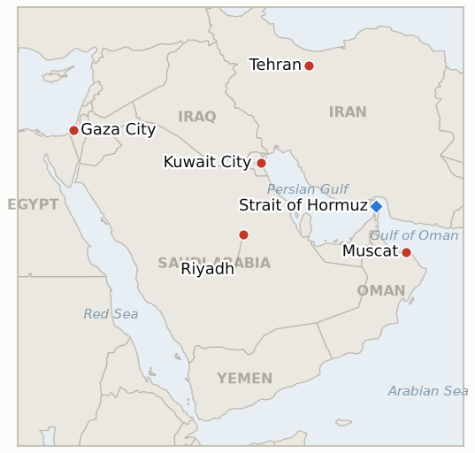

# Middle East Daily Briefing

**August 3, 2026**

- **Reporting window:** ~24 hours, August 2, 09:00 to August 3, 09:00 KST
- **Overall assessment:** The window's central fact is a claim, not a confirmed event: Trump announced by Truth Social that he was canceling the planned US and Israeli campaign against Iranian energy and nuclear infrastructure because Iran and other Middle Eastern nations had asked him to "hold off" and "the perimeters of a deal" had been agreed, covering full reopening of the Strait of Hormuz and an end to Iran's nuclear program, with Israel said to have joined the commitment. Iran's own semi-official military-linked outlets immediately and specifically denied it, calling the claim "simply a new lie" designed to "blackmail Persian Gulf rulers" and separately denying an Israeli media report that the arrangement would split Hormuz transit routes between Iranian and Omani control; Iran's foreign minister did confirm, separately, that Iran-Oman talks on Hormuz management are in their "final stages," a genuine and verifiable diplomatic fact that sits awkwardly next to Tehran's denial of everything else Trump described. Israeli defense officials told Channel 12 they learned of the cancellation from Trump's social media rather than official channels, calling it being left "in the fog." None of this diplomacy slowed the war's other fronts: Israeli strikes killed 16 to 18 people in Gaza in the deadliest single day there in weeks, with Energy Minister Eli Cohen ruling out any deal to halt attacks and floating full Israeli control of the Strip; and Kuwait's Foreign Ministry, after a second direct hit in days, invoked Article 51 of the UN Charter for the first time this war, still short of any response beyond protest. Korean and oil markets remain shut inside this window; Monday's Seoul session opens at the window's close and is the actual test of whether any of this reprices.

---

## 1. What Happened

<figure style="float:right; width:46%; margin:2pt 0 8pt 14pt;">

<figcaption style="font-size:8pt; color:#666; text-align:center; margin-top:3pt; font-style:italic;">Major places of discussion</figcaption>
</figure>

### 1.1 Trump Cancels Planned Strikes on Iran Citing Agreed Deal Perimeters as Israel Says It Was Left in the Fog and Tehran Calls It a Lie

President Trump posted on Truth Social Saturday night that he was canceling the broad campaign against Iranian energy and nuclear infrastructure the US and Israel had been preparing, after Iran and "other Middle Eastern nations" asked him to "hold off any attack" because "the perimeters of a deal has been agreed to," specifying "Immediate, Complete, and Total OPENING OF THE HORMUZ STRAIT" and an end to Iran's nuclear program, with Israel said to have joined the commitment ([Bloomberg](https://www.bloomberg.com/news/articles/2026-08-02/trump-holds-off-iran-strikes-on-pledge-a-hormuz-deal-is-close); [NPR](https://www.npr.org/2026/08/02/nx-s1-5917113/trump-says-hes-cancelling-iran-strikes-deal-pending); [Benzinga](https://www.benzinga.com/news/politics/26/08/60861664/trump-cancels-iran-strikes-rapid-deal-hormuz)). Iran's semi-official Mehr news agency, citing unnamed military officials, called the claim "simply a new lie" meant to "blackmail Persian Gulf rulers," said Iranian forces remain "at the highest level of readiness," and warned "if a confrontation becomes inevitable, the battlefield will be decisive"; Fars separately denied an Israeli Channel 12 report describing a mechanism splitting Hormuz transit between an Iranian-controlled entry route and an Omani-controlled exit route, with a negotiating-team member telling Fars "as long as the United States maintains its hostile actions, the Strait of Hormuz will remain closed" ([Times of Israel](https://www.timesofisrael.com/iran-denies-it-asked-trump-not-to-strike-or-agreed-to-deal-to-split-control-of-hormuz/)). Iran's Foreign Minister Abbas Araghchi did confirm, separately and consistent with prior reporting, that Iran-Oman talks on future Hormuz management are in their "final stages" (§1.2). Israeli defense officials told Channel 12 they were not informed through official channels and learned of the cancellation from Trump's own posts, with one saying "President Trump left us in the fog" and "the feeling was, they left us behind"; Israel's Energy Minister Eli Cohen separately warned "if Iran attempts to renew its nuclear program or advance its ballistic missile industries, we will be there. We will take action, and we will strike." Saudi Arabia's Crown Prince Mohammed bin Salman called Trump on August 2 and urged him to refrain from new strikes, per Axios and Saudi state media, one of the channels Trump credited for the pause. This is a successor test to IND-20260731-1 (falsified 2026-08-02) and directly bears on IND-20260802-1 and IND-20260801-1, both still open with an August 5 deadline (§3). **Confidence: High** on Trump's statement, Iran's specific and on-record denial, and the MBS call (Tier 1, multiple outlets, on-record and semi-official sourcing); **Low** on whether any actual deal exists in the form Trump described, given Iran's explicit denial of the two most load-bearing claims (that it asked for the pause, and that it agreed to split Hormuz control).

### 1.2 Iran and Oman Say Hormuz Management Talks Are in Their Final Stages as Transit Data Point Toward a Partial, Disputed Rebound

Separately from the disputed Trump deal, Araghchi told Iran's Cabinet that negotiations between Tehran and Muscat over future management of the Strait of Hormuz are in their "final stages" and "on the way to being finalised," without detailing the arrangement's terms ([Al Jazeera](https://www.aljazeera.com/amp/news/2026/8/2/iran-says-negotiations-with-oman-over-strait-of-hormuz-in-final-stages); [Middle East Monitor](https://www.middleeastmonitor.com/20260802-iran-says-talks-with-oman-on-strait-of-hormuz-nearing-completion/)). Separately, Kpler-sourced reporting citing a week of daily counts (Monday through Friday) put Hormuz commodity-vessel transits at 7, 11, 15, 4 and 9 to 10 respectively, with the most recent print citing two vessels going dark on AIS to avoid detection ([The National](https://www.thenationalnews.com/business/energy/2026/08/01/how-many-ships-are-transiting-through-hormuz-and-bab-al-mandeb/)); this conflicts with the clean 5-vessel, 24-hour Kpler print already logged in `data/observations.csv` for the same window (24 hours to 21:00 UTC July 31), a discrepancy consistent with the counting-basis inconsistency this ledger has flagged before (commodity tankers only vs. all vessels, differing collection windows) rather than a confirmed doubling of traffic. No day with zero transits has occurred on any basis (§3, IND-20260725-3). **Confidence: Medium** on the Iran-Oman talks being genuinely advanced (Tier 1 sourcing, but no terms disclosed); **Low** on the specific transit count for the most recent days given the conflicting bases.

### 1.3 Israel's Deadliest Gaza Day in Weeks as the Energy Minister Rules Out a Deal and Floats Full Israeli Control

Israeli strikes killed at least 16 to 18 Palestinians across Gaza City, Deir al-Balah and Khan Younis on Sunday, the highest single-day toll in weeks, with Gaza's Civil Defence saying Israel had "launched more than 10 raids since the morning hours" ([Al-Monitor](https://www.al-monitor.com/originals/2026/08/israeli-strikes-kill-18-gaza-minister-says-no-deal-halt-attacks); [The National](https://www.thenationalnews.com/news/mena/2026/08/02/gaza-death-toll-mounts-as-israel-continues-strikes-despite-peace-plan-breakthrough/)). Energy Minister Eli Cohen said there was "no deal to halt attacks on Gaza," that "Hamas must be dismantled, this is the first thing that must happen," and that with Israel already controlling 70 percent of the Strip there is "a need... to take full control of it" if Hamas will not disarm; National Security Minister Itamar Ben-Gvir again called the Board of Peace framework "unacceptable" and pushed for continued targeted operations. Board of Peace envoy Nickolay Mladenov acknowledged the strikes undercut the effort, saying he was working to "de-escalate and create the space for the full implementation of the President's plan," while Hamas official Basem Naim accused Israel of trying to "impose facts on the ground by force," and Hamas separately conditioned any weapons handover on Israel first halting operations and withdrawing, consistent with its position since the July 31 framework (§3, IND-20260801-2). **Confidence: High** on the strikes, casualty range and quoted officials (multi-outlet, Palestinian health/civil-defence and Israeli government sourcing); **Low** on the framework's near-term survival.

### 1.4 Kuwait Invokes Its UN Charter Right of Self Defense After a Second Direct Hit, Still Short of Any Response Beyond Protest

Kuwait's Foreign Ministry issued a formal statement condemning "continued Iranian aggression" after Saturday's drone strikes on a government facility and civilian vehicles on Bubiyan Island (§1.2, brief 2026-08-02), describing the attacks as a "flagrant violation of Kuwait's sovereignty," a breach of the UN Charter and Security Council Resolution 2817, and for the first time explicitly invoking Kuwait's "inalienable and legitimate right to self-defense under Article 51 of the UN Charter," saying it "will take all necessary measures to protect its sovereignty, national security, and citizens" ([Iran International](https://www.iranintl.com/en/202607315431); [Sunday Guardian Live](https://sundayguardianlive.com/world/us-israel-iran-war-latest-news-kuwaits-foreign-ministry-condemned-irans-continued-aggression-reserves-right-to-take-all-measures-to-protect-security-after-drone-attack-251124/)). The formal Article 51 citation is the sharpest legal language Kuwait has used this war, but no action beyond diplomatic protest and the standing air-defense posture followed in the window, keeping IND-20260802-2 open (§3). **Confidence: High** on the statement's content and sourcing (official Kuwaiti government text, multi-outlet); **Low** on whether the Article 51 language signals any actual posture change.

---

## 2. Deep Dive: Incentives and Motives

### 2.1 Why would Trump reverse from "locked and loaded" to canceling the campaign within roughly 24 hours?

Because the reported internal debate always weighed concluding or avoiding strikes before Monday's market open against the economic cost of the largest energy-infrastructure campaign of the war (§1.1, brief 2026-08-02), and Saudi Arabia's Crown Prince telling Trump directly to hold off, layered on Oman's parallel Hormuz channel reaching its own "final stage," gave Trump a face-saving off-ramp that lets him claim credit for a deal while avoiding both the market shock and the risk of a campaign that, once started against nuclear and power infrastructure, is difficult to reverse. The pattern matches this war's repeated rhythm of maximal threats followed by walked-back or paused escalation whenever a diplomatic channel offers an exit.

### 2.2 Why would Iran deny asking for the pause and deny the Hormuz split story, while confirming the Oman talks are real?

Because admitting Iran requested a halt, or agreed to cede any control over Hormuz to a US-brokered arrangement, would read domestically and regionally as capitulation under bombardment threat, precisely the "blackmail" frame Mehr invoked; confirming a separate, bilateral Iran-Oman technical negotiation over transit management costs Tehran nothing and can be framed as sovereign diplomacy between two littoral states rather than a US-dictated settlement. The gap between what Iran confirms (Oman talks) and what it denies (that it asked Trump for anything, or that Hormuz control is being split) is itself informative: Tehran wants a functional off-ramp on the Hormuz question without ceding the narrative that it was pressured into one.

### 2.3 Why would Israel escalate in Gaza on the same weekend Washington is publicly claiming two separate breakthroughs?

Because Eli Cohen's and Ben-Gvir's statements reflect a governing coalition that has not accepted the Board of Peace framework's premise, and every day the disarmament roadmap remains unimplemented is a day Israel's right flank argues for finishing the campaign by force rather than negotiation; escalating strikes while Washington celebrates a framework lets hardliners in Netanyahu's coalition demonstrate the war continues on the ground regardless of what gets announced in Washington, the same dynamic already tracked by IND-20260801-2.

### 2.4 Why would Kuwait escalate its legal language without escalating its actual response?

Because invoking Article 51 puts a formal international-law marker on the record, useful for any future compensation claim or coalition-building effort, without requiring Kuwait to take any action that could draw further Iranian retaliation or complicate its position as a US host state trying to avoid becoming a primary target; it is a hedge that preserves optionality rather than a signal of imminent escalation, consistent with the pattern IND-20260802-2 is tracking since the first Bubiyan strike.

---

## 3. Policy Implications for South Korea

### 3.1 Exposure snapshot

| Item | Current reading | Source |
| --- | --- | --- |
| July-August crude procurement | 110%+ of prior-year volume secured (MOTIE, July 21) | MOTIE via Herald Business, Youth Daily; `korea-exposure.md` |
| September crude procurement | 90%+ secured (MOTIE, July 21) | MOTIE via Herald Business; `korea-exposure.md` |
| Strategic reserve coverage | ~26 days of actual consumption (estimate); swap on immediate standby, untested at scale | CSIS; MOTIE July 27 |
| Korean nationals/vessels in Gulf | ~43 (13 aboard Korean vessels, 30 aboard foreign vessels) as of late June; MOFA reviewed safety with 17 missions | MOFA; Korea Herald |
| Brent / WTI / KOSPI / USD-KRW | No settled session in this window (Sunday August 2); last settles July 31 (Brent 90.12, WTI 84.67, KOSPI 6,595.45, ₩1,424.0); Monday's Seoul session opens exactly at this window's close | CNBC; KED Global; Money Today |
| Hormuz transits | 5 confirmed crossings, 24 hours to 21:00 UTC July 31 (Kpler clean print); a conflicting Kpler-adjacent 9-10 print for the same period is not reconciled (§1.2) | Kpler; The National |
| Qatari LNG (Ras Laffan) | No further laden departure since the Al Areesh (July 30); over a dozen tankers remain idle near the terminal | Riviera; The National |

### 3.2 Implications by development

**Trump's claimed cancellation of the Iran energy/nuclear campaign, if it holds, is the single most consequential input to Korea's near-term oil and shipping outlook, and Iran's explicit denial that any deal exists means it cannot yet be treated as a stable planning assumption.** MOTIE and KNOC should not read Saturday's announcement as closing the risk this brief has tracked since IND-20260802-1 opened; the disputed nature of the claim (Trump says a deal exists, Iran calls it a lie) means Korea's H2 import-bill and reserve-release modeling should keep both the pause and its collapse as live scenarios through the August 5 deadline, rather than defaulting to the calmer read markets may price in on Monday's open.

**A second consecutive Gaza escalation despite an announced disarmament framework should sharpen, not soften, how Seoul's Middle East desk treats every future Board of Peace announcement.** Energy Minister Cohen's explicit "no deal to halt attacks" statement is the clearest official confirmation yet that the framework's announcement and Israel's operational posture are decoupled; Korean diplomatic and commercial planning tied to any post-war Gaza reconstruction financing should continue to treat the framework as an option, not a commitment, per IND-20260801-2's own bar.

**Kuwait's formal Article 51 invocation, even without accompanying action, raises the legal and reputational stakes of any further direct strike on a Gulf host state Korea has commercial and personnel exposure in.** If Kuwait or another Gulf state does eventually escalate beyond protest, the shift would likely be framed in exactly this kind of international-law language first; MOFA's Gulf safety posture review should treat the Article 51 citation as a leading indicator worth monitoring, not a one-off statement.

**Testable indicators:**

- **IND-20260803-1** — The Iran-Oman Hormuz management talks, described as in their "final stages," reach a public announcement or stall short of one. A publicly announced Iran-Oman mechanism governing Hormuz transit management by ~2026-08-10 confirms the diplomatic track Araghchi described is real and gives Korea's shippers and KNOC a concrete framework to plan around; no such announcement through ~2026-08-10, with the "final stages" language going stale, falsifies it as another instance of a described-but-unrealized diplomatic milestone, consistent with the broader pattern IND-20260728-3 tracks.
- **IND-20260803-2** — Trump's claimed deal perimeters get independent corroboration or stay a US-only, Iran-disputed claim. Confirmation by Oman, Saudi Arabia, or another named mediator of the specific terms Trump described (Hormuz reopening tied to Iran's nuclear program) by ~2026-08-09 would establish the claim as more than a unilateral US framing; continued silence from every party but Washington, alongside Iran's standing denial, through ~2026-08-09 keeps the claim contested and unverifiable, the working assumption for now.

**Resolutions this run:** None. IND-20260729-3 (Korea's equity rout, chip cycle vs. war channel) reaches its own ~2026-08-03 deadline today, but Seoul's session opens exactly at this window's close and has not yet produced a print; resolution is deferred to tomorrow's run, consistent with how IND-20260725-2 and IND-20260730-2 were handled when a decisive session fell just outside the window.

---

## 4. Watch List

- **Whether Trump's claimed Iran deal holds, collapses, or stays permanently contested**, with Iran's denial the single largest source of near-term uncertainty (IND-20260802-1, IND-20260801-1, IND-20260803-2, deadlines August 5 and August 9).
- **Whether the Iran-Oman Hormuz management talks actually produce a public framework** (IND-20260803-1, deadline August 10).
- **Whether Israel's Gaza escalation forces a public Israeli answer on the Board of Peace framework, one way or the other** (IND-20260801-2, deadline August 15).
- **Whether Kuwait's Article 51 invocation is followed by any action beyond protest** (IND-20260802-2, deadline August 15).
- **Whether the Damietta attack is ever formally attributed** (IND-20260801-3, deadline August 14).
- **Whether the Lebanon pilot-zone framework scales to a second withdrawal** before its ~August 6 deadline, with Israel-Lebanon talks reportedly set for Italy on August 4 (IND-20260723-2).
- **Whether Qatar's Ras Laffan LNG freeze produces further laden departures** beyond the single Al Areesh transit (IND-20260731-2, deadline August 6).
- **Aramco and the Saudi government's continued silence on Abqaiq's operational status**, deadline August 5 (IND-20260729-1).
- **Whether Korea's markets, opening for the first time against this window's news, reprice the war or the deal-cancellation claim** when Monday's KST session runs its course (IND-20260729-3, resolving in tomorrow's run).
- **Whether Brent's next settle holds the $88 to $92 band or breaks it**, now with a bearish catalyst (the claimed cancellation) in play for the first time this band has been tested (IND-20260730-1, deadline August 5).

---

## 5. Source Quality Summary

| Claim | Sources | Confidence |
| --- | --- | --- |
| Trump cancels planned Iran strikes citing agreed "deal perimeters" (Hormuz reopening, end of nuclear program); Israel joined the commitment | Bloomberg, NPR, Benzinga (Tier 1-2, Trump's own Truth Social statement, multi-outlet) | High on the statement; Low on deal substance |
| Iran's Mehr and Fars news agencies deny requesting the pause and deny agreeing to split Hormuz control; call the claim "a new lie" | Times of Israel, citing Mehr and Fars (Tier 2, semi-official Iranian state media) | High |
| Israeli officials say they learned of the cancellation from social media, not official channels ("left us in the fog") | Times of Israel liveblog, citing Channel 12 (Tier 1-2, anonymous Israeli officials) | Medium-High |
| Iran's FM Araghchi: Iran-Oman Hormuz management talks in "final stages" | Al Jazeera, Middle East Monitor, Times of Israel (Tier 1-2, on-record Iranian official statement to Cabinet) | High on the statement; Medium on how advanced talks actually are |
| Kpler-sourced weekly Hormuz transit counts (7, 11, 15, 4, 9 to 10) conflicting with the previously logged 5-vessel print for the same period | The National (Tier 1-2, Kpler data, but internally inconsistent with prior Kpler-sourced figures) | Low on the specific count; High that transit remains far below pre-war levels on any basis |
| Israeli strikes kill 16 to 18 in Gaza, the deadliest day in weeks; Energy Minister Cohen rules out a deal and floats full Israeli control | Al-Monitor, The National (Tier 1-2, Palestinian health/civil-defence and Israeli government sourcing) | High |
| Kuwait's Foreign Ministry formally invokes Article 51 of the UN Charter after the Bubiyan Island strike | Iran International, Sunday Guardian Live (Tier 1-2, official Kuwaiti government statement) | High |
| Saudi Crown Prince Mohammed bin Salman calls Trump, urges restraint on new Iran strikes | Axios, Arab News, Saudi Press Agency (Tier 1-2, on-record Saudi state media and US reporting) | High |
