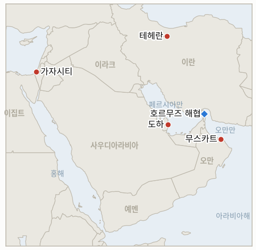

# 중동 일일 브리핑

**2026년 8월 4일**

- **보고 기간:** 약 24시간, 8월 3일 09:00 ~ 8월 4일 09:00 (한국시간)
- **종합 평가:** 월요일의 핵심은 워싱턴이 말하는 것과 다른 어느 당사자도 확인해주지 않는 것 사이의 간극이 더 벌어졌다는 점이다. 트럼프 대통령은 기자들에게 이란과의 협상이 "지금 바로 진행 중"이라 말했고, 이를 테헤란이 "참수"를 피할 "마지막 기회"라 칭했으며, 호르무즈 해협 재개방 합의가 "이르면 내일" 나올 수 있다고 밝혔다. 그러나 이란 외무부는 어떠한 협상도 진행 중이지 않다고 단언했고, 파르스 통신은 한 고위 협상관을 인용해 미국이 뒷받침한 카타르의 재개방 제안을 거부한다고 전했으며("생각도 하지 말라"는 취지의 재확인), CBS 뉴스에 따르면 미국 당국자들조차 그날 실제로 "새로운" 협상이 시작되지 않았다고 전한 것으로 알려졌다. 이 간극에도 불구하고 시장은 트럼프의 낙관론을 사실인 것처럼 반영했다. 브렌트유는 7.0% 하락한 83.77달러, WTI는 5.1% 하락한 80.34달러에 정산됐고, 트럼프의 발언이 나온 이후 첫 개장인 서울 증시에서 코스피는 5.12% 하락한 6,257.45로 마감했다. 다만 한국 언론은 이 하락의 주된 원인을 전쟁이 아니라 국내 AI·레버리지 자금의 청산으로 지목했다. 가자지구는 완전히 별개의 흐름을 이어갔다. 하마스의 조건부 무장해제 수용 이후 사흘이 넘도록 네타냐후 총리는 평화이사회 프레임워크 수용 여부를 여전히 공개하지 않았고, 이스라엘은 평화이사회 특사에게 현재 선에서 철군하지 않겠다고 공식 통보했으며, 주말 공습이 이어지며 7월은 가자지구에서 올해 가장 많은 사망자가 나온 달이 됐다. 오만 인근 유조선에서 발생한 원인 미상 폭발과 미 중부사령부의 확대되는 선박 차단 건수는, 트럼프가 무엇을 설명하든 호르무즈 해협 자체는 아직 물리적으로 재개방되지 않았음을 보여준다.

---

## 1. 무슨 일이 있었나

<figure style="float:right; width:46%; margin:2pt 0 8pt 14pt;">

<figcaption style="font-size:8pt; color:#666; text-align:center; margin-top:3pt; font-style:italic;">주요 논의 지점</figcaption>
</figure>

### 1.1 트럼프, 이란과 협상 "지금 바로" 진행 중이며 호르무즈는 내일 재개방될 수 있다고 주장, 테헤란은 협상 사실을 부인하고 카타르 안을 거부

트럼프 대통령은 월요일 기자들에게 이란과의 협상이 "지금 바로 진행 중"이라 말했고, 이를 테헤란이 "참수"를 피할 "마지막 기회"라 칭했으며, 호르무즈 해협을 재개방하는 합의가 "이르면 내일" 나올 수 있다고 밝혔다. 이는 토요일의 "합의의 큰 틀" 주장보다 더 날카롭고 구체적인 버전이다([Haaretz 라이브블로그](https://www.haaretz.com/israel-news/israel-security/2026-08-03/ty-article-live/trump-iran-negotiations-start-monday-hormuz-denuclearization-deal-imminent/0000019f-c572-d37f-adff-d5fe2fed0005); [Al Jazeera 라이브블로그](https://www.aljazeera.com/news/liveblog/2026/8/3/iran-war-live-trump-says-talks-set-to-begin-tehran-urges-us-to-honour-mou)). 이란 외무부는 워싱턴과의 협상이 진행 중이지 않다고 밝혔고, 파르스 통신은 별도로 고위 협상관 모하마드 마란디를 인용해 열흘간 휴전하는 대신 호르무즈 통항로 두 곳을 재개방하는 미국 뒷받침 카타르 제안을 거부했다고 전했으며, 또 다른 파르스 소식통은 미국의 "적대 행위"가 계속되는 한 해협은 "어떠한 상황에서도 완전히 폐쇄된 상태를 유지한다"고 밝혔다([Iran International](https://www.iranintl.com/en/202608036154)). 타임스오브이스라엘 라이브블로그는 미국 당국자들이 CBS 뉴스에 이번 보고 기간 중 "새로운" 협상이 실제로 시작되지 않았다고 전했다며, 트럼프 자신의 발언과 정면으로 배치되는 내용을 보도했다. 별도로 페제시키안 대통령은 내각에 워싱턴이 6월 체결된 미국-이란 양해각서(MOU)를 계속 "준수"해야 한다며, 이를 향후 이란 외교 정책의 "중심축"이라 칭했다([Times of Israel](https://www.timesofisrael.com/liveblog-august-3-2026/); [Gulf News](https://gulfnews.com/world/mena/us-iran-conflict-trump-pauses-strikes-as-iran-demands-us-honour-deal-1.500628086)). 미 중부사령부는 8월 3일 기준 자국 해군이 상선 44척을 우회시켰고, 2척을 무력화했으며, 2척에 승선 검색을 실시했다고 밝혔다. 하루 전 35척에서 늘어난 수치로, 트럼프가 곧 완전히 재개방될 것이라 설명한 바로 그 해협에서 미국의 대이란 봉쇄가 같은 날 오히려 확대된 셈이다. 이는 IND-20260803-2와 IND-20260728-3을 직접 시험한다(§3). **신뢰도: 높음** — 트럼프의 구체적 발언과 이란의 구체적 부인(1~2등급 다수 매체, 양측 공식 발언). **신뢰도: 낮음** — 실제로 협상이 진행되고 있는지 여부. 협상 개시라는 기초적 사실을 두고 미국 당국자와 이란 당국자가 정면으로 충돌하고 있기 때문이다.

### 1.2 네타냐후, 나흘째 가자지구 무장해제에 침묵, 이스라엘은 철군 공식 거부하고 평화이사회 특사는 중단 압박

하마스가 무장해제 프레임워크를 조건부 수용한 지 사흘이 넘도록 네타냐후 총리는 이를 수용하는지 여부를 여전히 공개적으로 밝히지 않고 있다. 니콜라이 믈라데노프 특사는 월요일 그를 만나 "건설적이고 세밀한" 논의를 하며 공습 중단을 압박했으며, 회담 후 이스라엘 당국자는 "가자지구 내 현재 선에서 철수하지 않을 것이며 계속해서 시민과 병사에 대한 어떠한 위협도 저지할 것"이라며 2025년 10월 휴전 당시의 원래 경계선으로의 후퇴를 거부한다고 밝혔다([CNN, ABC17News 경유](https://abc17news.com/news/national-world/cnn-world/2026/08/03/israels-response-to-trumps-gaza-peace-plan-silence-from-netanyahu-and-a-weekend-of-deadly-strikes/); [Washington Examiner](https://www.washingtonexaminer.com/news/world/4672601/board-of-peace-demands-netanyahu-cease-gaza-airstrikes-israel-peace-plan/)). 이 침묵은 이스라엘 안보 지도부 내부의 눈에 띄는 균열과 겹쳤다. 이스라엘 카츠 국방장관은 생방송에서 이스라엘군 중부사령관 아비 블루트 소장을 교체한다고 발표했다가 몇 시간 만에 이를 번복했으며, 네타냐후는 이에 "격노"해 "추악한 행동"이라고 표현한 것으로 알려졌고, 에얄 자미르 참모총장은 블루트에게 공개적으로 "당신은 어디에도 가지 않는다"고 말했다([Times of Israel 라이브블로그](https://www.timesofisrael.com/liveblog-august-3-2026/)). 가자지구 보건부는 7월 한 달간 이스라엘 공습으로 152명이 사망해 올해 들어 가장 많은 사망자가 발생한 달이었다고 밝혔으며, 월요일 보고 기간에는 가자시티 셰이크 아즐린 지역 차량에 대한 새로운 공습이 있었다. 하마스 계열 매체는 2명이 숨졌다고 전했고, 이스라엘군은 하마스 대원 2명을 사살했다고 밝히며 그중 한 명은 스스로 10월 7일 사태 가담자였다고 밝힌 인물이라고 설명했다([Bloomberg](https://www.bloomberg.com/news/articles/2026-08-03/israel-s-fresh-strikes-on-gaza-cast-doubt-on-peace-plan-revival); [Times of Israel 라이브블로그](https://www.timesofisrael.com/liveblog-august-3-2026/)). 이는 IND-20260801-2가 추적 중인 실시간 시험이다(§3). **신뢰도: 높음** — 네타냐후의 침묵, 철군 거부 발언, 카츠-블루트 사건(1~2등급 다수 매체, 이스라엘 정부 공식 발언). **신뢰도: 중간** — 내부 갈등이 프레임워크 결정과 실제로 어떻게 연결되는지는 추론일 뿐 명시적으로 확인된 연관성은 아니다.

### 1.3 합의 낙관론에 유가와 한국 증시 동반 급락

브렌트유는 7.0% 하락한 83.77달러, WTI는 5.1% 하락한 80.34달러로 정산됐다. 휴전 국면 진입 이후 가장 큰 하루 하락폭으로, 트럼프의 호르무즈 재개방 주장이 같은 날 나온 이란의 부인을 압도하며 시장 가격에 반영된 결과다. OPEC+가 일요일 승인한 핵심 산유국의 9월 하루 약 18만 8천 배럴 증산도 같은 방향으로 공급 측 압력을 더했으나, 야후 파이낸스가 인용한 애널리스트들은 시장이 트럼프의 발언에 "과잉 반응"했을 가능성을 지적했다([Yahoo Finance](https://finance.yahoo.com/energy/articles/oil-tumbles-trump-cancels-attack-041829322.html); [Gulf News](https://gulfnews.com/business/energy/oil-prices-plunge-after-trump-says-hopeful-over-iran-talks-1.500428503)). 코스피는 트럼프의 발언이 나온 이후 첫 거래일에 5.12%(-338.00포인트) 하락한 6,257.45로 마감했으나, 한국 금융권 보도는 이 하락을 주로 전쟁이 아니라 국내 요인, 즉 AI 관련 종목에 대한 레버리지 베팅("삼천닉스")의 약 56조 원 규모 청산, 삼성전자 DX부문의 사상 첫 적자, 잇따른 목표주가 하향 조정에서 찾았다. 원화는 1,429.8원(+5.8원)으로 소폭 약세에 그쳐 최근 범위 안에 머물렀다([Seoul Economic Daily](https://en.sedaily.com/finance/2026/08/03/kospi-closes-down-33800-points-or-512-percent-at-625745); [뉴시스](https://nwww.newsis.com/view/NISX20260803_0003734488)). 브렌트유가 88달러 아래로 정산되면서 IND-20260730-1의 "새로운 하한선" 가지는 반증됐고, 코스피·원화의 엇갈린 흐름은 오늘 자체 시한을 맞는 IND-20260729-3에 대해 진정으로 혼재된 결과를 남겼다(§3). **신뢰도: 높음** — 정산가와 코스피·원화 종가(1등급 거래소 데이터, 다수 매체). **신뢰도: 중간** — 유가는 트럼프의 주장, 코스피는 국내 레버리지 요인이라는 인과 해석은 확정된 단일 메커니즘이 아니라 애널리스트의 추론이다.

### 1.4 오만 인근 유조선서 원인 미상 폭발, 이란의 카타르 안 거부로 호르무즈는 여전히 공식적으로 폐쇄

영국 해사무역기구(UKMTO)는 마셜제도 선적 석유제품 운반선 벨로스 앰버호 인근에서 폭발음이 들렸다고 밝혔다. 카사브(오만) 북동쪽 약 20해리 지점, 월요일 현지시간 04시 37분경이었으며, 이후 이 선박의 선박자동식별장치(AIS) 신호가 끊겼다. 이후 선원 전원은 무사한 것으로 확인됐으며, 이란 관영 IRNA는 이 유조선의 선미 부분이 화염에 휩싸인 모습이라는 미확인 사진을 게재했다([Gulf News](https://gulfnews.com/world/mena/explosion-reported-near-tanker-off-oman-coast-crew-safe-ukmto-1.500628711); [Middle East Eye](https://www.middleeasteye.net/live-blog/live-blog-update/blast-reported-near-vessel-20-nautical-miles-away-oman)). 한편 Kpler는 8월 2일 호르무즈 해협에서 확인된 통항 9건을 기록했다(제재 대상 선박 2척, 그림자 선단 선박 2척 포함, 7척은 이란의 일방적 통항 체계를 이용했고 기존 통항분리제도를 이용한 선박은 없었다). 이는 이 원장이 7월 중순 이후 추적해온 일일 20척 미만의 교란 체제와 일치하며, 여전히 일일 30척의 회복 기준에는 미달한다([Kpler](https://x.com/Kpler/status/2084232691835171027)). 어떤 집계 기준으로도 통항이 0건인 날은 아직 없었다(§3, IND-20260725-3). **신뢰도: 중상** — 유조선 사건과 UKMTO 출처(1차 기관 출처, 다수 매체 확인이나 공격 발생 여부와 책임 소재는 미확인). **신뢰도: 낮음** — 구체적 통항 척수는 이 원장이 이미 지적한 집계 기준 상충 문제로 인해 낮음.

### 1.5 이스라엘·레바논, 시범 구역 시한 앞두고 8월 4~6일 로마 회담 확정

미 국무부는 이스라엘·레바논 간 다음 회담이 8월 4일부터 6일까지 로마에서 열린다고 확인했다. 기술팀은 시범 구역 철수 절차 확대, 남은 국경 현안 해결, 더 폭넓은 안보 협정 논의를 진행할 예정이며, 이는 자우타르 알가르비예에서 이스라엘의 첫 철수가 이뤄진 이후 후속 조치다([Geo News](https://www.geo.tv/latest/675057-us-confirms-israel-lebanon-talks-in-italy-from-august-4-to-6); [Al-Monitor](https://www.al-monitor.com/originals/2026/07/lebanon-israel-hold-next-talks-italy-august-4-lebanese-official-says)). 이번 회담은 이번 보고 기간이 끝난 직후 개막하며, 시범 구역 모델이 두 번째 철수로 확대되는지를 시험하는 IND-20260723-2 자체의 8월 6일경 시한을 앞두고 있다(§3). **신뢰도: 높음** — 회담 일정 확정과 미 국무부 공식 확인(1~2등급, 다수 매체). **신뢰도: 낮음** — 로마 회담이 실제 두 번째 철수로 이어질지는, 이전 보고에서 언급된 프룬과 자우타르 알샤르키예 주변 마찰을 감안하면 낮음.

---

## 2. 심층 분석: 유인과 동기

### 2.1 이란이 협상과 합의 모두를 명확히 부인하는데도 트럼프는 왜 협상이 진행 중이며 하루 안에 합의가 나온다고 공개적으로 주장하나?

"이르면 내일"이라는 구체적이고 임박한 듯한 주장은, 공식 협상이 실제로 존재하는지와 무관하게 트럼프를 향후 어떤 긴장 완화든 그 주역으로 계속 보이게 하고, 월요일의 유가 급락과 같은 시장 반응을 자신의 전략이 통하고 있다는 증거로 내세울 수 있게 하며, "10일 휴전"이나 "마무리 단계" 같은 앞선 여러 시한이 조용히 흘러갔던 것처럼 이번 시한이 흐지부지되더라도 국내적으로 아무런 대가를 치르지 않는다. 이란 입장에서는 협상이 진행 중이라는 사실을 공개적으로 부인하는 것이 토요일 이후 테헤란이 견지해온 "폭격 앞에 굴복하지 않는다"는 입장을 그대로 지키면서도(2026년 8월 3일 브리핑 §2.2), 실제로 확인해준 오만이라는 간접적이고 부인 가능한 채널을 위한 여지는 사적으로 남겨둔다.

### 2.2 오만과의 채널은 살아있는데 이란은 왜 카타르의 휴전-대-통항로 제안은 거부하나?

카타르의 제안은 미국의 공습 중단을 이란이 통항로 재개방으로 대가를 치러야 하는 호의처럼 명시적으로 규정하고 있어, 국내적으로는 이란이 압박 속에 협상하는 것으로 읽힐 수밖에 없는 거래적 구조를 띤다. 반면 오만과의 채널은 두 걸프 연안국이 공유 수로를 양자적으로 관리하는 틀로 규정돼 있어, 테헤란이 받지도 못한 미군 공습 중단의 대가로 양보하는 것처럼 보이지 않으면서도 주권을 지키는 구조를 받아들일 수 있게 한다. 이는 이란이 이번 주 내내 그어온 것과 같은 선이다(§1.1). 이란이 거부하는 것은 협상 자체가 아니라 위협 아래에서 워싱턴과 협상하는 것으로 비치는 것이다.

### 2.3 어느 정부도 확인해주지 않는 주장 하나에 유가와 한국 증시가 왜 함께 하락했나?

원자재·주식 시장은 구조적으로 방향성 뉴스를 비대칭적으로 반영하는 경향이 있다. 국가 원수가 내놓은 구체적이고 인용하기 쉬운 긴장 완화 주장은, 페르시아어 통신 성명과 익명의 CBS 취재원을 따져야 하는 부인보다 발표 당일 거래에 반영되기 훨씬 쉽다. 따라서 월요일의 급락은 확인된 사실이라기보다는 (다소 성급하더라도) 실제 안도 매매 포지셔닝을 반영했을 가능성이 크다. 코스피가 같은 방향으로 움직인 것은 인과관계라기보다는 우연에 가까운데, 한국 언론은 이를 이미 취약 요인으로 지목돼온 "삼천닉스" 베팅 규모를 감안하면 어느 월요일에든 벌어졌을 법한 국내 레버리지 상품 청산으로 설명하고 있기 때문이다.

### 2.4 네타냐후가 프레임워크에 침묵하는 동안 그의 국방장관은 왜 공개적으로 지휘관 교체 문제로 실수를 저질렀나?

두 사건 모두 같은 근본 문제를 드러낸다. 즉 전쟁을 평화이사회의 조건대로 끝낼 것인지를 내부적으로 아직 정리하지 못한 연립정부라는 문제다. 최고위층의 침묵과 하부 지휘 체계의 혼란(카츠가 장군 교체를 발표했다가 번복한 것)은 별개의 사건이라기보다는 같은 미해결 갈등이 드러난 두 증상에 가깝다. 프레임워크 자체에는 침묵하면서 철군은 공식 거부하는 태도는, 네타냐후로 하여금 전쟁을 무력으로 끝내길 원하는 우파와 눈에 보이는 자제를 요구하는 워싱턴의 프레임워크 사이에서 선택을 미룰 수 있게 하며, 이는 IND-20260801-2가 개설된 이후 이 원장이 기본값으로 추적해온 태도다.

---

## 3. 한국에 대한 정책적 함의

### 3.1 익스포저 현황

| 항목 | 현재 수치 | 출처 |
| --- | --- | --- |
| 7~8월 원유 도입 | 전년 동기 대비 110% 이상 확보 (산업통상자원부, 7월 21일) | 산업통상자원부, 헤럴드경제·영유데일리 인용; `korea-exposure.md` |
| 9월 원유 도입 | 90% 이상 확보 (산업통상자원부, 7월 21일) | 산업통상자원부, 헤럴드경제 인용; `korea-exposure.md` |
| 전략비축유 보유 여력 | 실제 소비 기준 약 26일 (추정치); 스와프는 즉시 시행 대기 상태이나 대규모 실행은 미검증 | CSIS; 산업통상자원부 7월 27일 |
| 걸프 지역 한국 국민·선박 | 약 43명 (한국 선박 13명, 외국 선박 30명, 6월 말 기준); 외교부, 17개 재외공관과 안전 점검 실시 | 외교부; 코리아헤럴드 |
| 브렌트·WTI | 각각 83.77달러(-7.0%), 80.34달러(-5.1%) 정산, 트럼프의 논란 많은 재개방 주장에 하락; OPEC+는 9월 하루 약 18만 8천 배럴 증산 승인 | Yahoo Finance/CNBC; Gulf News |
| 코스피·원달러 | 코스피 -5.12% 6,257.45 (휴전 국면 진입 이후 최대 하루 낙폭), 주로 국내 AI·레버리지 청산 요인으로 지목; 원화는 1,429.8원으로 소폭 약세 | Seoul Economic Daily; 뉴시스 |
| 호르무즈 통항량 | 8월 2일 확인된 통항 9건 (Kpler: 제재 대상 2척, 그림자 선단 2척, 7척은 이란의 일방적 통항 체계 이용); 같은 기간 오만 인근 유조선의 원인 미상 폭발은 해협이 아직 물리적으로 재개방되지 않았음을 보여준다 | Kpler; Gulf News; Middle East Eye |
| 미 중부사령부 해상 봉쇄 | 8월 3일 기준 상선 44척 우회, 2척 무력화, 2척 승선 검색, 하루 전 35척에서 증가 | 미 중부사령부, ANI·Middle East Eye 경유 |

### 3.2 사안별 함의

**트럼프의 "이르면 내일" 호르무즈 재개방 주장을 산업통상자원부와 한국석유공사가 수사 이상으로 받아들인다면, 이는 IND-20260802-1과 IND-20260803-2 개설 이후 이 원장이 경고해온 것과 같은 계획상의 오류가 된다.** 확대되는 미 중부사령부의 봉쇄(35척에서 44척으로 증가)와 이란의 명시적인 카타르 통항로 제안 거부가 실제 해상의 사실이다. 한국의 하반기 수입 비용 및 비축유 방출 모델링은 봉쇄를 여전히 유지되는 기준선으로 삼아야 하며, 워싱턴이 발표한 시점이 아니라 국제해사기구(IMO)나 로이즈리스트, 또는 이에 준하는 독립적 추적기관이 실제 통항 규정 변화를 보고하는 시점까지는 어떠한 재개방 주장도 미확인 상태로 취급해야 한다.

**월요일 코스피 급락은 한국 언론이 전쟁이 아닌 국내 레버리지 상품 청산 요인으로 설명하고 있지만, 그럼에도 한국 증시가 전쟁과 무관한 꼬리 위험만으로도 하루에 지수를 5% 움직일 수 있음을 보여주는 사례이며, 이는 산업통상자원부의 전쟁 중심 익스포저 추적이 포착하지 못하는 위험이다.** 8월 31일 한국은행 기준금리 결정(IND-20260717-3)은 이를 (하락하는) 유가에서 나오는 수입 에너지 비용 신호와 함께 고려해야 하며, 휴전 붕괴 이후 처음으로 진정한 양방향 변수가 됐다.

**쿠웨이트가 추가 확전 없이 계속 공격을 감내하고 있는 것과, 여전히 책임 소재가 밝혀지지 않은 오만 유조선 사건 모두 외교부의 걸프 지역 안전 태세 점검이 이란 인접국을 넘어 시야를 넓혀야 한다는 근거다.** 한국 선적·한국 용선 선박은 그 위에 어떤 외교적 주장이 얹혀 있든, 미 중부사령부가 모두를 상대로 시행 중인 것과 같은 차단 체제 안에 놓여 있다.

**검증 가능한 지표:**

- **IND-20260804-1** — 호르무즈가 "이르면 내일" 재개방될 수 있다는 트럼프의 구체적 주장이 실현되는지, 아니면 24~48시간 시한을 어긴 이번 전쟁의 익숙한 사례 목록에 합류하는지. 2026년 8월 6일까지 미 중부사령부의 봉쇄가 실제로 종료되고 호르무즈 통항이 전쟁 이전 수준(대략 일일 30척 이상)으로 회복되면 트럼프의 주장이 실질적으로 정확했음이 확인된다. 2026년 8월 6일까지 봉쇄가 유지되고 통항이 일일 20척 미만의 교란선 아래에 머물며 "어떠한 상황에서도 폐쇄"라는 이란의 입장이 그대로라면, 이는 이번 전쟁의 반복된 패턴대로 지켜지지 않은 또 하나의 단기 시한이었음을 반증한다.
- **IND-20260804-2** — 월요일 코스피 5.12% 급락이 하루짜리 레버리지 상품發 에어포켓인지, 아니면 새로운 하락세의 시작인지. 2026년 8월 6일까지 코스피가 6,398(7월 31일 사상 최고 종가 대비 3% 이내)을 회복하면 에어포켓 해석이 확인된다. 2026년 8월 6일까지 6,000 아래로(7월 31일 종가 대비 누적 9% 이상 하락) 마감하면 이는 에어포켓 해석을 반증하며 레버리지 청산이 더 넓은 위험 회피로 번지고 있음을 시사한다.

**이번 보고에서 해소된 지표:**

- **IND-20260730-1 — 반증.** 브렌트유 정산가 83.77달러는 88달러 반증 기준을 크게 밑돈다. 휴전 붕괴 이후 나타났던 90.74달러 급등은 새로운 시장 하한선이 아니라 일주일 안에 되돌려진 하루짜리 확전 충격이었다.
- **IND-20260729-3 — 만료(혼재).** 환율 축은 반도체 사이클 해석을 명확히 확증한다(원화가 전쟁 채널 확증선인 1,490원에서 크게 벗어난 1,429.8원에 머물렀다). 그러나 주식 축은 진정으로 모호하다. 월요일 급락은 삼성전자와 SK하이닉스(외국계 자금이 오히려 계속 매수한 것으로 알려짐)를 넘어 지수 전반으로 확대됐는데, 이는 반도체 사이클 가지가 명시한 "반도체 종목에 집중된" 패턴과는 다르다. 그렇다고 확인된 원인(전쟁 리스크 회피가 아니라 국내 AI 연계 레버리지 상품 청산과 마진콜)이 전쟁 채널 가지가 탐지하려 했던 "전반적 위험 회피로 번지는" 메커니즘과 정확히 일치하는 것도 아니다. 시한까지 어느 가지의 메커니즘도 명확히 충족되지 않아, 어느 한쪽으로 억지로 판정하지 않고 만료 처리했으며, 이 혼재 상태는 IND-20260804-2로 이어서 추적한다.

---

## 4. 관찰 목록

- **트럼프의 "이르면 내일" 호르무즈 재개방 주장이 실제 확인 가능한 변화로 이어질지** (IND-20260804-1, 시한 8월 6일).
- **월요일 코스피 급락이 안정될지, 더 깊은 하락으로 번질지** (IND-20260804-2, 시한 8월 6일).
- **이란-오만 호르무즈 관리 협상이 공개 틀로 이어질지**, 트럼프가 주장하는 미국-이란 합의와는 여전히 별개 (IND-20260803-1, 시한 8월 10일).
- **이스라엘의 가자지구 확전과 네타냐후의 침묵이 평화이사회 프레임워크에 대한 공식 답변을 강제할지** (IND-20260801-2, 시한 8월 15일).
- **쿠웨이트의 제51조 원용 뒤에 항의를 넘어서는 조치가 뒤따를지** (IND-20260802-2, 시한 8월 15일).
- **8월 4~6일 로마 이스라엘·레바논 회담이 두 번째 시범 구역 철수로 이어질지**, 약 8월 6일 시한을 앞두고 (IND-20260723-2).
- **다미에타 공격의 책임 소재가 공식적으로 규명될지** (IND-20260801-3, 시한 8월 14일).
- **카타르 라스라판 LNG 동결이 알아리시호에 이어 추가 만적 출항으로 이어질지** (IND-20260731-2, 시한 8월 6일).
- **아람코와 사우디 정부가 아브카이크 가동 상태에 대해 계속 침묵할지**, 시한 8월 5일 (IND-20260729-1).
- **이란 에너지·핵시설에 대한 미국·이스라엘의 위협받은 작전이 실제로 개시될지, 아니면 유예된 위협으로 남을지** (IND-20260802-1, 시한 8월 5일).
- **트럼프의 "다리 또는 발전소" 유조선 보복 최후통첩이 실제로 발동될지** (IND-20260801-1, 시한 8월 5일).

---

## 5. 출처 신뢰도 요약

| 주장 | 출처 | 신뢰도 |
| --- | --- | --- |
| 트럼프, 이란과 협상이 "지금 바로 진행 중"이며 테헤란의 "참수" 전 "마지막 기회", 호르무즈는 "이르면 내일" 재개방 가능 | Haaretz 라이브블로그, Al Jazeera 라이브블로그 (1~2등급, 대통령 공식 발언, 다수 매체) | 높음 |
| 이란 외무부, 협상 진행 부인; 파르스 통신은 마란디를 인용해 카타르의 휴전-대-통항로 제안 거부 전달; 해협은 "어떠한 상황에서도 완전 폐쇄" | Iran International, 파르스 통신 인용 (2~3등급, 이란 반관영 매체, 테헤란에 비판적인 매체) | 중상 |
| 미국 당국자들, CBS 뉴스에 이번 보고 기간 "새로운" 협상은 시작되지 않았다고 전한 것으로 알려져 트럼프 발언과 배치 | Times of Israel 라이브블로그 | 중간 |
| 미 중부사령부: 8월 3일 기준 상선 44척 우회, 2척 무력화, 2척 승선 검색, 전날 35척에서 증가 | 미 중부사령부 (1차 기관 출처), ANI·Middle East Eye 경유 | 높음 |
| 네타냐후, 사흘 넘게 평화이사회 프레임워크에 침묵; 이스라엘은 가자지구 현재 선에서 철군 공식 거부 | CNN, ABC17News 경유; Washington Examiner (1~2등급, 이스라엘 당국 공식 발언) | 높음 |
| 카츠, 이스라엘군 중부사령관 교체 발표 후 번복; 네타냐후 "격노"; 자미르는 블루트 지지 | Times of Israel 라이브블로그 (1~2등급, 이스라엘 당국자 공식 발언) | 높음 |
| 가자지구 7월 사망자 152명으로 올해 최다 달; 가자시티 신규 공습으로 2명 사망, 이스라엘군은 하마스 대원 2명 사살 발표 | Bloomberg, Times of Israel 라이브블로그 (1~2등급, 팔레스타인 보건부·이스라엘 정부 소식통) | 높음 |
| 브렌트유 -7.0% 83.77달러, WTI -5.1% 80.34달러 정산; OPEC+ 9월 하루 약 18만 8천 배럴 증산 승인 | Yahoo Finance/CNBC, Gulf News (1~2등급, 거래소 정산 데이터) | 높음 |
| 코스피 -5.12% 6,257.45, 국내 AI·레버리지 상품 청산("삼천닉스", 약 56조 원 규모)에 기인; 원화는 1,429.8원으로 소폭 약세 | Seoul Economic Daily, 뉴시스 (2~3등급, 한국 금융 언론, 거래소 데이터) | 종가는 높음; 인과 해석은 중간 |
| 유조선 벨로스 앰버호 인근 카사브(오만) 폭발 보고; 선원 무사; IRNA의 화재 사진은 미확인 | UKMTO (1차 기관 출처), Gulf News·Middle East Eye 경유 | 중상 |
| Kpler: 8월 2일 호르무즈 확인 통항 9건 (제재 대상 2척, 그림자 선단 2척, 7척은 이란의 일방적 통항 체계 이용) | Kpler (단일 출처 데이터 제공업체) | 중간 |
| 이스라엘·레바논 회담, 8월 4일부터 6일까지 로마에서 개최 확정 | Geo News, Al-Monitor (1~2등급, 미 국무부 확인, 다수 매체) | 높음 |
