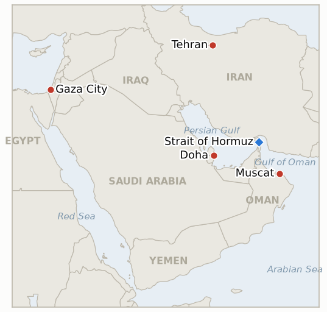

# Middle East Daily Briefing

**August 4, 2026**

- **Reporting window:** ~24 hours, August 3, 09:00 to August 4, 09:00 KST
- **Overall assessment:** Monday's central story is a widening gap between what Washington says and what every other party will confirm. Trump told reporters talks with Iran "are going on right now," called it Tehran's "last chance to sign a good document" before "decapitation," and said the Strait of Hormuz could reopen "as early as tomorrow"; Iran's Foreign Ministry flatly denied any negotiations were underway, Fars News quoted a senior negotiator rejecting the specific US-backed Qatari reopening proposal ("don't even think about it" territory, again), and even US officials reportedly told CBS News no "new" talks had actually begun that day. The gap did not stop markets from pricing Trump's optimism as fact: Brent settled 7.0% lower at $83.77 and WTI fell 5.1% to $80.34, while Seoul's first session since the claim broke saw KOSPI drop 5.12% to 6,257.45, though Korean reporting traces that move to a domestic AI/leverage unwind rather than the war directly. Gaza stayed on its own track entirely: more than three days after Hamas's conditional disarmament pledge, Netanyahu has still not publicly accepted the Board of Peace framework, Israel formally told the board's envoy it will not withdraw from its current lines, and a weekend of strikes made July the deadliest month of the year in the Strip. An unattributed blast near a tanker off Oman and CENTCOM's expanding vessel-interdiction count underline that whatever Trump is describing, the Strait itself has not physically reopened.

---

## 1. What Happened

<figure style="float:right; width:46%; margin:2pt 0 8pt 14pt;">

<figcaption style="font-size:8pt; color:#666; text-align:center; margin-top:3pt; font-style:italic;">Major places of discussion</figcaption>
</figure>

### 1.1 Trump Says Iran Talks Are Underway "Right Now" and Hormuz Could Reopen Tomorrow as Tehran Denies Negotiating and Rejects a Qatari Proposal

President Trump told reporters Monday that negotiations with Iran "are going on right now," called it Tehran's "last chance to sign a good document" before "decapitation," and said a deal reopening the Strait of Hormuz could be reached "as early as tomorrow," a sharper and more specific version of Saturday's "perimeters of a deal" claim ([Haaretz liveblog](https://www.haaretz.com/israel-news/israel-security/2026-08-03/ty-article-live/trump-iran-negotiations-start-monday-hormuz-denuclearization-deal-imminent/0000019f-c572-d37f-adff-d5fe2fed0005); [Al Jazeera liveblog](https://www.aljazeera.com/news/liveblog/2026/8/3/iran-war-live-trump-says-talks-set-to-begin-tehran-urges-us-to-honour-mou)). Iran's Foreign Ministry said no talks with Washington were underway, and Fars News separately quoted senior negotiator Mohammad Marandi rejecting a US-backed Qatari proposal for a ten-day ceasefire in exchange for reopening two Hormuz shipping lanes, while another Fars source said the strait "remains fully closed under any circumstances" as long as US "hostile actions" continue ([Iran International](https://www.iranintl.com/en/202608036154)). Times of Israel's liveblog reported that US officials told CBS News no "new" talks had actually started in the window, directly undercutting Trump's own timeline; separately, President Pezeshkian told Iran's Cabinet that Washington must "remain committed" to the US-Iran memorandum of understanding signed in June, calling it "the centre of gravity" of Iran's foreign policy going forward ([Times of Israel](https://www.timesofisrael.com/liveblog-august-3-2026/); [Gulf News](https://gulfnews.com/world/mena/us-iran-conflict-trump-pauses-strikes-as-iran-demands-us-honour-deal-1.500628086)). CENTCOM said its naval forces had redirected 44 commercial vessels, disabled two and boarded two more as of August 3, up from 35 a day earlier, meaning the US blockade against Iran continued expanding in scope on the same day Trump described its subject as a strait about to fully reopen. This directly tests IND-20260803-2 and IND-20260728-3 (§3). **Confidence: High** on Trump's specific quotes and Iran's specific denials (Tier 1-2, multiple outlets, on-record statements on both sides); **Low** on whether any negotiation is actually occurring, given the direct US-official-to-Iran-official contradiction on the basic fact of whether talks started.

### 1.2 Netanyahu Stays Silent on Gaza Disarmament for a Fourth Day as Israel Formally Refuses to Withdraw and Board of Peace Envoy Presses for a Halt

More than three days after Hamas's conditional acceptance of the Board of Peace's disarmament framework, Netanyahu has still not said publicly whether Israel accepts it; envoy Nickolay Mladenov met him Monday for "constructive and detailed" talks and pressed for a halt to strikes, after which an Israeli official said Israel "will not withdraw from the current line in the Gaza Strip and will continue to thwart any threat," rejecting a pullback to the original October 2025 ceasefire demarcation ([CNN via ABC17News](https://abc17news.com/news/national-world/cnn-world/2026/08/03/israels-response-to-trumps-gaza-peace-plan-silence-from-netanyahu-and-a-weekend-of-deadly-strikes/); [Washington Examiner](https://www.washingtonexaminer.com/news/world/4672601/board-of-peace-demands-netanyahu-cease-gaza-airstrikes-israel-peace-plan/)). The silence coincided with visible strain inside Israel's own security leadership: Defense Minister Israel Katz announced live on television that he was replacing IDF Central Command chief Maj. Gen. Avi Bluth, then walked the statement back within hours, with Netanyahu reportedly "furious" and calling the episode "obscene behavior" while IDF Chief of Staff Eyal Zamir publicly told Bluth "you're not going anywhere" ([Times of Israel liveblog](https://www.timesofisrael.com/liveblog-august-3-2026/)). Gaza's Health Ministry said 152 people were killed in Israeli strikes in July, the deadliest month of the year in the Strip, and Monday's window included a fresh strike on a vehicle in Gaza City's Sheikh Ajlin neighborhood that Hamas-affiliated media said killed two, with the IDF saying it killed two named Hamas operatives, one a self-described October 7 participant ([Bloomberg](https://www.bloomberg.com/news/articles/2026-08-03/israel-s-fresh-strikes-on-gaza-cast-doubt-on-peace-plan-revival); [Times of Israel liveblog](https://www.timesofisrael.com/liveblog-august-3-2026/)). This is the live test tracked by IND-20260801-2 (§3). **Confidence: High** on Netanyahu's silence, the refusal statement and the Katz-Bluth episode (Tier 1-2, multi-outlet, on-record Israeli government sourcing); **Medium** on how the internal friction connects causally to the framework decision, which is inference rather than a stated link.

### 1.3 Oil and Korean Equities Plunge Together on Monday's Disputed Deal Optimism

Brent settled down 7.0% at $83.77 and WTI fell 5.1% to $80.34, the sharpest one-day drop since the pause first took hold, as Trump's Hormuz-reopening claim overrode Iran's same-day denial in the market's pricing; OPEC+'s Sunday approval of a roughly 188,000 bpd September output increase from core producers added a supply-side push in the same direction, though analysts quoted by Yahoo Finance said the market had likely "overreact[ed]" to Trump's comments ([Yahoo Finance](https://finance.yahoo.com/energy/articles/oil-tumbles-trump-cancels-attack-041829322.html); [Gulf News](https://gulfnews.com/business/energy/oil-prices-plunge-after-trump-says-hopeful-over-iran-talks-1.500428503)). KOSPI fell 5.12% (-338.00 points) to 6,257.45 in its first session since Trump's claim broke, but Korean financial press attributed the drop chiefly to a domestic unwind: leveraged bets on AI-linked names ("Samchunix") triggering roughly 56 trillion won in liquidations, Samsung's DX division posting a first-ever loss, and a wave of analyst price-target cuts, rather than to the war directly; the won weakened only modestly to 1,429.8 (+5.8), staying well inside its recent range ([Seoul Economic Daily](https://en.sedaily.com/finance/2026/08/03/kospi-closes-down-33800-points-or-512-percent-at-625745); [Newsis](https://nwww.newsis.com/view/NISX20260803_0003734488)). Brent's settle below $88 falsifies IND-20260730-1's "new floor" branch; the KOSPI/won split is genuinely mixed for IND-20260729-3, whose own deadline falls today (§3). **Confidence: High** on the settlement figures and KOSPI/won closes (Tier 1 exchange data, multi-outlet); **Medium** on the causal attribution to Trump's claim for oil and to domestic leverage for KOSPI, since both are analyst inference rather than a single confirmed mechanism.

### 1.4 An Unattributed Blast Hits a Tanker Off Oman as Iran's Rejection of the Qatari Proposal Keeps Hormuz Formally Closed

UKMTO reported an explosion heard close to the Marshall Islands-flagged oil products tanker Velos Amber roughly 20 nautical miles northeast of Khasab, Oman, at 04:37 local time Monday, after which the vessel's AIS signal went dark; all crew were later reported safe, and Iran's state-run IRNA published an unverified photograph purportedly showing the tanker's aft section in flames ([Gulf News](https://gulfnews.com/world/mena/explosion-reported-near-tanker-off-oman-coast-crew-safe-ukmto-1.500628711); [Middle East Eye](https://www.middleeasteye.net/live-blog/live-blog-update/blast-reported-near-vessel-20-nautical-miles-away-oman)). Separately, Kpler recorded 9 confirmed Hormuz transits on August 2 (2 sanctioned, 2 shadow fleet, 7 routed via Iran's Unilateral Scheme and none via the established traffic separation scheme), consistent with the sub-20/day disruption regime this ledger has tracked since mid-July and still short of the 30/day recovery threshold ([Kpler](https://x.com/Kpler/status/2084232691835171027)). No day with zero transits has occurred on any counting basis (§3, IND-20260725-3). **Confidence: Medium-High** on the tanker incident and its UKMTO sourcing (primary institutional source, multi-outlet corroboration, but attribution and even the strike's occurrence are unconfirmed); **Low** on the specific transit count given the standing counting-basis conflicts already flagged in this ledger.

### 1.5 Israel and Lebanon Confirm Rome Talks for August 4 to 6 as the Pilot Zone Deadline Nears

The US State Department confirmed the next round of Israel-Lebanon talks will run in Rome from August 4 to 6, with technical groups set to work on expanding the pilot-zone withdrawal process, resolving outstanding border issues and advancing a broader security agreement, following the first Israeli pullback from Zawtar al-Gharbiyeh ([Geo News](https://www.geo.tv/latest/675057-us-confirms-israel-lebanon-talks-in-italy-from-august-4-to-6); [Al-Monitor](https://www.al-monitor.com/originals/2026/07/lebanon-israel-hold-next-talks-italy-august-4-lebanese-official-says)). The talks open just after this window's close, ahead of IND-20260723-2's own ~August 6 deadline for whether the pilot-zone model scales to a second withdrawal (§3). **Confidence: High** on the talks being scheduled and confirmed by the US State Department (Tier 1-2, official confirmation, multi-outlet); **Low** on whether Rome produces an actual second withdrawal given the friction reported around Froun and Zawtar al-Sharqiyeh in prior briefs.

---

## 2. Deep Dive: Incentives and Motives

### 2.1 Why would Trump publicly claim talks are underway and a deal is a day away, when Iran flatly denies both?

Because a specific, imminent-sounding claim ("as early as tomorrow") keeps Trump the visible author of any eventual de-escalation regardless of whether formal talks exist yet, lets him claim the market reaction (Monday's oil selloff) as evidence the strategy is working, and costs him nothing domestically if the deadline quietly slips the way "10-day truce," "final stages" and other prior windows have; for Iran, publicly denying talks exist protects the same "no capitulation under bombardment" position Tehran has held since Saturday (brief 2026-08-03, §2.2), while privately leaving room for exactly the kind of indirect, deniable channel (Oman) it has actually confirmed.

### 2.2 Why would Iran reject the Qatari ceasefire-for-lanes proposal while its Oman channel stays alive?

Because the Qatari proposal explicitly frames a US strike halt as a favor Iran must pay for by reopening shipping lanes, a transactional structure that reads domestically as Iran negotiating under duress; the Oman channel, by contrast, is framed as two littoral Gulf states managing their shared waterway bilaterally, a sovereignty-preserving structure Tehran can accept without appearing to trade concessions for a pause in US strikes it has not been offered credit for stopping. The distinction is the same one Iran has drawn all week (§1.1) — what it rejects is being seen to negotiate with Washington under threat, not negotiation itself.

### 2.3 Why would oil and Korean equities fall together on a claim neither government will confirm?

Because commodity and equity markets are structurally biased to price directional news asymmetrically: a specific, quotable de-escalation claim from a head of state is easier to trade on the day it is made than a denial requiring investors to parse Farsi-language wire statements and anonymous CBS sourcing, so Monday's selloff likely reflects genuine (if premature) relief-trade positioning rather than confirmed fact; KOSPI's identical-direction move is more coincidental than causal, since Korean commentary traces it to a domestic leveraged-product unwind that would very likely have happened on any Monday given the scale of the "Samchunix" bets already flagged as a vulnerability.

### 2.4 Why would Netanyahu stay silent on the framework while his own defense minister publicly stumbles over a command change?

Because both signal the same underlying problem: a governing coalition that has not internally resolved whether it wants the war to end on the Board of Peace's terms, so the silence at the top and the confusion in the ranks (Katz announcing then reversing a general's removal) are two symptoms of the same unresolved fight rather than separate events; formally refusing withdrawal while staying quiet on the framework itself lets Netanyahu avoid choosing between his right flank (which wants the war finished by force) and Washington's framework (which requires visible restraint), a posture this ledger has tracked as the default since IND-20260801-2 opened.

---

## 3. Policy Implications for South Korea

### 3.1 Exposure snapshot

| Item | Current reading | Source |
| --- | --- | --- |
| July-August crude procurement | 110%+ of prior-year volume secured (MOTIE, July 21) | MOTIE via Herald Business, Youth Daily; `korea-exposure.md` |
| September crude procurement | 90%+ secured (MOTIE, July 21) | MOTIE via Herald Business; `korea-exposure.md` |
| Strategic reserve coverage | ~26 days of actual consumption (estimate); swap on immediate standby, untested at scale | CSIS; MOTIE July 27 |
| Korean nationals/vessels in Gulf | ~43 (13 aboard Korean vessels, 30 aboard foreign vessels) as of late June; MOFA reviewed safety with 17 missions | MOFA; Korea Herald |
| Brent / WTI | $83.77 / $80.34 settle, both down (-7.0% / -5.1%) on Trump's disputed reopening claim; OPEC+ approved ~188,000 bpd September output increase | Yahoo Finance/CNBC; Gulf News |
| KOSPI / USD-KRW | KOSPI -5.12% to 6,257.45 (largest one-day drop since the pause first took hold), attributed chiefly to a domestic AI/leverage unwind; won weakened modestly to 1,429.8 | Seoul Economic Daily; Newsis |
| Hormuz transits | 9 confirmed crossings, August 2 (Kpler: 2 sanctioned, 2 shadow fleet, 7 via Iran's Unilateral Scheme); an unattributed blast near a tanker off Oman the same window underscores the strait has not physically reopened | Kpler; Gulf News; Middle East Eye |
| CENTCOM naval blockade | 44 commercial vessels redirected, 2 disabled, 2 boarded as of August 3, up from 35 a day earlier | CENTCOM via ANI, Middle East Eye |

### 3.2 Implications by development

**Trump's "as early as tomorrow" Hormuz claim, if MOTIE and KNOC treat it as more than rhetoric, risks the same planning error this ledger has flagged since IND-20260802-1 and IND-20260803-2 opened.** CENTCOM's expanding blockade (44 vessels redirected, up from 35) and Iran's explicit rejection of the Qatari lanes proposal are the operative facts on the water; Korea's H2 import-bill and reserve-release modeling should keep the blockade as the live baseline and treat any reopening claim as unconfirmed until IMO, Lloyd's List or a comparable independent tracker reports an actual change in transit rules, not when Washington announces one.

**Monday's KOSPI plunge, even though Korean press traces it to a domestic leveraged-product unwind rather than the war, is still a reminder that Korea's equity market carries war-unrelated tail risk large enough to move the index 5% in a session, a risk MOTIE's war-focused exposure tracking does not capture.** The Bank of Korea's August 31 rate decision (IND-20260717-3) will have to weigh this alongside any imported-energy-cost signal from the (falling) oil price, a genuinely two-sided input for the first time since the pause collapsed.

**Kuwait's continued absorption of strikes without escalation, and the still-unattributed Oman tanker incident, both argue for MOFA's Gulf safety posture review to widen its aperture beyond Iran-adjacent states.** Korean-flagged and Korean-chartered vessels transiting the strait sit inside the same interdiction regime CENTCOM's blockade is enforcing against everyone, regardless of the diplomatic claims layered on top of it.

**Testable indicators:**

- **IND-20260804-1** — Trump's specific claim that Hormuz could reopen "as early as tomorrow" resolves or joins the graveyard of missed 24-48 hour deadlines. A verified end to the CENTCOM blockade and Hormuz transit returning to a pre-war-consistent rate (roughly 30+/day) by ~2026-08-06 confirms the claim was substantively accurate; the blockade remaining in force and transit staying below the ~20/day disruption line through ~2026-08-06, with Iran's "closed under any circumstances" position unchanged, falsifies it as another unmet short deadline in this war's pattern.
- **IND-20260804-2** — Monday's 5.12% KOSPI plunge is a one-day leveraged-product air pocket or the start of a renewed slide. KOSPI closing at or above 6,398 (within 3% of the July 31 record close) at any point by ~2026-08-06 confirms the air-pocket read; a close below 6,000 (a cumulative drop of more than 9% from July 31) by ~2026-08-06 falsifies it and signals the leverage unwind is compounding into broader risk-off pressure.

**Resolutions this run:**

- **IND-20260730-1 — Falsified.** Brent's settle at $83.77 is well below the $88 falsification threshold; the $90.74 spike that followed the pause's collapse was a one-day escalation shock that unwound within a week, not a new market floor.
- **IND-20260729-3 — Expired (mixed).** The currency leg is a clean confirm of the chip-cycle read (won held at 1,429.8, far below the ₩1,490 confirmation line for the war-channel branch); the equity leg is genuinely ambiguous — Monday's selloff broadened beyond Samsung and SK hynix (both of which foreign funds reportedly kept buying) into the wider index, which is not the "concentrated in chip names" pattern the chip-cycle branch specified, but the identified driver (a domestic AI-linked leveraged-product unwind and margin calls, not war risk aversion) does not match the "bleeding into general risk appetite" mechanism the war-channel branch was designed to detect either. Neither branch's mechanism was cleanly satisfied by the deadline; expired rather than forced into either camp, with the split tracked forward by IND-20260804-2.

---

## 4. Watch List

- **Whether Trump's "as early as tomorrow" Hormuz reopening claim produces any verified change on the water** (IND-20260804-1, deadline August 6).
- **Whether Monday's KOSPI plunge stabilizes or compounds into a deeper slide** (IND-20260804-2, deadline August 6).
- **Whether the Iran-Oman Hormuz management talks produce a public framework**, still distinct from the disputed US-Iran claim (IND-20260803-1, deadline August 10).
- **Whether Israel's Gaza escalation and Netanyahu's silence force a public answer on the Board of Peace framework** (IND-20260801-2, deadline August 15).
- **Whether Kuwait's Article 51 invocation is followed by any action beyond protest** (IND-20260802-2, deadline August 15).
- **Whether Rome's August 4 to 6 Israel-Lebanon talks produce a second pilot-zone withdrawal** before its ~August 6 deadline (IND-20260723-2).
- **Whether the Damietta attack is ever formally attributed** (IND-20260801-3, deadline August 14).
- **Whether Qatar's Ras Laffan LNG freeze produces further laden departures** beyond the single Al Areesh transit (IND-20260731-2, deadline August 6).
- **Aramco and the Saudi government's continued silence on Abqaiq's operational status**, deadline August 5 (IND-20260729-1).
- **Whether the threatened US/Israeli campaign against Iranian energy and nuclear infrastructure launches or stays a deferred threat** (IND-20260802-1, deadline August 5).
- **Whether Trump's bridge-or-power-plant tanker-retaliation ultimatum gets triggered** (IND-20260801-1, deadline August 5).

---

## 5. Source Quality Summary

| Claim | Sources | Confidence |
| --- | --- | --- |
| Trump says Iran talks are "going on right now," Tehran's "last chance" before "decapitation," Hormuz could reopen "as early as tomorrow" | Haaretz liveblog, Al Jazeera liveblog (Tier 1-2, on-record presidential statements, multi-outlet) | High |
| Iran's Foreign Ministry denies talks are underway; Fars quotes Marandi rejecting the Qatari ceasefire-for-lanes proposal; strait "remains fully closed under any circumstances" | Iran International, citing Fars (Tier 2-3, semi-official Iranian state media, adversarial-to-Tehran outlet) | Medium-High |
| US officials reportedly told CBS News no "new" talks began in the window, contradicting Trump | Times of Israel liveblog | Medium |
| CENTCOM: 44 commercial vessels redirected, 2 disabled, 2 boarded as of August 3, up from 35 a day earlier | CENTCOM (primary institutional source) via ANI, Middle East Eye | High |
| Netanyahu still silent on the Board of Peace framework after 3+ days; Israel formally refuses to withdraw from current Gaza lines | CNN via ABC17News, Washington Examiner (Tier 1-2, on-record Israeli official statement) | High |
| Katz announces then reverses IDF Central Command chief's removal; Netanyahu "furious"; Zamir backs Bluth | Times of Israel liveblog (Tier 1-2, on-record Israeli officials) | High |
| Gaza's July death toll reaches 152, the year's deadliest month; fresh Gaza City strike kills 2, IDF says it killed 2 named Hamas operatives | Bloomberg, Times of Israel liveblog (Tier 1-2, Palestinian health ministry and Israeli government sourcing) | High |
| Brent settles -7.0% to $83.77, WTI -5.1% to $80.34; OPEC+ approves ~188,000 bpd September increase | Yahoo Finance/CNBC, Gulf News (Tier 1-2, exchange settlement data) | High |
| KOSPI -5.12% to 6,257.45, attributed to a domestic AI/leverage-product unwind ("Samchunix," ~56 trillion won liquidated); won weakens modestly to 1,429.8 | Seoul Economic Daily, Newsis (Tier 2-3, Korean financial press, exchange data) | High on the closes; Medium on the causal attribution |
| Explosion reported near tanker Velos Amber off Khasab, Oman; crew safe; unverified IRNA photo of a burning vessel | UKMTO (primary institutional source) via Gulf News, Middle East Eye | Medium-High |
| Kpler: 9 confirmed Hormuz transits August 2 (2 sanctioned, 2 shadow fleet, 7 via Iran's Unilateral Scheme) | Kpler (single-source data provider) | Medium |
| Israel-Lebanon talks confirmed for Rome, August 4 to 6 | Geo News, Al-Monitor (Tier 1-2, US State Department confirmation, multi-outlet) | High |
