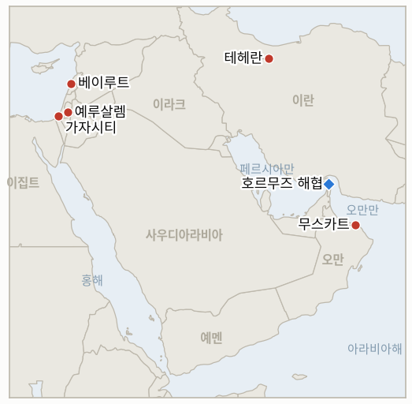

# 중동 일일 브리핑

**2026년 8월 5일**

- **보고 기간:** 약 24시간, 8월 4일 09:00 ~ 8월 5일 09:00 (한국시간)
- **종합 평가:** 화요일의 패턴은 트럼프의 "이르면 내일" 발언이 나온 월요일 이후 이 원장이 계속 추적해온 것과 같되, 이번엔 두 번째 미국측 발언자와 두 번째 피해자가 등장했다. 베센트 재무장관은 CNBC에 "오늘이나 내일 중 호르무즈 해협을 재개방하는 합의가 나올 가능성이 있다"고 말했으나, 이란 협상단의 한 위원은 목표를 전혀 다르게 설명했다. 1~3개월간 "이란이 우위를 가지는" 구도로, 안보·기뢰 제거·해상 서비스 모두 테헤란이 담당한다는 것이며, 이는 "어느 당사자도 통제하지 않는다"는 워싱턴의 설명과 정면으로 배치된다. 이 낙관론이 나온 지 몇 시간 만에, 정체불명의 발사체가 카사브 인근에서 벌크선 미노안 파이어니어호를 강타해 기관실을 무력화하고 선원 1명이 실종됐다. 이는 휴전 국면이 처음 붕괴된 이후 호르무즈 해역에서 가장 큰 피해를 낸 공격이다. 시장은 이 공격을 대체로 무시하고 낙관론만 반영했다. 브렌트유와 WTI 모두 3주 최저치로 정산됐고, 코스피는 월요일 급락분에서 1.62% 반등했다. 지난 7월 말부터 이 원장이 추적해온 세 가지 별개의 확전 위협이 모두 오늘 자체 시한(약 8월 5일)을 맞아 발동되지 않은 채 만료됐다. 아람코나 사우디 정부는 아브카이크 가동 상태를 끝내 공식 확인하지 않았고, 미국은 유조선 공격에 대한 보복으로 이란의 다리나 발전소를 끝내 타격하지 않았으며, 이란 에너지·핵시설에 대한 미국·이스라엘의 위협받은 작전도 끝내 개시되지 않았다. 가자지구도 독자적인 국면 전환을 맞았다. 네타냐후 총리 측은 발표된 평화이사회 프레임워크가 이스라엘의 입장을 반영하지 않는다며 공개 거부했고, 평화이사회는 이에 맞서기보다 그의 요구대로 순서를 다시 썼다. 하마스의 완전한 무장해제가 완료된 이후에만 이스라엘군이 옐로 라인 너머로 철수한다는 조건이다.

---

## 1. 무슨 일이 있었나

<figure style="float:right; width:46%; margin:2pt 0 8pt 14pt;">

<figcaption style="font-size:8pt; color:#666; text-align:center; margin-top:3pt; font-style:italic;">주요 논의 지점</figcaption>
</figure>

### 1.1 베센트, 호르무즈 합의가 "오늘이나 내일" 나올 수 있다 주장, 이란 협상단은 이란 주도의 다른 구도를 설명하고 확전 위협 세 건은 발동 없이 만료

스콧 베센트 재무장관은 CNBC "스쿼크박스"에서 "우리는 이란과 협상 중이며 오늘이나 내일 중 해협을 여는 합의가 나올 가능성이 있다고 본다"고 밝혔고, 별도로 이미 "꽤 많은" 선박이 호르무즈를 빠져나가는 것을 봤다고 말했다. 루비오 국무장관은 "오만과 이란 사이에 선박이 더 안전하게 통항할 수 있도록 하는 대화와 협상이 진행 중이며 우리도 관여하고 있다"고 확인했다([CNBC, Business Recorder 경유](https://www.brecorder.com/news/40433185/oil-prices-drop-7pc-to-three-week-low); [ABC News 라이브블로그](https://abcnews.com/International/live-updates/iran-live-updates-trump-deal-imminent-iran-oman/?id=135317231)). 별도 채널인 카타르 외무부는 잠재적 합의문 초안이 "회람 중"이나 미국·이란 간 직접 협상은 없다고만 밝혔다. 이란-오만 채널 자체에 대해서는 이란 외무부 대변인 바가에이가 이전에 논의되던 두 개의 통항로 대신 이제 단일 통로를 논의 중이라고 밝혔고, 이란 협상단의 사에드 아졸루 위원은 목표가 1~3개월간 "이란이 우위를 가지는" 구도라며, "협상의 기본 틀은 이란식 체제를 세우는 것이다. 안보, 기뢰 제거, 해상 서비스 모두 이란이 담당하기 때문"이라고 말했다. 이는 미국 당국자가 정면으로 반박한 내용으로, 미국측은 어떤 임시 통항로든 "이란의 승인이나 허가가 필요 없고 통행료도 없어야 한다"고 주장했다([CNN 라이브블로그, 취합 보도 인용](https://www.cnn.com/2026/08/04/world/live-news/iran-war-trump); [The War Zone, 뉴욕타임스 인용](https://www.twz.com/news-features/iran-and-oman-working-to-control-strait-of-hormuz-shaky-ceasefire-still-holding)). 한편 지난 7월 말부터 이 원장이 추적해온 세 가지 확전 위협이 오늘 자체 시한(약 8월 5일)을 맞아 모두 발동 없이 만료됐다. 아람코나 사우디 에너지부의 아브카이크 가동 상태에 대한 공식 확인이나 부인은 끝내 나오지 않았고(IND-20260729-1), 7월 31일 유조선 공격이 촉발했어야 할 미국의 이란 교량·발전소 타격은 끝내 없었으며(IND-20260801-1), 8월 1일부터 임박했다고 보도된 이란 에너지·핵시설에 대한 미국·이스라엘의 광범위한 작전도 끝내 개시되지 않았다(IND-20260802-1). 세 지표 모두 이번 보고에서 공식 반증 처리된다(§3.2). **신뢰도: 높음** — 베센트와 루비오의 발언, 카타르의 입장(1~2등급, 미국·카타르 공식 발언, 다수 매체). **신뢰도: 중간** — 아졸루의 발언과 "이란 우위" 구도는 단일 라이브블로그 계열 보도에 근거하며 이 브리핑이 직접 재확인하지는 못했다. **신뢰도: 높음** — 세 지표의 만료는 이 원장이 각 위협 발령 이후 매일 추적해온 부재 증거에 근거한다.

### 1.2 오만 인근에서 이틀 새 두 번째 유조선 피격, 이번엔 실종 선원 발생

그리스 소유, 라이베리아 선적의 벌크선 미노안 파이어니어호가 오만 카사브 인근 호르무즈 해협을 북상 중 정체불명의 발사체에 피격돼 기관실이 파손되고 전원이 끊기며 거주구역에 화재가 발생했다. 이 선박의 3등 기관사가 실종됐으며, 인근을 지나던 파나마 선적 유조선 수리남 프로스퍼리티호가 완전 정전 상태에 빠진 미노안 파이어니어호의 최초 조난 신호를 중계했다([Riviera Maritime](https://www.rivieramm.com/news-content-hub/one-seafarer-missing-after-bulker-struck-in-the-strait-of-hormuz-leaves-bulker-in-complete-blackout-89579); [Splash247](https://splash247.com/crewmember-missing-after-bulker-struck-in-hormuz/)). 어느 세력도 공격을 주장하지 않아, 거의 같은 지점에서 발생한 월요일의 유조선 벨로스 앰버호 폭발 사건과 같은 무주장 패턴을 이어갔다(2026년 8월 4일 브리핑 §1.4). 이는 이번 전쟁에서 수 주 만에 처음 확인된 호르무즈 인근 선박 피격에 따른 선원 인명 피해이며, 오늘 시한을 맞아 만료된 IND-20260801-1의 보복 발동 기준과 해협이 재개방으로 향하고 있다는 IND-20260804-1의 주장을 직접 시험한다(§3.2). **신뢰도: 중상** — 피격 사실, 기관실 손상, 실종 선원(2등급 전문 해운 매체, 다수 매체 확인이나 이 브리핑이 직접 검토한 UKMTO 1차 성명은 없음). **신뢰도: 낮음** — 책임 소재는 전혀 규명되지 않았다.

### 1.3 네타냐후 측, 발표된 가자지구 프레임워크 거부, 평화이사회는 그의 요구대로 조건 개정

니콜라이 믈라데노프 특사와의 월요일 회동에 앞서 네타냐후 총리 측은 공개된 평화이사회 합의문이 "이스라엘의 입장을 반영하지 않는다"고 밝혔고, 특히 터키·카타르의 무장해제 감시 참여, 이스라엘이 아닌 팔레스타인 주도 국가위원회가 무장해제된 무기를 보관하는 방안에 반대했으며, "무기가 가자지구를 떠나야 한다"며 이스라엘 자신의 철군 조치보다 앞서 무장해제에 대한 이스라엘의 승인이 있어야 한다고 요구했다([Jerusalem Post](https://www.jpost.com/middle-east/article-904441)). 평화이사회는 이 요구에 맞서기보다 조건을 다시 썼다. 자신들의 고위대표가 며칠 전 승인했던 단계적, "보조를 맞춘" 철수 문구를 삭제하고, 대신 "[이스라엘군]의 옐로 라인 너머 철수는 하마스가 중재자들에게 약속한 대로 무장해제가 완료된 이후에만 이뤄진다"고 명시했다. 이는 네타냐후의 최대주의적 입장에 훨씬 가까운 순서다([Al Jazeera](https://www.aljazeera.com/news/2026/8/4/board-of-peace-says-no-israeli-withdrawal-from-gaza-before-hamas-disarms); [Middle East Eye](https://www.middleeasteye.net/news/board-peace-caves-netanyahu-and-rewrites-gaza-withdrawal-terms)). 스모트리치 재무장관은 여전히 이 결과가 내각이 승인했던 것과 "완전히 다르다"며 재표결을 요구했고, 트럼프 특사 재러드 쿠슈너가 별도로 주장한 공습 중단 합의는 한 망명 팔레스타인 당국자의 성급한 발표 이후 몇 시간 만에 철회됐다. 이는 새로 개설된 IND-20260805-1이 추적하는 실시간 시험으로, 기존의 더 넓은 IND-20260801-2보다 시한이 짧고 좁다(§3.2). **신뢰도: 높음** — 네타냐후 측의 거부 성명과 평화이사회의 개정 문구, 모두 공식 발언이며 다수 매체가 확인(1~2등급). **신뢰도: 중간** — 이 개정이 얼마나 지속될지는, 이스라엘 안보내각의 공식 표결이 아직 없고 하마스도 바뀐 조건에 아직 공개 대응하지 않았기 때문에 불확실하다.

### 1.4 유가는 3주 최저로 하락, 코스피는 월요일 급락분 상당폭 회복

브렌트유는 5.3%(4.41달러) 하락한 79.36달러, WTI는 5.7%(4.57달러) 하락한 75.77달러로 정산돼 모두 7월 13일 이후 최저치를 기록했다. 베센트와 카타르의 발언이 시장으로 하여금 월요일의 호르무즈 합의 낙관론을 계속 반영하게 했으며, 이는 미노안 파이어니어호 공격(§1.2)이 해협이 여전히 실질적으로 분쟁 지역임을 보여준 것과 대조된다([Reuters, Lufkin Daily News 경유](https://lufkindailynews.com/news_reuters/business/oil-prices-settle-5-lower-after-claims-of-progress-in-us-iran-talks/article_79873794-05ca-5f38-8574-bae1d5d83985.html)). 코스피는 비메모리 순환매 장세 속에 1.62%(+101.50포인트) 반등한 6,358.95로 마감해 월요일의 5.12% 레버리지발 급락분 대부분을 회복했으며, 이 원장의 에어포켓 지표가 확증 기준으로 삼는 6,398 수준까지 0.6%만을 남겼다. 원화는 1,432.5원으로 소폭 약세를 보여 월요일 종가 대비 2.7원 올랐다([Money Today](https://www.mt.co.kr/amp/stock/2026/08/04/2026080415154089277)). 브렌트유가 80달러 아래로 정산되며 월요일 시작된 90달러 미만 흐름이 이어졌고, 코스피의 반등은 시한이 하루 남은 IND-20260804-2를 확증 쪽으로 기울인다(§3.2). **신뢰도: 높음** — 정산가와 코스피·원화 종가(1등급 거래소 데이터, 다수 매체). **신뢰도: 중간** — 화요일 유가 움직임이 베센트의 발언에서 구체적으로 비롯됐다는 인과 해석은, 누적된 호르무즈 합의 심리 전반이 아니라 특정 발언 때문이라 단정하기 어렵다.

### 1.5 이스라엘·레바논, 시범 구역 시한 이틀 앞두고 로마 7차 회담 개막

이스라엘, 레바논, 미국은 화요일 로마에서 미국이 중재하는 7차 회담을 개막했다. 레바논 대표단은 전 주미대사 시몬 카람이 이끌며 현 주미대사 나다 하마데와 전문 군사팀이 동행했다. 사흘간 진행되는 이번 회담은 자우타르 알가르비예를 넘어선 시범 구역 철수 모델 확대, 국경 현안 해결, 6월 합의된 3자 틀 아래 헤즈볼라 무장해제와 이스라엘군 철수 추진에 초점을 맞춘다([Al Jazeera](https://www.aljazeera.com/news/2026/8/4/seventh-round-of-israel-lebanon-talks-begins-whats-on-the-agenda); [Al-Monitor](https://www.al-monitor.com/originals/2026/08/what-know-about-lebanon-israel-7th-round-talks-held-rome)). 이번 보고 기간 중 두 번째로 검증된 철수-레바논군 배치 구역은 확인되지 않았으며, IND-20260723-2 자체의 약 8월 6일 시한을 이틀 앞두고 있다(§3.2). **신뢰도: 높음** — 회담 개막과 명시된 의제(1~2등급, 미 국무부 확인, 다수 매체). **신뢰도: 낮음** — 로마 회담이 실제 두 번째 철수로 이어질지는, 이전 보고들이 전한 자우타르 알샤르키예 주변의 지속적인 마찰과 이스라엘군 작전 지속을 감안하면 낮음.

---

## 2. 심층 분석: 유인과 동기

### 2.1 오늘의 호르무즈 합의 주장을 트럼프가 아닌 베센트가 내놓은 이유는 무엇이며, 이란은 왜 미국의 설명과 다른 구도를 내놓나?

재무장관의 주장은 대통령의 트루스소셜 게시물이 갖지 못한 기술관료적, 시장을 움직이는 신뢰도를 지니고 있어, 24~48시간 시한을 어겨온 지금까지의 패턴에 덜 오염된 발화자를 통해 월요일과 같은 각본(구체적이고 임박한 듯한 주장으로 유가를 움직이는 것)을 다시 실행할 수 있게 한다. 이란 입장에서는 "이란이 우위를 가지는" 임시 구도를 설명하는 것이 향후 어떤 재개방이든 워싱턴의 압박에 굴복한 것이 아니라 테헤란이 얻어낸 협상 성과로 국내에 내세울 수 있게 하며, 이는 이란이 오만 채널을 확인한 이후 계속 적용해온 것과 같은 주권 수호 논리다(2026년 8월 4일 브리핑 §2.2). 워싱턴의 "어느 당사자도 통제하지 않는다"는 주장과 이란의 "이란이 우위를 가진다"는 주장 사이의 간극은 소통의 실패가 아니라, 각자가 국내적으로 필요한 결과를 서술하고 있는 것이다.

### 2.2 네타냐후 측의 공개 거부는 왜 결렬이 아니라 평화이사회의 양보로 이어졌나?

평화이사회의 존속은 서류상으로만 그럴듯한 합의가 아니라 이스라엘이 실제로 이행할 합의를 내놓는 데 달려 있다. 순서를 다시 써 하마스의 완전한 무장해제를 철수보다 앞세우는 것은 단기적으로 평화이사회에 큰 부담이 되지 않는다. 하마스는 이미 조건부 서약을 통해 신뢰를 얻고 싶어 하는 만큼 완전히 발을 뺄 처지가 아니기 때문이다. 반면 이는 네타냐후에게, 스모트리치를 포함한 자신의 연립정부가 이미 불충분하다고 비판하던 프레임워크에 그냥 굴복한 것이 아니라 공개적인 양보를 얻어냈다는 국내적 명분을 준다.

### 2.3 확전 위협 세 건이 왜 모두 같은 날 발동 없이 만료됐나?

아브카이크 확인, 다리·발전소 보복, 더 넓은 에너지·핵시설 작전이라는 세 위협은 모두 8월 2일 무렵 워싱턴이 내린 같은 근본적 판단에서 비롯됐다. 즉 이란에 대한 전면적 인프라 작전이 갖는 경제적·정치적 비용이, 개별 사건이 격앙된 순간 내걸었던 위협을 실제로 이행하는 가치보다 크다는 판단이다. 따라서 트럼프가 서사의 축을 주장된 합의 쪽으로 옮기자, 이전 확전 국면과 연결된 모든 위협은 이란이 어떤 조건도 충족했기 때문이 아니라 행정부의 관심 자체가 옮겨갔기 때문에 발동 근거를 잃었다.

### 2.4 화요일의 유조선 공격을 시장은 왜 월요일보다 덜 중요하게 취급하며 유가를 3주 최저로 끌어내렸나?

48시간 안에 발생한 두 번째 무주장 유조선 공격은, 몇 주째 이어진 유사한 무주장 사건들 뒤에 나온 것이어서 가격 결정에 새로운 정보로 기능하기를 멈췄다. 트레이더들은 이미 호르무즈 통항이 분쟁 상태지만 완전히 폐쇄되지는 않는 기준선을 가격에 반영해 놓은 상태다. 반면 베센트와 루비오의 공식 발언은 새롭고 구체적이며 시장을 움직이는 권한을 가진 미국 당국자에게 귀속될 수 있다. 따라서 7월 15일 브리핑 §2.3에서 짚었던 비대칭성, 즉 구체적 주장이 부인이나 모호한 폭력보다 거래에 더 쉽게 반영된다는 점은, 안보 상황 자체가 실질적으로 개선되지 않았음에도 여전히 유효하다.

---

## 3. 한국에 대한 정책적 함의

### 3.1 익스포저 현황

| 항목 | 현재 수치 | 출처 |
| --- | --- | --- |
| 7~8월 원유 도입 | 전년 동기 대비 110% 이상 확보 (산업통상자원부, 7월 21일) | 산업통상자원부, 헤럴드경제·영유데일리 인용; `korea-exposure.md` |
| 9월 원유 도입 | 90% 이상 확보 (산업통상자원부, 7월 21일) | 산업통상자원부, 헤럴드경제 인용; `korea-exposure.md` |
| 전략비축유 보유 여력 | 실제 소비 기준 약 26일 (추정치); 스와프는 즉시 시행 대기 상태이나 대규모 실행은 미검증 | CSIS; 산업통상자원부 7월 27일 |
| 걸프 지역 한국 국민·선박 | 약 43명 (한국 선박 13명, 외국 선박 30명, 6월 말 기준); 외교부, 17개 재외공관과 안전 점검 실시 | 외교부; 코리아헤럴드 |
| 브렌트·WTI | 각각 79.36달러(-5.3%), 75.77달러(-5.7%) 정산, 모두 3주 최저치, 베센트의 호르무즈 합의 주장에 하락 | Reuters, Lufkin Daily News 경유 |
| 코스피·원달러 | 코스피 +1.62% 6,358.95 (월요일 급락분 상당폭 회복, 비메모리 순환매); 원화는 1,432.5원으로 소폭 약세 | Money Today |
| 호르무즈 통항량 | 8월 2일 확인된 통항 9건 (Kpler, 가장 최근 발표치); 이번 보고 기간 중 새 집계 없음 | Kpler |
| 미 중부사령부 해상 봉쇄 | 8월 3일 기준 상선 44척 우회, 2척 무력화, 2척 승선 검색 (이번 보고 기간 중 변동 없음, 새 발표 없음) | 미 중부사령부 |

### 3.2 사안별 함의

**베센트가 트럼프의 "재개방 임박" 주장을 되풀이하는 동시에 이란 협상단은 전혀 다른, 이란 주도의 구도를 설명하고 있고, 여기에 새로운 유조선 인명 피해까지 더해진 것은, 모든 미국측 재개방 주장을 독립 추적기관이 실제 해상 변화를 보고할 때까지 미확인 상태로 취급해야 한다는 근거를 더한다.** 산업통상자원부와 한국석유공사의 하반기 계획은, 오늘의 뉴스가 IND-20260728-3 개설 이후 이 원장이 추적해온 패턴에 두 번째 상반된 미국측 발언자(트럼프·CBS 취재원의 "새 협상 없음" 보도에 더해 베센트까지)를 더했다는 점에 유의해야 한다. 8월 3일 이후 변동 없는 미 중부사령부의 봉쇄(44척)만이 유일하게 검증된 사실로 남는다.

**세 확전 위협(아브카이크 확인, 다리·발전소 보복, 에너지·핵시설 작전)이 모두 자체 시한(약 8월 5일)에 반증 처리된 것은, 한국의 하반기 유가 계획에 다소나마 실질적인 위험 완화 신호다.** 아브카이크 가동 중단 확인, 이란 민간 인프라에 대한 미국의 타격, 전면적 에너지·핵시설 작전이라는 세 가지 최악의 시나리오 중 무엇도 현실화되지 않았다. 이는 봉쇄와 통항 교란 자체는 여전히 미해결로 남아 있음에도, 단기 계획에 최악의 공급 충격 시나리오를 반영하는 데는 반대 근거가 된다.

**평화이사회가 네타냐후에게 양보한 것이 그대로 유지된다면, 이는 한국 해운·인력 익스포저와 관련된 가자지구발 위험의 성격을, "프레임워크 붕괴"에서 "무장해제 검증을 둘러싼 장기적이고 낮은 강도의 마찰"로 바꾸는, 실질적으로 다른 계획 시나리오다.** 외교부의 걸프 안전 점검은 IND-20260805-1의 약 8월 12일 시한을 이 프레임워크가 실제로 단기 폭력을 줄이는지 보여줄 다음 구체적 시험대로 삼아야 한다.

**검증 가능한 지표:**

- **IND-20260805-1** — 하마스 무장해제 선행 방식으로 개정된 가자지구 프레임워크가 실제 수용된 합의로 수렴되는지, 아니면 다시 교착 상태로 돌아가는지. 2026년 8월 12일까지 이스라엘 안보내각이 개정된 프레임워크를 공식 표결로 승인하고 하마스가 이를 원래 합의를 저버린 것으로 공개 거부하지 않으면 실질적 수렴이 확증된다. 2026년 8월 12일까지 안보내각의 공식 거부, 지속적인 미승인, 또는 하마스의 개정 조건에 대한 공개적 거부가 있으면 수렴이 반증되며 프레임워크는 교착 상태로 되돌아간다.

**이번 보고에서 해소된 지표:**

- **IND-20260729-1 — 반증.** 위성 사진이 실제 화재 피해를 확인한 지 7일이 지나도록, 아람코나 사우디 에너지부의 아브카이크 가동 상태에 대한 1차 공식 발표는 약 8월 5일 시한까지 끝내 나오지 않았다. 완전 가동 중단이라는 주장은 위성·OSINT 추론 이상으로 나아가지 못했으며, 판단은 확증된 지속적 중단이 아니라 피해를 동반한 요격 수준으로 하향 조정된다.
- **IND-20260801-1 — 반증.** 트럼프의 7월 22일 위협이 명시한 5일의 창 안에, 새롭고 더 큰 피해를 낸 유조선 공격(§1.2)이 문언상 보복을 촉발했어야 함에도, 미국의 이란 교량·발전소 또는 이에 준하는 민간 인프라에 대한 검증된 타격은 전혀 없었다. 이 최후통첩은 발동력 없는 억지 수단이며, 이번 전쟁 내내 이란의 유조선 공격이 이 조항에서만큼은 응답받지 못해온 패턴과 일치한다.
- **IND-20260802-1 — 반증.** 8월 1일 임박한 것으로 처음 보도된 이래, 이란의 발전소·정유소·석유화학시설·핵시설에 대한 미국·이스라엘의 검증된 타격은 어떤 시점에도 발생하지 않았다. 전쟁의 무게중심은 대신 분쟁 중인 호르무즈 합의 논의 트랙(§1.1)과 이란-오만 통항로 협상으로 옮겨갔으며, 이는 7월 말 이후 이 원장이 추적해온 유예되거나 철회된 확전의 패턴과 일치한다.

---

## 4. 관찰 목록

- **하마스 무장해제 선행 방식으로 개정된 가자지구 프레임워크가 수용된 합의로 수렴될지, 다시 교착될지** (IND-20260805-1, 시한 8월 12일).
- **트럼프 또는 베센트의 호르무즈 재개방 주장이 실제 확인 가능한 변화로 이어질지** (IND-20260804-1, 시한 8월 6일).
- **월요일 코스피 급락이 완전히 되돌려질지, 레버리지 청산이 재개될지** (IND-20260804-2, 시한 8월 6일).
- **이란-오만 호르무즈 관리 협상이 공개 틀로 이어질지**, 미국측 주장과는 여전히 별개 (IND-20260803-1, 시한 8월 10일).
- **워싱턴 외의 누구라도 트럼프가 주장한 구체적 합의 조건을 확인해줄지** (IND-20260803-2, 시한 8월 9일).
- **평화이사회 프레임워크가 이스라엘 정부의 공식 답변을 받을지**, 이제 두 개의 시간 축으로 추적 (IND-20260801-2, 시한 8월 15일; IND-20260805-1, 시한 8월 12일).
- **쿠웨이트의 제51조 원용 뒤에 항의를 넘어서는 조치가 뒤따를지** (IND-20260802-2, 시한 8월 15일).
- **로마 7차 이스라엘·레바논 회담이 두 번째 시범 구역 철수로 이어질지**, 약 8월 6일 시한을 앞두고 (IND-20260723-2).
- **다미에타 공격의 책임 소재가 공식적으로 규명될지** (IND-20260801-3, 시한 8월 14일).
- **카타르 라스라판 LNG 동결이 알아리시호에 이어 추가 만적 출항으로 이어질지**, 시한 하루 전 (IND-20260731-2, 시한 8월 6일).
- **미노안 파이어니어호 공격의 책임 소재가 규명될지**, 월요일 벨로스 앰버호 사건과 같은 무주장 패턴을 따르는 중.

---

## 5. 출처 신뢰도 요약

| 주장 | 출처 | 신뢰도 |
| --- | --- | --- |
| 베센트, 호르무즈 합의가 "오늘이나 내일" 나올 수 있다 주장; 루비오, 오만-이란 협상 확인 | CNBC, Business Recorder 경유; ABC News 라이브블로그 (1~2등급, 미국 당국 공식 발언, 다수 매체) | 높음 |
| 이란의 아졸루, 1~3개월간 "이란 우위" 구도 설명; 단일 통항로 논의 중 | CNN 라이브블로그 (취합), The War Zone, 뉴욕타임스 인용 (1~2등급이나 직접 재확인은 못함) | 중간 |
| 확전 위협 세 건(아브카이크 확인, 다리·발전소 보복, 에너지·핵시설 작전) 모두 약 8월 5일 시한에 발동 없이 만료 | 이 원장이 7월 말 이후 매일 추적한 자체 기록 (부재 증거, 이번 보고 기간의 전체 조사와 대조 확인) | 높음 |
| 미노안 파이어니어호, 카사브 인근 피격, 기관실 손상, 정전, 화재, 3등 기관사 실종 | Riviera Maritime, Splash247 (2등급 전문 해운 매체, 다수 매체이나 UKMTO 1차 성명 직접 검토는 없음) | 중상 |
| 네타냐후 측, 발표된 가자지구 프레임워크가 이스라엘 입장을 반영하지 않는다며 거부; 무기 보관·감시 관련 구체적 이의 | Jerusalem Post (1~2등급, 이스라엘 당국 공식 발언) | 높음 |
| 평화이사회, 하마스 완전 무장해제를 옐로 라인 너머 이스라엘 철군보다 앞세우는 조건으로 프레임워크 개정 | Al Jazeera, Middle East Eye (1~2등급, 평화이사회 공식 발언, 다수 매체) | 높음 |
| 브렌트유 -5.3% 79.36달러, WTI -5.7% 75.77달러 정산, 모두 3주 최저 | Reuters, Lufkin Daily News 경유 (1~2등급, 통신사 경유 거래소 정산 데이터) | 높음 |
| 코스피 +1.62% 6,358.95, 비메모리 순환매; 원화는 1,432.5원으로 소폭 약세 | Money Today (2~3등급, 한국 금융 언론, 거래소 데이터) | 높음 |
| 로마 이스라엘·레바논 7차 회담 개막, 시범 구역·국경·헤즈볼라 무장해제 등 사흘 의제 | Al Jazeera, Al-Monitor (1~2등급, 미 국무부 확인, 다수 매체) | 높음 |
