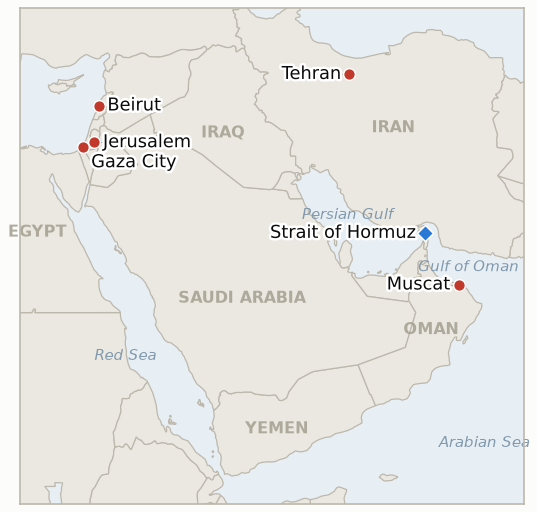

# Middle East Daily Briefing

**August 5, 2026**

- **Reporting window:** ~24 hours, August 4, 09:00 to August 5, 09:00 KST
- **Overall assessment:** Tuesday's pattern is the same one this ledger has tracked since Trump's "as early as tomorrow" claim broke Monday, now with a second US voice and a second victim. Treasury Secretary Bessent told CNBC "there is a chance we may have a deal today or tomorrow" to reopen the Strait of Hormuz, while a member of Iran's negotiating committee described the goal very differently: a one-to-three-month arrangement "where Iran is dominant," with security, demining and maritime services all handled by Tehran, directly contradicting Washington's "no party controls it" framing. Hours into that optimism, an unclaimed projectile struck the bulk carrier Minoan Pioneer near Khasab, disabling her engine room and leaving one crewman missing, the most damaging Hormuz-area attack since the pause first collapsed. Markets shrugged off the attack and priced the claim instead: Brent and WTI both settled at three-week lows, while KOSPI rebounded 1.62% from Monday's plunge. Three separate war-escalation threats this ledger has tracked since late July, all reaching their own ~August 5 deadlines today, expired unfired: no Aramco or Saudi statement ever confirmed Abqaiq's operational status, no US strike ever hit an Iranian bridge or power plant in retaliation for a tanker attack, and the threatened US/Israeli campaign against Iranian energy and nuclear infrastructure never launched. Gaza took its own turn: Netanyahu's office publicly rejected the announced Board of Peace framework as not reflecting Israel's positions, and the Board responded not by holding firm but by rewriting the sequencing on his terms, requiring Hamas's full disarmament before any Israeli withdrawal beyond the Yellow Line.

---

## 1. What Happened

<figure style="float:right; width:46%; margin:2pt 0 8pt 14pt;">

<figcaption style="font-size:8pt; color:#666; text-align:center; margin-top:3pt; font-style:italic;">Major places of discussion</figcaption>
</figure>

### 1.1 Bessent Claims a Hormuz Deal Could Come "Today or Tomorrow" as Iran's Negotiators Describe a Different Arrangement Led by Iran and Three Escalation Threats Lapse Unfired

Treasury Secretary Scott Bessent told CNBC's "Squawk Box" "we're in talks with the Iranians and I think there is a chance we may have a deal today or tomorrow to open the strait," and separately said he had seen "quite a few" ships already exiting Hormuz, while Secretary of State Rubio confirmed "there's a conversation and a negotiation that we are involved in between Oman and Iran on how more ships can be able to go through there safely" ([CNBC via Business Recorder](https://www.brecorder.com/news/40433185/oil-prices-drop-7pc-to-three-week-low); [ABC News liveblog](https://abcnews.com/International/live-updates/iran-live-updates-trump-deal-imminent-iran-oman/?id=135317231)). Qatar's Foreign Ministry, the mediator on the separate ceasefire-for-lanes track, said only that drafts of a potential agreement are "being circulated" with no direct US-Iran talks underway. On the Iran-Oman track itself, Iranian Foreign Ministry spokesman Baghaei said the two sides are now discussing a single transit corridor rather than the two previously floated, while a member of Iran's negotiating committee, Saeed Ajorlu, described the goal as an arrangement lasting one to three months "where Iran is dominant," saying "the basis of the negotiations is to establish Iranian arrangements because security, demining, and maritime services are handled by Iran" — a framing a US official directly rejected, insisting any temporary route would require "no approvals or permissions by Iran, and would involve no tolls" ([CNN liveblog, cited via aggregated wire reporting](https://www.cnn.com/2026/08/04/world/live-news/iran-war-trump); [The War Zone, citing the New York Times](https://www.twz.com/news-features/iran-and-oman-working-to-control-strait-of-hormuz-shaky-ceasefire-still-holding)). Separately, three war-escalation threats this ledger has tracked since late July all reached their own ~August 5 deadlines today without triggering: no Aramco or Saudi Energy Ministry statement ever confirmed or denied Abqaiq's operational status (IND-20260729-1), no US strike ever hit an Iranian bridge or power plant despite the July 31 tanker attack that was supposed to trigger one (IND-20260801-1), and the broad US/Israeli campaign against Iranian energy and nuclear infrastructure reported as imminent since August 1 never launched (IND-20260802-1); all three are formally falsified this run (§3.2). **Confidence: High** on Bessent's and Rubio's quotes and the Qatari statement (Tier 1-2, on-record US and Qatari officials, multi-outlet); **Medium** on the Ajorlu quote and the specific "Iran dominant" framing, sourced to a single liveblog chain not independently re-verified by this brief's direct access; **High** on the three indicator lapses, which are absence-of-evidence findings this ledger has tracked daily since each threat was issued.

### 1.2 A Second Tanker Is Struck Off Oman in Two Days, This Time With a Missing Crewman

The Greek-owned, Liberia-flagged bulk carrier Minoan Pioneer was hit by an unidentified projectile while transiting northbound through the Strait of Hormuz near Khasab, Oman, striking the engine room, knocking out power and starting a fire in the accommodation block; the ship's third engineer is missing, and the nearby Panama-flagged tanker Suriname Prosperity relayed the initial distress call after Minoan Pioneer went into a complete blackout ([Riviera Maritime](https://www.rivieramm.com/news-content-hub/one-seafarer-missing-after-bulker-struck-in-the-strait-of-hormuz-leaves-bulker-in-complete-blackout-89579); [Splash247](https://splash247.com/crewmember-missing-after-bulker-struck-in-hormuz/)). No party has claimed the attack, following the same unattributed pattern as Monday's blast near the tanker Velos Amber in almost the same location (brief 2026-08-04, §1.4). This is the war's first confirmed crew casualty from a Hormuz-area vessel strike in several weeks and directly tests IND-20260801-1's now-lapsed retaliation threshold (§3.2) and IND-20260804-1's claim that the strait is on a path to reopening (§3.2). **Confidence: Medium-High** on the strike, the engine-room damage and the missing crewman (Tier 2 specialized maritime trade press, multi-outlet corroboration, but no primary institutional UKMTO statement independently reviewed by this brief); **Low** on attribution, which remains entirely open.

### 1.3 Netanyahu's Office Rejects the Announced Gaza Framework, and the Board of Peace Rewrites It on His Terms

Ahead of Monday's meeting with envoy Nickolay Mladenov, Netanyahu's office said the publicly announced Board of Peace agreement "does not reflect Israel's positions," with officials specifically objecting to Turkish and Qatari participation in disarmament monitoring, to a plan under which a Palestinian-led National Committee rather than Israel would hold decommissioned weapons, and demanding that "the weapons leave Gaza" with Israel signing off on decommissioning before any of its own withdrawal steps ([Jerusalem Post](https://www.jpost.com/middle-east/article-904441)). The Board of Peace responded not by holding the original terms but by revising them: it dropped the phased, "lockstep" withdrawal language its own high representative had endorsed days earlier and stated instead that "the withdrawal of the [Israeli military] beyond the Yellow Line will take place only once decommissioning is complete, as Hamas committed to the mediators," a sequencing much closer to Netanyahu's maximalist position ([Al Jazeera](https://www.aljazeera.com/news/2026/8/4/board-of-peace-says-no-israeli-withdrawal-from-gaza-before-hamas-disarms); [Middle East Eye](https://www.middleeasteye.net/news/board-peace-caves-netanyahu-and-rewrites-gaza-withdrawal-terms)). Finance Minister Smotrich still called the outcome "completely different" from what the cabinet had approved and demanded a revote, and Trump envoy Jared Kushner's separately claimed breakthrough on a strikes halt was walked back within hours after an exiled Palestinian official's premature announcement. This is the live test newly tracked by IND-20260805-1, narrower and nearer-term than the standing IND-20260801-2 (§3.2). **Confidence: High** on Netanyahu's office's rejection statement and the Board's revised language, both on-record and multi-outlet (Tier 1-2); **Medium** on how durable the revision is, since no formal Israeli Security Cabinet vote has yet endorsed it and Hamas has not yet publicly responded to the changed terms.

### 1.4 Oil Sinks to Its Lowest in Three Weeks as KOSPI Rebounds From Monday's Plunge

Brent settled down 5.3% ($4.41) at $79.36 and WTI fell 5.7% ($4.57) to $75.77, both the lowest since July 13, as Bessent's and Qatar's comments pushed the market to keep pricing Monday's Hormuz-deal optimism even as the Minoan Pioneer attack (§1.2) argued the strait remains actively contested ([Reuters via Lufkin Daily News](https://lufkindailynews.com/news_reuters/business/oil-prices-settle-5-lower-after-claims-of-progress-in-us-iran-talks/article_79873794-05ca-5f38-8574-bae1d5d83985.html)). KOSPI rebounded 1.62% (+101.50) to 6,358.95 on non-memory sector rotation trading, recovering most of Monday's 5.12% leverage-driven drop and coming within 0.6% of the 6,398 level this ledger's air-pocket indicator treats as confirmation; the won weakened modestly to 1,432.5, +2.7 from Monday's close ([Money Today](https://www.mt.co.kr/amp/stock/2026/08/04/2026080415154089277)). Brent's settle below $80 extends the run of sub-$90 days that began Monday, and KOSPI's rebound leans IND-20260804-2 toward its confirmation branch with one day left on the deadline (§3.2). **Confidence: High** on the settlement figures and KOSPI/won closes (Tier 1 exchange data, multi-outlet); **Medium** on the causal read that Bessent's comments specifically, rather than accumulated Hormuz-deal sentiment generally, drove Tuesday's oil move.

### 1.5 Rome's Seventh Round of Talks Between Israel and Lebanon Opens Two Days Before the Pilot Zone Deadline

Israel, Lebanon and the US opened a seventh round of US-brokered talks in Rome on Tuesday, with Lebanon's delegation led by former Washington ambassador Simon Karam alongside current ambassador Nada Hamadeh and a specialist military team; the three-day session is focused on expanding the pilot-zone withdrawal model beyond Zawtar al-Gharbiyeh, resolving border issues, and advancing Hezbollah disarmament and IDF withdrawal under the June trilateral framework ([Al Jazeera](https://www.aljazeera.com/news/2026/8/4/seventh-round-of-israel-lebanon-talks-begins-whats-on-the-agenda); [Al-Monitor](https://www.al-monitor.com/originals/2026/08/what-know-about-lebanon-israel-7th-round-talks-held-rome)). No second verified withdrawal-plus-LAF-deployment zone was confirmed in the window, with two days left before IND-20260723-2's own ~August 6 deadline (§3.2). **Confidence: High** on the talks opening and their stated agenda (Tier 1-2, US State Department-confirmed, multi-outlet); **Low** on whether Rome produces an actual second withdrawal given the standing friction around Zawtar al-Sharqiyeh and continued IDF operations reported in prior briefs.

---

## 2. Deep Dive: Incentives and Motives

### 2.1 Why would Bessent, not Trump, be the one making today's Hormuz deal claim, and why would Iran describe a different arrangement than the US claims?

Because a Treasury Secretary's claim carries a technocratic, market-moving credibility a president's Truth Social post does not, letting the administration re-run Monday's playbook (a specific imminent-sounding claim that moves oil prices) through a messenger less discredited by the standing pattern of missed 24-48 hour deadlines; for Iran, describing a temporary arrangement "where Iran is dominant" lets Tehran frame any eventual reopening as a negotiated concession it extracted rather than a capitulation to US pressure, the same sovereignty-preserving logic it has applied to the Oman channel since Iran first confirmed those talks (brief 2026-08-04, §2.2) — the gap between Washington's "no party controls it" claim and Iran's "Iran is dominant" claim is not a communication failure but each side describing the outcome it needs to claim domestically.

### 2.2 Why would Netanyahu's public rejection produce a Board of Peace concession rather than a breakdown?

Because the Board of Peace's institutional survival depends on producing an agreement Israel will actually implement, not one that reads well on paper and then collapses on contact with Israeli cabinet politics; rewriting the sequencing to require full Hamas disarmament before withdrawal costs the Board little in the short term (Hamas is not yet positioned to walk away entirely, having already made a conditional pledge it wants credit for) while buying Netanyahu the domestic cover of having forced a public concession rather than simply capitulating to a framework his own coalition, including Smotrich, was already calling insufficient.

### 2.3 Why would three separate escalation threats all lapse on the same day without any of them being triggered?

Because all three threats (Abqaiq confirmation, bridge-or-power-plant retaliation, the broader energy/nuclear campaign) were downstream of the same underlying calculation Washington made around August 2: that the economic and political cost of a full infrastructure campaign against Iran outweighs the value of following through on threats issued in the heat of individual incidents, so once Trump pivoted the narrative toward a claimed deal, every threat tied to the prior escalation track lost its own reason to fire, not because Iran met any of their conditions but because the administration's attention itself moved on.

### 2.4 Why would markets treat Tuesday's tanker attack as less important than Monday's, sending oil to its lowest in three weeks anyway?

Because a second unattributed tanker strike within 48 hours, following weeks of similar unclaimed incidents, has stopped functioning as fresh information for pricing purposes — traders have effectively priced in a baseline rate of contested-but-not-closed Hormuz transit — while Bessent's and Rubio's on-record comments are new, specific, and attributable to named US officials with market-moving authority, so the asymmetry in Section 2.3 of the July 15 brief (specific claims trade more easily than denials or ambiguous violence) continues to hold even as the underlying security situation has not materially improved.

---

## 3. Policy Implications for South Korea

### 3.1 Exposure snapshot

| Item | Current reading | Source |
| --- | --- | --- |
| July-August crude procurement | 110%+ of prior-year volume secured (MOTIE, July 21) | MOTIE via Herald Business, Youth Daily; `korea-exposure.md` |
| September crude procurement | 90%+ secured (MOTIE, July 21) | MOTIE via Herald Business; `korea-exposure.md` |
| Strategic reserve coverage | ~26 days of actual consumption (estimate); swap on immediate standby, untested at scale | CSIS; MOTIE July 27 |
| Korean nationals/vessels in Gulf | ~43 (13 aboard Korean vessels, 30 aboard foreign vessels) as of late June; MOFA reviewed safety with 17 missions | MOFA; Korea Herald |
| Brent / WTI | $79.36 / $75.77 settle, both down (-5.3% / -5.7%), both three-week lows, on Bessent's Hormuz-deal claim | Reuters via Lufkin Daily News |
| KOSPI / USD-KRW | KOSPI +1.62% to 6,358.95 (rebound from Monday's plunge, non-memory rotation); won weakened modestly to 1,432.5 | Money Today |
| Hormuz transits | 9 confirmed crossings, August 2 (Kpler, last available print); no fresher count in the window | Kpler |
| CENTCOM naval blockade | 44 commercial vessels redirected, 2 disabled, 2 boarded as of August 3 (unchanged in the window, no fresher CENTCOM update found) | CENTCOM |

### 3.2 Implications by development

**Bessent's echo of Trump's "reopening imminent" claim, alongside Iran's own negotiators describing a materially different, Iran-led arrangement and a fresh tanker casualty, is fresh evidence for treating every US reopening claim as unconfirmed until an independent tracker reports an actual change on the water.** MOTIE and KNOC's H2 planning should note that today's news adds a second contradictory US voice (Bessent alongside Trump and the CBS-sourced "no new talks" report) to a pattern this ledger has tracked since IND-20260728-3 opened, while CENTCOM's blockade (44 vessels, unchanged since August 3) remains the only verified operative fact.

**The falsification of all three escalation threats (Abqaiq confirmation, bridge/power-plant retaliation, the energy/nuclear campaign) at their own ~August 5 deadlines is a genuine, if modest, de-risking signal for Korea's H2 oil-price planning.** None of the tail-risk scenarios this ledger has tracked since late July — a confirmed Abqaiq halt, US strikes on Iranian civilian infrastructure, or a full energy/nuclear campaign — materialized, which argues against embedding the worst-case supply-shock scenarios in near-term planning even as the underlying blockade and transit disruption persist unresolved.

**The Board of Peace's concession to Netanyahu, if it holds, changes the shape of Gaza-related risk to Korean shipping and personnel exposure from "framework collapse" toward "prolonged, lower-intensity friction" over decommissioning verification, a genuinely different planning scenario.** MOFA's Gulf safety review should treat IND-20260805-1's ~August 12 deadline as the next concrete test of whether this framework actually reduces near-term violence in the way a genuine convergence would imply.

**Testable indicators:**

- **IND-20260805-1** — The revised disarm-first Gaza framework converges into an accepted deal or collapses back into stalemate. A formal Israeli Security Cabinet vote endorsing the revised framework by ~2026-08-12, without Hamas publicly rejecting the revision as reneging on the original deal, confirms real convergence; a formal Cabinet rejection, continued non-endorsement, or a public Hamas repudiation of the revised terms by ~2026-08-12 falsifies convergence and returns the framework to stalemate.

**Resolutions this run:**

- **IND-20260729-1 — Falsified.** No primary-source Aramco or Saudi Energy Ministry statement on Abqaiq's operational status ever materialized through the ~August 5 deadline, seven days after satellite imagery confirmed real fire damage. The full-operational-halt claim never advanced beyond OSINT and satellite inference; the read is downgraded back toward interception-with-damage rather than a confirmed sustained halt.
- **IND-20260801-1 — Falsified.** No verified US strike on an Iranian bridge, power plant or comparable civilian infrastructure target occurred within the five-day window Trump's July 22 threat specified, despite a fresh, more damaging tanker strike (§1.2) that by the letter of the threat should have triggered retaliation. The ultimatum is an unenforced deterrent, consistent with every prior Iranian tanker strike this war going unanswered on this specific term.
- **IND-20260802-1 — Falsified.** No verified US or Israeli strike on an Iranian power plant, refinery, petrochemical facility or nuclear site occurred at any point since the campaign was first reported as imminent on August 1. The war's center of gravity moved instead to the disputed Hormuz-deal talks track (§1.1) and the Iran-Oman lanes negotiation, consistent with the pattern of paused or walked-back escalation this ledger has tracked since late July.

---

## 4. Watch List

- **Whether the revised disarm-first Gaza framework converges into an accepted deal or collapses back into stalemate** (IND-20260805-1, deadline August 12).
- **Whether Trump's or Bessent's Hormuz reopening claims produce any verified change on the water** (IND-20260804-1, deadline August 6).
- **Whether Monday's KOSPI plunge fully reverses or the leverage unwind resumes** (IND-20260804-2, deadline August 6).
- **Whether the Iran-Oman Hormuz management talks produce a public framework**, distinct from the disputed US claims (IND-20260803-1, deadline August 10).
- **Whether any party besides Washington corroborates Trump's specific claimed deal terms** (IND-20260803-2, deadline August 9).
- **Whether the Board of Peace framework gets a formal Israeli government answer**, now tracked at two timescales (IND-20260801-2, deadline August 15; IND-20260805-1, deadline August 12).
- **Whether Kuwait's Article 51 invocation is followed by any action beyond protest** (IND-20260802-2, deadline August 15).
- **Whether Rome's seventh round of Israel-Lebanon talks produces a second pilot-zone withdrawal** before its ~August 6 deadline (IND-20260723-2).
- **Whether the Damietta attack is ever formally attributed** (IND-20260801-3, deadline August 14).
- **Whether Qatar's Ras Laffan LNG freeze produces further laden departures** beyond the single Al Areesh transit, one day from deadline (IND-20260731-2, deadline August 6).
- **Whether the Minoan Pioneer attack is ever attributed**, following the same unclaimed pattern as Monday's Velos Amber incident.

---

## 5. Source Quality Summary

| Claim | Sources | Confidence |
| --- | --- | --- |
| Bessent says a Hormuz deal could come "today or tomorrow"; Rubio confirms Oman-Iran talks on safer transit | CNBC via Business Recorder, ABC News liveblog (Tier 1-2, on-record US officials, multi-outlet) | High |
| Iran's Ajorlu describes a 1-3 month arrangement "where Iran is dominant"; single-corridor plan under discussion | CNN liveblog (aggregated), The War Zone citing the New York Times (Tier 1-2, but not independently re-verified by direct fetch) | Medium |
| Three escalation threats (Abqaiq confirmation, bridge/power-plant retaliation, energy/nuclear campaign) all lapse unfired at ~August 5 deadlines | This ledger's own daily tracking since late July (absence-of-evidence finding, cross-referenced against the window's full research) | High |
| Minoan Pioneer struck near Khasab, engine room hit, blackout, fire, third engineer missing | Riviera Maritime, Splash247 (Tier 2 specialized maritime trade press, multi-outlet, no primary UKMTO statement directly reviewed) | Medium-High |
| Netanyahu's office rejects announced Gaza framework as not reflecting Israel's positions; specific objections to weapon storage and monitoring | Jerusalem Post (Tier 1-2, on-record Israeli official sourcing) | High |
| Board of Peace revises framework to require full Hamas disarmament before Israeli withdrawal beyond the Yellow Line | Al Jazeera, Middle East Eye (Tier 1-2, on-record Board of Peace statement, multi-outlet) | High |
| Brent settles -5.3% to $79.36, WTI -5.7% to $75.77, both three-week lows | Reuters via Lufkin Daily News (Tier 1-2, exchange settlement data via wire service) | High |
| KOSPI +1.62% to 6,358.95 on non-memory rotation; won weakens modestly to 1,432.5 | Money Today (Tier 2-3, Korean financial press, exchange data) | High |
| Rome's seventh round of Israel-Lebanon talks opens, three-day agenda on pilot zones, borders and Hezbollah disarmament | Al Jazeera, Al-Monitor (Tier 1-2, US State Department-confirmed, multi-outlet) | High |
