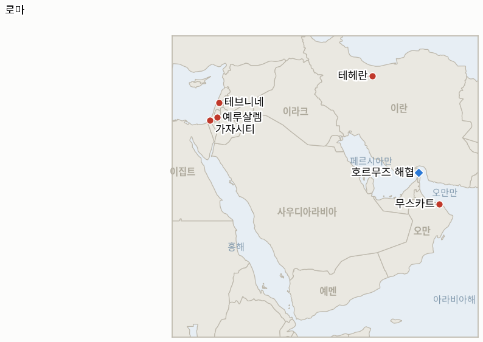

# 중동 일일 브리핑

**2026년 8월 6일**

- **보고 기간:** 약 24시간, 8월 5일 09:00 ~ 8월 6일 09:00 (한국시간)
- **종합 평가:** 수요일은 이 전쟁 들어 하루 만에 지표 네 건이 한꺼번에 해소된, 이 원장 사상 가장 많은 해소 건수를 기록한 날이었다. 그리고 이 네 건 모두를 관통하는 패턴은 베센트와 트럼프의 "오늘이나 내일" 낙관론이 구체적인 메커니즘에 대해서는 계속 틀렸으면서도, 그 인접한 무언가는 실제로 움직였다는 점이다. 이란과 오만은 자신들의 양자 항로 협정이 이제 "검토 중이며 최종 조율 단계"라고 밝혔다. 입항 선박은 이란이 조율하는 통로를, 출항 선박은 오만이 조율하는 통로를 이용하며 척당 100만~200만 달러로 알려진 통행료를 문다는 내용이다. 그러나 CNN 자체 분석은 이를 "트럼프가 원하는 합의가 아니다"라고 평가했고, 미국 당국자는 여전히 어떤 통항로든 "이란의 승인이나 허가가 필요 없고 통행료도 없어야 한다"고 고수하고 있다. 바로 이 지점 때문에 이 지표 자체의 약 8월 6일 시한에서 트럼프의 "이르면 내일 재개방" 주장은 공식 반증 처리된다. 미 중부사령부의 봉쇄는 우회 상선 45척(44척에서 증가)으로 유지됐고, Kpler는 8월 4일 통항을 단 8건으로 집계해 30건 이상의 회복 기준선과는 거리가 멀었다. 로마의 이스라엘·레바논 회담은 시한을 놓친 정도가 아니라 더 나쁜 결과를 맞았다. 이스라엘은 남부 레바논 마을 테브니네를 공습해 1명이 숨지고 12명이 다쳤고, 근거를 공개하지 않은 채 "명백한 휴전 위반"을 이유로 만수리에 새 대피령을 내려 그날 회담 일정을 조기 종료시켰다. 2주간의 외교적 준비 끝에 2차 시범 구역 확대 시험은 시한을 하루 넘겨 반증 처리된다. 가자지구 프레임워크는 의도적으로 미해결 상태로 남았다. 네타냐후 총리는 기자들에게 "하마스가 완전히 무장해제될 때까지 현 전선에서 철수하지 않겠다"고 말해 자신의 최대주의적 순서를 재확인했을 뿐, 연립정부를 공식 안보내각 표결로 이끌지는 않았다. 그런데도 평화이사회 특사 니콜라이 믈라데노프는 그와의 회동을 "건설적"이라 평가하며 공습 중단을 촉구했다. 시장은 한국에 그나마 명확한 호재를 안겼다. 코스피는 사상 최고치인 6,598.26으로 마감해 3.76% 상승했고, 이 원장이 에어포켓 확증 기준선으로 설정한 6,398선을 확실히 넘어서면서 월요일의 급락이 재개된 레버리지 청산이 아니라 하루짜리 기술적 급락이었다는 판단을 공식적으로 확정했다.

---

## 1. 무슨 일이 있었나

<figure style="float:right; width:46%; margin:2pt 0 8pt 14pt;">

<figcaption style="font-size:8pt; color:#666; text-align:center; margin-top:3pt; font-style:italic;">주요 논의 지점</figcaption>
</figure>

### 1.1 이란·오만, 호르무즈 항로 협정 최종 조율 중이라 발표하나 워싱턴이 원하는 합의는 아니며, 트럼프의 "내일 재개방" 주장은 공식 만료

이란 외무부 대변인 에스마일 바가에이는 이란·오만 공동성명이 "검토 중이며 최종 조율 단계"에 있다고 밝혔다. 알려진 조건에 따르면 입항 선박은 이란이 조율하는 통로를, 출항 선박은 오만이 조율하는 통로를 이용하며, 두 나라가 나눠 갖는 척당 약 100만~200만 달러의 서비스 요금이 부과된다([Bloomberg](https://www.bloomberg.com/news/articles/2026-08-05/iran-says-agreement-on-hormuz-shipping-route-reached-with-oman); [Al Jazeera](https://www.aljazeera.com/news/2026/8/5/iran-oman-us-close-to-hormuz-deal-what-do-they-all-want)). CNN 자체 분석은 이 구도를 "호르무즈 해협 합의는 형태를 갖춰가고 있으나 트럼프가 원하는 합의는 아니다"라는 제목으로 다뤘다. 미국 당국자는 어떤 통항로든 "이란의 승인이나 허가가 필요 없고 통행료도 없어야 한다"는 입장을 고수했고, 워싱턴은 이란이 조율하는 통로나 통행료 수용 여부를 아직 확인하지 않았다([CNN](https://www.cnn.com/2026/08/05/middleeast/hormuz-iran-oman-agreement-analysis-intl)). 트럼프 대통령은 별도로 기자들에게 "일어날 수 있다. 내일이나 모레"라고 말하면서도 이란이 "다시 발을 뺀다면 아주 세게 얻어맞을 것"이라 경고했다([Washington Times](https://www.washingtontimes.com/news/2026/aug/5/donald-trump-sees-progress-deal-iran-reopen-strait-hormuz/)). 이런 배경 속에 IND-20260804-1 자체의 약 8월 6일 시한이 도래했으나 물리적 검증 기준 어느 쪽도 충족되지 않았다. 미 중부사령부의 봉쇄는 우회 상선 45척(44척에서 증가), 무력화 2척, 승선 검색 2척으로 유지됐고, 중부사령부의 공식 입장도 "남쪽 항로는… 계속 자유롭게 개방돼 있다"였다. 반면 Kpler는 8월 4일 통항을 단 8척(유조선 5척, 벌크선 3척)으로 집계해 하루 20건이라는 교란 기준선은 물론 30건 이상의 회복 기준선에도 한참 못 미쳤다([Tribune India](https://www.tribuneindia.com/news/commercial-vessels/southern-route-through-strait-of-hormuz-remains-free-and-open-for-commercial-vessels-despite-iranian-aggression-us-centcom); [Jerusalem Post](https://www.jpost.com/middle-east/article-904620)). **반증**(§3.2). 워싱턴이 이란·오만 조건을 수용할지에 대한 별도 질문은 새로 개설된 IND-20260806-1이 추적한다. **신뢰도: 높음** — 중부사령부 봉쇄 수치와 Kpler 통항 집계(1~2등급, 미군 공식 발표와 전문 무역 데이터, 다수 매체). **신뢰도: 중상** — 이란·오만 합의의 알려진 조건은 Bloomberg와 Al Jazeera에 근거하나 아직 최종 공개 문서는 아니다. **신뢰도: 높음** — 지표의 반증 처리는 사전에 정한 물리적 검증 기준에 대한 부재 증거에 근거한다.

### 1.2 이스라엘, 로마 회담 도중 테브니네 공습 및 신규 대피령, 2차 시범 구역 시한 발동 없이 만료

이스라엘군은 남부 레바논 만수리 마을 주민들에게 몇 주 만에 처음으로 대피령을 내리면서, 헤즈볼라의 "명백한 휴전 위반"이라 주장했으나 공개적으로 근거를 제시하지는 않았다. 이어 테브니네에 공습을 가해 레바논 보건당국에 따르면 1명이 숨지고 12명이 다쳤다([France24](https://www.france24.com/en/middle-east/20260805-israel-resumes-military-strikes-on-southern-lebanon-as-rome-hosts-peace-talks); [Washington Times](https://www.washingtontimes.com/news/2026/aug/5/israeli-military-strikes-town-southern-lebanon-saying-hezbollah/)). 이 공습은 로마에서 열린 이스라엘·레바논 7차 회담 도중 발생했으며, 통신 보도에 따르면 둘째 날 회담은 8월 6일로 예정된 공식 종료일을 앞두고 "현지 상황 때문에" 조기 종료됐다([AP, WTOP 경유](https://wtop.com/national/2026/08/here-are-the-latest-developments-in-the-middle-east/)). 이번 보고 기간 어디에서도 두 번째로 검증된 철수-레바논군 배치 구역은 확인되지 않아, IND-20260723-2는 자체의 약 8월 6일 시한에서 공식 반증 처리된다. 7월에 반환된 자우타르 알가르비예는 확대 프로그램의 시작이 아니라 일회성 시범 사례로 남는다(§3.2). 테브니네 사태가 새로운 전면 교전 국면을 여는지, 아니면 외교 트랙이 흡수하는 고립된 사건으로 남는지를 추적하는 후속 지표는 IND-20260806-2로 신설한다. **신뢰도: 높음** — 테브니네 공습, 사상자 수치, 만수리 대피령(1~2등급, 다수 매체, 레바논 보건당국 소식통). **신뢰도: 중간** — 공습과 수요일 로마 회담 조기 종료 사이의 인과 관계는, AP 통신의 서술 외에 두 사건을 직접 연결한 단일 1차 소식통이 없어 확정적이지 않다. **신뢰도: 낮음** — 이스라엘군이 주장한 휴전 위반의 근거는 전혀 공개되지 않았다.

### 1.3 네타냐후, 하마스 완전 무장해제 전까지 철군 없다 선언, 평화이사회 특사는 회동을 건설적이라 평가

네타냐후 총리는 처음으로 기자들에게 명시적으로 "하마스가 완전히 무장해제될 때까지 현 전선에서 철수하지 않겠다"고 말해, 연립정부를 평화이사회의 개정 프레임워크에 대한 공식 안보내각 표결로 이끄는 대신 자신의 최대주의적 순서를 재확인했다([Haaretz](https://www.haaretz.com/israel-news/israel-security/2026-08-05/ty-article-live/netanyahu-says-no-israeli-withdrawal-from-gaza-until-hamas-completely-disarmed/0000019f-cf85-db33-a5ff-fff5da0d0000); [Washington Post](https://www.washingtonpost.com/world/2026/08/04/israel-palestinians-hamas-war-gaza-news/03d262c0-9006-11f1-9fdc-0a725c989a7b_story.html)). 별도로 같은 보도에 따르면, 가자지구에서의 모든 이스라엘군 공습은 이제 에얄 자미르 이스라엘군 참모총장의 개인 승인을 거쳐야 한다. 평화이사회 고위대표 니콜라이 믈라데노프는 같은 날 네타냐후와 회동해 이를 "건설적"이라 평가하며 공습 중단을 촉구했고, 하마스 협상 담당자 가지 함마드는 "이스라엘 점령군이 합의상 의무를 이행하지 않으면 하마스는 가자지구 평화 합의의 어떤 단계도 이행하지 않을 것"이라며 조건부 입장을 재확인했다([Religion News](https://religionnews.com/2026/08/05/board-of-peace-envoy-meets-with-netanyahu-on-gaza-disarmament-deal-and-urges-a-halt-to-strikes/); [Al Jazeera](https://www.aljazeera.com/news/2026/8/4/board-of-peace-says-no-israeli-withdrawal-from-gaza-before-hamas-disarms)). 이번 보고 기간 중 이스라엘 안보내각의 공식 표결은 없었으며, 스모트리치 재무장관의 재표결 요구도 아직 답을 얻지 못했다. IND-20260801-2와 IND-20260805-1은 각각 약 8월 15일, 약 8월 12일 시한을 앞두고 여전히 진행 중이다(§3.2). **신뢰도: 높음** — 네타냐후의 발언과 자미르 승인 요건(1~2등급, 공식 발언, 다수 매체). **신뢰도: 중간** — 믈라데노프 회동을 "건설적"으로 규정한 대목은 단일 매체에 근거하며 이 브리핑이 전문을 직접 재확인하지는 못했다.

### 1.4 후티, 홍해에서 사우디 유조선 2척 미사일 공격 주장하며 리야드 상대 새 전선 개방

예멘 후티 반군은 홍해와 아덴만에서 사우디 선적 유조선 2척에 탄도미사일 공격을 가했다고 밝히면서, 사우디아라비아가 자국 선박을 바브엘만데브 해협에서 우회시키기로 한 결정에 대한 보복이라고 규정했다. UKMTO는 해당 해역 선박 인근에서 큰 폭발음이 있었다는 보고를 접수했으며 선원들은 무사한 것으로 전해졌다([Bloomberg](https://www.bloomberg.com/news/articles/2026-08-05/yemen-s-houthis-say-they-ll-target-tankers-in-northern-red-sea); [AP, WTOP 경유](https://wtop.com/national/2026/08/here-are-the-latest-developments-in-the-middle-east/)). 이는 앞선 며칠간 호르무즈 해협에서 추적해온 무주장 미노안 파이어니어호·벨로스 앰버호 공격(2026년 8월 4일, 8월 5일 브리핑)과는 별개의 행위자·전장이며, 바브엘만데브 우회 결정과 명시적으로 연결된 사우디 선적 선박에 대한 후티의 첫 직접 공격 주장이다. 이는 부비얀 섬 공격에 대한 쿠웨이트의 상시적인 제51조 대응 태세(IND-20260802-2)와는 별개의 걸프 국가·위협 축에 해당한다(§3.2). **신뢰도: 중간** — 후티의 주장과 그 명분(2등급, 후티 자체 발표를 통신사가 취합 보도). **신뢰도: 중간** — 해당 해역 선박 인근 사건은 UKMTO에 기록됐으나, 이 브리핑이 직접 검토한 1차 해상 안보 소식통이 후티가 주장한 공격과 명확히 연결짓지는 못했다.

### 1.5 코스피 3.76% 급등해 사상 최고치 마감, 월요일 급락이 하루짜리 에어포켓이었음을 확증

코스피는 239.31포인트(3.76%) 오른 6,598.26으로 마감해 7월 31일 기록했던 종전 최고치 6,595.45를 넘어섰고, 이 상승폭은 3거래일 만에 처음으로 매수 사이드카를 발동시켰다. 외국인 투자자는 약 1조 4,500억 원을 순매수했으며 삼성전자(+2.5%)와 SK하이닉스(+5.8%)가 상승을 이끌었다([Hankyung](https://www.hankyung.com/article/2026080554876); [Etoday](https://www.etoday.co.kr/news/view/2611385)). 한국 금융 언론은 두 가지 겹치는 요인을 지목했다. 하나는 베센트의 호르무즈 합의 낙관론에 유가가 전일 급락하면서 중동 위험 심리가 완화된 것이고, 다른 하나는 AI 관련 실적 전망에 힘입어 필라델피아 반도체지수가 밤사이 6.55% 급등한 반도체주 랠리다([Asiae](https://www.asiae.co.kr/article/2026080510140567765)). 원화는 1,424.50원으로 8.0원 강세를 보이며 8월 들어 이어진 강세 흐름을 연장했다. 코스피가 급등하는 와중에도 원화가 함께 강세를 보인 것은, 이 원장이 7월 31일 기록 경신 세션에서도 확인한 것과 같은 탈동조화 양상이다. 이 종가는 이 원장이 IND-20260804-2의 에어포켓 확증 기준선으로 설정한 6,398선을 확실히 웃돌아, 월요일의 5.12% 급락이 재개된 레버리지 청산이 아니라 하루짜리 레버리지 상품발 급락이었음을 공식 확증한다(§3.2). 브렌트유는 79.43달러(+0.07달러)로, WTI는 75.27달러(-0.50달러)로 거의 보합 마감했다. 앞선 이틀간의 급락 이후 미해결 상태인 미국·이란·오만 간 통행료 분쟁(§1.1)을 시장이 저울질한 결과다([CNBC](https://www.cnbc.com/2026/08/05/oil-prices-iran-war-houthis-saudi-tanker.html)). **신뢰도: 높음** — 코스피·원화 종가와 사이드카 발동(1~2등급, 거래소 데이터, 다수 매체 한국 금융 언론). **신뢰도: 높음** — 유가 보합 마감(1~2등급이나, CNBC의 센트 단위 수치는 TradingEconomics의 독립 집계와 소폭 차이가 있어 통상적인 제공처 간 편차 수준).

---

## 2. 심층 분석: 유인과 동기

### 2.1 이란과 오만은 왜 워싱턴이 수용하지 않은 항로 협정을 발표했나?

이란과 오만 모두 미국이 최종적으로 동의하든 말든, 구체적인 메커니즘을 만들어낸 당사자로 비치는 데서 각자 이득을 얻기 때문이다. 이란으로서는 향후 어떤 재개방이든 미국 압박에 굴복한 것이 아니라 자신이 설계에 참여한 협상 성과로 국내에 내세울 수 있고, 이란이 조율하는 통로와 통행료 구조는 협상 시작 이래 이란이 추구해온 "공동 관리" 결과에 가장 근접한 대안이다. 오만으로서는 지난 걸프 위기마다 다져온 미국·이란 간 필수 중재자라는 입지를 다시 한번 강화하는 셈이다. 워싱턴이 실제로 조건을 수용하기 전에 이 구도를 "최종 조율 단계"로 발표하는 것은, 두 나라가 외교적 성과를 미리 확보하는 동시에 이미 거의 완성됐다고 묘사되는 합의를 미국이 수용하거나, 아니면 해결을 가로막는 당사자로 비치도록 압박하는 효과를 낸다.

### 2.2 이스라엘은 왜 자신이 당사자인 회담 도중 남부 레바논을 공습했나?

회담 전이나 후가 아니라 회담 도중 공습하는 것이, 레바논과 중재자들이 회담 성공에 가장 큰 이해관계를 갖고 있는 바로 그 시점에 이스라엘의 협상력을 극대화하기 때문이다. 근거가 부족한 휴전 위반 주장은 이스라엘 국내적으로 부담이 크지 않으면서도, 베이루트와 워싱턴에게 이스라엘이 명목상 협력하는 외교 절차 안에서도 여전히 일방적 군사 옵션을 쥐고 있음을 상기시킨다. 이는 (아래 2.3에서 다룰) 가자지구 프레임워크에 대한 이스라엘 정부의 더 폭넓은 태도, 즉 발표된 조건을 그대로 수용하기보다 자신의 조건대로 개정을 강제하는 패턴과 일치한다.

### 2.3 네타냐후는 왜 최대주의적 입장을 공식 표결이 아니라 발언으로만 재확인했나?

공개 발언은 공식 표결이 수반하는 정치적 위험을 전혀 지지 않기 때문이다. 기자들에게 "완전한 무장해제 전까지 철수 없다"고 재확인하는 것은, 각료들이 평화이사회의 개정 프레임워크를 공식적으로 찬성 또는 반대하도록 강제하지 않으면서도 스모트리치를 비롯한 연립정부 우파를 만족시킨다. 이는 외교 트랙이 결국 자신이 성과로 내세울 수 있는 조건을 만들어낼 경우를 대비해 운신의 폭을 남겨두는 전략이며, 지금 공식 표결에 나서는 것은 정부가 지금까지 비공식적으로만 관리해온 연정 내 균열을 공식화하는 셈이 된다.

### 2.4 후티는 왜 미국이나 이스라엘 관련 선박이 아니라 사우디아라비아를 겨냥한 새 전선을 열었나?

사우디아라비아가 자국 유조선을 바브엘만데브에서 우회시키기로 한 결정 자체가 해협이 안전하지 않다는 암묵적 인정이며, 후티는 사우디 선적 선박을 명확한 표적으로 삼음으로써 이를 활용할 수 있다. 사우디 선적 선박에 대한 공격은 리야드의 헤지 전략을 직접 응징하는 동시에, 몇 주째 호르무즈와 가자지구 트랙이 지배해온 전쟁 서사 속에서 후티의 존재감을 재확인시키고, 쿠웨이트와 바레인이 흡수해온 직접 공격 패턴에서 대체로 벗어나 있던 사우디아라비아가 자국 선적 선박이 표적이 될 때는 다르게 대응할지 시험하는 효과도 있다.

---

## 3. 한국에 대한 정책적 함의

### 3.1 익스포저 현황

| 항목 | 현재 수치 | 출처 |
| --- | --- | --- |
| 7~8월 원유 도입 | 전년 동기 대비 110% 이상 확보 (산업통상자원부, 7월 21일); 전략비축유 스와프 8월까지 연장 | 산업통상자원부, 헤럴드경제·영유데일리·헤럴드코퍼레이션 인용; `korea-exposure.md` |
| 9월 원유 도입 | 90% 이상 확보 (산업통상자원부, 7월 21일) | 산업통상자원부, 헤럴드경제 인용; `korea-exposure.md` |
| 전략비축유 보유 여력 | 실제 소비 기준 약 26일 (추정치); 스와프는 즉시 시행 대기 상태이나 대규모 실행은 미검증 | CSIS; 산업통상자원부 7월 27일 |
| 걸프 지역 한국 국민·선박 | 약 43~47명 (6월 말 기준 수치, 이번 보고 기간 중 8월 갱신치 없음) | 외교부; 코리아헤럴드; MBC뉴스 |
| 브렌트·WTI | 79.43달러/75.27달러 정산, 거의 보합, 미국·이란·오만 간 미해결 통행료 분쟁을 시장이 저울질 | CNBC |
| 코스피·원달러 | 코스피 +3.76% 사상 최고치 6,598.26 (에어포켓 판단 확증, IND-20260804-2); 원화는 1,424.50원으로 강세 | Hankyung; Etoday; Asiae |
| 호르무즈 통항량 | 8월 4일 확인된 통항 8건 (Kpler, Jerusalem Post 경유), 30건 이상의 회복 기준선에 크게 못 미침 | Jerusalem Post |
| 미 중부사령부 해상 봉쇄 | 우회 상선 45척(44척에서 증가), 2척 무력화, 2척 승선 검색, 이번 보고 기간 기준 | 미 중부사령부, Tribune India 경유 |

### 3.2 사안별 함의

**트럼프의 "내일 재개방" 주장이 공식 반증 처리된 것과, 이란·오만이 스스로 발표했으나 워싱턴이 아직 수용하지 않은 항로 협정은, 산업통상자원부와 한국석유공사의 계획 문제를 해소하기보다 오히려 더 날카롭게 만든다. 실질적인 사실은 여전히 미 중부사령부의 봉쇄와 하루 8건이라는 Kpler 집계이지, 서로 경쟁하는 발언들이 아니다.** IND-20260806-1은 이제 워싱턴이 이란·오만 조건을 수용할지라는, 근시일 내 가장 정책 판단에 직결되는 질문을 추적하며, 약 8월 10일 시한은 한국 계획 담당자들이 통항 여건이 실제로 개선될 수 있는지 가늠할 다음 진짜 시험대로 삼아야 한다.

**이스라엘의 테브니네 공습과 로마 회담 둘째 날의 결렬로 2차 시범 구역 확대 시험이 반증 처리된 것은, 이 원장이 호르무즈 중재자들이 암묵적으로 참조해온 것으로 봐온 더 넓은 단계적 긴장완화 모델에 실질적인 부정적 전환이다.** IND-20260806-2가 고립된 사건이 아니라 새로운 전면 교전 국면을 확증할 경우, 외교부는 레바논 전선의 안정화를 6~7월의 흐름이 시사했던 것보다 훨씬 덜 확실한 것으로 취급해야 하며, 이는 걸프 지역에 대해 제안될 수 있는 유사한 단계적 긴장완화 모델에 얼마나 신뢰를 둘지에도 영향을 미친다.

**코스피의 사상 최고치 마감은 에어포켓 판단을 공식 확증하며, 한국의 단기 시장 계획에는 명백한 호재이자 (레버리지 청산이 재개되는) 꼬리위험 시나리오 하나를 검토 대상에서 제외시킨다.** 원화 강세와 코스피 급등이 함께 나타난 탈동조화는 이제 7월 31일과 8월 5일, 두 개의 별개 사례에서 확인됐다. 이는 한국의 주식·통화 시장이 단일한 위험 요인이 아니라 서로 다른 촉매(코스피는 반도체 업황 심리, 원화는 더 넓은 달러·유가 역학)에 반응하고 있음을 계속 시사하며, 스트레스 상황에서 두 시장이 함께 움직인다고 가정하기보다 시나리오 계획에서 계속 별도로 모델링해야 한다는 근거가 된다.

**검증 가능한 지표:**

- **IND-20260806-1** — 이란·오만 호르무즈 협정이 미국의 수용을 얻는지, 아니면 워싱턴이 인정하지 않는 양자 간 주장으로 남는지. 2026년 8월 10일까지 미국이 이란·오만의 통행료·통로 분담 조건을 명시적으로 수용한다는 발표나 3자 공동 발표가 나오면 수렴이 확증된다. 2026년 8월 10일까지 미국이 침묵을 지키거나 이란의 통제권·통행료 조건을 명시적으로 거부하고 중부사령부 봉쇄가 여전히 유지되면 수렴이 반증된다.
- **IND-20260806-2** — 테브니네 공습이 고립된 사건으로 남는지, 아니면 남부 레바논에서 새로운 전면 교전 국면을 여는지. 2026년 8월 12일까지 남부 레바논에서 이스라엘의 추가 공습이나 충돌이 두 건 이상 발생하거나 로마 트랙이 공식 결렬·무기한 중단되면 교전 확대가 확증된다. 2026년 8월 12일까지 추가 공습 없이 로마 트랙 회담이 재개되거나 일정이 다시 잡히면 교전 확대가 반증되고 테브니네는 고립된 사건으로 남는다.

**이번 보고에서 해소된 지표:**

- **IND-20260804-1 — 반증.** 미 중부사령부의 봉쇄는 우회 상선 45척으로 유지(해제되지 않음)됐고, Kpler는 8월 4일 통항을 단 8건으로 집계해 자체 약 8월 6일 시한 기준 30건 이상의 회복 기준선에 크게 못 미쳤다. 트럼프와 베센트의 "오늘이나 내일" 재개방 주장은 지난 7월 말 이후 이 원장이 추적해온 미이행 24~48시간 시한의 패턴에 합류했다.
- **IND-20260804-2 — 확증.** 코스피는 8월 5일 사상 최고치인 6,598.26(+3.76%)으로 마감해 에어포켓 확증 기준선인 6,398선을 확실히 넘어섰다. 월요일의 5.12% 급락은 더 넓은 위험 회피로 확산되지 않은 하루짜리 레버리지 상품 청산이었다.
- **IND-20260723-2 — 반증.** 자체 약 8월 6일 시한에서 두 번째로 검증된 철수-레바논군 배치 구역은 확인되지 않았고, 대신 이스라엘은 테브니네를 공습하고 로마 회담 도중 새 대피령을 내려 그날 회담을 조기 종료시켰다. 자우타르 알가르비예는 확대 메커니즘이 아니라 일회성 시범 사례로 남는다.
- **IND-20260731-2 — 반증.** 약 8월 6일 시한까지 라스라판에서 두 번째나 세 번째 만적 LNG 출항은 발생하지 않았다. 무역 언론은 여전히 터미널 인근에 십수 척의 유휴 탱커가 대기 중이라고 전하며, 완전한 재개는 8월 말은 돼야 가능할 것으로 본다. 알아리시호 운항은 진정한 재개의 시작이 아니라 일회성이었다.

---

## 4. 관찰 목록

- **워싱턴이 이란·오만의 호르무즈 통행료·통로 분담 조건을 수용할지, 아니면 협정이 미국 주도 틀 밖의 양자 간 주장으로 남을지** (IND-20260806-1, 시한 8월 10일).
- **테브니네 공습이 남부 레바논에서 새로운 전면 교전 국면을 여는지, 아니면 고립된 사건으로 남는지** (IND-20260806-2, 시한 8월 12일).
- **하마스 무장해제 선행 방식으로 개정된 가자지구 프레임워크가 수용된 합의로 수렴될지, 다시 교착될지**, 이제 두 개의 시간 축으로 추적 (IND-20260805-1, 시한 8월 12일; IND-20260801-2, 시한 8월 15일).
- **이란-오만 호르무즈 관리 협상이 최종 공개 메커니즘으로 이어질지**, 워싱턴의 수용 여부와는 별개 (IND-20260803-1, 시한 8월 10일).
- **워싱턴 외의 누구라도 트럼프가 주장한 구체적 합의 조건**(호르무즈 재개방과 이란 핵 프로그램 종료를 연계한)**을 확인해줄지** (IND-20260803-2, 시한 8월 9일).
- **미국·이란 간 중재 메시지가 이란-오만 채널과는 별개로 공식 합의된 회동이나 틀로 이어질지** (IND-20260728-3, 시한 8월 11일).
- **쿠웨이트의 제51조 원용 뒤에 항의를 넘어서는 조치가 뒤따를지**, 이제 사우디아라비아를 겨냥한 별개의 후티 전선과 나란히 (IND-20260802-2, 시한 8월 15일).
- **다미에타 공격의 책임 소재가 공식적으로 규명될지** (IND-20260801-3, 시한 8월 14일).
- **후티가 주장한 사우디 유조선 공격이 기존 대응 수준을 넘는 사우디의 대응을 이끌어낼지, 추가 후티 공격이 이어질지.**
- **미노안 파이어니어호와 벨로스 앰버호 공격의 책임 소재가 규명될지**, 이번 달 대다수 호르무즈 해역 해상 사건과 같은 무주장 패턴을 따르는 중.

---

## 5. 출처 신뢰도 요약

| 주장 | 출처 | 신뢰도 |
| --- | --- | --- |
| 이란·오만, 호르무즈 항로 협정이 "최종 조율 단계"라고 발표; 알려진 통행료·통로 분담 조건 | Bloomberg, Al Jazeera (1~2등급, 이란 당국 공식 발언, 다수 매체이나 아직 최종 공개 문서는 아님) | 중상 |
| CNN 분석: 형성 중인 합의가 "트럼프가 원하는 합의가 아니다"; 미국 당국자는 통행료·이란 승인 불가 고수 | CNN (1~2등급, 당국자 직접 인용이나 단일 매체 분석) | 중상 |
| 미 중부사령부 봉쇄 우회 상선 45척 유지; Kpler는 8월 4일 통항 단 8건 집계 | Tribune India (중부사령부 발표), Jerusalem Post (Kpler 경유) (1~2등급, 미군 공식 발표와 전문 무역 데이터) | 높음 |
| IND-20260804-1, 자체 약 8월 6일 시한에서 반증 처리 | 이 원장이 사전에 정한 물리적 검증 기준에 대해 매일 추적한 자체 기록 | 높음 |
| 이스라엘, 테브니네 공습(1명 사망, 12명 부상), 만수리 대피령, 로마 회담 조기 종료 | France24, Washington Times, AP (WTOP 경유) (1~2등급, 다수 매체, 레바논 보건당국 소식통) | 높음 |
| 네타냐후, 하마스 "완전 무장해제" 전까지 철군 없다 발언; 가자지구 공습은 모두 자미르 승인 필요 | Haaretz, Washington Post (1~2등급, 공식 발언 직접 인용, 다수 매체) | 높음 |
| 평화이사회 특사 믈라데노프, 네타냐후 회동을 "건설적"이라 평가; 하마스의 함마드는 조건부 입장 재확인 | Religion News (단일 매체, 전문 직접 재확인 못함), Al Jazeera (함마드 발언은 1~2등급) | 중간 |
| 후티, 홍해 사우디 유조선 2척 미사일 공격 주장; UKMTO는 인근 폭발 보고 접수 | Bloomberg, AP (WTOP 경유) (2등급 자체 주장을 1~2등급 통신사가 취합 보도) | 중간 |
| 코스피 사상 최고치 6,598.26(+3.76%) 마감, 매수 사이드카 발동; 원화는 1,424.50원으로 강세 | Hankyung, Etoday, Asiae (1~2등급, 거래소 데이터, 다수 매체 한국 금융 언론) | 높음 |
| 브렌트유 79.43달러(+0.07달러), WTI 75.27달러(-0.50달러), 거의 보합 정산 | CNBC (1~2등급; TradingEconomics는 소폭 다른 수치를 보여 통상적인 제공처 간 편차) | 높음 |
