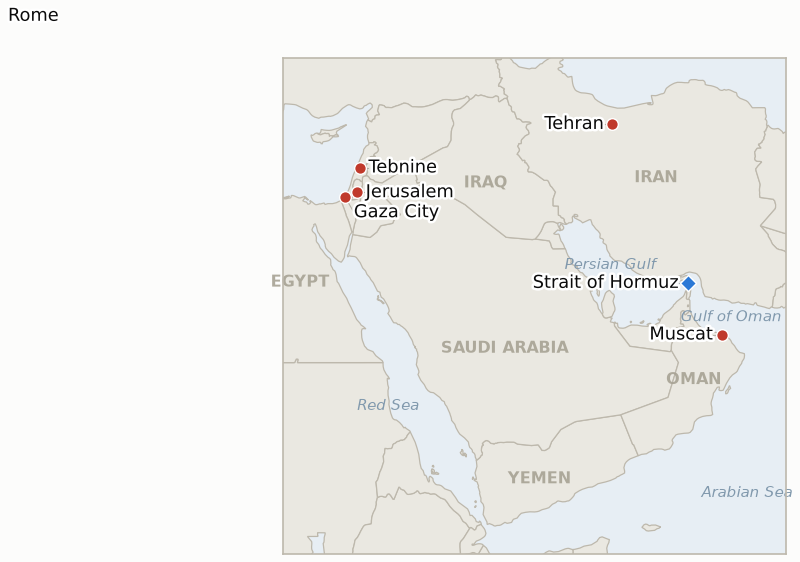

# Middle East Daily Briefing

**August 6, 2026**

- **Reporting window:** ~24 hours, August 5, 09:00 to August 6, 09:00 KST
- **Overall assessment:** Wednesday delivered the ledger's biggest single-day resolution count of the war so far, four indicators at once, and the pattern across all four is that Bessent's and Trump's "today or tomorrow" optimism kept being wrong about the specific mechanism while something adjacent to it kept moving. Iran and Oman say their own bilateral shipping-route agreement is now "under review and in the final drafting stage," with inbound ships transiting an Iran-coordinated channel and outbound ships an Oman-coordinated one for a reported $1-2 million-per-vessel fee, but CNN's own analysis calls it "not the deal Trump wants," and a US official still insists any route must involve "no approvals or permissions by Iran, and would involve no tolls." At the indicator's own ~August 6 deadline, that dispute is exactly why Trump's "reopens as early as tomorrow" claim is formally falsified: CENTCOM's blockade held at 45 vessels redirected (up from 44) and Kpler counted only 8 transits on August 4, nowhere near the 30-plus recovery threshold. Rome's Israel-Lebanon talks fared worse than a missed deadline: Israel struck the south Lebanon town of Tebnine, killing one and wounding twelve, and ordered a new evacuation at Mansouri, citing an unsubstantiated "blatant ceasefire violation" that ended the day's session early, falsifying the second-pilot-zone scaling test one day past its two-week diplomatic build-up. Gaza's framework stayed unresolved by design: Netanyahu told reporters "we will not withdraw from our current lines until Hamas is completely disarmed," restating his own maximalist sequencing rather than taking his coalition to a formal cabinet vote, even as Board of Peace envoy Nickolay Mladenov called their meeting "constructive" and urged a halt to strikes. Markets gave Korea the day's one unambiguous good outcome: KOSPI closed at a record 6,598.26, up 3.76% and decisively above the 6,398 line this ledger set as its air-pocket confirmation threshold, formally closing the book on Monday's plunge as a one-day leveraged-product unwind rather than the start of a compounding slide.

---

## 1. What Happened

<figure style="float:right; width:46%; margin:2pt 0 8pt 14pt;">

<figcaption style="font-size:8pt; color:#666; text-align:center; margin-top:3pt; font-style:italic;">Major places of discussion</figcaption>
</figure>

### 1.1 Iran and Oman Say a Hormuz Shipping Route Agreement Is in Final Drafting, but It Is Not the Deal Washington Wants, and Trump's "Reopens Tomorrow" Claim Formally Lapses

Iranian Foreign Ministry spokesman Esmaeil Baghaei said a joint Iran-Oman statement on Hormuz shipping is "under review and in the final drafting stage," with reported terms under which inbound vessels transit a channel Iran coordinates and outbound vessels a channel Oman coordinates, for a service fee of roughly $1-2 million per vessel split between the two states ([Bloomberg](https://www.bloomberg.com/news/articles/2026-08-05/iran-says-agreement-on-hormuz-shipping-route-reached-with-oman); [Al Jazeera](https://www.aljazeera.com/news/2026/8/5/iran-oman-us-close-to-hormuz-deal-what-do-they-all-want)). CNN's own analysis headlined the arrangement "an agreement on the Strait of Hormuz is taking shape, but not one Trump wants": a US official maintained any route must involve "no approvals or permissions by Iran, and would involve no tolls," and Washington has not confirmed accepting the Iranian-coordinated channel or the fee ([CNN](https://www.cnn.com/2026/08/05/middleeast/hormuz-iran-oman-agreement-analysis-intl)). President Trump separately told reporters "it could happen, tomorrow or the next day," while warning Iran "if they back out again, they're going to get hit really hard" ([Washington Times](https://www.washingtontimes.com/news/2026/aug/5/donald-trump-sees-progress-deal-iran-reopen-strait-hormuz/)). Against that backdrop, IND-20260804-1's own ~August 6 deadline was reached with neither branch of its physical test met: CENTCOM's blockade held at 45 vessels redirected, two disabled and two boarded (up from 44), and CENTCOM's official line remains that "the southern route... remains free and open," while Kpler counted only 8 vessels (5 tankers, 3 bulk carriers) transiting on August 4, far below both the 20-per-day disruption line and the 30-plus recovery threshold ([Tribune India](https://www.tribuneindia.com/news/commercial-vessels/southern-route-through-strait-of-hormuz-remains-free-and-open-for-commercial-vessels-despite-iranian-aggression-us-centcom); [Jerusalem Post](https://www.jpost.com/middle-east/article-904620)). **Falsified** (§3.2). The specific question of whether Washington accepts the Iran-Oman terms as described is now tracked separately as IND-20260806-1. **Confidence: High** on the CENTCOM blockade figures and Kpler's transit count (Tier 1-2, official US military statement and specialized trade data, multi-outlet); **Medium-High** on the Iran-Oman agreement's reported terms, sourced to Bloomberg and Al Jazeera but not yet a finalized public text; **High** on the indicator's falsification, an absence-of-evidence finding against a specific physical verification bar.

### 1.2 Israel Strikes Tebnine and Orders a New Evacuation Mid Rome Talks, Letting the Second Pilot Zone Deadline Lapse Unfired

The IDF ordered residents of the south Lebanon village of Mansouri to evacuate, its first such order in weeks, citing what it called "a blatant violation of the ceasefire" by Hezbollah without publicly presenting supporting evidence, then conducted strikes on Tebnine that killed one person and wounded twelve, according to Lebanese health officials ([France24](https://www.france24.com/en/middle-east/20260805-israel-resumes-military-strikes-on-southern-lebanon-as-rome-hosts-peace-talks); [Washington Times](https://www.washingtontimes.com/news/2026/aug/5/israeli-military-strikes-town-southern-lebanon-saying-hezbollah/)). The strikes landed in the middle of Rome's seventh round of Israel-Lebanon talks, and the second day's session ended early "due to events on the ground," according to wire reporting, before the round's scheduled close on August 6 ([AP via WTOP](https://wtop.com/national/2026/08/here-are-the-latest-developments-in-the-middle-east/)). No second verified withdrawal-plus-LAF-deployment zone was confirmed anywhere in the window, formally falsifying IND-20260723-2 at its own ~August 6 deadline: Zawtar al-Gharbiyeh, handed back in July, remains a one-off pilot rather than the start of a scaling program (§3.2). A successor test on whether Tebnine opens a renewed active-combat phase or stays an isolated incident the diplomatic track absorbs is opened as IND-20260806-2. **Confidence: High** on the Tebnine strike, casualty figures and the Mansouri evacuation order (Tier 1-2, multi-outlet, Lebanese health ministry sourcing); **Medium** on the causal link between the strike and the early end of Wednesday's Rome session, since no single primary source confirmed the two were directly connected beyond the AP wire's framing; **Low** on the IDF's underlying ceasefire-violation claim, for which no public evidence was presented.

### 1.3 Netanyahu Vows No Withdrawal Until Hamas Is Completely Disarmed as the Board of Peace Envoy Calls Their Meeting Constructive

Prime Minister Netanyahu told reporters explicitly for the first time, "we will not withdraw from our current lines until Hamas is completely disarmed," restating his own maximalist sequencing rather than moving his coalition toward a formal Security Cabinet vote on the Board's revised framework ([Haaretz](https://www.haaretz.com/israel-news/israel-security/2026-08-05/ty-article-live/netanyahu-says-no-israeli-withdrawal-from-gaza-until-hamas-completely-disarmed/0000019f-cf85-db33-a5ff-fff5da0d0000); [Washington Post](https://www.washingtonpost.com/world/2026/08/04/israel-palestinians-hamas-war-gaza-news/03d262c0-9006-11f1-9fdc-0a725c989a7b_story.html)). Separately, all Israeli strikes in Gaza now require the personal approval of IDF Chief of Staff Lt.-Gen. Eyal Zamir, according to the same reporting. Board of Peace high representative Nickolay Mladenov met Netanyahu the same day and described their talks as "constructive," urging a halt to Israeli strikes, while Hamas negotiator Ghazi Hamad reiterated that "Hamas will not implement any step of the Gaza peace deal if the Israeli occupation forces do not fulfil their obligations under the agreement" ([Religion News](https://religionnews.com/2026/08/05/board-of-peace-envoy-meets-with-netanyahu-on-gaza-disarmament-deal-and-urges-a-halt-to-strikes/); [Al Jazeera](https://www.aljazeera.com/news/2026/8/4/board-of-peace-says-no-israeli-withdrawal-from-gaza-before-hamas-disarms)). No formal Israeli Security Cabinet vote occurred in the window; Finance Minister Smotrich's demand for a revote remains unanswered. IND-20260801-2 and IND-20260805-1 both stay open against their respective ~August 15 and ~August 12 deadlines (§3.2). **Confidence: High** on Netanyahu's quoted statement and the Zamir approval requirement (Tier 1-2, on-record, multi-outlet); **Medium** on the "constructive" characterization of the Mladenov meeting, sourced to a single outlet whose full text could not be independently re-verified by this brief's direct access.

### 1.4 Houthis Claim Missile Attacks on Two Saudi Tankers in the Red Sea, Opening a New Front Against Riyadh

Yemen's Houthi movement said it launched ballistic missile attacks on two Saudi-flagged oil tankers in the Red Sea and Gulf of Aden, framing the strikes as retaliation for Saudi Arabia's decision to reroute its own shipping away from the Bab el-Mandeb strait; UKMTO logged a report of a loud explosion near a vessel in the area, with the crew reported safe ([Bloomberg](https://www.bloomberg.com/news/articles/2026-08-05/yemen-s-houthis-say-they-ll-target-tankers-in-northern-red-sea); [AP via WTOP](https://wtop.com/national/2026/08/here-are-the-latest-developments-in-the-middle-east/)). This is a distinct actor and theater from the unattributed Minoan Pioneer and Velos Amber strikes tracked in the Strait of Hormuz over the preceding days (briefs 2026-08-04, 2026-08-05), and the first Houthi claim of a direct attack on Saudi-flagged shipping specifically tied to the Bab el-Mandeb rerouting decision. It sits alongside, but separate from, Kuwait's standing Article 51 posture on the Bubiyan Island strikes (IND-20260802-2), a different Gulf state and threat vector (§3.2). **Confidence: Medium** on the Houthi claim itself and its stated rationale (Tier 2, Houthi self-reporting via wire aggregation); **Medium** on the UKMTO-logged incident near a vessel in the area, which has not been independently attributed to the claimed Houthi strikes by a primary maritime security source reviewed directly by this brief.

### 1.5 KOSPI Surges 3.76% to a Record Close, Confirming Monday's Plunge Was a One Day Air Pocket

KOSPI closed at 6,598.26, up 239.31 points (3.76%), a new record surpassing July 31's previous record of 6,595.45, and the gain triggered a buy-side sidecar, the market's first in three trading sessions; foreign investors net-bought roughly 1.45 trillion won, led by Samsung Electronics (+2.5%) and SK hynix (+5.8%) ([Hankyung](https://www.hankyung.com/article/2026080554876); [Etoday](https://www.etoday.co.kr/news/view/2611385)). Korean financial press attributed the move to two compounding drivers: eased Middle East risk sentiment after oil's prior-session drop on Bessent's Hormuz-deal optimism, and a semiconductor rally after the Philadelphia Semiconductor Index jumped 6.55% overnight on AI-linked earnings commentary ([Asiae](https://www.asiae.co.kr/article/2026080510140567765)). The won firmed 8.0 won to 1,424.50, extending August's strengthening trend even as KOSPI itself surged, a decoupling this ledger has also tracked around the July 31 record session. The close is decisively above the 6,398 line this ledger set as IND-20260804-2's air-pocket confirmation threshold, formally confirming that Monday's 5.12% drop was a one-day leveraged-product unwind rather than the start of a compounding slide (§3.2). Brent settled essentially flat at $79.43 (+0.07) and WTI at $75.27 (-0.50), both little changed as markets weighed the unresolved US-Iran-Oman fee dispute (§1.1) against the prior two sessions' sharp declines ([CNBC](https://www.cnbc.com/2026/08/05/oil-prices-iran-war-houthis-saudi-tanker.html)). **Confidence: High** on the KOSPI and won closes and the sidecar trigger (Tier 1-2, exchange data, multi-outlet Korean financial press); **High** on the flat oil settlement (Tier 1-2, though CNBC's exact cents-level figures diverge slightly from TradingEconomics' independent feed, a routine cross-provider variance).

---

## 2. Deep Dive: Incentives and Motives

### 2.1 Why would Iran and Oman announce a shipping route agreement Washington has not accepted?

Because Iran and Oman each gain from being seen as the parties who produced a concrete mechanism, regardless of whether the US ultimately signs on: Iran gets to frame any future reopening as a negotiated arrangement it helped design rather than a capitulation, and a fee-and-channel-control structure Iran coordinates is the closest available substitute for the "co-management" outcome it has sought since talks began, while Oman gets to reinforce its standing as the indispensable mediator between Washington and Tehran, a position it has cultivated across every prior Gulf crisis; announcing the arrangement as "in final drafting" before Washington has actually accepted its terms lets both parties bank the diplomatic credit early and puts pressure on the US to either accept a deal already being described as done or be the party seen blocking a resolution.

### 2.2 Why would Israel strike south Lebanon in the middle of a round of talks it is itself party to?

Because striking during the talks, rather than before or after them, maximizes Israel's negotiating leverage precisely when Lebanon and the mediators are most invested in the round succeeding: an unsubstantiated ceasefire-violation claim costs Israel little domestically while reminding Beirut and Washington that Israel retains unilateral military option even inside a diplomatic process it is nominally cooperating with, a pattern consistent with the government's broader posture in the Gaza framework (§2.3 below) of forcing revisions on its own terms rather than accepting frameworks as presented.

### 2.3 Why would Netanyahu restate his maximalist position rather than take it to a formal cabinet vote?

Because a public statement carries none of the political risk a formal vote would: restating "no withdrawal until complete disarmament" to reporters lets Netanyahu satisfy Smotrich and his coalition's right flank without forcing ministers to go on record either endorsing or rejecting the Board's revised framework, preserving his room to maneuver if the diplomatic track eventually produces terms he can claim credit for, while a formal vote now would crystallize a coalition rift the government has so far managed only informally.

### 2.4 Why would the Houthis open a front against Saudi Arabia specifically, rather than continuing to target US or Israeli-linked shipping?

Because Saudi Arabia's decision to reroute its own tankers away from Bab el-Mandeb is itself an implicit acknowledgment that the strait is unsafe, which the Houthis can exploit by making an explicit example of a Saudi-flagged vessel: a strike on Saudi shipping punishes Riyadh's hedge directly, reasserts the Houthis' relevance in a war narrative that has been dominated by the Hormuz and Gaza tracks for weeks, and tests whether Saudi Arabia, which has stayed largely above the direct-strike pattern absorbed by Kuwait and Bahrain, will respond differently now that its own flagged vessels are targeted rather than third-country shipping transiting near its coast.

---

## 3. Policy Implications for South Korea

### 3.1 Exposure snapshot

| Item | Current reading | Source |
| --- | --- | --- |
| July-August crude procurement | 110%+ of prior-year volume secured (MOTIE, July 21); strategic reserve swap extended through August | MOTIE via Herald Business, Youth Daily, Herald Corp; `korea-exposure.md` |
| September crude procurement | 90%+ secured (MOTIE, July 21) | MOTIE via Herald Business; `korea-exposure.md` |
| Strategic reserve coverage | ~26 days of actual consumption (estimate); swap on immediate standby, untested at scale | CSIS; MOTIE July 27 |
| Korean nationals/vessels in Gulf | ~43-47 (dated figures from late June, no fresher August count found this run) | MOFA; Korea Herald; MBC News |
| Brent / WTI | $79.43 / $75.27 settle, essentially flat, as markets weigh the unresolved Iran-Oman fee dispute | CNBC |
| KOSPI / USD-KRW | KOSPI +3.76% to a record 6,598.26 (air-pocket read confirmed, IND-20260804-2); won firmed to 1,424.50 | Hankyung; Etoday; Asiae |
| Hormuz transits | 8 confirmed crossings, August 4 (Kpler via Jerusalem Post), far below the 30+/day recovery threshold | Jerusalem Post |
| CENTCOM naval blockade | 45 commercial vessels redirected (up from 44), 2 disabled, 2 boarded, as of the window | CENTCOM via Tribune India |

### 3.2 Implications by development

**The formal falsification of Trump's "reopens tomorrow" claim, alongside Iran and Oman's own claimed shipping-route agreement that Washington has not accepted, sharpens rather than resolves the planning problem for MOTIE and KNOC: the operative fact remains the CENTCOM blockade and an 8-per-day Kpler print, not any of the competing verbal claims.** IND-20260806-1 now tracks the single most decision-relevant near-term question, whether Washington accepts the Iran-Oman terms, with a ~August 10 deadline that Korean planners should treat as the next real test of whether transit conditions can improve rather than another rhetorical claim.

**Israel's strike on Tebnine and the collapse of Rome's second day, falsifying the second pilot-zone scaling test, is a genuine negative turn for the broader de-escalation template this ledger has watched Hormuz mediators implicitly reference.** If IND-20260806-2 confirms a renewed active-combat phase rather than an isolated incident, Korea's MOFA should treat the Lebanon front's stabilization as materially less assured than the June-July trajectory suggested, with knock-on relevance for how much confidence to place in any parallel phased de-escalation template proposed for the Gulf.

**KOSPI's record close, formally confirming the air-pocket read, is unambiguous good news for Korea's near-term market planning and removes one live tail-risk scenario (a compounding leverage unwind) from consideration.** The decoupling between a strengthening won and a surging KOSPI, now visible across two separate episodes (July 31 and August 5), continues to argue that Korea's equity and currency markets are responding to distinct catalysts (chip-sector sentiment for KOSPI, broader dollar and oil dynamics for the won) rather than a single unified risk factor, which argues for continuing to model them separately in scenario planning rather than assuming they move together under stress.

**Testable indicators:**

- **IND-20260806-1** — The Iran-Oman Hormuz arrangement gets US acceptance or stays a bilateral claim Washington will not endorse. A US statement explicitly accepting the Iran-Oman transit-fee and channel-split terms, or a joint three-way announcement, by ~2026-08-10 confirms convergence; continued US silence or an explicit rejection of the Iranian-control and toll terms through ~2026-08-10, with CENTCOM's blockade still in force, falsifies it.
- **IND-20260806-2** — The Tebnine strike stays an isolated incident or opens a renewed active-combat phase in south Lebanon. Two or more further Israeli strikes or clashes in south Lebanon, or a formal breakdown of the Rome talks, by ~2026-08-12 confirms compounding; no further strikes and a resumed or rescheduled Rome-track session by ~2026-08-12 falsifies it.

**Resolutions this run:**

- **IND-20260804-1 — Falsified.** CENTCOM's blockade held at 45 vessels redirected (not lifted) and Kpler counted only 8 transits on August 4, far below the 30-plus recovery threshold, at the indicator's own ~August 6 deadline. Trump's and Bessent's "today or tomorrow" reopening claims joined the pattern of unmet 24 to 48 hour deadlines this ledger has tracked since late July.
- **IND-20260804-2 — Confirmed.** KOSPI closed at a record 6,598.26 (+3.76%) on August 5, decisively above the 6,398 air-pocket confirmation line. Monday's 5.12% plunge was a one-day leveraged-product unwind that did not compound into broader risk-off pressure.
- **IND-20260723-2 — Falsified.** No second verified withdrawal-plus-LAF-deployment zone was confirmed at the indicator's own ~August 6 deadline; instead Israel struck Tebnine and ordered a new evacuation mid-Rome-talks, ending the day's session early. Zawtar al-Gharbiyeh remains a one-off pilot rather than a scaling mechanism.
- **IND-20260731-2 — Falsified.** No second or third laden LNG departure from Ras Laffan occurred through the ~August 6 deadline; trade press continues to describe more than a dozen tankers idling near the terminal, with full resumption not expected before late August. The Al Areesh transit was a one-off, not the start of a genuine resumption.

---

## 4. Watch List

- **Whether Washington accepts the Iran-Oman Hormuz fee and channel-split terms, or the arrangement stays a bilateral claim outside the US-led framework** (IND-20260806-1, deadline August 10).
- **Whether the Tebnine strike opens a renewed active-combat phase in south Lebanon or stays an isolated incident** (IND-20260806-2, deadline August 12).
- **Whether the revised disarm-first Gaza framework converges into an accepted deal or collapses back into stalemate**, tracked at two timescales (IND-20260805-1, deadline August 12; IND-20260801-2, deadline August 15).
- **Whether the Iran-Oman Hormuz management talks produce a finalized public mechanism**, distinct from Washington's acceptance question (IND-20260803-1, deadline August 10).
- **Whether any party besides Washington corroborates Trump's specific claimed deal terms** (a Hormuz reopening tied to an end of Iran's nuclear program) (IND-20260803-2, deadline August 9).
- **Whether mediated US-Iran messages ever convert into a jointly acknowledged meeting or framework**, distinct from the confirmed Iran-Oman channel (IND-20260728-3, deadline August 11).
- **Whether Kuwait's Article 51 invocation is followed by any action beyond protest**, now alongside a separate Houthi front against Saudi Arabia (IND-20260802-2, deadline August 15).
- **Whether the Damietta attack is ever formally attributed** (IND-20260801-3, deadline August 14).
- **Whether the Houthis' claimed attacks on Saudi tankers draw a Saudi response beyond the standing posture**, or further Houthi strikes follow.
- **Whether the Minoan Pioneer and Velos Amber attacks are ever attributed**, following the same unclaimed pattern as most Hormuz-area maritime incidents this month.

---

## 5. Source Quality Summary

| Claim | Sources | Confidence |
| --- | --- | --- |
| Iran and Oman say a Hormuz shipping route agreement is "in final drafting"; reported fee and channel-split terms | Bloomberg, Al Jazeera (Tier 1-2, on-record Iranian officials, multi-outlet, terms not yet a finalized public text) | Medium-High |
| CNN analysis: the emerging deal is "not the deal Trump wants"; US official insists on no tolls or Iranian approvals | CNN (Tier 1-2, official quoted directly, single-outlet analysis framing) | Medium-High |
| CENTCOM blockade holds at 45 vessels redirected; Kpler counts only 8 transits August 4 | Tribune India (CENTCOM statement), Jerusalem Post (Kpler-sourced) (Tier 1-2, official US military statement and specialized trade data) | High |
| IND-20260804-1 falsified at its ~August 6 deadline | This ledger's own daily tracking against a pre-defined physical verification bar | High |
| Israel strikes Tebnine (1 killed, 12 wounded), orders Mansouri evacuation, Rome's session ends early | France24, Washington Times, AP via WTOP (Tier 1-2, multi-outlet, Lebanese health ministry sourcing) | High |
| Netanyahu says no withdrawal until Hamas "completely disarmed"; all Gaza strikes require Zamir's approval | Haaretz, Washington Post (Tier 1-2, on-record quote, multi-outlet) | High |
| Board of Peace envoy Mladenov calls Netanyahu meeting "constructive"; Hamas's Hamad restates conditionality | Religion News (single-outlet, full text not independently re-verified), Al Jazeera (Tier 1-2 for Hamad quote) | Medium |
| Houthis claim missile attacks on two Saudi tankers in the Red Sea; UKMTO logs a nearby explosion report | Bloomberg, AP via WTOP (Tier 1-2 wire aggregation of a Tier 2 self-reported claim) | Medium |
| KOSPI closes at record 6,598.26 (+3.76%), triggers buy-side sidecar; won firms to 1,424.50 | Hankyung, Etoday, Asiae (Tier 1-2, exchange data, multi-outlet Korean financial press) | High |
| Brent settles $79.43 (+0.07), WTI $75.27 (-0.50), essentially flat | CNBC (Tier 1-2; TradingEconomics shows slightly different levels, a routine cross-provider variance) | High |
