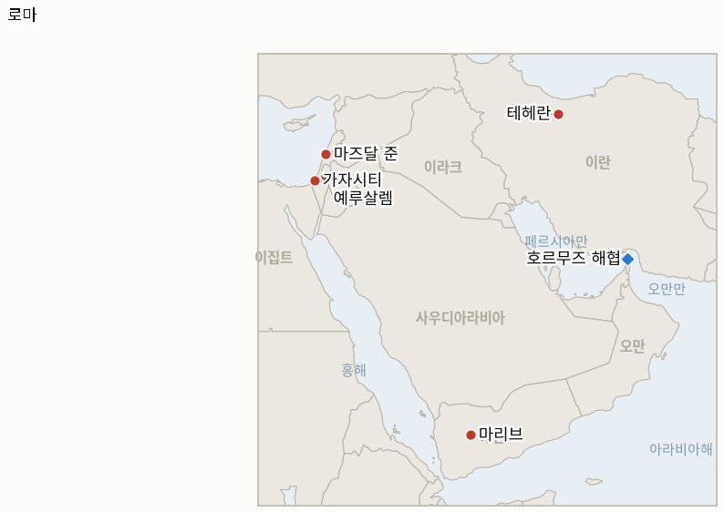

# 중동 일일 브리핑

**2026년 8월 7일**

- **보고 기간:** 약 24시간, 8월 6일 09:00 ~ 8월 7일 09:00 (한국시간)
- **종합 평가:** 목요일 호르무즈 협상 국면에서 지금까지 가장 급격한 반전이 나왔고, 워싱턴이 통제하지 못하는 두 개의 전선에서 실질적인 전쟁 확대가 벌어졌다. 이란과 오만이 양자 항로 협정을 "원칙적으로 합의"했다고 발표한 바로 그날, 이란 국영 파르스 통신은 미국과 이스라엘 선박을 전면 금지하고 위반 시 화물 가치의 최대 20%를 벌금으로 부과하는 의회 초안을 공개했고, 미국은 즉각 이를 거부했으며 브렌트유는 3.8% 급등한 82.49달러로 마감해 위기 완화 국면 이후 최대 일일 상승폭을 기록했다. 이 브리핑이 추적해 온 패턴은 그대로 유지된다. "최종 단계"라는 표현이 검증 가능할 만큼 구체화될 때마다, 그 내용은 워싱턴이 수용하겠다고 밝힌 조건에서 오히려 더 멀어진다. 남레바논은 6월 휴전 이후 이 브리핑이 계속 주시해 온 문턱을 넘었다. 마즈달 준에서 발생한 폭발로 이스라엘 군인 2명이 사망했는데, 이는 휴전 이후 남레바논에서 처음 발생한 이스라엘 측 사망자이며, 같은 날 로마 7차 협상이 철수 "모델 구역"에 대한 돌파구 없이 종료되면서 IND-20260806-2의 확전 분기가 시한보다 6일 앞서 공식 확증됐다. 2022년 이후 사실상 잠잠했던 예멘 내전은 이 브리핑의 추적 범위를 넘어서는 규모로 재점화됐다. 후티의 마리브·하드라마우트 정부군 진지에 대한 미사일·드론 공격으로 집계 기관에 따라 30명에서 45명 이상이 사망해, 사우디아라비아를 겨냥한 홍해 유조선 공격 전선에 더해 두 번째 능동적 후티 전선이 열렸다. 가자지구 외교 트랙은 의도된 대로 정체된 채였지만 국제적 압박은 뚜렷해졌다. 아랍·무슬림 8개국 외교부가 이스라엘의 의료시설 공격을 규탄하는 공동 성명을 발표했고, 네타냐후 총리실은 이를 "현실을 왜곡"한 것이라고 반박했다. 그리고 워싱턴에서는 트럼프 대통령이 헤그세스 국방장관에게 그동안 숨겨졌던 탄약 부족 사태를 추궁했다는 보도가 나왔는데, 이 부족 사태는 최근 몇 주간 행정부의 대이란 타격 선택지를 제약한 것으로 알려졌으며, 한국과 관련된 새로운 변수를 하나 더한다. 바로 전체 역내 리스크 프리미엄을 뒷받침하는 미군의 군사적 태세가 얼마나 지속 가능한가라는 문제다.

---

## 1. 무슨 일이 있었나

<figure style="float:right; width:46%; margin:2pt 0 8pt 14pt;">

<figcaption style="font-size:8pt; color:#666; text-align:center; margin-top:3pt; font-style:italic;">주요 논의 지점</figcaption>
</figure>

### 1.1 이란 의회, 테헤란과 오만이 합의를 "원칙적으로 합의"했다고 밝힌 날 더 제한적인 호르무즈 초안을 공개하고, 유가는 급등한다

이란은 오만과의 양자 항로 협정이 이제 "원칙적으로 합의"됐다고 밝혔다. 카젬 가리브아바디 이란 외무차관은 "항로의 상당 부분은 이란 영해를 지나고 일부는 오만 영해를 지날 것"이라고 설명했으며, 이는 최고지도자 모즈타바 하메네이의 승인을 기다리는 상태다. 페제시키안 대통령은 "현재로서는 그와 소통하기가 매우 어렵다"고 인정했다 ([블룸버그](https://www.bloomberg.com/news/articles/2026-08-06/iran-says-deal-with-oman-on-strait-of-hormuz-agreed-in-principle); [MS NOW](https://www.ms.now/news/oman-iran-reach-agreement-over-strait-of-hormuz); [알자지라](https://www.aljazeera.com/news/2026/8/6/hormuz-deal-close-whats-the-latest-on-each-sides-positions)). 몇 시간 뒤 이란 반관영 파르스 통신은 의회 위원회가 검토 중인 예비 법안을 공개했는데, 이는 미국·이스라엘 및 기타 "적대적" 선박을 해협에서 전면 금지하고 위반 선박에 화물 가치의 최대 20%에 달하는 벌금을 부과하며, 이란에 피해를 준 국가는 배상이 이뤄지기 전까지 통항을 거부한다는 내용이었다. 베흐남 사에디 의원은 "이번 협상은 결코 해협 재개방에 관한 것이 아니다"라고 명확히 밝혔다 ([CNBC via 야후 파이낸스](https://finance.yahoo.com/news/oil-prices-slip-iran-oman-010712479.html); [investinglive](https://investinglive.com/news/iran-is-reportedly-drafting-a-strategic-plan-that-would-restrict-access-through-the-strait-of-hormuz/)). 미국 관리는 CNBC에 "모든 임시 항로는 어떠한 제약도 없어야 한다. 즉 승인이나 허가, 통행료나 수수료가 전혀 없어야 한다"며 "호르무즈 해협은 국제 수로이며 어느 당사자도 항로나 통항 능력을 통제할 수 없다"고 말했다 ([CNBC](https://www.cnbc.com/2026/08/06/us-iran-war-hormuz-trump-bessent-deal.html)). 시장은 이 초안을 진전이 아닌 후퇴로 받아들였다. 브렌트유는 3.83% 오른 82.49달러, WTI는 2.75% 오른 77.29달러로 마감해 그 주 하락분 대부분을 되돌렸다. 미 중부사령부의 봉쇄는 45척에서 48척으로 늘어난 선박을 우회시켰고(격침 2척, 나포 2척은 동일) ([아나돌루 통신](https://aa.com.tr/en/middle-east/us-military-says-it-redirected-48-vessels-while-enforcing-iran-blockade/4019496)), 클러(Kpler)는 8월 5일 하루 동안 총 8척(유조선 4척, 벌크선 3척, 가스선 1척)이 해협을 통과했다고 집계해 전날과 거의 동일한 수준을 유지했다 ([예루살렘 포스트](https://www.jpost.com/middle-east/article-904620)). **신뢰도: 높음**, 중부사령부·클러 수치 및 정산가(1~2단계 출처, 공식 발표, 전문 무역 데이터, 거래소 정산가); **신뢰도: 중간 높음**, 이란-오만 "원칙적 합의" 표현과 하메네이 승인 병목(1~2단계, 복수 매체, 공식 발언이나 서명된 문건은 아직 없음); **신뢰도: 중간 높음**, 파르스 통신이 공개한 초안 법안의 구체적 내용(2단계 이란 국영 매체 발신을 1~2단계 통신사가 보도, 명시적으로 아직 "전문가 검토 단계"이며 법제화되지 않음).

### 1.2 후티, 2022년 이후 예멘 최대 규모 지상전 확전을 감행해 마리브·하드라마우트 정부군 수십 명을 살상

후티 세력은 알자우프주에서 미사일 최소 8발과 다수의 드론을 발사해 마리브·하드라마우트에 있는 예멘 정부군 홈랜드 실드군과 비상군 진지를 타격했으며, 알시니야·알아브르·알루크 등의 지역이 타격을 받았는데 당시 병력이 아침 훈련을 위해 집결해 있었다. 예멘 정부 측 소식통은 "최소 30명"이 사망하고 15명이 부상했다고 밝혔으나, 친정부 군 소식통은 45명 사망, 70명 이상 부상이라는 더 높은 수치를 인용했으며, 후티 군 대변인 야히아 사리는 "수백 명"의 사상자를 주장했다 ([알자지라](https://www.aljazeera.com/news/2026/8/6/houthis-claim-to-have-killed-45-in-attacks-on-yemeni-government-forces); [워싱턴포스트](https://www.washingtonpost.com/world/2026/08/06/houthi-rebel-attacks-marib-hadhramaut/c6ecf71c-919a-11f1-9fdc-0a725c989a7b_story.html)). 사리는 이번 공격을 선제적이라고 규정하며 "자유 주(州)들에 대한 확전을 목표로 한 대규모 사우디군 병력 집결이 최종 단계에 있음을 포착했다"고 주장했고, 압둘 말리크 알메클라피 예멘 정부 부의장은 이번 공격이 후티의 "진짜 목적, 즉 전쟁을 지속시키고 국가 재건을 저지하려는 목적"을 보여준다고 반박했다. 지역 감시 기관들은 이를 2022년 이후 가장 격렬한 예멘 지상전으로 평가했으며, 이는 사우디 국적 선박을 겨냥한 후티의 해상 작전과는 별개의 독립적인 확전으로, 이 작전은 별도로 7월 22일 바브엘만데브 봉쇄 이후 여덟 번째 사우디 유조선인 NCC 와파호를 얀부 인근에서 타격했다고 주장했다. **신뢰도: 중간 높음**, 공격 발생 및 대략적 위치(1~2단계, 복수 매체, 예멘군 확인); **신뢰도: 낮음 중간**, 구체적 사상자 수는 30명에서 수백 명까지 출처마다 큰 차이를 보이며 양측 모두 수치를 과장할 유인이 뚜렷함; **신뢰도: 중간**, 사리가 밝힌 선제적 명분은 후티 측 단독 출처에만 근거함.

### 1.3 마즈달 준 폭발로 이스라엘 군인 2명 사망, 로마 7차 협상은 9월 1일을 차기 라운드로 제안하며 종료

남레바논 마즈달 준 마을에 진입하던 이스라엘 군인들이 "폭발물이 폭발"하면서 2명이 사망하고 4명이 중상을 입었으며, 이는 6월 20일 헤즈볼라와의 휴전 이후 레바논에서 발생한 첫 이스라엘 측 사망자다. 이스라엘군 관계자는 폭발물의 성격이 아직 조사 중이라고 밝혔고, 헤즈볼라는 즉각적인 입장을 내놓지 않았다 ([NBC 뉴스](https://www.nbcnews.com/world/israel/2-soldiers-killed-lebanon-first-israeli-deaths-june-truce-hezbollah-rcna591103)). 이스라엘은 부르즈 알샤말을 포함한 남레바논 다른 지역에 대한 공습과 야간 포격을 이어갔으며, 이는 수요일 테브니네 공습(1명 사망, 12명 부상; 2026년 8월 6일자 브리핑 §1.2)에서 시작된 폭격의 연장선이다. 미국이 중재한 이스라엘-레바논 로마 협상 7차 라운드의 마지막 3일차 회담은 군사, 정치·법률, 포로 문제 등 3개 병행 트랙에서 같은 날 종료됐다. 이스라엘은 자우타르 알샤르키예를 포함한 레바논 측이 제안한 철수 "모델 구역"에 대한 세부사항을 요구했으나 돌파구는 마련되지 않았고, 미국의 추가 협의를 조건으로 9월 1일이 8차 라운드의 예비 일정으로 제시됐다 ([미들 이스트 모니터](https://www.middleeastmonitor.com/20260806-lebanon-israel-conclude-7th-round-of-talks-in-rome-lebanese-official/); [워싱턴 이그재미너](https://www.washingtonexaminer.com/news/world/4676097/israel-strikes-hezbollah-lebanon-rome-peace-talks/)). 수요일 테브니네 공습 및 만수리 대피령과 결합해, 마즈달 준 사망자와 계속된 공습은 IND-20260806-2의 확증 기준인 "추가 공습 또는 충돌 2건 이상"을 충족시켜, 시한(약 8월 12일)보다 6일 앞서 확전 국면 재개를 공식 확증한다(§3.2). **신뢰도: 높음**, 마즈달 준 사상자 및 로마 협상 종료(1~2단계, 이스라엘군 확인, 복수 매체); **신뢰도: 중간**, 9월 1일 일정은 예비적이라고 명시됐으며 양국 정부의 확정은 아직 없음; **신뢰도: 낮음**, 마즈달 준 폭발의 원인은 이스라엘군 스스로도 헤즈볼라 소행인지 기존 잔존 폭발물인지 아직 규명하지 않음.

### 1.4 아랍·무슬림 8개국, 이스라엘의 가자지구 행위 규탄, 네타냐후 총리실은 "현실 왜곡"이라 반박

사우디아라비아, 이집트, UAE, 튀르키예, 카타르, 요르단, 파키스탄, 인도네시아 8개국 외교부는 가자지구에서 이스라엘의 지속되는 위반이라고 규정한 사안에 대해 "가장 강력한 규탄과 비난"을 표명하는 공동 성명을 발표했으며, 특히 의료시설과 의료 기반시설에 대한 공격, 여성과 아동을 포함한 민간인의 지속적인 사망에 초점을 맞추고, 이러한 패턴이 포괄적 계획 2단계 이행을 저해한다고 경고했다 ([알자지라](https://www.aljazeera.com/news/2026/8/6/eight-countries-strongly-denounce-ongoing-israeli-violations-in-gaza); [튀르키예 외교부 공동성명 전문](https://www.mfa.gov.tr/joint-statement-on-the-ongoing-israeli-violations-in-the-gaza-strip--6-august-2026.en.mfa)). 이스라엘 총리실은 이 성명이 "현실을 왜곡"했다며, 이스라엘 측이 계속되고 있다고 밝힌 하마스의 위반은 도외시한 채 트럼프의 20개항 계획을 위태롭게 한다고 반박했다 ([US 뉴스 통신 인용](https://www.usnews.com/news/world/articles/2026-08-06/regional-states-condemn-israeli-strikes-in-gaza-israel-blames-hamas)). 평화이사회의 수정된 무장해제 선행 방식에 대한 이스라엘 안보내각의 공식 표결은 이번 보고 기간에도 이뤄지지 않았다. 8월 5일 네타냐후의 공개 순서 입장(하마스가 완전히 무장해제될 때까지 철수하지 않는다; 2026년 8월 6일자 브리핑 §1.3)은 변함없이 유지되며, IND-20260801-2와 IND-20260805-1 모두 각각의 시한까지 진행 중 상태를 유지한다(§3.2). **신뢰도: 높음**, 공동 성명 원문 및 서명국(1단계, 정부 1차 출처, 공식 외교부 원문); **신뢰도: 중간 높음**, 이스라엘의 "현실 왜곡" 표현은 통신사 보도를 통해 확인되었으나 이 브리핑이 이스라엘 정부의 1차 원문으로 직접 재검증하지는 못함.

### 1.5 트럼프, 대이란 타격 선택지를 제약한 숨겨진 탄약 부족 사태로 헤그세스를 추궁한 뒤 "정보 유출자"를 찾겠다고 공언

복수 매체 보도에 따르면 트럼프 대통령은 캠프 데이비드 내각 회의에서 헤그세스 국방장관에게 장거리 유도 미사일과 방공 요격 미사일의 극심한 부족 사태를 왜 제대로 보고받지 못했는지 추궁했으며, 이 부족 사태는 트럼프가 이란에 대해 계획했다고 밝힌 더 큰 규모의 타격을 축소한 이유 중 하나로 알려졌다. 헤그세스는 이 격차에 대한 책임을 부관인 스티븐 파인버그에게 돌린 것으로 전해졌다 ([워싱턴포스트](https://www.washingtonpost.com/national-security/2026/08/05/trump-hegseth-clashed-camp-david-over-iran-missile-depletion-concerns/); [타임스 오브 이스라엘](https://www.timesofisrael.com/trump-exasperated-with-iran-war-bashed-hegseth-over-munition-shortages-reports/)). 캐롤라인 레빗 백악관 대변인은 공개적으로 이 보도를 사실이 아니라고 반박했다. 목요일이 되자 트럼프는 이 보도가 자신의 대이란 협상력을 약화시킨다는 이유로, 근본적인 부족 사태 자체가 아니라 보도 그 자체를 문제로 규정하며 "정보 유출자"를 찾아내겠다고 공개적으로 밝혔다 ([알자지라](https://www.aljazeera.com/news/2026/8/6/trump-vows-to-find-leakers-after-reports-of-depleted-iran-war-munitions); [CNN](https://www.cnn.com/2026/08/06/politics/trump-munitions-cabinet-meeting)). 미 중부사령부나 국방부는 구체적인 탄약 수치를 독자적으로 확인해 발표하지 않았다. **신뢰도: 중간**, 캠프 데이비드 갈등의 실체 및 근본적인 부족 주장(1~2단계, 회의 사정에 정통하다고 인용된 복수 매체의 취재원, 다만 백악관 대변인의 공식 부인 존재); **신뢰도: 중간 높음**, 트럼프의 공개적 "정보 유출자 색출" 발언 자체는 온레코드로 확인됨(1~2단계, 직접 인용, 복수 매체).

---

## 2. 심층 분석: 유인과 동기

### 2.1 이란 의회는 왜 테헤란과 오만이 합의를 "원칙적 합의"라고 밝힌 바로 그 시점에 더 제한적인 호르무즈 초안을 공개했을까?

이란의 협상 입장은 단일하지 않기 때문이다. 행정부 트랙(페제시키안, 아라그치, 가리브아바디)은 오만 항로가 거의 마무리됐다고 묘사해 외교적 성과를 미리 확보하고, 이미 타결된 것으로 규정된 조건을 워싱턴이 수용하도록 압박할 유인이 있다. 반면 워싱턴이 "괴롭힘과 깨진 약속"을 저질렀다고 비난한 갈리바프 국회의장이 이끄는 의회는 문건이 최종화되기 전에 최대주의적 공개 입장을 선점할 유인이 뚜렷하다. 이는 행정부의 협상 여지를 제한하는 동시에, 하메네이가 최종 승인하는 어떤 내용도 국내적으로 항복으로 비치지 않도록 보장하려는 목적이다. "원칙적 합의"라는 표현이 도는 바로 그 주에 제한적 초안을 공개함으로써 강경파는 최종 합의문이 어느 쪽으로 귀결되든 그 소유권을 주장할 수 있는 반면, 행정부 트랙은 여전히 근본적인 합의가 가깝다고 계속 묘사할 여지를 남긴다.

### 2.2 후티는 왜 지금 예멘 정부군을 상대로 대규모 지상 공세를 개시했을까?

사우디아라비아를 겨냥한 후티의 해상 작전은 사우디 유조선단과 이목을 끌었지만, 후티가 지상에서 존재감을 재확인할 수 있는 직접적인 영토 대응을 끌어내지는 못했기 때문이다. 전쟁 초기 국면 이후 후티가 장악하지 못했던 마리브·하드라마우트 주의 사우디 지원 병력에 대해 선제적이라고 규정된 대규모 공격을 감행함으로써, 4년간의 지상전 소강 상태가 예멘 정부와 사우디 주도 연합군의 상응 대응 의지를 약화시켰는지를 시험하는 셈이다. 동시에 워싱턴과 리야드의 관심이 호르무즈 협상과 가자지구 프레임워크에 쏠려 있는 이 시점은 두 트랙이 마무리되기 전에 후티가 지상의 현실을 바꿀 더 넓은 기회를 제공한다.

### 2.3 남레바논에서 6월 이후 처음 발생한 이스라엘 측 사망자는 왜 하필 로마 7차 협상 종료 시점에 나왔을까?

이스라엘군이 실제로 진입 중이던 마을에서 발생한 미확인 폭발물은, 의도된 공습과 달리 어느 쪽도 온전히 통제하거나 협상 지렛대로 활용할 수 있는 신호가 아니기 때문이다. 이번 시점에서 정말 의미 있는 것은 원인이 아니라 대응이다. 이스라엘은 로마 라운드 결과를 기다리며 작전을 멈추기보다 이번 사상자를 계속된 작전(부르즈 알샤말 공습, 포격)을 정당화하는 근거로 삼았는데, 이는 이 브리핑이 계속 추적해 온 패턴, 즉 이스라엘이 군사 작전과 외교 트랙을 순차적 도구가 아니라 병행적 도구로 취급하며 서로를 제약하기보다 서로 강화하는 방식으로 다뤄왔다는 패턴과 일치한다.

### 2.4 아랍·무슬림 8개국은 왜 오늘 이스라엘의 가자지구 행위를 공동으로 규탄하기로 했을까?

8개국이 함께 성명을 발표하는 것이, 사우디아라비아, UAE, 카타르, 이집트, 요르단처럼 호르무즈 협상과 가자지구 평화이사회 프레임워크, 그리고 자국 내 팔레스타인 문제에 대한 정치적 정당성에 동시에 이해관계를 걸고 있는 국가들에게 단독 행동보다 정치적 비용이 적기 때문이다. 동시에 이스라엘의 계속된 공습이, 호르무즈를 포함한 더 넓은 역내 긴장 완화 구조가 의존하는 국가 연합의 협력을 잠식하고 있다는 신호를 워싱턴에 집단적으로 보내려는 목적도 있다. 의료시설 공습을 명시적으로 지목함으로써 이 성명은 일반적인 정치적 항의보다 법적·인도주의적으로 반박하기 어려운 근거를 갖춘다.

### 2.5 트럼프 측근들은 왜 탄약 부족 사태가 공개되도록 뒀으며, 트럼프는 왜 고의적 유출을 의심할까?

요격 미사일과 장거리 미사일 재고가 고갈됐다는 보도는 사실 여부와 무관하게 전략적으로 큰 대가를 치르기 때문이다. 이는 이란, 후티 및 추가 확전을 저울질하는 다른 어떤 세력에도 미국의 보복 능력에 실질적 한계가 있음을 시사하는데, 이는 적대 세력에게 정확히 도움이 되는 정보이며 협상 상대방이 미국의 허세를 더 시험해볼 근거로 악용할 수 있다. 따라서 트럼프의 공개적 분노는 헤그세스가 정보를 숨겼는지에 대한 진짜 다툼이라기보다, 그 출처와 신빙성을 공격함으로써 보도의 전략적 피해를 관리하려는 시도로도 읽힌다. 유출이 고의였든 아니었든, 이번 사건 자체는 IND-20260723-1에서 이 브리핑이 계속 추적해 온 것과 같은 그림, 즉 워싱턴의 전쟁 수행이 근시일 내 외교 트랙을 넘어서까지 지속될 국내·물자적 여력을 갖췄는지에 대한 하나의 데이터 포인트가 됐다.

---

## 3. 한국에 대한 정책적 함의

### 3.1 익스포저 현황

| 항목 | 현재 수치 | 출처 |
| --- | --- | --- |
| 7~8월 원유 도입 | 전년 동기 대비 110% 이상 확보(산업통상자원부, 7월 21일); 비축유 스와프 프로그램 8월까지 연장, 현재까지 약 2,100만 배럴 스와프 | 산업통상자원부(헤럴드경제, 한국경제); `korea-exposure.md` |
| 9월 원유 도입 | 90% 이상 확보(산업통상자원부, 7월 21일) | 산업통상자원부(헤럴드경제); `korea-exposure.md` |
| 전략비축유 커버리지 | 실제 소비 기준 약 26일분(추정); 스와프는 즉시 가동 대기 상태이나 대규모 실전 검증은 없음 | CSIS; 산업통상자원부 7월 27일 |
| 걸프 지역 한국 국민/선박 | 약 43~47명(6월 말 기준 자료로, 이번 보고 기간에는 더 최신 수치를 찾지 못함) | 외교부; 코리아헤럴드; MBC뉴스 |
| 브렌트유 / WTI | 82.49달러 / 77.29달러 정산가, 각각 +3.83% / +2.75%로 그 주 하락분 대부분을 되돌림, 이란의 제한적 호르무즈 초안이 촉발 | CNBC via 야후 파이낸스; investinglive |
| 코스피 / 원달러 환율 | 코스피 -4.58% 6,296.38(월가발 반도체 매도세, 삼성전자 -6.3%, SK하이닉스 -10.4%), 수요일 사상 최고치를 하루 만에 반납; 원화는 1,423.8원으로 소폭 강세 | 비즈니스코리아; 뉴스핌 |
| 호르무즈 통항량 | 8월 5일 총 8척(유조선 4, 벌크선 3, 가스선 1; 클러 via 예루살렘 포스트), 8월 4일과 거의 동일 | 예루살렘 포스트 |
| 미 중부사령부 해상 봉쇄 | 봉쇄 우회 선박 48척(45척에서 증가), 격침 2척, 나포 2척 | 중부사령부(아나돌루 통신) |

### 3.2 사안별 함의

**테헤란과 오만이 자신들의 채널을 "원칙적 합의"라고 부른 바로 그 주에 나온 이란 의회의 초안은, 이 문제에서 가장 결정적인 순간에 이란과 미국의 입장 간 간극이 좁혀지기는커녕 오히려 벌어지고 있다는 가장 명확한 증거이며, 산업통상자원부와 한국석유공사는 이번 유가 급등(브렌트유 82.49달러, 위기 완화 국면 이후 최대 일일 상승폭)을, "합의" 헤드라인이 나올 때마다 실제 조건이 워싱턴이 거듭 밝힌 무통행료·무승인 기준을 향해 실제로 움직였는지를 확인해야 한다는 경고 신호로 받아들여야 한다.** IND-20260806-1과 IND-20260803-1은 모두 약 8월 10일 시한까지 진행 중 상태를 유지하지만, 오늘의 증거는 두 지표 모두 반증 분기 쪽으로 기울고 있다. 이란은 계속 통제권과 수수료를 고수하고 있으며, 워싱턴이 초안대로의 조건을 수용할 조짐은 없다.

**남레바논의 확전 국면(IND-20260806-2)이 공식 확증되고, 동시에 로마 라운드가 정체된 것은 이 브리핑이 호르무즈와 가자지구 중재자들이 암묵적으로 참조해 온 단계적 긴장 완화 모델 전반에 부정적인 신호다. 한국 외교부는 6월 이후 남레바논 전선의 상대적 평온을 안정적인 기준선으로 가정해서는 안 되며, 이스라엘 측 사망자 재발생을 여러 전선에 걸친 오판 위험이 낮아지는 것이 아니라 오히려 높아지는 신호로 다뤄야 한다.** 이번 확전이 외교 트랙을 탈선시킬지, 아니면 병행할지를 시험하는 후속 지표로 IND-20260807-2가 개설됐다.

**2022년 이후 가장 격렬한 예멘 지상전 재점화는, 사우디아라비아를 겨냥한 후티의 해상 작전에 더해, 한국의 15척 이상 얀부 우회 유조선이 호르무즈 우회로로 이미 의존하고 있는 홍해 수송로에 두 번째의 대체로 독립적인 확전 변수를 더한다. 후티의 지상 공세가 사우디 주도 연합군의 대응을 끌어낸다면, 이 수송로에 대한 영공·항만 인프라 리스크는 호르무즈에서 벌어지는 상황과 무관하게 별도로 상승한다.** IND-20260807-1은 이번 공세가 지속될지 아니면 단발성 대규모 습격에 그칠지를 추적하며, 이는 리야드가 호데이다를 넘어 확전할지를 시험하는 IND-20260726-3과도 연관된다.

**코스피의 4.58% 반납은 한국 금융언론이 전적으로 월가발 반도체 매도세(샌디스크의 실적 가이던스 부진, 필라델피아 반도체 지수)로 돌리고 어떤 중동발 촉매도 지목하지 않았는데, 이는 이 브리핑이 7월 31일과 8월 5일 이후 지적해 온 채널 분리를 가장 명확하게 재확인하는 사례다. 한국의 주식시장 리스크는 환율·원유 수입 리스크와는 별개의 반도체 섹터 베타로 움직이고 있으며, 이는 방향과 무관하게 특정 세션의 코스피 변동을 섹터 차원의 원인을 먼저 확인하지 않고 중동 리스크 심리에 대한 판단 근거로 읽어서는 안 된다는 점을 뒷받침한다.**

**검증 가능한 지표:**

- **IND-20260807-1** — 마리브·하드라마우트에서의 후티 지상 공세가 단발성 습격에 그칠지, 지속적인 공세로 발전할지. 약 2026년 8월 14일까지 예멘 정부군 진지에 대한 추가 후티 지상 공격이 이틀 이상 더 발생하거나 확인된 영토 획득이 있으면 지속적인 공세로 확증되며, 같은 시한까지 추가 지상 공격이 없으면 단발성 대규모 습격으로 반증된다.
- **IND-20260807-2** — 이제 확증된 남레바논의 확전 국면(IND-20260806-2)이 로마 외교 트랙을 탈선시킬지, 병행할지. 제안된 약 2026년 9월 1일 8차 라운드까지 공식 연기·취소 또는 어느 한쪽의 협상 중단 선언이 있으면 탈선으로 확증되며, 계속되는 공격에도 불구하고 라운드가 예정대로 또는 그와 유사하게 진행되면 군사·외교 트랙이 독립적으로 병행될 수 있음을 보여주며 반증된다.

**이번 회차의 지표 해소:**

- **IND-20260806-2 — 확증.** 마즈달 준 폭발로 이스라엘 군인 2명이 사망했고 이스라엘은 부르즈 알샤말을 공습하고 다른 지역을 야간 포격해, 시한(약 8월 12일)보다 6일 앞서 "추가 공습·충돌 2건 이상"이라는 확증 기준을 충족했다. 테브니네 이후 남레바논의 확전 국면은 이제 고립된 사건이 아니라 반복되는 패턴이다.
- **IND-20260725-3 — 반증.** 보고 기간 내내 상업용 유조선 통항이 전무한 날은 발생하지 않았다. 통항량은 8월 4일과 5일 모두 총 8척(반증 기준인 일 3척 이상을 크게 상회)을 유지해, 3주 연속 통항 전무 일이 없었다. 이란의 허가 체제는 완전 봉쇄로 가는 경로가 아니라 통제된 트리클(소량 흐름)임이 시한(약 8월 8일)보다 이틀 앞서 확증됐다.

---

## 4. 관찰 목록

- **마리브·하드라마우트에서의 후티 지상 공세가 지속될지, 단발성 습격에 그칠지** (IND-20260807-1, 시한 8월 14일).
- **확증된 남레바논의 확전 국면이 로마 외교 트랙의 제안된 9월 1일 라운드를 탈선시킬지, 병행할지** (IND-20260807-2, 시한 9월 1일).
- **워싱턴이 이란-오만의 호르무즈 수수료·항로 분할 조건을 수용할지, 아니면 제한적 의회 초안이 이란의 실제 입장이 될지** (IND-20260806-1, 시한 8월 10일; IND-20260803-1, 시한 8월 10일).
- **수정된 무장해제 선행 방식 가자지구 프레임워크가 합의로 수렴할지, 다시 교착 상태로 돌아갈지**, 두 시간대에 걸쳐 추적 (IND-20260805-1, 시한 8월 12일; IND-20260801-2, 시한 8월 15일).
- **트럼프가 주장한 구체적 합의 조건(이란 핵프로그램 종료와 연계된 호르무즈 재개방)을 워싱턴 외의 당사자가 뒷받침할지** (IND-20260803-2, 시한 8월 9일).
- **리야드가 후티의 지상 공세에 대응해 호데이다를 넘어 자체 예멘 작전을 확대할지** (IND-20260726-3, 시한 8월 9일).
- **쿠웨이트의 51조 원용이 항의를 넘어선 조치로 이어질지**, 이제는 사우디아라비아를 겨냥한 두 개의 별도 후티 전선과 함께 (IND-20260802-2, 시한 8월 15일).
- **미국의 탄약 부족 사태가 대이란 정책에 실질적 제약으로 작용할지, 아니면 의회가 무리 없이 국방부 요청 예산을 지원할지** (IND-20260723-1, 시한 8월 22일).
- **다미에타 공격의 책임 소재가 공식적으로 규명될지** (IND-20260801-3, 시한 8월 14일).
- **미노안 파이어니어호, 벨로스 앰버호, NCC 와파호 해상 공격이 책임 소재가 규명될지**, 이번 달 호르무즈·홍해 지역 대부분의 사건과 같이 미확인 또는 다툼이 있는 패턴을 이어가는 중.

---

## 5. 출처 신뢰도 요약

| 주장 | 출처 | 신뢰도 |
| --- | --- | --- |
| 이란과 오만이 호르무즈 항로 협정을 "원칙적 합의"로 규정, 하메네이 승인 대기 중 | 블룸버그, MS NOW, 알자지라 (1~2단계, 공식 발언, 복수 매체, 아직 서명된 문건은 아님) | 중간 높음 |
| 이란 의회가 파르스 통신이 공개한 미국·이스라엘 선박 금지 및 화물 벌금 초안을 검토; 미국은 이란의 통제나 통행료를 거부 | CNBC via 야후 파이낸스, investinglive (2단계 이란 국영 매체를 1~2단계 통신사가 보도; 미국의 거부는 CNBC를 통해 온레코드로 확인) | 중간 높음 |
| 브렌트유 82.49달러(+3.83%), WTI 77.29달러(+2.75%) 정산가; 중부사령부 봉쇄 48척; 클러 8월 5일 통항 8척 집계 | CNBC/야후 파이낸스, 아나돌루 통신, 예루살렘 포스트 (1~2단계, 거래소 정산가, 미군 공식 발표, 전문 무역 데이터) | 높음 |
| 마즈달 준 폭발로 이스라엘 군인 2명 사망, 4명 부상; 로마 7차 협상 9월 1일 제안하며 종료 | NBC뉴스, 미들 이스트 모니터, 워싱턴 이그재미너 (1~2단계, 이스라엘군 확인, 복수 매체) | 높음 |
| IND-20260806-2 확증, IND-20260725-3 반증 | 이 브리핑 자체의 사전 정의된 검증 기준에 따른 일일 추적 | 높음 |
| 후티 공격으로 마리브·하드라마우트에서 예멘 정부군 30~45명 이상 사망, 2022년 이후 최대 확전 | 알자지라, 워싱턴포스트 (1~2단계, 복수 매체; 사상자 범위는 정부군과 후티 측 상반된 집계 반영) | 발생 여부는 중간 높음; 정확한 사상자 수는 낮음 중간 |
| 8개국이 이스라엘의 가자지구 의료시설 공격을 공동 규탄; 이스라엘 총리실은 왜곡이라 반박 | 알자지라, 튀르키예 외교부 공동성명 원문, US 뉴스 통신 인용 (1단계, 정부 1차 원문; 이스라엘 반응은 1~2단계) | 높음 |
| 트럼프가 캠프 데이비드에서 헤그세스에게 숨겨진 탄약 부족 사태를 추궁; 이후 트럼프는 "정보 유출자" 색출을 공언 | 워싱턴포스트, 타임스 오브 이스라엘, 알자지라, CNN (1~2단계, 회의 사정에 정통하다고 인용된 복수 매체; 백악관 대변인은 공식 부인) | 중간 |
| 코스피가 월가발 반도체 매도세로 4.58% 하락해 6,296.38, 중동 상황과 무관; 원화는 1,423.8원으로 강세 | 비즈니스코리아, 뉴스핌 (1~2단계, 거래소 데이터, 복수 한국 금융언론) | 높음 |
