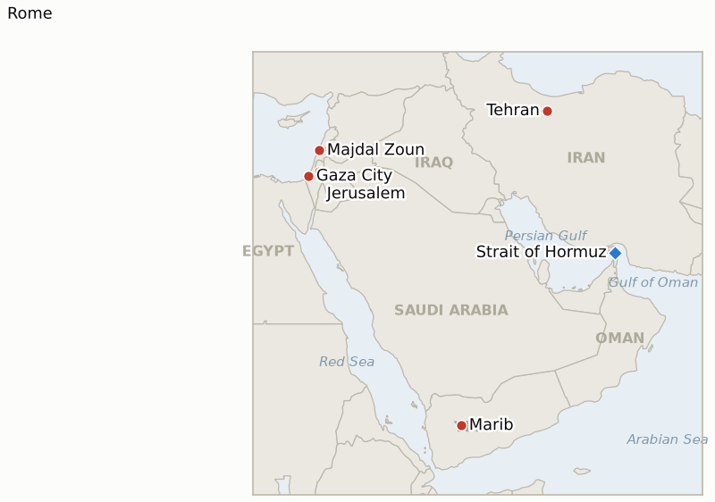

# Middle East Daily Briefing

**August 7, 2026**

- **Reporting window:** ~24 hours, August 6, 09:00 to August 7, 09:00 KST
- **Overall assessment:** Thursday delivered the sharpest reversal yet in the Hormuz negotiating story and a genuine widening of the war on two fronts Washington does not control. Just as Iran and Oman described their bilateral shipping arrangement as "agreed in principle," Iran's own Fars news agency published a parliamentary draft that would ban US and Israeli vessels outright and fine violators up to 20% of cargo value, prompting an immediate US rejection and sending Brent up 3.8% to $82.49, its sharpest single-day gain since the crisis began cooling. The pattern from this ledger's tracking holds: every time the "final stage" framing gets specific enough to test, the specifics move further from what Washington says it will accept, not closer. South Lebanon crossed a threshold this ledger has watched for since the June truce: two Israeli soldiers killed in a Majdal Zoun blast, the war's first Israeli fatalities in that theater since the ceasefire, arriving on the same day Rome's seventh round of talks concluded without a breakthrough on withdrawal "model areas," formally confirming IND-20260806-2's compounding branch six days ahead of its own deadline. Yemen's civil war, largely dormant since 2022, reignited at a scale nobody in this ledger's tracking anticipated: Houthi missile and drone strikes on Yemeni government camps in Marib and Hadramaut killed 30 to 45-plus soldiers by competing counts, opening a second active Houthi front alongside the Red Sea tanker campaign against Saudi Arabia. Gaza's diplomatic track stayed frozen by design, but international pressure sharpened: eight Arab and Muslim foreign ministries issued a joint statement condemning Israeli strikes on healthcare facilities, which Netanyahu's office dismissed as distorting reality. And in Washington, reporting that Trump confronted Defense Secretary Hegseth over previously hidden munitions shortages, the same shortages that reportedly constrained the administration's Iran strike options in recent weeks, adds a new and Korea-relevant variable: the durability of the US military posture underwriting the entire regional risk premium.

---

## 1. What Happened

<figure style="float:right; width:46%; margin:2pt 0 8pt 14pt;">

<figcaption style="font-size:8pt; color:#666; text-align:center; margin-top:3pt; font-style:italic;">Major places of discussion</figcaption>
</figure>

### 1.1 Iran's Parliament Publishes a Restrictive Hormuz Draft as Tehran and Oman Call Their Deal Agreed in Principle, and Oil Jumps

Iran said its bilateral shipping route agreement with Oman is now "agreed in principle," with Deputy Foreign Minister Kazem Gharibabadi describing a route where "large parts of the shipping route would go through Iran's territorial waters and some parts would pass through Oman's waters," pending approval from Supreme Leader Mojtaba Khamenei; President Pezeshkian acknowledged "it is very difficult to communicate with him at the moment" ([Bloomberg](https://www.bloomberg.com/news/articles/2026-08-06/iran-says-deal-with-oman-on-strait-of-hormuz-agreed-in-principle); [MS NOW](https://www.ms.now/news/oman-iran-reach-agreement-over-strait-of-hormuz); [Al Jazeera](https://www.aljazeera.com/news/2026/8/6/hormuz-deal-close-whats-the-latest-on-each-sides-positions)). Hours later, Iran's semi-official Fars news agency published a preliminary bill under review by a parliamentary committee that would ban US, Israeli and other "hostile" vessels from the strait outright, impose fines up to 20% of cargo value on violators, and deny access to any state that has damaged Iran until compensation is paid; lawmaker Behnam Saeedi said explicitly "these talks are in no way about reopening the strait" ([CNBC via Yahoo Finance](https://finance.yahoo.com/news/oil-prices-slip-iran-oman-010712479.html); [investinglive](https://investinglive.com/news/iran-is-reportedly-drafting-a-strategic-plan-that-would-restrict-access-through-the-strait-of-hormuz/)). A US official told CNBC "any temporary routes will be without any impediments, meaning no approvals or permissions and no tolls or charges," and that "the Strait of Hormuz is an international waterway and no party controls the lanes or the ability to transit through them" ([CNBC](https://www.cnbc.com/2026/08/06/us-iran-war-hormuz-trump-bessent-deal.html)). Oil markets read the draft as a setback rather than progress: Brent settled up 3.83% to $82.49 and WTI up 2.75% to $77.29, both erasing most of the week's prior decline. CENTCOM's blockade held at 48 vessels redirected (up from 45), 2 disabled, 2 boarded ([Anadolu Agency](https://aa.com.tr/en/middle-east/us-military-says-it-redirected-48-vessels-while-enforcing-iran-blockade/4019496)), and Kpler counted 8 total vessels transiting the strait on August 5 (4 tankers, 3 bulk carriers, 1 gas carrier), essentially flat with the prior day ([Jerusalem Post](https://www.jpost.com/middle-east/article-904620)). **Confidence: High** on the CENTCOM and Kpler figures and the settle prices (Tier 1-2, official statement, specialized trade data, exchange settles); **Medium-High** on the Iran-Oman "agreed in principle" framing and the Khamenei-approval bottleneck (Tier 1-2, multiple outlets, on-record officials, but no signed text); **Medium-High** on the Fars-published draft bill's specific terms (Tier 2, Iranian state media sourcing relayed by Tier 1-2 wire aggregation, explicitly still at "expert review stage" and not law).

### 1.2 Houthis Launch Yemen's Fiercest Ground Escalation Since 2026, Killing Dozens of Government Troops in Marib and Hadramaut

Houthi forces fired at least eight missiles and multiple drones from al-Jawf governorate at camps of the Yemeni government's Homeland Shield and Emergency Forces in Marib and Hadramaut, hitting locations including al-Thiniya, al-Abr and al-Rouk while troops were gathered for morning training; Yemeni government sources put the toll at "at least 30" killed and 15 wounded, while pro-government military sources cited a higher count of 45 killed and 70-plus wounded, and Houthi military spokesman Yahya Saree claimed "hundreds" of casualties ([Al Jazeera](https://www.aljazeera.com/news/2026/8/6/houthis-claim-to-have-killed-45-in-attacks-on-yemeni-government-forces); [Washington Post](https://www.washingtonpost.com/world/2026/08/06/houthi-rebel-attacks-marib-hadhramaut/c6ecf71c-919a-11f1-9fdc-0a725c989a7b_story.html)). Saree framed the strikes as preemptive, claiming Houthi forces "detected large Saudi military build-ups that were in their final stages, aimed at escalating hostilities against the free provinces," while Yemeni government deputy chairman Abdul Malik al-Mekhlafi called the attacks evidence of the Houthis' "true project: perpetuating the war and preventing the restoration of the state." Regional monitors described it as the fiercest Yemen ground fighting since 2022, a distinct and separate escalation from the Houthis' maritime campaign against Saudi-flagged shipping, which separately claimed its eighth Saudi tanker (the NCC Wafa, off Yanbu) since the Bab el-Mandeb blockade began July 22. **Confidence: Medium-High** on the strikes occurring and their general location (Tier 1-2, multi-outlet, Yemeni military confirmation); **Low-Medium** on the specific casualty count, which ranges roughly 30 to hundreds across sources with an obvious incentive for both sides to spin the number; **Medium** on Saree's stated preemptive justification, sourced only to the Houthi side.

### 1.3 Two Israeli Soldiers Are Killed in a Majdal Zoun Blast as Rome's Seventh Round Concludes With September 1 Proposed as the Next Round

Two Israeli soldiers were killed and four seriously wounded when "an explosion was detonated" as they entered a site in the south Lebanon village of Majdal Zoun, the first Israeli deaths in Lebanon since the June 20 truce with Hezbollah; an Israeli military official said the nature of the explosive remained under review, and Hezbollah issued no immediate statement ([NBC News](https://www.nbcnews.com/world/israel/2-soldiers-killed-lebanon-first-israeli-deaths-june-truce-hezbollah-rcna591103)). Israel continued strikes elsewhere in south Lebanon, including Burj al-Shemali, and artillery shelling overnight, extending the bombardment that began with Wednesday's Tebnine strike (1 killed, 12 wounded; brief 2026-08-06 §1.2). The third and final day of Rome's seventh round of US-brokered Israel-Lebanon talks concluded the same day across three parallel tracks (military, political and legal, and prisoners); Israel pressed Lebanon for details on proposed withdrawal "model areas" including Zawtar al-Sharqiyeh, but no breakthrough was reached, and September 1 was floated as a preliminary date for an eighth round pending further US consultations ([Middle East Monitor](https://www.middleeastmonitor.com/20260806-lebanon-israel-conclude-7th-round-of-talks-in-rome-lebanese-official/); [Washington Examiner](https://www.washingtonexaminer.com/news/world/4676097/israel-strikes-hezbollah-lebanon-rome-peace-talks/)). Combined with Wednesday's Tebnine strike and Mansouri evacuation order, the Majdal Zoun deaths and continued strikes meet IND-20260806-2's confirmation bar of two or more further Israeli strikes or clashes, formally confirming a renewed active-combat phase six days ahead of the indicator's ~August 12 deadline (§3.2). **Confidence: High** on the Majdal Zoun casualties and the Rome talks' conclusion (Tier 1-2, IDF-confirmed, multi-outlet); **Medium** on the September 1 date, described as preliminary and not yet confirmed by both governments; **Low** on the cause of the Majdal Zoun explosion, which the IDF itself has not yet attributed to Hezbollah versus a legacy device.

### 1.4 Eight Arab and Muslim Nations Condemn Israeli Conduct in Gaza as Netanyahu's Office Calls the Statement a Distortion

The foreign ministries of Saudi Arabia, Egypt, the UAE, Turkey, Qatar, Jordan, Pakistan and Indonesia issued a joint statement expressing their "strongest condemnation and denunciation" of what they called ongoing Israeli violations in Gaza, reserving particular criticism for strikes on healthcare facilities and medical infrastructure and the continued killing of civilians, including women and children, and warning that the pattern undermines implementation of the Comprehensive Plan's second phase ([Al Jazeera](https://www.aljazeera.com/news/2026/8/6/eight-countries-strongly-denounce-ongoing-israeli-violations-in-gaza); [Turkish MFA joint text](https://www.mfa.gov.tr/joint-statement-on-the-ongoing-israeli-violations-in-the-gaza-strip--6-august-2026.en.mfa)). Israel's prime minister's office responded that the statement "distorts reality," arguing it jeopardized Trump's 20-point plan while ignoring what Israel says are continuing Hamas violations ([US News via wire](https://www.usnews.com/news/world/articles/2026-08-06/regional-states-condemn-israeli-strikes-in-gaza-israel-blames-hamas)). No formal Israeli Security Cabinet vote on the Board of Peace's revised disarm-first framework occurred in the window; Netanyahu's public sequencing position from August 5 (no withdrawal until Hamas is completely disarmed; brief 2026-08-06 §1.3) stands unchanged, keeping both IND-20260801-2 and IND-20260805-1 open against their respective deadlines (§3.2). **Confidence: High** on the joint statement's text and signatories (Tier 1, primary government sources, official MFA text); **Medium-High** on Israel's characterization as "distorts reality," sourced to wire reporting of the PM office's response, not yet independently re-verified against a primary Israeli government text by this brief.

### 1.5 Trump Confronts Hegseth Over Hidden Munitions Shortages That Constrained Iran Strike Options, Then Vows to Find Leakers

Reporting from multiple outlets described Trump confronting Defense Secretary Pete Hegseth at a Camp David cabinet meeting over why he had not been properly informed of extreme shortages in long-range guided missiles and air-defense interceptors, shortages reported to be part of why Trump pulled back from what he had described as a larger planned strike on Iran; Hegseth reportedly blamed his deputy, Stephen Feinberg, for the gap ([Washington Post](https://www.washingtonpost.com/national-security/2026/08/05/trump-hegseth-clashed-camp-david-over-iran-missile-depletion-concerns/); [Times of Israel](https://www.timesofisrael.com/trump-exasperated-with-iran-war-bashed-hegseth-over-munition-shortages-reports/)). White House Press Secretary Karoline Leavitt publicly rejected the reporting as false. By Thursday, Trump had pivoted to publicly vowing to find the "leakers" behind the story, framing the reports themselves, rather than the underlying shortage, as the problem, on the grounds that the disclosure weakens his negotiating position with Iran ([Al Jazeera](https://www.aljazeera.com/news/2026/8/6/trump-vows-to-find-leakers-after-reports-of-depleted-iran-war-munitions); [CNN](https://www.cnn.com/2026/08/06/politics/trump-munitions-cabinet-meeting)). No independent confirmation of the specific munitions figures has been published by CENTCOM or the Pentagon. **Confidence: Medium** on the substance of the Camp David clash and the underlying shortage claim (Tier 1-2, multiple outlets citing sourcing described as familiar with the meeting, but on-record denial from the White House press secretary); **Medium-High** on Trump's public "find the leakers" response, which is itself on-record (Tier 1-2, direct quotes, multi-outlet).

---

## 2. Deep Dive: Incentives and Motives

### 2.1 Why would Iran's parliament publish a more restrictive Hormuz draft just as Tehran and Oman call their deal agreed in principle?

Because Iran's negotiating position is not unitary: the executive track (Pezeshkian, Araghchi, Gharibabadi) has an incentive to describe the Oman channel as nearly finished to bank diplomatic credit and pressure Washington into accepting terms already framed as settled, while parliament, whose speaker Ghalibaf has accused Washington of "bullying and broken promises," has every incentive to stake out a maximalist public position before any text is finalized, both to shape the executive's negotiating room and to ensure that whatever Khamenei ultimately approves cannot be portrayed domestically as a capitulation; publishing the restrictive draft the same week the "agreed in principle" framing circulated lets hardliners claim ownership of the final terms regardless of which version actually survives Khamenei's review, while leaving the executive track free to keep describing the underlying deal as close.

### 2.2 Why would the Houthis open a major new ground offensive against Yemeni government forces now?

Because the Houthis' maritime campaign against Saudi Arabia has drawn Riyadh's tankers and attention without provoking the direct territorial response that would let the Houthis reassert relevance on the ground: a large, framed-as-preemptive strike on Saudi-backed forces in Marib and Hadramaut, governorates the Houthis have not held since the war's earlier phases, tests whether four years of relative ground-war dormancy has eroded the Yemeni government's and Saudi-led coalition's willingness to respond in kind, while doing so at a moment when Washington and Riyadh's attention is consumed by the Hormuz talks and the Gaza framework gives the Houthis a wider opening to change ground-level facts before either track resolves.

### 2.3 Why would south Lebanon's first Israeli fatalities since June arrive just as Rome's seventh round concludes?

Because an unattributed device in a village Israeli forces were actively entering is, unlike a deliberate strike, not a signal either side can fully control or exploit for negotiating leverage; what makes the timing significant is less the cause than the response, since Israel used the casualties to justify continued operations (Burj al-Shemali strikes, artillery shelling) rather than pausing pending the Rome round's outcome, consistent with the pattern this ledger has tracked of Israel treating military operations and the diplomatic track as parallel rather than sequential tools, each reinforcing rather than constraining the other.

### 2.4 Why would eight Arab and Muslim governments choose today to jointly condemn Israel's Gaza conduct?

Because a joint statement from eight governments, several of which (Saudi Arabia, UAE, Qatar, Egypt, Jordan) are simultaneously invested in the Hormuz negotiations, Gaza's Board of Peace framework, and their own domestic legitimacy on the Palestinian question, costs each signatory less politically than acting alone, while collectively signaling to Washington that continued Israeli strikes are eroding the coalition of states whose cooperation the broader regional deescalation architecture, Hormuz included, depends on; the explicit citation of healthcare-facility strikes gives the statement a harder-to-dismiss legal and humanitarian anchor than a general political complaint would.

### 2.5 Why would Trump's team let a munitions shortage story become public, and why does he suspect a deliberate leak?

Because a story about depleted interceptor and long-range missile stocks is strategically costly regardless of its truth: it signals to Iran, the Houthis and any other party weighing further escalation that US retaliatory capacity has real limits, which is precisely the kind of information an adversary benefits from and a negotiating counterpart could exploit by calling further bluffs, so Trump's public anger reads as much as an attempt to manage the story's strategic damage, by attacking its credibility and its source, as a genuine dispute over whether Hegseth withheld the information; whether the leak was deliberate or not, the episode itself is now a data point in the same picture this ledger has tracked in IND-20260723-1, whether Washington's war effort has the domestic and material runway to sustain itself past the near-term diplomatic tracks.

---

## 3. Policy Implications for South Korea

### 3.1 Exposure snapshot

| Item | Current reading | Source |
| --- | --- | --- |
| July-August crude procurement | 110%+ of prior-year volume secured (MOTIE, July 21); strategic reserve swap extended through August, ~21 million barrels swapped to date | MOTIE via Herald Business, Hankyung; `korea-exposure.md` |
| September crude procurement | 90%+ secured (MOTIE, July 21) | MOTIE via Herald Business; `korea-exposure.md` |
| Strategic reserve coverage | ~26 days of actual consumption (estimate); swap on immediate standby, untested at scale | CSIS; MOTIE July 27 |
| Korean nationals/vessels in Gulf | ~43-47 (dated figures from late June, no fresher August count found this run) | MOFA; Korea Herald; MBC News |
| Brent / WTI | $82.49 / $77.29 settle, +3.83% / +2.75%, reversing most of the week's decline on Iran's restrictive Hormuz draft | CNBC via Yahoo Finance; investinglive |
| KOSPI / USD-KRW | KOSPI -4.58% to 6,296.38 on a Wall Street chip selloff (Samsung -6.3%, SK hynix -10.4%), reversing Wednesday's record close within one session; won firmed slightly to 1,423.8 | Businesskorea; Newspim |
| Hormuz transits | 8 total vessels, August 5 (4 tankers, 3 bulk carriers, 1 gas carrier; Kpler via Jerusalem Post), essentially flat with August 4 | Jerusalem Post |
| CENTCOM naval blockade | 48 commercial vessels redirected (up from 45), 2 disabled, 2 boarded | CENTCOM via Anadolu Agency |

### 3.2 Implications by development

**Iran's parliamentary draft, published the same week Tehran and Oman called their own channel "agreed in principle," is the clearest evidence yet that the gap between Iranian and US positions on Hormuz is widening rather than narrowing at the moment it matters most, and MOTIE and KNOC should treat the resulting oil price jump ($82.49 Brent, the sharpest daily gain since the crisis began cooling) as a reminder that any "deal" headline requires checking whether the underlying terms have actually moved toward the no-toll, no-approval standard Washington has repeatedly stated, not just whether a deal is described as close.** IND-20260806-1 and IND-20260803-1 both stay open against their ~August 10 deadlines, but today's evidence leans toward the falsification branch of both: continued Iranian insistence on control and fees, and no sign Washington will accept the terms as drafted.

**The confirmed compounding of south Lebanon's active-combat phase (IND-20260806-2), arriving alongside a stalled Rome round, is a genuine negative signal for the broader phased-deescalation template this ledger has watched Hormuz and Gaza mediators implicitly reference; Korea's MOFA should not assume the Lebanon front's relative quiet since June is a durable baseline, and should treat renewed Israeli casualties as raising, not lowering, the near-term probability of a wider miscalculation risk across fronts.** A successor test on whether the escalation derails or runs parallel to the diplomatic track is opened as IND-20260807-2.

**Yemen's ground war reigniting at its fiercest scale since 2022, on top of the Houthis' maritime campaign against Saudi Arabia, adds a second and largely independent escalation vector to the Red Sea corridor Korea's 15+ Yanbu-routed tankers already depend on as their Hormuz workaround; if the Houthi ground offensive draws a Saudi-led coalition response, the airspace and port infrastructure risk to that corridor rises independently of anything happening in Hormuz.** IND-20260807-1 tracks whether the offensive continues or stays a single large raid, with a bearing on IND-20260726-3's own test of whether Riyadh escalates beyond Hodeidah.

**KOSPI's 4.58% reversal, entirely attributed by Korean financial press to a Wall Street semiconductor selloff (SanDisk's guidance miss, the Philadelphia Semiconductor Index) rather than any Middle East catalyst, is the clearest confirmation yet of the decoupling this ledger flagged after July 31 and August 5: Korea's equity risk is running on a chip-sector beta distinct from its currency and oil-import risk, which argues against reading any single-session KOSPI move, in either direction, as a read on Middle East risk sentiment without checking the sector-level cause first.**

**Testable indicators:**

- **IND-20260807-1** — The Houthi ground offensive in Marib and Hadramaut stays a single large raid or opens a sustained ground campaign against Yemen's internationally recognized government. Further Houthi ground attacks on Yemeni government positions on two or more additional days, or confirmed territorial gains, by ~2026-08-14 confirms a sustained campaign; no further Houthi ground attacks through ~2026-08-14 falsifies it as a one-off large-scale raid.
- **IND-20260807-2** — South Lebanon's now-confirmed active-combat phase (IND-20260806-2) either derails or runs parallel to the Rome diplomatic track. A formal postponement, cancellation, or either side declaring the talks suspended, by the proposed ~2026-09-01 eighth round confirms derailment; the round proceeding on or near schedule despite continued strikes falsifies it, showing the tracks can run independently.

**Resolutions this run:**

- **IND-20260806-2 — Confirmed.** Two Israeli soldiers were killed in the Majdal Zoun blast and Israel struck Burj al-Shemali and shelled other areas overnight, meeting the two-or-more-strikes confirmation bar six days ahead of the indicator's ~August 12 deadline. South Lebanon's post-Tebnine active-combat phase is now a compounding pattern rather than an isolated incident.
- **IND-20260725-3 — Falsified.** No day with zero commodity tanker transits occurred through the window; transits have held at 3 or more vessels a day (8 total on both August 4 and August 5) for three consecutive weeks, two days ahead of the indicator's own ~August 8 deadline. Iran's licensing regime remains a controlled trickle rather than a full closure, consistent with Tehran keeping the strait as a negotiating dial rather than sealing it.

---

## 4. Watch List

- **Whether the Houthi ground offensive in Marib and Hadramaut continues or stays a single raid** (IND-20260807-1, deadline August 14).
- **Whether south Lebanon's confirmed active-combat phase derails or runs parallel to the Rome diplomatic track's proposed September 1 round** (IND-20260807-2, deadline September 1).
- **Whether Washington accepts the Iran-Oman Hormuz fee and channel-split terms, or the restrictive parliamentary draft becomes Iran's operative position** (IND-20260806-1, deadline August 10; IND-20260803-1, deadline August 10).
- **Whether the revised disarm-first Gaza framework converges into an accepted deal or collapses back into stalemate**, tracked at two timescales (IND-20260805-1, deadline August 12; IND-20260801-2, deadline August 15).
- **Whether any party besides Washington corroborates Trump's specific claimed deal terms** (a Hormuz reopening tied to an end of Iran's nuclear program) (IND-20260803-2, deadline August 9).
- **Whether Riyadh responds to the Houthi ground offensive by escalating its own Yemen campaign beyond Hodeidah** (IND-20260726-3, deadline August 9).
- **Whether Kuwait's Article 51 invocation is followed by any action beyond protest**, now alongside two distinct Houthi fronts against Saudi Arabia (IND-20260802-2, deadline August 15).
- **Whether the underlying US munitions shortage becomes an operative constraint on Iran policy, or Congress funds the Pentagon's request without incident** (IND-20260723-1, deadline August 22).
- **Whether the Damietta attack is ever formally attributed** (IND-20260801-3, deadline August 14).
- **Whether the Minoan Pioneer, Velos Amber and NCC Wafa maritime attacks are ever attributed**, following the same unclaimed-or-contested pattern as most Hormuz and Red Sea area incidents this month.

---

## 5. Source Quality Summary

| Claim | Sources | Confidence |
| --- | --- | --- |
| Iran and Oman call their Hormuz shipping arrangement "agreed in principle," pending Khamenei's approval | Bloomberg, MS NOW, Al Jazeera (Tier 1-2, on-record officials, multi-outlet, not yet a signed text) | Medium-High |
| Iran's parliament reviews a Fars-published draft banning US/Israeli vessels and imposing cargo fines; US rejects any Iranian control or tolls | CNBC via Yahoo Finance, investinglive (Tier 2 Iranian state media relayed by Tier 1-2 wire aggregation; US rejection on-record via CNBC) | Medium-High |
| Brent settles $82.49 (+3.83%), WTI $77.29 (+2.75%); CENTCOM blockade at 48 vessels; Kpler counts 8 transits August 5 | CNBC/Yahoo Finance, Anadolu Agency, Jerusalem Post (Tier 1-2, exchange settles, official US military statement, specialized trade data) | High |
| Two Israeli soldiers killed, four wounded in Majdal Zoun blast; Rome's seventh round concludes with September 1 proposed | NBC News, Middle East Monitor, Washington Examiner (Tier 1-2, IDF-confirmed, multi-outlet) | High |
| IND-20260806-2 confirmed; IND-20260725-3 falsified | This ledger's own daily tracking against pre-defined verification bars | High |
| Houthi strikes kill 30 to 45-plus Yemeni government troops in Marib and Hadramaut, the fiercest escalation since 2022 | Al Jazeera, Washington Post (Tier 1-2, multi-outlet; casualty range reflects competing government and Houthi counts) | Medium-High on occurrence; Low-Medium on exact toll |
| Eight nations jointly condemn Israeli strikes on Gaza healthcare facilities; Israel's PM office calls it a distortion | Al Jazeera, Turkish MFA joint text, US News via wire (Tier 1, primary government text; Tier 1-2 for Israel's response) | High |
| Trump confronted Hegseth over hidden munitions shortages at Camp David; Trump later vows to find "leakers" | Washington Post, Times of Israel, Al Jazeera, CNN (Tier 1-2, multiple outlets citing sourcing described as familiar with the meeting; White House press secretary denies the account) | Medium |
| KOSPI falls 4.58% to 6,296.38 on a Wall Street chip selloff, unrelated to Middle East developments; won firms to 1,423.8 | Businesskorea, Newspim (Tier 1-2, exchange data, multi-outlet Korean financial press) | High |
