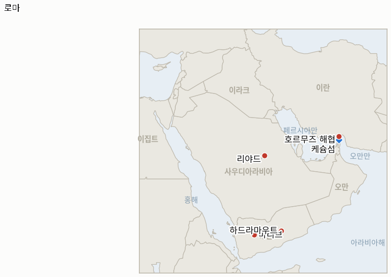

# 중동 일일 브리핑

**2026년 8월 8일**

- **보고 기간:** 약 24시간, 8월 7일 09:00 ~ 8월 8일 09:00 (한국시간)
- **종합 평가:** 8월 7일의 상황 전개는, 서류상으로는 긴장 완화를 향한 한 걸음처럼 보이는 호르무즈 관련 소식에도 불구하고, 전선의 숫자를 오히려 늘리는 하루였다. 이란과 오만은 60일간의 통행료 없는 항로 운영 방안, 즉 진입 선박은 이란 영해를 지나는 북측 항로를, 출항 선박은 오만 영해를 지나는 남측 항로를 이용하고 30일 내 주요 항로의 기뢰를 제거한다는 "일반 틀"을 확정했다고 밝혔지만, 카젬 가리브아바디 이란 외무차관은 이행이 "최고위 의사결정 단계의 최종 승인"에 달려 있다고 강조했다. 이 병목은 사실상 단 한 사람의 문제다. 페제시키안 대통령은 "현재 최고지도자와 소통하는 것이 매우 어렵다"고 직접 인정했는데, 이 한 문장은 그 어떤 통행료 분쟁보다도 이번 위기에서 "원칙적 합의"와 실제 재개 사이의 간극이 계속 벌어지는 이유를 잘 설명해준다. 같은 뉴스 주기 안에서 이란 자체 영토인 케슘섬에서 원인이 불분명한 폭발 두 건이 발생했는데, 이는 "원칙적 합의"라는 표현이 이런 식의 모호한 사건을 앞서 예고했던 전례를 다시 떠올리게 한다. 한편 사우디아라비아는 후티 반군이 남쪽에서, 이란이 지원하는 이라크 민병대가 북쪽에서 항구·공항·에너지 기반시설을 겨냥한 협공을 조율하고 있다는 정보를 갖고 있다고 밝히면서도, 이란을 포함한 모든 당사자와의 접촉이 "옳은 방향으로" 가고 있다고 말했다. 이는 걸프 주요국들이 외교 트랙과 군사 위협 트랙을 하나의 그림이 아니라 서로 다른 시계로 보고 있다는 가장 명확한 증거다. 목요일 재점화된 예멘 내전은 잦아들지 않았다. 마리브에 대한 후티군의 공격으로 민간인 2명이 추가로 숨지고 14명이 다쳤으며, 예멘 문제를 가장 신중하게 관찰해온 전문가 두 명은 독립적으로 더 큰 전투가 임박했으며 예멘 정부와 사우디아라비아가 보여온 자제력이 오래가지 않을 수 있다고 경고했다. 레바논 남부에서는 이번 주 유일한 실질적 이행 조치가 나왔다. 레바논과 이스라엘은 헤즈볼라의 향후 무장해제를 검증할 병력을 파견할 국가들의 후보 명단에 합의했고(프랑스는 제외), 미국이 최종 선택을 하기로 했다. 이는 이스라엘 병사 2명이 그곳에서 사망한 바로 그 주에도 로마 트랙이 구체적 성과를 낼 수 있음을 보여준다. 그리고 워싱턴에서는 트럼프 대통령과 헤그세스 국방장관 사이의 비공개 갈등, 즉 은폐된 탄약 부족 문제를 둘러싼 마찰이 공개적인 갈등으로 번졌다. 트럼프는 탄약 부족설을 부인하면서도 이를 보도한 "유출자들"에게 "장기 징역형"을 구형하겠다고 공언했으며, 같은 시점 CNN은 한국도 보유하고 있는 사드(THAAD) 요격미사일 재고가 거의 80% 소진됐다고 보도했지만 그 내용 자체에 대한 실질적 반박은 나오지 않았다.

---

## 1. 무슨 일이 있었나

<figure style="float:right; width:46%; margin:2pt 0 8pt 14pt;">

<figcaption style="font-size:8pt; color:#666; text-align:center; margin-top:3pt; font-style:italic;">주요 논의 지점</figcaption>
</figure>

### 1.1 이란·오만, 통행료 없는 호르무즈 항로 방안 확정 발표하지만 케슘섬 폭발과 의회의 반대 법안이 그림자를 드리우다

이란과 오만은 호르무즈 해협을 60일간 시범 재개방하는 방안의 "일반 틀"을 확정했다고 밝혔다. 페르시아만에 진입하는 상선은 이란 영해를 지나는 북측 항로를, 아라비아해로 나가는 선박은 오만 영해를 지나는 남측 항로를 이용하며, 이 방안 아래에서는 통행료가 부과되지 않고, 항로 주요 구간의 기뢰 제거에 30일의 기간을 두어 이후 영구적인 양방향 항행 방안을 이란과 오만이 협상하기로 했다([CBS 뉴스](https://www.cbsnews.com/live-updates/iran-war-us-trump-strait-of-hormuz-deal/)). 가리브아바디 이란 외무차관은 양국이 제안된 항로의 지리적 좌표에 합의했다고 밝혔지만 이행은 여전히 "최고위 의사결정 단계의 최종 승인"에 달려 있다고 말했고, 페제시키안 대통령은 별도로 "현재 최고지도자와 소통하는 것이 매우 어렵다"고 인정해, 이 합의의 운명이 현재 접촉이 어려운 단 한 명의 결정에 달려 있음을 가장 명확하게 확인해주었다. 갈리바프 이란 국회의장은 워싱턴의 접근 방식을 "연극 외교"라고 조롱했고, 한 의회 위원회 위원은 이번 협상이 "재개방이 아니라 선박 이동과 항행 경로에 관한 것"이라고 강조했으며, 이란 의회는 미국·이스라엘 선박을 전면 금지하고 화물 가치의 최대 20%를 벌금으로 부과하는, 목요일 파르스 통신이 공개한 초안을 계속 심의 중이다([CNBC](https://www.cnbc.com/2026/08/07/oil-rises-supply-fears-iran-draft-plan-strait-hormuz.html); [NPR](https://www.npr.org/2026/08/06/nx-s1-5923623/iran-strait-hormuz-us-israel-ban)). 같은 뉴스 주기 중, 이란 타스님 통신은 이란군이 해협 입구 부근에서 "적대 세력의 표적과 교전"하는 과정에서 케슘섬에서 폭발음 두 건이 들렸다고 보도했지만, 아흐마드 나피시 호르모즈간 부지사는 섬이나 인근 반다르아바스에 실제 타격이 있었다는 사실은 확인되지 않았으며 당국이 원인을 조사 중이라고 밝혔다([걸프뉴스](https://gulfnews.com/world/mena/us-israel-war-on-iran-widens-explosions-rock-qeshm-island-near-hormuz-as-trump-says-conflict-cant-go-much-longer-1.500633276)). 시장은 이 틀의 통행료 면제 조건과 의회 초안의 모순되는 수수료 조항 사이에서 저울질하며 브렌트유는 전일 대비 1.29% 오른 83.55달러, WTI는 1.15% 오른 78.18달러에 정산됐다([CNBC](https://www.cnbc.com/2026/08/07/oil-rises-supply-fears-iran-draft-plan-strait-hormuz.html)). 로이터가 인용한 클러 데이터에 따르면 실제 해협 통항량은 외교와 무관하게 계속 줄어, 이번 주 월요일부터 목요일까지 33척만이 통과해 전주의 50척에 못 미쳤으며, 목요일 하루에는 이라크산 바스라 원유를 실은 초대형 유조선 1척, LPG 운반선 1척, 벌크선 1척 등 단 4척만 통과했다([g캡틴/로이터](https://gcaptain.com/vessel-traffic-through-hormuz-dwindles-this-week-as-markets-watch-iran-oman-talks/)). **신뢰도: 중상** 보도된 협정 조건 및 최고지도자 승인 병목 문제(1·2등급, 국가원수급 인정을 포함한 공식 발언이나 서명된 문서는 없음); **신뢰도: 중간** 케슘섬 사건(2등급, 이란 관영 매체 보도가 현지 당국자의 공개 부인과 상충); **신뢰도: 높음** 정산가와 클러 통항 수치(1·2등급, 거래소 정산가, 전문 무역 데이터).

### 1.2 사우디아라비아, 후티와 이라크 민병대의 협공이 임박했다고 밝히다

사우디 당국자는 후티 반군과 이란 지원 이라크 민병대가 이란 혁명수비대의 직접적인 감독 아래 북쪽과 남쪽에서 조율된 공격을 가할 것으로 임박했다고 보고 있으며, 사우디아라비아·미국·역내 파트너국들의 정보에 따르면 양쪽 방향에서 드론과 미사일이 이동 배치되고 있고 에너지 기반시설, 항구, 공항 등 민간·경제 시설이 표적이 될 가능성이 있다고 밝혔다([CNN](https://www.cnn.com/2026/08/06/middleeast/saudi-houthi-iran-iraq-attack-latam-intl); [CBC 뉴스](https://www.cbc.ca/news/world/saudi-arabia-iraq-yemen-houthis-iran-9.7299356)). 이 경고는 8월 6일 후티군의 사우디 남부 미사일 공격으로 아동을 포함한 민간인 11명이 부상당한 직후 나왔다([래플러](https://www.rappler.com/world/middle-east/houthi-attack-saudi-arabia-updates-august-6-2026/)). 사우디 당국자들은 이란을 포함한 모든 당사자와의 접촉과 중재 노력이 "옳은 방향으로" 가고 있다고 밝힌 것과 동시에 이런 경고를 내놓았다는 점이 특히 두드러지는데, 이는 사우디가 외교 트랙과 군사 위협 트랙을 하나의 일관된 그림이 아니라 서로 독립적으로 진행되는 것으로 보고 있음을 명시적으로 인정한 것이다([예루살렘포스트](https://www.jpost.com/middle-east/article-904832)). 이 경고는 또한 7월 29일 미국과 사우디가 자국 석유 시설에 대한 드론 공격의 배후로 지목한 이란 지원 세력에 대해 이라크 내에서 합동 공습을 가한 이후 나온 것으로, 당시 이라크 민병대는 보복을 예고한 바 있다. **신뢰도: 중상** 경고 자체와 그 근거(1·2등급, 사우디·미국 당국자를 인용한 다수 매체 보도, 혁명수비대 감독설은 확인이 아닌 주장); **신뢰도: 낮음** 실제 공격 발생 여부(정의상 아직 검증되지 않음).

### 1.3 후티군, 마리브에서 추가 공격으로 민간인 사망…전문가들은 대규모 전투 가능성 경고

후티군은 금요일 정부군이 장악한 마리브시를 향해 추가로 드론과 미사일을 발사했다. 정부 측 병력이 여러 발을 요격했지만 공격으로 최소 민간인 2명이 사망하고 14명이 부상했다고 예멘 정부는 밝혔다. 이는 목요일 마리브·하드라마우트의 정부군 캠프에 대한 대규모 공격으로 예멘 정부 자체 집계로도 30명 이상이 사망하고, 후티 측은 "수백 명"이라는 상반된 주장을 내놓은 지 하루 만에 벌어진 일이다([알자지라](https://www.aljazeera.com/news/2026/8/7/two-civilians-killed-in-houthi-strike-on-marib-says-yemens-government); [TRT월드](https://www.trtworld.com/article/f814508973eb)). 예멘 분석가 아흐메드 나지는 예멘 정부와 사우디아라비아 양측 모두 "계속되는 자제의 여지가 좁아지고 있다"고 말했으며, 연구자 아델 다셸라는 한 걸음 더 나아가 "위기 국면의 돌파구가 없는 한 정부군과 후티 세력 간의 지상전은 임박했다"고 경고했다. 두 사람 모두 목요일의 피해 규모에도 불구하고 대규모 보복 대신 "정밀 표적" 공격을 통한 긴장 완화를 우선시해온 사우디·예멘 정부의 태도를 지적한 것이다([알자지라](https://www.aljazeera.com/news/2026/8/7/houthi-attacks-on-govt-forces-hint-that-a-major-battle-in-yemen-is-brewing)). 이번 공격은 2022년 4월 유엔 중재 휴전 이후 처음으로 벌어진 지속적인 후티 지상 공세로, 사우디 선박을 겨냥한 후티의 별도 해상 작전, 즉 바브엘만데브 봉쇄 이후 유조선 8척을 공격한 홍해·아덴만 작전과는 분석적으로 구분되는 별개의 전선이다. **신뢰도: 중상** 금요일 공격과 사상자 수치(1·2등급, 예멘 정부 취재원, 다수 매체); **신뢰도: 중간** 전문가들의 "대규모 전투 임박" 평가(확인된 작전 사실이 아니라 전문가의 판단).

### 1.4 레바논·이스라엘, 헤즈볼라 무장해제 검증국 후보 명단 합의…프랑스는 배제

레바논과 이스라엘은 이스라엘의 철군을 헤즈볼라의 무장해제와 연계하는 미국 중재 체제 아래에서, 헤즈볼라의 향후 무장해제를 검증할 병력을 파견할 수 있는 국가들의 후보 명단에 합의했다. 레바논 측 당국자는 "우리는 후보 명단에 도달했다. 각 당사자에게 불가능한 대상이 어느 쪽인지 결정하고 잠재적 참여국을 정했다"고 말했다. 프랑스는 이스라엘과 미국 양쪽 모두에 의해 배제됐다. 이번 후보 명단은 돌파구 없이 마무리된 목요일 로마 회담과 같은 이번 주 미국대사관 회의에서 나온 것으로, 미국이 최종 선택을 하게 되며 레바논 측 당국자에 따르면 "미국이 이제 결정할 것이고, 한 개국 이상을 고를 수도 있다"([미들이스트아이](https://www.middleeasteye.net/live-blog/live-blog-update/lebanon-israel-agree-shortlist-countries-could-send-troops-verify); [타임스오브이스라엘](https://www.timesofisrael.com/liveblog_entry/lebanon-israel-said-to-agree-on-list-of-countries-that-could-verify-hezbollah-disarmament/)). 헤즈볼라는 이 합의의 당사자가 아니며 무장해제에 동의한 바 없다. 이번 진전은 이스라엘 병사 2명이 마즈달 준 폭발로 사망하고(2026년 8월 7일자 브리핑 1.3항) 이스라엘이 레바논 남부 다른 지역에서 계속 공습을 가한 바로 그 주에 나온 것으로, 재점화된 활발한 교전 국면이 로마 트랙을 탈선시킬지 병행시킬지를 시험하기 위해 개설된 본 원장의 IND-20260807-2 지표가 병행 트랙 쪽으로 기울고 있음을 보여주는 가장 명확한 증거다(§3.2). **신뢰도: 중상** 후보 명단의 존재와 프랑스 배제(1·2등급, 실명이 확인된 레바논 당국자를 인용한 다수 매체, 다만 구체적 국가명은 미공개); **신뢰도: 중간** 이번 조치의 실제 구속력(이행은 여전히 미국의 최종 선택과 헤즈볼라 자체의 무장해제 여부에 달려 있음).

### 1.5 트럼프, 탄약 부족설 공개 부인하며 유출자 처벌 공언…사드 요격미사일 고갈 보도 나와

수요일 헤그세스 국방장관과의 비공개 갈등(장거리 유도미사일 및 방공 요격미사일의 은폐된 부족을 둘러싼 갈등, 2026년 8월 7일자 브리핑 1.5항)에 이어, 트럼프 대통령은 목요일과 금요일 미국이 탄약 부족 상태에 있지 않다고 공개적으로 부인하면서도, 관련 보도를 한 "유출자들"을 색출해 "장기 징역형"을 구형하겠다고 별도로 공언했다. "이 반역적 발언의 '유출자들'을 색출 중이다. 장기 징역형이 구형될 것이다"라고 밝혔다([데모크라시 나우](https://www.democracynow.org/2026/8/7/headlines/trump_denies_munition_shortages_while_threatening_jail_time_over_leaks); [더힐](https://thehill.com/policy/defense/6014559-donald-trump-pete-hegseth-military-munitions-iran-war-clash-camp-david/)). 이 공개 부인과 유출자 색출 위협은 서로 어색하게 병존한다. CNN은 별도로 이란 전쟁 기간 미군의 사드(THAAD, 종말단계고고도지역방어) 요격미사일 재고가 "거의 80% 소진"됐으며, 육군전술미사일체계와 정밀타격미사일도 거의 바닥났다고 보도했지만, 행정부는 이 내용 자체에 대해 구체적으로 반박하지 않았다([RTE](https://www.rte.ie/news/us/2026/0807/1586903-trump-us-weapons/)). 사드 관련 세부 내용은 한국과 직접 관련이 있다. 한국은 성주에 자체 사드 포대를 운용하고 있어, 향후 미국이 부족한 요격미사일을 동맹국 배치분 사이에서 재배분하기로 결정할 경우 이는 중동 정책과는 별개로 한국 자체의 미사일 방어 태세에 영향을 미칠 수 있다. **신뢰도: 중상** 트럼프의 공개 발언(1·2등급, 온레코드, 다수 매체); **신뢰도: 중간** 구체적인 사드 80% 소진 수치(내부 평가에 정통한 관계자를 인용한 보도이며 국방부의 공식 발표가 아니고, 독자적 취재원을 가진 두 번째 매체의 교차 확인은 아직 없음).

---

## 2. 심층 분석: 유인과 동기

### 2.1 이란은 왜 의회가 수수료를 요구하는 반대 법안을 밀어붙이는 와중에 오만과 통행료 없는 호르무즈 방안을 발표했을까?

두 트랙이 서로 다른 청중과 서로 다른 성공의 기준에 답하고 있기 때문이다. 페제시키안, 아라그치, 가리브아바디가 이끄는 행정부 채널은 워싱턴이 즉각 거부하지 않을 만한, 국제적으로 제시 가능한 합의가 필요하며 이는 미국이 거듭 레드라인이라고 밝혀온 통행료 조항을 빼는 것을 의미하는 반면, 의회의 초안은 이란이 무료로 해협을 재개방하는 것이 아니라 보상을 받아내고 통제권을 주장하는 모습을 보여줘야 하는 국내 청중을 겨냥한 것이다. 행정부의 방안조차 "최고위 의사결정 단계의" 승인을 필요로 한다는 사실은 최고지도자가 어느 쪽을 선택하기 전까지는 어느 트랙도 실제로 확정된 것이 아님을 의미하며, 그 승인이 나오지 않는 하루하루가 그 자체로 테헤란 내부에서 이 선택이 얼마나 첨예하게 다투어지고 있는지를 보여주는 정보가 된다.

### 2.2 사우디아라비아는 왜 조용히 대비하는 대신 임박한 협공 위협을 공개적으로 알렸을까?

공개적 경고는 조용한 대비가 할 수 없는 두 가지 역할을 하기 때문이다. 첫째, 리야드의 정보력이 이미 위협을 파악하고 있음을 이란과 그 대리세력에 알림으로써 실제 공격을 감행하는 정치적 비용을 높인다. 둘째, 실제로 공격이 발생할 경우를 대비해 사우디아라비아 자신의 서사와 국제적 동조를 미리 확보해두어, 예고 없이 공격이 발생했을 때보다 보복 대응을 정당화하기 쉽게 만든다. 리야드가 이란과의 접촉이 동시에 "옳은 방향으로" 가고 있다고 밝힌 것은, 사우디가 협상과 경고를 동시에 하는 데 모순을 느끼지 않으며, 이 위협을 테헤란이 완전히 통제하지는 못하더라도 감독은 하고 있는 행위자들, 즉 후티와 이라크 민병대에서 비롯된 것으로 취급하고 있음을 시사한다.

### 2.3 예멘 정부와 사우디아라비아는 왜 목요일의 대규모 인명피해 공격에 대해 대규모 보복 대신 자제로 대응했을까?

양국 정부 모두 몇 년에 걸쳐 완화시켜온 전면전을 재점화하는 데서 잃을 것이, 아무리 규모가 크더라도 후티의 단발성 공격 하나를 감내하는 데서 잃을 것보다 크기 때문이다. "정밀 표적" 대응은 협상을 통한 출구의 가능성을 보존하고, 재개된 사우디 주도 공습에 맞서 저항한다는 통합적 민족주의 서사를 후티에게 넘겨주지 않게 해준다. 다만 두 분석가의 자제력 약화 경고는 이 전략의 실제 위험을 보여준다. 자제는 상대방도 그것을 원할 때만 효과가 있는데, 워싱턴과 리야드의 관심이 호르무즈와 가자 사이에 분산된 바로 이 시점에 후티가 지상전을 개시하기로 한 선택은 지금이 자제가 유지될 가능성이 가장 높은 순간이라는 데 베팅한 것으로 읽힌다.

### 2.4 이스라엘과 레바논은 왜 레바논 남부에서 이스라엘 병사들이 사망한 바로 그 주에 구체적인 이행 조치에 도달했을까?

검증국 후보 명단과 활발한 교전 국면은 양측 모두가 별도로 유지하는 데 이해관계가 있는 서로 다른 질문에 대한 답이기 때문이다. 후보 명단은 지금 합의해도 어느 쪽도 크게 잃을 것이 없는 기술적이고 비교적 낮은 위험의 협상 항목인 반면, 마즈달 준 사망 사건과 계속되는 이스라엘의 공습은, 본 원장이 계속 추적해온 대로, 외교 트랙을 동결시키기보다는 지속적인 군사적 압박을 정당화하는 데 활용되고 있다. 이는 양국 정부 모두 지상 상황이 악화되더라도 협상이 진전되고 있다고 말할 수 있는 데서 이익을 얻는다는 의미인데, 외교 트랙이 정지되면 결국 전투를 멈출 어떤 틀도 사라지기 때문이다.

### 2.5 트럼프는 왜 부족설을 부인하면서 동시에 이를 보도한 데 대한 처벌을 위협할까?

두 입장 모두 서로 다른 각도에서 같은 전략적 목표에 봉사하기 때문이다. 부족설을 공개적으로 부인하는 것은 이란과 그 동맹세력에 대한 억지력과 협상력의 신뢰도를 지켜주는 반면, 유출자 색출은 정부 내부에 향후 추가 유출이 실제 위험을 초래한다는 신호를 보내 최초 유출의 정확성 여부와 무관하게 추가 유출을 억제한다. 두 대응 모두 부족 사태가 실제인지 여부를 규명할 필요가 없다는 점이 핵심인데, 미국 요격미사일 재고에 대한 실제 공개 회계는 트럼프가 헤그세스의 수치를 개인적으로 믿든 안 믿든 전략적으로 비용이 크기 때문이다.

---

## 3. 한국에 대한 정책적 함의

### 3.1 익스포저 현황

| 항목 | 현재 수치 | 출처 |
| --- | --- | --- |
| 7~8월 원유 도입 | 전년 동기 대비 110% 이상 확보(산업통상자원부, 7월 21일); 전략비축유 스와프 8월까지 연장, 현재까지 약 2,100만 배럴 스와프 | 산업통상자원부(헤럴드경제, 한국경제 인용); `korea-exposure.md` |
| 9월 원유 도입 | 90% 이상 확보(산업통상자원부, 7월 21일) | 산업통상자원부(헤럴드경제 인용); `korea-exposure.md` |
| 홍해 우회 운송 | 호르무즈가 여전히 불안정한 가운데, 이번 주 한국행 원유 화물이 홍해·얀부 우회로를 통해 14번째 이상 도입됐다고 보도됨. 해양수산부는 "현재로서는 가장 현실적인 대안"이라고 설명 | 해양수산부(외신 인용); `korea-exposure.md` |
| 전략비축유 대응력 | 실질 소비 기준 약 26일분(추정); 스와프는 즉시 가동 대기 상태이나 대규모 시행은 아직 검증되지 않음 | CSIS; 산업통상자원부 7월 27일 |
| 브렌트유 / WTI | 정산가 83.55달러 / 78.18달러, 각각 +1.29% / +1.15%, 이란-오만 방안의 통행료 면제 조건과 이란 의회의 반대 법안 사이에서 시장이 저울질 | CNBC |
| 코스피 / 원달러 환율 | 코스피 0.60% 하락한 6,258.77로, 목요일 반도체발 급락 이후 숨 고르기; 원화는 1,416.1원으로 4거래일 연속 강세 | 한국경제; 머니투데이 |
| 호르무즈 통항량 | 8월 6일 총 4척(초대형 유조선 1척, LPG 운반선 1척, 벌크선 1척), 8월 4~5일의 8척에서 감소; 주간 누계 33척으로 전주 50척 대비 감소 | g캡틴(로이터 인용) |
| 사드 요격미사일 재고(한국 관련) | 이란 전쟁 기간 미군 사드 요격미사일 재고가 약 80% 소진됐다고 보도됨; 국방부의 공식 확인은 없음; 한국은 성주에 자체 사드 포대 운용 중 | CNN(RTE, 더힐 인용) |

### 3.2 사안별 함의

**이란-오만 호르무즈 방안의 통행료 면제 조건이 실제로 유지된다면, 이는 지난 몇 주간 나온 소식 중 한국과 가장 직결되는 내용이 될 것이다. 진정한 무료·양방향 재개방이 이루어진다면 산업통상자원부와 한국 선사들은 계속 변화하는 협상 위치가 아니라 구체적인 메커니즘을 기준으로 계획을 세울 수 있게 된다. 그러나 이 방안 자체가 "최고위 의사결정 단계의 최종 승인"에 달려 있다는 점과 클러 데이터가 여전히 통항량 감소를 보여주고 있다는 점(이번 주 33척으로 전주 50척 대비 감소)을 고려할 때, 한국석유공사와 국내 정유사들은 기뢰 제거가 실제로 시작되기 전까지는 이를 서류상의 틀일 뿐 실제 운영 방안으로 간주해서는 안 된다.** IND-20260803-1과 IND-20260806-1 모두 발표 자체는 확증 쪽으로 기울고 있으나 실제 서명된 문서가 나오기 전까지는 8월 10일 시한을 앞두고 여전히 진행 중이며, 이란 내부 승인 병목 자체를 별도로 시험하는 더 좁은 범위의 새로운 지표로 IND-20260808-2가 개설됐다.

**사우디아라비아가 밝힌 후티-이라크 민병대 협공 임박 경고는 한국의 얀부 경유 유조선이 호르무즈 우회로로 이미 의존하고 있는 홍해 수송로에 대한 직접적인 새 위험이다. 얀부 자체가 언급된 위협 범위 안의 사우디 서부 해안에 위치해 있기 때문이다. 외교부와 산업통상자원부는 이 경고를 호르무즈만 계속 주시할 이유가 아니라 홍해 우회로 자체에 대한 비상 대응 경로를 재검토할 이유로 다뤄야 한다.** IND-20260808-1은 경고된 공격이 실제로 발생하는지를 추적하며, 이는 사우디의 태도가 자제에서 확전으로 옮겨가는지를 시험하는 IND-20260726-3과도 연관된다.

**역내 전문가들이 단발성 습격이 아니라 더 큰 전투로 향하고 있다고 평가한 예멘 내전의 확대는, 한국의 동일한 홍해 수송로에 남쪽에서 대체로 독립적인 추가 압박을 더하며, 이는 위에서 언급한 사우디발 위험을 대체하는 것이 아니라 그에 더해지는 것이다. 한국의 해운 보험업계와 해양수산부는 후티-사우디 해상 작전과 새로 재점화된 지상전이라는 예멘 인접 두 가지 위험을 서로 별개의 위협 축으로 취급하고, 두 가지 모두 동시에 악화될 수 있다는 점을 염두에 둬야 한다.** IND-20260807-1은 금요일의 지속된 마리브 공격이 지속적 공세로 확증하기 위한 '추가 이틀' 기준에 포함되는지를 추적한다.

**이스라엘 병사들의 새로운 사망 소식이 나온 바로 그 주에 합의된 레바논 남부 검증국 후보 명단은, 호르무즈와 가자 중재자들이 암묵적으로 참조하는 단계적 긴장완화 모델에 대한 유용한 참고 사례가 된다. 이는 근본적인 군사 상황이 악화되는 와중에도 외교적 이행 트랙이 계속해서, 비록 제한적이더라도, 구체적 성과를 낼 수 있음을 보여주며, 이는 어느 한 전선의 폭력 사태를 그 전선의 외교적 궤적에 대한 필연적 예측 지표로 읽는 것에 반대되는 근거가 된다.** IND-20260807-2는 로마 회담이 예정대로 진행되는지를 계속 추적한다.

**트럼프가 미국의 탄약 부족설을 공개적으로 부인한 것과, 반박되지 않은 사드 요격미사일 약 80% 소진 보도가 대비를 이루는 것은 오늘 브리핑에서 한국과 가장 직접적으로 연결되는 사안이다. 한국 자체의 성주 사드 포대는 이란 전쟁으로 인해 압박을 받고 있다고 보도된 것과 동일한 전 세계 요격미사일 공급망 안에 놓여 있으며, 이는 향후 중동발 소진으로 인해 미국이 재배분 결정을 내릴 경우 걸프 지역과 무관하게 한국 자체의 미사일 방어 태세에 직접적이고 기계적인 영향을 미칠 수 있음을 의미한다.** 이 경로를 전담 추적하는 지표로 IND-20260808-3이 개설됐다.

**검증 가능한 지표:**

- **IND-20260808-1** — 사우디아라비아가 경고한 후티-이라크 민병대 협공이 실제로 발생하거나, 경고가 예방적 차원에 그친다. 2026년 8월 15일까지 사우디 항구, 공항, 에너지 기반시설에 대한 검증된 협공이 발생하면 확증; 같은 시한까지 그런 공격이 없으면 임박한 작전상 위협이 아니라 억지 목적의 경고였음을 반증한다.
- **IND-20260808-2** — 최고지도자가 이란-오만 호르무즈 방안을 공식 승인하거나, 그의 검토 단계에서 정체된다. 2026년 8월 15일까지 그의 승인에 대한 공개 확인이나 서명된 이행 문서가 나오면 확증; 같은 시한까지 침묵이 계속되거나 공개적 거부 또는 조건의 실질적 수정이 있으면 단기 이행이 반증된다.
- **IND-20260808-3** — 보도된 미국 사드 요격미사일 소진이 한국의 성주 포대를 포함한 동맹국 배치 재고에 실질적 제약으로 작용하거나, 해당 보도가 철회된다. 2026년 9월 1일까지 동맹 사드 포대 간 요격미사일 재배분이 필요하다는 공식 확인이나 성주 포대에 영향을 미치는 재보급 부족이 드러나면 확증; 같은 시한까지 국방부가 재고가 충분하거나 재보급됐다고 확인하며 재배분이 불필요하다고 밝히거나, 해당 보도가 신빙성 있게 철회되면 반증된다.

---

## 4. 관찰 목록

- **사우디아라비아가 경고한 후티-이라크 민병대 협공이 실제로 발생하는지 여부** (IND-20260808-1, 시한 8월 15일).
- **최고지도자가 이란-오만 호르무즈 방안을 승인해 가리브아바디와 페제시키안 모두가 언급한 병목을 해소하는지 여부** (IND-20260808-2, 시한 8월 15일).
- **보도된 미국 사드 요격미사일 소진이 한국 자체의 성주 배치분을 포함한 동맹국 재고에 실질적 제약으로 작용하는지 여부** (IND-20260808-3, 시한 9월 1일).
- **후티의 마리브·하드라마우트 지상 공세가 금요일 공격을 넘어 지속적 작전으로 이어지는지 여부** (IND-20260807-1, 시한 8월 14일).
- **레바논 남부의 활발한 교전 국면이 로마 외교 트랙의 9월 1일 예정 회담을 탈선시키는지, 아니면 병행하는지 여부** (IND-20260807-2, 시한 9월 1일).
- **워싱턴이 보도된 이란-오만 호르무즈 조건을 수용하는지, 그리고 이 방안이 서명된 문서로 전환되는지 여부** (IND-20260803-1, IND-20260806-1, 시한 8월 10일).
- **수정된 무장해제 선행 방식의 가자 프레임워크가 합의로 수렴되는지, 아니면 다시 교착 상태로 돌아가는지 여부**, 두 가지 시간대에서 추적 중 (IND-20260805-1, 시한 8월 12일; IND-20260801-2, 시한 8월 15일).
- **워싱턴 외의 당사자가 트럼프가 주장한 구체적 합의 조건(이란 핵프로그램 종료와 연계된 호르무즈 재개방)을 뒷받침하는지 여부** (IND-20260803-2, 시한 8월 9일).
- **리야드가 후티의 지상 공세에 대응해 자체 예멘 작전을 호데이다 너머로 확대하는지 여부** (IND-20260726-3, 시한 8월 9일).
- **쿠웨이트의 유엔헌장 제51조 원용이 항의를 넘어선 조치로 이어지는지 여부** (IND-20260802-2, 시한 8월 15일).
- **다미에타 공격의 배후가 공식적으로 규명되는지 여부** (IND-20260801-3, 시한 8월 14일).
- **케슘섬 폭발이 실제 공격으로 확인되는지, 아니면 오경보로 정리되는지 여부.**

---

## 5. 출처 신뢰도 요약

| 주장 | 출처 | 신뢰도 |
| --- | --- | --- |
| 이란과 오만이 60일간 통행료 없는 호르무즈 항로 방안의 "일반 틀"을 확정, 이행은 "최고위 의사결정 단계의 승인"에 달림 | CBS 뉴스, CNBC, NPR(1·2등급, 대통령급 인정을 포함한 온레코드 발언, 서명된 문서는 없음) | 중상 |
| 이란군이 해협 입구 부근에서 "적대 표적과 교전"하는 중 케슘섬에서 폭발 두 건 발생; 현지 당국자는 실제 타격 미확인이라고 밝힘 | 걸프뉴스(2등급, 이란 관영 매체 보도가 실명이 확인된 현지 당국자의 공개 부인과 상충) | 중간 |
| 브렌트유 정산가 83.55달러(+1.29%), WTI 78.18달러(+1.15%); 호르무즈 통항량 이번 주 33척으로 전주 50척 대비 감소 | CNBC, g캡틴(로이터 인용)(1·2등급, 거래소 정산가, 전문 무역 데이터) | 높음 |
| 사우디아라비아, 후티-이라크 민병대의 항구·공항·에너지 기반시설 협공이 임박했다고 밝힘 | CNN, CBC 뉴스, 예루살렘포스트(1·2등급, 사우디·미국 당국자를 인용한 다수 매체) | 중상 |
| 금요일 후티 공격으로 마리브에서 민간인 2명 추가 사망, 14명 부상; 전문가들은 대규모 전투 임박 경고 | 알자지라, TRT월드(1·2등급, 예멘 정부 취재원, 실명이 확인된 전문 분석가) | 발생 여부: 중상 / "대규모 전투" 평가: 중간 |
| 레바논과 이스라엘이 헤즈볼라 무장해제 검증국 후보 명단에 합의, 프랑스는 배제 | 미들이스트아이, 타임스오브이스라엘, 알모니터(1·2등급, 실명이 확인된 레바논 당국자를 인용한 다수 매체, 구체적 국가명은 미공개) | 중상 |
| 트럼프가 미국의 탄약 부족설을 공개 부인하며 "유출자" 처벌을 공언; 사드 요격미사일 약 80% 소진 보도 | 데모크라시 나우, 더힐, RTE(1·2등급, 온레코드 트럼프 발언; 사드 수치는 내부 평가 관련 보도이며 국방부 공식 발표 아님) | 트럼프 발언: 중상 / 사드 수치: 중간 |
| 코스피 0.60% 하락한 6,258.77로 목요일 반도체발 급락 이후 숨 고르기; 원화는 1,416.1원으로 4거래일 연속 강세 | 한국경제, 머니투데이(1·2등급, 거래소 데이터, 다수 한국 경제매체) | 높음 |
