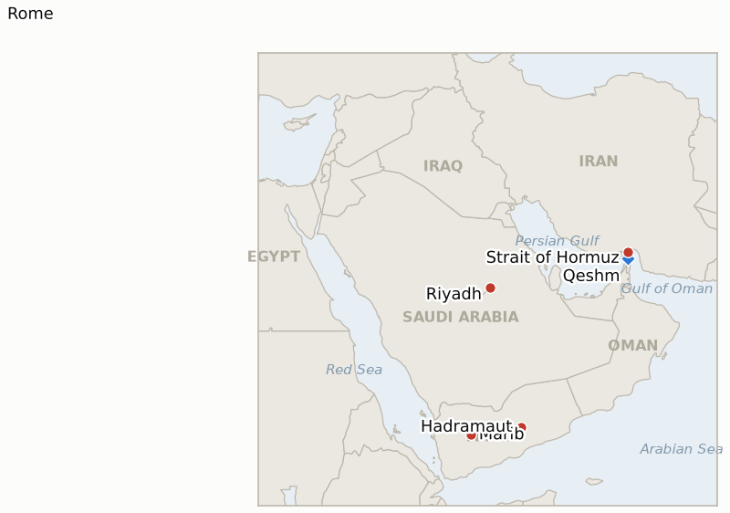

# Middle East Daily Briefing

**August 8, 2026**

- **Reporting window:** ~24 hours, August 7, 09:00 to August 8, 09:00 KST
- **Overall assessment:** Friday's developments widened this war's front count rather than narrowing them, even as the Hormuz story took a step that, for once, points toward de-escalation on paper. Iran and Oman reported finalizing the "general framework" of a 60-day, toll-free shipping arrangement, with entering vessels routed through Iranian waters and exiting vessels through Oman's, mine clearance to begin within 30 days, and Deputy Foreign Minister Gharibabadi stressing implementation is "subject to final approval at the highest decision-making levels," a bottleneck that is really about one man: President Pezeshkian himself said "it is very difficult to communicate with" Supreme Leader Khamenei right now. That single sentence does more to explain this crisis's persistent gap between "agreed in principle" and an actual reopening than any toll dispute has. Two unclaimed explosions on Iran's own Qeshm Island, of disputed origin, arrived hours into the same news cycle, a reminder that "agreed in principle" has preceded exactly this kind of ambiguous incident before. Saudi Arabia, meanwhile, said explicitly that it expects an imminent, coordinated two-pronged attack by Houthi forces from the south and Iran-backed Iraqi militias from the north, targeting its ports, airports and energy infrastructure, even as Riyadh insists its own diplomatic contacts with Iran are moving "in the right direction" — the clearest evidence yet that Gulf capitals see the diplomatic and military tracks as running on separate clocks, not one. Yemen's internal war, reignited Thursday, did not fade: Houthi strikes on Marib killed two more civilians and wounded fourteen, and two of the region's most careful Yemen watchers independently warned that a larger battle is brewing and that the restraint both the Yemeni government and Saudi Arabia have shown may not hold much longer. South Lebanon produced the week's one genuine step toward implementation: Lebanon and Israel agreed a shortlist of countries that could deploy troops to verify Hezbollah's eventual disarmament, vetoing France, with Washington to make the final pick — proof the Rome track can produce concrete outputs even in the same week two Israeli soldiers died there. And in Washington, Trump's private clash with Defense Secretary Hegseth over hidden munitions shortages became a public one: Trump denied any shortage exists while vowing "long-term jail sentences" for the "leakers" who reported it, even as CNN's reporting on nearly 80% depletion of the US THAAD interceptor stockpile, a system Korea itself hosts at Seongju, went unrebutted on the substance.

---

## 1. What Happened

<figure style="float:right; width:46%; margin:2pt 0 8pt 14pt;">

<figcaption style="font-size:8pt; color:#666; text-align:center; margin-top:3pt; font-style:italic;">Major places of discussion</figcaption>
</figure>

### 1.1 Iran and Oman Report Finalizing a Toll Free Hormuz Framework as Qeshm Blasts and a Rival Parliamentary Draft Cloud Its Durability

Iran and Oman said they had finalized the "general framework" of an arrangement to reopen the Strait of Hormuz for a 60-day trial period, with commercial vessels entering the Persian Gulf via a northern route through Iranian territorial waters and vessels heading out to the Arabian Sea via a southern route through Omani waters, no transit fees charged under the arrangement, and a 30-day window to clear naval mines from the strait's main shipping lane before a permanent two-way arrangement is negotiated ([CBS News](https://www.cbsnews.com/live-updates/iran-war-us-trump-strait-of-hormuz-deal/)). Iranian Deputy Foreign Minister Kazem Gharibabadi said the two countries have agreed on the geographical coordinates of the proposed route but that implementation remains "subject to final approval at the highest decision-making levels," and President Pezeshkian separately acknowledged "it is very difficult to communicate with" Supreme Leader Khamenei at the moment, the clearest official confirmation yet that the deal's fate rests on a single, currently inaccessible decision-maker. Iran's parliament speaker Mohammad Bagher Ghalibaf mocked Washington's approach as "theater diplomacy," and a parliamentary committee member insisted the talks concern "vessel movement and navigation routes, not reopening," while Iran's own parliament continues reviewing Thursday's Fars-published draft that would ban US and Israeli vessels outright and fine cargo violators up to 20% of value ([CNBC](https://www.cnbc.com/2026/08/07/oil-rises-supply-fears-iran-draft-plan-strait-hormuz.html); [NPR](https://www.npr.org/2026/08/06/nx-s1-5923623/iran-strait-hormuz-us-israel-ban)). Hours into the same news cycle, Iran's Tasnim news agency reported two explosions heard on Iran's own Qeshm Island as its armed forces "confronted hostile enemy targets" near the strait's entrance, though Hormozgan's deputy governor Ahmad Nafisi said no strike had actually been confirmed on the island or nearby Bandar Abbas and that authorities were investigating the cause ([Gulf News](https://gulfnews.com/world/mena/us-israel-war-on-iran-widens-explosions-rock-qeshm-island-near-hormuz-as-trump-says-conflict-cant-go-much-longer-1.500633276)). Brent settled +1.29% to $83.55 and WTI +1.15% to $78.18 as markets weighed the framework's toll-free terms against the parliamentary draft's contradictory fee structure ([CNBC](https://www.cnbc.com/2026/08/07/oil-rises-supply-fears-iran-draft-plan-strait-hormuz.html)). Reuters-sourced Kpler data showed actual strait traffic continuing to dwindle regardless of the diplomacy: only 33 vessels transited Monday through Thursday this week, versus 50 in the week-ago period, with just four ships, a very large crude carrier loaded with Basrah crude, an LPG carrier and a bulk carrier, crossing on Thursday alone ([gCaptain/Reuters](https://gcaptain.com/vessel-traffic-through-hormuz-dwindles-this-week-as-markets-watch-iran-oman-talks/)). **Confidence: Medium-High** on the reported framework terms and the Khamenei-approval bottleneck (Tier 1-2, on-record officials including a head-of-state acknowledgment, but no signed text); **Medium** on the Qeshm Island incident, whose very occurrence is disputed by a named local official (Tier 2, Iranian state media versus an on-record local denial); **High** on the settle prices and Kpler transit count (Tier 1-2, exchange settles, specialized trade data).

### 1.2 Saudi Arabia Says It Expects an Imminent Coordinated Attack by Houthis and Iraqi Militias on Its Ports and Energy Infrastructure

A Saudi official said the kingdom expects imminent, coordinated attacks from the north and south, Iran-backed Iraqi militias and Yemen's Houthis acting under what Riyadh believes is direct supervision by Iran's Islamic Revolutionary Guard Corps, with intelligence from Saudi Arabia, the United States and regional partners indicating drones and missiles being moved into position from both directions and civilian and economic sites, including energy infrastructure, ports and airports, among the likely targets ([CNN](https://www.cnn.com/2026/08/06/middleeast/saudi-houthi-iran-iraq-attack-latam-intl); [CBC News](https://www.cbc.ca/news/world/saudi-arabia-iraq-yemen-houthis-iran-9.7299356)). The warning followed a Houthi missile attack on southern Saudi Arabia on August 6 that wounded eleven civilians, including a child ([Rappler](https://www.rappler.com/world/middle-east/houthi-attack-saudi-arabia-updates-august-6-2026/)). Saudi officials described the warning as particularly striking given that Riyadh's own contacts with all parties, including Iran, and its mediation efforts were described as moving "in the right direction," an explicit acknowledgment that the kingdom sees its diplomatic and military-threat tracks running independently of one another rather than as a single coherent picture ([Jerusalem Post](https://www.jpost.com/middle-east/article-904832)). The warning also follows the July 29 joint US-Saudi strikes on Iran-backed groups in Iraq, after Riyadh blamed those groups for earlier drone attacks on its oil facilities; Iraqi militias said at the time they would respond. **Confidence: Medium-High** on the warning itself and its stated basis (Tier 1-2, multiple outlets citing Saudi and US officials, IRGC supervision claim attributed rather than independently confirmed); **Low** on whether the attack actually materializes, which by definition has not yet been tested.

### 1.3 Houthi Strikes on Marib Kill More Civilians as Analysts Warn Yemen's Internal War Could Widen Into a Major Battle

Houthi forces fired additional drones and missiles at the government-held city of Marib on Friday; Yemeni government-aligned forces shot several down, but the strikes killed at least two civilians and wounded fourteen, according to Yemen's government, a day after Thursday's larger assault on government military camps in Marib and Hadramaut killed 30 or more soldiers by the Yemeni government's own count and drew a competing Houthi claim of "hundreds" of casualties ([Al Jazeera](https://www.aljazeera.com/news/2026/8/7/two-civilians-killed-in-houthi-strike-on-marib-says-yemens-government); [TRT World](https://www.trtworld.com/article/f814508973eb)). Yemen analyst Ahmed Nagi said "the room for continued restraint is becoming narrow" on both the Yemeni government and Saudi Arabia's side, while researcher Adel Dashela went further, warning that "a ground war between government forces and the Houthi group is imminent, barring a breakthrough in the crisis"; both were describing a Saudi-Yemeni government posture that has so far prioritized de-escalation through "calibrated attacks" rather than a major retaliatory response to Thursday's toll ([Al Jazeera](https://www.aljazeera.com/news/2026/8/7/houthi-attacks-on-govt-forces-hint-that-a-major-battle-in-yemen-is-brewing)). The strikes mark the first sustained internal Houthi ground offensive since a UN-brokered truce held since April 2022, running in parallel with, but analytically distinct from, the Houthis' separate maritime campaign against Saudi-flagged shipping in the Red Sea and Gulf of Aden, which has now claimed eight tankers since the Bab el-Mandeb blockade began in July. **Confidence: Medium-High** on the Friday strikes and casualty figures (Tier 1-2, Yemeni government sourcing, multi-outlet); **Medium** on the analysts' "major battle brewing" assessment, which is informed expert judgment rather than a confirmed operational fact.

### 1.4 Lebanon and Israel Agree a Shortlist of Countries to Verify Hezbollah's Disarmament, Vetoing France

Lebanon and Israel agreed on a shortlist of countries that could deploy troops to verify Hezbollah's eventual disarmament under the US-brokered framework linking Israeli withdrawal to disarmament, a Lebanese official said: "We have reached a short list of countries. We decided which parties were impossible for each and set the potential actors." France was vetoed by both Israel and the United States. The shortlist emerged from this week's meetings at the US embassy in Rome, the same round of talks that concluded Thursday without a breakthrough on withdrawal "model areas"; the United States will now make the final selection and, per the Lebanese official, "could pick more than one country" ([Middle East Eye](https://www.middleeasteye.net/live-blog/live-blog-update/lebanon-israel-agree-shortlist-countries-could-send-troops-verify); [Times of Israel](https://www.timesofisrael.com/liveblog_entry/lebanon-israel-said-to-agree-on-list-of-countries-that-could-verify-hezbollah-disarmament/)). Hezbollah is not a party to the agreement and has not agreed to disarm. The development lands in the same week two Israeli soldiers were killed in the Majdal Zoun blast (brief 2026-08-07 §1.3) and Israel continued strikes elsewhere in south Lebanon, making it the clearest evidence so far that this ledger's IND-20260807-2, opened to test whether the renewed active-combat phase derails or runs parallel to the Rome track, is trending toward the parallel-tracks branch (§3.2). **Confidence: Medium-High** on the shortlist's existence and the France veto (Tier 1-2, multiple outlets citing a named Lebanese official, though the specific countries on the list remain undisclosed); **Medium** on how binding this step actually is, since implementation still awaits a US final selection and Hezbollah's own disarmament remains unresolved.

### 1.5 Trump Publicly Denies a US Munitions Shortage While Vowing to Jail Leakers, as Reports Detail THAAD Interceptor Depletion

Following Wednesday's reported private clash with Defense Secretary Pete Hegseth over hidden shortages in long-range guided missiles and air-defense interceptors (brief 2026-08-07 §1.5), Trump on Thursday and Friday publicly denied that the United States faces any munitions shortage, while separately vowing to hunt down and seek "long-term jail sentences" for the "leakers" behind the reporting: "The 'leakers' of these treasonous statements are being hunted down. Long-term jail sentences will be sought!" ([Democracy Now](https://www.democracynow.org/2026/8/7/headlines/trump_denies_munition_shortages_while_threatening_jail_time_over_leaks); [The Hill](https://thehill.com/policy/defense/6014559-donald-trump-pete-hegseth-military-munitions-iran-war-clash-camp-david/)). The public denial and the leak-hunt threat sit awkwardly together: CNN separately reported the US military had "nearly exhausted 80%" of its THAAD (Terminal High Altitude Area Defense) interceptor stockpile during the Iran war, on top of near-exhaustion of Army Tactical Missile Systems and Precision Strike Missiles, none of which the administration has specifically rebutted on the substance ([RTE](https://www.rte.ie/news/us/2026/0807/1586903-trump-us-weapons/)). The THAAD detail is directly Korea-relevant: South Korea itself hosts a THAAD battery at Seongju, meaning any future US decision to reallocate scarce interceptors among allied deployments would bear on Korea's own missile-defense posture, not just US Middle East policy. **Confidence: Medium-High** on Trump's public statements, which are on-record and multi-outlet (Tier 1-2); **Medium** on the specific 80% THAAD depletion figure, sourced to reporting described as based on people familiar with internal assessments, not an official Pentagon disclosure, and not yet independently corroborated by a second outlet with its own sourcing.

---

## 2. Deep Dive: Incentives and Motives

### 2.1 Why would Iran and Oman announce a toll-free Hormuz framework while Iran's own parliament pushes a rival draft demanding fees?

Because the two tracks are answering to different audiences and different tests of success: the executive channel, run by Pezeshkian, Araghchi and Gharibabadi, needs an internationally presentable deal that Washington will not reject outright, which means dropping the toll language the US has repeatedly said is a redline, while parliament's draft is aimed at a domestic audience that needs to see Iran extracting compensation and asserting control rather than simply reopening a strait for free; the fact that the executive's own framework requires approval "at the highest decision-making levels" means neither track is actually final until Khamenei picks a lane, and every day that approval doesn't come is itself informative about how contested the choice is inside Tehran.

### 2.2 Why would Saudi Arabia publicize a warning about an imminent coordinated attack rather than quietly preparing?

Because a public warning does two things a quiet preparation cannot: it puts Iran and its proxies on notice that Riyadh's intelligence has already mapped the threat, which raises the political cost of actually launching it, and it pre-positions Saudi Arabia's own narrative and international sympathy in the event an attack does occur, making any retaliatory response easier to justify than if the strike arrived without warning; the explicit statement that Riyadh's own contacts with Iran are simultaneously moving "in the right direction" suggests Saudi Arabia sees no contradiction in negotiating and warning at once, treating the threat as coming from actors, the Houthis and Iraqi militias, whose actions Tehran does not fully control even if it supervises them.

### 2.3 Why would Yemen's government and Saudi Arabia respond to Thursday's mass-casualty attack with restraint rather than major retaliation?

Because both governments have more to lose from reigniting a full-scale war they spent years de-escalating than from absorbing a single, however large, Houthi assault; a "calibrated" response preserves the option of a negotiated off-ramp and avoids handing the Houthis a unifying nationalist narrative around resisting renewed Saudi-led strikes, but the two analysts' warnings that restraint is narrowing point to the real risk in this strategy, that de-escalation only works if the other side also wants it, and the Houthis' choice to open a ground front now, while Washington and Riyadh's attention is split across Hormuz and Gaza, reads as a bet that this is precisely the moment restraint is most likely to hold.

### 2.4 Why would Israel and Lebanon reach a concrete implementation step the same week Israeli soldiers died in south Lebanon?

Because the verification-country shortlist and the active-combat phase are answers to different questions that both sides have an interest in keeping separate: the shortlist is a technical, lower-stakes negotiating item that neither side loses much by agreeing to now, while the Majdal Zoun deaths and continued Israeli strikes are being used, per this ledger's ongoing read, to justify continued military pressure rather than to freeze the diplomatic track, meaning both governments benefit from being able to say talks are progressing even as the military situation on the ground deteriorates, since a stalled diplomatic track would remove any framework at all for eventually stopping the fighting.

### 2.5 Why would Trump deny a shortage exists while simultaneously threatening prosecution over reports of one?

Because the two positions serve the same strategic goal from different angles: publicly denying the shortage protects the credibility of continued deterrence and negotiating pressure on Iran and its allies, while the leak-hunt signals to Trump's own government that further disclosures carry real personal risk, discouraging future leaks regardless of whether the initial one was accurate; neither response requires resolving whether the shortage is real, which is precisely the point, since an actual public accounting of US interceptor stocks would be strategically costly whether or not Trump privately believes Hegseth's numbers.

---

## 3. Policy Implications for South Korea

### 3.1 Exposure snapshot

| Item | Current reading | Source |
| --- | --- | --- |
| July-August crude procurement | 110%+ of prior-year volume secured (MOTIE, July 21); strategic reserve swap extended through August, ~21 million barrels swapped to date | MOTIE via Herald Business, Hankyung; `korea-exposure.md` |
| September crude procurement | 90%+ secured (MOTIE, July 21) | MOTIE via Herald Business; `korea-exposure.md` |
| Red Sea detour routing | 14th-plus Korean-bound crude cargo via the Red Sea/Yanbu workaround reported this week, MOF calling it "the most realistic option for the time being" while Hormuz stays unstable | MOF via wire reporting; `korea-exposure.md` |
| Strategic reserve coverage | ~26 days of actual consumption (estimate); swap on immediate standby, untested at scale | CSIS; MOTIE July 27 |
| Brent / WTI | $83.55 / $78.18 settle, +1.29% / +1.15%, as markets weighed the Iran-Oman framework's toll-free terms against the rival parliamentary draft | CNBC |
| KOSPI / USD-KRW | KOSPI -0.60% to 6,258.77, a pause after Thursday's chip-driven plunge; won firmed to 1,416.1, a fourth straight day of strengthening | Hankyung; Money Today |
| Hormuz transits | 4 total vessels, August 6 (a VLCC, an LPG carrier, a bulk carrier), down from 8 on August 4-5; week-to-date 33 vessels versus 50 the prior week | Reuters via gCaptain |
| THAAD interceptor stock (Korea-relevant) | Reported near 80% depletion of US THAAD interceptor stockpile during the Iran war; no official Pentagon confirmation; Korea hosts its own THAAD battery at Seongju | CNN via RTE, The Hill |

### 3.2 Implications by development

**The Iran-Oman Hormuz framework's toll-free terms, if they hold, would be the single most Korea-relevant piece of news in weeks, since a genuinely no-fee, two-lane reopening would let MOTIE and Korean shippers plan around a concrete mechanism rather than a moving negotiating position; but the framework's own dependence on Khamenei's "final approval at the highest decision-making levels," alongside continued Kpler data showing traffic still falling (33 vessels this week versus 50 last week), means KNOC and Korean refiners should treat this as a paper framework, not an operational one, until mine clearance actually begins.** IND-20260803-1 and IND-20260806-1 both lean toward their confirm branches on the announcement itself but remain open against their ~August 10 deadlines pending an actual signed instrument; a new, narrower test of the internal Iranian approval bottleneck itself is opened as IND-20260808-2.

**Saudi Arabia's warning of an imminent coordinated Houthi-Iraqi militia attack on its own ports and energy infrastructure is a direct new risk to the Red Sea corridor Korea's Yanbu-routed tankers already depend on as their Hormuz workaround, since Yanbu itself sits on Saudi Arabia's western coast within the broader threat envelope described; MOFA and MOTIE should treat this warning as a reason to review contingency routing for the Red Sea detour specifically, not just monitor Hormuz.** IND-20260808-1 tracks whether the warned attack materializes, with a bearing on IND-20260726-3's own test of whether Riyadh's posture shifts from restraint to escalation.

**Yemen's widening internal war, now assessed by regional analysts as trending toward a larger battle rather than staying a single raid, adds further, largely independent pressure on the same Red Sea corridor from the south, compounding rather than replacing the Saudi-directed risk above; Korea's shipping insurers and MOF should treat the two Yemen-adjacent risks, the Houthi-Saudi maritime campaign and this newly reignited ground war, as distinct threat vectors that could both deteriorate in the same window.** IND-20260807-1 tracks whether Friday's continued Marib strikes count toward the two-additional-days confirmation bar for a sustained campaign.

**South Lebanon's verification-country shortlist, agreed the same week as new Israeli casualties there, is a useful data point for the broader phased-deescalation template Hormuz and Gaza mediators implicitly reference: it shows that a diplomatic implementation track can keep producing concrete, if modest, outputs even while the underlying military situation compounds, which argues against reading any single front's violence as necessarily predictive of that front's diplomatic trajectory.** IND-20260807-2 continues to track whether the Rome round itself proceeds on schedule.

**Trump's public denial of a US munitions shortage, set against unrebutted reporting of near-80% THAAD interceptor depletion, is the most direct Korea-specific thread in today's briefing: Korea's own Seongju THAAD battery sits inside the same global interceptor supply chain the Iran war has reportedly strained, meaning any future US reallocation decision driven by Middle East depletion could have a direct, mechanical effect on Korea's own missile-defense readiness independent of anything happening in the Gulf.** A dedicated test of this channel is opened as IND-20260808-3.

**Testable indicators:**

- **IND-20260808-1** — Saudi Arabia's feared coordinated Houthi-Iraqi militia attack materializes, or the warning proves precautionary. A verified coordinated attack on Saudi ports, airports or energy infrastructure by ~2026-08-15 confirms it; no such attack through ~2026-08-15 falsifies it as a deterrent warning rather than an imminent operational threat.
- **IND-20260808-2** — Khamenei formally approves the Iran-Oman Hormuz framework, or it stalls pending his review. Public confirmation of his approval, or a signed implementing instrument, by ~2026-08-15 confirms the internal approval bottleneck has cleared; continued silence or a public rejection or material revision through ~2026-08-15 falsifies near-term implementation.
- **IND-20260808-3** — Reported US THAAD interceptor depletion becomes an operative constraint on allied battery stocks, including Korea's Seongju battery, or the story is walked back. Official confirmation of a shortage requiring interceptor reallocation among allied batteries, or a disclosed restocking shortfall affecting Seongju specifically, by ~2026-09-01 confirms it; a Pentagon statement confirming stocks adequate without reallocation, or a credible walk-back of the reporting, by the same date falsifies it.

---

## 4. Watch List

- **Whether Saudi Arabia's warned coordinated Houthi-Iraqi militia attack materializes** (IND-20260808-1, deadline August 15).
- **Whether Khamenei approves the Iran-Oman Hormuz framework, clearing the bottleneck both Gharibabadi and Pezeshkian pointed to this week** (IND-20260808-2, deadline August 15).
- **Whether the reported US THAAD interceptor depletion becomes an operative constraint affecting allied batteries, including Korea's own Seongju deployment** (IND-20260808-3, deadline September 1).
- **Whether the Houthi ground offensive in Marib and Hadramaut continues past Friday's strikes into a sustained campaign** (IND-20260807-1, deadline August 14).
- **Whether south Lebanon's active-combat phase derails or runs parallel to the Rome diplomatic track's proposed September 1 round** (IND-20260807-2, deadline September 1).
- **Whether Washington accepts the Iran-Oman Hormuz terms as reported, and whether the framework converts into a signed instrument** (IND-20260803-1, IND-20260806-1, deadline August 10).
- **Whether the revised disarm-first Gaza framework converges into an accepted deal or collapses back into stalemate**, tracked at two timescales (IND-20260805-1, deadline August 12; IND-20260801-2, deadline August 15).
- **Whether any party besides Washington corroborates Trump's specific claimed deal terms** (a Hormuz reopening tied to an end of Iran's nuclear program) (IND-20260803-2, deadline August 9).
- **Whether Riyadh responds to the Houthi ground offensive by escalating its own Yemen campaign beyond Hodeidah** (IND-20260726-3, deadline August 9).
- **Whether Kuwait's Article 51 invocation is followed by any action beyond protest** (IND-20260802-2, deadline August 15).
- **Whether the Damietta attack is ever formally attributed** (IND-20260801-3, deadline August 14).
- **Whether the Qeshm Island explosions are ever confirmed as a real strike or resolved as a false alarm.**

---

## 5. Source Quality Summary

| Claim | Sources | Confidence |
| --- | --- | --- |
| Iran and Oman finalize a "general framework" for a 60-day, toll-free Hormuz shipping arrangement, pending approval "at the highest decision-making levels" | CBS News, CNBC, NPR (Tier 1-2, on-record officials including a presidential acknowledgment, no signed text) | Medium-High |
| Two explosions heard on Qeshm Island amid an Iranian military "confrontation with hostile targets"; local official says no strike confirmed | Gulf News (Tier 2, Iranian state media relayed by Tier 1-2 wire aggregation, contradicted by a named local official) | Medium |
| Brent settles $83.55 (+1.29%), WTI $78.18 (+1.15%); Hormuz traffic falls to 33 vessels this week versus 50 the prior week | CNBC, Reuters via gCaptain (Tier 1-2, exchange settles, specialized trade data) | High |
| Saudi Arabia expects an imminent coordinated Houthi-Iraqi militia attack on its ports, airports and energy infrastructure | CNN, CBC News, Jerusalem Post (Tier 1-2, multiple outlets citing Saudi and US officials) | Medium-High |
| Houthi strikes kill two more civilians, wound fourteen in Marib on Friday; analysts warn a major battle is brewing | Al Jazeera, TRT World (Tier 1-2, Yemeni government sourcing, named expert analysts) | Medium-High on occurrence; Medium on the "major battle" assessment |
| Lebanon and Israel agree a shortlist of verification countries for Hezbollah's disarmament, vetoing France | Middle East Eye, Times of Israel, Al-Monitor (Tier 1-2, multiple outlets citing a named Lebanese official; specific countries undisclosed) | Medium-High |
| Trump publicly denies a US munitions shortage while vowing to jail "leakers"; reports describe near-80% THAAD interceptor depletion | Democracy Now, The Hill, RTE (Tier 1-2, on-record Trump statements; THAAD figure sourced to reporting on internal assessments, not an official Pentagon disclosure) | Medium-High on Trump's statements; Medium on the THAAD figure |
| KOSPI falls 0.60% to 6,258.77, a pause after Thursday's chip-driven plunge; won firms to 1,416.1, a fourth straight day of strengthening | Hankyung, Money Today (Tier 1-2, exchange data, multi-outlet Korean financial press) | High |
