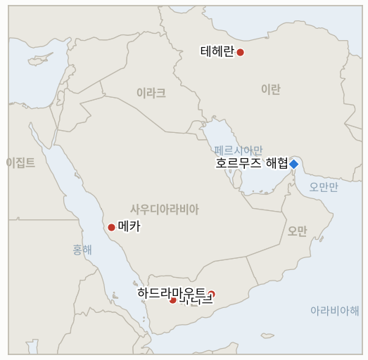

# 중동 일일 브리핑

**2026년 8월 9일**

- **보고 기간:** 약 24시간, 8월 8일 09:00 ~ 8월 9일 09:00 (한국시간)
- **종합 평가:** 어제 브리핑은 서명 하나만 남은 것처럼 보였던 호르무즈 방안으로 마무리됐지만, 오늘 이란은 서명이 아니라 조건의 재선언에 가까운 문서로 답했다. 최고지도자 본인이 아니라 이란 최고국가안보회의가 호르무즈 해협 재개방 조건을 발표했는데, 그 내용은 테헤란과 오만이 거의 완성됐다고 밝혀온 통행료 없는 방안을 훨씬 뛰어넘는다. 이란과 그 대리세력에 대한 미국의 공격 영구 중단, 해상 봉쇄 해제, 역내 군사력 철수, 전쟁 피해에 대한 전액 보상, 제재 해제, 동결 자산 반환이 그것이다. 이 전쟁에 대한 판단이 그동안 신뢰할 만했던 액시오스·이스라엘 12채널의 바라크 라비드는 이 목록을 "미국이 도저히 받아들일 수 없는" 것이라 평가하며, 이는 트럼프 대통령이 불과 며칠 전 접어두었던 군사적 옵션으로 되돌아가게 만들 수 있다고 경고했다. 이는 어제의 낙관적인 "원칙적 합의" 서사가 틀렸다기보다는 시기상조였음을 보여주는 정확한 종류의 발언이다. 이란이 해협에 통행료를 부과할 "계획이 없다"고 미국에 전달했다는 밴스 부통령의 주장은, 테헤란 스스로가 내놓은 훨씬 방대한 요구 목록과 어색하게 병존하는데, 이는 한 당국자의 안심시키는 발언과 한 기관의 공개 입장이 서로 다른 방향을 가리키는 이 전쟁의 반복되는 패턴을 다시 보여준다. 테헤란이 입장을 경화하는 동안, 역내의 오랜 세 경쟁국은 관계를 공식 동맹으로 격상시켰다. 사우디아라비아, 튀르키예, 파키스탄이 나토 5조에 준하는 상호방위 조항을 담은 메카 공동방위협정에 서명했으며, 이는 리야드가 이란이 지원하는 후티와 이라크 민병대로부터 두 방향에서 동시에 위협에 노출된 이 시점을 겨냥해 설계된 것이다. 이스라엘 정치권은 잉크가 마르기도 전에 이 협정을 적대 행위로 규정했고, 이런 반응은 다가오는 이스라엘 10월 총선의 초기 신경전 성격도 함께 띠었다. 한편 예멘 전쟁도 나름의 문턱을 넘었다. 이번 국면이 재점화된 이후 처음으로, 예멘 정부는 후티군의 마리브 공격을 단순히 감내하는 대신 후티 진지에 대한 다축 반격 작전을 개시했으며, 이에 유엔의 한스 그룬드베르그 특사는 예멘이 2022년 휴전 이후 가장 큰 대규모 확전 위험에 직면했다고 경고했다. 토요일이라 정산된 시장이 없어 오늘 브리핑에는 새로운 가격 데이터가 없지만, 거래소가 닫혀 있는 동안 외교와 군사 양면에서 얼마나 많은 지형이 움직였는지가 오늘의 이야기다.

---

## 1. 무슨 일이 있었나

<figure style="float:right; width:46%; margin:2pt 0 8pt 14pt;">

<figcaption style="font-size:8pt; color:#666; text-align:center; margin-top:3pt; font-style:italic;">주요 논의 지점</figcaption>
</figure>

### 1.1 이란 최고국가안보회의, 호르무즈 방안을 위협하는 강경 요구 조건 발표

모하마드 바게르 졸가드르 사무총장이 이끄는 이란 최고국가안보회의는 테헤란과 오만이 거의 확정됐다고 밝혀온 60일간 통행료 없는 항로 방안을 훨씬 뛰어넘는 호르무즈 해협 재개방 조건을 발표했다. 이란과 그 역내 대리세력(헤즈볼라, 하마스, 후티, 그리고 동맹 이라크 세력)에 대한 미국의 공격을 "영구히" 중단할 것, 해상 봉쇄를 해제할 것, 역내에서 미 해군·공군을 철수시킬 것, 2025~2026년 전쟁의 피해에 대해 전액 보상할 것, 모든 제재를 해제할 것, 동결된 이란 자산을 무조건 반환할 것 등이 그 내용이며, 졸가드르는 워싱턴이 "행동을 바로잡을" 때까지 해협이 완전히 재개방되지 않을 것이라고 밝혔다([포브스](https://www.forbes.com/sites/maryroeloffs/2026/08/08/iran-says-us-must-meet-demands-before-strait-of-hormuz-reopens/); [타임스오브이스라엘](https://www.timesofisrael.com/liveblog_entry/irans-supreme-national-security-council-issues-drastic-new-demands-of-the-us-as-conditions-for-reopening-hormuz/)). 액시오스와 이스라엘 12채널의 베테랑 특파원 바라크 라비드는 이 목록을 "미국이 도저히 받아들일 수 없는" 것이라 평가하며, 트럼프 대통령이 불과 며칠 전 접어두었던 군사적 옵션으로 되돌아가게 만들 위험이 있다고 경고했다([타임스오브이스라엘](https://www.timesofisrael.com/liveblog-august-08-2026/)). JD 밴스 부통령은 별도로 이란이 해협에 통행료를 부과할 "계획이 없다"고 미국에 전달했다고 주장했고, 중재를 맡은 한 외교관은 임시 재개방 합의가 양측 모두의 통행료 부과를 금지할 것이라고 확인했는데, 이는 최고국가안보회의가 내놓은 훨씬 방대하고 무관한 요구 목록과 어색하게 병존한다. 이란 혁명수비대 대변인 사르다르 모헤비는 재개방이 오만과의 양자 협정만이 아니라 미국이 테헤란의 조건을 "완전히 수용"하는 데 달려 있다고 덧붙였다([타임스오브이스라엘](https://www.timesofisrael.com/liveblog-august-08-2026/); [알자지라](https://www.aljazeera.com/news/liveblog/2026/8/8/iran-war-live-trilateral-mecca-defence-pact-signed-as-hormuz-deal-looms)). 호르무즈 해협 실제 통항량은 여전히 저조했다. 클러는 8월 7일 확인된 통항 8척을 기록했으며 "대부분의 선박"이 이란의 일방적 항로 방안을 이용했다고 밝혔는데, 클러 자체의 전일 대비 비교 방식을 보면 이미 기록된 8월 6일의 4척(로이터/g캡틴 인용)과는 다른 기준선을 전제하고 있어, 이는 수정이 아니라 서로 다른 통계 제공기관 간의 괴리로 볼 수 있다([클러 X 게시물](https://x.com/Kpler/status/2085680964978561259); [미들이스트아이](https://www.middleeasteye.net/live-blog/live-blog-update/kpler-hormuz-traffic-subdued-surges-18-percent-through-bab-el-mandeb)). **신뢰도: 높음** 최고국가안보회의의 요구 조건과 졸가드르의 온레코드 발언(1·2등급, 다수 매체, 직접 인용); **신뢰도: 중상** 라비드의 평가(공식 미국 측 대응이 아니라 실명이 확인된 전문 정치 분석가의 판단); **신뢰도: 중간** 정확한 호르무즈 통항 수치(통계 제공기관 간 괴리로 인해).

### 1.2 사우디아라비아·튀르키예·파키스탄, 메카 공동방위협정 서명…이스라엘은 적대 행위로 규정

무함마드 빈 살만 사우디 왕세자, 레제프 타이이프 에르도안 튀르키예 대통령, 셰바즈 샤리프 파키스탄 총리는 나토 5조에 준하는 상호방위 조항을 담은 3자 협정인 메카 공동방위협정에 서명했다. 이 조항 아래에서는 서명국 중 한 나라에 대한 무력 공격이 세 나라 모두에 대한 공격으로 간주된다. 이 협정은 2025년 9월 체결된 사우디-파키스탄 양자 간 전략적 상호방위협정을 토대로 하며, 2026년 2월 미국·이스라엘의 대이란 작전으로 시작된 역내 전쟁, 그리고 후티와 이라크 민병대의 반복된 사우디 영토 미사일·드론 공격이라는 배경 아래 서명됐다([US뉴스](https://www.usnews.com/news/world/articles/2026-08-07/saudi-arabia-turkey-and-pakistan-to-sign-joint-defence-deal-amid-regional-turmoil); [알자지라](https://www.aljazeera.com/news/2026/8/7/turkiye-saudi-arabi-pakistan-sign-joint-defence-agreement-whats-in-it); [타임스오브이스라엘](https://www.timesofisrael.com/saudi-arabia-turkey-and-pakistan-sign-joint-defense-deal-in-shadow-of-iran-war/)). 이 협정은 나토 두 번째 규모의 튀르키예군, 세계 최대 산유국인 사우디아라비아의 지위, 그리고 이슬람권 유일의 핵보유국인 파키스탄의 핵전력을 사상 처음으로 하나의 방위 우산 아래 결합한다. 이스라엘은 서명 몇 시간 안에 공식 정부 입장을 내놓지는 않았지만, 정치권은 이를 다가오는 이스라엘 10월 총선의 초기 신경전으로 취급했다. 기데온 사르 외무장관은 하칸 피단 튀르키예 외무장관이 이스라엘을 "인류가 더는 감당할 수 없는 짐"이라고 표현한 데 대해 "교과서적인 집단학살 선동"이라고 비판했고, 네타냐후 총리는 다시 한번 에르도안을 "반유대주의 독재자"라고 불렀으며, 야권 인사 나프탈리 베네트는 네타냐후의 경쟁자 가디 에이젠코트와의 여론조사 경쟁을 의식한 듯 튀르키예를 "새로운 이란"이라 칭하고 "핵보유국 파키스탄을 낀 적대적 수니파 축"을 경고했다([알자지라](https://www.aljazeera.com/news/2026/8/8/netanyahu-mulls-saudi-turkiye-pakistan-pact-as-israeli-elections-loom)). **신뢰도: 높음** 협정 서명, 서명국, 상호방위 조항(1·2등급, 다수 매체, 공식 서명식); **신뢰도: 중상** 이스라엘 내부의 정치적 반응(협정 자체에 대한 이스라엘 정부의 공식 입장이 아니라 실명이 확인된 당국자들의 온레코드 발언).

### 1.3 예멘 정부군, 후티 진지에 다축 반격…유엔은 2022년 이후 최고 수준의 확전 위험 경고

8월 6일 후티군이 대규모 지상전을 재점화한 이후 처음으로, 예멘의 국제적으로 승인된 정부가 공격을 감내하는 대신 공세로 전환했다. 정부군은 토요일 후티가 마리브시에 대한 포격을 재개한 지 몇 시간 만에 "여러 축과 접촉선을 따라" 후티 진지를 공격했으며, 군 대변인은 그 목표를 후티의 "역량과 병력"을 약화시키는 것이라고 설명했다([야후뉴스](https://www.yahoo.com/news/world/articles/yemen-government-forces-attack-houthis-184320864.html); [KFGO/로이터](https://kfgo.com/2026/08/07/houthis-strike-marib-again-as-un-warns-yemen-nearing-wider-conflict/)). 이번 전환은 금요일 마리브에 대한 후티의 계속된 공격, 즉 목요일의 군인 30명 이상 사망에 더해 민간인 2명이 추가로 사망하고 14명이 부상한 사건에 이어 나온 것이며, 같은 날 한스 그룬드베르그 유엔 예멘 특사는 "예멘이 오늘날 2022년 유엔 중재 휴전 이후 그 어느 때보다 큰 대규모 확전 위험에 직면해 있다"고 공식 경고하면서, 마리브·하드라마우트 공격과 별도로 홍해·아덴만에서 계속되는 후티의 해상 작전을 함께 지목하고 모든 당사자에게 "최대한의 자제"를 촉구했다([유엔 예멘 특사 성명, 신화통신 인용](https://english.news.cn/20260808/4bd489063086433f8e304e7a2849c5c6/c.html); [아사르크 알아우사트](https://english.aawsat.com/arab-world/5304649-un-envoy-warns-yemen-verge-wider-conflict)). 이는 지금까지 호데이다 주에 국한돼 있던 사우디 주도 연합군 자체의 태도와는 뚜렷이 다른 신호이며, 오늘의 확전은 리야드가 아니라 사나의 국제적으로 승인된 정부 자체에서 나온 것이다. **신뢰도: 중상** 정부군의 반격과 그룬드베르그의 성명(1·2등급, 다수 매체의 통신사 보도, 실명이 확인된 유엔 특사의 온레코드 성명); **신뢰도: 중간** 정부의 새로운 공세적 태도가 얼마나 지속될지(정의상 아직 여러 날에 걸쳐 검증되지 않음).

### 1.4 안식일에 서안지구 정착민 폭력 급증…이스라엘군 영상 유포로 자체 조사 착수

안식일 동안 서안지구 여러 마을에서 정착민 습격이 이어져 최소 팔레스타인인 11명이 부상했으며, 와디 라힘에서는 6명이 부상했고 그중 1명은 총격으로 다쳤다. 별도로 이스라엘군은 이드나 마을에서 이스라엘군 병사가 민간인 2명과 함께 팔레스타인인 1명을 구타하는 모습이 담긴 영상이 유포된 뒤 자체 조사에 착수했다([타임스오브이스라엘](https://www.timesofisrael.com/liveblog-august-08-2026/)). 이번 사건들은 가자와 레바논 남부에 이어 이스라엘-팔레스타인 갈등의 세 번째 활성 전선을 추가하는 것으로, 역내의 더 큰 국가 간 대치와 병행해 진행되고 있다. 이는 가자의 하마스 무장해제 로드맵이 이스라엘 철군과 하마스 자체 무장해제의 순서를 둘러싸고 여전히 교착 상태에 있으며, 양측 모두 "평화이사회" 이행안에 대한 수용 여부를 확인하지 않은 시점에 벌어졌다. **신뢰도: 중상** 서안지구 사건 자체(1·2등급, 실시간 속보 통신사 취합 보도); **신뢰도: 낮음** 더 넓은 추세에 대한 판단(안식일 하루의 습격만으로는 정착민 폭력이 지속적으로 증가하고 있는지 확인할 수 없음).

---

## 2. 심층 분석: 유인과 동기

### 2.1 이란 최고국가안보회의는 왜 워싱턴이 거부할 것이 뻔한 요구 조건을 발표했을까?

최대주의적 공개 입장은 조용한 수용이 할 수 없는 국내적·협상적 역할을 동시에 하기 때문이다. 강경한 요구 목록을 발표하면, 그동안 행정부 트랙의 "연극 외교"를 비판해온 테헤란 내 강경파는 오만 중재의 기술적 방안이 최종적으로 어떤 모습이 되든 이란의 실제 입장을 자신들이 규정했다고 주장할 수 있게 되고, 동시에 이란 협상가들은 가리브아바디가 이미 합의됐다고 밝힌 "일반 틀"에서 위로 협상해 올라가는 대신 높은 기준점에서 양보하는 형태로 협상할 여지를 확보하게 된다. 라비드의 경고가 직접 지적하는 위험은, 이 정도로 방대한 목록이 워싱턴에서는 협상의 출발점이 아니라 협상 실패의 증거로 읽힐 수 있다는 점이며, 양측의 다음 행보가 어느 쪽 해석이 맞는지 확인해줄 때까지는 두 가능성 모두 여전히 유효하다.

### 2.2 사우디아라비아·튀르키예·파키스탄은 왜 지금 상호방위협정을 공식화했고, 이스라엘은 왜 이를 위협으로 받아들일까?

세 서명국 각각이 별개의 양자 관계를 하나의 집단적 구조로 전환함으로써 서로 다른 것을 얻기 때문이다. 사우디아라비아는 불과 이틀 전 스스로 경고했던 바로 그런 종류의, 이란이 지원하는 다방향 위협에 대한 공식적 억지력을 얻고, 튀르키예는 워싱턴을 거치지 않는 걸프 안보 구조 안에 발판을 마련하며, 파키스탄은 자국의 유일한 중요 전략 자산인 핵전력을 처음으로 걸프 지역 안보 보장에 확장한다. 이스라엘의 경계심은 바로 이 마지막 지점에서 직접 비롯되는데, 핵보유국을 중심으로 구성되고 워싱턴이나 예루살렘을 거치지 않는 안보 구조는 이스라엘이 감시하거나 형성할 수 없는 구조이며, 네타냐후와 베네트의 날 선 발언은 각자 10월 총선을 앞두고 새로 부상하는 "적대적 축"에 더 강경하게 대응하는 모습을 보이려는 경쟁이기도 하다.

### 2.3 예멘 정부는 왜 지금 자제 전략을 버리고 공세로 전환했을까?

이번 주 분석가들이 "좁아지고 있다"고 표현한 자제 전략에는 암묵적인 한계선이 있었고, 목요일의 30명 이상 군인 사망에 더해 금요일까지 이어진 후티의 마리브 공격이 그 선을 넘었을 가능성이 크기 때문이다. 정부가 대응 없이 계속 공격을 감내하기만 하면, 자국 병력과 사우디아라비아 모두에게 정부군이 스스로 지배 지역을 방어할 수 없거나 방어할 의지가 없다는 신호를 보내는 셈이 되며, 이런 정치적 비용이 이제는 눈에 띄게 확전하는 데 따르는 외교적 비용을 넘어섰을 수 있다. 같은 날 나온 그룬드베르그의 유엔 경고는 국제 중재자들도 이번 전환을 일회성 보복이 아니라 실질적인 국면 전환으로 읽고 있음을 시사한다.

### 2.4 역내 관심이 호르무즈와 예멘에 쏠려 있는 사이 서안지구 정착민 폭력은 왜 오히려 격화될까?

이 전쟁 내내 정착민 폭력을 부추겨온 유인 구조는 다른 곳에서 무엇이 뉴스를 지배하는지와 무관하게 작동하기 때문이다. 오히려 호르무즈발 벼랑 끝 외교와 확대되는 예멘 전쟁으로 포화 상태인 뉴스 환경은 더 조용한 한 주였다면 받았을 법한 것보다 서안지구 사건에 대한 관심을 줄이는 효과를 낼 수 있다. 다만 이스라엘군이 이드나 영상을 묵살하는 대신 조사에 착수하기로 한 결정은, 세계의 관심이 다른 곳에 쏠려 있을 때조차 군 스스로 처벌 없는 방임의 평판 비용을 인식하고 있음을 시사한다.

---

## 3. 한국에 대한 정책적 함의

### 3.1 익스포저 현황

| 항목 | 현재 수치 | 출처 |
| --- | --- | --- |
| 7~8월 원유 도입 | 전년 동기 대비 110% 이상 확보(산업통상자원부, 7월 21일); 전략비축유 스와프 8월까지 연장, 현재까지 약 2,100만 배럴 스와프 | 산업통상자원부(헤럴드경제, 한국경제 인용); `korea-exposure.md` |
| 9월 원유 도입 | 90% 이상 확보(산업통상자원부, 7월 21일) | 산업통상자원부(헤럴드경제 인용); `korea-exposure.md` |
| 홍해 우회 운송 | 호르무즈가 여전히 불안정한 가운데, 한국행 원유 화물이 홍해·얀부 우회로를 통해 14번째 이상 도입됐다고 보도됨. 해양수산부는 "현재로서는 가장 현실적인 대안"이라고 설명 | 해양수산부(외신 인용); `korea-exposure.md` |
| 전략비축유 대응력 | 실질 소비 기준 약 26일분(추정); 스와프는 즉시 가동 대기 상태이나 대규모 시행은 아직 검증되지 않음 | CSIS; 산업통상자원부 7월 27일 |
| 브렌트유 / WTI | 토요일로 정산 없음; 마지막 확인된 금요일 종가 83.55달러 / 78.18달러 | CNBC |
| 코스피 / 원달러 환율 | 토요일로 마감 없음; 마지막 확인된 금요일 종가 6,258.77 / 1,416.1원 | 한국경제; 머니투데이 |
| 호르무즈 통항량 | 8월 7일 확인된 통항 8척(클러), 대부분 이란의 일방적 항로 방안 이용; 이미 기록된 8월 6일 4척(로이터/g캡틴)과의 통계 제공기관 간 괴리 존재 | 클러(X), 미들이스트아이 |
| 메카 공동방위협정(한국 관련) | 사우디아라비아·튀르키예·파키스탄 간 신규 3자 상호방위협정; 한국을 직접 겨냥한 조항은 없으나 한국의 최대 원유 공급국 중 하나를 둘러싼 동맹 지형을 재편 | US뉴스, 알자지라, 타임스오브이스라엘 |

### 3.2 사안별 함의

**이란 최고국가안보회의의 요구 조건이 완화되지 않고 그대로 유지된다면, 이는 최근 몇 주간 나온 소식 중 한국과 가장 직결됐던 사안, 즉 산업통상자원부와 한국 정유사들이 구체적 메커니즘을 기준으로 계획을 세울 수 있게 해줄 진정한 무료·양방향 호르무즈 재개방을 무산시키는 셈이 된다. 미군의 영구 철수, 전쟁 배상, 전면적 제재 해제와 같이 방대한 목록은 워싱턴이 며칠 안에 서명할 수 있는 문서가 아니므로, 한국 정책 당국은 "방안 거의 확정" 단계에서 다시 "방안 재차 다툼" 단계로 인식을 되돌리고, 이 원장이 계속 추적해온 7~8월·9월 도입 확보분을 해협 자체의 재개방 일정이 아니라 실질적인 완충 장치로 다뤄야 한다.** IND-20260808-2는 오늘의 전개로 반증 쪽에 더 기울었으며, 워싱턴의 대응이 군사적 옵션 재부상과 좁은 범위의 지속 협상 중 어느 쪽으로 향하는지를 시험하는 새 지표 IND-20260809-1이 개설됐다.

**메카 공동방위협정은 한국을 직접 겨냥한 조항이 없음에도 한국의 외교·방산 수출 정책이 주목해야 할 방식으로 역내 동맹 지형을 재편한다. 핵보유국 파키스탄이 이제 한국의 최대 원유 공급국 중 하나이자 한국 기업이 상당한 건설·에너지 수주 잔고를 보유한 사우디아라비아와 공식 집단방위 구조 안에 함께 놓이게 됐다는 점(`korea-exposure.md`)은, 향후 사우디아라비아가 연루된 위기 상황에서 한국이 추적해야 할 공식 동맹국의 범위가 더 넓어졌음을 의미한다.** 새 지표 IND-20260809-2는 이 협정이 첫 한 달 안에 실질적 구속력을 갖는지, 아니면 상징적 수준에 머무는지를 시험한다.

**예멘 정부 자체의 반격까지 더해져 확대되는 예멘 내전은, 한국의 얀부 경유 유조선이 이미 호르무즈 우회로로 의존하고 있는 홍해 수송로에 계속해서 대체로 독립적인 추가 압박을 가한다. 정부군-후티 간 전쟁이 제한된 충돌 수준에 머물지 않고 개방적이고 지속적인 전투로 확전될 경우, 이 수송로의 리스크 프리미엄이 일시적 현상이 아니라 구조적 현상이 될 가능성이 커진다.** 새 지표 IND-20260809-3은 정부군의 토요일 반격이 지속되는지를 추적하며, IND-20260807-1은 그와 병행되는 기존의 후티 지상 공세를 계속 추적한다.

**서안지구 정착민 폭력과 교착 상태에 빠진 가자 무장해제 로드맵은 한국에 직접적인 단기 익스포저를 발생시키지 않지만, 이 브리핑이 다루는 다른 전선들, 즉 호르무즈, 예멘, 레바논이 이 지역의 활성 화약고를 전부 담고 있지는 않으며, 한국과 관련된 전선이 조용한 날이라고 해서 이 지역 전체가 조용하다는 뜻은 아니라는 점을 상기시켜준다.**

**검증 가능한 지표:**

- **IND-20260809-1** — 이란 최고국가안보회의의 요구 목록이 실질적 결렬인지, 아니면 강경파의 협상 출발점인지. 2026년 8월 16일까지 트럼프 대통령이 이 조건에 대한 거부를 이유로 대이란 군사행동 재개를 언급하거나, 미국이 오만 중재 트랙 종료를 공식 선언하면 실질적 결렬로 확증; 같은 시한까지 최고국가안보회의의 조건을 언급하지 않은 채 통행료·기뢰 제거·항로 등 좁은 범위의 "일반 틀" 조건에 대한 협상이 계속되거나 테헤란이 목록을 철회하면 단순한 입장 표명이었음을 반증한다.
- **IND-20260809-2** — 메카 공동방위협정이 실질적 구속력을 갖는 구조가 되는지, 아니면 상징적 서명에 그치는지. 2026년 9월 8일까지 합동 군사훈련, 기지·전력배치 협정, 재정적 또는 핵공유 관련 공약, 상호방위 조항의 실제 발동 등 구체적 이행 조치가 공개적으로 발표되면 확증; 같은 시한까지 그런 조치가 없으면 첫 한 달간은 상징적 수준이었음을 반증한다.
- **IND-20260809-3** — 예멘 정부군-후티 전쟁이 제한된 충돌에 머무는지, 아니면 개방적이고 지속적인 영토 전투로 확전되는지. 2026년 8월 16일까지 예멘 정부군이 주도하는 공세 작전이 추가로 3일 이상 이어지거나 확인된 영토 변화가 발생하면 확전로 확증; 같은 시한까지 정부군의 추가 공세 작전 없이 간헐적인 후티 주도 공격으로 회귀하고 영토 변화가 없으면 제한된 충돌이었음을 반증한다.

---

## 4. 관찰 목록

- **이란 최고국가안보회의의 강경 요구가 워싱턴을 군사적 옵션으로 되돌리는지, 아니면 양측이 조용히 좁은 범위의 오만 방안 협상으로 복귀하는지 여부** (IND-20260809-1, 시한 8월 16일).
- **메카 공동방위협정이 첫 한 달 안에 구체적 이행 조치를 낳는지, 아니면 서명식 수준의 상징에 머무는지 여부** (IND-20260809-2, 시한 9월 8일).
- **예멘 정부군-후티 전투가 개방적이고 지속적인 전면전으로 확전되는지, 아니면 제한된 충돌로 되돌아가는지 여부** (IND-20260809-3, 시한 8월 16일).
- **마리브·하드라마우트에 대한 후티의 지상 공세가 이번 주를 넘어 지속적 작전으로 이어지는지 여부** (IND-20260807-1, 시한 8월 14일).
- **사우디아라비아가 경고한 후티-이라크 민병대 협공이 실제로 발생하는지 여부** (IND-20260808-1, 시한 8월 15일).
- **최고지도자 또는 최고국가안보회의가 오늘의 강경 발언에도 불구하고 애초 보도된 이란-오만 호르무즈 방안을 결국 공식 승인하는지 여부** (IND-20260808-2, 시한 8월 15일).
- **보도된 미국 사드 요격미사일 소진이 한국 자체의 성주 배치분을 포함한 동맹국 재고에 실질적 제약으로 작용하는지 여부** (IND-20260808-3, 시한 9월 1일).
- **레바논 남부의 활발한 교전 국면이 로마 외교 트랙의 9월 1일 예정 회담을 계속 병행하는지, 아니면 탈선시키는지 여부** (IND-20260807-2, 시한 9월 1일).
- **워싱턴이 애초 보도된 이란-오만 호르무즈 조건을 수용하는지, 그리고 이 방안이 서명된 문서로 전환되는지 여부, 이제 최고국가안보회의의 요구로 더 복잡해짐** (IND-20260803-1, IND-20260806-1, 시한 8월 10일).
- **수정된 무장해제 선행 방식의 가자 프레임워크가 합의로 수렴되는지, 아니면 다시 교착 상태로 돌아가는지 여부**, 두 가지 시간대에서 추적 중 (IND-20260805-1, 시한 8월 12일; IND-20260801-2, 시한 8월 15일).
- **쿠웨이트의 유엔헌장 제51조 원용이 항의를 넘어선 조치로 이어지는지 여부** (IND-20260802-2, 시한 8월 15일).
- **다미에타 공격의 배후가 공식적으로 규명되는지 여부** (IND-20260801-3, 시한 8월 14일).
- **케슘섬 폭발이 실제 공격으로 확인되는지, 아니면 오경보로 정리되는지 여부.**

---

## 5. 출처 신뢰도 요약

| 주장 | 출처 | 신뢰도 |
| --- | --- | --- |
| 이란 최고국가안보회의가 호르무즈 재개방 조건으로 미국의 공격 영구 중단, 봉쇄 해제, 배상, 제재 해제, 동결자산 반환 등 강경 요구 발표 | 포브스, 타임스오브이스라엘(1·2등급, 실명이 확인된 최고국가안보회의 사무총장 발언, 다수 매체) | 높음 |
| 바라크 라비드는 이 요구 조건을 "미국이 받아들일 수 없는" 것으로 평가하며 군사적 옵션 재부상 위험 경고 | 타임스오브이스라엘(1·2등급, 실명이 확인된 특파원의 전문 정치 판단, 공식 미국 대응은 아님) | 중상 |
| 사우디아라비아·튀르키예·파키스탄이 나토 5조에 준하는 상호방위협정인 메카 공동방위협정에 서명 | US뉴스, 알자지라, 타임스오브이스라엘(1·2등급, 공식 서명식, 다수 매체) | 높음 |
| 이스라엘 당국자들(사르, 네타냐후, 베네트)이 다가오는 이스라엘 총선을 앞두고 메카 협정을 적대 행위로 규정 | 알자지라(1·2등급, 실명이 확인된 당국자들의 온레코드 발언) | 중상 |
| 예멘 정부군이 후티 진지에 다축 반격 개시; 유엔 특사 그룬드베르그가 2022년 이후 최고 수준의 확전 위험 경고 | 야후뉴스/로이터, KFGO/로이터, 신화통신·아사르크 알아우사트 인용 유엔 특사 성명(1·2등급, 통신사 보도, 온레코드 유엔 성명) | 중상 |
| 호르무즈 클러 통항량 8월 7일 8척으로, 이미 기록된 8월 6일 4척 수치와 통계 제공기관 간 괴리 존재 | 클러(X), 미들이스트아이(1·2등급, 전문 무역 데이터, 한 건의 미해소 통계 제공기관 간 괴리) | 중간 |
| 안식일에 서안지구 정착민 폭력으로 11명 부상; 이스라엘군이 이드나 구타 영상에 대한 조사 착수 | 타임스오브이스라엘(1·2등급, 실시간 속보 통신사 취합 보도) | 중상 |
