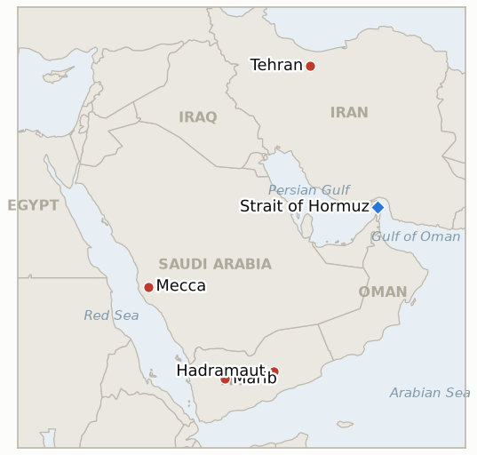

# Middle East Daily Briefing

**August 9, 2026**

- **Reporting window:** ~24 hours, August 8, 09:00 to August 9, 09:00 KST
- **Overall assessment:** Yesterday's brief closed on a Hormuz framework whose only obstacle seemed to be securing one man's signature; today Iran answered with a document that reads less like a signature and more like a counter declaration of terms. Iran's Supreme National Security Council, not Khamenei himself, published a list of conditions for reopening the strait that goes well beyond the toll free framework Tehran and Oman had described as nearly finished: a permanent end to US strikes on Iran and its regional proxies, a lifted naval blockade, military withdrawal from the region, full compensation for war damage, sanctions relief and the release of frozen assets. Axios and Channel 12's Barak Ravid, whose read on this war has held up before, called the list something "clearly the US cannot accept" and warned it could push Trump back toward the military option he set aside only days ago, precisely the kind of statement that makes yesterday's optimistic "agreed in principle" framing look premature rather than wrong. Vice President Vance's claim that Iran told Washington it has "no plans" to toll the strait sits awkwardly next to Tehran's own list of much larger asks, the latest instance of this war's recurring pattern where an official's reassurance and an institution's public position point in different directions. While Tehran hardened its position, three of the region's other longtime rivals moved to formalize one: Saudi Arabia, Turkey and Pakistan signed the Mecca Joint Defence Agreement, a trilateral mutual defense pact with a NATO Article 5 style clause, explicitly built for a moment when Riyadh sits exposed to threats from Iran backed Houthis and Iraqi militias on two fronts at once. Israel's political class read the pact as hostile before the ink dried, and the reactions doubled as an early skirmish in Israel's approaching October election. Yemen's war, meanwhile, crossed a threshold of its own: for the first time since this round reignited, the Yemeni government did not simply absorb another Houthi strike on Marib but launched its own multi axis counteroffensive against Houthi positions, prompting the UN's Hans Grundberg to warn that Yemen faces its greatest risk of large scale conflict since the 2022 truce. No markets settled on a Saturday, so today's brief carries no fresh price data; the story instead is how much diplomatic and military ground shifted while the exchanges stayed closed.

---

## 1. What Happened

<figure style="float:right; width:46%; margin:2pt 0 8pt 14pt;">

<figcaption style="font-size:8pt; color:#666; text-align:center; margin-top:3pt; font-style:italic;">Major places of discussion</figcaption>
</figure>

### 1.1 Iran's Supreme National Security Council Publishes Sweeping Demands That Threaten the Hormuz Framework

Iran's Supreme National Security Council, led by secretary Mohammad Bagher Zolghadr, published a sweeping list of conditions for reopening the Strait of Hormuz that goes well beyond the toll-free, 60-day shipping framework Tehran and Oman had described as nearly finalized: a permanent end to US strikes on Iran and its regional proxies "forever" (Hezbollah, Hamas, the Houthis, and allied Iraqi groups), a lifted US naval blockade, withdrawal of US naval and air forces from the region, full compensation for damage from the 2025 and 2026 wars, the lifting of all sanctions, and the unconditional release of frozen Iranian assets, with Zolghadr stating the strait will not fully reopen until Washington "corrects its behavior" ([Forbes](https://www.forbes.com/sites/maryroeloffs/2026/08/08/iran-says-us-must-meet-demands-before-strait-of-hormuz-reopens/); [Times of Israel](https://www.timesofisrael.com/liveblog_entry/irans-supreme-national-security-council-issues-drastic-new-demands-of-the-us-as-conditions-for-reopening-hormuz/)). Axios and Channel 12's veteran correspondent Barak Ravid called the list something "clearly the US cannot accept," warning it risks pushing Trump back toward the military option he set aside only days earlier ([Times of Israel](https://www.timesofisrael.com/liveblog-august-08-2026/)). Vice President JD Vance separately claimed Iran had told Washington it has "no plans" to toll the strait, and a mediating diplomat confirmed the temporary reopening deal would bar tolls by either side, an assurance that sits oddly next to the SNSC's much larger and unrelated list of asks; IRGC spokesman Sardar Mohebi added that reopening is conditional on the US "fully accepting" Tehran's terms, not merely on the bilateral Oman deal ([Times of Israel](https://www.timesofisrael.com/liveblog-august-08-2026/); [Al Jazeera](https://www.aljazeera.com/news/liveblog/2026/8/8/iran-war-live-trilateral-mecca-defence-pact-signed-as-hormuz-deal-looms)). Hormuz traffic itself stayed subdued: Kpler recorded 8 confirmed crossings on August 7, with most vessels using the unilateral Iranian scheme, though Kpler's own day-on-day comparison implies a materially different August 6 base than the 4-vessel Reuters/gCaptain count this ledger already recorded for that date, a cross-provider divergence rather than a correction ([Kpler via X](https://x.com/Kpler/status/2085680964978561259); [Middle East Eye](https://www.middleeasteye.net/live-blog/live-blog-update/kpler-hormuz-traffic-subdued-surges-18-percent-through-bab-el-mandeb)). **Confidence: High** on the SNSC's demands and Zolghadr's on-record statement (Tier 1-2, multiple outlets, direct quotes); **Medium-High** on Ravid's assessment of the demands' significance, expert political judgment rather than an official US response; **Medium** on the exact Hormuz transit count given the cross-provider divergence.

### 1.2 Saudi Arabia, Turkey and Pakistan Sign a Mecca Joint Defence Agreement, and Israel Reads It as Hostile

Saudi Crown Prince Mohammed bin Salman, Turkish President Recep Tayyip Erdogan and Pakistani Prime Minister Shehbaz Sharif signed the Mecca Joint Defence Agreement, a trilateral pact containing a mutual defense clause comparable to NATO's Article 5, under which an armed attack on any one signatory is treated as an attack on all three; the deal builds on the bilateral Saudi-Pakistan Strategic Mutual Defence Agreement from September 2025 and was signed against the backdrop of a regional war that began with the February 2026 US-Israel campaign against Iran and repeated Houthi and Iraqi-militia missile and drone attacks on Saudi territory ([US News](https://www.usnews.com/news/world/articles/2026-08-07/saudi-arabia-turkey-and-pakistan-to-sign-joint-defence-deal-amid-regional-turmoil); [Al Jazeera](https://www.aljazeera.com/news/2026/8/7/turkiye-saudi-arabi-pakistan-sign-joint-defence-agreement-whats-in-it); [Times of Israel](https://www.timesofisrael.com/saudi-arabia-turkey-and-pakistan-sign-joint-defense-deal-in-shadow-of-iran-war/)). The pact combines Turkey's NATO second-largest military, Saudi Arabia's status as the world's top oil exporter and Pakistan's nuclear arsenal, the only one in the Muslim world, under a single defense umbrella for the first time. Israel had issued no formal government response within hours of the signing, but its political class treated the pact as an early skirmish in Israel's approaching October election: Foreign Minister Gideon Saar accused Turkish counterpart Hakan Fidan of "textbook incitement to genocide" over a remark calling Israel "a burden that humanity can no longer bear," Prime Minister Netanyahu again called Erdogan an "anti-Semitic dictator," and opposition figure Naftali Bennett, positioning himself against Netanyahu's rival Gadi Eizenkot in the polls, labeled Turkey "the new Iran" and warned of a "hostile Sunni axis with nuclear Pakistan" ([Al Jazeera](https://www.aljazeera.com/news/2026/8/8/netanyahu-mulls-saudi-turkiye-pakistan-pact-as-israeli-elections-loom)). **Confidence: High** on the pact's signing, signatories and mutual-defense clause (Tier 1-2, multiple outlets, official ceremony); **Medium-High** on the domestic Israeli political framing, on-record statements by named officials rather than an official Israeli government position on the pact itself.

### 1.3 Yemeni Government Forces Launch a Multi Axis Counteroffensive Against Houthi Positions as the UN Warns of the Highest Conflict Risk Since 2022

For the first time since Houthi forces reignited large-scale ground fighting on August 6, Yemen's internationally recognized government moved from absorbing strikes to attacking: government forces struck Houthi positions across "multiple axes and along the line of contact" on Saturday, hours after the group renewed shelling of Marib city, with a military spokesman describing the goal as degrading Houthi "capabilities and forces" ([Yahoo News](https://www.yahoo.com/news/world/articles/yemen-government-forces-attack-houthis-184320864.html); [KFGO/Reuters](https://kfgo.com/2026/08/07/houthis-strike-marib-again-as-un-warns-yemen-nearing-wider-conflict/)). The shift followed Friday's continued Houthi strikes on Marib, which killed two more civilians and wounded 14 on top of Thursday's 30-plus military dead, and came the same day UN Special Envoy Hans Grundberg formally warned that "Yemen today faces a greater risk of renewed large-scale conflict than at any point since" the UN-brokered truce of April 2022, citing the Marib and Hadramaut attacks alongside the Houthis' separate maritime campaign against Red Sea and Gulf of Aden shipping and calling on all parties to exercise "maximum restraint" ([UN Special Envoy for Yemen statement via Xinhua](https://english.news.cn/20260808/4bd489063086433f8e304e7a2849c5c6/c.html); [Asharq Al-Awsat](https://english.aawsat.com/arab-world/5304649-un-envoy-warns-yemen-verge-wider-conflict)). This is a materially different signal from the Saudi-led coalition's own posture, which has stayed confined to Hodeidah governorate throughout; today's escalation comes from Sanaa's internationally recognized government itself rather than from Riyadh. **Confidence: Medium-High** on the government counteroffensive and Grundberg's statement (Tier 1-2, multi-outlet wire reporting, an on-record UN envoy statement); **Medium** on how sustained the government's new offensive posture proves, which by definition has not yet been tested over multiple days.

### 1.4 West Bank Settler Violence Surges on Shabbat as an IDF Video Draws an Internal Investigation

At least 11 Palestinians were wounded in a wave of settler raids across West Bank villages on Shabbat, including six injured, one by gunfire, in Wadi Rahim; separately, the Israeli military opened an investigation after footage circulated showing an Israeli soldier beating a Palestinian in the village of Idna alongside two civilians ([Times of Israel](https://www.timesofisrael.com/liveblog-august-08-2026/)). The incidents add a third active front, beyond Gaza and south Lebanon, to the set of Israeli-Palestinian flashpoints running in parallel with the region's larger state-to-state confrontations, at a moment when Gaza's Hamas disarmament roadmap remains stalled over the sequencing of Israeli withdrawal and Hamas's own disarmament, with neither side confirming acceptance of the Board of Peace implementation plan. **Confidence: Medium-High** on the West Bank incidents themselves (Tier 1-2, live-blog wire aggregation); **Low** on any broader trend read, since a single Shabbat's raids do not establish whether settler violence is durably increasing.

---

## 2. Deep Dive: Incentives and Motives

### 2.1 Why would Iran's Supreme National Security Council publish demands it must know Washington will reject?

Because a maximalist declaratory position serves a domestic and a negotiating purpose that a quiet acceptance cannot: publishing a sweeping list lets hardliners in Tehran, who have spent weeks criticizing the executive track's "theater diplomacy," claim ownership of Iran's actual position regardless of what the Oman-brokered technical arrangement ultimately looks like, while also giving Iranian negotiators room to concede from a high anchor rather than negotiating up from the "general framework" Gharibabadi described as already agreed; the risk, which Ravid's warning names directly, is that a list this sweeping reads in Washington not as an opening position but as evidence negotiation has failed, and either reading stays plausible until the two sides' next moves clarify which one Tehran intended.

### 2.2 Why would Saudi Arabia, Turkey and Pakistan formalize a mutual defense pact now, and why does Israel treat it as a threat?

Because each of the three signatories gets something distinct from turning separate bilateral relationships into a collective structure: Saudi Arabia gains a declared deterrent against exactly the kind of Iran-backed, multi-directional threat it warned about only two days earlier, Turkey gains a foothold in Gulf security architecture that does not run through Washington, and Pakistan extends its only significant strategic asset, a nuclear arsenal, into a Gulf security guarantee for the first time; Israel's alarm follows directly from that last point, since a security structure built around a nuclear-armed state and explicitly not routed through Washington or Jerusalem is one Israel cannot monitor or shape, and Netanyahu's and Bennett's sharpened rhetoric doubles as each trying to look tougher on an emerging "hostile axis" ahead of October's election.

### 2.3 Why would Yemen's government abandon calibrated restraint for an offensive now?

Because the restraint strategy analysts described earlier this week as "narrowing" had an implicit floor, and Thursday and Friday's continued Houthi strikes on Marib, on top of Thursday's 30-plus military dead, likely crossed it: a government that keeps absorbing strikes without responding risks signaling to its own troops and to Saudi Arabia that it cannot or will not defend government-held territory, a political cost that may now outweigh the diplomatic cost of visibly escalating; Grundberg's UN warning, issued the same day, suggests international mediators read this shift as a genuine inflection point rather than a one-off retaliatory strike.

### 2.4 Why does West Bank settler violence intensify while regional attention is fixed on Hormuz and Yemen?

Because the incentive structure that has driven settler violence throughout this war does not depend on what dominates the news cycle elsewhere; if anything, a news environment saturated with Hormuz brinkmanship and a widening Yemen war gives West Bank incidents less scrutiny than they would draw in a quieter week, and the IDF's decision to open an investigation into the Idna footage, rather than dismiss it, suggests the military itself recognizes the reputational cost of impunity even when global attention sits elsewhere.

---

## 3. Policy Implications for South Korea

### 3.1 Exposure snapshot

| Item | Current reading | Source |
| --- | --- | --- |
| July-August crude procurement | 110%+ of prior-year volume secured (MOTIE, July 21); strategic reserve swap extended through August, ~21 million barrels swapped to date | MOTIE via Herald Business, Hankyung; `korea-exposure.md` |
| September crude procurement | 90%+ secured (MOTIE, July 21) | MOTIE via Herald Business; `korea-exposure.md` |
| Red Sea detour routing | 14th-plus Korean-bound crude cargo via the Red Sea/Yanbu workaround, MOF calling it "the most realistic option for the time being" while Hormuz stays unstable | MOF via wire reporting; `korea-exposure.md` |
| Strategic reserve coverage | ~26 days of actual consumption (estimate); swap on immediate standby, untested at scale | CSIS; MOTIE July 27 |
| Brent / WTI | No settle (Saturday); last verified Friday close $83.55 / $78.18 | CNBC |
| KOSPI / USD-KRW | No close (Saturday); last verified Friday close 6,258.77 / 1,416.1 | Hankyung; Money Today |
| Hormuz transits | 8 confirmed crossings August 7 (Kpler), most via the Iranian Unilateral Scheme; cross-provider divergence noted against the 4-vessel Reuters/gCaptain figure already recorded for August 6 | Kpler via X, Middle East Eye |
| Mecca Joint Defence Agreement (Korea-relevant) | New trilateral mutual-defense pact between Saudi Arabia, Turkey and Pakistan; no direct Korea clause, but reshapes the alliance map around one of Korea's largest crude suppliers | US News, Al Jazeera, Times of Israel |

### 3.2 Implications by development

**Iran's Supreme National Security Council's demand list, if it holds rather than softens, undoes the single most Korea-relevant piece of news from the past week: a genuinely toll-free, two-lane Hormuz reopening that MOTIE and Korean refiners could plan around. A list this sweeping, permanent US withdrawal, war reparations, full sanctions relief, is not a text Washington can sign in days, so Korean planners should shift back from "framework nearly finalized" to "framework contested again," and treat the July-August and September procurement cushions this file already tracks as the load-bearing buffer rather than the strait's own timeline.** IND-20260808-2 leans toward its falsification side following today's development; new IND-20260809-1 opens to test whether Washington's response tips toward renewed military action or a continued, narrower negotiation.

**The Mecca Joint Defence Agreement reshapes the region's alliance map in ways Korea's own diplomatic and defense-export planning should note even though the pact carries no direct Korea clause: a nuclear-armed Pakistan now sits inside a formal collective-defense structure with Saudi Arabia, one of Korea's largest crude suppliers and a state where Korean firms hold significant construction and energy backlog exposure (`korea-exposure.md`), meaning any future crisis involving Saudi Arabia now carries a wider set of formal allies whose own responses Korea would need to track.** New IND-20260809-2 tests whether the pact becomes operationally binding or stays symbolic within its first month.

**Yemen's widening war, now including the government's own counteroffensive rather than only Houthi strikes, adds further and increasingly independent pressure on the Red Sea corridor Korea's Yanbu-routed tankers already depend on as their Hormuz workaround; a government-Houthi war that escalates toward open, sustained fighting, rather than staying a bounded exchange, raises the odds that the corridor's risk premium becomes structural rather than episodic.** New IND-20260809-3 tracks whether the government's Saturday counteroffensive continues; IND-20260807-1 continues to track the underlying Houthi ground campaign it runs alongside.

**West Bank settler violence and Gaza's stalled disarmament roadmap carry no direct near-term Korea exposure, but they are a standing reminder that this brief's other fronts, Hormuz, Yemen, Lebanon, do not exhaust the region's active flashpoints, and that a quiet day on the Korea-relevant fronts does not imply a quiet region.**

**Testable indicators:**

- **IND-20260809-1** — Iran's Supreme National Security Council demand list is a genuine rupture or a hardliner opening position. A Trump statement invoking renewed military action against Iran specifically over rejection of a deal on these terms, or a formal US declaration ending the Oman-mediated track, by ~2026-08-16 confirms it as a real rupture; continued negotiation on the narrower "general framework" terms without reference to the SNSC's conditions, or a Tehran walkback, by the same date falsifies it as posturing.
- **IND-20260809-2** — The Mecca Joint Defence Agreement becomes operationally binding or stays a symbolic signing. Any publicly announced concrete implementing step (joint exercise, basing arrangement, financial or nuclear-sharing commitment, invocation of the mutual-defense clause) by ~2026-09-08 confirms it; no such step by the same date falsifies it as symbolic in its first month.
- **IND-20260809-3** — Yemen's government-Houthi war stays a bounded exchange or escalates into open, sustained territorial fighting. Continued Yemeni government-initiated offensive operations on 3 or more additional days, or a confirmed territorial change, by ~2026-08-16 confirms escalation; a reversion to intermittent Houthi-initiated strikes with no further government offensive action through the same date falsifies it as contained.

---

## 4. Watch List

- **Whether Iran's Supreme National Security Council's sweeping demands push Washington back toward the military option, or the two sides quietly return to negotiating the narrower Oman framework** (IND-20260809-1, deadline August 16).
- **Whether the Mecca Joint Defence Agreement produces any concrete implementing step within its first month, or stays a signing-ceremony gesture** (IND-20260809-2, deadline September 8).
- **Whether Yemen's government-Houthi fighting escalates into sustained, open warfare or reverts to a bounded exchange** (IND-20260809-3, deadline August 16).
- **Whether the underlying Houthi ground campaign against Marib and Hadramaut continues past this week into a sustained offensive** (IND-20260807-1, deadline August 14).
- **Whether Saudi Arabia's warned coordinated Houthi-Iraqi militia attack materializes** (IND-20260808-1, deadline August 15).
- **Whether Khamenei or the Supreme National Security Council ever formally approve the Iran-Oman Hormuz framework as originally described, given today's harder line** (IND-20260808-2, deadline August 15).
- **Whether the reported US THAAD interceptor depletion becomes an operative constraint affecting allied batteries, including Korea's own Seongju deployment** (IND-20260808-3, deadline September 1).
- **Whether south Lebanon's active-combat phase derails or continues running parallel to the Rome diplomatic track's proposed September 1 round** (IND-20260807-2, deadline September 1).
- **Whether Washington accepts the original Iran-Oman Hormuz terms as reported, and whether the framework converts into a signed instrument, now complicated by the SNSC's demands** (IND-20260803-1, IND-20260806-1, deadline August 10).
- **Whether the revised disarm-first Gaza framework converges into an accepted deal or collapses back into stalemate**, tracked at two timescales (IND-20260805-1, deadline August 12; IND-20260801-2, deadline August 15).
- **Whether Kuwait's Article 51 invocation is followed by any action beyond protest** (IND-20260802-2, deadline August 15).
- **Whether the Damietta attack is ever formally attributed** (IND-20260801-3, deadline August 14).
- **Whether the Qeshm Island explosions are ever confirmed as a real strike or resolved as a false alarm.**

---

## 5. Source Quality Summary

| Claim | Sources | Confidence |
| --- | --- | --- |
| Iran's Supreme National Security Council publishes sweeping demands (permanent end to US strikes, lifted blockade, reparations, sanctions relief, frozen-asset release) as conditions for reopening Hormuz | Forbes, Times of Israel (Tier 1-2, on-record SNSC secretary statement, multi-outlet) | High |
| Barak Ravid assesses the demands as something "the US cannot accept," risking a return to the military option | Times of Israel (Tier 1-2, named correspondent's expert political judgment, not an official US response) | Medium-High |
| Saudi Arabia, Turkey and Pakistan sign the Mecca Joint Defence Agreement, a NATO Article 5 style mutual defense pact | US News, Al Jazeera, Times of Israel (Tier 1-2, official signing ceremony, multi-outlet) | High |
| Israeli officials (Saar, Netanyahu, Bennett) react to the Mecca pact as hostile amid approaching Israeli elections | Al Jazeera (Tier 1-2, on-record statements by named officials) | Medium-High |
| Yemeni government forces launch a multi-axis counteroffensive against Houthi positions; UN envoy Grundberg warns of the highest conflict risk since 2022 | Yahoo News/Reuters, KFGO/Reuters, UN Special Envoy statement via Xinhua and Asharq Al-Awsat (Tier 1-2, wire reporting, on-record UN statement) | Medium-High |
| Hormuz Kpler count shows 8 crossings August 7, cross-provider divergence against the recorded 4-vessel August 6 figure | Kpler via X, Middle East Eye (Tier 1-2, specialized trade data, one un-reconciled cross-provider gap) | Medium |
| West Bank settler violence wounds 11 on Shabbat; IDF investigates soldier-beating footage in Idna | Times of Israel (Tier 1-2, live-blog wire aggregation) | Medium-High |
