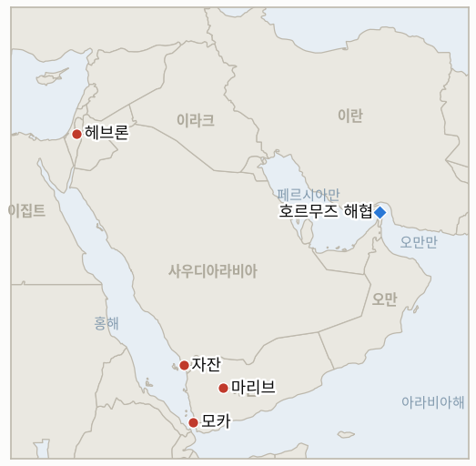

# 중동 일일 브리핑

**2026년 8월 10일**

- **보고 기간:** 약 24시간, 8월 9일 09:00 ~ 8월 10일 09:00 (한국시간)
- **종합 평가:** 일요일 이 전쟁에서 트럼프 구상에 대한 가장 명확한 거부가 나왔다. 네타냐후는 자신의 내각에서 "이스라엘은 평화이사회가 제안한 15개항 가자 문서를 거부한다"고 말하며 이스라엘군 철군 이전 하마스의 완전한 무장해제를 조건으로 내걸었다. 이는 이 원장이 가장 오래 추적해 온 가자 관련 지표를 예정보다 닷새 앞서 반증시켰으며, 백악관은 이렇다 할 반응을 내놓지 않고 있다. 호르무즈 외교 트랙 사정도 나을 것이 없었다. 이란과 오만의 "최종 단계" 표현이 미국이 수용하는 실제 메커니즘으로 전환되는지를 시험하기 위해 이 원장이 개설했던 지표 3건이 모두 오늘 시한을 넘기며 미해결로 끝났고, 실제 그날의 뉴스는 반대 방향으로 흘렀다. UAE 국적 ADNOC 유조선이 통항 중 이란 미사일에 피격됐으나 인명피해는 없었으며, 이란 외교부는 해협 재개방이 "다른 조건들에 달려 있다"는 말을 되풀이했다. 한편 예멘 전쟁은 마리브 지상전에서 사우디 자국 에너지 인프라 타격으로 번졌다. 후티의 드론 공격이 아람코 자잔 정유소를 강타했고, 더 참혹하게는 정부군 소속 홍해 항구 모카에 대한 미사일·드론 공격으로 7명이 숨지고 35명이 다쳤다. 그럼에도 예멘 정부군은 토요일 개시한 반격을 이어갔다. 이 세 전선 밑바닥에는 새로운 사실 하나가 놓여 있다. CNN과 타임스오브이스라엘 등에 따르면 댄 케인 합참의장은 수주간 비공개로 트럼프 행정부 참모들에게 미국이 이 전쟁에서 "출구"를 찾아야 한다고 말해왔다는 것이다. 같은 시기 미 중부사령관은 바레인, UAE, 이스라엘을 순방하며 정반대의 태세를 과시했다. 한국 시장은 이번 주말 거래가 없어 조용했지만, 역내 근본 위험도는 최근 며칠간의 "타결 임박" 서사가 시사했던 것보다 더 나쁜 방향으로 움직였다.

---

## 1. 무슨 일이 있었나

<figure style="float:right; width:46%; margin:2pt 0 8pt 14pt;">

<figcaption style="font-size:8pt; color:#666; text-align:center; margin-top:3pt; font-style:italic;">주요 논의 지점</figcaption>
</figure>

### 1.1 네타냐후, 평화이사회의 15개항 가자 계획을 공식 거부하다

일요일 각료회의에서 네타냐후 총리는 "이스라엘은 평화이사회가 제안한 15개항 문서를 거부한다"고 분명히 밝히며, 하마스가 "진정으로 무장해제"될 때까지 이스라엘군은 철군하지 않을 것이라고 말했다. 그는 "하마스가 무장해제되어야 한다고 말할 때, 나는 중화기든 경화기든 모든 무기를 의미한다"고 경고했으며, 별도로 "가자에도 유대·사마리아에도" 팔레스타인 국가는 없을 것이라고 재확인했다 ([타임스오브이스라엘](https://www.timesofisrael.com/netanyahu-rejects-trumps-15-point-gaza-plan-insists-he-can-stand-up-to-us-president/); [워싱턴포스트](https://www.washingtonpost.com/world/2026/08/09/netanyahu-rejects-trump-backed-plan-hamas-disarm-israel-leave-gaza/); [CNN](https://www.cnn.com/2026/08/09/middleeast/israel-gaza-trump-netanyahu-plan-intl)). 7월 31일 발표된 이 문서는 하마스의 무장해제와 이스라엘의 철군을 단계적이고 대체로 병행하는 과정으로 구상했으나, 네타냐후의 이번 발언은 그 순서를 명시적으로 뒤집는 것이다. 백악관은 즉각적인 논평을 내지 않았고, 여러 매체는 이를 트럼프와 네타냐후의 관계에 긴장을 더하는 신호로 해석했다. 반면 하마스는 텔레그램 성명을 통해 계획을 "원안대로 완전히 이행하는 데 여전히 전념하고 있다"고 밝히며, 자신들의 무장해제는 이스라엘의 완전 철군과 팔레스타인 국가 수립 경로를 조건으로 계속 내걸었다 ([NBC뉴스](https://www.nbcnews.com/world/israel/israel-rejects-trumps-15-point-plan-gaza-pm-benjamin-netanyahu-says-rcna591555); [알자지라](https://www.aljazeera.com/news/2026/8/9/israel-rejects-trumps-15-point-plan-for-gaza)). **신뢰도: 높음** (네타냐후의 발언과 내용, 1~2등급 출처 다수, 각료회의 육성 인용); 백악관의 대응 방향에 대해서는 **중간** (아직 반응이 나오지 않음).

### 1.2 이란 미사일이 UAE 유조선을 타격하는 가운데 호르무즈 지표 3건이 만료되다

UAE 외교부는 ADNOC 소유 선박이 토요일 새벽 호르무즈 해협을 통항하던 중 이란 미사일에 피격됐다고 밝혔다. ADNOC에 따르면 전쟁이 2월 발발한 이후 자사 선박이 피격된 건 이번이 열두 건을 넘으며, 이번에는 인명피해가 없었다 ([WAM](https://www.wam.ae/article/c1mq20a-adnoc-confirms-one-its-vessels-targeted-missile); [CNBC](https://www.cnbc.com/2026/08/08/uae-ship-targeted-missile-us-iran-tensions-stay-high.html); [알자지라](https://www.aljazeera.com/news/2026/8/8/uae-says-iran-targeted-adnoc-tanker-in-hormuz-no-casualties-2)). 이 피격은 이란-오만 "최종 단계" 표현을 검증하기 위해 이 원장이 개설했던 지표 3건이 모두 8월 10일 시한을 맞은 것과 같은 시기에 일어났다. 카르그섬 등 이란 원유 수출 터미널에 대한 검증된 타격은 끝내 없었고(IND-20260727-3, 반증), "원칙적 합의"나 "일반 프레임워크" 수준의 표현이 서명된 문서로 전환된 적도 없으며(IND-20260803-1, 반증), 워싱턴이 이란이 조율하는 통항로나 그 조건을 수용한다는 성명을 낸 적도 없다(IND-20260806-1, 반증). 이란 외교부 대변인은 일요일 해협 재개방이 여전히 "다른 조건들에 달려 있다"고 재확인했으며, 밴스 부통령이 별도로 이란이 해협 통행료를 부과할 "계획이 없다"고 워싱턴에 전했다고 주장한 것도 세 지표가 요구하는 공동 발표에는 미치지 못한다 ([NBC뉴스](https://www.nbcnews.com/world/iran/iran-says-deal-strait-hormuz-close-will-not-open-waterway-rcna591476)). **신뢰도: 높음** (ADNOC 피격, 1~2등급 출처, UAE 정부 공식 성명, 다수 매체); 외교 트랙의 정체에 대해서는 **중상** (단일 사건이 아니라 발표 부재의 지속을 근거로 하지만, 한 주간의 원장 추적과 일관됨).

### 1.3 후티, 사우디 아람코 자잔 정유소를 공격하고 예멘 모카항을 폭격하며 전쟁이 확전되다

후티 군 대변인 야히아 사리는 일요일 하루 40만 배럴을 처리하며 아람코가 호르무즈를 거치지 않고 정제 제품을 홍해로 수출할 수 있게 하는 사우디 아람코 자잔 정유소를 드론으로 공격했다고 밝히며, 이를 사우디의 후티 통치 지역 사다·하자 주에 대한 드론 침입 의혹에 대한 보복이라고 주장했다. 사우디 에너지부는 아람코 소방팀이 화재를 진압했으며 부상자는 없다고 밝혔다 ([알자지라](https://www.aljazeera.com/news/2026/8/9/saudi-arabia-says-fire-extinguished-at-aramco-facility-in-jizan); [NBC뉴스](https://www.nbcnews.com/world/middle-east/yemens-houthis-attack-saudi-aramco-jazan-refinery-rcna591561)). 자잔 정유소는 7월 27일 공격으로 이미 일부 가동이 중단돼 8월 15일경 재가동을 목표로 복구 중이던 시설로, 이번 공격은 복구가 한창인 시설을 다시 강타한 셈이다. 별도로 더 참혹한 피해가 후티 미사일·드론이 예멘 국제승인 정부의 주요 홍해 항구이자 후티 통치 호데이다항을 우회하기 위해 건설된 모카항을 폭격하면서 발생했다. 최소 7명이 숨지고 35명이 다쳤으며, 예멘 교통부 장관 모센 알오마리는 최소 25발의 발사체가 항만 건물과 부두, 상업 물자를 강타했다고 밝혔다 ([더내셔널](https://www.thenationalnews.com/news/gulf/2026/08/09/red-sea-crisis-escalates-with-houthi-strikes-on-yemens-mokha-port-and-saudi-aramco-refinery/); [아나돌루통신](https://www.aa.com.tr/en/middle-east/7-killed-35-injured-as-houthis-bomb-yemen-s-mokha-port-near-bab-al-mandab-strait/4022388)). 예멘 정부군은 이틀째 토요일 개시한 후티 진지에 대한 다축 반격을 이어가며 마리브 인근에서 계속되는 포격 속에서도 공세를 유지했다 ([알자지라](https://www.aljazeera.com/news/2026/8/8/yemens-government-forces-attack-houthis-amid-renewed-shelling-of-marib)). **신뢰도: 높음** (자잔·모카 공격과 사상자 수, 1~2등급 출처, 사우디·예멘 정부 공식 발표, 다수 매체 통신); 자잔 피격이 이미 잠정 계획된 8월 15일 재가동을 실질적으로 지연시킬지 여부는 **중간**.

### 1.4 미 중부사령관이 역내를 순방하는 가운데 이란 전쟁 출구론이 비공개로 제기되다

브래드 쿠퍼 미 중부사령관은 바레인, UAE 방문에 이어 토요일 몇 시간 동안 이스라엘을 방문해 에이알 자미르 이스라엘군 참모총장 및 고위 지휘관들과 면담했으며, 평화이사회가 하마스 무장해제 합의를 발표한 지금 워싱턴이 가자 평화안의 다음 단계 이행을 이스라엘에 계속 압박하고 있다고 전했다. 이 구도는 몇 시간 뒤 네타냐후 내각의 발언으로 무너졌다 ([신화통신](https://english.news.cn/20260809/13d41eff2be145f5b370552897e4682e/c.html); [타임스오브이스라엘](https://www.timesofisrael.com/liveblog-august-08-2026/); [JNS](https://www.jns.org/centcom-commander-visits-israel-reviews-operation-rising-lion-success/)). 이번 방문은 댄 케인 합참의장이 수주간 비공개로 존 랫클리프 CIA 국장, 마르코 루비오 국무장관, JD 밴스 부통령 등 트럼프 행정부 최고위 참모들에게 미국이 이란 전쟁에서 "출구"를 찾아야 한다고 말해왔다는 광범위한 보도와 겹쳤다. 그는 추가 군사적 확전이 역효과를 낼 수 있으며 공중전만으로는 트럼프가 내세운 목표를 달성하기 어렵다고 경고했다고 전해진다. 소식통들은 그 목표가 무조건 철수가 아니라 호르무즈 재개방 합의를 축으로 한 체면치레용 출구라고 설명한다 ([CNN](https://www.cnn.com/2026/08/07/politics/general-dan-caine-off-ramp-iran-war); [타임스오브이스라엘](https://www.timesofisrael.com/top-us-general-said-urging-iran-war-off-ramp-as-tehran-and-oman-near-hormuz-deal/)). **신뢰도: 높음** (쿠퍼 사령관의 방문과 공식 결과 보고, 1~2등급 출처, 중부사령부 성명, 다수 매체); 케인 관련 보도는 케인 본인의 육성 발언이 아니라 익명 관계자를 인용한 것이나 여러 매체가 일관된 세부 내용으로 뒷받침하고 있어 **중간**.

### 1.5 서안지구 정착민 폭력이 2주 연속 지속되다

이스라엘 정착민들이 밤새 서안지구 남부 헤브론 산악지대 와디 라힘의 팔레스타인 재산에 방화했으며, 영상에는 정착민들이 가옥에 진입해 가구에 불을 지르는 모습이 담겼다. 별도로 베들레헴 인근에서도 정착민들이 팔레스타인 가옥을 습격해 창문을 부수고 재산을 훼손했다 ([미들이스트아이](https://www.middleeasteye.net/live-blog/live-blog-update/israeli-settlers-set-fire-palestinian-property-west-bank)). 이번 사건은 지난 주말 보도된 정착민 습격 물결에 이은 것이며, 며칠 전 이드나 마을에서 이스라엘 군인이 팔레스타인 주민을 구타하는 영상이 유포된 데 대한 이스라엘군의 조사가 여전히 진행 중인 가운데 발생했다 ([타임스오브이스라엘](https://www.timesofisrael.com/liveblog-august-09-2026/)). **신뢰도: 중상** (개별 사건들, 1~2등급 출처, 실시간 블로그 취합 보도, 영상 증거 인용); 더 넓은 추세 판단에 대해서는 **낮음** (2주간의 습격만으로는 지속적 확대를 단정할 수 없음).

---

## 2. 심층 분석: 유인과 동기

### 2.1 트럼프가 그토록 공을 들인 계획을 네타냐후는 왜 지금 거부하는가

지금 단계적 철군을 수용하는 것으로 비치는 정치적 비용이 워싱턴과 공개적으로 갈라서는 외교적 비용보다 크기 때문일 가능성이 높다. 네타냐후 연립정부에는 하마스가 어떤 형태로든 능력을 유지하는 결과를 용납할 수 없다고 밝혀온 각료들이 포함돼 있으며, "진정한 무장해제"라는 틀로 거부를 포장하면 타협이 아니라 원칙을 지킨 것으로 주장할 수 있다. 하마스 역시 텔레그램 성명에서 원안에 대한 이행 의지와 자신들의 조건을 재확인한 것을 보면, 양측 모두 지금은 타협점을 향해 움직이기보다 각자의 입장을 방어하는 모습으로 비치는 쪽을 선호하는 듯하다. 이는 협상이 진행 중이라기보다, 워싱턴이든 역내 중재자든 국내 정치든 결국 외부 요인이 해법을 강제할 때까지 각자 입지를 다지는 양상에 가깝다.

### 2.2 이란이 호르무즈 합의가 임박했다고 말하는 바로 그 주에 왜 이란 미사일이 유조선을 타격하는가

이란의 공식 협상 입장과 실제 작전 현실이 서로 다른 기관에 의해 결정되기 때문일 가능성이 크다. 외교부의 "최종 단계" 발언과 최고국가안보회의의 광범위한 요구는 모두 테헤란에서 나오지만, ADNOC 유조선을 타격한 미사일은 외교관들의 공개 발언과 무관하게 혁명수비대의 작전 템포가 독자적으로 지속되고 있음을 그럴듯하게 보여준다. 이는 이 원장이 8월 초부터 추적해 온 반복적 패턴, 즉 한 관계자의 안심시키는 발언과 한 기관의 실제 행동이 서로 다른 방향을 가리키는 패턴과 같으며, 한국의 선사를 포함한 외부 관찰자들은 그날그날 어느 이란 목소리가 우세할지 사전에 신뢰성 있게 알 방법이 없다.

### 2.3 후티는 왜 같은 날 사우디 에너지 인프라와 정부군 항구를 동시에 타격하는가

사우디 자체 원유 처리 능력에 대한 타격과 국제승인 정부의 홍해 보급선에 대한 타격을 동시에 가하는 협공은 새로운 역량을 필요로 하지 않고 기존 드론·미사일 자산을 난이도가 아닌 가치를 기준으로 선정한 표적에 사용함으로써 두 적대세력 모두에 대한 압박을 극대화한다. 자잔 타격은 국경 침입이라 주장하는 사안에 대해 리야드를 직접 응징하는 것이고, 모카 타격은 마리브 지상전에 관심이 쏠린 사이 정부군 자체의 병참을 약화시키는 동시에 상선에 대한 해상 작전이 전혀 완화되지 않았음을 알리는 신호다. 이 조합은 사우디의 신중 대응 기조와 예멘 정부군의 새로운 반격 태세 모두에 판돈을 높인다.

### 2.4 미 중부사령관이 역내에서 결의를 과시하는 사이 합참의장은 왜 비공개로 출구론을 제기하는가

두 역할이 서로 다른 청중을 상대하기 때문이다. 쿠퍼 사령관의 순방, 즉 자미르 참모총장과의 면담과 가자 다음 단계 이행 압박은 계속된 미국의 개입을 확인받고 싶어 하는 동맹국을 향한 공개적 안심 신호다. 반면 케인 의장의 비공개 진언은 화려하지 않지만 냉정한 판단, 즉 추가 확전이 이 원장이 별도로 추적해 온 탄약 재고 부족 문제를 특히 악화시킬 위험이 있으면서도 트럼프가 내세운 목표에 이르는 명확한 경로가 없다는 판단이다. 두 태도는 모순이라기보다, 미군 지도부가 동맹의 신뢰를 관리하는 동시에 출구를 모색하고 있다는 증거에 가깝다. 이는 정책 전환을 곧바로 알리기보다 앞서는 전형적인 내부 균열 신호다.

### 2.5 역내 관심이 호르무즈와 예멘에 쏠린 가운데 서안지구 정착민 폭력은 왜 계속되는가

정착민 폭력을 이끄는 지역적 유인, 즉 토지 접근성, 처벌 면제에 대한 기대, 이념적 확신은 어느 지역이 뉴스 주기를 장악하는지와 무관하기 때문이다. 오히려 호르무즈 위기와 확대되는 예멘 전쟁으로 뒤덮인 한 주는 조용한 주보다 서안지구 사건에 대한 국제적 관심을 덜 끌 수 있다. 이드나 영상에 대한 조사가 종결이 아니라 계속 진행 중이라는 사실은, 세계의 관심이 다른 곳에 있을 때조차 이스라엘군 스스로 눈에 띄는 면죄부에 따르는 평판 비용을 인식하고 있음을 시사한다.

---

## 3. 한국에 대한 정책적 함의

### 3.1 익스포저 현황

| 항목 | 현재 수치 | 출처 |
| --- | --- | --- |
| 7~8월 원유 도입 | 전년 동기 대비 110% 이상 확보(산업통상자원부, 7월 21일); 전략비축유 스와프 8월까지 연장, 현재까지 약 2,100만 배럴 스와프 | 산업통상자원부 (헤럴드경제, 한경 경유); `korea-exposure.md` |
| 9월 원유 도입 | 90% 이상 확보(산업통상자원부, 7월 21일) | 산업통상자원부 (헤럴드경제 경유); `korea-exposure.md` |
| 홍해 우회 노선 | 홍해·얀부 우회로를 통한 한국행 원유 14번째 이상 화물, 이제 양 끝단 모두 노출: 사우디 측 얀부 선적과 예멘 정부군 항구 모카를 지나는 바브엘만데브 통항 구간이 동일한 후티 세력의 위협 아래 놓임 | 해양수산부 (통신사 경유); `korea-exposure.md` |
| 전략비축유 커버리지 | 실소비 기준 약 26일분(추정); 스와프는 즉시 대기 상태이나 대규모 실전 검증은 없음 | CSIS; 산업통상자원부 7월 27일 |
| 정유사 사우디 지분 노출 | S-Oil(사우디 아람코 지분 약 63%), HD현대오일뱅크(아람코 지분 약 17%); 아람코 자체 자잔 정유소는 7월 27일 공격에서 복구 중이던 상태에서 일요일 재차 피격 | 공시 자료; `korea-exposure.md` |
| 브렌트/WTI | 종가 없음(일요일); 마지막 확인된 금요일 종가 배럴당 83.55달러/78.18달러 | CNBC |
| 코스피/원달러 | 마감 없음(일요일); 마지막 확인된 금요일 마감 6,258.77 / 1,416.1원 | 한경; 머니투데이 |
| 호르무즈 통항량 | 8월 8~9일 새로운 켈러/로이터 집계 없음; 마지막 확인된 통항량은 8월 7일 8척; 8월 8일 이란 미사일이 해협 내 ADNOC 유조선을 타격 | 켈러(X 경유); WAM |

### 3.2 사안별 함의

**네타냐후의 15개항 가자 계획 거부는 한국에 직접적인 에너지·환율 익스포저를 발생시키지는 않지만, 한국 실무진이 조용히 반영해 오던 안정화 가정, 즉 호르무즈·예멘과 달리 가자는 재개된 대치가 아니라 해결로 향하고 있다는 전제를 무너뜨린다.** 이스라엘·하마스 대치가 지속되면 평화이사회의 외교적 역량이 가자에 계속 묶여, 정작 호르무즈와 예멘이 적극적인 미국·역내 중재를 필요로 하는 이 시점에 자원이 분산된다. IND-20260801-2는 오늘 반증됐고, 그 후속으로 좁혀진 IND-20260805-1(시한 8월 12일)이 무장해제 선행 대안이 실제로 수렴할지를 가늠할 가장 가까운 시험대다.

**ADNOC 피격과 호르무즈 합의 지표 3건의 8월 10일 시한 만료는, 이란 외교장관이 협상을 "최종 단계"라고 처음 언급한 지 일주일이 지나도록 한국 정유사와 한국석유공사가 여전히 계획할 만한 구체적이고 미국이 수용한 통항 체계를 갖지 못했음을 의미한다.** 이 원장이 이미 추적해 온 7~8월 및 9월 도입 물량 완충분이 여전히 핵심 버팀목이며, 해협 자체의 재개방 시점은 임박이 아니라 무기한 재설정된 것으로 취급해야 한다. 신규 IND-20260810-1(시한 8월 20일)은 이번 주의 좌절을 딛고 수정된 메커니즘이 실제로 실현 가능하고 상호 수용되는 합의로 전환될지를 추적한다.

**확대되는 예멘 전쟁은 이제 한국이 의존하는 홍해 우회로 양쪽 끝단, 즉 얀부(자잔 피격이 보내는 신호처럼 사우디 에너지 인프라도 더 이상 이 전쟁으로부터 안전지대가 아니라는 점을 통해)와 모카(한국행 유조선이 호르무즈를 피하기 위해 통과하는 바브엘만데브 해협의 동일 회랑에 위치)를 동시에 위협한다.** 통항 중인 상선뿐 아니라 정부군 항구를 직접 타격할 의지를 가진 후티 세력이라면, 이 회랑의 리스크 프리미엄이 구조적으로 굳어질 가능성이 커진다. 신규 IND-20260810-3(시한 8월 17일)은 사우디가 자잔 피격에 직접 보복으로 대응할지를 시험하며, 이는 추가 확전을 가늠하는 문턱이 될 것이다. IND-20260809-3(시한 8월 16일)은 정부군 반격의 지속 여부를 계속 추적한다.

**미 합참의장이 비공개로 이란 전쟁 출구를 압박하고 있다는 보도는, 사실이고 실제 정책으로 이어진다면 한국의 자체 위험 일정에 큰 의미를 갖는다. 진정한 미국의 확전 완화 움직임은 워싱턴이 공식 인정하지 않은 그 어떤 이란-오만 양자 합의보다 실제 호르무즈 재개방으로 이어질 가장 유력한 경로이기 때문이다.** 신규 IND-20260810-2(시한 8월 20일)는 이 비공개 진언이 트럼프의 발언, 태세 변화, 새로운 미국 제안 등 가시적 변화로 이어지는지를 시험하며, 이란 최고국가안보회의의 요구가 오히려 워싱턴을 확전으로 몰아갈지를 추적하는 IND-20260809-1(시한 8월 16일)과 함께 지켜볼 필요가 있다.

**서안지구 정착민 폭력은 단기적으로 한국에 직접적인 익스포저를 발생시키지 않지만, 호르무즈·예멘·가자가 이 지역의 활성 화약고를 모두 소진시키지 않는다는 것과, 한국 시장의 조용한 일요일이 이 지역 전체의 평온을 의미하지는 않는다는 것을 계속 일깨워 준다.**

**검증 가능한 지표:**

- **IND-20260810-1** — 축소되거나 수정된 이란-오만 호르무즈 메커니즘이 공개 발표되고 수용되는지, 아니면 외교 트랙이 계속 정체되는지. 공개 발표되고 상호 확인된 메커니즘이 명시적 미국 수용 성명이나 3자 공동 발표까지 이끌어내면(2026년 8월 20일경까지) 회복으로 확증되며, 같은 시점까지 공동 발표된 메커니즘이 없거나 이란의 조건이 더 확대되면 반증되어 외교 트랙이 지속적으로 정체된 것으로 확인된다.
- **IND-20260810-2** — 케인 합참의장의 비공개 출구론이 미국의 이란 전쟁 정책에 가시적 변화를 가져오는지, 아니면 워싱턴의 공개 태도가 그대로 유지되는지. 트럼프의 협상 재개 지지 발언, 확인된 미군 태세 축소, 새로운 공식 협상안 제시 중 하나가 2026년 8월 20일경까지 나오면 정책 전환으로 확증되며, 같은 시점까지 확전 위협만 계속되고 태세 변화나 새 제안이 없으면 반증된다.
- **IND-20260810-3** — 사우디 에너지 인프라에 대한 후티 공격이 사우디의 직접적 군사 대응을 이끌어내는지, 아니면 리야드가 호데이다 중심의 절제된 태세를 유지하는지. 자잔 정유소 피격에 대한 명시적 보복으로 연결된 사우디 연합군의 검증된 후티 표적 공격이 2026년 8월 17일경까지 확인되면 직접 보복으로의 전환이 확증되며, 같은 시점까지 소방 대응과 성명, 호데이다주 국한 작전에 머무르면 반증된다.

---

## 4. 관찰 목록

- **수정된 이란-오만 호르무즈 메커니즘이 "최종 단계" 표현이 미해결로 만료된 이후 실제 미국 수용 합의로 회복될지 여부** (IND-20260810-1, 시한 8월 20일).
- **케인 합참의장의 비공개 출구론이 미국 정책을 가시적으로 바꿀지, 아니면 정책에 반영되지 않은 내부 조언에 그칠지** (IND-20260810-2, 시한 8월 20일).
- **사우디가 자잔 정유소 피격에 후티 표적에 대한 직접 보복으로 대응할지 여부** (IND-20260810-3, 시한 8월 17일).
- **네타냐후가 밀고 있는 무장해제 선행 방식의 가자 프레임워크가 이스라엘 안보내각의 공식 승인으로 수렴할지, 15개항 계획이 이스라엘 스스로의 조건에서 이미 폐기된 지금 그 여부** (IND-20260805-1, 시한 8월 12일).
- **이란 최고국가안보회의의 요구가 워싱턴을 군사행동 재개로 몰아갈지, 아니면 양측이 조용히 좁혀진 프레임워크 협상으로 복귀할지** (IND-20260809-1, 시한 8월 16일).
- **예멘 정부군-후티 전쟁이 지속적이고 공개적인 전면전으로 확대될지, 아니면 제한적 충돌로 되돌아갈지** (IND-20260809-3, 시한 8월 16일).
- **마리브·하드라마우트에 대한 후티 지상 공세가 지속적인 공세로 이어질지 여부** (IND-20260807-1, 시한 8월 14일).
- **사우디가 경고한 후티-이라크 민병대 연합 공격이 일요일의 후티 단독 자잔 타격을 감안할 때 진정한 협공 형태로 실현될지 여부** (IND-20260808-1, 시한 8월 15일).
- **하메네이 또는 이란 최고국가안보회의가 원안이든 수정안이든 호르무즈 프레임워크를 공식 승인할지 여부** (IND-20260808-2, 시한 8월 15일).
- **레바논 남부의 실전투 국면이 로마 외교 트랙의 9월 1일 예정 회담과 병행 진행될지, 아니면 궤도를 이탈할지** (IND-20260807-2, 시한 9월 1일).
- **특정 걸프 국가가 해협 안보와 연계된 구체적 달러 표시 대미 투자 패키지를 발표할지 여부** (IND-20260715-2, 시한 8월 14일).
- **이란의 동결자산 통항 금지 조치가 실제 선박에 시험될지, 아니면 수사적 지렛대로 남을지** (IND-20260729-2, 시한 8월 12일).
- **미국-이란 중재 메시지가 공동 인정된 회담이나 프레임워크로 전환될지 여부** (IND-20260728-3, 시한 8월 11일).
- **쿠웨이트의 51조 원용이 항의를 넘어선 행동으로 이어질지 여부** (IND-20260802-2, 시한 8월 15일).
- **다미에타 공격의 책임 소재가 공식 규명될지 여부** (IND-20260801-3, 시한 8월 14일).
- **케슘섬 폭발이 실제 타격으로 확인될지, 아니면 오경보로 종결될지.**

---

## 5. 출처 신뢰도 요약

| 주장 | 출처 | 신뢰도 |
| --- | --- | --- |
| 네타냐후, 각료회의에서 평화이사회의 15개항 가자 계획 거부, 철군 전 완전한 무장해제 요구 | 타임스오브이스라엘, 워싱턴포스트, CNN, NBC뉴스, 알자지라 (1~2등급, 각료회의 육성 발언, 다수 매체) | 높음 |
| 하마스, 텔레그램 성명으로 원안대로의 완전 이행 의지 재확인 | NBC뉴스, 알자지라 (1~2등급, 단체 공식 성명) | 높음 |
| 이란 미사일이 UAE ADNOC 유조선을 호르무즈 해협 통항 중 타격, 인명피해 없음 | WAM(UAE 국영통신, 외교부 공식 성명), CNBC, 알자지라 (1~2등급, 정부 공식 성명, 다수 매체) | 높음 |
| 호르무즈 합의 관련 지표 3건(카르그 타격, 이란-오만 메커니즘 발표, 미국 수용)이 8월 10일 시한에 미해결로 만료 | 본 원장의 자체 일일 추적(2026-07-27/08-03/08-06 개설); 이란의 지속되는 조건에 관한 NBC뉴스 보도 | 중상 |
| 후티, 사우디 아람코 자잔 정유소 드론 공격, 화재 진압, 부상자 없음 | 알자지라, NBC뉴스 (1~2등급, 후티 주장 및 사우디 에너지부 확인) | 높음 |
| 후티, 예멘 모카항 폭격, 최소 7명 사망 35명 부상 | 더내셔널, 아나돌루통신 (1~2등급, 예멘 교통부 장관 육성 확인, 다수 매체) | 높음 |
| 예멘 정부군, 마리브 인근 계속되는 포격 속에서도 후티 진지에 대한 반격 지속 | 알자지라 (1~2등급, 통신사 보도) | 중상 |
| 브래드 쿠퍼 중부사령관, 이스라엘·바레인·UAE 방문, 자미르 등 이스라엘군 고위 지휘관과 면담 | 신화통신, 타임스오브이스라엘, JNS (1~2등급, 중부사령부 공식 결과 보고, 다수 매체) | 높음 |
| 댄 케인 합참의장, 트럼프 행정부 참모들에게 비공개로 이란 전쟁 출구론 제기 | CNN, 타임스오브이스라엘 (1~2등급, 익명 관계자 인용, 케인 본인의 육성 확인은 아님) | 중간 |
| 서안지구 정착민, 와디 라힘에서 방화하고 베들레헴 인근 가옥 습격; IDF는 이드나 군인 구타 영상 조사 중 | 미들이스트아이, 타임스오브이스라엘 (1~2등급, 실시간 블로그 취합 보도, 영상 증거 인용) | 중상 |
