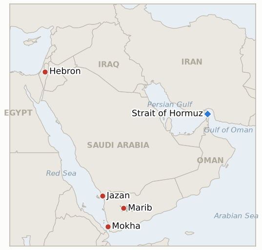

# Middle East Daily Briefing

**August 10, 2026**

- **Reporting window:** ~24 hours, August 9, 09:00 to August 10, 09:00 KST
- **Overall assessment:** Sunday delivered the cleanest rejection of a Trump initiative in this war yet: Netanyahu told his own cabinet "Israel rejects the 15-point Gaza document proposed by the Board of Peace," insisting on full Hamas disarmament before any Israeli withdrawal, a position that falsifies this ledger's oldest standing Gaza indicator five days ahead of schedule and leaves the White House pointedly silent. The Hormuz diplomatic track fared little better: three indicators that this ledger opened specifically to test whether the Iran Oman "final stages" language would convert into a real, US accepted mechanism by today all lapsed unresolved, and the day's actual news ran the opposite direction, an Iranian missile striking a UAE flagged ADNOC tanker mid transit with no casualties, while Iran's foreign ministry kept repeating that reopening remains "subject to other conditions." Yemen's war, meanwhile, crossed from a Marib ground fight into a strike on Saudi Arabia's own energy infrastructure, a Houthi drone hitting Aramco's Jazan refinery, plus a bloodier maritime front, a missile and drone barrage on the government held Red Sea port of Mokha that killed seven and wounded thirty five, even as Yemeni government forces kept up the counteroffensive they opened Saturday. Underneath all three fronts sits a genuinely new fact: CNN, the Times of Israel and others report that Joint Chiefs Chairman Gen. Dan Caine has spent weeks privately telling Trump's own advisers the United States needs an "off-ramp" from this war, even as CENTCOM's commander toured Bahrain, the UAE and Israel projecting the opposite posture. Nothing settled in South Korea's own markets, a quiet Sunday with no fresh trading data, but the region's underlying risk picture moved in a harder direction than the last several days of "deal nearly finalized" language suggested.

---

## 1. What Happened

<figure style="float:right; width:46%; margin:2pt 0 8pt 14pt;">

<figcaption style="font-size:8pt; color:#666; text-align:center; margin-top:3pt; font-style:italic;">Major places of discussion</figcaption>
</figure>

### 1.1 Netanyahu Formally Rejects the Board of Peace's Fifteen Point Gaza Plan

At a cabinet meeting Sunday, Prime Minister Benjamin Netanyahu said plainly that "Israel rejects the 15-point Gaza document proposed by the Board of Peace," ruling out any Israeli withdrawal until Hamas is "genuinely disarmed," warning "when I say Hamas must be disarmed, I mean heavy weapons, lighter weapons, all weapons," and separately reaffirming there will be no Palestinian state "not in Gaza and not in Judea and Samaria" ([Times of Israel](https://www.timesofisrael.com/netanyahu-rejects-trumps-15-point-gaza-plan-insists-he-can-stand-up-to-us-president/); [Washington Post](https://www.washingtonpost.com/world/2026/08/09/netanyahu-rejects-trump-backed-plan-hamas-disarm-israel-leave-gaza/); [CNN](https://www.cnn.com/2026/08/09/middleeast/israel-gaza-trump-netanyahu-plan-intl)). The rejected document, published July 31, had envisioned Hamas disarmament and an Israeli withdrawal proceeding as a phased, roughly parallel process rather than requiring full Hamas disarmament first; Netanyahu's Sunday statement explicitly reverses that sequencing. The White House did not immediately comment, a silence multiple outlets read as a sign the rejection will strain Trump and Netanyahu's relationship, while Hamas said via a Telegram statement that it "remains committed to fully implementing" the plan as originally written and continues to condition its own disarmament on a complete Israeli withdrawal and a path to Palestinian statehood ([NBC News](https://www.nbcnews.com/world/israel/israel-rejects-trumps-15-point-plan-gaza-pm-benjamin-netanyahu-says-rcna591555); [Al Jazeera](https://www.aljazeera.com/news/2026/8/9/israel-rejects-trumps-15-point-plan-for-gaza)). **Confidence: High** on Netanyahu's statement and its content (Tier 1-2, multiple outlets, direct on-record cabinet quote); **Medium** on how the White House will respond, since it has not yet issued one.

### 1.2 An Iranian Missile Strikes a UAE Tanker as Three Hormuz Deal Indicators Lapse

The UAE's Ministry of Foreign Affairs said an Iranian missile struck an ADNOC owned vessel while it was transiting the Strait of Hormuz in the early hours of Saturday, the latest of what ADNOC says is now more than a dozen of its ships attacked since the war began in February, with no casualties reported this time ([WAM](https://www.wam.ae/article/c1mq20a-adnoc-confirms-one-its-vessels-targeted-missile); [CNBC](https://www.cnbc.com/2026/08/08/uae-ship-targeted-missile-us-iran-tensions-stay-high.html); [Al Jazeera](https://www.aljazeera.com/news/2026/8/8/uae-says-iran-targeted-adnoc-tanker-in-hormuz-no-casualties-2)). The strike landed the same window in which three indicators this ledger opened specifically to test the Iran Oman "final stages" diplomatic language all reached their August 10 deadline: no verified strike on Kharg Island or another Iranian export terminal ever occurred (IND-20260727-3, falsified), no publicly announced, jointly confirmed Iran Oman transit mechanism ever converted from "agreed in principle" and "general framework" language into a signed instrument (IND-20260803-1, falsified), and Washington never issued a statement accepting the Iranian coordinated channel or its terms (IND-20260806-1, falsified). Iran's Foreign Ministry spokesman reiterated Sunday that reopening remains "subject to other conditions," while Vice President Vance's separate claim that Iran told Washington it has "no plans" to toll the strait does not amount to the joint announcement any of the three indicators required ([NBC News](https://www.nbcnews.com/world/iran/iran-says-deal-strait-hormuz-close-will-not-open-waterway-rcna591476)). **Confidence: High** on the ADNOC strike (Tier 1-2, official UAE government statement, multi-outlet); **Medium-High** on the diplomatic track's stall, an absence of an announcement rather than a single confirmable event, but consistent across a week of ledger tracking.

### 1.3 Yemen's War Widens as Houthis Strike Saudi Aramco's Jazan Refinery and Yemen's Mokha Port

Houthi military spokesman Yahya Saree said the group struck Saudi Aramco's Jazan refinery, which processes 400,000 barrels a day and allows Aramco to export refined products via the Red Sea without transiting Hormuz, with a drone Sunday, calling it retaliation for alleged Saudi drone incursions into the Houthi held provinces of Saada and Hajjah; Saudi Arabia's Ministry of Energy said Aramco firefighting teams extinguished the resulting blaze with no injuries reported ([Al Jazeera](https://www.aljazeera.com/news/2026/8/9/saudi-arabia-says-fire-extinguished-at-aramco-facility-in-jizan); [NBC News](https://www.nbcnews.com/world/middle-east/yemens-houthis-attack-saudi-aramco-jazan-refinery-rcna591561)). Jazan was already the refinery Aramco partially shut after a July 27 strike, with a tentative restart penciled for around August 15, so Sunday's attack lands on a facility already mid-recovery. Separately, and more lethally, Houthi missiles and drones bombed Mokha, one of the internationally recognized government's main Red Sea ports and a hub built specifically to route shipping around the Houthi held port of Hodeidah, killing at least seven people and wounding thirty five, with Yemen's Transport Minister Mohsen al-Omari describing at least twenty five projectiles hitting port buildings, piers and commercial supplies ([The National](https://www.thenationalnews.com/news/gulf/2026/08/09/red-sea-crisis-escalates-with-houthi-strikes-on-yemens-mokha-port-and-saudi-aramco-refinery/); [Anadolu Agency](https://www.aa.com.tr/en/middle-east/7-killed-35-injured-as-houthis-bomb-yemen-s-mokha-port-near-bab-al-mandab-strait/4022388)). Yemeni government forces, for a second consecutive day, kept up the multi-axis counteroffensive against Houthi positions they opened Saturday, continuing to attack amid renewed shelling around Marib ([Al Jazeera](https://www.aljazeera.com/news/2026/8/8/yemens-government-forces-attack-houthis-amid-renewed-shelling-of-marib)). **Confidence: High** on the Jazan and Mokha strikes and their casualty figures (Tier 1-2, Saudi and Yemeni official statements, multi-outlet wire reporting); **Medium** on whether the Jazan hit meaningfully delays the already-tentative August 15 restart.

### 1.4 The CENTCOM Commander Tours the Region as Reports Surface of a Private Push for an Iran War Off Ramp

CENTCOM commander Gen. Brad Cooper made a several-hour visit to Israel on Saturday, meeting IDF Chief of Staff Eyal Zamir and senior commanders after stops in Bahrain and the UAE, telling counterparts that Washington continues pressing Israel to advance the Gaza peace plan's next phase now that the Board of Peace has announced Hamas's disarmament agreement, a framing Netanyahu's own cabinet undercut hours later ([Xinhua](https://english.news.cn/20260809/13d41eff2be145f5b370552897e4682e/c.html); [Times of Israel](https://www.timesofisrael.com/liveblog-august-08-2026/); [JNS](https://www.jns.org/centcom-commander-visits-israel-reviews-operation-rising-lion-success/)). The visit coincided with wider reporting that Joint Chiefs Chairman Gen. Dan Caine has for weeks privately told other top Trump advisers, including CIA Director John Ratcliffe, Secretary of State Marco Rubio and Vice President JD Vance, that the US needs to find an "off-ramp" from the Iran war, warning that further military escalation could backfire and that airpower alone is unlikely to achieve Trump's stated objectives; sourcing describes the goal as a face saving exit built around a Hormuz reopening deal rather than an unconditional withdrawal ([CNN](https://www.cnn.com/2026/08/07/politics/general-dan-caine-off-ramp-iran-war); [Times of Israel](https://www.timesofisrael.com/top-us-general-said-urging-iran-war-off-ramp-as-tehran-and-oman-near-hormuz-deal/)). **Confidence: High** on Cooper's visit and its official readout (Tier 1-2, CENTCOM statement, multi-outlet); **Medium** on the Caine reporting, sourced to unnamed officials rather than an on-record statement from Caine himself, though corroborated across multiple outlets with consistent detail.

### 1.5 West Bank Settler Violence Continues for a Second Straight Weekend

Israeli settlers set fire to Palestinian property overnight in Wadi Rahim in the southern West Bank's Hebron Hills, with footage showing settlers entering homes and burning furniture, while separately settlers raided a Palestinian home near Bethlehem, smashing windows and vandalizing the property ([Middle East Eye](https://www.middleeasteye.net/live-blog/live-blog-update/israeli-settlers-set-fire-palestinian-property-west-bank)). The incidents follow the wave of settler raids reported the prior weekend and come as the Israeli military continues investigating footage, first circulated days earlier, showing a soldier beating a Palestinian in the village of Idna, an investigation that remains open ([Times of Israel](https://www.timesofisrael.com/liveblog-august-09-2026/)). **Confidence: Medium-High** on the specific incidents (Tier 1-2, live-blog wire aggregation, video evidence cited); **Low** on any broader trend read, since two weekends of raids do not by themselves establish a durable escalation.

---

## 2. Deep Dive: Incentives and Motives

### 2.1 Why does Netanyahu reject the fifteen point plan now, given how invested Trump is in it?

Because the political cost of appearing to accept a phased withdrawal now likely exceeds the diplomatic cost of publicly breaking with Washington: Netanyahu's coalition includes ministers who have called any Hamas-retains-any-capability outcome unacceptable, and a rejection framed around "genuine disarmament" lets him claim principle rather than obstruction, while Hamas's own Telegram statement, reaffirming commitment to the original plan and its own conditions, suggests both sides now prefer to be seen defending a position rather than compromising toward one, a dynamic that reads less like a negotiation in progress and more like each side positioning for whichever outside actor, Washington, regional mediators or domestic politics, eventually forces a resolution.

### 2.2 Why would an Iranian missile hit a tanker the same week Iran keeps describing a Hormuz deal as close?

Because Iran's declared negotiating position and its operational reality are set by different institutions that do not obviously coordinate: the Foreign Ministry's "final stages" language and the Supreme National Security Council's sweeping demands both originate from Tehran, but the missile that hit the ADNOC tanker plausibly reflects IRGC operational tempo continuing on its own track regardless of what diplomats say in public, the same recurring pattern this ledger has tracked since early August, where an official's reassurance and an institution's action point in different directions, and where outside observers, including Korea's own shippers, have no reliable way to know in advance which Iranian voice will govern any given day.

### 2.3 Why would the Houthis strike Saudi energy infrastructure and a government port on the same day?

Because a coordinated two-track strike, one on Saudi Arabia's own oil processing capacity and one on the internationally recognized government's Red Sea supply line, maximizes pressure on both of the Houthis' adversaries at once without requiring new capability, using existing drone and missile stocks against targets chosen for value rather than difficulty; hitting Jazan punishes Riyadh directly for what the Houthis call border incursions, while hitting Mokha degrades the government's own logistics and signals that the maritime campaign against shipping generally has not eased even as attention centers on the Marib ground fight, a combination that raises the stakes for both Saudi Arabia's calibrated restraint and Yemen's government's own new counteroffensive posture.

### 2.4 Why would a Joint Chiefs chairman privately lobby for an off ramp while CENTCOM's commander tours the region projecting resolve?

Because the two roles serve different audiences: Cooper's regional tour, meeting Zamir and pressing Israel on Gaza's next phase, is the public reassurance track aimed at allies who need to see continued US engagement, while Caine's private advocacy inside the administration is the unglamorous, options-narrowing assessment that further escalation risks depleting stockpiles, particularly the munitions systems this ledger has separately tracked as strained, without a clear path to Trump's stated objectives; the two postures are not contradictory so much as evidence that Washington's military leadership is simultaneously managing allied confidence and searching for an exit, exactly the kind of internal split that tends to precede a genuine policy shift rather than announce one.

### 2.5 Why does West Bank settler violence persist regardless of the region's other flashpoints?

Because the local incentive structure driving settler violence, land access, impunity expectations and ideological conviction, does not depend on what dominates the wider region's news cycle, and a week saturated with Hormuz brinkmanship and a widening Yemen war arguably draws less international scrutiny to the West Bank than a quieter week would; the Idna investigation remaining open rather than closed suggests the Israeli military itself still recognizes a reputational cost to visible impunity, even when the world's attention sits elsewhere.

---

## 3. Policy Implications for South Korea

### 3.1 Exposure snapshot

| Item | Current reading | Source |
| --- | --- | --- |
| July-August crude procurement | 110%+ of prior-year volume secured (MOTIE, July 21); strategic reserve swap extended through August, ~21 million barrels swapped to date | MOTIE via Herald Business, Hankyung; `korea-exposure.md` |
| September crude procurement | 90%+ secured (MOTIE, July 21) | MOTIE via Herald Business; `korea-exposure.md` |
| Red Sea detour routing | 14th-plus Korean-bound crude cargo via the Red Sea/Yanbu workaround, now exposed on both ends: Yanbu loadings on the Saudi side and Bab el-Mandeb transit past a Yemeni government port, Mokha, just struck by the same Houthi force that runs the corridor's threat | MOF via wire reporting; `korea-exposure.md` |
| Strategic reserve coverage | ~26 days of actual consumption (estimate); swap on immediate standby, untested at scale | CSIS; MOTIE July 27 |
| Refiner Saudi ownership exposure | S-Oil (Saudi Aramco majority ~63%), HD Hyundai Oilbank (Aramco ~17%); Aramco's own Jazan refinery, already mid-recovery from a July 27 strike, was hit again Sunday | Public filings; `korea-exposure.md` |
| Brent / WTI | No settle (Sunday); last verified Friday close $83.55 / $78.18 | CNBC |
| KOSPI / USD-KRW | No close (Sunday); last verified Friday close 6,258.77 / 1,416.1 | Hankyung; Money Today |
| Hormuz transits | No new Kpler/Reuters print for 08-08 or 08-09; last verified count 8 crossings August 7; an Iranian missile struck an ADNOC tanker in the strait August 8 | Kpler via X; WAM |

### 3.2 Implications by development

**Netanyahu's rejection of the fifteen point Gaza plan carries no direct energy or currency exposure for Korea, but it removes a stabilizing assumption Korean planners had been quietly building into their regional risk models: that Gaza, unlike Hormuz and Yemen, was trending toward resolution rather than renewed contest.** A durable Israel-Hamas standoff keeps the Board of Peace's diplomatic bandwidth tied up in Gaza precisely when Hormuz and Yemen both need active US and regional mediation; IND-20260801-2 falsified today, and its narrower successor IND-20260805-1 (deadline August 12) is the nearer-term test of whether any disarm-first alternative converges.

**The ADNOC strike and the lapse of three Hormuz deal indicators at their August 10 deadline mean Korean refiners and KNOC still have no concrete, US accepted transit framework to plan around, a full week after Iran's foreign minister first called talks "final stages."** The July-August and September procurement cushions this file already tracks remain the load-bearing buffer; treat the strait's own reopening timeline as reset to indefinite rather than imminent. New IND-20260810-1 (deadline August 20) tracks whether a revised mechanism, chastened by this week's setbacks, eventually converts into a real, jointly accepted arrangement.

**Yemen's widening war now threatens Korea's Red Sea workaround from both directions Korean planners depend on: Yanbu, the loading port on the Saudi side (through the Jazan strike's broader signal that Saudi energy infrastructure is not insulated from this war), and Mokha, a port along the same Bab el-Mandeb corridor Korean-bound tankers transit to avoid Hormuz.** A Houthi force willing to strike a government port directly, not just merchant shipping passing through, raises the odds that the corridor's risk premium becomes structural. New IND-20260810-3 (deadline August 17) tests whether Riyadh answers the Jazan strike with direct retaliation, a threshold that would mark a further widening; IND-20260809-3 (deadline August 16) continues tracking the government counteroffensive's persistence.

**Reports that the US Joint Chiefs Chairman is privately pushing an Iran war off ramp, if accurate and if it eventually shapes policy, would matter enormously to Korea's own risk calendar, since a genuine US de-escalation push is the single most likely path to an actual Hormuz reopening, more so than any Iran-Oman bilateral arrangement Washington has not itself endorsed.** New IND-20260810-2 (deadline August 20) tests whether this private advocacy produces any visible public shift, a Trump statement, a posture change or a new US proposal, worth watching alongside IND-20260809-1 (deadline August 16), which tracks whether Iran's own SNSC demands push Washington toward escalation instead.

**West Bank settler violence carries no direct near-term Korea exposure but remains a standing reminder that Hormuz, Yemen and Gaza do not exhaust the region's active flashpoints, and that a quiet Sunday in Korean markets does not imply a quiet region.**

**Testable indicators:**

- **IND-20260810-1** — A narrower or revised Iran-Oman Hormuz mechanism gets publicly announced and accepted, or the diplomatic track stays stalled. A publicly announced, jointly confirmed mechanism that also draws an explicit US acceptance statement or a joint three-way announcement, by ~2026-08-20, confirms recovery; continued absence of any jointly announced mechanism, or a further widening of Iran's conditions, through the same date falsifies it and confirms the track as durably stalled.
- **IND-20260810-2** — Gen. Caine's private off ramp advocacy produces a visible shift in US Iran-war policy, or Washington's public posture stays unchanged. A public Trump statement re-embracing negotiation, a confirmed US force posture reduction, or a formal new US negotiating proposal, by ~2026-08-20, confirms a policy shift; continued public threats of escalation with no posture change and no new proposal through the same date falsifies it.
- **IND-20260810-3** — Houthi strikes on Saudi energy infrastructure draw a direct Saudi military response, or Riyadh holds its Hodeidah confined posture. A verified Saudi-led coalition strike on a Houthi target explicitly linked to retaliation for the Jazan refinery attack, by ~2026-08-17, confirms a shift to direct retaliation; continued Saudi restraint limited to firefighting, statements and Hodeidah-governorate operations through the same date falsifies it.

---

## 4. Watch List

- **Whether a revised Iran-Oman Hormuz mechanism recovers into a real, US accepted arrangement, now that the "final stages" language has lapsed unresolved** (IND-20260810-1, deadline August 20).
- **Whether Gen. Caine's private off ramp advocacy visibly shifts US policy or stays internal, unactioned advice** (IND-20260810-2, deadline August 20).
- **Whether Saudi Arabia answers the Jazan refinery strike with direct retaliation against Houthi targets** (IND-20260810-3, deadline August 17).
- **Whether the disarm-first Gaza framework Netanyahu is pushing for converges into a formal Israeli Security Cabinet endorsement, now that the phased fifteen point plan is dead on Israel's own terms** (IND-20260805-1, deadline August 12).
- **Whether Iran's Supreme National Security Council's demands push Washington toward renewed military action or the two sides quietly return to negotiating a narrower framework** (IND-20260809-1, deadline August 16).
- **Whether Yemen's government-Houthi war escalates into sustained, open warfare or reverts to a bounded exchange** (IND-20260809-3, deadline August 16).
- **Whether the underlying Houthi ground campaign against Marib and Hadramaut continues into a sustained offensive** (IND-20260807-1, deadline August 14).
- **Whether Saudi Arabia's warned coordinated Houthi-Iraqi militia attack ever materializes as a true two-pronged strike, given Sunday's Houthi-only Jazan hit** (IND-20260808-1, deadline August 15).
- **Whether Khamenei or Iran's Supreme National Security Council ever formally approve any Hormuz framework, original or revised** (IND-20260808-2, deadline August 15).
- **Whether south Lebanon's active-combat phase derails or continues running parallel to the Rome diplomatic track's proposed September 1 round** (IND-20260807-2, deadline September 1).
- **Whether a named Gulf state announces a specific dollar-denominated US investment package tied to strait security** (IND-20260715-2, deadline August 14).
- **Whether Iran's frozen-asset transit ban ever gets tested against an actual vessel, or stays rhetorical leverage** (IND-20260729-2, deadline August 12).
- **Whether mediated US-Iran messages ever convert into a jointly acknowledged meeting or framework** (IND-20260728-3, deadline August 11).
- **Whether Kuwait's Article 51 invocation is followed by any action beyond protest** (IND-20260802-2, deadline August 15).
- **Whether the Damietta attack is ever formally attributed** (IND-20260801-3, deadline August 14).
- **Whether the Qeshm Island explosions are ever confirmed as a real strike or resolved as a false alarm.**

---

## 5. Source Quality Summary

| Claim | Sources | Confidence |
| --- | --- | --- |
| Netanyahu tells Israel's cabinet Israel rejects the Board of Peace's fifteen point Gaza plan, demanding full disarmament before any withdrawal | Times of Israel, Washington Post, CNN, NBC News, Al Jazeera (Tier 1-2, on-record cabinet statement, multi-outlet) | High |
| Hamas says via Telegram it remains committed to fully implementing the plan as originally written | NBC News, Al Jazeera (Tier 1-2, on-record group statement) | High |
| An Iranian missile struck a UAE ADNOC tanker transiting the Strait of Hormuz, no casualties | WAM (UAE state agency, official MOFA statement), CNBC, Al Jazeera (Tier 1-2, official government statement, multi-outlet) | High |
| Three Hormuz deal indicators (Kharg strike, Iran-Oman mechanism announcement, US acceptance) lapse unresolved at their August 10 deadline | This ledger's own daily tracking since 2026-07-27/08-03/08-06; NBC News on Iran's continued conditions | Medium-High |
| Houthis strike Saudi Aramco's Jazan refinery with a drone; fire extinguished, no injuries | Al Jazeera, NBC News (Tier 1-2, Houthi claim plus Saudi Ministry of Energy confirmation) | High |
| Houthis bomb Yemen's Mokha port, killing at least 7 and wounding 35 | The National, Anadolu Agency (Tier 1-2, Yemeni Transport Minister on-record, multi-outlet) | High |
| Yemeni government forces continue their counteroffensive against Houthi positions amid renewed Marib shelling | Al Jazeera (Tier 1-2, wire reporting) | Medium-High |
| CENTCOM commander Gen. Brad Cooper visits Israel, Bahrain and the UAE, meets Zamir and senior IDF officials | Xinhua, Times of Israel, JNS (Tier 1-2, official CENTCOM readout, multi-outlet) | High |
| Joint Chiefs Chairman Gen. Dan Caine privately urges an Iran war off ramp to other Trump advisers | CNN, Times of Israel (Tier 1-2, sourced to unnamed officials, not on-record from Caine) | Medium |
| West Bank settlers set fire to property in Wadi Rahim and raid a home near Bethlehem; IDF investigates Idna soldier-beating footage | Middle East Eye, Times of Israel (Tier 1-2, live-blog wire aggregation, video evidence) | Medium-High |
