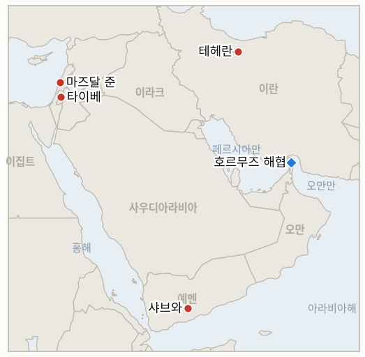

# 중동 일일 브리핑

**2026년 8월 11일**

- **보고 기간:** 약 24시간, 8월 10일 09:00 ~ 8월 11일 09:00 (한국시간)
- **종합 평가:** 월요일은 지역의 핵심 외교 사안을 해소하기보다 더 강경하게 굳혔다. 이란 최고지도자 하메네이는 확연히 매파적인 안보 지도부를 새로 구성했는데, 특히 최고국가안보회의 사무총장을 졸가드르에서 워싱턴과의 협상이 성립할 수 없다고 공언해온 모흐센 레자에이로 교체했으며, 같은 날 혁명수비대는 호르무즈 해협 재개방이 "임박하지 않았다"고 밝혔다. 이 지표대장에서 가장 오래 진행 중이던 미국·이란 접촉 지표(7월 28일 개설)는 미국과 이란 간 공동으로 확인된 회동이나 6월 양해각서를 복원하는 틀이 끝내 성립하지 못한 채 이날 마감시한에서 반증됐다. 워싱턴의 입장 변화도 상반되기보다는 같은 방향으로 움직였다. 트럼프 대통령은 액시오스에 미국이 이란과 "반쯤 협상 중"일 뿐이며 추가 타격이 아니라 경제적 압박이 효과를 내도록 두겠다고 밝혔는데, 이는 전날 브리핑에서 다룬 케인 합참의장의 비공개 "출구" 조언 보도와 묘하게 맞아떨어지면서도 테헤란에 당장 태도를 누그러뜨릴 유인은 제공하지 않는다. 유가 시장은 이날을 진전보다 교착으로 읽었다. 이란과 오만이 항로 좌표에 대한 기술적 진전을 계속 이어갔음에도 브렌트유와 WTI유 모두 약 5% 급등했다. 예멘 전쟁은 한층 더 확대돼 후티 드론 공격이 샤브와에서 정부군 3명을 살해했고 모카항에 대한 공격도 재개됐으며, 남부 레바논 휴전은 예비군 2명이 숨진 폭발 사건에서 헤즈볼라의 조작 가능성을 이스라엘군이 배제하지 못한다고 인정하면서 새로운 불확실성을 안게 됐다. 서안지구에서는 이스라엘이 정착민 폭력에 대해 이례적인 대응책을 시도했는데, 정착민들을 통제하는 대신 타이베 마을 자체를 봉쇄했으며, 그 사이 가자지구 라파 일부에서는 조용히 재건이 시작됐다. 한국 증시는 조용한 반등을 기록해 코스피가 0.65% 오르고 원화는 소폭 약세를 보였으며, 월요일의 지역 정세 경색이 아직 한국의 리스크 가격에 반영됐다는 신호는 없다.

---

## 1. 무슨 일이 있었나

<figure style="float:right; width:46%; margin:2pt 0 8pt 14pt;">

<figcaption style="font-size:8pt; color:#666; text-align:center; margin-top:3pt; font-style:italic;">주요 논의 지점</figcaption>
</figure>

### 1.1 하메네이, 안보 지도부를 강경파로 교체하며 혁명수비대는 호르무즈 재개방이 임박하지 않았다고 밝혀

이란 최고지도자 하메네이는 월요일 신임 군 수뇌부 6명을 임명했다. 개전 초기 공습으로 사망한 압둘 라힘 무사비 중장의 후임으로 알리 압돌라히 소장을 참모총장에, 아흐마드 바히디를 혁명수비대 총사령관에 임명했으며, 별도로 71세의 전 혁명수비대 총사령관이자 대미 협상에 공개적으로 반대해온 모흐센 레자에이를 최고국가안보회의 신임 사무총장으로 임명해 모하마드 바게르 졸가드르를 대체했다. 졸가드르는 하메네이의 정치보좌관으로 자리를 옮긴다 ([The National](https://www.thenationalnews.com/news/mena/2026/08/10/irans-supreme-leader-appoints-six-senior-military-commanders/); [Times of Israel](https://www.timesofisrael.com/liveblog_entry/iran-announces-6-new-military-appointments-including-for-heads-of-military-and-irgc/); [RFE/RL](https://www.rferl.org/a/iran-mohsen-rezaei-us-reshuffle/33825861.html)). 같은 날 혁명수비대 대변인은 호르무즈 재개방이 "임박하지 않았다"며 미국이 이란의 조건을 전면 수용해야 한다고 밝혔고, 이란 안보 당국은 미국이 전쟁을 끝내고 해상 봉쇄를 해제하며 역내 병력을 철수하고 배상금을 지급할 때까지 통항이 정상화되지 않을 것이라는 입장을 유지했다 ([Reuters via KSAT](https://www.ksat.com/news/world/2026/08/10/iran-wont-reopen-strait-of-hormuz-without-us-concessions-and-other-mideast-developments/)). 이번 개편은 이 지표대장에서 가장 오래 진행 중이던 미국·이란 접촉 지표(IND-20260728-3)가 자체 마감시한인 8월 11일에 도달한 날 이뤄졌다. 2주간 진행되는 동안 미국과 이란 간 공동으로 확인된 회동이나 6월 양해각서를 복원하는 공개적 틀은 끝내 성립하지 않았으며, 오늘 반증됐다. **신뢰도: 높음** (인사 발표와 혁명수비대 성명, 티어 1-2, 이란 국영매체 및 복수 매체 교차 확인); 레자에이 인선이 통상적 개편이 아니라 실질적 강경화를 의미하는지에 대해서는 **신뢰도: 중상** — 그의 공개 발언 이력에 근거하나 아직 구체적 정책 결정으로 검증되지는 않았다.

### 1.2 트럼프, 미국은 이란과 "반쯤 협상 중"이라며 경제적 압박으로 전환, 유가는 약 5% 급등

트럼프 대통령은 일요일 게재된 액시오스 인터뷰에서 "우리는 낮은 자세를 취하고 있다. 우리는 그들과 반쯤 협상 중일 뿐이다"라고 말하고, 미국은 "심각한 인플레이션과 돈이 없는 상황에 처한 이란을 그저 지켜보고 있다"고 덧붙였으며, 군사적 확전 재개보다 현행 해상 봉쇄의 경제적 압박이 효과를 내도록 두는 쪽을 선호한다는 뜻을 내비쳤다 ([Axios](https://www.axios.com/2026/08/09/trump-iran-interview); [Bloomberg](https://www.bloomberg.com/news/articles/2026-08-10/trump-hints-us-will-let-economic-pressure-on-iran-do-the-work)). 이란과 오만이 항로 좌표에 대한 기술적 진전을 계속 이어갔음에도, 호르무즈 통항 확대 합의가 임박했다는 데 대한 의구심이 커지면서 월요일 유가는 약 5% 급등했다. 브렌트유는 87.72달러, WTI유는 82.13달러에 마감했다. 이란 외교부 대변인 에스마일 바가이는 테헤란이 해협을 전면 재개방하는 데 동의하려면 먼저 미국이 봉쇄를 해제해야 한다고 밝혔다 ([CNBC](https://www.cnbc.com/2026/08/10/oil-prices-today-brent-wti-hormuz-trump-iran.html)). **신뢰도: 높음** (트럼프의 발언 인용과 유가 마감치, 티어 1-2, 공식 인터뷰 및 복수 매체 시황 보도); "반쯤 협상 중"이라는 표현이 지속적인 전략적 선택을 반영하는지 수사적 완충용인지에 대해서는 **신뢰도: 중간** — 트럼프의 이란 접촉 관련 공언은 7월 말 이후 며칠 단위로 반복해서 바뀌어 왔다.

### 1.3 후티 드론 공격으로 샤브와에서 예멘군 3명 사망, 모카항 재공격

월요일 후티 드론이 샤브와-마리브 주 경계 인근 정부군 샤브와 방위군 3여단 진지를 공격해 병사 3명이 숨지고 9명이 부상했으며, 별도로 후티 미사일과 드론은 전날 공격으로 7명이 숨지고 35명이 다친 정부 통제 홍해 항구 모카를 다시 타격했다. 예멘군은 대응을 다짐했다 ([Xinhua](https://english.news.cn/20260810/04978c47579a425ca1485914135fe3e0/c.html); [Al Jazeera](https://www.aljazeera.com/news/2026/8/10/houthis-renew-missile-and-drone-attacks-on-yemens-port-of-al-makha)). 월요일 게재된 워싱턴포스트 기획기사는 현재의 후티·사우디 갈등 확산의 구체적 발단을 짚었다. 7월 13일 사우디군이 후티 고위 대표단을 태운 무허가 이란 항공편의 착륙을 막기 위해 사나 공항 활주로를 타격한 사건으로, 후티는 이를 연합군의 10년 묵은 예멘 영공 통제권에 대한 직접적 도전으로 받아들여 이후 사우디 에너지 기반시설과 정부 항구를 모두 포함하는 보복 응수전으로 확대해 왔다는 것이다 ([Washington Post](https://www.washingtonpost.com/world/2026/08/10/yemen-houthis-saudi-arabia-red-sea-iran/1eb36202-94a6-11f1-9ef9-1be722184483_story.html)). **신뢰도: 높음** (샤브와 사상자 및 모카 공격, 티어 1-2, 신화통신·알자지라, 복수 매체); 워싱턴포스트의 발단 서사에 대해서는 **신뢰도: 중상** — 독립적 인과관계 검증이 필요한 주장이라기보다는 단일 출처의 기획 취재다.

### 1.4 이스라엘군, 레바논 폭발 조사 확대, 헤즈볼라 조작 가능성 배제 못해

이스라엘군은 예비군 2명이 숨진 8월 6일 마즈달 준 폭발 사건 조사 범위를 넓히고 있다고 밝혔다. 사망자는 하렐 비렌스토크 예비역 소령과 타미르 바크닌 예비역 상사이며, 4명이 중상을 입었다. 조사 확대는 폭발력이 통상적인 잔존 폭발물치고는 비정상적으로 강했다는 판정에 따른 것이다. 내부의 지배적 평가는 여전히 오래된 미폭발 헤즈볼라 폭발물 쪽에 무게를 두고 있지만, 북부사령부는 해당 구역에서 헤즈볼라의 활동이 확인되고 있다는 점을 들어 헤즈볼라 조직원이 복귀하는 이스라엘 부대를 겨냥해 장치를 조작했을 가능성을 배제할 수 없다고 확인했다 ([Jerusalem Post](http://www.jpost.com/israel-news/article-904922); [Ynet](https://www.ynetnews.com/article/skkckjuuml)). 이번 판정은 로마 트랙이 제안한 9월 1일 회동을 앞두고 나왔으며, 남부 레바논의 교전 국면이 해당 외교 트랙을 탈선시킬지 여부를 이미 추적 중인 IND-20260807-2의 중요성을 한층 키운다. **신뢰도: 중상** (조사 범위 확대와 "비정상적으로 강함" 판정, 티어 1-2, 이스라엘군 취재원, 복수 매체); 최종 원인에 대해서는 **신뢰도: 낮음** — 이스라엘군 스스로도 조작 여부를 미해결로 규정하고 있다.

### 1.5 이스라엘, 타이베를 군사 폐쇄 구역으로 선포, 라파 일부에서는 조용히 재건 시작

이스라엘군은 서안지구에서 마지막으로 남은 전면 기독교 팔레스타인 마을인 타이베를 군사 폐쇄 구역으로 선포해 주민이 아닌 외부인의 출입을 막았다. 이 조치는 팔레스타인 주민이나 취재진에는 적용되지 않으며, 별도의 위협 판단이 있는 경우만 예외로 한다. 이는 두 방향에서 정착촌에 둘러싸인 이 마을을 겨냥한 정착민의 방화·재산 파괴 공세가 격화된 데 따른 대응이다 ([Arab News](https://www.arabnews.com/node/2654046/middle-east); [AAWSAT](https://english.aawsat.com/arab-world/5305425-israel-declares-closed-military-zone-west-bank%E2%80%99s-taybeh)). 비판론자들은 이 조치가 공격 책임이 있는 정착민을 통제하기보다 외부 목격자를 배제하는 결과를 낳는다고 지적했다. 별도로 이스라엘 언론은 네타냐후 총리와 카츠 국방장관이 몇 주 전 이스라엘군 통제 하 라파 동부 지역인 "그린 라파"에서 인프라 및 재건 작업을 조용히 승인했다고 보도했는데, 이는 하마스의 무장해제가 선행돼야 재건을 허용하겠다던 네타냐후 총리의 기존 입장에서 벗어난 것이다. 네타냐후 총리실은 이 보도를 왜곡되고 낡은 정보라고 반박하며 해당 사업이 아랍에미리트가 주도하는 기존 시범사업이라고 주장했다 ([Times of Israel](https://www.timesofisrael.com/netanyahu-katz-said-to-quietly-okay-reconstruction-in-idf-controlled-part-of-gaza/); [Jerusalem Post](https://www.jpost.com/israel-news/defense-news/article-904933)). **신뢰도: 중상** (타이베 봉쇄 명령, 티어 1-2, 이스라엘군 성명, 복수 매체); 라파 재건 보도에 대해서는 **신뢰도: 중간** — 네타냐후 총리실이 근본적인 공사 활동 자체는 부인하지 않으면서도 보도의 프레이밍은 직접 반박하고 있다.

---

## 2. 심층 분석: 유인과 동기

### 2.1 이란·오만 기술 트랙이 실질적 진전을 보이는 시점에 하메네이는 왜 호르무즈 외교를 강경파에게 맡겼나?

이번 개편은 외교적 질문이라기보다는 국내 권력 문제에 대한 답일 가능성이 크다. 전사한 전임자들을 대체할 참모총장과 혁명수비대 사령관 임명은 하메네이가 무기한 미룰 수 없는 구조적 필요였으며, 같은 발표에 레자에이의 인선을 포함시킴으로써 테헤란은 국내 강경파 청중에게 결연함의 연속성을 과시할 수 있다. 이는 정확히 이란과 오만 사이에서 최고국가안보회의의 정치적 승인이 필요 없는 보다 하위 실무 차원에서 협상되는 좁은 기술적 합의인 오만 트랙이 계속 자체 동력으로 진전할 수 있기 때문에 가능한 셈이다. 이 최고국가안보회의의 정치적 승인은 8월 초 이래 이 지표대장의 IND-20260808-2가 계속 추적해온 걸림돌이다. 따라서 레자에이의 인선은 실제 승인 여부와 무관하게 수사만 강경해질 수 있고, 기술적 작업 자체를 반드시 막지는 않을 수 있다.

### 2.2 다섯 달간 결론 없는 해상 봉쇄를 이어온 끝에 트럼프는 왜 군사적 위협을 강화하는 대신 경제적 압박으로 전환했나?

중간선거가 다가오는 상황에서, 전날 브리핑에서 다룬 것처럼 케인 합참의장이 비공개로 출구를 조언하고 있다는 보도를 감안하면, 새로운 타격 작전의 정치적 비용은 이미 자체적으로 심각한 타격을 흡수하고 있다고 트럼프 스스로 규정한 상대에 대한 추가 확전의 한계적 군사 가치를 이제 초과할 가능성이 크다. "반쯤 협상 중"이라는 표현은 이란 최고국가안보회의의 요구 목록이 요구할 양보를 감수하지 않으면서도 지속적 관여를 주장할 수 있게 해주며, 사실상 워싱턴이 자체 양보를 해야 하기 전에 이란의 경제적 곤경이 움직임을 강제할 것이라는 데 베팅하는 셈이다.

### 2.3 발단이 된 항공편 봉쇄 사건이 이미 관련성을 잃었는데도 후티·사우디·정부 간 갈등이 계속 확대되는 이유는 무엇인가?

보복의 매 라운드가 원래의 사나 공항 분쟁 없이도 자체적으로 지속될 수 있는 독립된 원한을 낳고 있기 때문이다. 자잔·모카 공격, 예멘 정부의 반격, 이제는 샤브와 드론 공격까지 이어진다. 구체적이고 해결 가능한 발단으로 시작한 분쟁은 각 당사자가 되갚아야 할 자체적인 미해결 공격 목록을 갖게 되면 그 발단보다 오래 지속되는 경우가 많으며, 후티·국제적으로 인정된 정부·사우디아라비아라는 각기 다른 셈법을 가진 다자 구조의 예멘에서는 한 당사자만의 긴장 완화 조치로는 나머지 두 당사자를 멈추기에 충분하지 않다.

### 2.4 이스라엘군은 왜 정치적으로 더 편리한 "오래된 폭발물" 설명으로 조용히 정리하는 대신 헤즈볼라 조작 가능성을 배제할 수 없다고 공개적으로 인정했나?

성급하거나 나중에 뒤집힐 수 있는 "오래된 장치" 판정은 불확실성을 정직하게 인정하는 것보다 더 큰 평판 비용을 초래할 수 있다. 특히 카츠 국방장관이 이미 공개적으로 이스라엘군의 전술에 의문을 제기했고, 조사 자체의 결과인 비정상적으로 강한 폭발력이 선호되는 설명과 깔끔하게 들어맞지 않는다는 점을 고려하면 더욱 그렇다. 이스라엘군 북부사령부가 정돈된 서사보다 미해결된 조작 의혹에 대한 투명성을 택했다는 사실은, 이 사건이 이스라엘 언론이든 로마 트랙 참가국들이든 헤즈볼라 자신이든 앞으로도 면밀히 검증될 것으로 이 기관이 여전히 예상하고 있음을 시사한다.

### 2.5 이스라엘은 왜 폭력에 책임 있는 정착민을 통제하는 대신 타이베 마을 자체를 봉쇄하는 쪽을 택했나?

외부 목격자를 배제하는 것은 이번 두 주말째 이어진 폭력 사태 내내 정착민 단속에 소극적이었던 일부 장관의 암묵적 지지를 받는 정착민들을 직접 제거하거나 기소하는 것보다 현 연립정부 내에서 정치적으로 더 저렴하다. 군사 폐쇄 구역은 사진상으로는 단호한 조치처럼 보이면서도 실제 정착민 단속이 요구할 연정 내부 대립을 피할 수 있게 해준다. 다만 비판론자들이 정확히 지적하듯이, 이는 주말마다 반복돼 온 폭력의 근본 원인인 면책 관행을 전혀 해결하지 못한다.

---

## 3. 한국에 대한 정책적 함의

### 3.1 익스포저 현황

| 항목 | 현재 수치 | 출처 |
| --- | --- | --- |
| 7~8월 원유 도입 물량 | 전년 대비 110% 이상 확보 (산업통상자원부, 7월 21일); 전략비축유 스와프 8월까지 연장, 현재까지 약 2,100만 배럴 스와프 | 산업통상자원부, 헤럴드경제·한경 경유; `korea-exposure.md` |
| 9월 원유 도입 물량 | 90% 이상 확보 (산업통상자원부, 7월 21일) | 산업통상자원부, 헤럴드경제 경유; `korea-exposure.md` |
| 홍해 우회 항로 | 한국행 원유 화물 14건 이상이 홍해·얀부 우회로 이용, 이제 양쪽 모두 노출 — 얀부(사우디 측 선적)와 바브엘만데브(모카와 샤브와를 지나는 항로, 둘 다 현재 후티·정부 간 활성 전선) | 해양수산부, 외신 경유; `korea-exposure.md` |
| 전략비축유 보유량 | 실제 소비량 기준 약 26일분 (추정); 스와프는 즉시 대기 상태이나 대규모 시행은 미검증 | CSIS; 산업통상자원부 7월 27일 |
| 정유사 사우디 지분 노출 | S-Oil(사우디 아람코 지분 약 63%), HD현대오일뱅크(아람코 지분 약 17%) | 공시자료; `korea-exposure.md` |
| 브렌트유 / WTI유 | 종가 87.72달러 / 82.13달러, 이란-오만 항로 좌표 진전에도 호르무즈 합의 지연 우려로 각각 약 5% 상승 | CNBC |
| 코스피 / 원-달러 환율 | 종가 6,299.66 (+0.65%) / 1,418.4원 (+2.3원, 소폭 약세) | 국제뉴스, 비즈니스코리아; 뉴스핌 |
| 호르무즈 통항량 | 이번 보고 기간 신규 켈러/로이터 집계 없음; 최근 확인된 수치는 8월 7일 8척 | 켈러(X 경유) |

### 3.2 사안별 함의

**하메네이의 강경파 안보 개편과 이 지표대장에서 가장 오래 진행된 미국·이란 접촉 지표의 반증은, 한국 정책 입안자들이 단기간 내 미국·이란 간 돌파구를 구조적으로 희박한 시나리오로 취급하되, 실질적 진전을 보이고 있는 별개의 이란·오만 기술 트랙은 계속 주시해야 함을 뜻한다.** 신규 IND-20260811-1(마감 8월 18일)은 레자에이의 인선이 오만 트랙 자체를 추가로 정체시키는지, 아니면 실무 협상은 그대로 둔 채 인사 통합에 그치는지를 검증한다. IND-20260808-2(마감 8월 15일)는 하메네이 본인의 승인 여부라는 더 좁은 질문을 계속 추적한다.

**트럼프의 "경제적 압박" 전환은 군사적 확전을 배제하지 않으면서도 협상을 통한 신속한 호르무즈 재개방이라는 가장 가까운 시나리오는 제거하는 동시에, 이란 경제가 양보를 강제하는 더 느린 시나리오는 열어두는데, 이는 한국 정유사들이 최소 9월까지는 가속화를 가정하지 않고 현행 조달 여유분을 유지해야 함을 시사한다.** 월요일 유가의 약 5% 급등 자체가 실제 공급 차질 없이도 외교적 신호만으로 한국의 수입 비용이 얼마나 빠르게 움직일 수 있는지를 보여주는 생생한 사례다. IND-20260809-1(마감 8월 16일)은 이란의 강경 노선이 결국 트럼프가 현재 거부하고 있는 군사적 옵션 쪽으로 워싱턴을 되돌릴지를 계속 추적한다.

**샤브와에 대한 직접 타격까지 포함해 후티·사우디·정부 간 전쟁이 확대되면서, 마리브 회랑 인근에 위치한 샤브와가 한국행 유조선들이 이미 얀부·모카와 함께 고위험으로 분류하는 동일한 광역 회랑에 속해 있는 만큼 한국의 홍해 우회 경로에는 또 다른 방향에서 압박이 가해지고 있다.** IND-20260809-3(마감 8월 16일)은 예멘 정부군의 공세적 태세가 지속적 전투로 이어지는지를 계속 추적하며, IND-20260810-3(마감 8월 17일)은 사우디가 직접 보복에 나설지를 추적한다.

**헤즈볼라의 조작 가능성을 배제할 수 없다는 이스라엘군의 인정은 남부 레바논 휴전이 공식적 지위가 시사하는 것보다 더 취약하다는 사실을 일깨우는데, 이는 한국에 있어 로마 외교 트랙이 제안된 9월 1일 회동 일정을 지킬지, 나아가 한국 자체의 리스크 모델이 의존하는 더 넓은 지역 긴장 완화가 계속될지를 가늠하는 선행지표로서 의미가 있다.** 신규 IND-20260811-2(마감 8월 25일)는 조사가 조작 확증 쪽으로 귀결될지, 오래된 불활성 장치 쪽으로 귀결될지를 검증한다.

**타이베 봉쇄와 라파 재건 논란은 한국 시장에 직접적 노출을 주지 않지만, 호르무즈와 예멘이 리스크 논의를 지배하는 가운데서도 가자지구와 서안지구가 여전히 미해결 전선으로 남아 있음을 상기시키며, 코스피의 조용한 거래일이 곧 지역 전체의 평온을 의미하지는 않는다는 점을 보여준다.** 신규 IND-20260811-3(마감 8월 18일)은 타이베에 대한 봉쇄 구역 접근이 실제로 정착민 공격을 줄이는지를 검증한다.

**검증 가능한 지표:**

- **IND-20260811-1** — 이란의 강경파 안보 개편이 호르무즈 외교를 추가로 정체시키는지, 아니면 이란·오만 트랙이 여전히 성사되는지. 2026년 8월 18일까지 공개적으로 발표되고 양측이 공동 확인한 이란·오만 메커니즘도, 하메네이의 승인도 없으면 실질적 강경화가 확증되며, 같은 시한까지 공개 발표된 메커니즘이나 하메네이의 명시적 승인이 나오면 반증된다.
- **IND-20260811-2** — 마즈달 준 폭발이 헤즈볼라 조작으로 확증되는지, 오래된 불활성 장치로 정리되는지. 2026년 8월 25일까지 이스라엘군이 조작 또는 최근 설치를 확증하면 국경 간 생존 공격 능력이 확인되며, 같은 시한까지 헤즈볼라 개입 없는 오래되고 변형되지 않은 장치로 확증되면 반증된다.
- **IND-20260811-3** — 타이베를 비주민 출입 금지로 봉쇄한 조치가 정착민 공격을 줄이는지, 봉쇄에도 폭력이 계속되는지. 2026년 8월 18일까지 타이베에 대한 추가 정착민 공격이 검증되지 않으면 봉쇄가 효과적임이 확증되며, 같은 시한까지 추가 공격이 검증되면 반증된다.

---

## 4. 관찰 목록

- **이란의 강경파 안보 개편이 호르무즈 외교를 추가로 정체시키는지, 이란·오만 기술 트랙은 그대로 유지되는지** (IND-20260811-1, 마감 8월 18일)
- **마즈달 준 폭발이 헤즈볼라 조작으로 확증되는지, 오래된 불활성 장치로 정리되는지** (IND-20260811-2, 마감 8월 25일)
- **타이베를 비주민 출입 금지로 봉쇄한 조치가 정착민 공격을 줄이는지, 봉쇄에도 폭력이 계속되는지** (IND-20260811-3, 마감 8월 18일)
- **하메네이 또는 이제 레자에이가 이끄는 이란 최고국가안보회의가 호르무즈 관련 틀을 공식 승인하는지** (IND-20260808-2, 마감 8월 15일)
- **이란 최고국가안보회의의 요구가 워싱턴을 군사행동 재개로 몰아가는지, 트럼프의 "반쯤 협상 중" 태도가 현재 이를 막고 있는지** (IND-20260809-1, 마감 8월 16일)
- **예멘의 정부·후티 전쟁이 지속적인 전면전으로 확대되는지, 제한적 교전으로 되돌아가는지** (IND-20260809-3, 마감 8월 16일)
- **사우디아라비아가 자잔 정유시설 공격이나 추가 후티 공격에 직접 보복하는지** (IND-20260810-3, 마감 8월 17일)
- **무장해제 우선 가자지구 틀이 이스라엘 안보내각의 공식 승인으로 수렴하는지** (IND-20260805-1, 마감 8월 12일)
- **이란의 동결자산 통항 금지 위협이 실제 선박을 대상으로 시험대에 오르는지, 수사적 지렛대로만 남는지** (IND-20260729-2, 마감 8월 12일)
- **마리브·하드라마우트에 대한 후티의 지상 공세가 지속적 공세로 이어지는지** (IND-20260807-1, 마감 8월 14일)
- **사우디아라비아가 경고한 후티·이라크 민병대의 협공이 실제 양면 공격으로 현실화하는지** (IND-20260808-1, 마감 8월 15일)
- **남부 레바논의 교전 국면이 로마 외교 트랙이 제안한 9월 1일 회동과 병행 진행되는지, 이를 탈선시키는지** (IND-20260807-2, 마감 9월 1일)
- **걸프 국가가 해협 안보와 연계된 구체적 달러 표시 대미 투자 패키지를 발표하는지** (IND-20260715-2, 마감 8월 14일)
- **쿠웨이트의 51조 자위권 발동이 항의를 넘어선 조치로 이어지는지** (IND-20260802-2, 마감 8월 15일)
- **다미에타 공격의 책임 소재가 공식적으로 규명되는지** (IND-20260801-3, 마감 8월 14일)
- **케슘섬 폭발이 실제 공격으로 확인되는지, 오경보로 정리되는지.**

---

## 5. 출처 신뢰도 요약

| 주장 | 출처 | 신뢰도 |
| --- | --- | --- |
| 하메네이가 신임 군 수뇌부 6명을 임명하고 강경파 모흐센 레자에이를 최고국가안보회의 사무총장으로 임명해 졸가드르를 대체 | The National, Times of Israel, RFE/RL (티어 1-2, 이란 국영매체, 복수 매체) | 높음 |
| 혁명수비대 대변인, 호르무즈 재개방이 임박하지 않았으며 이란의 조건을 미국이 전면 수용해야 한다고 발언 | Reuters via KSAT (티어 1-2, 혁명수비대 공식 성명) | 높음 |
| IND-20260728-3 반증: 8월 11일 마감시한까지 미국·이란 간 공동 확인 회동이나 공개 발표 틀이 성립하지 않음 | 이 지표대장의 2026년 7월 28일 이후 자체 추적; 트럼프/액시오스 및 이란 외교부 발언 | 높음 |
| 트럼프, 액시오스에 미국이 이란과 "반쯤 협상 중"이며 군사적 확전보다 경제적 압박을 선호한다고 발언 | Axios, Bloomberg (티어 1-2, 공식 인터뷰) | 높음 |
| 브렌트유 87.72달러, WTI유 82.13달러로 각각 약 5% 상승, 호르무즈 합의 지연 우려 반영 | CNBC (티어 1-2, 시황 전문 보도) | 높음 |
| 후티 드론 공격으로 샤브와에서 예멘 정부군 3명 사망, 9명 부상; 모카항에 대한 후티 공격 재개 | Xinhua, Al Jazeera (티어 1-2, 복수 매체 통신 보도) | 높음 |
| 워싱턴포스트, 후티·사우디 갈등 확산의 발단을 7월 중순 이란 항공편 봉쇄 사건으로 추적 | Washington Post (티어 1, 독자 기획 취재) | 중상 |
| 이스라엘군, 마즈달 준 폭발 조사 확대, 헤즈볼라 조작 가능성 배제 못해 | Jerusalem Post, Ynet (티어 1-2, 이스라엘군 취재원, 복수 매체) | 중상 |
| 이스라엘, 정착민 폭력 속 타이베를 군사 폐쇄 구역으로 선포해 비주민 출입 제한 | Arab News, AAWSAT (티어 1-2, 이스라엘군 성명, 복수 매체) | 높음 |
| 네타냐후·카츠, 라파 일부 재건을 조용히 승인; 네타냐후 총리실은 왜곡된 보도라고 반박 | Times of Israel, Jerusalem Post (티어 1-2, 이스라엘 언론 보도, 총리실이 반박) | 중간 |
| 코스피 0.65% 상승한 6,299.66에 마감; 원화는 1,418.4원으로 소폭 약세 | 국제뉴스, 비즈니스코리아, 뉴스핌 (티어 1-2, 한국 경제지) | 높음 |
