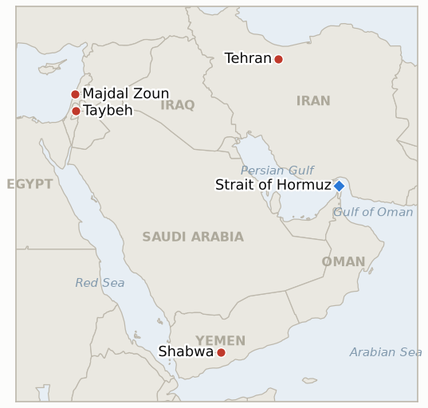

# Middle East Daily Briefing

**August 11, 2026**

- **Reporting window:** ~24 hours, August 10, 09:00 to August 11, 09:00 KST
- **Overall assessment:** Monday hardened rather than resolved the region's central diplomatic question. Iran's Supreme Leader Khamenei installed a genuinely hawkish security leadership, most notably replacing SNSC secretary Zolghadr with Mohsen Rezaei, a man on record calling negotiations with Washington unworkable, the same day the IRGC declared Hormuz reopening "not imminent" and this ledger's oldest standing US-Iran contact indicator, open since July 28, falsified at its own deadline with no jointly acknowledged meeting or framework ever having materialized. Washington's own posture moved in a complementary rather than opposing direction: Trump told Axios the US is "only semi-negotiating" with Iran and will let economic pressure, not further strikes, do the work, a stance that lines up uncomfortably well with yesterday's reporting on Gen. Caine's private off-ramp advocacy even as it offers Tehran no near-term incentive to soften. Oil markets read the day as more stalemate than progress, Brent and WTI both jumping about five percent despite Iran and Oman's continuing technical progress on shipping-route coordinates. Yemen's war widened further, a Houthi drone strike killing three government troops in Shabwa and renewed strikes on Mokha port, while south Lebanon's ceasefire absorbed a new source of uncertainty as the IDF acknowledged it cannot yet rule out Hezbollah tampering in the blast that killed two reservists. In the West Bank, Israel tried an unconventional fix for settler violence, sealing off Taybeh rather than restraining the settlers threatening it, even as reconstruction quietly began in part of Gaza's Rafah. South Korea's own markets logged a quiet rebound, KOSPI up 0.65% and the won marginally weaker, with no signal yet that Monday's harder regional turn has reached Korean risk pricing.

---

## 1. What Happened

<figure style="float:right; width:46%; margin:2pt 0 8pt 14pt;">

<figcaption style="font-size:8pt; color:#666; text-align:center; margin-top:3pt; font-style:italic;">Major places of discussion</figcaption>
</figure>

### 1.1 Khamenei Installs a Hardline Security Leadership as the IRGC Calls Hormuz Reopening Not Imminent

Iran's Supreme Leader Khamenei appointed six new senior military commanders Monday, including Maj. Gen. Ali Abdollahi as armed forces chief of staff (replacing Lt. Gen. Abdul Rahim Mousavi, killed in the war's opening strikes) and Ahmad Vahidi as IRGC commander-in-chief, while separately naming Mohsen Rezaei, a 71-year-old former IRGC commander-in-chief and outspoken opponent of negotiating with Washington, as the new secretary of the Supreme National Security Council, replacing Mohammad Bagher Zolghadr, who becomes a political adviser to Khamenei ([The National](https://www.thenationalnews.com/news/mena/2026/08/10/irans-supreme-leader-appoints-six-senior-military-commanders/); [Times of Israel](https://www.timesofisrael.com/liveblog_entry/iran-announces-6-new-military-appointments-including-for-heads-of-military-and-irgc/); [RFE/RL](https://www.rferl.org/a/iran-mohsen-rezaei-us-reshuffle/33825861.html)). An IRGC spokesman said the same day that Hormuz reopening was "not imminent" and would depend on the US fully accepting Iran's conditions, while Iran's national security apparatus continued insisting traffic will not normalize until Washington ends the war, lifts its naval blockade, withdraws regional forces and pays compensation ([Reuters via KSAT](https://www.ksat.com/news/world/2026/08/10/iran-wont-reopen-strait-of-hormuz-without-us-concessions-and-other-mideast-developments/)). The reshuffle landed the same day this ledger's oldest standing US-Iran contact indicator, IND-20260728-3, reached its own August 11 deadline: no jointly acknowledged US-Iran meeting or publicly announced framework restoring the June MOU ever materialized in the two weeks it ran, and it falsifies today. **Confidence: High** on the appointments and IRGC statement (Tier 1-2, Iranian state media and multi-outlet corroboration); **Medium-High** on Rezaei's appointment reading as a substantive hardening rather than routine reshuffling, based on his public record but not yet tested against a concrete policy decision.

### 1.2 Trump Says the US Is Only Semi-Negotiating With Iran as Oil Jumps About Five Percent

President Trump told Axios in an interview published Sunday, "We are low-keying it. We are only semi-negotiating with them," adding the US is "just watching Iran with its huge inflation and the fact they have no money," and signaling a preference for letting the naval blockade's economic pressure work rather than resuming military escalation ([Axios](https://www.axios.com/2026/08/09/trump-iran-interview); [Bloomberg](https://www.bloomberg.com/news/articles/2026-08-10/trump-hints-us-will-let-economic-pressure-on-iran-do-the-work)). Oil prices jumped roughly five percent Monday, Brent settling at $87.72 and WTI at $82.13, as markets weighed growing doubt that a Hormuz traffic-expansion deal is close despite Iran and Oman's continued progress on shipping-route coordinates; Iran's Foreign Ministry spokesman Esmail Baghaei said the US must lift its blockade before Tehran will agree to fully reopen the strait ([CNBC](https://www.cnbc.com/2026/08/10/oil-prices-today-brent-wti-hormuz-trump-iran.html)). **Confidence: High** on Trump's quoted remarks and the oil settle figures (Tier 1-2, on-record interview, multi-outlet market reporting); **Medium** on whether "semi-negotiating" reflects a durable strategic choice or a rhetorical hedge, since Trump's stated positions on Iran contact have shifted within days repeatedly since late July.

### 1.3 A Houthi Drone Strike Kills Three Yemeni Troops in Shabwa as Mokha Comes Under Fire Again

Houthi drones struck positions of the pro-government Shabwa Defense Forces' 3rd Brigade near the Shabwa-Marib provincial border Monday, killing three soldiers and wounding nine, while separately Houthi missiles and drones renewed attacks on the government-held Red Sea port of Mokha, struck a day earlier in an assault that killed seven and wounded thirty-five; Yemen's army vowed to respond ([Xinhua](https://english.news.cn/20260810/04978c47579a425ca1485914135fe3e0/c.html); [Al Jazeera](https://www.aljazeera.com/news/2026/8/10/houthis-renew-missile-and-drone-attacks-on-yemens-port-of-al-makha)). A Washington Post feature published Monday traces the current Houthi-Saudi spiral to a specific trigger: a Saudi airstrike on July 13 that hit Sanaa airport's runway to block an unauthorized Iranian flight carrying a senior Houthi delegation, an act the Houthis treated as a direct challenge to the coalition's decade-old control of Yemeni airspace and answered with the tit-for-tat campaign that has since widened to include Saudi energy infrastructure and government ports alike ([Washington Post](https://www.washingtonpost.com/world/2026/08/10/yemen-houthis-saudi-arabia-red-sea-iran/1eb36202-94a6-11f1-9ef9-1be722184483_story.html)). **Confidence: High** on the Shabwa casualties and Mokha strikes (Tier 1-2, Xinhua and Al Jazeera, multi-outlet); **Medium-High** on the Washington Post's origin-story framing, a single-source narrative account rather than a claim requiring independent verification of causation.

### 1.4 The IDF Expands Its Lebanon Blast Investigation, Unable to Rule Out Hezbollah Tampering

The IDF said it is broadening its investigation into the August 6 Majdal Zoun blast that killed two reservists, Maj. (res.) Harel Birenstock and M.-Sgt. (res.) Tamir Vaknin, and severely wounded four others, after finding the explosion's force abnormally strong compared to a standard leftover device; the prevailing internal assessment still favors an old, unexploded Hezbollah ordnance, but Northern Command confirmed it cannot rule out that a Hezbollah force tampered with the device specifically to target the returning Israeli unit, citing continued confirmed Hezbollah activity in the sector ([Jerusalem Post](http://www.jpost.com/israel-news/article-904922); [Ynet](https://www.ynetnews.com/article/skkckjuuml)). The finding lands ahead of the Rome track's proposed September 1 round and sharpens the stakes of IND-20260807-2, which already tracks whether south Lebanon's active-combat phase derails that diplomacy. **Confidence: Medium-High** on the investigation's expanded scope and the "abnormally strong" finding (Tier 1-2, IDF sourcing, multi-outlet); **Low** on the ultimate cause, since the IDF itself describes the tampering question as unresolved.

### 1.5 Israel Declares Taybeh a Closed Military Zone as Reconstruction Quietly Begins in Rafah

Israel's military declared Taybeh, the West Bank's last entirely Christian Palestinian village, a closed military zone barring entry to non-residents, an order that does not apply to Palestinian residents or journalists absent a specific threat determination, in response to an intensifying campaign of settler arson and property destruction that has targeted the village, surrounded on two sides by settlements ([Arab News](https://www.arabnews.com/node/2654046/middle-east); [AAWSAT](https://english.aawsat.com/arab-world/5305425-israel-declares-closed-military-zone-west-bank%E2%80%99s-taybeh)). Critics noted the measure removes outside witnesses rather than the settlers responsible for the attacks. Separately, Israeli media reported that Netanyahu and Defense Minister Katz quietly authorized infrastructure and reconstruction work in "Green Rafah," an Israeli-controlled area of eastern Rafah, weeks ago, a shift from Netanyahu's prior insistence that reconstruction would wait for Hamas disarmament; Netanyahu's office disputed the report as distorted and outdated, calling the project a preexisting UAE pilot initiative ([Times of Israel](https://www.timesofisrael.com/netanyahu-katz-said-to-quietly-okay-reconstruction-in-idf-controlled-part-of-gaza/); [Jerusalem Post](https://www.jpost.com/israel-news/defense-news/article-904933)). **Confidence: Medium-High** on the Taybeh closure order (Tier 1-2, IDF statement, multi-outlet); **Medium** on the Rafah reconstruction report, since Netanyahu's office directly disputes the framing even while not denying the underlying construction activity.

---

## 2. Deep Dive: Incentives and Motives

### 2.1 Why would Khamenei entrust Hormuz diplomacy to a hardliner just as the Iran-Oman technical track shows real progress?

Because the reshuffle likely answers a domestic power question rather than a diplomatic one: installing a chief of staff and IRGC commander to replace war-dead predecessors was a structural necessity Khamenei could not defer indefinitely, and folding Rezaei's appointment into the same announcement lets Tehran signal continuity of resolve to a domestic hardline audience precisely because the Oman track, a narrower technical arrangement negotiated below the SNSC's political level, can keep advancing on its own momentum without requiring the security council's political blessing that this ledger's IND-20260808-2 has tracked as the standing bottleneck since early August, meaning Rezaei's appointment may harden the rhetoric around any eventual approval without necessarily blocking the technical work itself.

### 2.2 Why would Trump downgrade to economic pressure instead of doubling down on military threats after five months of an inconclusive naval blockade?

Because the political cost of a new strike campaign, with midterms approaching and reports (tracked since yesterday's brief) that Joint Chiefs Chairman Gen. Dan Caine has been privately urging an off-ramp, likely now exceeds the marginal military value of further escalation against an adversary whose own economy, by Trump's own framing, is already absorbing serious damage from the existing blockade; "semi-negotiating" lets Trump claim continued engagement without committing to concessions Iran's SNSC list would require, effectively betting that Iran's economic distress will force movement before Washington needs to make any of its own.

### 2.3 Why does the Houthi-Saudi-government spiral keep widening even though its original trigger, a blocked flight, has long since faded from relevance?

Because each round of retaliation has generated its own independent grievances, Jazan and Mokha strikes, a Yemeni government counteroffensive, now a Shabwa drone strike, that no longer require the original Sanaa-airport dispute to sustain themselves; conflicts that begin over a specific, resolvable trigger frequently outlive that trigger once each side has its own list of unanswered strikes to avenge, and Yemen's multi-actor structure (Houthis, the internationally recognized government, Saudi Arabia, each with separate calculi) makes a single de-escalatory gesture from any one actor insufficient to halt the other two.

### 2.4 Why would the IDF publicly acknowledge it cannot rule out Hezbollah tampering rather than quietly settling on the more politically convenient old-ordnance explanation?

Because a premature or later-contradicted "old device" finding would carry a larger reputational cost than an honest acknowledgment of uncertainty, particularly given Defense Minister Katz has already publicly questioned IDF tactics in the incident and the investigation's own findings, an abnormally strong blast force, do not cleanly fit the preferred explanation; the IDF's Northern Command choosing transparency about the open tampering question over a tidy narrative suggests the institution still expects this incident to be scrutinized closely, whether by Israeli media, the Rome-track's participants, or Hezbollah itself.

### 2.5 Why does Israel choose to seal off Taybeh rather than restrain the settlers responsible for the violence?

Because removing outside witnesses is politically cheaper within Israel's current coalition than removing or prosecuting the settlers themselves, several of whom operate with the tacit backing of ministers who have resisted crackdowns on settler violence throughout this two-weekend wave; a closed military zone photographs as decisive action while avoiding the intra-coalition confrontation that actual settler enforcement would require, even though critics correctly note it does nothing to address the underlying impunity that has let the violence recur weekend after weekend.

---

## 3. Policy Implications for South Korea

### 3.1 Exposure snapshot

| Item | Current reading | Source |
| --- | --- | --- |
| July-August crude procurement | 110%+ of prior-year volume secured (MOTIE, July 21); strategic reserve swap extended through August, ~21 million barrels swapped to date | MOTIE via Herald Business, Hankyung; `korea-exposure.md` |
| September crude procurement | 90%+ secured (MOTIE, July 21) | MOTIE via Herald Business; `korea-exposure.md` |
| Red Sea detour routing | 14th-plus Korean-bound crude cargo via the Red Sea/Yanbu workaround, exposed at both Yanbu (Saudi loading) and Bab el-Mandeb (transiting past Mokha and Shabwa, both now active Houthi-government front lines) | MOF via wire reporting; `korea-exposure.md` |
| Strategic reserve coverage | ~26 days of actual consumption (estimate); swap on immediate standby, untested at scale | CSIS; MOTIE July 27 |
| Refiner Saudi ownership exposure | S-Oil (Saudi Aramco majority ~63%), HD Hyundai Oilbank (Aramco ~17%) | Public filings; `korea-exposure.md` |
| Brent / WTI | Settle $87.72 / $82.13, both +~5% on Hormuz-deal doubt despite Iran-Oman route-coordinate progress | CNBC |
| KOSPI / USD-KRW | Close 6,299.66 (+0.65%) / 1,418.4 won (+2.3 won, marginally weaker) | Gukje News, Businesskorea; Newspim |
| Hormuz transits | No fresh Kpler/Reuters print in the window; last verified count 8 crossings, August 7 | Kpler via X |

### 3.2 Implications by development

**Khamenei's hardline security reshuffle and the falsification of this ledger's oldest US-Iran contact indicator mean Korean planners should treat any near-term US-Iran breakthrough as structurally unlikely, while continuing to watch the separate, still-live Iran-Oman technical track as the only channel showing genuine movement.** New IND-20260811-1 (deadline August 18) tests whether Rezaei's appointment further stalls that Oman track specifically, or proves to be personnel consolidation that leaves the technical negotiation untouched; IND-20260808-2 (deadline August 15) continues tracking the narrower question of Khamenei's own approval.

**Trump's shift to "economic pressure" over further military escalation removes the nearest-term scenario for a fast Hormuz reopening (a negotiated US-Iran deal) without closing off the slower one (Iran's economy forcing concessions), which argues for Korean refiners keeping current procurement cushions in place through at least September rather than assuming any acceleration.** Oil's ~5% jump on Monday's news is itself a live illustration of how quickly Korean import costs can move on diplomatic signal alone, absent any actual supply disruption. IND-20260809-1 (deadline August 16) continues tracking whether Iran's own hardline posture eventually forces Washington back toward the military option Trump is currently declining.

**The widening Houthi-Saudi-government war, now including a direct hit on Shabwa near the Marib corridor, keeps pressure on Korea's Red Sea workaround from an additional angle, since Shabwa sits along the same broader corridor Korean-bound tankers already treat as elevated risk alongside Yanbu and Mokha.** IND-20260809-3 (deadline August 16) continues tracking whether the Yemeni government's own offensive posture persists into sustained fighting; IND-20260810-3 (deadline August 17) tracks whether Riyadh ever answers with direct retaliation.

**The IDF's acknowledgment that Hezbollah tampering cannot be ruled out in the Majdal Zoun blast is a reminder that south Lebanon's ceasefire remains more fragile than its formal status suggests, a risk that matters to Korea primarily as a leading indicator of whether the broader Rome diplomatic track, and by extension any wider regional de-escalation Korea's own risk models depend on, stays on schedule for its proposed September 1 round.** New IND-20260811-2 (deadline August 25) tests whether the investigation resolves toward confirmed tampering or an inert old device.

**Taybeh's closure and the Rafah reconstruction dispute carry no direct Korean market exposure, but they underscore that Gaza and the West Bank remain unresolved fronts even as Hormuz and Yemen dominate the risk conversation, a reminder that a quiet KOSPI session does not imply a quiet region.** New IND-20260811-3 (deadline August 18) tests whether Taybeh's closed-zone approach actually reduces settler attacks on the village.

**Testable indicators:**

- **IND-20260811-1** — Iran's hardline security reshuffle further stalls Hormuz diplomacy or proves rhetorical while the Iran-Oman track still converts. No publicly announced, jointly confirmed Iran-Oman mechanism and no Khamenei approval by ~2026-08-18 confirms a real hardening; a publicly announced mechanism or explicit Khamenei approval by the same date falsifies it.
- **IND-20260811-2** — The Majdal Zoun blast is confirmed as Hezbollah tampering or resolved as an old, inert device. A confirmed IDF finding of tampering or fresh emplacement by ~2026-08-25 confirms a live cross-line attack capability; a confirmed finding of an old, unaltered device with no Hezbollah involvement by the same date falsifies it.
- **IND-20260811-3** — Sealing Taybeh to non-residents reduces settler attacks on the village or violence continues despite the closure. No further verified settler attack on Taybeh by ~2026-08-18 confirms the closure is effective; any further verified attack through the same date falsifies it.

---

## 4. Watch List

- **Whether Iran's hardline security reshuffle further stalls Hormuz diplomacy or leaves the Iran-Oman technical track untouched** (IND-20260811-1, deadline August 18).
- **Whether the Majdal Zoun blast is confirmed as Hezbollah tampering or an old, inert device** (IND-20260811-2, deadline August 25).
- **Whether sealing Taybeh to non-residents reduces settler attacks or violence continues regardless** (IND-20260811-3, deadline August 18).
- **Whether Khamenei or Iran's Supreme National Security Council, now under Rezaei, ever formally approve any Hormuz framework** (IND-20260808-2, deadline August 15).
- **Whether Iran's Supreme National Security Council's demands push Washington toward renewed military action, an outcome Trump's "semi-negotiating" stance currently argues against** (IND-20260809-1, deadline August 16).
- **Whether Yemen's government-Houthi war escalates into sustained, open warfare or reverts to a bounded exchange** (IND-20260809-3, deadline August 16).
- **Whether Saudi Arabia answers the Jazan refinery strike, or any further Houthi attack, with direct retaliation** (IND-20260810-3, deadline August 17).
- **Whether the disarm-first Gaza framework converges into a formal Israeli Security Cabinet endorsement** (IND-20260805-1, deadline August 12).
- **Whether Iran's frozen-asset transit ban ever gets tested against an actual vessel, or stays rhetorical leverage** (IND-20260729-2, deadline August 12).
- **Whether the underlying Houthi ground campaign against Marib and Hadramaut continues into a sustained offensive** (IND-20260807-1, deadline August 14).
- **Whether Saudi Arabia's warned coordinated Houthi-Iraqi militia attack ever materializes as a true two-pronged strike** (IND-20260808-1, deadline August 15).
- **Whether south Lebanon's active-combat phase derails or continues running parallel to the Rome diplomatic track's proposed September 1 round** (IND-20260807-2, deadline September 1).
- **Whether a named Gulf state announces a specific dollar-denominated US investment package tied to strait security** (IND-20260715-2, deadline August 14).
- **Whether Kuwait's Article 51 invocation is followed by any action beyond protest** (IND-20260802-2, deadline August 15).
- **Whether the Damietta attack is ever formally attributed** (IND-20260801-3, deadline August 14).
- **Whether the Qeshm Island explosions are ever confirmed as a real strike or resolved as a false alarm.**

---

## 5. Source Quality Summary

| Claim | Sources | Confidence |
| --- | --- | --- |
| Khamenei appoints six new senior military commanders and names hardliner Mohsen Rezaei as SNSC secretary, replacing Zolghadr | The National, Times of Israel, RFE/RL (Tier 1-2, Iranian state media, multi-outlet) | High |
| IRGC spokesman says Hormuz reopening is not imminent, contingent on full US acceptance of Iran's conditions | Reuters via KSAT (Tier 1-2, official IRGC statement) | High |
| IND-20260728-3 falsifies: no jointly acknowledged US-Iran meeting or announced framework materialized by the August 11 deadline | This ledger's own daily tracking since 2026-07-28; Trump/Axios and Iran MFA statements | High |
| Trump tells Axios the US is "only semi-negotiating" with Iran, favoring economic pressure over military escalation | Axios, Bloomberg (Tier 1-2, on-record interview) | High |
| Brent settles at $87.72 and WTI at $82.13, both up about 5%, on doubt over a Hormuz traffic deal | CNBC (Tier 1-2, market wire reporting) | High |
| Houthi drone strike kills 3 Yemeni government troops, wounds 9, in Shabwa; renewed Houthi attacks on Mokha port | Xinhua, Al Jazeera (Tier 1-2, multi-outlet wire reporting) | High |
| Washington Post traces the Houthi-Saudi spiral's origin to a blocked mid-July Iranian flight to Sanaa | Washington Post (Tier 1, original feature reporting) | Medium-High |
| IDF expands investigation into the Majdal Zoun blast, cannot rule out Hezbollah tampering | Jerusalem Post, Ynet (Tier 1-2, IDF sourcing, multi-outlet) | Medium-High |
| Israel declares Taybeh a closed military zone barring non-residents amid settler violence | Arab News, AAWSAT (Tier 1-2, IDF statement, multi-outlet) | High |
| Netanyahu and Katz quietly authorized reconstruction in part of Rafah; Netanyahu's office disputes the report as distorted | Times of Israel, Jerusalem Post (Tier 1-2, Israeli media reporting, disputed by PM's office) | Medium |
| KOSPI closes +0.65% at 6,299.66; won weakens marginally to 1,418.4 | Gukje News, Businesskorea, Newspim (Tier 1-2, Korean financial press) | High |
