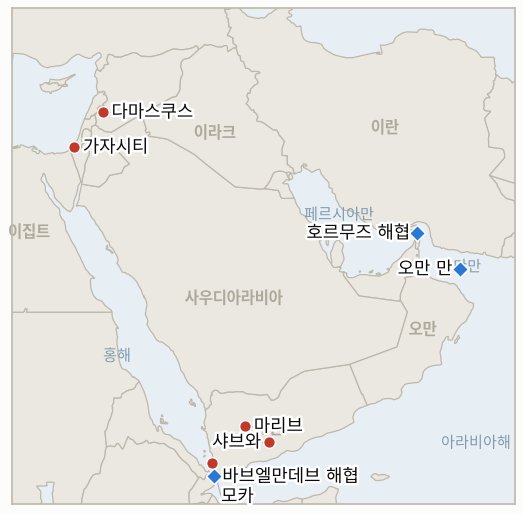

# 중동 일일 브리핑

**2026년 8월 12일**

- **보고 대상 기간:** 약 24시간, 8월 11일 09:00 ~ 8월 12일 09:00 (한국시간)
- **종합 평가:** 화요일은 호르무즈 교착의 핵심인 배상금 공방을 한층 굳히는 동시에, 해상 봉쇄와 예멘 확전이라는 두 가지 새로운 확전 축을 더했다. 트럼프 대통령은 이란의 배상 요구에 맞불을 놓듯 레바논, 시리아, 예멘, 가자의 전쟁 피해에 대해 이란이 배상해야 한다고 요구했다. 이미 교착 상태이던 협상에 새로운 전제조건을 얹은 셈이며, 유가는 이 여파로 주간 상승폭을 6%대까지 늘렸다. 같은 날 이 원장이 추적해온 가장 오래된 호르무즈 관련 지표, 즉 이란의 동결자산 통항 금지 위협이 실제로 시험대에 오를지를 지켜보던 지표가 아무 시험 없이 시한을 넘겨, 위협이 강제력 있는 정책이 아니라 수사적 지렛대에 머물렀음을 확인시켰다. 미 중부사령부는 기존 봉쇄 집행 수위를 넘어섰다. 파나마 국적 화물선을 단순히 우회시키거나 승선 검색하는 대신 헬파이어 미사일로 무력화한 것으로, 3국적 민간 선박을 상대로 한 무력 사용이라는 점에서 미국·이란 간 군사적 충돌이 아직 일방적이라는 큰 틀은 유지하면서도 집행 강도를 한 단계 끌어올렸다. 가자 외교는 조용하지만 구조적으로 중요한 전환을 맞았다. 평화이사회의 최종안이 하마스 무기 보유를 명시적으로 금지하는 조항을 빼고 더 완화된 "무장해제 후 보관" 문구로 바뀌었다는 보도가 나온 것이다. 그러면서도 네타냐후 총리는 15개항 계획에 대한 공개 거부 입장을 유지했고, 사흘 사이 두 번째로 이스라엘 안보내각의 공식 표결을 추적하던 지표가 표결 없이 시한을 넘겨 falsify됐다. 예멘의 후티-사우디-정부군 전쟁은 다시 확대됐다. 모카와 마리브에 대한 미사일 공격이 재개됐고, 이틀 연속 샤브와 드론 공격이 발생했으며, 특히 바브엘만데브 해협에서 발생한 미사일 공격으로 파키스탄인 2명과 인도네시아인 1명 등 이 캠페인 사상 처음으로 제3국 국적 선원 사망자가 보고됐다. 시리아는 이날 유일하게 안정적인 소식을 전했다. 다마스쿠스와 IAEA 모두 아사드 정권 시절 핵물질 문제를 마무리 짓는 쪽으로 움직이고 있다는 신호를 보냈지만, 시리아 당국자는 아직 최종 합의는 이뤄지지 않았다고 선을 그었다. 한국 증시는 이틀 연속 반등해 코스피가 0.73% 올랐고 원화도 소폭 강세를 보였다. 다만 배상금 공방과 해상 봉쇄 확전 모두 호르무즈 통행 정상화까지의 길이 더 멀어졌음을 시사한다.

---

## 1. 무슨 일이 있었나

<figure style="float:right; width:46%; margin:2pt 0 8pt 14pt;">

<figcaption style="font-size:8pt; color:#666; text-align:center; margin-top:3pt; font-style:italic;">주요 논의 지점</figcaption>
</figure>

### 1.1 트럼프, 이란에 분쟁 배상금 요구하며 유가 상승세 이어져

트럼프 대통령은 월요일 이란에 "마찬가지로" 배상을 요구하겠다며 "레바논, 시리아, 예멘, 가자 주민들이 입은 피해와 사망에 대해 이란이 책임져야 한다"고 밝혔다. 이는 워싱턴이 전쟁 피해를 배상하기 전까지는 호르무즈 해협을 완전히 재개방하지 않겠다는 이란의 기존 요구에 대한 직접적인 맞대응이다([SCMP](https://www.scmp.com/news/us/diplomacy/article/3363579/trump-demands-iran-pay-compensation-hopes-fade-hormuz-agreement); [CBS 뉴스](https://www.cbsnews.com/live-updates/iran-war-us-negotiation-strait-of-hormuz/); [CNBC](https://www.cnbc.com/2026/08/11/us-iran-war-trump-hormuz-control-reparation-talks-.html); [알자지라](https://www.aljazeera.com/news/2026/8/11/trump-demands-compensation-from-iran-as-talks-on-strait-of-hormuz-continue)). 전쟁의 영구 종식, 해상 봉쇄 해제, 전쟁 배상금, 동결자산 해제라는 이란 측 조건은 여전히 충족되지 않은 상태이며, 트럼프의 새로운 요구는 간극을 좁히기보다 상호 배상이라는 또 다른 쟁점을 얹은 모양새다. 유가는 월요일 상승세를 이어가 브렌트유가 1.36% 오른 배럴당 88.91달러, WTI가 1.30% 오른 83.20달러에 마감했고, 주간 상승폭은 6%를 넘어섰다(CNBC). 같은 날, 이란의 동결자산 통항 금지 위협이 실제로 시험대에 오를지를 추적해온 이 원장의 지표(IND-20260729-2)가 8월 12일 시한을 채우지 못하고 종료됐다. 이란이 경고한 배상금을 실제로 수령한 선박이나 국적국이 끝내 없었기 때문에, 이 위협은 검증되지 않은 지렛대였음이 falsify로 확정됐다. 한편 파키스탄 국방장관은 미국과 이란이 "일종의 합의"에 가까워지고 있다고 언급했는데, 이는 오늘의 강경한 기류와는 결이 다른, 단일 출처의 이례적인 발언이다([예루살렘포스트](https://www.jpost.com/middle-east/iran-news/2026-08-11/live-updates-905132)). **신뢰도: 높음** (트럼프의 발언 및 유가 마감 수치, 1~2등급, 공식 발언과 다수 매체 보도); 파키스탄 국방장관의 "합의 임박" 발언은 **신뢰도: 낮음** (단일 관료 발언, 교차 확인 없음).

### 1.2 미 해군, 이란 봉쇄를 시도하던 선박 무력화

미 해군 헬기가 화요일 오만 만에서 경고를 무시하고 미국의 이란 항구 봉쇄를 뚫으려던 파나마 국적 화물선 벨라 노바호의 기관실에 헬파이어 미사일 2발을 발사해 선박을 무력화했다. 사상자는 없었으며 승조원은 다른 선박으로 옮겨졌다([예루살렘포스트](https://www.jpost.com/middle-east/iran-news/article-905200); [US뉴스/WSJ](https://www.usnews.com/news/world/articles/2026-08-11/us-fired-on-panama-flagged-ship-that-tried-to-break-blockade-of-iranian-ports-wsj-reports-citing-us-official); [스타스앤스트라이프스](https://www.stripes.com/theaters/middle_east/2026-08-11/centcom-disables-cargo-vessel-iran-22521182.html)). 중부사령부에 따르면 7월 14일 봉쇄를 재개한 이후 지금까지 무력화한 선박은 이번이 세 번째, 승선 검색한 선박은 두 척이며, 우회시킨 상선은 총 55척에 달한다. 이는 현재 봉쇄가 시작된 이래 우회·승선 검색 위주의 집행에서 무력화 사격으로 수위가 높아진 첫 사례다. 이번 공격에 대한 이란 측의 대응은 이번 보고 기간 중 확인되지 않았다. **신뢰도: 높음** (공격 사실, 선박 신원, 중부사령부 집계, 1~2등급, 미국 당국자 소식통을 인용한 WSJ 보도 및 다수 매체 교차 확인).

### 1.3 가자 최종안, 하마스 무기 금지 명문 조항 조용히 삭제

뉴욕타임스를 인용한 하아레츠 보도에 따르면 평화이사회의 가자 최종 합의안은 하마스의 무기 보유를 명시적으로 금지하는 조항을 빼고, 팔레스타인 기술관료가 미국의 지원을 받아 관리하는 절차 아래 하마스가 중화기를 "무장해제 후 보관"하도록 요구하는 문구로 바뀌었다. 무기 인도나 이스라엘군 철수의 구체적 시한은 아직 정해지지 않았다. 같은 보도는 네타냐후 총리가 8월 3일 평화이사회 중재자들과의 회동 이후 가자 공습 중단을 조용히 지시했다고 전했는데, 이는 그동안 공개되지 않았던 사실이 이제야 드러난 것이다([하아레츠](https://www.haaretz.com/israel-news/israel-security/2026-08-11/ty-article/sources-final-gaza-agreement-omits-explicit-ban-on-hamas-weapons/0000019f-ed59-db03-a9ff-ff5b2e940000)). 네타냐후 본인의 공개 입장은 주말 발언, 즉 "이스라엘은 15개항 문서를 받아들이지 않는다"며 "형식적"이 아닌 "진정한" 무장해제만 받아들일 수 있다는 입장에서 달라지지 않았다. 이번 보고 기간 중 어떤 형태의 프레임워크에 대해서도 이스라엘 안보내각의 공식 표결은 이뤄지지 않았고, 개정된 무장해제 우선 프레임워크가 8월 12일까지 안보내각의 공식 승인으로 수렴할지를 추적해온 이 원장의 지표(IND-20260805-1)는 "지속적 미승인" 요건에 따라 자체 시한에서 falsify됐다. 문구 개정은 안보내각 표결이 아니기 때문이다. **신뢰도: 중상** (무기 관련 문구 변경 및 조용한 공습 중단, 1등급, 뉴욕타임스 소식통을 인용한 하아레츠 단독 보도, 소식통 3명); 네타냐후의 15개항 계획 공개 거부 입장 지속은 **신뢰도: 높음** (다수 매체, 8월 9일 이래 공개 발언으로 반복 확인).

### 1.4 예멘 전쟁, 제3국 선원 사망으로 확대

예멘 정부는 후티 반군이 월요일 홍해 항구도시 알마카(모카)와 마리브 주거지역에 대해 새로운 탄도미사일 공격을 감행했다고 비난했다. 별도로 후티의 드론 공격이 샤브와에서 예멘 정부군 병사 2명을 추가로 숨지게 하고 7명을 다치게 했는데, 이는 이틀 연속 발생한 유사 공격이다. 예멘 정부군은 알자우프, 사다, 마리브의 후티 진지에 반격을 가했다고 밝혔다([알자지라](https://www.aljazeera.com/news/2026/8/11/yemens-houthis-launch-ballistic-missile-attacks-on-al-makha-and-marib)). 별도로 바브엘만데브 해협을 통과하던 상선에 대한 후티의 미사일 공격으로 파키스탄인 2명과 인도네시아인 1명 등 선원 3명이 숨졌다고 사우디 국영매체 알하다스가 보도했다. 이는 사우디, 예멘, 선주 측 이해관계자가 아닌 제3국 국적 선원의 사망이 이 캠페인에서 처음 보고된 사례다([예루살렘포스트](https://www.jpost.com/middle-east/article-905168)). **신뢰도: 높음** (월요일 미사일 공격과 샤브와 드론 공격, 1~2등급, 알자지라, 다수 보도); 바브엘만데브 선원 사망은 **신뢰도: 중간** (사우디 국영매체 단일 출처, 통신사 등의 독립적 교차 확인 아직 없음).

### 1.5 시리아, 아사드 정권 유산 핵물질 문제 IAEA 매듭짓는 쪽으로

시리아 원자력위원회는 화요일 IAEA 대표단이 조만간 방문해 아사드 정권이 남긴 핵물질 문제에 대한 "중대한 진전"을 발표할 것이라고 밝히며, 이 과정에 이스라엘이 관여했다는 주장은 부인했다. 별도로 액시오스는 이스라엘·미국 당국자를 인용해 트럼프 행정부, 시리아, 이스라엘 간 합의에 따라 IAEA가 은밀한 시설에 보관된 핵물질을 조만간 반출할 것이라고 보도했다([아랍뉴스](https://www.arabnews.com/node/2654192/middle-east); [알모니터](https://www.al-monitor.com/originals/2026/08/syria-says-iaea-will-announce-significant-progress-nuclear-file); [더내셔널](https://www.thenationalnews.com/news/mena/2026/08/11/iaea-to-visit-syria-over-nuclear-material-left-by-assad-regime/)). 다만 시리아 당국자는 로이터에 전체 파일에 대한 논의가 여전히 진행 중이며 "아직 최종 합의는 이뤄지지 않았다"고 선을 그었다. 시리아는 활성화된 무기 프로그램을 보유한 것으로 알려져 있지 않으며, 이 사안은 이스라엘이 2007년 폭격한 것으로 의심되는 원자로 시설에 대한 IAEA의 오랜 조사에서 비롯됐다. **신뢰도: 높음** (시리아 측 발표 및 다수 매체 보도, 1~2등급); "조만간 반출"이라는 표현은 **신뢰도: 중간** (시리아 당국자가 아직 최종 합의가 없다고 직접 선을 그었기 때문).

---

## 2. 심층 분석: 동기와 이해관계

### 2.1 이란의 조건으로 이미 협상이 막힌 지금, 트럼프는 왜 자신의 배상 요구를 얹었나?

이란의 배상 요구에 맞불을 놓듯 자신의 요구를 제시하면, 트럼프는 협상 자체를 거부하는 모양새 없이 테헤란의 전제조건을 거부할 수 있기 때문이다. 배상을 일방적인 이란의 권리가 아니라 상호적이고 다투는 쟁점으로 만들면, 월요일 밝힌 "경제적 압박에 맡기겠다"는 기조를 유지하면서도 계속 관여하고 있다는 인상을 줄 수 있다. 이는 이란 최고국가안보회의가 국내적으로 승리로 내세울 만한 어떤 양보도 하지 않으면서, 레바논·시리아·예멘·가자에서 이란과 연계된 세력들의 공격이 누적되는 데 대한 수사적 응답이 되기도 한다. 정작 이 문제들을 해결하는 데 새로운 자원을 투입할 필요는 없다.

### 2.2 다섯 달간 우회·승선 검색 위주였던 봉쇄를, 중부사령부는 왜 지금 무력 집행으로 전환했나?

순수히 행정적인 봉쇄, 즉 위반 선박을 우회시키거나 승선 검색만 하는 방식은 결국 준수 비용보다 나포 위험을 감수하는 것이 낫다고 판단하는 선주들의 시험을 부르게 마련이다. 세 번째로 확인된 위반 선박을 승선 검색이 아니라 헬파이어 미사일로 무력화한 것은, 이제 봉쇄를 어기면 물리적 대가가 따른다는 신호를 보내려는 의도로 읽힌다. 기관실만 타격하고 사상자 없이 승조원을 대피시켜 비례성 있는 조치처럼 보이도록 계산됐지만, 동시에 기존 봉쇄 집행의 상한선은 분명히 넘어섰다. 이란 국적이 아닌 3국적 민간 선박을 상대로 한 조치이기 때문에, 이란 국적 자산을 타격했을 때보다 직접적인 이란의 군사적 대응을 부를 위험은 상대적으로 낮다.

### 2.3 네타냐후가 15개항 계획을 계속 공개 거부하는데, 평화이사회는 왜 무기 관련 문구를 완화했나?

"무장해제 후 보관"은 하마스가 받아들일 수 있으면서 동시에 네타냐후가 받아들이지 않았다고 주장할 수 있는 절묘한 절충안이기 때문이다. 완화된 문구는 평화이사회 중재자들이 국제 사회를 향해 실질적인 무장해제 진전을 이뤘다고 주장할 수 있게 해주는 한편, 네타냐후의 계속된 공개 거부 입장은 자신의 연립 정부를 향해 이스라엘 측에서 실제로는 아무것도 양보하지 않았다고 말할 수 있게 해준다. 이런 이중 트랙은 양측 모두 공식적으로 기록되는 내각 표결에 몰리지 않는 한에서만 유지될 수 있으며, 바로 그래서 오늘 시한까지도 표결이 이뤄지지 않았고, 앞으로 실제 표결이 이뤄질지를 시험하기 위해 IND-20260812-4가 새로 개설됐다.

### 2.4 후티의 캠페인은 왜 사우디·예멘 표적에 국한되지 않고 계속 제3국 선원으로 번지나?

의도치 않았더라도 제3국 국적 사망자가 늘어나면, 홍해 항로를 이용하는 모든 정부에게 이 전쟁의 정치적·해상보험적 비용이 높아진다. 그런데도 후티 입장에서는 이를 피할 유인이 거의 없다. 이들의 해상 작전은 애초에 선원의 국적이 아니라 항로와 인식된 소속에 따라 표적을 정해왔고, 파키스탄이나 인도네시아 국적 선원의 사망이 두 정부 어느 쪽의 보복으로 이어질 가능성도 낮다. 두 나라 모두 현지에 군사력을 두고 있지 않기 때문이다. 결국 제3국 선원 사망은 새로운 국가 행위자를 분쟁에 끌어들이지 않으면서 전 세계 해운·보험 업계에 압박을 유지하는, 후티 입장에서는 비용이 낮은 수단인 셈이다.

### 2.5 시리아와 IAEA는 왜 지금 핵물질 문제를 매듭지으려 하며, 다마스쿠스는 왜 이스라엘의 관여를 부인하나?

아사드 정권이 남긴 핵물질 문제를 매듭짓는 것은, 국제적 정당성과 제재 완화를 모색하는 아사드 이후 시리아 정부에게 남아 있던 핵비확산 관련 부담을 덜어주는 조치다. 이스라엘과의 양자 채널이 아니라 IAEA를 통해 해결함으로써, 다마스쿠스는 이 결과를 이스라엘의 압박에 굴복한 것이 아니라 자국의 핵확산방지조약(NPT) 의무를 이행한 것으로 포장할 수 있다. 2007년 이스라엘이 의심 원자로 시설을 타격한 사건에 대한 국내적 민감성을 고려하면 이런 구분은 중요하다. 다만 액시오스의 취재원 자체가 이스라엘과 미국 당국자였다는 점은, 실제로는 두 나라가 이번 합의의 기초를 함께 마련했음을 시사한다.

---

## 3. 한국에 대한 정책적 함의

### 3.1 노출 현황 스냅숏

| 항목 | 현재 수치 | 출처 |
| --- | --- | --- |
| 원유 수입 중 중동 비중 | 48.5%로 하락 (2026년 5~7월), 1년 전 69.1%에서 하락; 비중동 비중이 사상 처음 50%(51.5%) 돌파 | KNOC 자료, 아시아경제 인용; `korea-exposure.md` |
| 7~8월 원유 도입 | 전년 동기 대비 110% 이상 확보(산업통상자원부, 7월 21일); 전략비축유 스와프 프로그램 8월까지 연장, 현재까지 약 2,100만 배럴 스와프 | 산업통상자원부(헤럴드경제, 한국경제 인용); `korea-exposure.md` |
| 9월 원유 도입 | 90% 이상 확보(산업통상자원부, 7월 21일) | 산업통상자원부(헤럴드경제 인용) |
| 홍해 우회 경로 | 한국행 원유 화물 14척 이상이 홍해/얀부 우회 경로 이용 중, 얀부(사우디 선적)와 바브엘만데브(모카, 샤브와, 이번 사망자 발생 지점 인근 통과) 양쪽 모두에 노출 | 해양수산부 통신사 보도; `korea-exposure.md` |
| 전략비축유 커버리지 | 실제 소비 기준 약 26일분(추정); 스와프 즉시 시행 대기, 대규모 시행 검증은 아직 안됨 | CSIS; 산업통상자원부 7월 27일 |
| 정유사 사우디 지분 노출 | S-Oil(사우디 아람코 지분 약 63%), HD현대오일뱅크(아람코 지분 약 17%) | 공시자료; `korea-exposure.md` |
| 브렌트유/WTI | 마감 88.91달러/83.20달러, 트럼프의 새 배상 요구로 동반 상승, 주간 상승폭 6% 초과 | CNBC |
| 코스피/원달러 환율 | 마감 6,345.53(+0.73%) / 1,416.0원(-2.4원, 원화 강세) | 뉴시스; 아시아경제 |
| 호르무즈 통항량 | 이번 보고 기간 중 신규 Kpler/로이터 발표 없음; 윈드워드는 8월 10일 통항 10척(입항 7척, 출항 3척, AIS 신호 끊긴 선박 4척) 집계, 이 원장이 통상 사용하는 Kpler 집계 방식과는 다른 방법론 | 윈드워드 데일리 인텔리전스 |

### 3.2 사안별 함의

**트럼프의 새로운 "분쟁 배상금" 요구는 이란의 배상·봉쇄 해제 요구 위에 또 하나의 조건을 얹은 것으로, 단기 호르무즈 정상화 가능성을 더 멀어지게 하며 한국 정유업계가 대비해야 할 유가 변동성을 연장시킨다. 오늘 IND-20260729-2가 falsify된 것은 이란이 스스로 통항 금지를 일방적으로 강제하는 단계까지는 가지 않았다는 작은 안도 요인이다.** IND-20260811-1(시한 8월 18일)과 IND-20260808-2(시한 8월 15일)는 양측의 수사가 강경해지는 가운데서도 이란-오만 기술 트랙이 여전히 성사될지를 계속 추적한다.

**미 해군의 첫 무력 봉쇄 집행, 즉 파나마 국적 벨라 노바호 무력화는 한국 국적 또는 한국 용선 선박이 걸프 해역을 통과할 때 단순한 외교적 마찰이 아니라 실제 집행 조치의 위험에 노출될 수 있음을 상기시킨다.** 신규 지표 IND-20260812-1(시한 8월 26일)은 이 조치가 이란의 군사적 대응을 불러 더 위험한 확전으로 이어질지를 시험한다.

**가자에서 명시적 무기 금지 조항이 조용히 후퇴한 것과, 오늘 IND-20260805-1이 falsify된 것을 함께 보면, 한국의 정책 담당자들은 가자에서의 조속한 타결과 그에 따른 지역 긴장 완화 배당, 즉 한국의 리스크 모델이 전제하는 배당이 평화이사회의 공개 메시지가 시사하는 것보다 더 멀리 있다고 봐야 한다.** 신규 지표 IND-20260812-4(시한 8월 26일)는 연속으로 두 개의 후속 지표가 표결 없이 falsify된 이후, 이 프레임워크가 어떤 형태로든 이스라엘 안보내각의 공식 표결에 이를지를 시험한다.

**예멘 전쟁이 제3국 선원 사망으로 번진 것은 한국의 홍해 우회로에 헤지하기 더 어려운 새로운 리스크 축을 더한다. 이 항로의 위험은 이제 화물과 사우디 인프라뿐 아니라, 국적을 불문한 선원 자체에게도 명백히 미치고 있다.** 신규 지표 IND-20260812-3(시한 8월 26일)은 이번 사망 사건이 제3국의 외교적 대응을 부를지를 시험하며, IND-20260807-1과 IND-20260809-3(둘 다 확인 쪽으로 기울고 있으며 시한은 각각 8월 14일, 8월 16일)은 예멘 전쟁이 국지적 교전을 넘어 지속적 확전으로 갈지를 계속 추적한다.

**시리아의 핵물질 문제는 한국 시장에 직접적인 노출은 없지만, 확전이 지배적인 이 지역에서 몇 안 되는 진정으로 안정적인 핵비확산 성과가 될 수 있다는 점에서 드문 긍정적 신호로 지켜볼 가치가 있다.** 신규 지표 IND-20260812-2(시한 9월 11일)는 오늘 발표된 "중대한 진전"이 실제 합의 타결로 이어질지를 시험한다.

**검증 가능한 지표:**

- **IND-20260812-1** — 벨라 노바호에 대한 미 해군의 무력 봉쇄 집행이 이란의 군사적 대응을 부르는지, 아니면 봉쇄가 보복 없이 위반 선박을 계속 흡수하는지를 시험한다. 2026년 8월 26일까지 이 무력화 조치에 대한 명백한 보복으로 연결되는 이란의 미 해군 함정 또는 봉쇄 집행 자산 공격이 확인되면 실질적 군사 충돌로의 전환이 확인(confirm)되고, 같은 시점까지 그런 공격이 없으면 falsify된다.
- **IND-20260812-2** — 시리아의 아사드 정권 유산 핵물질 문제가 실제 합의 타결과 IAEA의 검증된 반출로 이어지는지, 아니면 오늘 발표된 "중대한 진전"이 그에 못 미치고 멈추는지를 시험한다. 2026년 9월 11일까지 공개적으로 확인된 합의 타결과 검증된 반출이 이뤄지면 confirm되고, 같은 시점까지 "최종 합의 없음"이라는 단서가 계속되거나 검증된 반출이 없으면 단기 타결 가능성은 falsify된다.
- **IND-20260812-3** — 파키스탄인·인도네시아인 선원을 숨지게 한 바브엘만데브 공격이 제3국의 외교적 또는 해군력 대응을 부르는지, 아니면 별다른 대응 없이 지나가는지를 시험한다. 2026년 8월 26일까지 이 공격을 구체적으로 지목한 공개 항의, 외교적 조치, 또는 안보 관련 파견이 있으면 confirm되고, 같은 시점까지 그런 대응이 없으면 falsify된다.
- **IND-20260812-4** — 가자 무장해제 우선 프레임워크가 어떤 형태로든 이스라엘 안보내각의 공식 표결에 도달하는지, 아니면 표결 없이 무기한 지속되는지를 시험한다. 2026년 8월 26일까지 이 프레임워크의 어떤 버전에 대해서든 공식적으로 기록된 내각 표결이 이뤄지면 confirm되고, 같은 시점까지 그런 표결이 전혀 없으면 falsify된다.

---

## 4. 주시 목록

- **벨라 노바호에 대한 미 해군의 무력 집행이 이란의 군사적 대응을 부를지** (IND-20260812-1, 시한 8월 26일).
- **시리아의 핵물질 문제가 IAEA와의 합의 타결 및 검증된 반출로 이어질지** (IND-20260812-2, 시한 9월 11일).
- **파키스탄인·인도네시아인 선원을 숨지게 한 바브엘만데브 공격이 제3국의 외교적 대응을 부를지** (IND-20260812-3, 시한 8월 26일).
- **가자 무장해제 우선 프레임워크가 어떤 형태로든 이스라엘 안보내각의 공식 표결에 도달할지** (IND-20260812-4, 시한 8월 26일).
- **이란의 강경파 안보라인 개편이 호르무즈 외교를 더 정체시킬지, 아니면 이란-오만 트랙이 여전히 성사될지** (IND-20260811-1, 시한 8월 18일).
- **마즈달 준 폭발이 헤즈볼라의 손질로 확인될지, 아니면 오래된 불발탄으로 결론 날지** (IND-20260811-2, 시한 8월 25일).
- **타이베 봉쇄가 정착민 공격을 줄일지, 아니면 폭력이 계속될지** (IND-20260811-3, 시한 8월 18일).
- **하메네이 또는 레자에이 체제의 이란 최고국가안보회의가 결국 어떤 형태로든 호르무즈 프레임워크를 공식 승인할지** (IND-20260808-2, 시한 8월 15일).
- **이란 최고국가안보회의의 요구가 워싱턴을 군사행동 재개 쪽으로 밀어붙일지** (IND-20260809-1, 시한 8월 16일).
- **마리브·하드라마우트에 대한 후티 지상 공세가 지속적 공세로 이어질지** (IND-20260807-1, 확인 쪽으로 기울고 있음, 시한 8월 14일).
- **예멘 정부군-후티 전쟁이 지속적이고 전면적인 전쟁으로 확대될지, 아니면 제한적 교전으로 되돌아갈지** (IND-20260809-3, 확인 쪽으로 기울고 있음, 시한 8월 16일).
- **사우디아라비아가 자잔 정유시설 공격이나 추가 후티 공격에 직접 보복할지** (IND-20260810-3, 시한 8월 17일).
- **사우디가 경고한 후티-이라크 민병대의 협공이 실제로 실현될지** (IND-20260808-1, 시한 8월 15일).
- **레바논 남부의 실전투 국면이 로마 트랙의 9월 1일 예정 라운드를 무산시킬지, 아니면 병행 진행될지** (IND-20260807-2, 시한 9월 1일).
- **걸프 국가가 해협 안보와 연계된 구체적 달러 표시 대미 투자 패키지를 발표할지** (IND-20260715-2, 시한 8월 14일).
- **쿠웨이트의 51조 원용이 항의를 넘어선 조치로 이어질지** (IND-20260802-2, 시한 8월 15일).
- **다미에타 공격의 책임 소재가 공식적으로 규명될지** (IND-20260801-3, 시한 8월 14일).
- **케슘섬 폭발이 실제 공격으로 확인될지, 아니면 오경보로 결론 날지.**

---

## 5. 출처 신뢰도 요약

| 주장 | 출처 | 신뢰도 |
| --- | --- | --- |
| 트럼프, 레바논·시리아·예멘·가자 전쟁 피해에 대해 이란에 "분쟁 배상금" 요구 | SCMP, CBS 뉴스, CNBC, 알자지라 (1~2등급, 공식 발언, 다수 매체) | 높음 |
| 브렌트유 88.91달러(+1.36%), WTI 83.20달러(+1.30%) 마감, 주간 상승폭 6% 초과 | CNBC (1~2등급, 시황 통신) | 높음 |
| IND-20260729-2 falsify: 8월 12일 시한까지 이란의 동결자산 통항 금지 위협이 시험대에 오른 사례 없음 | 이 원장의 2026년 7월 29일 이후 자체 추적 | 높음 |
| 미 해군, 헬파이어 미사일로 파나마 국적 벨라 노바호 무력화, 7월 14일 이후 세 번째 무력화 사례 | 예루살렘포스트, US뉴스/WSJ, 스타스앤스트라이프스 (1~2등급, 미국 당국자 소식통, 다수 매체) | 높음 |
| 평화이사회의 가자 최종안, 하마스 무기 금지 명문 조항 대신 "무장해제 후 보관" 문구로 대체; 네타냐후, 8월 3일 회동 이후 조용히 가자 공습 중단 지시 | 뉴욕타임스 소식통을 인용한 하아레츠 (1등급, 단일 매체 단독 보도) | 중상 |
| 네타냐후, 평화이사회의 15개항 계획 공개 거부 입장 지속 | 다수 매체, 8월 9일 이래 공개 발언으로 반복 확인 | 높음 |
| IND-20260805-1 falsify: 8월 12일 시한까지 개정 프레임워크에 대한 이스라엘 안보내각의 공식 표결 없음 | 이 원장의 2026년 8월 5일 이후 자체 추적 | 높음 |
| 후티, 모카·마리브에 새 탄도미사일 공격 감행; 샤브와 드론 공격으로 예멘 정부군 2명 추가 사망 | 알자지라 (1~2등급, 다수 보도) | 높음 |
| 바브엘만데브 상선 대상 후티 미사일 공격으로 파키스탄인 2명, 인도네시아인 1명 사망 | 예루살렘포스트, 사우디 국영매체 알하다스 인용 (2~3등급, 단일 출처) | 중간 |
| 시리아 원자력위원회, IAEA가 아사드 정권 유산 핵물질 문제에 대해 "중대한 진전" 발표 예정이라고 밝힘; 시리아 당국자는 최종 합의는 아직 없다고 선을 그음 | 아랍뉴스, 알모니터, 더내셔널, 로이터 (1~2등급, 다수 매체) | 높음 |
| 코스피 0.73% 오른 6,345.53 마감; 원화 2.4원 강세 1,416.0원 | 뉴시스, 아시아경제 (1~2등급, 한국 경제지) | 높음 |
| 한국의 원유 수입 중 중동 비중 48.5%로 하락(2026년 5~7월), 비중동 비중 사상 첫 50% 돌파 | KNOC 자료, 아시아경제 인용 (2등급, 한국 경제지) | 중상 |
