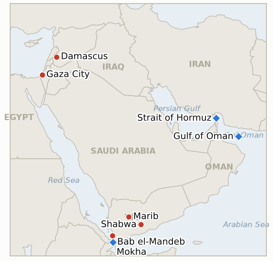

# Middle East Daily Briefing

**August 12, 2026**

- **Reporting window:** ~24 hours, August 11, 09:00 to August 12, 09:00 KST
- **Overall assessment:** Tuesday hardened the compensation standoff at the heart of the Hormuz stalemate while adding two new escalation vectors in the naval blockade and Yemen's widening war. Trump matched Iran's own reparations demand with one of his own, insisting Tehran pay for war damage across Lebanon, Syria, Yemen and Gaza, a move that layers a fresh precondition onto talks that were already stalled and helped extend oil's rally to a sixth straight percent for the week; the same day, this ledger's oldest live Hormuz-adjacent indicator, tracking whether Iran's frozen-asset transit ban threat would ever be tested, expired unused, confirming the threat has stayed rhetorical leverage rather than an enforced policy. CENTCOM crossed its own prior ceiling on blockade enforcement, firing Hellfire missiles to disable a Panamanian-flagged cargo vessel rather than simply redirecting or boarding it, a kinetic escalation against a third-flag civilian ship even as the broader US-Iran military exchange stayed one-sided. Gaza's diplomacy took a quieter but structurally significant turn: reporting revealed the Board of Peace's final text has dropped the explicit ban on Hamas weapons for softer "decommission and store" language, even as Netanyahu keeps publicly rejecting the 15-point plan and, for the second time in three days, an indicator tracking a formal Israeli Security Cabinet vote expired with none having occurred. Yemen's Houthi-Saudi-government war widened again, with renewed missile strikes on Mokha and Marib, a second Shabwa drone strike in two days, and, notably, the campaign's first reported third-country crew fatalities: two Pakistani and one Indonesian national killed in a Bab el-Mandeb missile strike. Syria offered the day's lone stabilizing note, with Damascus and the IAEA both signaling movement toward closing the file on Assad-era nuclear material, though a Syrian official cautioned no final agreement is yet concluded. South Korean markets logged a second straight rebound, KOSPI up 0.73% and the won firming slightly, even as the compensation standoff and the naval escalation both point toward a longer, not shorter, road back to normal Hormuz traffic.

---

## 1. What Happened

<figure style="float:right; width:46%; margin:2pt 0 8pt 14pt;">

<figcaption style="font-size:8pt; color:#666; text-align:center; margin-top:3pt; font-style:italic;">Major places of discussion</figcaption>
</figure>

### 1.1 Trump Demands Conflict Compensation From Iran as Oil Extends Its Rally

President Trump said Monday he will "likewise" demand compensation from Iran, writing that "Iran should be responsible for the damages and death caused to the people of Lebanon, Syria, Yemen, and Gaza," a direct response to Iran's own standing demand that Washington compensate Tehran for war damage before it will fully reopen the Strait of Hormuz ([SCMP](https://www.scmp.com/news/us/diplomacy/article/3363579/trump-demands-iran-pay-compensation-hopes-fade-hormuz-agreement); [CBS News](https://www.cbsnews.com/live-updates/iran-war-us-negotiation-strait-of-hormuz/); [CNBC](https://www.cnbc.com/2026/08/11/us-iran-war-trump-hormuz-control-reparation-talks-.html); [Al Jazeera](https://www.aljazeera.com/news/2026/8/11/trump-demands-compensation-from-iran-as-talks-on-strait-of-hormuz-continue)). Iran's own conditions, a permanent end to the war, a lifted naval blockade, war-damage compensation and released frozen assets, remain unmet, and Trump's new demand adds a mutual, contested claim rather than narrowing the gap. Oil extended Monday's jump, Brent settling +1.36% at $88.91 and WTI +1.30% at $83.20, pushing the week's gain past 6% (CNBC). The same day, IND-20260729-2, this ledger's indicator tracking whether Iran's frozen-asset transit-ban threat would ever be tested, reached its August 12 deadline unresolved: no vessel or flag state ever accepted the compensation Iran warned against, and it falsifies as untested leverage. Separately, Pakistan's defense minister told reporters the US and Iran are nearing "some sort of an arrangement," a discordant, single-sourced note against the day's harder tone ([Jerusalem Post](https://www.jpost.com/middle-east/iran-news/2026-08-11/live-updates-905132)). **Confidence: High** on Trump's quoted demand and the oil settle figures (Tier 1-2, on-record statement, multi-outlet market reporting); **Low** on Pakistan's "nearing an arrangement" characterization, a single official's claim with no corroboration.

### 1.2 US Navy Disables a Vessel Attempting to Run the Iran Blockade

A US Navy helicopter fired two Hellfire missiles into the engine room of the Panamanian-flagged cargo vessel Vela Nova in the Gulf of Oman on Tuesday after it ignored warnings and attempted to break the US naval blockade of Iranian ports, disabling the ship without casualties; the crew was transferred to another vessel ([Jerusalem Post](https://www.jpost.com/middle-east/iran-news/article-905200); [US News/WSJ](https://www.usnews.com/news/world/articles/2026-08-11/us-fired-on-panama-flagged-ship-that-tried-to-break-blockade-of-iranian-ports-wsj-reports-citing-us-official); [Stars and Stripes](https://www.stripes.com/theaters/middle_east/2026-08-11/centcom-disables-cargo-vessel-iran-22521182.html)). CENTCOM said it has now disabled three non-compliant vessels and boarded two since re-imposing the blockade on July 14, against 55 commercial vessels redirected in total, the first time enforcement has escalated from redirect-and-board to disabling fire since the current blockade began. No Iranian response to the strike was reported in the window. **Confidence: High** on the strike, the vessel's identity and CENTCOM's enforcement tally (Tier 1-2, US official sourcing via WSJ, multi-outlet corroboration).

### 1.3 Gaza's Final Text Quietly Drops the Explicit Hamas Weapons Ban

Sources cited by the New York Times, via Haaretz, say the Board of Peace's final Gaza agreement has dropped the explicit prohibition on Hamas possessing weapons in favor of requiring the group to "decommission and store" its heavy weapons under a process managed by Palestinian technocrats with US support, with no firm timeline yet set for the handover or any Israeli withdrawal; the same reporting says Netanyahu quietly ordered a halt to Gaza strikes after an August 3 meeting with Board of Peace mediators, an unannounced de-escalation only now surfacing ([Haaretz](https://www.haaretz.com/israel-news/israel-security/2026-08-11/ty-article/sources-final-gaza-agreement-omits-explicit-ban-on-hamas-weapons/0000019f-ed59-db03-a9ff-ff5b2e940000)). Netanyahu's own public position has not moved from his weekend statement that "Israel does not accept the 15-point document" and that only "real," not "fictitious," disarmament is acceptable. No formal Israeli Security Cabinet vote on any version of the framework occurred in the window, and IND-20260805-1, this ledger's indicator tracking whether the revised disarm-first framework would converge into a formal cabinet endorsement by August 12, falsifies at its own deadline via the "continued non-endorsement" branch: a text revision is not a cabinet vote. **Confidence: Medium-High** on the weapons-language change and the quiet strikes halt (Tier 1, Haaretz citing NYT sourcing, three sources); **High** on Netanyahu's continued public rejection of the 15-point plan, his standing, multiply-reported position.

### 1.4 Yemen's War Widens to Third Country Crew Casualties

Yemen's government accused the Houthis of launching fresh ballistic missile attacks on the Red Sea port of al-Makha (Mokha) and on residential areas of Marib on Monday, while a separate Houthi drone strike killed two more Yemeni government soldiers and wounded seven in Shabwa, a second such strike in as many days; Yemeni government forces said they struck back at Houthi positions in al-Jawf, Saada and Marib ([Al Jazeera](https://www.aljazeera.com/news/2026/8/11/yemens-houthis-launch-ballistic-missile-attacks-on-al-makha-and-marib)). Separately, a Houthi missile strike on a commercial ship transiting Bab el-Mandeb killed two Pakistani and one Indonesian crew member, according to Saudi state-owned Al Hadath, the campaign's first reported fatalities of third-country nationals rather than Saudi, Yemeni or ship-owner interests ([Jerusalem Post](https://www.jpost.com/middle-east/article-905168)). **Confidence: High** on the Monday missile attacks and the Shabwa drone strike (Tier 1-2, Al Jazeera, multi-report); **Medium** on the Bab el-Mandeb crew deaths, single-sourced via Saudi state media and not yet independently corroborated by a wire service.

### 1.5 Syria's Legacy Nuclear Material File Nears an IAEA Resolution

Syria's Atomic Energy Commission said Tuesday that an IAEA delegation will visit in the coming days to announce "significant progress" on the file covering nuclear material left from the Assad era, denying any Israeli role in the process; separately, Axios reported Israeli and US officials as saying the IAEA will soon remove material stored at a clandestine site under understandings reached among the Trump administration, Syria and Israel ([Arab News](https://www.arabnews.com/node/2654192/middle-east); [Al-Monitor](https://www.al-monitor.com/originals/2026/08/syria-says-iaea-will-announce-significant-progress-nuclear-file); [The National](https://www.thenationalnews.com/news/mena/2026/08/11/iaea-to-visit-syria-over-nuclear-material-left-by-assad-regime/)). A Syrian official told Reuters, however, that discussions on the file as a whole remain underway and "no final agreement has been concluded." Syria is not known to hold an active weapons program; the file traces to the IAEA's long-running investigation of a suspected reactor site Israel bombed in 2007. **Confidence: High** on Syria's own announcement and the multi-outlet coverage (Tier 1-2); **Medium** on the "soon removal" characterization, since a Syrian official directly cautions the file is not yet finalized.

---

## 2. Deep Dive: Incentives and Motives

### 2.1 Why would Trump add his own compensation demand now, just as Iran's own conditions have already stalled talks?

Because matching Iran's reparations demand with one of his own lets Trump reject Tehran's precondition without appearing to reject negotiations outright: by making compensation a mutual, contested claim rather than a one-way Iranian entitlement, he can maintain Monday's "let economic pressure work" posture while still projecting engagement, all without conceding anything Iran's SNSC could claim as a win domestically, and it doubles as a rhetorical answer to the mounting toll of Houthi, Hezbollah and other Iran-linked attacks across Lebanon, Syria, Yemen and Gaza without committing new resources to address any of them directly.

### 2.2 Why would CENTCOM escalate to kinetic force against a blockade runner five months into a redirect and board posture?

Because a purely administrative blockade, one that only redirects or boards non-compliant vessels, eventually invites test cases from operators willing to gamble that compliance costs less than the risk of interception; disabling the third confirmed runner with Hellfire missiles rather than simply boarding it signals that defiance now carries a physical cost, calibrated to look proportionate (engine room only, no casualties, crew evacuated) while still crossing the blockade's prior demonstrated ceiling, a step CENTCOM can take against a third-flag civilian vessel with comparatively low risk of provoking a direct Iranian military response, unlike a strike on an Iranian-flagged asset would.

### 2.3 Why would the Board of Peace soften its weapons language while Netanyahu keeps publicly rejecting the plan?

Because "decommission and store" is the concession Hamas can accept and Netanyahu can plausibly deny having accepted at the same time: the softened language lets Board of Peace mediators claim substantive disarmament progress toward their own international audience, while Netanyahu's continued public rejection of the 15-point plan lets him tell his coalition nothing has actually been conceded on Israel's behalf, a dual-track arrangement that only survives as long as neither side is forced into a formal, recorded cabinet vote, which is precisely why none has occurred through today's deadline and why IND-20260812-4 now exists to test whether one ever will.

### 2.4 Why does the Houthi campaign keep widening to third country crews rather than staying bounded to Saudi and Yemeni targets?

Because internationalizing casualties, even unintentionally, raises the political and shipping-insurance cost of the war for every government whose nationals crew Red Sea traffic, and the Houthis have little incentive to avoid it: their maritime campaign already targets vessels by route and perceived allegiance rather than by the crew's nationality, and a Pakistani or Indonesian crew death is unlikely to draw retaliation from either government, neither of which has forces in the theater, making third-country casualties a low-cost way to keep pressure on global shipping and insurance without inviting a new state adversary into the conflict.

### 2.5 Why would Syria and the IAEA move now on the nuclear material file, and why does Damascus deny Israeli involvement?

Because closing the Assad-era nuclear-material file removes a lingering nonproliferation liability for Syria's post-Assad government just as it seeks broader international legitimacy and sanctions relief, and routing the resolution through the IAEA rather than a bilateral Israeli channel lets Damascus frame the outcome as fulfilling its own NPT obligations rather than capitulating to Israeli pressure, a distinction that matters domestically given lingering sensitivity over Israel's 2007 strike on a suspected reactor site, even though Axios's own sourcing suggests Israeli and US officials helped broker the underlying understanding.

---

## 3. Policy Implications for South Korea

### 3.1 Exposure snapshot

| Item | Current reading | Source |
| --- | --- | --- |
| Middle East share of crude imports | Fell to 48.5% (May-July 2026), down from 69.1% a year earlier; non-Middle East share crossed 50% (51.5%) for the first time on record | KNOC via Asia Business Daily; `korea-exposure.md` |
| July-August crude procurement | 110%+ of prior-year volume secured (MOTIE, July 21); strategic reserve swap extended through August, ~21 million barrels swapped to date | MOTIE via Herald Business, Hankyung; `korea-exposure.md` |
| September crude procurement | 90%+ secured (MOTIE, July 21) | MOTIE via Herald Business; `korea-exposure.md` |
| Red Sea detour routing | 14th-plus Korean-bound crude cargo via the Red Sea/Yanbu workaround, exposed at both Yanbu (Saudi loading) and Bab el-Mandeb (transiting past Mokha, Shabwa and now a fatal strike site) | MOF via wire reporting; `korea-exposure.md` |
| Strategic reserve coverage | ~26 days of actual consumption (estimate); swap on immediate standby, untested at scale | CSIS; MOTIE July 27 |
| Refiner Saudi ownership exposure | S-Oil (Saudi Aramco majority ~63%), HD Hyundai Oilbank (Aramco ~17%) | Public filings; `korea-exposure.md` |
| Brent / WTI | Settle $88.91 / $83.20, both up on Trump's new compensation demand, week's gain past 6% | CNBC |
| KOSPI / USD-KRW | Close 6,345.53 (+0.73%) / 1,416.0 won (-2.4 won, won firmed) | Newsis; Asia Economy Daily |
| Hormuz transits | No fresh Kpler/Reuters print in the window; Windward recorded 10 crossings August 10 (7 inbound, 3 outbound, 4 AIS-dark), a different counting methodology than this ledger's usual Kpler basis | Windward Daily Intelligence |

### 3.2 Implications by development

**Trump's new "conflict compensation" demand on Iran, layered atop Iran's own reparations and blockade-lifting conditions, keeps a near-term Hormuz normalization off the table and extends the oil-price volatility Korean refiners must plan around; IND-20260729-2's falsification today is a small reassurance that Iran has not moved to unilaterally enforce a transit ban of its own.** IND-20260811-1 (deadline August 18) and IND-20260808-2 (deadline August 15) continue tracking whether the Iran-Oman technical track can still convert despite the harder rhetoric on both sides.

**The US Navy's first kinetic blockade-enforcement action, disabling the Panamanian-flagged Vela Nova, is a reminder that any Korean-flagged or Korean-chartered vessel transiting Gulf waters faces a live risk of enforcement action, not just diplomatic friction, if it is read as testing the blockade.** New IND-20260812-1 (deadline August 26) tests whether this draws an Iranian military response that would mark a further, more dangerous escalation.

**Gaza's quiet retreat from an explicit weapons ban, alongside IND-20260805-1's falsification today, means Korean planners should treat any near-term Gaza settlement, and the broader regional de-escalation dividend Korea's own risk models assume would follow one, as further away than the Board of Peace's public messaging implies.** New IND-20260812-4 (deadline August 26) tests whether the framework ever reaches a formal Israeli Security Cabinet vote in any form, after two consecutive successor indicators have now falsified without one occurring.

**Yemen's war widening to third-country crew casualties adds a harder-to-hedge risk dimension to Korea's Red Sea workaround: the corridor's danger is no longer just to cargo and Saudi infrastructure but now demonstrably to seafarers regardless of nationality.** New IND-20260812-3 (deadline August 26) tests whether this specific casualty draws a diplomatic response; IND-20260807-1 and IND-20260809-3 (both trending toward confirmation, deadlines August 14 and August 16) continue tracking whether Yemen's war becomes sustained rather than bounded.

**Syria's nuclear material file carries no direct Korean market exposure, but a clean IAEA resolution would be one of the only genuinely stabilizing nonproliferation developments in a region otherwise defined by escalation, worth tracking as a rare positive data point.** New IND-20260812-2 (deadline September 11) tests whether the announced "significant progress" converts into a concluded agreement and verified removal.

**Testable indicators:**

- **IND-20260812-1** — The US Navy's kinetic blockade enforcement against the Vela Nova draws an Iranian military response, or the blockade continues absorbing runners without retaliation. A verified Iranian attack on a US Navy vessel or enforcement asset explicitly tied to retaliation by ~2026-08-26 confirms a crossing into active military exchange; no such attack through the same date falsifies it.
- **IND-20260812-2** — Syria's Assad-era nuclear material file converts into a concluded agreement and verified IAEA removal, or the announced "significant progress" stalls short of one. A concluded, publicly confirmed agreement and verified removal by ~2026-09-11 confirms the file is genuinely closing; continued caveats that no final agreement exists, or no verified removal, by the same date falsifies near-term closure.
- **IND-20260812-3** — The Bab el-Mandeb strike killing Pakistani and Indonesian crew draws a diplomatic or naval response from a third country, or passes without one. A public protest, demarche, or security deployment specifically citing the strike by ~2026-08-26 confirms internationalizing fallout; no such response by the same date falsifies it.
- **IND-20260812-4** — The Gaza disarm-first framework ever reaches a formal Israeli Security Cabinet vote, in any form, or continues indefinitely without one. A formal, recorded cabinet vote on any version of the framework by ~2026-08-26 confirms the process still moves through formal channels; continued absence of any such vote through the same date falsifies it.

---

## 4. Watch List

- **Whether the US Navy's kinetic strike on the Vela Nova draws an Iranian military response** (IND-20260812-1, deadline August 26).
- **Whether Syria's nuclear material file converts into a concluded IAEA agreement and verified removal** (IND-20260812-2, deadline September 11).
- **Whether the Bab el-Mandeb strike killing Pakistani and Indonesian crew draws a third-country diplomatic response** (IND-20260812-3, deadline August 26).
- **Whether the Gaza disarm-first framework ever reaches a formal Israeli Security Cabinet vote in any form** (IND-20260812-4, deadline August 26).
- **Whether Iran's hardline security reshuffle further stalls Hormuz diplomacy or the Iran-Oman track still converts** (IND-20260811-1, deadline August 18).
- **Whether the Majdal Zoun blast is confirmed as Hezbollah tampering or an old, inert device** (IND-20260811-2, deadline August 25).
- **Whether sealing Taybeh to non-residents reduces settler attacks or violence continues regardless** (IND-20260811-3, deadline August 18).
- **Whether Khamenei or Iran's Supreme National Security Council, now under Rezaei, ever formally approve any Hormuz framework** (IND-20260808-2, deadline August 15).
- **Whether Iran's Supreme National Security Council's demands push Washington toward renewed military action** (IND-20260809-1, deadline August 16).
- **Whether the underlying Houthi ground campaign against Marib and Hadramaut continues into a sustained offensive** (IND-20260807-1, trending toward confirmation, deadline August 14).
- **Whether Yemen's government-Houthi war escalates into sustained, open warfare or reverts to a bounded exchange** (IND-20260809-3, trending toward confirmation, deadline August 16).
- **Whether Saudi Arabia answers the Jazan refinery strike, or any further Houthi attack, with direct retaliation** (IND-20260810-3, deadline August 17).
- **Whether Saudi Arabia's warned coordinated Houthi-Iraqi militia attack ever materializes as a true two-pronged strike** (IND-20260808-1, deadline August 15).
- **Whether south Lebanon's active-combat phase derails or continues running parallel to the Rome diplomatic track's proposed September 1 round** (IND-20260807-2, deadline September 1).
- **Whether a named Gulf state announces a specific dollar-denominated US investment package tied to strait security** (IND-20260715-2, deadline August 14).
- **Whether Kuwait's Article 51 invocation is followed by any action beyond protest** (IND-20260802-2, deadline August 15).
- **Whether the Damietta attack is ever formally attributed** (IND-20260801-3, deadline August 14).
- **Whether the Qeshm Island explosions are ever confirmed as a real strike or resolved as a false alarm.**

---

## 5. Source Quality Summary

| Claim | Sources | Confidence |
| --- | --- | --- |
| Trump demands Iran pay "conflict compensation" for war damage in Lebanon, Syria, Yemen and Gaza | SCMP, CBS News, CNBC, Al Jazeera (Tier 1-2, on-record statement, multi-outlet) | High |
| Brent settles $88.91 (+1.36%) and WTI $83.20 (+1.30%), week's gain past 6% | CNBC (Tier 1-2, market wire reporting) | High |
| IND-20260729-2 falsifies: no vessel or flag state ever tested Iran's frozen-asset transit-ban threat by the August 12 deadline | This ledger's own daily tracking since 2026-07-29 | High |
| US Navy disables the Panamanian-flagged Vela Nova with Hellfire missiles in the Gulf of Oman, third vessel disabled since July 14 | Jerusalem Post, US News/WSJ, Stars and Stripes (Tier 1-2, US official sourcing, multi-outlet) | High |
| Board of Peace's final Gaza text drops the explicit Hamas weapons ban for "decommission and store" language; Netanyahu quietly halted Gaza strikes after an August 3 meeting | Haaretz citing New York Times sourcing, three sources (Tier 1, single-outlet original reporting) | Medium-High |
| Netanyahu continues publicly rejecting the Board of Peace's 15-point plan | Multi-outlet, standing on-record position since August 9 | High |
| IND-20260805-1 falsifies: no formal Israeli Security Cabinet vote occurred on the revised framework by the August 12 deadline | This ledger's own daily tracking since 2026-08-05 | High |
| Houthis launch fresh ballistic missile attacks on Mokha and Marib; a Shabwa drone strike kills 2 more Yemeni government troops | Al Jazeera (Tier 1-2, multi-report) | High |
| A Houthi missile strike on a ship in Bab el-Mandeb kills 2 Pakistani and 1 Indonesian crew member | Jerusalem Post citing Saudi state media Al Hadath (Tier 2-3, single-sourced) | Medium |
| Syria's Atomic Energy Commission says the IAEA will announce "significant progress" on the Assad-era nuclear material file; a Syrian official cautions no final agreement is concluded | Arab News, Al-Monitor, The National, Reuters (Tier 1-2, multi-outlet) | High |
| KOSPI closes +0.73% at 6,345.53; won firms 2.4 won to 1,416.0 | Newsis, Asia Economy Daily (Tier 1-2, Korean financial press) | High |
| Korea's Middle East crude import share fell to 48.5% (May-July 2026), non-Middle East share crossed 50% for the first time | KNOC data via Asia Business Daily (Tier 2, Korean trade press) | Medium-High |
