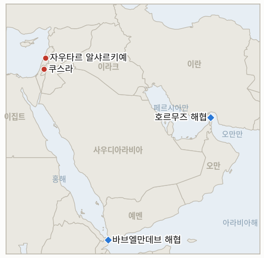

# 중동 일일 브리핑

**2026년 8월 13일**

- **보고 대상 기간:** 약 24시간, 8월 12일 09:00 ~ 8월 13일 09:00 (한국시간)
- **종합 평가:** 수요일은 호르무즈를 둘러싼 외교적 낙관론과 실제 통항 현실 사이의 간극이 더욱 벌어진 하루였고, 동시에 홍해 해상전은 새로운 선을 넘었다. 파키스탄 국방장관은 블룸버그에 미국과 이란이 "일종의 합의"에 근접했다고 밝혔고, 파키스탄 내무장관도 테헤란에서 이란 지도부를 만났지만, 이란 최고국가안보회의의 기존 입장, 즉 "미국이 태도를 바꾸기 전까지" 해협을 재개방하지 않겠다는 사무총장(교체 전 인물이지만 강경파 후임 모흐센 레자에이도 이를 철회하지 않았다)의 입장은 달라지지 않았고, Kpler 데이터에 따르면 화요일 해협을 통과한 선박은 단 8척으로, 전쟁 전 하루 130~140척에 크게 못 미치는 주간 최저치를 기록했다. 미 중부사령부의 봉쇄 집계는 우회 선박 59척으로 늘었다. IEA는 이 교착 상태의 위험을 한층 강조하며 재고 완충 능력이 "빠르게 고갈되고 있다"고 경고했다. 미국의 원유 재고는 40여 년 만에 처음으로 3억 배럴 아래로 떨어졌고, 세계 관측 재고량도 2025년 4월 이후 처음으로 79억 배럴 아래로 내려갔다. 그럼에도 브렌트유와 WTI는 거의 변동 없이 마감했다. 한편 홍해의 후티 해상 작전은 이 원장이 이전까지 기록한 적 없는 새로운 전술로 확대됐다. 바브엘만데브 해협에서 화물선 티하마호에 가해진 이중 타격으로, 첫 미사일이 선원 4명을 숨지게 한 뒤 몇 분 뒤 두 번째 미사일이 구조 작업 자체를 노려 예멘인 구조대원 2명을 추가로 숨지게 해 총 사망자 6명, 부상자 10명이 발생했다. 파키스탄 외교장관과 인도네시아 정부는 몇 시간 만에 이 공격을 공식 규탄했고, 이로써 IND-20260812-3이 시한을 훨씬 앞당겨 confirm됐다. 서안지구에서는 팔레스타인 가옥을 포위한 정착민을 해산시키려던 이례적인 이스라엘군 개입이 실패로 끝났는데, 같은 날 유엔 부특별조정관은 안전보장이사회에서 이 지역이 "한계점"에 이르렀다며 올해 팔레스타인인 76명이 숨지고 3,800명이 쫓겨났다고 밝혔다. 레바논 남부에서는 휴전 속에서도 추가 철거가 이어져, 이스라엘군이 자우타르 알샤르키예에서 학교와 보건소, 어린이집, 주택을 파괴하고 아슈라 추모 행사장을 타격해 레바논 정부로부터 "조직적 파괴"라는 공식 항의를 받았다. 코스피는 이번 분쟁과 무관한 외국인 주도 반도체 랠리에 힘입어 3.68% 급등해 사상 최고치인 6,579.04를 기록했고, 원화도 사흘 연속 강세를 이어가며 1,412.6원에 마감했다.

**정정 및 업데이트:** 8월 12일 브리핑(§1.4)은 바브엘만데브 공격을 사우디 국영매체 알하다스 단일 출처로 파키스탄인 2명, 인도네시아인 1명이 숨진 것으로 보도하며 **신뢰도: 중간**으로 표기했다. 이번 보고 기간에 나온 더 폭넓은 다수 매체 보도는 이를 상당 부분 수정한다. 선박은 이집트 소유(일부 매체는 탄자니아 국적으로 보도)의 화물선 티하마호이며 식량을 싣고 있었다. 첫 미사일 공격으로 숨진 선원은 3명이 아니라 4명(파키스탄인 3명, 인도네시아인 1명)이었고, 이전까지 보도되지 않았던 두 번째 미사일 공격이 구조 작업 자체를 겨냥해 예멘 국민저항군(NRF) 대원 2명을 추가로 숨지게 해 확인된 사망자는 총 6명, 부상자는 10명으로 늘었다. 아래 §1.1의 정정된 내용을 참조하라. 이제 **신뢰도: 높음**으로 표기한다.

---

## 1. 무슨 일이 있었나

<figure style="float:right; width:46%; margin:2pt 0 8pt 14pt;">

<figcaption style="font-size:8pt; color:#666; text-align:center; margin-top:3pt; font-style:italic;">주요 논의 지점</figcaption>
</figure>

### 1.1 후티의 이중 타격으로 화물선 티하마호에서 6명 사망, 공식 규탄 잇따라

후티 세력은 식량을 싣고 바브엘만데브 해협을 지나던 이집트 소유 화물선 티하마호에 탄도미사일 3발을 발사했다. 첫 타격으로 선원 4명, 파키스탄인 3명과 인도네시아인 1명이 숨졌다. 이어 예멘 국민저항군(NRF) 대원들이 생존자 구조를 위해 도착하자 두 번째 미사일이 구조 작업 자체를 직접 타격해 대응 요원 2명이 추가로 숨졌고, 확인된 사망자는 총 6명, 부상자는 10명에 이른다([알자지라](https://www.aljazeera.com/news/2026/8/12/six-killed-in-houthi-attack-on-bab-al-mandeb-ship-yemens-government-says); [CNBC](https://www.cnbc.com/2026/08/12/us-iran-war-trump-hormuz-houthi-attack-blockade-.html); [타임스오브이스라엘](https://www.timesofisrael.com/three-killed-in-houthi-attack-on-cargo-ship-in-bab-el-mandeb-strait/amp/)). 예멘 정부는 이를 미국과 이스라엘이 2월 28일 이란과의 전쟁을 시작한 이래 상선을 겨냥한 첫 치명적 공격이라고 밝혔다. 후티 계열 매체는 이 선박이 사우디 군수물자를 싣고 있었다고 주장했지만 다른 곳에서는 확인되지 않았다. 몇 시간 뒤 파키스탄 부총리 겸 외무장관 이샤크 다르는 이번 공격이 "무고한 생명"을 위협하고 "국제법"을 위반했다고 공식 규탄했으며, 인도네시아 정부도 이번 공격을 지역 안정에 대한 위협으로 규정하며 자체적으로 규탄 성명을 냈다([Aaj English](https://english.aaj.tv/news/330467520/dar-condemns-houthi-attack-that-killed-three-pak-nationals-in-red-sea); [안타라](https://en.antaranews.com/news/423919/indonesia-condemns-red-sea-attacks-on-oil-tankers)). 이들 성명은 이 공격이 제3국의 외교적 대응을 이끌어낼지를 추적하던 이 원장의 지표(IND-20260812-3)를 8월 26일 시한보다 14일이나 앞당겨 확증시켰다. **신뢰도: 높음** (사망자 수, 공격 전술, 양국의 규탄 성명, 1~2등급, 다수 매체, 공식 발언); 선박이 사우디 군수물자를 싣고 있었다는 후티 계열 매체의 주장은 **신뢰도: 낮음** (단일 출처, 교차 확인 없음).

### 1.2 파키스탄의 중재, 이란의 변함없는 조건과 맞물리며 호르무즈 통항량 주간 최저치로

파키스탄 국방장관 코와자 아시프는 블룸버그에 "평화 합의 쪽으로 다시 상황이 형성되고 있다"며 미국과 이란이 호르무즈 관련 "일종의 합의"에 근접했다고 말했다. 파키스탄 내무장관 모신 나크비는 테헤란에서 이란 지도부를 만났으며, 이슬라마바드는 스스로 8월 16일을 셔틀외교를 합의로 전환할 시한으로 정했다([익스프레스트리뷴](https://tribune.com.pk/story/2623327/us-iran-close-on-some-sort-of-arrangement-on-hormuz-defence-minister-khawaja-asif); [블룸버그](https://www.bloomberg.com/news/articles/2026-08-11/pakistan-said-us-iran-are-close-to-some-arrangement-on-peace); [더내셔널](https://www.thenationalnews.com/news/gulf/2026/08/12/pakistan-makes-final-truce-push-as-us-iran-deadline-looms/)). 그러나 이란의 입장은 달라지지 않았다. 최고국가안보회의의 기존 입장, 교체 전 사무총장 모하마드 바게르 졸가드르가 밝혔고 강경파 후임 모흐센 레자에이도 철회하지 않은 그 입장은, 워싱턴이 군사적 위협을 중단하고 해상 봉쇄를 해제하며 병력을 철수하고 배상금을 지급하고 제재를 해제하고 동결자산을 반환할 때까지 해협을 "재개방하지 않겠다"는 것이다. 이런 가운데 로이터가 인용한 Kpler 데이터에 따르면 화요일 호르무즈를 통과한 선박은 단 8척으로, 최근 10일 평균 약 12척보다 낮은 주간 최저치이며 전쟁 전 하루 130~140척에 크게 못 미친다([알자지라](https://www.aljazeera.com/news/2026/8/12/as-strait-of-hormuz-transit-drops-trump-again-says-us-has-control)). 중부사령부는 봉쇄 아래 지금까지 상선 59척을 우회시켰고 3척을 무력화, 2척을 승선 검색했다고 밝혔는데, 이는 화요일 집계였던 55척 우회에서 늘어난 수치다. 트럼프 대통령은 별도로 트루스소셜에 미국이 여전히 해협을 "완전히 통제"하고 있다고 재차 주장했다. **신뢰도: 높음** (아시프의 발언, 통항량, 봉쇄 집계, 1~2등급, 블룸버그, Kpler 기반, 중부사령부); 파키스탄의 중재가 실질적 진전인지 여부는 **신뢰도: 중간** (이란의 공개 조건이 달라지지 않았고, 이 원장이 기록해온 유사한 "합의 임박" 표현이 실제 합의로 이어지지 않은 전례가 있기 때문).

### 1.3 IEA, 세계 원유 재고 급속 고갈 경고에도 호르무즈는 여전히 막혀 있어

국제에너지기구(IEA)는 2026년 세계 원유 공급 전망을 하향 조정하며 "연말까지는 시장이 공급 과잉으로 돌아설 것으로 예상되지만, 위험은 여전히 상당하며 이전까지 확보돼 있던 재고 완충 능력이 빠르게 고갈되면서 해협 재개방의 시급성이 커지고 있다"고 경고했다. 2026년 수요는 하루 160만 배럴 감소할 것으로 전망했는데, 이는 지난 7월 전망치보다 하루 51만 배럴 더 큰 폭이다([CNBC](https://www.cnbc.com/2026/08/12/iea-oil-demand-hormuz.html); [비즈니스스탠더드](https://www.business-standard.com/world-news/iea-slashes-2026-supply-forecast-as-hormuz-reopening-remains-elusive-126081201584_1.html)). 미국의 원유 재고는 3억 배럴 아래로 떨어져 40여 년 만에 최저 수준을 기록했고, 세계 관측 재고량도 7월 들어 79억 배럴 아래로 내려가 2025년 4월 이후 처음이다. 이는 3월과 4월에 시작된 약 4억 배럴 규모의 IEA 회원국 공동 비축유 방출 이후 계속된 재고 감소의 결과다. 그럼에도 브렌트유는 배럴당 88.98달러(+0.07달러), WTI는 83.27달러(+0.07달러)로 거의 변동 없이 마감했는데, 이는 재고 문제가 아직 임박한 공급 부족으로 시장에 반영되지 않았음을 시사하는 미미한 반응이다. **신뢰도: 높음** (IEA의 전망 수정치와 재고 수치, 1등급, IEA 데이터, 다수 매체); **신뢰도: 높음** (마감 유가, 1~2등급, 시장 통신 보도).

### 1.4 이스라엘군, 쿠스라 정착민 전초기지 철거 실패…유엔은 한계점 경고

이스라엘군은 수요일 나흘 전 팔레스타인 가옥 3채 바로 앞에 세워진 전초기지에서 정착민을 해산시키려다 충돌했으나, 정착민을 몰아내는 데 실패하고 철수했다. 목격자들에 따르면 군은 천막 한 곳의 덮개만 제거한 뒤 현장을 떠났고, 그 뒤 정착민들은 포위된 가옥 한 곳의 대문을 부수려 시도했다([알모니터](https://www.al-monitor.com/originals/2026/08/israeli-troops-clash-settlers-besieging-palestinian-homes-west-bank); [프랑스24](https://www.france24.com/en/middle-east/20260812-israeli-settlers-keep-up-siege-of-palestinian-homes-despite-rare-military-intervention); [하아레츠](https://www.haaretz.com/israel-news/israel-security/2026-08-12/ty-article/.premium/idf-clashes-with-settlers-as-it-tries-to-clear-outpost-from-palestinians-yard/0000019f-f4c6-d28e-a3df-f4d693610000)). 포위된 가옥 중 한 곳에 거주하는 주민 아이샤 하산은 정착민들이 "대문을 부수려 했고" "돌을 던지며 욕설과 모욕을 퍼부었다"고 말하며, 전초기지가 세워진 이후 가족이 사실상 갇혀 있었다고 전했다. 같은 날 유엔 중동평화프로세스 부특별조정관 라미즈 알라크바로프는 안전보장이사회에서 서안지구가 "한계점"에 이르렀다고 밝히며, 2026년 한 해 동안 팔레스타인인 76명(그중 미성년자 18명)이 숨졌고 정착민 폭력과 철거, 강제퇴거로 3,800명이 쫓겨났으며, 260여 개 팔레스타인 공동체에 영향을 미친 정착민 폭력 사건이 1,430건을 넘어섰고, 처음으로 A구역 내에서도 명시적으로 토지가 몰수됐다고 밝혔다([알자지라](https://www.aljazeera.com/news/2026/8/12/israeli-raids-demolitions-continue-as-un-warns-west-bank-at-breaking-point); [아랍뉴스](https://www.arabnews.com/node/2654292/middle-east)). **신뢰도: 높음** (쿠스라 충돌과 그 결과, 1~2등급, 다수 매체, 목격자 진술); **신뢰도: 높음** (알라크바로프의 안전보장이사회 발언 수치, 1등급, 유엔 브리핑, 다수 매체 교차 확인).

### 1.5 이스라엘, 레바논 남부에서 학교·진료소·주택 철거…휴전에도 공식 항의 받아

이스라엘군은 수요일 새벽 자우타르 알샤르키예(동부 자우타르) 중심부의 4층짜리 셰이크 나임 마흐디 학교를 폭파했으며, 마을 청사와 보건소, 어린이집, 여러 주택도 함께 파괴했다. 별도로 와디 알살루키 도로를 따라 툴린 계곡 일대에서도 폭파 작업이 이뤄졌다. 이스라엘 드론은 카프라알아시 도로에서 아슈라 추모 행사가 열리던 장소도 타격해 여러 명이 부상했다([미들이스트모니터](https://www.middleeastmonitor.com/20260812-israel-blows-up-school-strikes-religious-commemoration-site-in-southern-lebanon-despite-truce/); [TRT월드](https://www.trtworld.com/article/38aa3d7f5299); [로리앙투데이](https://today.lorientlejour.com/article/1476941/1-killed-in-israeli-strike-near-sour-school-building-demolished-by-israel-in-aita-al-shaab.html)). 수르 인근에서 발생한 별도의 이스라엘 타격으로 1명이 숨진 것으로 보도됐으며, 이스라엘군은 아이타 알샤압에서도 학교 건물을 철거했다. 레바논 정부는 이스라엘의 파괴 행위를 "조직적"이라고 규정하며 공식 규탄했고, 레바논군(LAF)은 이스라엘의 이러한 행위가 시범 구역에서의 군 작전 수행과 남부 주민들의 귀환을 지속적으로 방해하고 있다고 밝혔다([아랍뉴스](https://www.arabnews.com/node/2654432/middle-east)). **신뢰도: 높음** (철거와 레바논 정부의 규탄, 1~2등급, 아랍뉴스를 포함한 다수 매체); **신뢰도: 중간** (수르 인근 사망자 1명 보고, 철거 자체에 비해 교차 확인이 부족).

---

## 2. 심층 분석: 동기와 이해관계

### 2.1 후티는 왜 첫 타격에 그치지 않고 구조대까지 겨냥한 이중 타격을 감행했나?

구조 작업 자체를 타격하는 것은 후티의 승인 없이 이 해협을 통과하는 모든 선박에 가할 수 있는 대가를 극대화하는 방법이기 때문이다. 생존자를 돕는 행위조차 위험을 수반한다는 신호를 보내는 동시에, 이 조직의 표적 선정이 구조대 공격을 금하는 전쟁법 규범에 얽매이지 않는다는 것을 보여준다. 이러한 규범 파괴는 후티 내부적으로나 핵심 후원 세력과의 관계에서 큰 대가를 치르지 않으면서도, 남아 있는 모든 홍해 통항의 보험료와 승선 위험 프리미엄을 크게 끌어올린다. 이는 자체 해군을 보유하지 못한 비국가 행위자가 세계 해운에 압박을 가할 수 있는 몇 안 되는 방법 중 하나다.

### 2.2 파키스탄은 왜 이란 최고국가안보회의의 입장이 달라지지 않았는데도 미국과 이란이 합의에 가깝다고 공개적으로 주장했나?

이슬라마바드는 워싱턴이나 테헤란과는 다른 이해관계를 갖고 있기 때문이다. 파키스탄 국적 및 파키스탄인 선원이 탄 선박이 이 항로에서 계속 사상자를 내는 상황에서, 양측을 "합의 쪽으로 다시 형성되고 있다"는 방향으로 이끄는 중재자는 실제로 간극, 즉 이란의 광범위한 조건과 워싱턴이 고수하는 통행료·기뢰 제거 위주의 좁은 틀 사이의 간극이 좁혀지지 않았더라도, 대화를 성사시켰다는 사실만으로 외교적 성과와 국내 정치적 자산을 챙길 수 있다. 따라서 아시프의 낙관적인 표현은 실제 협상 내용을 그대로 반영한다기보다, 동력을 만들어내기 위한 그럴듯한 협상 전술로 볼 수 있다.

### 2.3 IEA는 왜 브렌트유와 WTI가 거의 반응하지 않았는데도 재고 경고 수위를 높였나?

IEA의 임무는 시장을 직접 움직이는 것이 아니라 구조적 위험이 실제 가격 충격으로 번지기 전에 미리 경고하는 것이기 때문이다. 지난 다섯 달 동안 지속적인 공급 부족 없이 호르무즈 관련 헤드라인을 계속 흡수해온 시장은 "물리적 희소성"보다는 "전쟁 프리미엄에 따른 변동성"으로 이를 받아들였을 가능성이 크다. 이 때문에 재고 완충 능력이 실질적 제약 수준으로 얇아지고 있다는 IEA의 경고와, 비축유 방출과 수요 파괴가 당분간 그 간극을 계속 메울 것이라는 트레이더들의 판단 사이에 간극이 존재한다. 만약 IEA가 설명하는 재고 감소가 호르무즈 문제 해결 없이 계속된다면 이 간극은 갑작스럽게 좁혀질 수 있다.

### 2.4 유엔 자체 통계가 보여주는 미집행 패턴에도 불구하고 이스라엘군은 왜 쿠스라에서 정착민에게 개입했나?

드물게라도 눈에 띄는 군사적 개입은, 설령 실패로 끝나더라도, 수요일 유엔 안전보장이사회 브리핑과 같은 국제적 압박에 직면했을 때 이스라엘 정부가 집행 조치를 취했다고 내세울 수 있게 해준다. 반면 정착민 전초기지에 대한 근본적인 정책 전환은 필요하지 않다. 유엔 자체의 사상자·강제퇴거 통계가 보여주듯 그 정책은 바뀌지 않았다. 특히 전초기지 철거에 실패한 방식, 즉 군이 천막 덮개 하나만 제거하고 철수한 방식은 포위 상태를 실제로 끝내려는 진지한 시도라기보다, 정착민과의 충돌을 피하는 선에서 멈추도록 계산된 개입의 모양새를 보여준다는 인상을 준다.

### 2.5 이스라엘은 왜 활성 휴전 중에 학교와 보건소까지 포함한 레바논 남부 철거를 확대했나?

헤즈볼라의 복귀를 지원할 수 있는 기반시설을 파괴하는 것은, 이스라엘의 표현대로 민군 겸용 구조물을 무력화하는 것으로 프레이밍되며, 이스라엘군이 휴전의 핵심 조항을 더 눈에 띄게 위반할 만한 새로운 타격 없이도 시범 구역 내에서 헤즈볼라의 작전 환경을 계속 악화시킬 수 있게 해준다. 다만 일반 주민에게 미치는 실질적 효과, 즉 학교와 보건소, 어린이집을 잃는 것은 실제 공격과 다르지 않으며, 이는 레바논 정부의 "조직적 파괴" 프레이밍에 로마 트랙 다음 회의에서 내세울 더 확실한 사실적 근거를 제공한다.

---

## 3. 한국에 대한 정책적 함의

### 3.1 익스포저 현황

| 항목 | 현재 수치 | 출처 |
| --- | --- | --- |
| 원유 수입 중 중동 비중 | 48.5%(2026년 5~7월)로, 1년 전 69.1%에서 하락; 비중동 비중이 사상 처음으로 50%를 넘어섬 | KNOC, 아시아경제 경유; `korea-exposure.md` |
| 7~8월 원유 도입 | 전년 동기 대비 110%+ 확보(산업통상자원부, 7월 21일); 비축유 스와프 8월까지 연장, 현재까지 약 2,100만 배럴 스와프 | 산업통상자원부, 헤럴드경제·한경 경유; `korea-exposure.md` |
| 9월 원유 도입 | 90%+ 확보(산업통상자원부, 7월 21일) | 산업통상자원부, 헤럴드경제 경유; `korea-exposure.md` |
| 홍해 우회 항로 | 한국행 원유 화물 14척 이상이 홍해·얀부 우회 항로 이용 중, 얀부(사우디 선적)와 바브엘만데브(이번 전쟁 최초의 이중 타격 및 구조대 공격 발생 지점) 양쪽 모두에서 위험 노출 | 해양수산부, 통신사 보도 경유; `korea-exposure.md` |
| 전략비축유 커버리지 | 실제 소비량 기준 약 26일분(추정); 스와프는 즉시 대기 상태이나 대규모 실전 검증 안 됨 | CSIS; 산업통상자원부 7월 27일 |
| 정유사 사우디 지분 노출 | S-Oil(사우디 아람코 지분 약 63%), HD현대오일뱅크(아람코 지분 약 17%) | 공시자료; `korea-exposure.md` |
| 브렌트유/WTI | 마감 88.98달러(+0.07달러)/83.27달러(+0.07달러), IEA의 재고 경고에도 거의 변동 없음 | CNBC |
| 코스피/원달러 환율 | 마감 6,579.04(+3.68%, 사상 최고치), 이번 분쟁과 무관한 외국인 주도 반도체 랠리; 원화는 사흘 연속 강세로 1,412.6원 | 비즈니스코리아, 이투데이, 뉴시스 |
| 호르무즈 통항량 | 8척, 8월 11일 화요일, 최근 10일 평균 약 12척 대비 주간 최저치 | Kpler, 알자지라 경유 |

### 3.2 사안별 함의

**바브엘만데브 이중 타격과 그에 대한 파키스탄·인도네시아의 신속한 공식 규탄(IND-20260812-3 확증)은 홍해 항로의 위험이 단순한 해운·보험 문제를 넘어, 피격 선박의 구조 작업 자체가 표적이 되는 단계로 넘어갔음을 보여준다. 이는 한국의 얀부 경유 화물과 그 선원들이 항로 변경만으로는 헤지하기 훨씬 더 어려워진 위험이다.** 신규 지표 IND-20260813-2(시한 9월 2일)는 이중 타격 전술이 반복되는지 여부를 추적한다.

**파키스탄의 "합의 근접" 표현이 이란 최고국가안보회의의 변함없는 조건, 그리고 호르무즈 통항량의 8척 주간 최저치 하락과 맞물려 있는 만큼, 한국 정유사들은 임박한 재개방보다는 여전히 교착된 기준선을 중심으로 계획을 세워야 한다. 중부사령부의 봉쇄 집계 상승(우회 59척)은 통항 회복이 아니라 집행이 여전히 실질적 현실임을 확인해준다.** IND-20260808-2(하메네이 승인, 시한 8월 15일), IND-20260809-1(최고국가안보회의 균열 테스트, 시한 8월 16일), IND-20260810-1(축소된 메커니즘, 시한 8월 20일)이 파키스탄의 낙관론이 실제 합의로 전환되는지를 계속 추적한다.

**IEA의 미국 및 세계 원유 재고 급속 고갈 경고는 수요일의 보합권 마감 유가가 시사하는 것보다 한국 에너지 담당자들에게 훨씬 직접적인 신호다. 현재 가격 급등 없이 재고 감소를 흡수하고 있는 시장은, IEA가 설명하는 완충 능력이 실제로 얇아지면 급격히 재평가될 수 있다. 한국의 전략비축유 스와프와 확보된 도입 물량은 이런 시나리오를 대비해 설계됐지만 아직 실전 검증을 거치지 않았다.** 신규 지표 IND-20260813-1(시한 9월 2일)은 이 고갈 경고가 추가적인 정책 대응이나 지속적인 가격 상승으로 이어지는지를 추적한다.

**쿠스라 전초기지 대치나 레바논 남부의 철거 물결 모두 직접적인 한국 시장 노출은 없지만, 두 사례 모두 이스라엘의 다른 전선인 서안지구와 레바논이 호르무즈·홍해 교착과 별개가 아니라 병행해 악화되고 있음을 보여준다. 한국의 리스크 모델은 이러한 광범위한 지역 불안정 배경을 좁은 에너지 통로 지표와 함께 계속 반영해야 한다.** 신규 지표 IND-20260813-3(시한 8월 27일)은 쿠스라 전초기지가 철거되는지, 아니면 그대로 남는지를 추적한다.

**검증 가능한 지표:**

- **IND-20260813-1** — IEA의 세계 원유 재고 급속 고갈 경고가 추가적인 정책 대응으로 이어지거나, 시장이 별도 대응 없이 재고 감소를 계속 흡수한다. 약 2026년 9월 2일까지 IEA 회원국의 새로운 공동 비축유 방출 발표가 나오거나 브렌트유가 3거래일 이상 연속으로 95달러를 넘어서면, 재고 고갈이 실질적인 단기 제약이 됐음을 확증한다. 같은 시한까지 그런 방출이 없고 95달러를 넘는 지속적 상승도 없다면, 시장이 이 경고를 여전히 관리 가능한 수준으로 받아들이고 있음을 반증한다.
- **IND-20260813-2** — 티하마호 구조 작업을 노린 후티의 이중 타격 전술이 이후 홍해 또는 바브엘만데브 공격에서 반복되거나, 일회성 확전으로 그친다. 약 2026년 9월 2일까지 첫 타격 이후 구조대나 초기 대응 요원을 노린 두 번째 이중 타격이 해당 항로에서 확인되면 이를 의도적이고 반복적인 방식으로 확증한다. 같은 시한까지 추가적인 이중 타격이 확인되지 않으면, 새로운 상시적 패턴이 아니라 일회성 전술적 선택이었음을 반증한다.
- **IND-20260813-3** — 쿠스라에서 팔레스타인 가옥을 포위한 정착민 전초기지가 이스라엘 당국에 의해 철거되거나, 수요일의 군사 개입 실패에도 불구하고 포위 상태가 지속된다. 약 2026년 8월 27일까지 전초기지 시설이 실제로 철거되고 포위가 종료된 것이 확인되면, 개입 이후 결국 집행이 뒤따랐음을 확증한다. 같은 시한까지 전초기지나 포위 상태가 그대로 남아 있다면, 유엔이 지적한 "한계점" 수준의 미집행 패턴이 계속되고 있음을 반증한다.

---

## 4. 관찰 목록

- **후티의 이중 타격 전술이 반복되는지, 일회성 확전에 그치는지 여부** (IND-20260813-2, 시한 9월 2일)
- **IEA의 재고 고갈 경고가 추가 정책 대응이나 지속적 가격 상승으로 이어지는지 여부** (IND-20260813-1, 시한 9월 2일)
- **쿠스라 정착민 전초기지가 철거되는지, 포위가 계속되는지 여부** (IND-20260813-3, 시한 8월 27일)
- **하메네이 또는 레자에이 체제의 이란 최고국가안보회의가 결국 어떤 형태로든 호르무즈 프레임워크를 공식 승인하는지 여부** (IND-20260808-2, 시한 8월 15일)
- **이란 최고국가안보회의의 요구가 워싱턴을 군사행동 재개로 밀어붙이는지, 아니면 파키스탄의 중재가 축소된 합의를 이끌어내는지 여부** (IND-20260809-1, 시한 8월 16일)
- **축소되거나 수정된 이란-오만 호르무즈 메커니즘이 공개 발표되고 수용되는지 여부** (IND-20260810-1, 시한 8월 20일)
- **이란의 강경파 안보 개편이 호르무즈 외교를 계속 정체시키는지, 이란-오만 트랙이 그래도 타결되는지 여부** (IND-20260811-1, 시한 8월 18일)
- **마리브·하드라마우트에 대한 후티의 지상 공세가 지속적 작전으로 이어지는지 여부** (IND-20260807-1, 확증 추세, 시한 8월 14일)
- **예멘 정부군-후티 전쟁이 지속적인 전면전으로 확대되는지, 제한적 교전으로 되돌아가는지 여부** (IND-20260809-3, 확증 추세, 시한 8월 16일)
- **마즈달 준 폭발이 헤즈볼라의 개조로 확인되는지, 오래된 불발탄으로 확인되는지 여부** (IND-20260811-2, 시한 8월 25일)
- **타이베를 비거주자에게 봉쇄한 조치가 정착민 공격을 줄이는지, 폭력이 계속되는지 여부** (IND-20260811-3, 시한 8월 18일)
- **미 해군의 벨라 노바호 무력화가 이란의 군사적 대응을 이끌어내는지 여부** (IND-20260812-1, 시한 8월 26일)
- **시리아의 핵물질 문제가 IAEA와의 최종 합의 및 검증된 반출로 이어지는지 여부** (IND-20260812-2, 시한 9월 11일)
- **가자 무장해제 선행 프레임워크가 어떤 형태로든 이스라엘 안보내각의 공식 표결에 이르는지 여부** (IND-20260812-4, 시한 8월 26일)
- **사우디아라비아가 자잔 정유시설 공격이나 추가 후티 공격에 직접 보복하는지 여부** (IND-20260810-3, 시한 8월 17일)
- **사우디아라비아가 경고한 후티-이라크 민병대 협공이 실제 양면 공격으로 실현되는지 여부** (IND-20260808-1, 시한 8월 15일)
- **레바논 남부의 활성 교전 국면이 로마 외교 트랙의 9월 1일 예정 회의와 평행선을 달리는지, 이를 탈선시키는지 여부** (IND-20260807-2, 시한 9월 1일)
- **특정 걸프 국가가 해협 안보와 연계된 구체적인 달러 표시 대미 투자 패키지를 발표하는지 여부** (IND-20260715-2, 시한 8월 14일)
- **다미에타 공격의 책임 소재가 공식적으로 규명되는지 여부** (IND-20260801-3, 시한 8월 14일)
- **케슘섬 폭발이 실제 공격으로 확인되는지, 오경보로 결론 나는지 여부**

---

## 5. 출처 신뢰도 요약

| 주장 | 출처 | 신뢰도 |
| --- | --- | --- |
| 후티의 이중 타격으로 화물선 티하마호에서 6명(선원 4명, 구조대원 2명) 사망, 10명 부상 | 알자지라, CNBC, 타임스오브이스라엘 (1~2등급, 다수 매체) | 높음 |
| 파키스탄과 인도네시아가 공식 규탄, IND-20260812-3 확증 | Aaj English(다르 발언), 안타라 (1~2등급, 공식 정부 발언) | 높음 |
| 파키스탄 코와자 아시프, 미국과 이란이 호르무즈 관련 "일종의 합의"에 근접 | 블룸버그, 익스프레스트리뷴, 더내셔널 (1~2등급, 공식 발언) | 높음 |
| 화요일 호르무즈 통항 단 8척, 10일 평균 약 12척 대비 주간 최저치 | Kpler, 알자지라 경유 (1~2등급, 데이터 제공사, 다수 매체) | 높음 |
| 중부사령부: 봉쇄 아래 59척 우회, 3척 무력화, 2척 승선 검색 | 중부사령부 공식 발표 (1등급, 공식) | 높음 |
| IEA, 2026년 공급 전망 하향 조정하며 원유 재고 완충 능력 "빠르게 고갈" 경고; 미국 원유 재고 3억 배럴 아래로, 40여 년 만에 최저 | CNBC, 비즈니스스탠더드 (1등급, IEA 데이터, 다수 매체) | 높음 |
| 브렌트유 88.98달러(+0.07달러), WTI 83.27달러(+0.07달러) 마감 | CNBC (1~2등급, 시장 통신 보도) | 높음 |
| 이스라엘군, 쿠스라에서 팔레스타인 가옥을 포위한 정착민 전초기지 철거 실패 | 알모니터, 프랑스24, 하아레츠 (1~2등급, 다수 매체, 목격자 증언) | 높음 |
| 유엔 알라크바로프: 서안지구 "한계점", 76명 사망, 3,800명 강제퇴거, 정착민 폭력 1,430건 이상(2026년) | 알자지라, 아랍뉴스, 유엔 브리핑 기록 (1등급, 공식 유엔 발표, 다수 매체) | 높음 |
| 이스라엘, 자우타르 알샤르키예에서 학교·진료소·어린이집·주택 철거, 아슈라 행사장 타격 | 미들이스트모니터, TRT월드, 로리앙투데이, 아랍뉴스 (1~2등급, 다수 매체) | 높음 |
| 레바논 정부와 레바논군, 철거를 "조직적"이라며 공식 규탄 | 아랍뉴스 (1~2등급, 공식 발언) | 높음 |
| 코스피 +3.68% 사상 최고치 6,579.04 마감(외국인 반도체 매수 주도); 원화 1,412.6원으로 강세 | 비즈니스코리아, 이투데이 (1~2등급, 한국 경제지) | 높음 |
| 한국의 중동산 원유 수입 비중 48.5%로 하락(2026년 5~7월), 비중동 비중 사상 첫 50% 초과 | KNOC 데이터, 아시아경제 경유; `korea-exposure.md` | 중상 |
