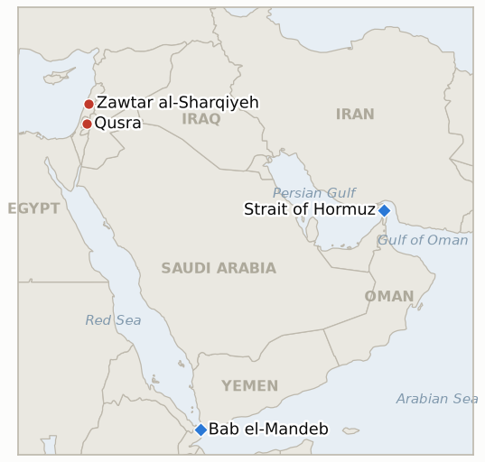

# Middle East Daily Briefing

**August 13, 2026**

- **Reporting window:** ~24 hours, August 12, 09:00 to August 13, 09:00 KST
- **Overall assessment:** Wednesday sharpened the gap between Hormuz's diplomatic optimism and its physical reality while the Red Sea's maritime war crossed a new line. Pakistan's defense minister told Bloomberg the US and Iran are close to "some sort of an arrangement," and Islamabad's own interior minister met Iranian leadership in Tehran, but Iran's hardline Supreme National Security Council secretary's standing position, that the strait stays shut "until America corrects its behavior," has not moved, and Kpler data showed just eight vessels transiting Tuesday, a one-week low far below the 130-to-140-ship pre-war rate; CENTCOM's blockade tally ticked up to 59 vessels redirected. The IEA sharpened the stakes on that stalemate, warning inventory buffers are "rapidly depleting," with US crude stockpiles below 300 million barrels for the first time in more than four decades and global observed inventories below 7.9 billion barrels for the first time since April 2025, even as Brent and WTI both settled essentially flat. The Red Sea's Houthi campaign, meanwhile, escalated to a tactic this ledger has not previously recorded: a double-tap strike on the cargo ship Tihamah in Bab el-Mandeb that killed four crew members in its first missile, then killed two more Yemeni rescuers in a second strike minutes later, six dead and ten wounded in total; Pakistan's foreign minister and Indonesia both formally condemned the attack within hours, confirming IND-20260812-3 well ahead of its deadline. In the West Bank, a rare Israeli military intervention against settlers besieging Palestinian homes in Qusra failed to clear the outpost, the same day a UN deputy coordinator told the Security Council the territory is at "breaking point," citing 76 Palestinians killed and 3,800 displaced this year. South Lebanon absorbed a further ceasefire-era demolition wave, Israeli forces destroying a school, a health clinic, a nursery and homes in Zawtar al-Sharqiyeh and striking a site marking Ashura, drawing a formal Lebanese government protest over what Beirut called systematic destruction. KOSPI surged 3.68% to a record 6,579.04 on a foreign-led semiconductor rally unrelated to the regional conflict, while the won firmed for a third straight session to 1,412.6.

**Corrections and updates:** The August 12 brief (§1.4) reported the Bab el-Mandeb strike on Monday's window as killing two Pakistani and one Indonesian crew member, single-sourced to Saudi state media Al Hadath, at "Confidence: Medium." Fuller, multi-outlet reporting that emerged in this window revises that account materially: the vessel is identified as the Egyptian-owned (Tanzania-flagged, per some outlets) cargo ship Tihamah carrying food; the first missile strike killed four crew, three Pakistani nationals and one Indonesian, not three; and a previously unreported second missile strike, a double-tap targeting the rescue operation, killed two Yemeni National Resistance Forces personnel, raising the confirmed toll to six dead and ten wounded. See §1.1 below for the corrected, now multiply-sourced account, now carried at "Confidence: High."

---

## 1. What Happened

<figure style="float:right; width:46%; margin:2pt 0 8pt 14pt;">

<figcaption style="font-size:8pt; color:#666; text-align:center; margin-top:3pt; font-style:italic;">Major places of discussion</figcaption>
</figure>

### 1.1 A Houthi Double Tap Strike Kills Six on the Cargo Ship Tihamah, Drawing Formal Condemnation

Houthi forces fired three ballistic missiles at the Egyptian-owned cargo vessel Tihamah, carrying food through Bab el-Mandeb, killing four crew members, three Pakistani nationals and one Indonesian, in the initial strike; when Yemeni National Resistance Forces personnel arrived to rescue survivors, a second missile strike hit the rescue operation directly, killing two more responders, for a confirmed toll of six dead and ten wounded ([Al Jazeera](https://www.aljazeera.com/news/2026/8/12/six-killed-in-houthi-attack-on-bab-al-mandeb-ship-yemens-government-says); [CNBC](https://www.cnbc.com/2026/08/12/us-iran-war-trump-hormuz-houthi-attack-blockade-.html); [Times of Israel](https://www.timesofisrael.com/three-killed-in-houthi-attack-on-cargo-ship-in-bab-el-mandeb-strait/amp/)). Yemen's government called it the first fatal attack on commercial shipping since the US and Israel launched the war on Iran on February 28; a Houthi-aligned outlet claimed the ship carried Saudi military equipment, a claim not corroborated elsewhere. Within hours, Pakistan's Deputy Prime Minister and Foreign Minister Ishaq Dar formally condemned the strike as endangering "innocent lives" and violating "international law," and Indonesia's government issued its own condemnation, calling the attacks a threat to regional stability ([Aaj English](https://english.aaj.tv/news/330467520/dar-condemns-houthi-attack-that-killed-three-pak-nationals-in-red-sea); [Antara](https://en.antaranews.com/news/423919/indonesia-condemns-red-sea-attacks-on-oil-tankers)). Those statements confirm IND-20260812-3 (this ledger's indicator testing whether the strike would draw a third-country diplomatic response) fourteen days ahead of its August 26 deadline. **Confidence: High** on the toll, tactic and both governments' condemnations (Tier 1-2, multi-outlet, on-record statements); **Low** on the Houthi-aligned claim the ship carried Saudi military equipment, single-sourced and uncorroborated.

### 1.2 Pakistan's Mediation Meets Iran's Unmoved Terms as Hormuz Traffic Hits a One Week Low

Pakistan's Defense Minister Khawaja Asif told Bloomberg that "things are shaping up again in favour of a peace arrangement or a deal," saying the US and Iran are close to "some sort of an arrangement" on Hormuz, as Interior Minister Mohsin Naqvi met Iranian leadership in Tehran; Islamabad has set itself an August 16 deadline to convert its shuttle diplomacy into an agreement ([Express Tribune](https://tribune.com.pk/story/2623327/us-iran-close-on-some-sort-of-arrangement-on-hormuz-defence-minister-khawaja-asif); [Bloomberg](https://www.bloomberg.com/news/articles/2026-08-11/pakistan-said-us-iran-are-close-to-some-arrangement-on-peace); [The National](https://www.thenationalnews.com/news/gulf/2026/08/12/pakistan-makes-final-truce-push-as-us-iran-deadline-looms/)). Iran's position has not moved: the Supreme National Security Council's standing line, delivered by since-replaced secretary Mohammad Bagher Zolghadr and not disavowed by his hardline successor Mohsen Rezaei, remains that the strait "will not be reopened" until Washington ends military threats, lifts the naval blockade, withdraws forces, pays compensation, lifts sanctions and releases frozen assets. Against that backdrop, Reuters-sourced Kpler data showed just eight vessels transiting Hormuz on Tuesday, a one-week low and down from a trailing ten-day average of about 12, far below the 130-to-140 ship pre-war rate ([Al Jazeera](https://www.aljazeera.com/news/2026/8/12/as-strait-of-hormuz-transit-drops-trump-again-says-us-has-control)). CENTCOM said its blockade has now redirected 59 commercial vessels, disabled three and boarded two, up from 55 redirected as of Tuesday's tally. Trump separately reasserted on Truth Social that the US maintains "total control" of the strait. **Confidence: High** on Asif's quote, the transit count and the blockade tally (Tier 1-2, Bloomberg, Kpler-sourced, CENTCOM); **Medium** on whether Pakistan's mediation represents real movement, given Iran's unchanged public terms and this ledger's record of similar "close to a deal" characterizations lapsing unconverted.

### 1.3 The IEA Warns Global Oil Inventories Are Depleting Rapidly as Hormuz Stays Shut

The International Energy Agency cut its 2026 global oil supply forecast and warned that "although the market is projected to return to surplus towards the end of this year, risks remain substantial and the urgency of reopening the Strait has increased, as previously available inventory buffers are rapidly depleting," projecting 2026 demand will fall 1.6 million barrels a day, 510,000 barrels a day more than its July estimate ([CNBC](https://www.cnbc.com/2026/08/12/iea-oil-demand-hormuz.html); [Business Standard](https://www.business-standard.com/world-news/iea-slashes-2026-supply-forecast-as-hormuz-reopening-remains-elusive-126081201584_1.html)). US crude oil stockpiles have fallen below 300 million barrels, the lowest level in more than four decades, and global observed oil inventories fell below 7.9 billion barrels in July for the first time since April 2025, a drawdown following the roughly 400-million-barrel coordinated IEA member release begun in March and April. Despite the warning, Brent settled essentially flat at $88.98 (+$0.07) and WTI at $83.27 (+$0.07), a muted market reaction that suggests the inventory story has not yet been priced as an acute near-term shortage. **Confidence: High** on the IEA's forecast revision and inventory figures (Tier 1, IEA data via multi-outlet reporting); **High** on the settle prices (Tier 1-2, market wire reporting).

### 1.4 A Failed Israeli Intervention Leaves a Settler Outpost Standing in Qusra as the UN Warns of a Breaking Point

Israeli troops clashed with Jewish settlers on Wednesday while trying to disperse them from an outpost set up four days earlier directly in front of three Palestinian homes on the outskirts of Qusra, then withdrew after failing to clear the settlers; witnesses said soldiers removed the cover of one tent before leaving, after which settlers tried to break the gate of one of the besieged homes ([Al-Monitor](https://www.al-monitor.com/originals/2026/08/israeli-troops-clash-settlers-besieging-palestinian-homes-west-bank); [France 24](https://www.france24.com/en/middle-east/20260812-israeli-settlers-keep-up-siege-of-palestinian-homes-despite-rare-military-intervention); [Haaretz](https://www.haaretz.com/israel-news/israel-security/2026-08-12/ty-article/.premium/idf-clashes-with-settlers-as-it-tries-to-clear-outpost-from-palestinians-yard/0000019f-f4c6-d28e-a3df-f4d693610000)). Resident Aysha Hassan said settlers "tried to break the gate" and "started throwing stones at us, cursing and insulting us," describing her family as effectively trapped since the outpost went up. The same day, UN Deputy Special Coordinator for the Middle East Peace Process Ramiz Alakbarov told the Security Council the West Bank is at "breaking point," citing 76 Palestinians killed in 2026 (18 of them minors), 3,800 displaced by settler violence, demolitions and evictions, more than 1,430 settler-violence incidents affecting some 260 Palestinian communities, and, for the first time, land explicitly seized inside Area A itself ([Al Jazeera](https://www.aljazeera.com/news/2026/8/12/israeli-raids-demolitions-continue-as-un-warns-west-bank-at-breaking-point); [Arab News](https://www.arabnews.com/node/2654292/middle-east)). **Confidence: High** on the Qusra clash and its outcome (Tier 1-2, multi-outlet, witness-sourced); **High** on Alakbarov's Security Council figures (Tier 1, UN briefing, multi-outlet corroboration).

### 1.5 Israel Demolishes a School, Clinic and Homes in South Lebanon, Drawing Formal Protest Despite the Ceasefire

Israeli forces blew up the four-story Sheikh Naim Mahdi School in the center of Eastern Zawtar (Zawtar al-Sharqiyeh) before dawn Wednesday, along with the town's municipal building, a health clinic, a nursery and several homes, and separately carried out explosions in the Touline Valley along the Wadi al-Saluki road; an Israeli drone also struck a site being used to commemorate Ashura on the Kafra-Al-Asi road, causing several injuries ([Middle East Monitor](https://www.middleeastmonitor.com/20260812-israel-blows-up-school-strikes-religious-commemoration-site-in-southern-lebanon-despite-truce/); [TRT World](https://www.trtworld.com/article/38aa3d7f5299); [L'Orient Today](https://today.lorientlejour.com/article/1476941/1-killed-in-israeli-strike-near-sour-school-building-demolished-by-israel-in-aita-al-shaab.html)). A separate Israeli strike near Sour was reported to have killed one person, and Israeli forces also demolished a school building in Aita al-Shaab. Lebanon's government formally condemned what it called "systematic" Israeli destruction, and the Lebanese Armed Forces said Israel's actions consistently hinder its ability to operate in the pilot zones and return displaced southern residents to their homes ([Arab News](https://www.arabnews.com/node/2654432/middle-east)). **Confidence: High** on the demolitions and the Lebanese government's condemnation (Tier 1-2, multi-outlet including Arab News); **Medium** on the single reported fatality near Sour, less corroborated than the demolitions themselves.

---

## 2. Deep Dive: Incentives and Motives

### 2.1 Why would the Houthis escalate to a double tap strike on rescuers rather than stopping at the initial hit?

Because striking a rescue operation maximizes the campaign's demonstrated cost to any vessel that transits the corridor without Houthi clearance, signaling that even the act of aiding survivors carries risk and that the group's targeting decisions are not bound by the laws-of-war norm against attacking rescuers, a norm-breaking step that costs the Houthis little domestically or with their core backers while sharply raising the insurance and crewing risk premium on every remaining Red Sea transit, which is precisely the kind of pressure a non-state actor with no navy of its own can otherwise struggle to exert on global shipping.

### 2.2 Why would Pakistan publicly claim the US and Iran are close to a deal while Iran's own SNSC position has not moved?

Because Islamabad has skin in the outcome that neither Washington nor Tehran directly shares: Pakistani-flagged and Pakistani-crewed shipping keeps absorbing casualties in the corridor, and a broker that talks the two sides toward "shaping up again in favour of" an arrangement can claim diplomatic credit and domestic political capital from convening the contacts even if the underlying gap, Iran's sweeping conditions against Washington's insistence on a narrower toll and mine-clearance framework, has not actually narrowed, making Asif's optimistic framing a plausible negotiating tactic to build momentum rather than a description of where the substance currently stands.

### 2.3 Why would the IEA sharpen its inventory warning now, given Brent and WTI barely moved on it?

Because the IEA's mandate is to flag structural risk before it becomes a price shock, not to move markets directly, and a market that has spent five months absorbing Hormuz-related headlines without a sustained supply shortfall has likely priced in "war premium volatility" rather than "physical scarcity," leaving a gap between the agency's warning that inventory buffers are thinning toward a genuine constraint and traders' apparent judgment that reserve releases and demand destruction will keep bridging the gap a while longer, a gap that would close abruptly if the drawdown IEA describes continues without a Hormuz resolution.

### 2.4 Why would Israeli troops intervene against settlers in Qusra at all, given the pattern of no enforcement the UN's own figures describe?

Because a rare, visible military intervention, even one that fails, lets Israel's government point to enforcement action when confronted with international pressure like Wednesday's UN Security Council briefing, without requiring a change in the underlying policy toward settler outposts that the UN's own casualty and displacement figures show has not shifted; the specific failure to clear the outpost, soldiers removing only a tent cover before withdrawing, reads as a demonstration of engagement calibrated to stop short of confrontation with settlers rather than a genuine attempt to end the siege.

### 2.5 Why would Israel escalate demolitions in south Lebanon, including a school and a health clinic, during an active ceasefire?

Because demolishing infrastructure that could support a Hezbollah return to contested ground, framed by Israel as denial of dual-use civil-military structures, lets the IDF continue degrading the group's operating environment inside the pilot zones without a fresh strike that would more visibly breach the ceasefire's central term, even though the practical effect on ordinary residents, the loss of a school, clinic and nursery, is the same as an attack and gives the Lebanese government's "systematic destruction" framing a harder factual basis to press at the Rome track's next round.

---

## 3. Policy Implications for South Korea

### 3.1 Exposure snapshot

| Item | Current reading | Source |
| --- | --- | --- |
| Middle East share of crude imports | 48.5% (May-July 2026), down from 69.1% a year earlier; non-Middle East share crossed 50% for the first time on record | KNOC via Asia Business Daily; `korea-exposure.md` |
| July-August crude procurement | 110%+ of prior-year volume secured (MOTIE, July 21); strategic reserve swap extended through August, ~21 million barrels swapped to date | MOTIE via Herald Business, Hankyung; `korea-exposure.md` |
| September crude procurement | 90%+ secured (MOTIE, July 21) | MOTIE via Herald Business; `korea-exposure.md` |
| Red Sea detour routing | 14th-plus Korean-bound crude cargo via the Red Sea/Yanbu workaround, exposed at both Yanbu (Saudi loading) and Bab el-Mandeb, now the site of the war's first double-tap strike on a commercial vessel and its rescuers | MOF via wire reporting; `korea-exposure.md` |
| Strategic reserve coverage | ~26 days of actual consumption (estimate); swap on immediate standby, untested at scale | CSIS; MOTIE July 27 |
| Refiner Saudi ownership exposure | S-Oil (Saudi Aramco majority ~63%), HD Hyundai Oilbank (Aramco ~17%) | Public filings; `korea-exposure.md` |
| Brent / WTI | Settle $88.98 (+$0.07) / $83.27 (+$0.07), essentially flat despite the IEA's inventory warning | CNBC |
| KOSPI / USD-KRW | Close 6,579.04 (+3.68%, record), a foreign-led semiconductor rally unrelated to the regional conflict; won firmed a third straight session to 1,412.6 | Businesskorea, Etoday, Newsis |
| Hormuz transits | 8 vessels, Tuesday August 11, a one-week low versus a trailing 10-day average of ~12 | Kpler via Al Jazeera |

### 3.2 Implications by development

**The Bab el-Mandeb double-tap strike, and its early, formal condemnation from Pakistan and Indonesia (confirming IND-20260812-3), shows the Red Sea corridor's risk has crossed from a shipping-and-insurance problem into one where even a stricken vessel's own rescue operation is now a target, a materially harder risk for Korea's Yanbu-routed cargoes and their crews to hedge against with routing changes alone.** New IND-20260813-2 (deadline September 2) tests whether the double-tap tactic recurs or stays an isolated escalation.

**Pakistan's "close to an arrangement" framing, set against Iran's unmoved SNSC terms and Hormuz traffic's fall to an eight-vessel one-week low, means Korean refiners should continue planning around the stalled baseline rather than an imminent reopening; CENTCOM's rising blockade tally (59 redirected) confirms enforcement, not traffic recovery, remains the operative fact on the water.** IND-20260808-2 (Khamenei's approval, deadline August 15), IND-20260809-1 (SNSC rupture test, deadline August 16) and IND-20260810-1 (a narrower mechanism, deadline August 20) all continue tracking whether Pakistan's optimism converts into an actual instrument.

**The IEA's warning that US and global oil inventories are depleting at rates not seen in decades is a more direct signal for Korean energy planners than Wednesday's flat settle prices suggest: a market currently absorbing the drawdown without a price spike could reprice sharply once the buffer IEA describes actually runs thin, a scenario Korea's strategic reserve swap and secured procurement volumes are built to cushion but have not yet been tested against.** New IND-20260813-1 (deadline September 2) tests whether the depletion draws a further coordinated policy response or a sustained price move.

**Neither the Qusra outpost standoff nor south Lebanon's demolition wave carries direct Korean market exposure, but both illustrate that Israel's other active fronts, the West Bank and Lebanon, are deteriorating in parallel with the Hormuz and Red Sea stalemates rather than in isolation from them, a broader-regional-instability backdrop Korean risk models should continue to weight alongside the narrower energy-corridor indicators.** New IND-20260813-3 (deadline August 27) tests whether the Qusra outpost is dismantled or remains standing.

**Testable indicators:**

- **IND-20260813-1** — The IEA's warning that global oil inventories are depleting rapidly converts into a further coordinated policy response, or the market keeps absorbing the drawdown without one. A new coordinated IEA member reserve-release announcement, or Brent settling above $95 for three or more consecutive sessions, by ~2026-09-02 confirms the depletion has become an operative near-term constraint; no such release and no sustained move above $95 through the same date falsifies it as a warning the market continues to treat as manageable.
- **IND-20260813-2** — The Houthi double-tap tactic against the Tihamah's rescue operation recurs in a subsequent Red Sea or Bab el-Mandeb attack, or stays an isolated escalation. A verified second double-tap strike, a follow-on strike on rescuers or first responders after an initial hit, in the corridor by ~2026-09-02 confirms a deliberate, repeated method; no such further strike through the same date falsifies it as a one-time tactical choice rather than a new standing pattern.
- **IND-20260813-3** — The settler outpost besieging Palestinian homes in Qusra is dismantled by Israeli authorities, or the siege continues despite Wednesday's failed military intervention. Verified removal of the outpost structures and an end to the siege by ~2026-08-27 confirms enforcement eventually followed intervention; the outpost or siege still standing through the same date falsifies it and extends the UN's "breaking point" pattern of non-enforcement.

---

## 4. Watch List

- **Whether the Houthi double-tap tactic against rescuers recurs or stays a one-time escalation** (IND-20260813-2, deadline September 2).
- **Whether the IEA's inventory-depletion warning draws a further coordinated policy response or a sustained price move** (IND-20260813-1, deadline September 2).
- **Whether the Qusra settler outpost is dismantled or the siege continues** (IND-20260813-3, deadline August 27).
- **Whether Khamenei or Iran's Supreme National Security Council, now under Rezaei, ever formally approve any Hormuz framework** (IND-20260808-2, deadline August 15).
- **Whether Iran's Supreme National Security Council's demands push Washington toward renewed military action, or Pakistan's mediation instead produces a narrower deal** (IND-20260809-1, deadline August 16).
- **Whether a narrower or revised Iran-Oman Hormuz mechanism is publicly announced and accepted** (IND-20260810-1, deadline August 20).
- **Whether Iran's hardline security reshuffle further stalls Hormuz diplomacy or the Iran-Oman track still converts** (IND-20260811-1, deadline August 18).
- **Whether the underlying Houthi ground campaign against Marib and Hadramaut continues into a sustained offensive** (IND-20260807-1, trending toward confirmation, deadline August 14).
- **Whether Yemen's government-Houthi war escalates into sustained, open warfare or reverts to a bounded exchange** (IND-20260809-3, trending toward confirmation, deadline August 16).
- **Whether the Majdal Zoun blast is confirmed as Hezbollah tampering or an old, inert device** (IND-20260811-2, deadline August 25).
- **Whether sealing Taybeh to non-residents reduces settler attacks or violence continues regardless** (IND-20260811-3, deadline August 18).
- **Whether the US Navy's kinetic blockade enforcement against the Vela Nova draws an Iranian military response** (IND-20260812-1, deadline August 26).
- **Whether Syria's nuclear material file converts into a concluded IAEA agreement and verified removal** (IND-20260812-2, deadline September 11).
- **Whether the Gaza disarm first framework ever reaches a formal Israeli Security Cabinet vote in any form** (IND-20260812-4, deadline August 26).
- **Whether Saudi Arabia answers the Jazan refinery strike, or any further Houthi attack, with direct retaliation** (IND-20260810-3, deadline August 17).
- **Whether Saudi Arabia's warned coordinated Houthi-Iraqi militia attack ever materializes as a true two-pronged strike** (IND-20260808-1, deadline August 15).
- **Whether south Lebanon's active-combat phase derails or continues running parallel to the Rome diplomatic track's proposed September 1 round** (IND-20260807-2, deadline September 1).
- **Whether a named Gulf state announces a specific dollar-denominated US investment package tied to strait security** (IND-20260715-2, deadline August 14).
- **Whether the Damietta attack is ever formally attributed** (IND-20260801-3, deadline August 14).
- **Whether the Qeshm Island explosions are ever confirmed as a real strike or resolved as a false alarm.**

---

## 5. Source Quality Summary

| Claim | Sources | Confidence |
| --- | --- | --- |
| A Houthi double-tap strike on the cargo ship Tihamah kills six (4 crew, 2 rescuers), wounds 10 | Al Jazeera, CNBC, Times of Israel (Tier 1-2, multi-outlet) | High |
| Pakistan and Indonesia formally condemn the strike, confirming IND-20260812-3 | Aaj English (Dar statement), Antara (Tier 1-2, on-record government statements) | High |
| Pakistan's Khawaja Asif says the US and Iran are close to "some sort of an arrangement" on Hormuz | Bloomberg, Express Tribune, The National (Tier 1-2, on-record) | High |
| Just 8 vessels transited Hormuz Tuesday, a one-week low, versus a ~12-vessel 10-day average | Kpler via Al Jazeera (Tier 1-2, data provider, multi-outlet) | High |
| CENTCOM: 59 vessels redirected, 3 disabled, 2 boarded under the blockade | CENTCOM public statements (Tier 1, official) | High |
| IEA cuts 2026 supply forecast, warns oil inventory buffers are "rapidly depleting"; US crude stocks below 300 million barrels, lowest in 40+ years | CNBC, Business Standard (Tier 1, IEA data, multi-outlet) | High |
| Brent settles $88.98 (+$0.07), WTI $83.27 (+$0.07) | CNBC (Tier 1-2, market wire reporting) | High |
| Israeli troops fail to clear a settler outpost besieging Palestinian homes in Qusra | Al-Monitor, France 24, Haaretz (Tier 1-2, multi-outlet, witness-sourced) | High |
| UN's Alakbarov: West Bank at "breaking point," 76 killed, 3,800 displaced, 1,430+ settler-violence incidents in 2026 | Al Jazeera, Arab News, UN briefing record (Tier 1, official UN statement, multi-outlet) | High |
| Israel demolishes a school, clinic, nursery and homes in Zawtar al-Sharqiyeh and strikes an Ashura site | Middle East Monitor, TRT World, L'Orient Today, Arab News (Tier 1-2, multi-outlet) | High |
| Lebanon's government and LAF formally condemn the demolitions as "systematic" | Arab News (Tier 1-2, on-record) | High |
| KOSPI closes +3.68% at a record 6,579.04 on foreign semiconductor buying; won firms to 1,412.6 | Businesskorea, Etoday (Tier 1-2, Korean financial press) | High |
| Korea's Middle East crude import share fell to 48.5% (May-July 2026), non-Middle East share crossed 50% for the first time | KNOC data via Asia Business Daily; `korea-exposure.md` | Medium-High |
