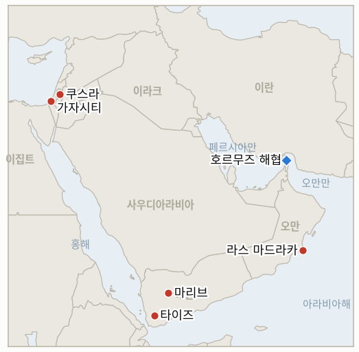

# 중동 일일 브리핑

**2026년 8월 14일**

- **보고 대상 기간:** 약 24시간, 8월 13일 09:00 ~ 8월 14일 09:00 (한국시간)
- **종합 평가:** 목요일은 세 개의 서로 다른 전선에서 표방된 의도와 실제 집행 결과 사이의 간극이 넓어진 하루였다. 서안지구에서는 나흘째 이어진 정착민의 팔레스타인 가옥 3채 포위를 끝내기 위해 투입된 이스라엘군이 정작 포위당한 팔레스타인 가족들을 대피시켰고, 정착민들은 더 높은 지대의 오래된 전초기지로 옮겨가 그대로 남았다. 마이크 허커비 주이스라엘 미국대사는 가해자들을 "이스라엘 테러리스트"라 부르며 "변명의 여지가 없다"고 밝혔는데, 이는 정착민 폭력에 대한 워싱턴의 평소 어법에서 이례적으로 벗어난 직설적 표현이었다. 호르무즈에서는 이란 페르시아만 해협청이 트럼프 대통령의 "완전 통제" 주장과 헤그세스 국방장관의 "무기한" 봉쇄 공언을 정면으로 거부했으며, 크리스 라이트 에너지장관이 호르무즈 수출량이 하루 900만 배럴에 근접한다고 주장해 여러 독립 추적기관 추정치의 거의 두 배에 달하는 이 수치가 시장의 의구심을 사면서 브렌트유는 2.0% 하락한 87.07달러, WTI는 2.4% 하락한 81.25달러로 마감했다. 목요일 저녁에는 ADNOC 선박 2척이 호르무즈 통항 중 추가로 피격됐으나 부상자는 없었고, 6월 17일 체결된 미국-이란 양해각서의 60일 통행료 면제 조항은 8월 17일을 전후로 만료되는데 이를 연장하기 위한 협상은 진행되지 않고 있다. 예멘에서는 후티와 정부군 간 충돌이 밤새 타이즈주로 번져 병사 1명이 숨지고 1명이 위중한 부상을 입었으며, 후티는 사우디 아람코의 자잔 정유시설을 재차 공격했고, 유엔 한스 그룬드베리 특사가 예멘이 2022년 이후 최고 수준의 내전 위험에 처해 있다고 밝힌 경고는 더욱 무게를 더했다. 이 원장의 IND-20260807-1은 오늘 확증되는데, 마리브·하드라마우트 습격이 지속적인 무력 충돌로 발전했다는 판단이다. 가자에서는 평화이사회의 재러드 쿠슈너와 니콜라이 믈라데노프 특사가 다음 주 이스라엘을 방문해 네타냐후 총리에게 하마스 무장해제 합의 진전을 압박할 예정인데, 이는 타격 자제 이후 첫 표적 사살, 즉 가자시티에서 하마스 경찰청장 자말 마흐무드 아부 카밀이 사살된 지 며칠 만에 나온 계획이다. 오만 앞바다에서는 좌초된 제재 대상 유조선 캐롤라인 베젠기호의 유출 사고가 2,000제곱킬로미터를 넘어 확산됐고 라스 마드라카 인근 본토 해안 40킬로미터에 도달했으나 여전히 책임 소재가 불분명하고 방제도 제대로 이뤄지지 않고 있다. 코스피는 나흘 연속 상승세를 이어가며 외국인의 지속적인 반도체 매수에 힘입어 3.56% 오른 사상 최고치 6,813.34를 기록했고, 원화는 소폭 약세로 돌아서 1,419.4원에 마감했다.

---

## 1. 무슨 일이 있었나

<figure style="float:right; width:46%; margin:2pt 0 8pt 14pt;">

<figcaption style="font-size:8pt; color:#666; text-align:center; margin-top:3pt; font-style:italic;">주요 논의 지점</figcaption>
</figure>

### 1.1 이스라엘군, 정착민 대신 포위당한 팔레스타인인들을 대피시켜…미국 "테러 행위"로 규정

이스라엘군과 경찰은 목요일, 정착민의 팔레스타인 가옥 3채 포위 나흘째 되던 날 쿠스라에 진입해 불법 전초기지 철거 작전이라는 명목으로 팔레스타인 가옥 15채에 대한 대피 명령을 내렸다. 주민들은 군이 단 30분의 통보만 준 경우도 있었다고 전했으며, 돌아왔을 때 보안카메라 메모리카드가 사라지고 일시 점거의 흔적으로 파손이 발생했으며 한 가족은 현금을 도난당했다고 주장했다([알자지라](https://www.aljazeera.com/news/2026/8/13/us-diplomat-calls-israeli-settler-siege-of-west-bank-homes-act-of-terror); [타임스오브이스라엘](https://www.timesofisrael.com/extremist-settlers-remain-near-besieged-palestinian-homes-as-us-slams-israeli-terrorists/); [워싱턴포스트](https://www.washingtonpost.com/world/2026/08/13/israel-west-bank-settler-violence-palestinian-qusra-huckabee/0d69a608-96f6-11f1-9ef9-1be722184483_story.html)). 반면 정착민들은 떠나지 않았다. 이들은 임시 구조물에서 더 높은 지대의 기존 전초기지로 옮겨갔을 뿐, 포위된 가옥들 인근에 계속 자리했다. 이스라엘군은 불법 전초기지 두 곳의 시설을 철거하고 이스라엘인 1명을 구금했다고 밝혔으며, 언론의 주목을 받은 뒤 팔레스타인 대피 명령을 철회했고, 보병 대대 1개를 추가 배치했으며, 정착민들과 함께 기도하는 모습이 촬영된 병사들에게는 징계 절차를 밟겠다고 밝혔다. 마이크 허커비 주이스라엘 미국대사는 "이 가족을 위협하고 괴롭히려는 이 끔찍한 테러 행위를 저지른 자들의 행동은 역겹다"며 가해자들을 "이스라엘 테러리스트"라 부르고 "이스라엘군과 이스라엘 경찰이 우리의 요청에 따라 이들을 몰아내러 갔다"고 밝혔다. 정착촌 지도자 이스라엘 간츠는 별도로 이번 사태를 "부적절하고 용납할 수 없다"고 밝히면서도 정착촌 확장 자체는 계속 옹호했다. **신뢰도: 높음** (대피, 전초기지 철거, 허커비의 발언, 1~2등급, 다수 매체, 공식 발언); **신뢰도: 중간** (구체적인 절도·파손 주장은 한 가구의 진술에 근거하며 독립적으로 확인되지 않음).

### 1.2 이란 해협청, "완전 통제" 거부…ADNOC 선박 추가 피격, 양해각서 통행료 면제 기간 만료 임박

트럼프 대통령은 트루스소셜에 "미국이 호르무즈 해협을 완전히 통제하고 있으며, 계속 유지할 것으로 생각한다"고 썼고, 헤그세스 국방장관은 항모 순환 배치를 통해 봉쇄를 "무기한" 유지할 수 있다고 밝혔다. 이란의 페르시아만 해협청은 해협이 "여전히 봉쇄돼 있으며 이란의 조건이 수용될 때까지 재개방되지 않을 것"이라고 응수했고, 모흐센 레자에이 최고국가안보회의 사무총장은 테헤란 주재 중국대사에게 가자와 레바논까지 아우르는 지역 전체 휴전을 이 원장이 이미 기록해온 조건 목록에 새로 추가했다([CNBC](https://www.cnbc.com/2026/08/13/us-iran-war-trump-hormuz-irgc.html); [걸프뉴스](https://gulfnews.com/world/mena/irans-rezaei-sets-sweeping-conditions-for-hormuz-reopening-as-us-talks-hit-new-impasse-1.500637980); [미들이스트모니터](https://www.middleeastmonitor.com/20260812-rezaei-strait-of-hormuz-will-not-reopen-until-wars-in-gaza-lebanon-end/)). 별도로 ADNOC은 목요일 저녁 호르무즈를 통항하던 자사 선박 2척이 추가로 피격됐으나 부상자는 없다고 확인했다([타임스오브이스라엘](https://www.timesofisrael.com/liveblog_entry/abu-dhabi-oil-co-says-2-vessels-attacked-in-hormuz-state-news-agency-reports/)). Windward Daily Intelligence는 수요일까지 24시간 동안 단 3척만이 통항했다고 집계했는데, 이는 Kpler와 다른 산정 방식에 따른 것으로 추가 하락을 나타낸다. Kpler 자체 5일 평균은 화요일 기준 약 13척으로 3개월 최저치에 근접했다. 크리스 라이트 에너지장관은 호르무즈 수출량이 하루 약 900만 배럴에 이른다고 주장했는데, 이는 독립 추적기관 TD시큐리티스(약 500만 배럴)와 커모디티컨텍스트(약 700만 배럴)의 최근 추정치의 거의 두 배로 시장의 의구심을 샀으며, 이날 브렌트유가 2.0% 하락한 87.07달러, WTI가 2.4% 하락한 81.25달러로 마감한 것과 맞물렸다. 6월 17일 체결된 미국-이란 임시 양해각서의 60일 통행료 면제 해운 조항은 8월 17일을 전후로 만료되는데 이를 연장하기 위한 협상은 진행되지 않고 있으며, 이란 측 수석 협상가는 그 이후 해상 서비스에 대해 요금을 부과할 방침이라고 밝힌 바 있다([Holland & Knight](https://www.hklaw.com/en/insights/publications/2026/06/us-iran-interim-agreement-implications-for-the-maritime-industry)). **신뢰도: 높음** (트럼프와 헤그세스의 발언, ADNOC 피격, 마감 유가, 1~2등급, 다수 매체, 공식 발언); **신뢰도: 중간** (라이트 장관의 수출량 수치와 양해각서 만료의 구체적 메커니즘은 각각 단일 출처에 근거하거나 논쟁적임).

### 1.3 예멘 전쟁, 타이즈로 확산되고 자잔이 재차 피격되며 지속적 무력 충돌로 확증

후티와 예멘 정부군 간 충돌이 밤사이 산악 지대인 타이즈주로 번져, 마리브·하드라마우트 축선과는 별개인 새로운 전선이 열렸다. 이 충돌로 정부군 병사 1명이 숨지고 1명이 위중한 부상을 입었으며, 예멘 군 당국자들은 지난주 이후 수십 명의 병력이 숨졌다고 밝혔고 군은 후티의 공격을 격퇴했다고 밝혔다([AP통신, KSAT 경유](https://www.ksat.com/news/world/2026/08/13/iran-backed-houthi-rebels-clash-with-yemeni-government-forces-and-other-mideast-developments/); [알자지라](https://www.aljazeera.com/news/2026/8/13/yemeni-forces-say-houthi-attack-repelled-in-taiz-amid-escalation)). 후티는 별도로 사우디 아람코의 자잔 정유시설에 이번 달 두 번째 드론 공격을 감행했다고 밝혔으며 사우디 당국은 즉각 논평하지 않았다. 유엔 한스 그룬드베리 특사가 예멘이 "2022년 4월 휴전 이후 그 어느 때보다 큰 대규모 무력 충돌 재발 위험에 직면해 있다"고 밝힌 기존 경고는 더욱 무게를 더했으며, 유엔은 예멘인 600만 명이 긴급 식량 불안정 수준에 처해 있어 전 세계에서 가장 높은 수치라고 밝혔다([알자지라](https://www.aljazeera.com/news/2026/8/13/will-all-out-war-in-yemen-reignite-as-houthis-escalate-attacks)). IND-20260807-1의 확증 기준은 8월 12일 이미 충족됐고 이후 이틀 동안 반전이 없었으므로 이 지표는 오늘 확증된다. 8월 6일 시작된 마리브·하드라마우트 습격이 일회성이 아니라 진정한 의미의 지속적인 지상전 캠페인으로 발전했다는 판정이다. **신뢰도: 높음** (타이즈 충돌, 자잔 공격 주장, 그룬드베리의 경고, 1~2등급, 다수 매체, AP통신, 유엔 발표); **신뢰도: 중간** (자잔의 구체적 피해 규모는 아직 독립적으로 확인되지 않음).

### 1.4 쿠슈너, 가자 첫 표적 사살 며칠 뒤 네타냐후 재압박 계획

평화이사회 특사 재러드 쿠슈너와 니콜라이 믈라데노프는 다음 주 이스라엘을 방문해 네타냐후 총리가 8월 9일 거부했던 하마스 무장해제 합의 진전을 압박하고, 최근의 표적 타격 중단과 인도적 조치 이행 재개를 독려할 예정이라고 사정에 정통한 소식통이 전했다. 정확한 방문 일정은 아직 확정되지 않았다([액시오스](https://www.axios.com/2026/08/13/kushner-israel-gaza-netanyahu); [타임스오브이스라엘](https://www.timesofisrael.com/liveblog-august-13-2026/)). 이번 방문 계획은 목요일 이스라엘 드론이 가자시티에서 하마스 지휘관이자 경찰청장으로 확인된 자말 마흐무드 아부 카밀을 사살한 공습 뒤에 나왔다. 이스라엘군은 그가 2023년 10월 7일 "이스라엘을 침입"했으며 "위협을 제거"하기 위해 표적이 됐다고 밝혔다. 이는 이스라엘이 8월 3일 이후 처음 발표한 표적 사살로, 그 기간 워싱턴은 중재자들이 다음 단계를 진전시킬 "여지"를 갖도록 이스라엘 측에 "표적 사살 자제"를 요청해왔다([하아레츠](https://www.haaretz.com/gaza/2026-08-13/ty-article/.premium/israeli-strikes-kill-two-in-gaza-medics-say-idf-says-hamas-militant-targeted/0000019f-fc55-df09-abff-ff77cc960000)). **신뢰도: 높음** (아부 카밀 공습과 이스라엘군의 설명, 1~2등급, 다수 매체, 공식 이스라엘군 발표); **신뢰도: 중간** (쿠슈너·믈라데노프 방문의 시점과 내용은 익명 관계자에 근거하며 일정은 유동적이라고 전해짐).

### 1.5 제재 대상 그림자 선단 유조선의 오만 앞바다 유출, 2,000제곱킬로미터 넘게 확산

좌초해 일부 침수된 유조선 캐롤라인 베젠기호의 유출 사고는 유출 전문가 존 아모스에 따르면 며칠 전 600제곱킬로미터를 조금 넘던 규모에서 2,000제곱킬로미터 이상으로 확산됐으며, 이제 라스 마드라카 인근 오만 본토 해안 약 40킬로미터에까지 도달했다. 이 선박은 영국과 EU가 러시아의 "그림자 선단" 일부로 제재한 대상이며, 6월 폭발 사고 이후 계속 유출되고 있다([알자지라](https://www.aljazeera.com/economy/2026/8/13/oman-says-oil-spill-from-stricken-tanker-has-reached-its-coast); [NBC뉴스](https://www.nbcnews.com/world/middle-east/oil-spill-oman-tanker-sanctions-russia-spreads-huge-area-rcna591707); [유로뉴스](https://www.euronews.com/2026/08/13/oil-spill-from-tanker-believed-to-be-russian-reaches-omans-coastline-muscat-authorities-sa)). 이 선박은 러시아 노보로시스크에서 원유 약 100만 배럴을 싣고 나온 뒤 6월 폭발을 신고했으며, 아직 누구도 책임을 인정하지 않았고 폭발 원인도 밝혀지지 않았다. 전문가들은 몬순 바람과 해류 속에 몇 주째 사실상 방치된 이 유출 사고가 최근 몇 년 사이 최악의 유출 사고 중 하나가 될 수 있다고 경고한다. **신뢰도: 높음** (유출 확산과 해안 피해, 1~2등급, 다수 매체, 위성사진 기반); **신뢰도: 낮음** (최초 폭발의 원인은 미해결이며 책임 소재도 불명확).

---

## 2. 심층 분석: 동기와 이해관계

### 2.1 이스라엘군은 왜 포위 중인 정착민 대신 포위당한 팔레스타인 가족을 대피시켰나?

무장을 갖추고 이념적으로 결속된 데다 집권 연정 일부의 지지를 받는 정착민과 물리적으로 충돌하는 것보다 팔레스타인인을 이주시키는 쪽이 작전상 더 간단하고 정치적 대가도 적기 때문이다. 전초기지 두 곳을 철거하고 1명을 구금하는 식으로 작전을 "전초기지 철거"로 프레이밍하면, 유엔 안전보장이사회와 미국 대사관이라는 동일한 압박 주체들에게 집행 조치를 취했다고 내세울 수 있다. 그러면서도 정착민들이 실제로는 지척의 고지대로 옮겨간 것에 불과해 지역을 떠나거나 포위당한 가족들의 토지에 대한 접근을 포기하도록 강제하지는 않는다. 이 원장은 나흘 사이 쿠스라에서 이런 패턴을 이미 두 차례 기록했다.

### 2.2 이란은 왜 양해각서의 통행료 면제 기간 만료를 앞두고 호르무즈 조건에 가자·레바논 휴전까지 추가했나?

워싱턴 스스로가 이란에 부여한 지렛대, 즉 6월 양해각서에 따른 통행료 면제 조치가 테헤란이 무엇을 하든 상관없이 자체 시한에 따라 곧 만료될 예정인 바로 이 시점에, 레자에이 강경파 최고국가안보회의는 재개방의 대가를 끌어올릴 온갖 유인을 갖고 있기 때문이다. 이는 방어적 태세(단순히 양보를 연장하지 않는 것)를 공세적 태세(관련 없는 지역 전체 해결을 추가 양보의 새로운 대가로 요구하는 것)로 전환시키는 것으로, 이란에는 아무런 비용이 들지 않는 협상 전술이다. 반면 시간표 그 자체가 워싱턴과 8월 17일 이후 통행료·통행 제한 또는 지속되는 불확실성에 직면할 해운업계에 대한 압박을 가중시키는 역할을 대신 해준다.

### 2.3 후티는 왜 한 전선에 집중하는 대신 타이즈로 지상전을 확대하고 자잔을 재차 공격했나?

마리브, 하드라마우트, 그리고 이제 타이즈까지 지리적으로 분리된 세 개 전선에 걸쳐 교전을 확산시키고 사우디 에너지 시설까지 재타격하는 것은, 예멘 정부와 후원국 사우디아라비아가 제한된 방어 역량과 자원을 한 곳에 집중하지 못하고 분산시키도록 강제하는 전형적인 다전선 압박 전술이기 때문이다. 이는 동시에 전쟁이 확대되는 와중에도 자잔에 대한 사우디의 흡수·복구식 대응 태세가 계속 버틸지를 시험하는 것이기도 하며, 여러 전선에서 동시에 역량을 과시함으로써 예멘 국내 대결과 이란의 별개인 호르무즈 협상 지위 양쪽 모두에 후티에게 유리한 지렛대를 제공한다.

### 2.4 워싱턴은 왜 표적 사살로 잠정적 소강 국면이 깨진 직후 쿠슈너를 보내 네타냐후를 압박하나?

목요일까지 11일간 지켜졌던 워싱턴 자체의 타격 자제 요청이, 네타냐후가 위협이 충분히 크다고 판단하면 언제든 표적 작전을 재개한다는 사실을 이미 보여줬기 때문이다. 이는 고위급 특사 파견을 더 늦출 경우 이 잠정적 소강 상태가 예외가 아니라 하나의 패턴으로 굳어질 위험이 있음을 의미한다. 최신 여론조사에서 4석 뒤지고 있는 네타냐후 자신의 선거철 정치적 셈법이 더 굳어지기 전에 쿠슈너와 믈라데노프를 지금 보내는 것은, 8월 9일 네타냐후의 거부 이후 무장해제 순서를 둘러싼 이견을 풀어내는 데 일상적인 외교 채널보다 트럼프 자신의 사위가 가하는 개인적 압박이 더 큰 효과를 낼 것이라는 도박이다.

### 2.5 왜 이 정도 규모의 유출 사고가 몇 주째 책임 소재도 불분명한 채 사실상 방치되고 있나?

제재 대상 그림자 선단 선박은 애당초 정상적인 방제 대응을 신속히 자금 지원하고 의무화할 보험·선적·책임 구조를 회피하기 위해 존재하기 때문이다. 캐롤라인 베젠기호가 애초에 제재를 피해 러시아산 원유를 실을 수 있게 해준 바로 그 불투명성이, 이제는 유출 사고를 수습할 명확한 책임 주체나 역량을 아무도 갖추지 못한 상황으로 이어지고 있다. 이는 그림자 선단 사업 모델 자체에 내재된 구조적 공백으로, 오만 정부가 배상받을 뚜렷한 경로도 없이 환경 비용을 고스란히 떠안고 있다.

---

## 3. 한국에 대한 정책적 함의

### 3.1 익스포저 현황

| 항목 | 현재 수치 | 출처 |
| --- | --- | --- |
| 원유 수입 중 중동 비중 | 48.5%(2026년 5~7월)로, 1년 전 69.1%에서 하락; 비중동 비중이 사상 처음으로 50%를 넘어섬 | KNOC, 아시아경제 경유; `korea-exposure.md` |
| 7~8월 원유 도입 | 전년 동기 대비 110%+ 확보(산업통상자원부, 7월 21일); 비축유 스와프 8월까지 연장, 현재까지 약 2,100만 배럴 스와프 | 산업통상자원부, 헤럴드경제·한경 경유; `korea-exposure.md` |
| 9월 원유 도입 | 90%+ 확보(산업통상자원부, 7월 21일) | 산업통상자원부, 헤럴드경제 경유; `korea-exposure.md` |
| 홍해 우회 항로 | 한국행 원유 화물이 얀부·홍해 우회 항로를 계속 이용 중; 얀부에서 한국을 포함한 아시아 매수국으로의 수출량이 1년 전 하루 100만 배럴 미만에서 약 400만 배럴로 급증 | Lloyd's List Intelligence; `korea-exposure.md` |
| 전략비축유 커버리지 | 실제 소비량 기준 약 26일분(추정); 스와프는 즉시 대기 상태이나 대규모 실전 검증 안 됨 | CSIS; 산업통상자원부 7월 27일 |
| 정유사 사우디 지분 노출 | S-Oil(사우디 아람코 지분 약 63%), HD현대오일뱅크(아람코 지분 약 17%) | 공시자료; `korea-exposure.md` |
| 브렌트유/WTI | 마감 87.07달러(-2.0%)/81.25달러(-2.4%), 라이트 에너지장관의 논쟁적인 하루 900만 배럴 호르무즈 수출 주장과 맞물린 하락 | CNBC |
| 코스피/원달러 환율 | 마감 6,813.34(+3.56%, 사상 최고치, 나흘 연속 상승), 이번 분쟁과 무관한 외국인 반도체 매수 지속; 원화는 1,419.4원으로 약세 전환 | 코리아타임스, 서울경제 |
| 호르무즈 통항량 | 8월 12일까지 24시간 동안 3척(Windward), 직전 주 8~14척 범위에서 추가 하락; Kpler 5일 평균은 8월 11일 기준 약 13척으로 3개월 최저치 근접 | Windward Daily Intelligence; Kpler, CNBC 경유 |

### 3.2 사안별 함의

**이스라엘군이 포위 중인 정착민 대신 포위당한 팔레스타인인을 대피시킨 것과, 미국 대사의 이례적으로 직설적인 "이스라엘 테러리스트" 규정은 직접적인 한국 시장 노출은 없지만, 이스라엘의 최측근 동맹국과도 마찰을 빚을 만큼 서안지구의 집행 공백이 두드러지고 있음을 보여준다. 이는 호르무즈와 가자 트랙이 별도로 한국의 리스크 계획을 지배하는 가운데서도 지역 불안정이 좁아지지 않고 오히려 넓어지고 있다는 추가 신호다.** IND-20260813-3(시한 8월 27일)은 정착민이 철거되지 않고 이동한 데 그친 이번 사태의 실제 향방을 계속 추적한다.

**이란의 확대된 호르무즈 조건과 양해각서 통행료 면제 기간의 8월 17일 전후 만료가 임박한 상황은, 한국 정유사들이 8월 17일 이후 이란이 새로 통행료를 부과하거나 임기응변식 집행 위험이 계속되는 두 시나리오 모두에 대비해야 함을 의미한다. 독립 추적기관의 하루 500만~700만 배럴 추정치를 크게 웃도는 논쟁적인 하루 900만 배럴 수출 주장은, 이란이든 미국 공식 발표든 어느 한 쪽의 호르무즈 통항량 수치도 안정적인 계획 기준선으로 삼지 말라는 경고다.** 신규 지표 IND-20260814-1(시한 8월 24일)은 통행료 면제 기간 만료 이후 이란이 실제로 새 통행료나 제한을 부과하는지, 아니면 공식 발표 없이 이를 계속 연장하는지를 추적한다.

**예멘 전쟁이 지속적인 무력 충돌로 확증된 것(IND-20260807-1)과, 전선이 이제 세 번째 주로까지 확대되고 이번 달 두 번째 자잔 정유시설 공격이 발생한 것은, 이미 축소된 호르무즈의 주된 대안인 한국의 얀부·홍해 우회 항로가 안정화가 아니라 지리적으로 확대되고 있는 분쟁 지대 한복판에 놓여 있음을 재확인시켜준다. 한국 해운사들은 이 항로가 이미 안고 있는 바브엘만데브 노출과 함께 이 위험을 함께 반영해야 한다.** 신규 지표 IND-20260814-3(시한 9월 4일)은 전투가 마리브·하드라마우트·타이즈를 넘어 다른 예멘 주로 확산되는지를 추적한다.

**쿠슈너의 가자 방문 계획이나 캐롤라인 베젠기호 유출 사고 모두 직접적인 한국 에너지 공급 노출은 없지만, 이번 유출 사고는 한국의 보험사와 걸프·아라비아해 해상 항로를 모니터링하는 해운사들이 주목해야 할 구조적 위험을 보여준다. 명확한 책임 사슬 없이 운영되는 제재 대상 그림자 선단 선박은 방제 자금을 댈 책임 주체가 전혀 없는 환경·항행 위험을 발생시킬 수 있으며, 이는 이 원장이 통상 추적하는 분쟁발 교란과는 결이 다르지만 인접한 위험이다.** 신규 지표 IND-20260814-2(시한 8월 21일)는 쿠슈너·믈라데노프 방문이 네타냐후의 무장해제 선행 입장에 가시적 변화를 만들어내는지를 추적한다.

**검증 가능한 지표:**

- **IND-20260814-1** — 6월 17일 양해각서의 60일 통행료 면제 호르무즈 조항이 8월 17일 전후 만료된 이후 실제 이란의 새 통행료나 제한 부과로 이어지거나, 이란이 요금 부과 없이 무료 통항을 연장한다. 약 2026년 8월 24일까지 이란 페르시아만 해협청이 공식적으로 통행료·요금 체계를 부과하거나 통항 무료 유지를 명시적으로 발표하면 통행료 문제가 어느 한 방향으로든 명확히 정리됐음을 확증한다. 같은 시한까지 통행료 부과나 연장 어느 쪽에 대해서도 명확한 이란의 발표가 없으면, 깔끔한 해소 없이 모호한 상태가 계속되고 양해각서의 공식 조항과 무관하게 무력에 의한 집행이 실질적 현실로 남아 있음을 반증한다.
- **IND-20260814-2** — 쿠슈너와 믈라데노프의 예정된 이스라엘 방문이 하마스 무장해제를 둘러싼 네타냐후의 입장에 가시적 변화를 만들어내거나, 방문이 정책 변화 없이 정체된다. 약 2026년 8월 21일까지 이스라엘 안보내각의 공식 표결, 네타냐후가 무장해제 선행 순서를 수용하거나 실질적으로 수정했다는 공개 발언, 또는 방문 이후 합의된 무장해제 일정 중 하나가 나오면 실질적 진전을 확증한다. 같은 시한까지 방문이 연기되거나 취소되거나 네타냐후의 입장에 공개적 변화가 전혀 없으면, 이번에도 실효 없는 압박에 그쳤음을 반증한다.
- **IND-20260814-3** — 예멘의 후티-정부군 전쟁이 마리브·하드라마우트·타이즈를 넘어 추가 주로 확산되거나, 현재의 세 전선에 국한된 상태를 유지한다. 약 2026년 9월 4일까지 이전까지 이번 확전에 포함되지 않았던 예멘의 다른 주에서 후티의 공격이나 정부군의 공세 작전이 확인되면, 분쟁이 진정한 의미의 전국적 전쟁으로 확산되고 있음을 확증한다. 같은 시한까지 전투가 이 세 전선에 국한된 상태로 유지되면, 이번 창(window) 안에서는 추가적인 지리적 확산이 없었음을 반증한다.

---

## 4. 관찰 목록

- **통행료 면제 기간 만료(8월 17일 전후) 이후 이란이 새 호르무즈 통행료나 제한을 부과하는지, 무료 통항을 연장하는지 여부** (IND-20260814-1, 시한 8월 24일)
- **쿠슈너·믈라데노프 방문이 네타냐후의 하마스 무장해제 입장을 바꾸는지, 아무런 진전도 만들지 못하는지 여부** (IND-20260814-2, 시한 8월 21일)
- **예멘의 후티-정부군 전쟁이 마리브·하드라마우트·타이즈를 넘어 다른 주로 확산되는지 여부** (IND-20260814-3, 시한 9월 4일)
- **정착민이 철거가 아니라 이동에 그친 상황에서 쿠스라 포위 사태가 실제로 해소되는지 여부** (IND-20260813-3, 시한 8월 27일)
- **후티의 이중 타격 전술이 반복되는지, 일회성 확전에 그치는지 여부** (IND-20260813-2, 시한 9월 2일)
- **IEA의 재고 고갈 경고가 추가 정책 대응이나 지속적 가격 상승으로 이어지는지 여부** (IND-20260813-1, 시한 9월 2일)
- **하메네이 또는 이란 최고국가안보회의가 결국 어떤 형태로든 호르무즈 프레임워크를 공식 승인하는지 여부** (IND-20260808-2, 시한 8월 15일)
- **이란 최고국가안보회의의 요구가 워싱턴을 군사행동 재개로 밀어붙이는지, 축소된 합의가 도출되는지 여부** (IND-20260809-1, 시한 8월 16일)
- **축소되거나 수정된 이란-오만 호르무즈 메커니즘이 공개 발표되고 수용되는지 여부** (IND-20260810-1, 시한 8월 20일)
- **이란의 강경파 안보 개편이 호르무즈 외교를 계속 정체시키는지, 이란-오만 트랙이 그래도 타결되는지 여부** (IND-20260811-1, 시한 8월 18일)
- **예멘 정부군의 공세 작전이 계속되는지, 영토 변화가 확인되는지 여부** (IND-20260809-3, 시한 8월 16일)
- **사우디아라비아가 자잔 정유시설 공격이나 추가 후티 공격에 직접 보복하는지 여부** (IND-20260810-3, 시한 8월 17일)
- **사우디아라비아가 경고한 후티-이라크 민병대 협공이 실제로 실현되는지 여부** (IND-20260808-1, 시한 8월 15일)
- **쿠웨이트에 대한 반복 공격 패턴이 항의·복구 대응을 넘어선 확전으로 이어지는지 여부** (IND-20260802-2, 시한 8월 15일)
- **레바논 남부의 활성 교전 국면이 로마 외교 트랙과 계속 평행선을 달리는지, 이를 탈선시키는지 여부** (IND-20260807-2, 시한 9월 1일)
- **미 해군의 봉쇄 집행이 이란의 군사적 대응을 이끌어내는지 여부** (IND-20260812-1, 시한 8월 26일)
- **시리아의 핵물질 문제가 IAEA와의 최종 합의 및 검증된 반출로 이어지는지 여부** (IND-20260812-2, 시한 9월 11일)
- **가자 무장해제 선행 프레임워크가 어떤 형태로든 이스라엘 안보내각의 공식 표결에 이르는지 여부** (IND-20260812-4, 시한 8월 26일)
- **마즈달 준 폭발이 헤즈볼라의 개조로 확인되는지, 오래된 불발탄으로 확인되는지 여부** (IND-20260811-2, 시한 8월 25일)
- **타이베를 비거주자에게 봉쇄한 조치가 정착민 공격을 줄이는지, 폭력이 계속되는지 여부** (IND-20260811-3, 시한 8월 18일)
- **캐롤라인 베젠기호 유출 사고가 방제되는지, 오만 해안을 따라 계속 확산되는지 여부**
- **케슘섬 폭발이 실제 공격으로 확인되는지, 오경보로 결론 나는지 여부**

---

## 5. 출처 신뢰도 요약

| 주장 | 출처 | 신뢰도 |
| --- | --- | --- |
| 이스라엘군, 쿠스라에서 포위당한 가족을 포함해 팔레스타인 가옥 15채를 대피시키고, 정착민은 인근 전초기지로 이동해 잔류 | 알자지라, 타임스오브이스라엘, 워싱턴포스트 (1~2등급, 다수 매체) | 높음 |
| 미국 대사 허커비, 정착민을 "이스라엘 테러리스트"이자 "끔찍한 테러 행위"의 가해자로 규정 | 알자지라, 타임스오브이스라엘 (1~2등급, 공식 발언) | 높음 |
| 트럼프, 호르무즈 "완전 통제" 주장; 헤그세스, "무기한" 봉쇄 발언; 이란 페르시아만 해협청, 양측 주장 모두 거부 | CNBC (1등급, 다수 매체, 공식 발언) | 높음 |
| 목요일 저녁 ADNOC 선박 2척 추가로 호르무즈 통항 중 피격, 부상자 없음 | 타임스오브이스라엘 라이브블로그, UAE 국영매체 인용 (1~2등급) | 높음 |
| 레자에이, 이란의 호르무즈 재개방 조건에 가자·레바논 휴전 추가 | 걸프뉴스, 미들이스트모니터 (2등급, 다수 매체) | 중상 |
| 브렌트유 87.07달러(-2.0%), WTI 81.25달러(-2.4%) 마감; 라이트 에너지장관의 하루 900만 배럴 수출 주장 독립 추적기관과 배치 | CNBC (1~2등급, 시장 통신 보도, 명시된 추적기관) | 높음 |
| Windward: 8월 12일까지 24시간 동안 호르무즈 통항 3척; Kpler: 8월 11일 기준 5일 평균 약 13척 | Windward Daily Intelligence; Kpler, CNBC 경유 (2등급, 데이터 제공사, 산정 방식 상이) | 중상 |
| 6월 17일 양해각서의 60일 통행료 면제 기간 8월 17일 전후 만료 | Holland & Knight 법률 분석 (2등급, 구체적 메커니즘에 대한 단일 출처) | 중간 |
| 후티-정부군 충돌 타이즈로 확산, 병사 1명 사망; 후티, 자잔 정유시설 두 번째 공격 | AP통신(KSAT 경유), 알자지라 (1~2등급, 통신사·다수 매체) | 높음 |
| 유엔 그룬드베리: 예멘 2022년 이후 최고 내전 위험; 예멘인 600만 명 긴급 식량 불안정 | 알자지라 (1등급, 유엔 발표, 다수 매체) | 높음 |
| 쿠슈너·믈라데노프, 다음 주 이스라엘 방문해 네타냐후에 하마스 무장해제 압박 계획 | 액시오스, 타임스오브이스라엘 라이브블로그 (1~2등급, 익명 관계자 근거) | 중간 |
| 이스라엘, 가자시티에서 하마스 지휘관 자말 마흐무드 아부 카밀 사살, 8월 3일 이후 첫 표적 사살 | 하아레츠 (1~2등급, 공식 이스라엘군 발표) | 높음 |
| 캐롤라인 베젠기호 유출 사고 2,000제곱킬로미터 넘게 확산, 라스 마드라카 인근 오만 해안 40km 도달 | 알자지라, NBC뉴스, 유로뉴스 (1~2등급, 다수 매체, 위성사진 기반) | 높음 |
| 코스피 +3.56% 사상 최고치 6,813.34 마감(나흘 연속 상승, 외국인 반도체 매수); 원화 1,419.4원으로 약세 전환 | 코리아타임스, 서울경제 (1~2등급, 한국 경제지) | 높음 |
