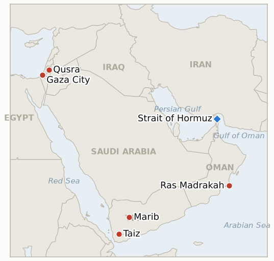

# Middle East Daily Briefing

**August 14, 2026**

- **Reporting window:** ~24 hours, August 13, 09:00 to August 14, 09:00 KST
- **Overall assessment:** Thursday exposed a widening gap between stated intent and enforced outcome across three separate fronts. In the West Bank, Israeli forces sent to end a four day settler siege of three Palestinian homes in Qusra instead evacuated the besieged Palestinian families, while the settlers relocated to an older outpost on higher ground and stayed; US Ambassador Mike Huckabee called the perpetrators "Israeli terrorists" acting with "no excuse," an unusually blunt break from Washington's normal register on settler violence. On Hormuz, Iran's Persian Gulf Strait Authority flatly rejected President Trump's claim of "total control" and Defense Secretary Hegseth's vow to blockade "indefinitely," even as Energy Secretary Chris Wright's contested claim that exports are running near 9 million barrels a day, roughly double several independent trackers' estimates, helped push Brent down 2% to $87.07 and WTI down 2.4% to $81.25; two more ADNOC vessels were attacked transiting the strait Thursday evening with no injuries, and the June 17 US Iran memorandum's 60 day toll free shipping window lapses around August 17 with no talks underway to extend it. In Yemen, renewed Houthi Yemeni government clashes spread to Taiz province overnight, killing one soldier and critically wounding another, while the Houthis struck Saudi Aramco's Jazan refinery for a second time and UN Special Envoy Hans Grundberg's warning that Yemen faces its highest civil war risk since 2022 gained further weight; this ledger's IND-20260807-1 confirms today, the Marib and Hadramaut raid having become a sustained campaign. In Gaza, the Board of Peace's Jared Kushner and Nickolay Mladenov are slated to visit Israel next week to press Prime Minister Netanyahu on advancing Hamas's disarmament agreement, days after Israel's first targeted killing since curbing strikes, of Hamas police chief Jamal Mahmoud Abu Kamil in Gaza City. Off Oman, the grounded, sanctioned tanker Caroline Bezengi's oil spill has grown to more than 2,000 square kilometers and reached 40 kilometers of mainland coastline near Ras Madrakah, still unclaimed and largely uncontained after weeks. KOSPI extended its rally to a fourth straight session, up 3.56% to a record 6,813.34 on continued foreign chip buying, while the won eased slightly to 1,419.4.

---

## 1. What Happened

<figure style="float:right; width:46%; margin:2pt 0 8pt 14pt;">

<figcaption style="font-size:8pt; color:#666; text-align:center; margin-top:3pt; font-style:italic;">Major places of discussion</figcaption>
</figure>

### 1.1 Israeli Forces Evacuate the Besieged Palestinians, Not the Settlers, as the US Calls It an Act of Terror

Israeli forces and police entered Qusra on Thursday, the fourth day of a settler siege of three Palestinian homes, and ordered 15 Palestinian homes evacuated as part of a stated operation to clear illegal outposts; residents said soldiers gave as little as thirty minutes' notice, and on their return found security camera memory cards removed, damage from the brief occupation, and one family's claim that money had been stolen ([Al Jazeera](https://www.aljazeera.com/news/2026/8/13/us-diplomat-calls-israeli-settler-siege-of-west-bank-homes-act-of-terror); [Times of Israel](https://www.timesofisrael.com/extremist-settlers-remain-near-besieged-palestinian-homes-as-us-slams-israeli-terrorists/); [The Washington Post](https://www.washingtonpost.com/world/2026/08/13/israel-west-bank-settler-violence-palestinian-qusra-huckabee/0d69a608-96f6-11f1-9ef9-1be722184483_story.html)). The settlers, meanwhile, did not leave; they relocated from makeshift structures to an older, established outpost on higher ground and remained positioned near the besieged homes throughout. The military said it demolished structures at two illegal outposts and detained one Israeli, rescinded the Palestinian evacuation order after it drew media attention, deployed an additional infantry battalion, and said soldiers filmed praying alongside the besieging settlers would face discipline. US Ambassador Mike Huckabee wrote that "actions by those who carried out this horrific act of terror meant to intimidate and harass this family are disgusting," calling the perpetrators "Israeli terrorists" and saying "IDF and Israel Police have gone at our request to remove" them; settlement leader Yisrael Ganz separately called the episode "improper and unacceptable" while still defending settlement expansion generally. **Confidence: High** on the evacuation, outpost demolition and Huckabee's quotes (Tier 1-2, multi-outlet, on-record); **Medium** on the specific theft and property-damage claims, single-family-sourced and not independently verified.

### 1.2 Iran's Strait Authority Rejects "Total Control" as Two More ADNOC Vessels Are Hit and the MOU's Toll Free Window Nears Expiry

President Trump wrote on Truth Social that "the U.S.A. has total control over the Strait of Hormuz. I think we will keep it," and Defense Secretary Pete Hegseth said the Navy can maintain its blockade "indefinitely" through carrier rotation; Iran's Persian Gulf Strait Authority responded that the strait "remains blocked and will not be reopened until Iran's conditions are accepted," a position SNSC Secretary Mohsen Rezaei reinforced to China's ambassador in Tehran by adding a region wide ceasefire extending to Gaza and Lebanon to the ledger's now-familiar list of conditions ([CNBC](https://www.cnbc.com/2026/08/13/us-iran-war-trump-hormuz-irgc.html); [Gulf News](https://gulfnews.com/world/mena/irans-rezaei-sets-sweeping-conditions-for-hormuz-reopening-as-us-talks-hit-new-impasse-1.500637980); [Middle East Monitor](https://www.middleeastmonitor.com/20260812-rezaei-strait-of-hormuz-will-not-reopen-until-wars-in-gaza-lebanon-end/)). Separately, ADNOC confirmed two more of its vessels were attacked transiting Hormuz on Thursday evening, with no injuries reported ([Times of Israel](https://www.timesofisrael.com/liveblog_entry/abu-dhabi-oil-co-says-2-vessels-attacked-in-hormuz-state-news-agency-reports/)). Windward Daily Intelligence recorded just three vessels transiting in the 24 hours ending Wednesday, a further drop using a different counting methodology than Kpler's; Kpler's own five day average stood near 13 on Tuesday, itself close to a three month low. Energy Secretary Chris Wright's claim that Hormuz exports are running near 9 million barrels a day, roughly double independent trackers TD Securities (about 5 million bpd) and Commodity Context's (about 7 million bpd) recent estimates, drew market skepticism and coincided with Brent settling down 2% at $87.07 and WTI down 2.4% at $81.25. The June 17 US Iran interim MOU's 60 day toll free shipping arrangement lapses around August 17 with no talks underway to extend it, after which Iran's lead negotiator has said Tehran intends to charge for maritime services ([Holland & Knight](https://www.hklaw.com/en/insights/publications/2026/06/us-iran-interim-agreement-implications-for-the-maritime-industry)). **Confidence: High** on Trump's and Hegseth's statements, the ADNOC attack, and the settle prices (Tier 1-2, multi-outlet, official statements); **Medium** on the Wright export figure and the precise MOU expiration mechanics, both contested or thinly sourced beyond a single outlet each.

### 1.3 Yemen's War Is Confirmed a Sustained Campaign as Fighting Spreads to Taiz and Jazan Is Struck Again

Clashes between Houthi and Yemeni government forces spread overnight to the mountainous province of Taiz, a new front distinct from the Marib and Hadramaut axis, killing one government soldier and critically wounding another; Yemeni military officials said dozens of troops have been killed since last week and the army said it repelled the Houthi attack ([AP via KSAT](https://www.ksat.com/news/world/2026/08/13/iran-backed-houthi-rebels-clash-with-yemeni-government-forces-and-other-mideast-developments/); [Al Jazeera](https://www.aljazeera.com/news/2026/8/13/yemeni-forces-say-houthi-attack-repelled-in-taiz-amid-escalation)). The Houthis separately said they launched another drone attack on Saudi Aramco's Jazan refinery, the second such strike this month; Saudi officials did not immediately comment. UN Special Envoy Hans Grundberg's standing warning that Yemen "faces a greater risk of renewed large scale conflict than at any point since" the April 2022 truce gained further weight, with the UN also citing 6 million Yemenis at emergency food insecurity levels, the highest such figure globally ([Al Jazeera](https://www.aljazeera.com/news/2026/8/13/will-all-out-war-in-yemen-reignite-as-houthis-escalate-attacks)). With the confirmation bar for IND-20260807-1 already met on August 12 and no reversal in the intervening two days, the indicator confirms today: the Marib and Hadramaut raid opened on August 6 has become a sustained ground campaign rather than a one-off. **Confidence: High** on the Taiz clash, the Jazan strike claim and Grundberg's warning (Tier 1-2, multi-outlet, AP wire, UN statement); **Medium** on the precise Jazan damage, no independent confirmation yet available.

### 1.4 Kushner Plans a Fresh Push on Netanyahu Days After Gaza's First Targeted Killing Since the Strike Curb

Board of Peace envoys Jared Kushner and Nickolay Mladenov are slated to visit Israel next week to press Prime Minister Netanyahu toward advancing the Hamas disarmament agreement he rejected on August 9, and to encourage a restoration of the recent halt on targeted strikes and humanitarian commitments, according to a source familiar with the planning; the exact dates remain unconfirmed ([Axios](https://www.axios.com/2026/08/13/kushner-israel-gaza-netanyahu); [Times of Israel](https://www.timesofisrael.com/liveblog-august-13-2026/)). The visit follows Thursday's Israeli drone strike in Gaza City that killed Jamal Mahmoud Abu Kamil, identified by the IDF as a Hamas commander and police chief who "invaded Israel" on October 7, 2023 and was targeted to "remove a threat"; it was the first targeted killing Israel has announced since August 3, a period in which Washington had pressed Israel for "no targeted killings" to give mediators "space" to advance the next phase ([Haaretz](https://www.haaretz.com/gaza/2026-08-13/ty-article/.premium/israeli-strikes-kill-two-in-gaza-medics-say-idf-says-hamas-militant-targeted/0000019f-fc55-df09-abff-ff77cc960000)). **Confidence: High** on the Abu Kamil strike and its IDF characterization (Tier 1-2, multi-outlet, official IDF statement); **Medium** on the Kushner-Mladenov visit's timing and substance, sourced to unnamed officials with dates described as still subject to change.

### 1.5 A Sanctioned Shadow Fleet Tanker's Oil Spill Off Oman Balloons Past 2,000 Square Kilometers

The oil spill from the grounded, partly submerged tanker Caroline Bezengi, sanctioned by the UK and EU as part of Russia's shadow fleet and leaking since a June explosion, has spread to more than 2,000 square kilometers according to oil spill specialist John Amos, up from just over 600 square kilometers days earlier, and has now reached roughly 40 kilometers of Oman's mainland coastline near Ras Madrakah ([Al Jazeera](https://www.aljazeera.com/economy/2026/8/13/oman-says-oil-spill-from-stricken-tanker-has-reached-its-coast); [NBC News](https://www.nbcnews.com/world/middle-east/oil-spill-oman-tanker-sanctions-russia-spreads-huge-area-rcna591707); [Euronews](https://www.euronews.com/2026/08/13/oil-spill-from-tanker-believed-to-be-russian-reaches-omans-coastline-muscat-authorities-sa)). The vessel had been carrying nearly 1 million barrels of oil out of Russia's Novorossiysk when it reported an explosion in June; no party has claimed responsibility or explained the cause, and experts warn the slick, spreading largely unchecked for weeks amid monsoon winds and currents, threatens to become one of the worst spills in years. **Confidence: High** on the spill's spread and coastal impact (Tier 1-2, multi-outlet, satellite-imagery sourced); **Low** on the cause of the original explosion, unresolved and unclaimed.

---

## 2. Deep Dive: Incentives and Motives

### 2.1 Why would Israeli forces evacuate the besieged Palestinian families rather than the settlers besieging them?

Because removing Palestinians is operationally simpler and less politically costly than physically confronting armed, ideologically committed settlers backed by parts of the governing coalition, and framing the raid as outpost clearance, two structures demolished, one detention, lets the military report enforcement action for the same UN Security Council and US ambassadorial audiences that pressured it, without actually forcing settlers who relocated only a short distance uphill to leave the area or ending their access to the besieged families' land, a pattern this ledger's Qusra coverage has now recorded twice in four days.

### 2.2 Why would Iran expand its Hormuz conditions to a Gaza and Lebanon ceasefire just as the MOU's toll free window nears expiry?

Because Rezaei's hardline SNSC has every incentive to raise the price of reopening precisely when Washington's own leverage, the toll free arrangement Iran granted under the June MOU, is about to lapse on its own terms regardless of what Tehran does next, converting a defensive posture (simply not extending a concession) into an offensive one (demanding an unrelated regional settlement as the new price of any further accommodation), a negotiating tactic that costs Iran nothing while the calendar itself does the work of tightening pressure on Washington and on shippers who now face tolls, restrictions, or continued uncertainty after August 17 regardless of Iran's other demands.

### 2.3 Why would the Houthis widen their ground campaign into Taiz while striking Jazan again, rather than consolidating on one front?

Because spreading engagement across three geographically separated fronts, Marib, Hadramaut and now Taiz, plus a renewed strike on Saudi energy infrastructure, forces the Yemeni government and its Saudi backers to disperse scarce defensive attention and resources rather than concentrate them, a classic multi-front pressure tactic that also tests whether Riyadh's absorb-and-repair posture toward Jazan holds even as the broader war widens, giving the Houthis leverage over both the domestic Yemeni contest and Iran's separate Hormuz negotiating position by demonstrating capacity on multiple axes simultaneously.

### 2.4 Why send Kushner to press Netanyahu now, days after a targeted killing broke the informal calm?

Because Washington's own strike curb request, honored for eleven days until Thursday, has already shown Netanyahu will resume targeted operations whenever he judges a threat significant enough, meaning further delay in sending senior envoys risks the informal calm eroding into a pattern rather than an exception; sending Kushner and Mladenov now, before Netanyahu's own election-season political calculus (he trails by four seats in the latest poll) hardens further against concessions, is a bet that personal pressure from Trump's own son-in-law carries more weight than routine diplomatic channels have shown in resolving the disarmament sequencing dispute since Netanyahu's August 9 rejection.

### 2.5 Why would a spill of this scale go unclaimed and largely uncontained for weeks?

Because a sanctioned shadow fleet vessel exists specifically to obscure ownership and evade the insurance, flagging and liability structures that would normally fund and mandate a rapid cleanup response, so the same opacity that let the Caroline Bezengi carry Russian oil under sanctions in the first place now leaves no clearly responsible party obligated or equipped to contain the spill it caused, a structural gap in the shadow fleet's business model that Oman's government is left to absorb as an environmental cost with no clear channel for restitution.

---

## 3. Policy Implications for South Korea

### 3.1 Exposure snapshot

| Item | Current reading | Source |
| --- | --- | --- |
| Middle East share of crude imports | 48.5% (May-July 2026), down from 69.1% a year earlier; non-Middle East share crossed 50% for the first time on record | KNOC via Asia Business Daily; `korea-exposure.md` |
| July-August crude procurement | 110%+ of prior-year volume secured (MOTIE, July 21); strategic reserve swap extended through August, ~21 million barrels swapped to date | MOTIE via Herald Business, Hankyung; `korea-exposure.md` |
| September crude procurement | 90%+ secured (MOTIE, July 21) | MOTIE via Herald Business; `korea-exposure.md` |
| Red Sea detour routing | Korean-bound crude cargoes continue via the Yanbu/Red Sea workaround; Yanbu exports to Asian buyers including Korea have surged to ~4 million bpd from under 1 million bpd a year earlier | Lloyd's List Intelligence; `korea-exposure.md` |
| Strategic reserve coverage | ~26 days of actual consumption (estimate); swap on immediate standby, untested at scale | CSIS; MOTIE July 27 |
| Refiner Saudi ownership exposure | S-Oil (Saudi Aramco majority ~63%), HD Hyundai Oilbank (Aramco ~17%) | Public filings; `korea-exposure.md` |
| Brent / WTI | Settle $87.07 (-2.0%) / $81.25 (-2.4%), a decline coinciding with Energy Secretary Wright's contested 9 million bpd Hormuz export claim | CNBC |
| KOSPI / USD-KRW | Close 6,813.34 (+3.56%, record, fourth straight gain) on continued foreign chip buying unrelated to the regional conflict; won eased to 1,419.4 | Korea Times, Seoul Economic Daily |
| Hormuz transits | 3 vessels in the 24 hours ending August 12 (Windward), a further drop from the prior week's 8 to 14 vessel range; Kpler's 5-day average stood near 13 on August 11, near a 3-month low | Windward Daily Intelligence; Kpler via CNBC |

### 3.2 Implications by development

**Israeli forces evacuating besieged Palestinians rather than the settlers besieging them, and the US ambassador's unusually direct "Israeli terrorists" characterization, has no direct Korean market exposure but signals the West Bank's enforcement gap is now drawing friction with Israel's closest ally, a further data point that regional instability is broadening rather than narrowing even as the Hormuz and Gaza tracks separately dominate Korean risk planning.** IND-20260813-3 (deadline August 27) continues tracking whether the underlying siege, now complicated by the settlers' relocation rather than removal, is ever actually resolved.

**Iran's expanded Hormuz conditions and the approaching expiry of the MOU's toll free window mean Korean refiners should plan for either new Iranian-imposed tolls or continued ad hoc enforcement risk after August 17, with the disputed 9 million bpd export claim, a figure well above independent trackers' 5 to 7 million bpd estimates, warning against taking any single Hormuz throughput number, including Iranian or US official ones, as a stable planning baseline.** New IND-20260814-1 (deadline August 24) tests whether Iran actually imposes new tolls or restrictions once the free-passage window lapses, or extends it without formal announcement.

**Yemen's war being confirmed as a sustained campaign (IND-20260807-1), with fighting now spreading to a third province and a second Jazan refinery strike this month, reinforces that Korea's Yanbu Red Sea workaround, already the primary alternative to a curtailed Hormuz, sits inside a conflict zone that is widening geographically rather than stabilizing, a risk Korean shippers should weight alongside the corridor's existing Bab el-Mandeb exposure.** New IND-20260814-3 (deadline September 4) tests whether the fighting spreads to further Yemeni governorates beyond Marib, Hadramaut and Taiz.

**Neither the Kushner Gaza push nor the Caroline Bezengi oil spill carries direct Korean energy-supply exposure, but the spill illustrates a structural risk Korean insurers and shippers monitoring the broader Gulf and Arabian Sea shipping lanes should note: sanctioned shadow fleet vessels operating with no clear liability chain can produce environmental and navigational hazards with no responsible party to fund containment, a risk distinct from but adjacent to the conflict-driven disruptions this ledger otherwise tracks.** New IND-20260814-2 (deadline August 21) tests whether the Kushner and Mladenov visit produces any visible shift in Netanyahu's disarmament-first position.

**Testable indicators:**

- **IND-20260814-1** — The June 17 MOU's 60 day toll free Hormuz shipping window, lapsing around August 17, converts into actual new Iranian tolls or restrictions, or Iran extends free passage without imposing fees. Iran's Persian Gulf Strait Authority publicly imposing a toll or fee schedule, or explicitly announcing continued free passage, by ~2026-08-24 confirms the toll question resolves clearly one way or the other; no clear Iranian announcement of either a toll or an extension through the same date falsifies a clean resolution and signals prolonged ambiguity, with enforcement by force remaining the operative reality regardless of the MOU's formal terms.
- **IND-20260814-2** — Kushner and Mladenov's planned visit to Israel next week produces a visible shift in Netanyahu's position on Hamas disarmament, or the visit stalls without a policy change. A formal Israeli Security Cabinet vote, a public Netanyahu statement accepting or materially modifying his disarmament-first sequencing, or an agreed disarmament timeline following the visit, by ~2026-08-21 confirms real movement; the visit being postponed, cancelled, or producing no public change in Netanyahu's position through the same date falsifies it as another round of pressure without traction.
- **IND-20260814-3** — Yemen's Houthi government fighting spreads into additional provinces beyond Marib, Hadramaut and Taiz, or stays confined to the current three fronts. Verified Houthi attacks or government offensive operations breaking out in a further Yemeni governorate by ~2026-09-04 confirms the conflict is spreading toward a genuinely nationwide war; fighting remaining confined to those three fronts through the same date falsifies further geographic spread within this window.

---

## 4. Watch List

- **Whether Iran imposes new Hormuz tolls or restrictions once the MOU's toll free window lapses around August 17, or extends free passage** (IND-20260814-1, deadline August 24).
- **Whether the Kushner and Mladenov visit shifts Netanyahu's position on Hamas disarmament, or produces no traction** (IND-20260814-2, deadline August 21).
- **Whether Yemen's Houthi government fighting spreads to further provinces beyond Marib, Hadramaut and Taiz** (IND-20260814-3, deadline September 4).
- **Whether the Qusra siege is ever actually resolved, given the settlers' relocation rather than removal** (IND-20260813-3, deadline August 27).
- **Whether the Houthi double tap tactic against rescuers recurs or stays a one time escalation** (IND-20260813-2, deadline September 2).
- **Whether the IEA's inventory depletion warning draws a further coordinated policy response or a sustained price move** (IND-20260813-1, deadline September 2).
- **Whether Khamenei or Iran's Supreme National Security Council ever formally approves any Hormuz framework** (IND-20260808-2, deadline August 15).
- **Whether Iran's SNSC demands push Washington toward renewed military action, or a narrower deal emerges** (IND-20260809-1, deadline August 16).
- **Whether a narrower or revised Iran-Oman Hormuz mechanism is publicly announced and accepted** (IND-20260810-1, deadline August 20).
- **Whether Iran's hardline security reshuffle further stalls Hormuz diplomacy or the Iran-Oman track still converts** (IND-20260811-1, deadline August 18).
- **Whether Yemen's government-initiated offensive operations continue or a territorial change is confirmed** (IND-20260809-3, deadline August 16).
- **Whether Saudi Arabia answers the Jazan refinery strikes, or any further Houthi attack, with direct retaliation** (IND-20260810-3, deadline August 17).
- **Whether Saudi Arabia's warned coordinated Houthi-Iraqi militia attack ever materializes** (IND-20260808-1, deadline August 15).
- **Whether Kuwait's pattern of repeated strikes draws an escalation beyond protest and repair** (IND-20260802-2, deadline August 15).
- **Whether south Lebanon's active combat phase derails or continues running parallel to the Rome diplomatic track** (IND-20260807-2, deadline September 1).
- **Whether the US Navy's kinetic blockade enforcement draws an Iranian military response** (IND-20260812-1, deadline August 26).
- **Whether Syria's nuclear material file converts into a concluded IAEA agreement and verified removal** (IND-20260812-2, deadline September 11).
- **Whether the Gaza disarm first framework ever reaches a formal Israeli Security Cabinet vote in any form** (IND-20260812-4, deadline August 26).
- **Whether the Majdal Zoun blast is confirmed as Hezbollah tampering or an old, inert device** (IND-20260811-2, deadline August 25).
- **Whether sealing Taybeh to non-residents reduces settler attacks or violence continues regardless** (IND-20260811-3, deadline August 18).
- **Whether the Caroline Bezengi oil spill is contained, or continues spreading unchecked along Oman's coast.**
- **Whether the Qeshm Island explosions are ever confirmed as a real strike or resolved as a false alarm.**

---

## 5. Source Quality Summary

| Claim | Sources | Confidence |
| --- | --- | --- |
| Israeli forces evacuate 15 Palestinian homes in Qusra, including the besieged families, while settlers relocate but remain nearby | Al Jazeera, Times of Israel, The Washington Post (Tier 1-2, multi-outlet) | High |
| US Ambassador Huckabee calls the settlers "Israeli terrorists" committing a "horrific act of terror" | Al Jazeera, Times of Israel (Tier 1-2, on-record statement) | High |
| Trump claims "total control" of Hormuz; Hegseth says the blockade can continue "indefinitely"; Iran's Persian Gulf Strait Authority rejects both claims | CNBC (Tier 1, multi-outlet, official statements) | High |
| Two more ADNOC vessels attacked transiting Hormuz Thursday evening, no injuries | Times of Israel liveblog, citing UAE state media (Tier 1-2) | High |
| Rezaei adds a Gaza and Lebanon ceasefire to Iran's Hormuz reopening conditions | Gulf News, Middle East Monitor (Tier 2, multi-outlet) | Medium-High |
| Brent settles $87.07 (-2.0%), WTI $81.25 (-2.4%); Energy Secretary Wright's 9 million bpd export claim disputed by independent trackers | CNBC (Tier 1-2, market wire, named trackers) | High |
| Windward: 3 vessels transited Hormuz in the 24 hours ending August 12; Kpler: 5-day average near 13 on August 11 | Windward Daily Intelligence; Kpler via CNBC (Tier 2, data providers, differing methodologies) | Medium-High |
| June 17 MOU's 60 day toll free window lapses around August 17 | Holland & Knight legal analysis (Tier 2, single source for the specific mechanics) | Medium |
| Houthi-government clashes spread to Taiz, killing one soldier; Houthis strike Jazan refinery a second time | AP via KSAT, Al Jazeera (Tier 1-2, wire and multi-outlet) | High |
| UN's Grundberg: Yemen faces its highest civil war risk since 2022; 6 million Yemenis at emergency food insecurity | Al Jazeera (Tier 1, UN statement, multi-outlet) | High |
| Kushner and Mladenov plan to visit Israel next week to press Netanyahu on Hamas disarmament | Axios, Times of Israel liveblog (Tier 1-2, sourced to unnamed officials) | Medium |
| Israeli strike kills Hamas commander Jamal Mahmoud Abu Kamil in Gaza City, first targeted killing since August 3 | Haaretz (Tier 1-2, official IDF statement) | High |
| Caroline Bezengi oil spill spreads past 2,000 square kilometers, reaches 40km of Oman's coast near Ras Madrakah | Al Jazeera, NBC News, Euronews (Tier 1-2, multi-outlet, satellite-imagery sourced) | High |
| KOSPI closes +3.56% at a record 6,813.34, fourth straight gain on foreign chip buying; won eases to 1,419.4 | Korea Times, Seoul Economic Daily (Tier 1-2, Korean financial press) | High |
